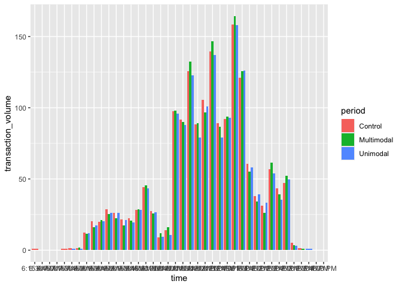

Cleaning and Analysis
================

## Packages

``` r
library(ggpubr)
```

    ## Loading required package: ggplot2

``` r
library(ggsignif)
library(tidyverse)
```

    ## ── Attaching core tidyverse packages ──────────────────────── tidyverse 2.0.0 ──
    ## ✔ dplyr     1.1.4     ✔ readr     2.1.5
    ## ✔ forcats   1.0.0     ✔ stringr   1.5.1
    ## ✔ lubridate 1.9.3     ✔ tibble    3.2.1
    ## ✔ purrr     1.0.2     ✔ tidyr     1.3.1

    ## ── Conflicts ────────────────────────────────────────── tidyverse_conflicts() ──
    ## ✖ dplyr::filter() masks stats::filter()
    ## ✖ dplyr::lag()    masks stats::lag()
    ## ℹ Use the conflicted package (<http://conflicted.r-lib.org/>) to force all conflicts to become errors

``` r
library(viridis)
```

    ## Loading required package: viridisLite

## Data

``` r
sales_data <- read.csv("/Users/kenjinchang/github/multimodal-framework-validation/data/daily-sales-counts.csv")
foot_traffic_data <- read.csv("/Users/kenjinchang/github/multimodal-framework-validation/data/daily-sales-traffic.csv")
```

## Cleaning

### Inconsistencies between sales categories and stations

The first item we’ll have to address involves the discrepancies in how
items are categorized within the point-of-sale (POS) system and the
physical dining environment.

In particular, the “Asian,” “Grill,” and “Italian” sales categories, as
they are represented under the POS system, are—in reality—each
representing two independent station concepts: the “Ramen” and “Wok”
concepts for the “Asian” category, the “Grill” and “Quesadilla” concepts
for the “Grill” category, and the “Pasta” and “Pizza” concepts for the
“Italian” category. We will also change the “Mexican” sales category to
the “Wrap” station, as reflected by the menu signage at the physical
station.

To help incorporate these distinctions, we’ll first use the following
code chunks to tease out the nature and number of unique items listed
under each of the nine sales categories.

``` r
sales_data %>%
  group_by(sales_cat) %>%
  distinct(item) %>%
  arrange(sales_cat,item) %>%
  head(5)
```

    ## # A tibble: 5 × 2
    ## # Groups:   sales_cat [1]
    ##   sales_cat item               
    ##   <chr>     <chr>              
    ## 1 Asian     1 Entree + 1 Side  
    ## 2 Asian     1 Entree + 2 Side  
    ## 3 Asian     1 Wok Entree       
    ## 4 Asian     2 Entrees + 2 Sides
    ## 5 Asian     Add Extra Toppings

``` r
sales_data %>%
  group_by(sales_cat) %>%
  distinct(item) %>%
  count()
```

    ## # A tibble: 9 × 2
    ## # Groups:   sales_cat [9]
    ##   sales_cat     n
    ##   <chr>     <int>
    ## 1 Asian        14
    ## 2 Breakfast    14
    ## 3 Deli          1
    ## 4 Grab N Go     6
    ## 5 Grill        20
    ## 6 Italian       6
    ## 7 Mexican       6
    ## 8 Salad Bar     3
    ## 9 Soup          2

Now that we are able to quantify and reference the unique items listed
under each sales category, we will perform a series of checks to see
whether there are items—be them modifications, mains, or sides—with the
same name sold under different sales categories or, alternatively, items
with different names sold under the same sales category.

``` r
sales_data %>%
  group_by(sales_cat) %>%
  distinct(item) %>%
  arrange(item,sales_cat) 
```

    ## # A tibble: 72 × 2
    ## # Groups:   sales_cat [9]
    ##    sales_cat item                     
    ##    <chr>     <chr>                    
    ##  1 Asian     1 Entree + 1 Side        
    ##  2 Asian     1 Entree + 2 Side        
    ##  3 Asian     1 Wok Entree             
    ##  4 Asian     2 Entrees + 2 Sides      
    ##  5 Breakfast 2 Slices Toast           
    ##  6 Soup      8 oz Soup                
    ##  7 Grill     ADD Beef Patty           
    ##  8 Grill     ADD Beef Patty $2.99     
    ##  9 Grill     ADD Burger Salmon Grilled
    ## 10 Grill     ADD Cheese               
    ## # ℹ 62 more rows

From this list, we can tease out two things:

- The modification that indicates whether a guest added a beef patty to
  their order is represented differently under the “Grill” sales
  category depending on whether the sale was recorded during Fall 2024
  (i.e., “ADD Beef Patty \$2.99”) or Spring 2025 (i.e., “ADD Beef
  Patty”).

- The side order of potato tots (i.e., “Side Potato Tots”) is listed
  with the same item name under both the “Grill” sales category and the
  “Grab N Go” sales category. During Fall 2024, sales of “Side Potato
  Tots” were categorized under the “Grab N Go” sales category whereas,
  during Spring 2025, they were categorized under the “Grill” sales
  category. On a similar note, the “Fried Chicken Tenders” are
  categorized under the “Grill” sales category despite being sold at the
  “Grab N Go” sales category. Because part of our analysis relies on
  understanding how diners choose between main, side, and modification
  options at the “Grill,” specifically, we will categorize sales of
  “Fried Chicken Tenders” under the “Grab N Go” sales category and
  station downstream.

Given this, we’ll make the following changes for consistency:

- We will adjust the item name for the beef-patty modification so that
  it is consistent across the two study periods (i.e., “+ Beef Patty”).

``` r
sales_data$item <- gsub("\\$", "",sales_data$item)
sales_data <- sales_data %>%
  mutate(item=str_replace_all(item,"ADD Beef Patty 2.99","+ Beef Patty")) %>%
  mutate(item=str_replace_all(item,"ADD Beef Patty","+ Beef Patty"))
```

- We will categorize “Side Potato Tots” and “Fried Chicken Tenders”
  under the “Grab N GO” sales category across both semesters.

``` r
sales_data <- sales_data %>% 
  mutate(sales_cat=case_when(item=="Side Potato Tots"~"Grab N Go",
                             TRUE ~ sales_cat)) %>%
  mutate(sales_cat=case_when(item=="Fried Chicken Tenders"~"Grab N Go",
                             TRUE ~ sales_cat))
```

With these initial checks performed and addressed, we can now move on to
resolve the inconsistencies between sales categories and station
categories. We will accomplish this by creating a new categorical
variable, `station`, that pairs items according to the station concepts
where they are sold within the physical dining environment.

``` r
sales_data %>%
  group_by(sales_cat) %>%
  distinct(item) %>%
  arrange(sales_cat,item) 
```

    ## # A tibble: 70 × 2
    ## # Groups:   sales_cat [9]
    ##    sales_cat item                       
    ##    <chr>     <chr>                      
    ##  1 Asian     1 Entree + 1 Side          
    ##  2 Asian     1 Entree + 2 Side          
    ##  3 Asian     1 Wok Entree               
    ##  4 Asian     2 Entrees + 2 Sides        
    ##  5 Asian     Add Extra Toppings         
    ##  6 Asian     Bowl Ramen Chicken         
    ##  7 Asian     Bowl Ramen Pork            
    ##  8 Asian     Bowl Ramen Tofu            
    ##  9 Asian     Side Fried Spring Roll     
    ## 10 Asian     Side Vegetable Spring Rolls
    ## # ℹ 60 more rows

``` r
sales_data <- sales_data %>% 
  mutate(station=case_when(item=="1 Entree + 1 Side"~"Wok",
                           item=="1 Entree + 2 Side"~"Wok",
                           item=="1 Wok Entree"~"Wok",
                           item=="2 Entrees + 2 Sides"~"Wok",
                           item=="Add Extra Toppings"~"Ramen",
                           item=="Bowl Ramen Chicken"~"Ramen",
                           item=="Bowl Ramen Pork"~"Ramen",
                           item=="Bowl Ramen Tofu"~"Ramen",
                           item=="Side Fried Spring Roll"~"Wok",
                           item=="Side Vegetable Spring Rolls"~"Wok",
                           item=="Side Vegetables"~"Wok",
                           item=="Side Vegetarian Fried Rice with"~"Wok",
                           item=="Side Vegetarian Lo Mein"~"Wok",
                           item=="Side White or Brown Rice"~"Wok",
                           item=="2 Slices Toast"~"Breakfast",
                           item=="Add Bacon"~"Breakfast",
                           item=="Burrito Breakfast"~"Breakfast",
                           item=="Egg Cheese Bacon Breakfast Sandw"~"Breakfast",
                           item=="Egg Cheese Sausage Breakfast San"~"Breakfast",
                           item=="Grand Slam Breakfast"~"Breakfast",
                           item=="PC Butter"~"Breakfast",
                           item=="PC Jelly"~"Breakfast",
                           item=="PC Peanut Butter"~"Breakfast",
                           item=="Pancake Single"~"Breakfast",
                           item=="Small French Omelet"~"Breakfast",
                           item=="Toast"~"Breakfast",
                           item=="Trillium Home Fries"~"Breakfast",
                           item=="Two Eggs"~"Breakfast",
                           item=="LTO Sandwich"~"Deli",
                           item=="Burrito Breakfast G&G"~"Grab N Go",
                           item=="Egg Cheese Bacon Breakfast Sandwich"~"Grab N Go",
                           item=="Egg Cheese Sausage Breakfast Sandwich"~"Grab N Go",
                           item=="LTO Meatball Sub"~"Grab N Go",
                           item=="LTO Spicy Chicken Sandwich"~"Grab N Go",
                           item=="Side Potato Tots"~"Grab N Go",
                           item=="+ Beef Patty"~"Grill",
                           item=="ADD Burger Salmon Grilled"~"Grill",
                           item=="ADD Cheese"~"Grill",
                           item=="ADD Chicken Breast"~"Grill",
                           item=="Add Egg .99"~"Grill",
                           item=="Add Impossible Burger Patty"~"Grill",
                           item=="Add Sausage 2 Patty"~"Grill",
                           item=="Black Bean Burger"~"Grill",
                           item=="Burrito Una Mano Trillium BYO"~"Quesadilla",
                           item=="French Fries"~"Grill",
                           item=="Fried Chicken Tenders"~"Grab N Go",
                           item=="Grilled Chicken Breast Sandwich"~"Grill",
                           item=="Grilled Hamburger"~"Grill",
                           item=="Quesadilla Cheese"~"Quesadilla",
                           item=="Quesadilla Deluxe Trillium"~"Quesadilla",
                           item=="Seared Salmon Burger"~"Grill",
                           item=="Sweet Potato Fries"~"Grill",
                           item=="Trillium Grill Impossible Burger"~"Grill",
                           item=="Add Extra Meat"~"Pasta",
                           item=="Create Your Pasta Bowl MEAT"~"Pasta",
                           item=="Create Your Pasta Bowl VEG"~"Pasta",
                           item=="Pizza Cheese"~"Pizza",
                           item=="Pizza with Toppings"~"Pizza",
                           item=="Side Bread Pasta Station"~"Pasta",
                           item=="Add Extra Toppings Una Mano"~"Wrap",
                           item=="Burrito Bowl BYO"~"Wrap",
                           item=="Side Guacamole"~"Wrap",
                           item=="Side Salsa"~"Wrap",
                           item=="Side Sour Cream"~"Wrap",
                           item=="Single Taco"~"Wrap",
                           item=="Add Extra Protein 2.99"~"Salad Bar",
                           item=="Add Extra Protein 3.99"~"Salad Bar",
                           item=="Salad by the Pound"~"Salad Bar",
                           item=="8 oz Soup"~"Soup",
                           item=="Soup 12 oz"~"Soup"))
```

Then, we perform a few quick checks to ensure all of the items were
properly coded.

``` r
sum(is.na(sales_data$station))
```

    ## [1] 0

``` r
sales_data %>%
  distinct(station)
```

    ##       station
    ## 1  Quesadilla
    ## 2       Grill
    ## 3   Grab N Go
    ## 4         Wok
    ## 5       Ramen
    ## 6       Pasta
    ## 7       Pizza
    ## 8   Breakfast
    ## 9        Wrap
    ## 10  Salad Bar
    ## 11       Soup
    ## 12       Deli

### Correcting known input errors

Upon receiving the sales data, we corresponded with our research
partners to clarify the sales of certain items that did not appear on
either the altered or control menus. In particular, we noted that, at
the “Ramen” station, there were recorded sales of “Bowl Ramen Pork,”
despite “Bowl Ramen Pork” not being an option within the dining
environment. Our partners clarified that these were likely input errors
that occurred at the register, and that we should map those purchases
onto sales of “Bowl Ramen Chicken,” as opposed to “Bowl Ramen Tofu,” on
the basis that it was more likely that a sales assistant would
misidentify chicken as pork.

We make these adjustments below, knowing that we will later have to make
additional changes so that the counts on days where there are recorded
sales for both “Bowl Ramen Chicken” and “Bowl Ramen Pork” are collapsed:

``` r
sales_data <- sales_data %>% 
  mutate(item=str_replace_all(item,"Bowl Ramen Pork","Bowl Ramen Chicken")) 
```

### Distinguishing between mains, modifications, and sides

In the interest of separating our analysis between the different types
of items listed within our sales data, we will create a new categorical
variable, `item_cat` specifying each sales tally according to whether
the item references the sale of a side, a main, or a modification made
to a main.

``` r
sales_data <- sales_data %>%
  mutate(item_cat=case_when(item=="1 Entree + 1 Side"~"Main",
                           item=="1 Entree + 2 Side"~"Main",
                           item=="1 Wok Entree"~"Main",
                           item=="2 Entrees + 2 Sides"~"Main",
                           item=="Add Extra Toppings"~"Modification",
                           item=="Bowl Ramen Chicken"~"Main",
                           item=="Bowl Ramen Pork"~"Main",
                           item=="Bowl Ramen Tofu"~"Main",
                           item=="Side Fried Spring Roll"~"Side",
                           item=="Side Vegetable Spring Rolls"~"Side",
                           item=="Side Vegetables"~"Side",
                           item=="Side Vegetarian Fried Rice with"~"Side",
                           item=="Side Vegetarian Lo Mein"~"Side",
                           item=="Side White or Brown Rice"~"Side",
                           item=="2 Slices Toast"~"Side",
                           item=="Add Bacon"~"Modification",
                           item=="Burrito Breakfast"~"Main",
                           item=="Egg Cheese Bacon Breakfast Sandw"~"Main",
                           item=="Egg Cheese Sausage Breakfast San"~"Main",
                           item=="Grand Slam Breakfast"~"Main",
                           item=="PC Butter"~"Side",
                           item=="PC Jelly"~"Side",
                           item=="PC Peanut Butter"~"Side",
                           item=="Pancake Single"~"Side",
                           item=="Small French Omelet"~"Side",
                           item=="Toast"~"Side",
                           item=="Trillium Home Fries"~"Side",
                           item=="Two Eggs"~"Side",
                           item=="LTO Sandwich"~"Main",
                           item=="Burrito Breakfast G&G"~"Main",
                           item=="Egg Cheese Bacon Breakfast Sandwich"~"Main",
                           item=="Egg Cheese Sausage Breakfast Sandwich"~"Main",
                           item=="LTO Meatball Sub"~"Main",
                           item=="LTO Spicy Chicken Sandwich"~"Main",
                           item=="Side Potato Tots"~"Side",
                           item=="+ Beef Patty"~"Modification",
                           item=="ADD Burger Salmon Grilled"~"Modification",
                           item=="ADD Cheese"~"Modification",
                           item=="ADD Chicken Breast"~"Modification",
                           item=="Add Egg .99"~"Modification",
                           item=="Add Impossible Burger Patty"~"Modification",
                           item=="Add Sausage 2 Patty"~"Modification",
                           item=="Black Bean Burger"~"Main",
                           item=="Burrito Una Mano Trillium BYO"~"Main",
                           item=="French Fries"~"Side",
                           item=="Fried Chicken Tenders"~"Side",
                           item=="Grilled Chicken Breast Sandwich"~"Main",
                           item=="Grilled Hamburger"~"Main",
                           item=="Quesadilla Cheese"~"Main",
                           item=="Quesadilla Deluxe Trillium"~"Main",
                           item=="Seared Salmon Burger"~"Main",
                           item=="Sweet Potato Fries"~"Side",
                           item=="Trillium Grill Impossible Burger"~"Main",
                           item=="Add Extra Meat"~"Modification",
                           item=="Create Your Pasta Bowl MEAT"~"Main",
                           item=="Create Your Pasta Bowl VEG"~"Main",
                           item=="Pizza Cheese"~"Main",
                           item=="Pizza with Toppings"~"Main",
                           item=="Side Bread Pasta Station"~"Side",
                           item=="Add Extra Toppings Una Mano"~"Modification",
                           item=="Burrito Bowl BYO"~"Main",
                           item=="Side Guacamole"~"Side",
                           item=="Side Salsa"~"Side",
                           item=="Side Sour Cream"~"Side",
                           item=="Single Taco"~"Main",
                           item=="Add Extra Protein 2.99"~"Modification",
                           item=="Add Extra Protein 3.99"~"Modification",
                           item=="Salad by the Pound"~"Main",
                           item=="8 oz Soup"~"Main",
                           item=="Soup 12 oz"~"Main"))
write.csv(sales_data,"/Users/kenjinchang/github/multimodal-framework-validation/data/cleaned_daily-sales-traffic.csv")
```

As we did before, we will perform a series of checks to ensure the new
variable was coded as intended.

``` r
sum(is.na(sales_data$item_cat))
```

    ## [1] 0

``` r
sales_data %>%
  distinct(item_cat)
```

    ##       item_cat
    ## 1         Main
    ## 2         Side
    ## 3 Modification

With these global changes to the larger sales=count dataset
incorporated, we can now separate the data according to observation
period.

### Foot Traffic

``` r
foot_traffic_data %>%
  select(date,time,count,period) %>%
  distinct(time)
```

    ##        time
    ## 1  10:00 AM
    ## 2  10:15 AM
    ## 3  10:30 AM
    ## 4  10:45 AM
    ## 5  11:00 AM
    ## 6  11:15 AM
    ## 7  11:30 AM
    ## 8  11:45 AM
    ## 9  12:00 PM
    ## 10 12:15 PM
    ## 11 12:30 PM
    ## 12 12:45 PM
    ## 13  1:00 PM
    ## 14  1:15 PM
    ## 15  1:30 PM
    ## 16  1:45 PM
    ## 17  2:00 PM
    ## 18  2:15 PM
    ## 19  2:30 PM
    ## 20  2:45 PM
    ## 21  3:00 PM
    ## 22  8:00 AM
    ## 23  8:15 AM
    ## 24  8:30 AM
    ## 25  8:45 AM
    ## 26  9:00 AM
    ## 27  9:15 AM
    ## 28  9:30 AM
    ## 29  9:45 AM
    ## 30  7:30 AM
    ## 31  7:45 AM
    ## 32  3:15 PM
    ## 33  7:15 AM
    ## 34  4:00 PM
    ## 35  6:15 AM
    ## 36  3:30 PM

``` r
foot_traffic_data %>%
  select(date,time,count,period) %>%
  group_by(period,time) %>%
  summarise(transaction_volume=mean(count)) 
```

    ## `summarise()` has grouped output by 'period'. You can override using the
    ## `.groups` argument.

    ## # A tibble: 98 × 3
    ## # Groups:   period [3]
    ##    period  time     transaction_volume
    ##    <chr>   <chr>                 <dbl>
    ##  1 Control 10:00 AM              44.5 
    ##  2 Control 10:15 AM              27.7 
    ##  3 Control 10:30 AM               8.82
    ##  4 Control 10:45 AM              14.0 
    ##  5 Control 11:00 AM              97.6 
    ##  6 Control 11:15 AM              91.5 
    ##  7 Control 11:30 AM             126.  
    ##  8 Control 11:45 AM              88.4 
    ##  9 Control 12:00 PM             106.  
    ## 10 Control 12:15 PM             140.  
    ## # ℹ 88 more rows

``` r
head(5)
```

    ## [1] 5

``` r
foot_traffic_data %>%
  select(date,time,count,period) %>%
  group_by(period,time) %>%
  summarise(transaction_volume=mean(count)) %>%
  ggplot(aes(x=time,y=transaction_volume,fill=period)) + 
  geom_col(position="dodge") +
  scale_x_discrete(limits=c("6:15 AM","6:30 AM","6:45 AM","7:00 AM","7:15 AM","7:30 AM","7:45 AM","8:00 AM","8:15 AM","8:30 AM","8:45 AM","9:00 AM","9:15 AM","9:30 AM","9:45 AM","10:00 AM","10:15 AM","10:30 AM","10:45 AM","11:00 AM","11:15 AM","11:30 AM","11:45 AM","12:00 PM","12:15 PM","12:30 PM","12:45 PM","1:00 PM","1:15 PM","1:30 PM","1:45 PM","2:00 PM","2:15 PM","2:30 PM","2:45 PM","3:00 PM","3:15 PM","3:30 PM","3:45 PM","4:00 PM"))
```

    ## `summarise()` has grouped output by 'period'. You can override using the
    ## `.groups` argument.

<!-- -->

sales_data %\>% mutate(item_cat=case_when(item==“Quesadilla Deluxe
Trillium”~“Main”, item==“Grilled Hamburger”~“Main”, item==“Fried Chicken
Tenders”~“Main”, item==“Burrito Una Mano Trillium BYO”~“Main”,
item==“French Fries”~“Side”, item==“Quesadilla Cheese”~“Ma
