Cleaning and Analysis
================

## Packages

``` r
library(ggpubr)
```

    ## Loading required package: ggplot2

``` r
library(ggsignif)
library(tidyverse)
```

    ## ── Attaching core tidyverse packages ──────────────────────── tidyverse 2.0.0 ──
    ## ✔ dplyr     1.1.4     ✔ readr     2.1.5
    ## ✔ forcats   1.0.0     ✔ stringr   1.5.1
    ## ✔ lubridate 1.9.3     ✔ tibble    3.2.1
    ## ✔ purrr     1.0.2     ✔ tidyr     1.3.1

    ## ── Conflicts ────────────────────────────────────────── tidyverse_conflicts() ──
    ## ✖ dplyr::filter() masks stats::filter()
    ## ✖ dplyr::lag()    masks stats::lag()
    ## ℹ Use the conflicted package (<http://conflicted.r-lib.org/>) to force all conflicts to become errors

``` r
library(viridis)
```

    ## Loading required package: viridisLite

## Data

``` r
sales_data <- read.csv("/Users/kenjinchang/github/multimodal-framework-validation/data/daily-sales-counts.csv") 
foot_traffic_data <- read.csv("/Users/kenjinchang/github/multimodal-framework-validation/data/daily-sales-traffic.csv")
emissions_data <- read.csv("/Users/kenjinchang/github/multimodal-framework-validation/data/parent-data/item-kg-co2e.csv")
water_data <- read.csv("/Users/kenjinchang/github/multimodal-framework-validation/data/parent-data/item-l-h2o-blue.csv")
historical_data <- read.csv("/Users/kenjinchang/github/multimodal-framework-validation/data/parent-data/historical-transaction-volume.csv")
ingredient_level_footprint_data <- read.csv("/Users/kenjinchang/github/multimodal-framework-validation/data/parent-data/ingredient-level-footprint-calculations.csv")
```

## Cleaning (Global)

### Inconsistencies between sales categories and stations

The first item we’ll have to address involves the discrepancies in how
items are categorized within the point-of-sale (POS) system and the
physical dining environment.

In particular, the “Asian,” “Grill,” and “Italian” sales categories, as
they are represented within `sales_data` by the POS system, are—in
reality—each representing two independent station concepts: the “Ramen”
and “Wok” concepts for the “Asian” category, the “Grill” and
“Quesadilla” concepts for the “Grill” category, and the “Pasta” and
“Pizza” concepts for the “Italian” category. We will also make
corresponding changes to the “Mexican” sales category, which flags sales
from the “Wrap” station concept.

To help us incorporate this information, we’ll first use the following
code chunks to tease out both the names and number of unique items
listed under each of the nine sales categories.

``` r
sales_data %>%
  group_by(sales_cat) %>%
  distinct(item) %>%
  arrange(sales_cat,item) %>%
  head(5)
```

    ## # A tibble: 5 × 2
    ## # Groups:   sales_cat [1]
    ##   sales_cat item               
    ##   <chr>     <chr>              
    ## 1 Asian     1 Entree + 1 Side  
    ## 2 Asian     1 Entree + 2 Side  
    ## 3 Asian     1 Wok Entree       
    ## 4 Asian     2 Entrees + 2 Sides
    ## 5 Asian     Add Extra Toppings

``` r
sales_data %>%
  group_by(sales_cat) %>%
  distinct(item) %>%
  count()
```

    ## # A tibble: 9 × 2
    ## # Groups:   sales_cat [9]
    ##   sales_cat     n
    ##   <chr>     <int>
    ## 1 Asian        14
    ## 2 Breakfast    14
    ## 3 Deli          1
    ## 4 Grab N Go     6
    ## 5 Grill        20
    ## 6 Italian       6
    ## 7 Mexican       6
    ## 8 Salad Bar     3
    ## 9 Soup          2

With these, we are able to easily reference the information needed to
perform two initial checks: one to see whether there are identical
items—be them modifications, mains, or sides—with the same name sold
under different sales categories and another to see if there are
identical items with different names sold under the same sales category.

``` r
sales_data %>%
  group_by(sales_cat) %>%
  distinct(item) %>%
  arrange(item,sales_cat) 
```

    ## # A tibble: 72 × 2
    ## # Groups:   sales_cat [9]
    ##    sales_cat item                     
    ##    <chr>     <chr>                    
    ##  1 Asian     1 Entree + 1 Side        
    ##  2 Asian     1 Entree + 2 Side        
    ##  3 Asian     1 Wok Entree             
    ##  4 Asian     2 Entrees + 2 Sides      
    ##  5 Breakfast 2 Slices Toast           
    ##  6 Soup      8 oz Soup                
    ##  7 Grill     ADD Beef Patty           
    ##  8 Grill     ADD Beef Patty $2.99     
    ##  9 Grill     ADD Burger Salmon Grilled
    ## 10 Grill     ADD Cheese               
    ## # ℹ 62 more rows

From these initial checks, we can tease out a few things:

- The modification used to indicate whether a guest added a beef patty
  to their order is represented differently under the “Grill” sales
  category depending on whether the sale was made during Fall 2024
  (i.e., “ADD Beef Patty \$2.99”) or Spring 2025 (i.e., “ADD Beef
  Patty”).

- “Side Potato Tots” is listed with the same name under both the “Grill”
  sales category and the “Grab N Go” sales category. During Fall 2024,
  “Side Potato Tots” sales were categorized under the “Grab N Go” sales
  category whereas, during Spring 2025, they were categorized under
  “Grill.”

Furthermore, from our understanding of how the listed items are
physically arranged within the dining context, we can also use these
checks to determine whether there are items that are represented
consistently both within and across sales categories but filed under a
category other than the one that where they are sold.

- “Fried Chicken Tenders” are categorized under the “Grill” sales
  category despite being sold alongside the items listed under “Grab N
  Go.” Because part of our analysis relies on understanding how diners
  choose between main, side, and modification options at the “Grill,”
  specifically, we will instead opt to file sales of “Fried Chicken
  Tenders” under “Grab N Go.”

Given this, we’ll make the following changes for consistency:

- We will adjust the item name for the beef-patty modification so that
  it is consistent across the two study periods (i.e., “+ Beef Patty”).

``` r
sales_data$item <- gsub("\\$", "",sales_data$item)
sales_data <- sales_data %>%
  mutate(item=str_replace_all(item,"ADD Beef Patty 2.99","+ Beef Patty")) %>%
  mutate(item=str_replace_all(item,"ADD Beef Patty","+ Beef Patty"))
```

- We will categorize “Side Potato Tots” and “Fried Chicken Tenders”
  under the “Grab N Go” sales category across both study periods.

``` r
sales_data <- sales_data %>% 
  mutate(sales_cat=case_when(item=="Side Potato Tots"~"Grab N Go",
                             TRUE ~ sales_cat)) %>%
  mutate(sales_cat=case_when(item=="Fried Chicken Tenders"~"Grab N Go",
                             TRUE ~ sales_cat))
```

With these initial checks performed, and the prescribed changes
addressed, we can now move on to resolve the inconsistencies between the
sales categories created via the POS system and the station concepts
where those items are actually sold. We will accomplish this by creating
a new categorical variable, `station`, that pairs items according to the
stations where they are sold within the physical dining environment.

``` r
sales_data %>%
  group_by(sales_cat) %>%
  distinct(item) %>%
  arrange(sales_cat,item) 
```

    ## # A tibble: 70 × 2
    ## # Groups:   sales_cat [9]
    ##    sales_cat item                       
    ##    <chr>     <chr>                      
    ##  1 Asian     1 Entree + 1 Side          
    ##  2 Asian     1 Entree + 2 Side          
    ##  3 Asian     1 Wok Entree               
    ##  4 Asian     2 Entrees + 2 Sides        
    ##  5 Asian     Add Extra Toppings         
    ##  6 Asian     Bowl Ramen Chicken         
    ##  7 Asian     Bowl Ramen Pork            
    ##  8 Asian     Bowl Ramen Tofu            
    ##  9 Asian     Side Fried Spring Roll     
    ## 10 Asian     Side Vegetable Spring Rolls
    ## # ℹ 60 more rows

``` r
sales_data <- sales_data %>% 
  mutate(station=case_when(item=="1 Entree + 1 Side"~"Wok",
                           item=="1 Entree + 2 Side"~"Wok",
                           item=="1 Wok Entree"~"Wok",
                           item=="2 Entrees + 2 Sides"~"Wok",
                           item=="Add Extra Toppings"~"Ramen",
                           item=="Bowl Ramen Chicken"~"Ramen",
                           item=="Bowl Ramen Pork"~"Ramen",
                           item=="Bowl Ramen Tofu"~"Ramen",
                           item=="Side Fried Spring Roll"~"Wok",
                           item=="Side Vegetable Spring Rolls"~"Wok",
                           item=="Side Vegetables"~"Wok",
                           item=="Side Vegetarian Fried Rice with"~"Wok",
                           item=="Side Vegetarian Lo Mein"~"Wok",
                           item=="Side White or Brown Rice"~"Wok",
                           item=="2 Slices Toast"~"Breakfast",
                           item=="Add Bacon"~"Breakfast",
                           item=="Burrito Breakfast"~"Breakfast",
                           item=="Egg Cheese Bacon Breakfast Sandw"~"Breakfast",
                           item=="Egg Cheese Sausage Breakfast San"~"Breakfast",
                           item=="Grand Slam Breakfast"~"Breakfast",
                           item=="PC Butter"~"Breakfast",
                           item=="PC Jelly"~"Breakfast",
                           item=="PC Peanut Butter"~"Breakfast",
                           item=="Pancake Single"~"Breakfast",
                           item=="Small French Omelet"~"Breakfast",
                           item=="Toast"~"Breakfast",
                           item=="Trillium Home Fries"~"Breakfast",
                           item=="Two Eggs"~"Breakfast",
                           item=="LTO Sandwich"~"Deli",
                           item=="Burrito Breakfast G&G"~"Grab N Go",
                           item=="Egg Cheese Bacon Breakfast Sandwich"~"Grab N Go",
                           item=="Egg Cheese Sausage Breakfast Sandwich"~"Grab N Go",
                           item=="LTO Meatball Sub"~"Grab N Go",
                           item=="LTO Spicy Chicken Sandwich"~"Grab N Go",
                           item=="Side Potato Tots"~"Grab N Go",
                           item=="+ Beef Patty"~"Grill",
                           item=="ADD Burger Salmon Grilled"~"Grill",
                           item=="ADD Cheese"~"Grill",
                           item=="ADD Chicken Breast"~"Grill",
                           item=="Add Egg .99"~"Grill",
                           item=="Add Impossible Burger Patty"~"Grill",
                           item=="Add Sausage 2 Patty"~"Grill",
                           item=="Black Bean Burger"~"Grill",
                           item=="Burrito Una Mano Trillium BYO"~"Quesadilla",
                           item=="French Fries"~"Grill",
                           item=="Fried Chicken Tenders"~"Grab N Go",
                           item=="Grilled Chicken Breast Sandwich"~"Grill",
                           item=="Grilled Hamburger"~"Grill",
                           item=="Quesadilla Cheese"~"Quesadilla",
                           item=="Quesadilla Deluxe Trillium"~"Quesadilla",
                           item=="Seared Salmon Burger"~"Grill",
                           item=="Sweet Potato Fries"~"Grill",
                           item=="Trillium Grill Impossible Burger"~"Grill",
                           item=="Add Extra Meat"~"Pasta",
                           item=="Create Your Pasta Bowl MEAT"~"Pasta",
                           item=="Create Your Pasta Bowl VEG"~"Pasta",
                           item=="Pizza Cheese"~"Pizza",
                           item=="Pizza with Toppings"~"Pizza",
                           item=="Side Bread Pasta Station"~"Pasta",
                           item=="Add Extra Toppings Una Mano"~"Wrap",
                           item=="Burrito Bowl BYO"~"Wrap",
                           item=="Side Guacamole"~"Wrap",
                           item=="Side Salsa"~"Wrap",
                           item=="Side Sour Cream"~"Wrap",
                           item=="Single Taco"~"Wrap",
                           item=="Add Extra Protein 2.99"~"Salad Bar",
                           item=="Add Extra Protein 3.99"~"Salad Bar",
                           item=="Salad by the Pound"~"Salad Bar",
                           item=="8 oz Soup"~"Soup",
                           item=="Soup 12 oz"~"Soup"))
```

Then, we perform a few quick checks to ensure all of the items were
coded as intended, without duplicates or typos.

``` r
sum(is.na(sales_data$station))
```

    ## [1] 0

``` r
sales_data %>%
  distinct(station)
```

    ##       station
    ## 1  Quesadilla
    ## 2       Grill
    ## 3   Grab N Go
    ## 4         Wok
    ## 5       Ramen
    ## 6       Pasta
    ## 7       Pizza
    ## 8   Breakfast
    ## 9        Wrap
    ## 10  Salad Bar
    ## 11       Soup
    ## 12       Deli

### Correcting known input errors

For the next stage of our cleaning process, we corresponded with our
research partners at the dining facility to clarify how we ought to
treat the sales of items that were noticeably absent from the previously
reviewed dining menus. In particular, we noted that, at the “Ramen”
station, there were recorded sales of “Bowl Ramen Pork,” despite this
not being an advertised offering within the dining facility during
either of the two study periods.

Our site partners noted that these were likely input errors that
occurred at the register, in part because it was a previously programmed
option to accommodate sales of this item during a prior time period.
They correspondingly advised that we should map those purchases onto
sales of “Bowl Ramen Chicken,” as opposed to “Bowl Ramen Tofu,” on the
basis that it was more likely that a sales assistant would visually
misidentify chicken as pork—as opposed to tofu-at check-out.

As such, we make the following change:

``` r
sales_data <- sales_data %>% 
  mutate(item=str_replace_all(item,"Bowl Ramen Pork","Bowl Ramen Chicken")) 
```

### Distinguishing between mains, modifications, and sides

In the interest of separating our analysis between the different types
of items listed within `sales_data`, we will create a new categorical
variable, `item_cat` specifying each sales tally according to whether
the item references the sale of a side, a main, or a modification made
to a main.

``` r
sales_data <- sales_data %>%
  mutate(item_cat=case_when(item=="1 Entree + 1 Side"~"Main",
                           item=="1 Entree + 2 Side"~"Main",
                           item=="1 Wok Entree"~"Main",
                           item=="2 Entrees + 2 Sides"~"Main",
                           item=="Add Extra Toppings"~"Modification",
                           item=="Bowl Ramen Chicken"~"Main",
                           item=="Bowl Ramen Pork"~"Main",
                           item=="Bowl Ramen Tofu"~"Main",
                           item=="Side Fried Spring Roll"~"Side",
                           item=="Side Vegetable Spring Rolls"~"Side",
                           item=="Side Vegetables"~"Side",
                           item=="Side Vegetarian Fried Rice with"~"Side",
                           item=="Side Vegetarian Lo Mein"~"Side",
                           item=="Side White or Brown Rice"~"Side",
                           item=="2 Slices Toast"~"Side",
                           item=="Add Bacon"~"Modification",
                           item=="Burrito Breakfast"~"Main",
                           item=="Egg Cheese Bacon Breakfast Sandw"~"Main",
                           item=="Egg Cheese Sausage Breakfast San"~"Main",
                           item=="Grand Slam Breakfast"~"Main",
                           item=="PC Butter"~"Side",
                           item=="PC Jelly"~"Side",
                           item=="PC Peanut Butter"~"Side",
                           item=="Pancake Single"~"Side",
                           item=="Small French Omelet"~"Side",
                           item=="Toast"~"Side",
                           item=="Trillium Home Fries"~"Side",
                           item=="Two Eggs"~"Side",
                           item=="LTO Sandwich"~"Main",
                           item=="Burrito Breakfast G&G"~"Main",
                           item=="Egg Cheese Bacon Breakfast Sandwich"~"Main",
                           item=="Egg Cheese Sausage Breakfast Sandwich"~"Main",
                           item=="LTO Meatball Sub"~"Main",
                           item=="LTO Spicy Chicken Sandwich"~"Main",
                           item=="Side Potato Tots"~"Side",
                           item=="+ Beef Patty"~"Modification",
                           item=="ADD Burger Salmon Grilled"~"Modification",
                           item=="ADD Cheese"~"Modification",
                           item=="ADD Chicken Breast"~"Modification",
                           item=="Add Egg .99"~"Modification",
                           item=="Add Impossible Burger Patty"~"Modification",
                           item=="Add Sausage 2 Patty"~"Modification",
                           item=="Black Bean Burger"~"Main",
                           item=="Burrito Una Mano Trillium BYO"~"Main",
                           item=="French Fries"~"Side",
                           item=="Fried Chicken Tenders"~"Side",
                           item=="Grilled Chicken Breast Sandwich"~"Main",
                           item=="Grilled Hamburger"~"Main",
                           item=="Quesadilla Cheese"~"Main",
                           item=="Quesadilla Deluxe Trillium"~"Main",
                           item=="Seared Salmon Burger"~"Main",
                           item=="Sweet Potato Fries"~"Side",
                           item=="Trillium Grill Impossible Burger"~"Main",
                           item=="Add Extra Meat"~"Modification",
                           item=="Create Your Pasta Bowl MEAT"~"Main",
                           item=="Create Your Pasta Bowl VEG"~"Main",
                           item=="Pizza Cheese"~"Main",
                           item=="Pizza with Toppings"~"Main",
                           item=="Side Bread Pasta Station"~"Side",
                           item=="Add Extra Toppings Una Mano"~"Modification",
                           item=="Burrito Bowl BYO"~"Main",
                           item=="Side Guacamole"~"Side",
                           item=="Side Salsa"~"Side",
                           item=="Side Sour Cream"~"Side",
                           item=="Single Taco"~"Main",
                           item=="Add Extra Protein 2.99"~"Modification",
                           item=="Add Extra Protein 3.99"~"Modification",
                           item=="Salad by the Pound"~"Main",
                           item=="8 oz Soup"~"Main",
                           item=="Soup 12 oz"~"Main"))
```

As we did before, we will perform a series of checks to ensure the new
variable was coded as intended.

``` r
sum(is.na(sales_data$item_cat))
```

    ## [1] 0

``` r
sales_data %>%
  distinct(item_cat)
```

    ##       item_cat
    ## 1         Main
    ## 2         Side
    ## 3 Modification

### Distinguishing between meal periods and treatment and non-treatment stations

We use the following code chunks to, first, list out each of the
relevant stations and, subsequently, designate them (using
`station_type`) as either satellite (i.e., used to measure effects on
sales outside of the treated stations) or treatment-receiving (i.e.,used
to measure within-station changes in food choice). More specifically,
this will offer us an initial, within-period indicator of reactance
(i.e., whether there are decreases in sales that temporally correlate
with the implementation of any of the various treatment-menu
conditions).

``` r
sales_data %>%
  distinct(station) %>%
  arrange(station)
```

    ##       station
    ## 1   Breakfast
    ## 2        Deli
    ## 3   Grab N Go
    ## 4       Grill
    ## 5       Pasta
    ## 6       Pizza
    ## 7  Quesadilla
    ## 8       Ramen
    ## 9   Salad Bar
    ## 10       Soup
    ## 11        Wok
    ## 12       Wrap

``` r
sales_data <- sales_data %>%
  mutate(station_type=case_when(station=="Breakfast"~"Satellite",
                                station=="Deli"~"Satellite",
                                station=="Grab N Go"~"Satellite",
                                station=="Grill"~"Treatment",
                                station=="Pasta"~"Satellite",
                                station=="Pizza"~"Satellite",
                                station=="Quesadilla"~"Satellite",
                                station=="Ramen"~"Treatment",
                                station=="Salad Bar"~"Satellite",
                                station=="Soup"~"Satellite",
                                station=="Wok"~"Satellite",
                                station=="Wrap"~"Satellite")) 
```

We will additionally create a new variable, `meal_period`, to
distinguish between the different service windows represented within
`sales_data`. More specifically, to offer a contrary between-indicator
of reactance, we will use the coded categories (i.e., “Breakfast” and
“Lunch”) to monitor for whether the phases during which the different
menu conditions were implemented were associated with any decreases in
sales volumes.

``` r
sales_data <- sales_data %>%
  mutate(meal_period=case_when(station=="Breakfast"~"Breakfast",
                                station=="Deli"~"Lunch",
                                station=="Grab N Go"~"Lunch",
                                station=="Grill"~"Lunch",
                                station=="Pasta"~"Lunch",
                                station=="Pizza"~"Lunch",
                                station=="Quesadilla"~"Lunch",
                                station=="Ramen"~"Lunch",
                                station=="Salad Bar"~"Lunch",
                                station=="Soup"~"Lunch",
                                station=="Wok"~"Lunch",
                                station=="Wrap"~"Lunch")) 
```

### Mapping dish-level emissions, water, and cost estimates onto items

In our companion repo, we had—during the planning phases of this
project—collated life-cycle analysis data to estimate the carbon and
blue-water costs associated with each of the dishes on offer at the two
treated stations. In part, the purpose of this recipe modeling was to
enable precise estimations for the carbon- and water-footprint labels
used during some of the treatment phases of the study. Another virtue of
this work, however, is that it also enables us to understand how diner
food choices map on to their corresponding climate and resource costs.
In other words, we are able to use these figures to help calculate the
mean emissions and water costs associated with item sales at each
station across the various menu conditions trialed. This enables us to
reasonably detect whether the sustainability of diners’ food choices
improved during the treatment phases, outside of the simpler proportions
used to investigate whether the highest- and lowest-emitting options
were chosen less and more, respectively.

To avoid premature rounding, we will recalculate the emissions and
resource costs associated with the various mains, modifications, and
sides on offer at both the “Grill” and “Ramen” stations, rather than use
the estimates used to populate the descriptive footprint labels.

We’ll start with process by pairing each of the qualifying offerings
with their corresponding water and emissions costs. As a reminder, these
are the sales item we need to find correspond carbon- and water-cost
data for:

``` r
sales_data %>%
  filter(station=="Grill"|station=="Ramen"|station=="Pasta") %>%
  distinct(item) %>%
  arrange()
```

    ##                                item
    ## 1                 Grilled Hamburger
    ## 2                      French Fries
    ## 3   Grilled Chicken Breast Sandwich
    ## 4              Seared Salmon Burger
    ## 5  Trillium Grill Impossible Burger
    ## 6                Sweet Potato Fries
    ## 7                      + Beef Patty
    ## 8                 Black Bean Burger
    ## 9       Add Impossible Burger Patty
    ## 10                      Add Egg .99
    ## 11                       ADD Cheese
    ## 12              Add Sausage 2 Patty
    ## 13        ADD Burger Salmon Grilled
    ## 14               Bowl Ramen Chicken
    ## 15                  Bowl Ramen Tofu
    ## 16      Create Your Pasta Bowl MEAT
    ## 17       Create Your Pasta Bowl VEG
    ## 18                   Add Extra Meat
    ## 19         Side Bread Pasta Station
    ## 20               ADD Chicken Breast
    ## 21               Add Extra Toppings

We’ll begin by pairing the calculated water- and carbon-footprint
estimates to each corresponding composite item (i.e., an item comprised
of more than one ingredient, as defined by the research partner’s recipe
system):

``` r
composite_item_pairing <- ingredient_level_footprint_data %>%
  group_by(recipe) %>%
  summarise(ind_carbon_cost=sum(kg_co2e),ind_water_cost=sum(l_h2o_blue)) %>%
  filter(recipe=="[CYO Grill Component] Burger"|recipe=="[CYO Grill Component] Fries"|recipe=="[CYO Grill Component] Chicken Sandwich"|recipe=="[CYO Grill Component] Salmon Burger"|recipe=="[CYO Grill Component] Impossible Burger"|recipe=="[CYO Grill Component] Sweet Potato Fries"|recipe=="[CYO Grill Component] Black Bean Burger"|recipe=="[CYO Ramen Component] Chicken Bowl"|recipe=="[CYO Ramen Component] Tofu Bowl"|recipe=="[CYO Ramen Component] Ginger Tare") %>%
  mutate(item=case_when(recipe=="[CYO Grill Component] Black Bean Burger"~"Black Bean Burger",
                        recipe=="[CYO Grill Component] Burger"~"Grilled Hamburger",
                        recipe=="[CYO Grill Component] Chicken Sandwich"~"Grilled Chicken Breast Sandwich",
                        recipe=="[CYO Grill Component] Fries"~"French Fries",
                        recipe=="[CYO Grill Component] Impossible Burger"~"Trillium Grill Impossible Burger",
                        recipe=="[CYO Grill Component] Salmon Burger"~"Seared Salmon Burger",
                        recipe=="[CYO Grill Component] Sweet Potato Fries"~"Sweet Potato Fries",
                        recipe=="[CYO Ramen Component] Chicken Bowl"~"Bowl Ramen Chicken",
                        recipe=="[CYO Ramen Component] Ginger Tare"~"Add Extra Toppings",
                        recipe=="[CYO Ramen Component] Tofu Bowl"~"Bowl Ramen Tofu")) %>%
  select(item,ind_carbon_cost,ind_water_cost)
```

This leaves us with seven items left to pair, each of which are listed
within the recipe system as single ingredients (i.e., simple recipes).
We’ll handle the “ADD Cheese” modification separately because, unlike
the remaining six items, this option requires us to calculate the
average cost associated with each of the six different topping varieties
offered.

``` r
variable_item_pairing <- ingredient_level_footprint_data %>%
  filter(station=="Grill") %>%
  filter(recipe=="[CYO Grill Component] Toppings, American Cheese"|recipe=="[CYO Grill Component] Toppings, Cheddar Cheese"|recipe=="[CYO Grill Component] Toppings, Pepper Jack Cheese"|recipe=="[CYO Grill Component] Toppings, Provolone Cheese"|recipe=="[CYO Grill Component] Toppings, Blue Cheese"|recipe=="[CYO Grill Component] Toppings, Vegan Cheese") %>%
  select(recipe,kg_co2e,l_h2o_blue) %>% 
  mutate(item="ADD Cheese") %>%
  group_by(item) %>%
  summarise(ind_carbon_cost=mean(kg_co2e),ind_water_cost=mean(l_h2o_blue))
variable_item_pairing
```

    ## # A tibble: 1 × 3
    ##   item       ind_carbon_cost ind_water_cost
    ##   <chr>                <dbl>          <dbl>
    ## 1 ADD Cheese           0.184           3.20

PASTA - average for sauce, average for pasta, average for add meat ,
then add together

``` r
pasta_item_pairing_sauces <- ingredient_level_footprint_data %>%
  filter(station=="Pasta") %>%
  filter(recipe=="[CYO Pasta Component] Alfredo Sauce"|recipe=="[CYO Pasta Component] Creamy Spinach Alfredo Sauce"|recipe=="[CYO Pasta Component] Marinara Pasta Sauce"|recipe=="[CYO Pasta Component] Creamy Pesto Sauce"|recipe=="[CYO Pasta Component] Creamy Sun Dried Tomato Pesto Sauce"|recipe=="[CYO Pasta Component] Creamy Red Pepper Alfredo Sauce") %>%
  select(recipe,kg_co2e,l_h2o_blue) %>% 
  mutate(item="Sauces") %>%
  group_by(item) %>%
  summarise(ind_carbon_cost=mean(kg_co2e),ind_water_cost=mean(l_h2o_blue))
```

``` r
pasta_item_pairing_noodles <- ingredient_level_footprint_data %>%
  filter(station=="Pasta") %>%
  filter(recipe=="[CYO Pasta Component] Penne Pasta"|recipe=="[CYO Pasta Component] Linguine Pasta")  %>%
  select(recipe,kg_co2e,l_h2o_blue) %>% 
  mutate(item="Noodles") %>%
  group_by(item) %>%
  summarise(ind_carbon_cost=mean(kg_co2e),ind_water_cost=mean(l_h2o_blue))
```

``` r
pasta_item_pairing_veggies <- ingredient_level_footprint_data %>%
  filter(station=="Pasta") %>%
  filter(recipe=="[CYO Pasta Component] Sauteed Broccoli"|recipe=="[CYO Pasta Component] Roasted Cherry Tomatoes"|recipe=="[CYO Pasta Component] Sauteed Mushrooms"|recipe=="[CYO Pasta Component] Olive & Caper Topping"|recipe=="[CYO Pasta Component] Sauteed Onions"|recipe=="[CYO Pasta Component] Sauteed Pepper Medley"|recipe=="[CYO Pasta Component] Sauteed Zucchini & Summer Squash"|recipe=="[CYO Pasta Component] Meatless Meatballs") %>%
  select(recipe,kg_co2e,l_h2o_blue) %>% 
  mutate(item="Vegetable and Mushroom Options") %>%
  group_by(item) %>%
  summarise(ind_carbon_cost=mean(kg_co2e),ind_water_cost=mean(l_h2o_blue))
```

``` r
pasta_item_pairing_meats <- ingredient_level_footprint_data %>%
  filter(station=="Pasta") %>%
  filter(recipe=="[CYO Pasta Component] Mild Italian Sausage"|recipe=="[CYO Pasta Component] Hot Italian Pork Sausage"|recipe=="[CYO Pasta Component] Pork & Beef Meatball"|recipe=="[CYO Pasta Component] Grilled Chicken"|recipe=="[CYO Pasta Component] Breaded Chicken Breast") %>%
  select(recipe,kg_co2e,l_h2o_blue) %>% 
  mutate(item="Meat Options") %>%
  group_by(item) %>%
  summarise(ind_carbon_cost=mean(kg_co2e),ind_water_cost=mean(l_h2o_blue)) 
```

``` r
pasta_item_pairing_cheeses <- ingredient_level_footprint_data %>%
  filter(station=="Pasta") %>%
  filter(recipe=="[CYO Pasta Component] Parmesan Cheese"|recipe=="[CYO Pasta Component] Asiago Cheese") %>%
  select(recipe,kg_co2e,l_h2o_blue) %>% 
  mutate(item="Cheese Options") %>%
  group_by(item) %>%
  summarise(ind_carbon_cost=mean(kg_co2e),ind_water_cost=mean(l_h2o_blue)) 
```

``` r
pasta_item_pairing <- bind_rows(pasta_item_pairing_sauces,pasta_item_pairing_noodles,pasta_item_pairing_veggies,pasta_item_pairing_meats,pasta_item_pairing_cheeses)
```

``` r
vegetarian_pasta_pairing <- pasta_item_pairing %>%
  filter(item=="Sauces"|item=="Noodles"|item=="Vegetable and Mushroom Options"|item=="Cheese Options") %>%
  mutate(item="Create Your Pasta Bowl VEG") %>%
  group_by(item) %>%
  summarise(ind_carbon_cost=sum(ind_carbon_cost),ind_water_cost=sum(ind_water_cost))
vegetarian_pasta_pairing
```

    ## # A tibble: 1 × 3
    ##   item                       ind_carbon_cost ind_water_cost
    ##   <chr>                                <dbl>          <dbl>
    ## 1 Create Your Pasta Bowl VEG           0.140           10.6

``` r
meat_pasta_pairing <- pasta_item_pairing %>%
  mutate(item="Create Your Pasta Bowl MEAT") %>%
  group_by(item) %>%
  summarise(ind_carbon_cost=sum(ind_carbon_cost),ind_water_cost=sum(ind_water_cost))
meat_pasta_pairing
```

    ## # A tibble: 1 × 3
    ##   item                        ind_carbon_cost ind_water_cost
    ##   <chr>                                 <dbl>          <dbl>
    ## 1 Create Your Pasta Bowl MEAT           0.626           47.8

With that sorted, we can now move on to the last six remaining simple
recipes:

``` r
simple_item_pairing <- ingredient_level_footprint_data %>%
  filter(ingredient=="80/20 Beef Patty" | ingredient=="\"Impossible Burger\" Patty [Patty \"Impossible Burger\" Trillium]" | ingredient=="Bacon Pork Raw" | ingredient=="5 Oz Bnls Skinles Chicken Breast" | ingredient=="Salmon Burger Patty" | ingredient=="Egg Whole Fresh Medium Flat [Egg Sous Vide]") %>%
  select(ingredient,kg_co2e,l_h2o_blue) %>%
  mutate(item=case_when(ingredient=="80/20 Beef Patty"~"+ Beef Patty",
                        ingredient=="5 Oz Bnls Skinles Chicken Breast"~"ADD Chicken Breast",
                        ingredient=="Salmon Burger Patty"~"ADD Burger Salmon Grilled",
                        ingredient=="\"Impossible Burger\" Patty [Patty \"Impossible Burger\" Trillium]"~"Add Impossible Burger Patty",
                        ingredient=="Bacon Pork Raw"~"Add Sausage 2 Patty",
                        ingredient=="Egg Whole Fresh Medium Flat [Egg Sous Vide]"~"Add Egg .99")) %>%
  rename(ind_carbon_cost=kg_co2e,ind_water_cost=l_h2o_blue) %>%
  select(item,ind_carbon_cost,ind_water_cost) %>%
  distinct()
```

Now that we’ve mapped the corresponding emissions- and resource-costs
associated with each of the items offered at the treatment station (and
control station), we can perform a join to incorporate this information
into `sales_data`. Before that, though, we need to add the monetary
costs of each item, too, to help us understand whether sales revenue
varied across the different menu conditions trialled.

While we have most of the pricing information available to accomplish
this, we assume a flat 2.99 fee for all additional patty modifications,
with the exception of the “Add Sausage 2 Patty” modification, which
instead maps on to the bacon addition presented on the “Grill” menu. We
also assume a \$0.99 fee “Add Extra Toppings” modification at the
“Ramen” station, which maps on to the Ginger Tare that appears in our
recipe modeling.

``` r
item_pairing <- bind_rows(composite_item_pairing,variable_item_pairing,simple_item_pairing,vegetarian_pasta_pairing,meat_pasta_pairing)
item_pairing <- item_pairing %>%
  mutate(ind_dollar_cost=case_when(item=="Black Bean Burger"~8.69,
                                  item=="Grilled Hamburger"~8.99,
                                  item=="Grilled Chicken Breast Sandwich"~8.49,
                                  item=="French Fries"~2.99,
                                  item=="Trillium Grill Impossible Burger"~10.49,
                                  item=="Seared Salmon Burger"~8.49,
                                  item=="Sweet Potato Fries"~2.99,
                                  item=="Bowl Ramen Chicken"~9.49,
                                  item=="Add Extra Toppings"~.99,
                                  item=="Bowl Ramen Tofu"~9.49,
                                  item=="ADD Cheese"~1.99,
                                  item=="+ Beef Patty"~2.99,
                                  item=="ADD Chicken Breast"~2.99,
                                  item=="ADD Burger Salmon Grilled"~2.99,
                                  item=="Add Impossible Burger Patty"~2.99,
                                  item=="Add Sausage 2 Patty"~1.99,
                                  item=="Add Egg .99"~.99,
                                  item=="Create Your Pasta Bowl VEG"~8.49,
                                  item=="Create Your Pasta Bowl MEAT"~8.99))
item_pairing
```

    ## # A tibble: 19 × 4
    ##    item                           ind_carbon_cost ind_water_cost ind_dollar_cost
    ##    <chr>                                    <dbl>          <dbl>           <dbl>
    ##  1 Black Bean Burger                      0.111          55.0               8.69
    ##  2 Grilled Hamburger                      3.88           88.9               8.99
    ##  3 Grilled Chicken Breast Sandwi…         0.302          69.5               8.49
    ##  4 French Fries                           0.0408          2.73              2.99
    ##  5 Trillium Grill Impossible Bur…         0.211          23.3              10.5 
    ##  6 Seared Salmon Burger                   0.448          44.7               8.49
    ##  7 Sweet Potato Fries                     0.0423          3.98              2.99
    ##  8 Bowl Ramen Chicken                     0.380         105.                9.49
    ##  9 Add Extra Toppings                     0.00105         0.0221            0.99
    ## 10 Bowl Ramen Tofu                        0.307          92.0               9.49
    ## 11 ADD Cheese                             0.184           3.20              1.99
    ## 12 + Beef Patty                           3.81           79.9               2.99
    ## 13 ADD Chicken Breast                     0.227          60.4               2.99
    ## 14 ADD Burger Salmon Grilled              0.374          35.7               2.99
    ## 15 Add Impossible Burger Patty            0.152          13.0               2.99
    ## 16 Add Sausage 2 Patty                    0.169          34.6               1.99
    ## 17 Add Egg .99                            0.0904         25.3               0.99
    ## 18 Create Your Pasta Bowl VEG             0.140          10.6               8.49
    ## 19 Create Your Pasta Bowl MEAT            0.626          47.8               8.99

Now, we can add the individual, item-level costs for each of the mains,
modifications, and sides sold at the two treatment stations.

``` r
sales_data <- left_join(sales_data,item_pairing,join_by(item))
```

In addition to adding `ind_carbon_cost`, `ind_water_cost`, and
`ind_dollar_cost` to `sales_data`, which map on to the individual costs
of each of the items sold at the treatment stations, we will also add
`corr_carbon_cost`, `corr_water_cost`, and `corr_dollar_cost`, which
will map on to the corespoding costs of each of the items sold at the
treatment stations. These variables will instead represent the daily
aggregated costs associated with the sales of those items, based on the
total quantity sold.

``` r
sales_data <- sales_data %>%
  mutate(corr_carbon_cost=count*ind_carbon_cost) %>%
  mutate(corr_water_cost=count*ind_water_cost) %>%
  mutate(corr_dollar_cost=count*ind_dollar_cost) 
write.csv(sales_data,"/Users/kenjinchang/github/multimodal-framework-validation/data/cleaned_daily-sales-counts.csv")
```

### Separating global dataset into study-level dataasets

With these global changes to `sales_data` now incorporated, we can
separate the data according to observation period.

``` r
fall_data <- sales_data %>%
  filter(semester=="Fall 2024")
spring_data <- sales_data %>%
  filter(semester=="Spring 2025")
```

## Cleaning and Analysis (Fall 2024)

The object of the first study is to understand how diner meal choices
compared across the four menu conditions trialed. More specifically, we
wish to form these comparisons by monitoring specific changes in the
following outcome variables:

- `prop_low`: The proportion of lowest-carbon mains purchased at each
  treated station (i.e., the quotient of the number of lowest-carbon
  mains sold during each menu condition divided by the total number of
  mains sold at that station).

- `prop_high`: The proportion of highest-carbon mains purchased at each
  treated station (i.e., the quotient of the number of highest-carbon
  mains sold during each menu condition divided by the total number of
  mains sold at that station).

- `mean_carbon_cost`: The mean emissions cost across the mains, sides,
  and modifications sold at each treated station (i.e., the quotient of
  the aggregated emissions costs for the items sold at each treated
  station divided by the total number of items sold).

- `mean_spend`: The average revenue gained on mains, sides, and
  modifications at each treated station (i.e., the quotient of the
  aggregated revenue for gained for the items sold at each treated
  station divided by the total number of items sold).

### Proportion of lowest-carbon selections

``` r
fall_data %>%
  filter(station_type=="Treatment") %>%
  filter(item_cat=="Main") %>%
  group_by(menu_condition,station,item) %>%
  summarise(total_count=sum(count)) %>%
  mutate(prop_low=case_when(item=="Black Bean Burger" & menu_condition=="Carbon Label" ~ total_count/(32+159+935+74+85),
                            item=="Bowl Ramen Tofu" & menu_condition=="Carbon Label" ~ total_count/(685+135),
                            item=="Black Bean Burger" & menu_condition=="Control" ~ total_count/(19+125+776+68+60),
                            item=="Bowl Ramen Tofu" & menu_condition=="Control" ~ total_count/(563+108),
                            item=="Black Bean Burger" & menu_condition=="Default" ~ total_count/(33+167+904+76+90),
                            item=="Bowl Ramen Tofu" & menu_condition=="Default" ~ total_count/(698+172),
                            item=="Black Bean Burger" & menu_condition=="Multimodal" ~ total_count/(41+165+1157+125+107),
                            item=="Bowl Ramen Tofu" & menu_condition=="Multimodal" ~ total_count/(860+182))) %>%
  drop_na(prop_low)
```

    ## `summarise()` has grouped output by 'menu_condition', 'station'. You can
    ## override using the `.groups` argument.

    ## # A tibble: 8 × 5
    ## # Groups:   menu_condition, station [8]
    ##   menu_condition station item              total_count prop_low
    ##   <chr>          <chr>   <chr>                   <int>    <dbl>
    ## 1 Carbon Label   Grill   Black Bean Burger          32   0.0249
    ## 2 Carbon Label   Ramen   Bowl Ramen Tofu           135   0.165 
    ## 3 Control        Grill   Black Bean Burger          19   0.0181
    ## 4 Control        Ramen   Bowl Ramen Tofu           108   0.161 
    ## 5 Default        Grill   Black Bean Burger          33   0.0260
    ## 6 Default        Ramen   Bowl Ramen Tofu           172   0.198 
    ## 7 Multimodal     Grill   Black Bean Burger          41   0.0257
    ## 8 Multimodal     Ramen   Bowl Ramen Tofu           182   0.175

``` r
fall_data %>%
  filter(station_type=="Treatment") %>%
  filter(item_cat=="Main") %>%
  group_by(menu_condition,station,item) %>%
  summarise(total_count=sum(count)) %>%
  mutate(prop_low=case_when(item=="Black Bean Burger" & menu_condition=="Carbon Label" ~ total_count/(32+159+935+74+85),
                            item=="Bowl Ramen Tofu" & menu_condition=="Carbon Label" ~ total_count/(685+135),
                            item=="Black Bean Burger" & menu_condition=="Control" ~ total_count/(19+125+776+68+60),
                            item=="Bowl Ramen Tofu" & menu_condition=="Control" ~ total_count/(563+108),
                            item=="Black Bean Burger" & menu_condition=="Default" ~ total_count/(33+167+904+76+90),
                            item=="Bowl Ramen Tofu" & menu_condition=="Default" ~ total_count/(698+172),
                            item=="Black Bean Burger" & menu_condition=="Multimodal" ~ total_count/(41+165+1157+125+107),
                            item=="Bowl Ramen Tofu" & menu_condition=="Multimodal" ~ total_count/(860+182))) %>%
  drop_na(prop_low) %>%
  ggplot(aes(x=menu_condition,y=prop_low,fill=station)) +
  geom_col(position="dodge") + 
  scale_x_discrete(limits=c("Control","Carbon Label","Default","Multimodal"))
```

    ## `summarise()` has grouped output by 'menu_condition', 'station'. You can
    ## override using the `.groups` argument.

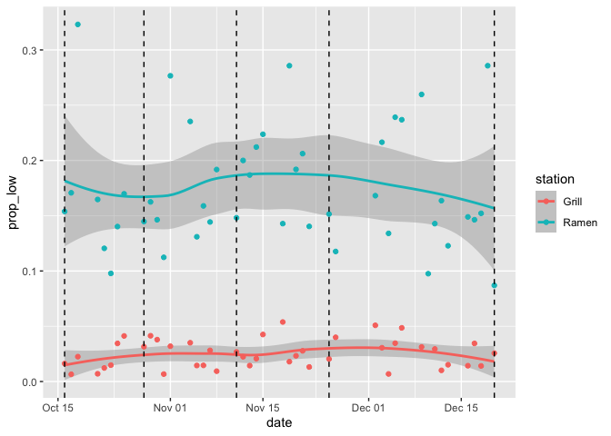<!-- -->
Grill only

``` r
fall_data %>%
  filter(station=="Grill") %>%
  filter(item_cat=="Main") %>%
  group_by(menu_condition,station,item) %>%
  summarise(total_count=sum(count)) %>%
  mutate(prop_low=case_when(item=="Black Bean Burger" & menu_condition=="Carbon Label" ~ total_count/(32+159+935+74+85),
                            item=="Black Bean Burger" & menu_condition=="Control" ~ total_count/(19+125+776+68+60),
                            item=="Black Bean Burger" & menu_condition=="Default" ~ total_count/(33+167+904+76+90),
                            item=="Black Bean Burger" & menu_condition=="Multimodal" ~ total_count/(41+165+1157+125+107))) %>%
  drop_na(prop_low) %>%
  ggplot(aes(x=menu_condition,y=prop_low,fill=station)) +
  geom_col(position="dodge") + 
  scale_x_discrete(limits=c("Control","Carbon Label","Default","Multimodal"))
```

    ## `summarise()` has grouped output by 'menu_condition', 'station'. You can
    ## override using the `.groups` argument.

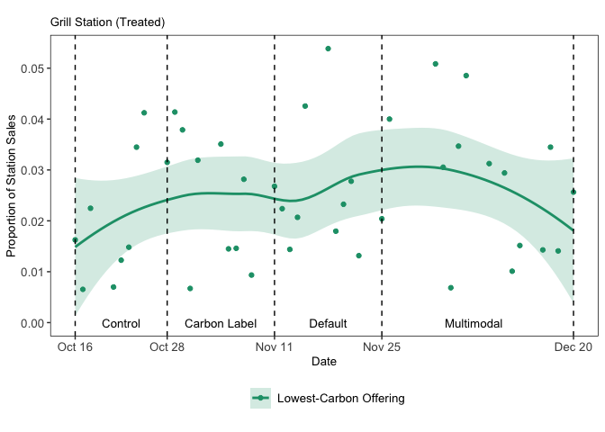<!-- -->

``` r
fall_data %>%
  filter(station=="Grill") %>%
  filter(item_cat=="Main") %>%
  group_by(menu_condition,station,item) %>%
  summarise(total_count=sum(count)) %>%
  mutate(prop_high=case_when(item=="Grilled Hamburger" & menu_condition=="Carbon Label" ~ total_count/(32+159+935+74+85),
                            item=="Grilled Hamburger" & menu_condition=="Control" ~ total_count/(19+125+776+68+60),
                            item=="Grilled Hamburger" & menu_condition=="Default" ~ total_count/(33+167+904+76+90),
                            item=="Grilled Hamburger" & menu_condition=="Multimodal" ~ total_count/(41+165+1157+125+107))) %>%
  drop_na(prop_high) %>%
  ggplot(aes(x=menu_condition,y=prop_high,fill=station)) +
  geom_col(position="dodge") + 
  scale_x_discrete(limits=c("Control","Carbon Label","Default","Multimodal"))
```

    ## `summarise()` has grouped output by 'menu_condition', 'station'. You can
    ## override using the `.groups` argument.

<!-- -->

``` r
fall_data %>%
  filter(station=="Grill") %>%
  filter(item_cat=="Main") %>%
  group_by(menu_condition,station,item) %>%
  summarise(total_count=sum(count)) %>%
  mutate(prop_impossible=case_when(item=="Trillium Grill Impossible Burger" & menu_condition=="Carbon Label" ~ total_count/(32+159+935+74+85),
                            item=="Trillium Grill Impossible Burger" & menu_condition=="Control" ~ total_count/(19+125+776+68+60),
                            item=="Trillium Grill Impossible Burger" & menu_condition=="Default" ~ total_count/(33+167+904+76+90),
                            item=="Trillium Grill Impossible Burger" & menu_condition=="Multimodal" ~ total_count/(41+165+1157+125+107))) %>%
  drop_na(prop_impossible) %>%
  ggplot(aes(x=menu_condition,y=prop_impossible,fill=station)) +
  geom_col(position="dodge") + 
  scale_x_discrete(limits=c("Control","Carbon Label","Default","Multimodal"))
```

    ## `summarise()` has grouped output by 'menu_condition', 'station'. You can
    ## override using the `.groups` argument.

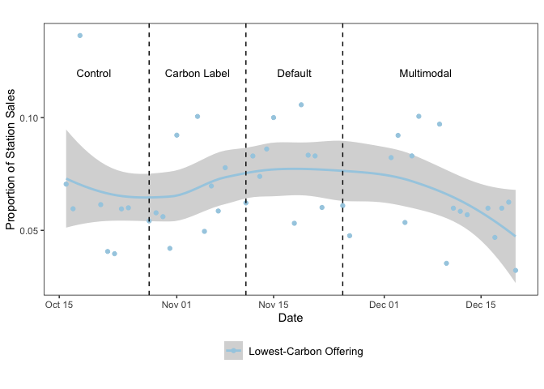<!-- -->

``` r
fall_data %>%
  filter(station=="Grill") %>%
  filter(item_cat=="Main") %>%
  group_by(menu_condition,station,item) %>%
  summarise(total_count=sum(count)) %>%
  mutate(prop_chicken=case_when(item=="Grilled Chicken Breast Sandwich" & menu_condition=="Carbon Label" ~ total_count/(32+159+935+74+85),
                            item=="Grilled Chicken Breast Sandwich" & menu_condition=="Control" ~ total_count/(19+125+776+68+60),
                            item=="Grilled Chicken Breast Sandwich" & menu_condition=="Default" ~ total_count/(33+167+904+76+90),
                            item=="Grilled Chicken Breast Sandwich" & menu_condition=="Multimodal" ~ total_count/(41+165+1157+125+107))) %>%
  drop_na(prop_chicken) %>%
  ggplot(aes(x=menu_condition,y=prop_chicken,fill=station)) +
  geom_col(position="dodge") + 
  scale_x_discrete(limits=c("Control","Carbon Label","Default","Multimodal"))
```

    ## `summarise()` has grouped output by 'menu_condition', 'station'. You can
    ## override using the `.groups` argument.

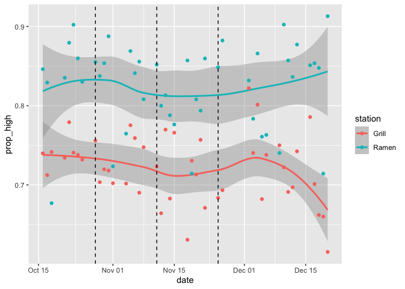<!-- -->

``` r
fall_data %>%
  filter(station=="Grill") %>%
  filter(item_cat=="Main") %>%
  group_by(menu_condition,station,item) %>%
  summarise(total_count=sum(count)) %>%
  mutate(prop_salmon=case_when(item=="Seared Salmon Burger" & menu_condition=="Carbon Label" ~ total_count/(32+159+935+74+85),
                            item=="Seared Salmon Burger" & menu_condition=="Control" ~ total_count/(19+125+776+68+60),
                            item=="Seared Salmon Burger" & menu_condition=="Default" ~ total_count/(33+167+904+76+90),
                            item=="Seared Salmon Burger" & menu_condition=="Multimodal" ~ total_count/(41+165+1157+125+107))) %>%
  drop_na(prop_salmon) %>%
  ggplot(aes(x=menu_condition,y=prop_salmon,fill=station)) +
  geom_col(position="dodge") + 
  scale_x_discrete(limits=c("Control","Carbon Label","Default","Multimodal"))
```

    ## `summarise()` has grouped output by 'menu_condition', 'station'. You can
    ## override using the `.groups` argument.

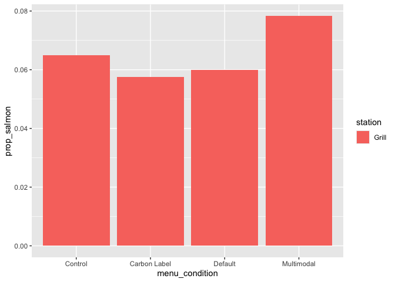<!-- -->

daily prop-low

``` r
daily_prop_low_fall_data <- fall_data %>%
  filter(station_type=="Treatment") %>%
  filter(item_cat=="Main") %>%
  group_by(date,menu_condition,station,item) %>%
  summarise(total_count=sum(count)) %>%
  mutate(prop_low=case_when(item=="Black Bean Burger"&menu_condition=="Carbon Label"&date=="1-Nov"~total_count/(94),
                             item=="Bowl Ramen Tofu"&menu_condition=="Carbon Label"&date=="1-Nov"~total_count/(47),
                             item=="Black Bean Burger"&menu_condition=="Multimodal"&date=="10-Dec"~total_count/(72),
                             item=="Bowl Ramen Tofu"&menu_condition=="Multimodal"&date=="10-Dec"~total_count/(41),
                             item=="Black Bean Burger"&menu_condition=="Multimodal"&date=="11-Dec"~total_count/(68),
                             item=="Bowl Ramen Tofu"&menu_condition=="Multimodal"&date=="11-Dec"~total_count/(49),
                             item=="Black Bean Burger"&menu_condition=="Default"&date=="11-Nov"~total_count/(112),
                             item=="Bowl Ramen Tofu"&menu_condition=="Default"&date=="11-Nov"~total_count/(81),
                             item=="Black Bean Burger"&menu_condition=="Multimodal"&date=="12-Dec"~total_count/(99),
                             item=="Bowl Ramen Tofu"&menu_condition=="Multimodal"&date=="12-Dec"~total_count/(55),
                             item=="Black Bean Burger"&menu_condition=="Default"&date=="12-Nov"~total_count/(134),
                             item=="Bowl Ramen Tofu"&menu_condition=="Default"&date=="12-Nov"~total_count/(95),
                             item=="Black Bean Burger"&menu_condition=="Multimodal"&date=="13-Dec"~total_count/(66),
                             item=="Bowl Ramen Tofu"&menu_condition=="Multimodal"&date=="13-Dec"~total_count/(57),
                             item=="Black Bean Burger"&menu_condition=="Default"&date=="13-Nov"~total_count/(139),
                             item=="Bowl Ramen Tofu"&menu_condition=="Default"&date=="13-Nov"~total_count/(91),
                             item=="Black Bean Burger"&menu_condition=="Default"&date=="14-Nov"~total_count/(145),
                             item=="Bowl Ramen Tofu"&menu_condition=="Default"&date=="14-Nov"~total_count/(99),
                             item=="Black Bean Burger"&menu_condition=="Default"&date=="15-Nov"~total_count/(94),
                             item=="Bowl Ramen Tofu"&menu_condition=="Default"&date=="15-Nov"~total_count/(76),
                             item=="Black Bean Burger"&menu_condition=="Multimodal"&date=="16-Dec"~total_count/(70),
                             item=="Bowl Ramen Tofu"&menu_condition=="Multimodal"&date=="16-Dec"~total_count/(47),
                             item=="Black Bean Burger"&menu_condition=="Control"&date=="16-Oct"~total_count/(123),
                             item=="Bowl Ramen Tofu"&menu_condition=="Control"&date=="16-Oct"~total_count/(104),
                             item=="Black Bean Burger"&menu_condition=="Multimodal"&date=="17-Dec"~total_count/(87),
                             item=="Bowl Ramen Tofu"&menu_condition=="Multimodal"&date=="17-Dec"~total_count/(41),
                             item=="Black Bean Burger"&menu_condition=="Control"&date=="17-Oct"~total_count/(153),
                             item=="Bowl Ramen Tofu"&menu_condition=="Control"&date=="17-Oct"~total_count/(82),
                             item=="Black Bean Burger"&menu_condition=="Multimodal"&date=="18-Dec"~total_count/(71),
                             item=="Bowl Ramen Tofu"&menu_condition=="Multimodal"&date=="18-Dec"~total_count/(46),
                             item=="Black Bean Burger"&menu_condition=="Default"&date=="18-Nov"~total_count/(130),
                             item=="Bowl Ramen Tofu"&menu_condition=="Default"&date=="18-Nov"~total_count/(77),
                             item=="Black Bean Burger"&menu_condition=="Control"&date=="18-Oct"~total_count/(89),
                             item=="Bowl Ramen Tofu"&menu_condition=="Control"&date=="18-Oct"~total_count/(65),
                             item=="Black Bean Burger"&menu_condition=="Multimodal"&date=="19-Dec"~total_count/(50),
                             item=="Bowl Ramen Tofu"&menu_condition=="Multimodal"&date=="19-Dec"~total_count/(14),
                             item=="Black Bean Burger"&menu_condition=="Default"&date=="19-Nov"~total_count/(167),
                             item=="Bowl Ramen Tofu"&menu_condition=="Default"&date=="19-Nov"~total_count/(98),
                             item=="Black Bean Burger"&menu_condition=="Multimodal"&date=="2-Dec"~total_count/(118),
                             item=="Bowl Ramen Tofu"&menu_condition=="Multimodal"&date=="2-Dec"~total_count/(113),
                             item=="Black Bean Burger"&menu_condition=="Multimodal"&date=="20-Dec"~total_count/(39),
                             item=="Bowl Ramen Tofu"&menu_condition=="Multimodal"&date=="20-Dec"~total_count/(23),
                             item=="Black Bean Burger"&menu_condition=="Default"&date=="20-Nov"~total_count/(129),
                             item=="Bowl Ramen Tofu"&menu_condition=="Default"&date=="20-Nov"~total_count/(99),
                             item=="Black Bean Burger"&menu_condition=="Default"&date=="21-Nov"~total_count/(144),
                             item=="Bowl Ramen Tofu"&menu_condition=="Default"&date=="21-Nov"~total_count/(97),
                             item=="Black Bean Burger"&menu_condition=="Control"&date=="21-Oct"~total_count/(143),
                             item=="Bowl Ramen Tofu"&menu_condition=="Control"&date=="21-Oct"~total_count/(85),
                             item=="Black Bean Burger"&menu_condition=="Default"&date=="22-Nov"~total_count/(76),
                             item=="Bowl Ramen Tofu"&menu_condition=="Default"&date=="22-Nov"~total_count/(57),
                             item=="Black Bean Burger"&menu_condition=="Control"&date=="22-Oct"~total_count/(163),
                             item=="Bowl Ramen Tofu"&menu_condition=="Control"&date=="22-Oct"~total_count/(83),
                             item=="Black Bean Burger"&menu_condition=="Control"&date=="23-Oct"~total_count/(135),
                             item=="Bowl Ramen Tofu"&menu_condition=="Control"&date=="23-Oct"~total_count/(92),
                             item=="Black Bean Burger"&menu_condition=="Control"&date=="24-Oct"~total_count/(145),
                             item=="Bowl Ramen Tofu"&menu_condition=="Control"&date=="24-Oct"~total_count/(107),
                             item=="Black Bean Burger"&menu_condition=="Multimodal"&date=="25-Nov"~total_count/(98),
                             item=="Bowl Ramen Tofu"&menu_condition=="Multimodal"&date=="25-Nov"~total_count/(66),
                             item=="Black Bean Burger"&menu_condition=="Control"&date=="25-Oct"~total_count/(97),
                             item=="Bowl Ramen Tofu"&menu_condition=="Control"&date=="25-Oct"~total_count/(53),
                             item=="Black Bean Burger"&menu_condition=="Multimodal"&date=="26-Nov"~total_count/(75),
                             item=="Bowl Ramen Tofu"&menu_condition=="Multimodal"&date=="26-Nov"~total_count/(51),
                             item=="Black Bean Burger"&menu_condition=="Carbon Label"&date=="28-Oct"~total_count/(127),
                             item=="Bowl Ramen Tofu"&menu_condition=="Carbon Label"&date=="28-Oct"~total_count/(76),
                             item=="Black Bean Burger"&menu_condition=="Carbon Label"&date=="29-Oct"~total_count/(145),
                             item=="Bowl Ramen Tofu"&menu_condition=="Carbon Label"&date=="29-Oct"~total_count/(80),
                             item=="Black Bean Burger"&menu_condition=="Multimodal"&date=="3-Dec"~total_count/(131),
                             item=="Bowl Ramen Tofu"&menu_condition=="Multimodal"&date=="3-Dec"~total_count/(97),
                             item=="Black Bean Burger"&menu_condition=="Carbon Label"&date=="30-Oct"~total_count/(132),
                             item=="Bowl Ramen Tofu"&menu_condition=="Carbon Label"&date=="30-Oct"~total_count/(82),
                             item=="Black Bean Burger"&menu_condition=="Carbon Label"&date=="31-Oct"~total_count/(149),
                             item=="Bowl Ramen Tofu"&menu_condition=="Carbon Label"&date=="31-Oct"~total_count/(89),
                             item=="Black Bean Burger"&menu_condition=="Multimodal"&date=="4-Dec"~total_count/(146),
                             item=="Bowl Ramen Tofu"&menu_condition=="Multimodal"&date=="4-Dec"~total_count/(97),
                             item=="Black Bean Burger"&menu_condition=="Carbon Label"&date=="4-Nov"~total_count/(114),
                             item=="Bowl Ramen Tofu"&menu_condition=="Carbon Label"&date=="4-Nov"~total_count/(85),
                             item=="Black Bean Burger"&menu_condition=="Multimodal"&date=="5-Dec"~total_count/(173),
                             item=="Bowl Ramen Tofu"&menu_condition=="Multimodal"&date=="5-Dec"~total_count/(92),
                             item=="Black Bean Burger"&menu_condition=="Carbon Label"&date=="5-Nov"~total_count/(138),
                             item=="Bowl Ramen Tofu"&menu_condition=="Carbon Label"&date=="5-Nov"~total_count/(84),
                             item=="Black Bean Burger"&menu_condition=="Multimodal"&date=="6-Dec"~total_count/(103),
                             item=="Bowl Ramen Tofu"&menu_condition=="Multimodal"&date=="6-Dec"~total_count/(76),
                             item=="Black Bean Burger"&menu_condition=="Carbon Label"&date=="6-Nov"~total_count/(137),
                             item=="Bowl Ramen Tofu"&menu_condition=="Carbon Label"&date=="6-Nov"~total_count/(107),
                             item=="Black Bean Burger"&menu_condition=="Carbon Label"&date=="7-Nov"~total_count/(142),
                             item=="Bowl Ramen Tofu"&menu_condition=="Carbon Label"&date=="7-Nov"~total_count/(97),
                             item=="Black Bean Burger"&menu_condition=="Carbon Label"&date=="8-Nov"~total_count/(107),
                             item=="Bowl Ramen Tofu"&menu_condition=="Carbon Label"&date=="8-Nov"~total_count/(73),
                             item=="Black Bean Burger"&menu_condition=="Multimodal"&date=="9-Dec"~total_count/(128),
                             item=="Bowl Ramen Tofu"&menu_condition=="Multimodal"&date=="9-Dec"~total_count/(77))) %>%
  drop_na(prop_low) %>%
  mutate(date=case_when(date=="16-Oct"~"2024-10-16",
                        date=="17-Oct"~"2024-10-17",
                        date=="18-Oct"~"2024-10-18",
                        date=="21-Oct"~"2024-10-21",
                        date=="22-Oct"~"2024-10-22",
                        date=="23-Oct"~"2024-10-23",
                        date=="24-Oct"~"2024-10-24",
                        date=="25-Oct"~"2024-10-25",
                        date=="28-Oct"~"2024-10-28",
                        date=="29-Oct"~"2024-10-29",
                        date=="30-Oct"~"2024-10-30",
                        date=="31-Oct"~"2024-10-31",
                        date=="1-Nov"~"2024-11-1",
                        date=="4-Nov"~"2024-11-4",
                        date=="5-Nov"~"2024-11-5",
                        date=="6-Nov"~"2024-11-6",
                        date=="7-Nov"~"2024-11-7",
                        date=="8-Nov"~"2024-11-8",
                        date=="11-Nov"~"2024-11-11",
                        date=="12-Nov"~"2024-11-12",
                        date=="13-Nov"~"2024-11-13",
                        date=="14-Nov"~"2024-11-14",
                        date=="15-Nov"~"2024-11-15",
                        date=="18-Nov"~"2024-11-18",
                        date=="19-Nov"~"2024-11-19",
                        date=="20-Nov"~"2024-11-20",
                        date=="21-Nov"~"2024-11-21",
                        date=="22-Nov"~"2024-11-22",
                        date=="25-Nov"~"2024-11-25",
                        date=="26-Nov"~"2024-11-26",
                        date=="2-Dec"~"2024-12-2",
                        date=="3-Dec"~"2024-12-3",
                        date=="4-Dec"~"2024-12-4",
                        date=="5-Dec"~"2024-12-5",
                        date=="6-Dec"~"2024-12-6",
                        date=="9-Dec"~"2024-12-9",
                        date=="10-Dec"~"2024-12-10",
                        date=="11-Dec"~"2024-12-11",
                        date=="12-Dec"~"2024-12-12",
                        date=="13-Dec"~"2024-12-13",
                        date=="16-Dec"~"2024-12-16",
                        date=="17-Dec"~"2024-12-17",
                        date=="18-Dec"~"2024-12-18",
                        date=="19-Dec"~"2024-12-19",
                        date=="20-Dec"~"2024-12-20")) %>%
  mutate(date=as.Date(date)) 
```

    ## `summarise()` has grouped output by 'date', 'menu_condition', 'station'. You
    ## can override using the `.groups` argument.

``` r
fall_vline <- as.Date(c("2024-10-16","2024-10-28","2024-11-11","2024-11-25","2024-12-20"))
fall_vline <- which(daily_prop_low_fall_data$date %in% fall_vline)
```

``` r
ggplot(daily_prop_low_fall_data,aes(x=date,y=prop_low,color=station)) + 
  geom_smooth() + 
  geom_point() +
  geom_vline(xintercept=as.numeric(daily_prop_low_fall_data$date[fall_vline]),linetype=2)
```

    ## `geom_smooth()` using method = 'loess' and formula = 'y ~ x'

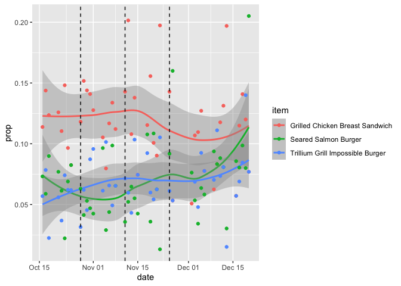<!-- -->

``` r
fall_data %>%
  filter(station=="Grill") %>%
  filter(item_cat=="Main") %>%
  group_by(menu_condition,station,item) %>%
  summarise(total_count=sum(count)) %>%
  mutate(prop=case_when(menu_condition=="Carbon Label"~total_count/(32+159+935+74+85),
                        menu_condition=="Control"~total_count/(19+125+776+68+60),
                        menu_condition=="Default"~total_count/(33+167+904+76+90),
                        menu_condition=="Multimodal"~total_count/(41+165+1157+125+107))) %>%
  filter(item=="Black Bean Burger")
```

    ## `summarise()` has grouped output by 'menu_condition', 'station'. You can
    ## override using the `.groups` argument.

    ## # A tibble: 4 × 5
    ## # Groups:   menu_condition, station [4]
    ##   menu_condition station item              total_count   prop
    ##   <chr>          <chr>   <chr>                   <int>  <dbl>
    ## 1 Carbon Label   Grill   Black Bean Burger          32 0.0249
    ## 2 Control        Grill   Black Bean Burger          19 0.0181
    ## 3 Default        Grill   Black Bean Burger          33 0.0260
    ## 4 Multimodal     Grill   Black Bean Burger          41 0.0257

``` r
fall_prop_low_grill_kruskal_data <- fall_data %>%
  filter(station=="Grill") %>%
  filter(item_cat=="Main") %>%
  group_by(date,menu_condition,station,item) %>%
  summarise(total_count=sum(count)) %>%
  mutate(prop_low=case_when(item=="Black Bean Burger"&menu_condition=="Carbon Label"&date=="1-Nov"~total_count/(94),
                             item=="Black Bean Burger"&menu_condition=="Multimodal"&date=="10-Dec"~total_count/(72),
                             item=="Black Bean Burger"&menu_condition=="Multimodal"&date=="11-Dec"~total_count/(68),
                             item=="Black Bean Burger"&menu_condition=="Default"&date=="11-Nov"~total_count/(112),
                             item=="Black Bean Burger"&menu_condition=="Multimodal"&date=="12-Dec"~total_count/(99),
                             item=="Black Bean Burger"&menu_condition=="Default"&date=="12-Nov"~total_count/(134),
                             item=="Black Bean Burger"&menu_condition=="Multimodal"&date=="13-Dec"~total_count/(66),
                             item=="Black Bean Burger"&menu_condition=="Default"&date=="13-Nov"~total_count/(139),
                             item=="Black Bean Burger"&menu_condition=="Default"&date=="14-Nov"~total_count/(145),
                             item=="Black Bean Burger"&menu_condition=="Default"&date=="15-Nov"~total_count/(94),
                             item=="Black Bean Burger"&menu_condition=="Multimodal"&date=="16-Dec"~total_count/(70),
                             item=="Black Bean Burger"&menu_condition=="Control"&date=="16-Oct"~total_count/(123),
                             item=="Black Bean Burger"&menu_condition=="Multimodal"&date=="17-Dec"~total_count/(87),
                             item=="Black Bean Burger"&menu_condition=="Control"&date=="17-Oct"~total_count/(153),
                             item=="Black Bean Burger"&menu_condition=="Multimodal"&date=="18-Dec"~total_count/(71),
                             item=="Black Bean Burger"&menu_condition=="Default"&date=="18-Nov"~total_count/(130),
                             item=="Black Bean Burger"&menu_condition=="Control"&date=="18-Oct"~total_count/(89),
                             item=="Black Bean Burger"&menu_condition=="Multimodal"&date=="19-Dec"~total_count/(50),
                             item=="Black Bean Burger"&menu_condition=="Default"&date=="19-Nov"~total_count/(167),
                             item=="Black Bean Burger"&menu_condition=="Multimodal"&date=="2-Dec"~total_count/(118),
                             item=="Black Bean Burger"&menu_condition=="Multimodal"&date=="20-Dec"~total_count/(39),
                             item=="Black Bean Burger"&menu_condition=="Default"&date=="20-Nov"~total_count/(129),
                             item=="Black Bean Burger"&menu_condition=="Default"&date=="21-Nov"~total_count/(144),
                             item=="Black Bean Burger"&menu_condition=="Control"&date=="21-Oct"~total_count/(143),
                             item=="Black Bean Burger"&menu_condition=="Default"&date=="22-Nov"~total_count/(76),
                             item=="Black Bean Burger"&menu_condition=="Control"&date=="22-Oct"~total_count/(163),
                             item=="Black Bean Burger"&menu_condition=="Control"&date=="23-Oct"~total_count/(135),
                             item=="Black Bean Burger"&menu_condition=="Control"&date=="24-Oct"~total_count/(145),
                             item=="Black Bean Burger"&menu_condition=="Multimodal"&date=="25-Nov"~total_count/(98),
                             item=="Black Bean Burger"&menu_condition=="Control"&date=="25-Oct"~total_count/(97),
                             item=="Black Bean Burger"&menu_condition=="Multimodal"&date=="26-Nov"~total_count/(75),
                             item=="Black Bean Burger"&menu_condition=="Carbon Label"&date=="28-Oct"~total_count/(127),
                             item=="Black Bean Burger"&menu_condition=="Carbon Label"&date=="29-Oct"~total_count/(145),
                             item=="Black Bean Burger"&menu_condition=="Multimodal"&date=="3-Dec"~total_count/(131),
                             item=="Black Bean Burger"&menu_condition=="Carbon Label"&date=="30-Oct"~total_count/(132),
                             item=="Black Bean Burger"&menu_condition=="Carbon Label"&date=="31-Oct"~total_count/(149),
                             item=="Black Bean Burger"&menu_condition=="Multimodal"&date=="4-Dec"~total_count/(146),
                             item=="Black Bean Burger"&menu_condition=="Carbon Label"&date=="4-Nov"~total_count/(114),
                             item=="Black Bean Burger"&menu_condition=="Multimodal"&date=="5-Dec"~total_count/(173),
                             item=="Black Bean Burger"&menu_condition=="Carbon Label"&date=="5-Nov"~total_count/(138),
                             item=="Black Bean Burger"&menu_condition=="Multimodal"&date=="6-Dec"~total_count/(103),
                             item=="Black Bean Burger"&menu_condition=="Carbon Label"&date=="6-Nov"~total_count/(137),
                             item=="Black Bean Burger"&menu_condition=="Carbon Label"&date=="7-Nov"~total_count/(142),
                             item=="Black Bean Burger"&menu_condition=="Carbon Label"&date=="8-Nov"~total_count/(107),
                             item=="Black Bean Burger"&menu_condition=="Multimodal"&date=="9-Dec"~total_count/(128))) %>%
  drop_na(prop_low) %>%
  mutate(date=case_when(date=="16-Oct"~"2024-10-16",
                        date=="17-Oct"~"2024-10-17",
                        date=="18-Oct"~"2024-10-18",
                        date=="21-Oct"~"2024-10-21",
                        date=="22-Oct"~"2024-10-22",
                        date=="23-Oct"~"2024-10-23",
                        date=="24-Oct"~"2024-10-24",
                        date=="25-Oct"~"2024-10-25",
                        date=="28-Oct"~"2024-10-28",
                        date=="29-Oct"~"2024-10-29",
                        date=="30-Oct"~"2024-10-30",
                        date=="31-Oct"~"2024-10-31",
                        date=="1-Nov"~"2024-11-1",
                        date=="4-Nov"~"2024-11-4",
                        date=="5-Nov"~"2024-11-5",
                        date=="6-Nov"~"2024-11-6",
                        date=="7-Nov"~"2024-11-7",
                        date=="8-Nov"~"2024-11-8",
                        date=="11-Nov"~"2024-11-11",
                        date=="12-Nov"~"2024-11-12",
                        date=="13-Nov"~"2024-11-13",
                        date=="14-Nov"~"2024-11-14",
                        date=="15-Nov"~"2024-11-15",
                        date=="18-Nov"~"2024-11-18",
                        date=="19-Nov"~"2024-11-19",
                        date=="20-Nov"~"2024-11-20",
                        date=="21-Nov"~"2024-11-21",
                        date=="22-Nov"~"2024-11-22",
                        date=="25-Nov"~"2024-11-25",
                        date=="26-Nov"~"2024-11-26",
                        date=="2-Dec"~"2024-12-2",
                        date=="3-Dec"~"2024-12-3",
                        date=="4-Dec"~"2024-12-4",
                        date=="5-Dec"~"2024-12-5",
                        date=="6-Dec"~"2024-12-6",
                        date=="9-Dec"~"2024-12-9",
                        date=="10-Dec"~"2024-12-10",
                        date=="11-Dec"~"2024-12-11",
                        date=="12-Dec"~"2024-12-12",
                        date=="13-Dec"~"2024-12-13",
                        date=="16-Dec"~"2024-12-16",
                        date=="17-Dec"~"2024-12-17",
                        date=="18-Dec"~"2024-12-18",
                        date=="19-Dec"~"2024-12-19",
                        date=="20-Dec"~"2024-12-20")) %>%
  mutate(date=as.Date(date)) %>%
  mutate(item=case_when(item=="Black Bean Burger"~"Lowest-Carbon Offering")) %>%
  ungroup() %>%
  select(menu_condition,prop_low) %>%
  arrange(menu_condition)
```

    ## `summarise()` has grouped output by 'date', 'menu_condition', 'station'. You
    ## can override using the `.groups` argument.

``` r
kruskal.test(prop_low~menu_condition,data=fall_prop_low_grill_kruskal_data) 
```

    ## 
    ##  Kruskal-Wallis rank sum test
    ## 
    ## data:  prop_low by menu_condition
    ## Kruskal-Wallis chi-squared = 1.7887, df = 3, p-value = 0.6174

``` r
fall_prop_low_grill_aov_data <- fall_data %>%
  filter(station=="Grill") %>%
  filter(item_cat=="Main") %>%
  group_by(date,menu_condition,station,item) %>%
  summarise(total_count=sum(count)) %>%
  mutate(prop_low=case_when(item=="Black Bean Burger"&menu_condition=="Carbon Label"&date=="1-Nov"~total_count/(94),
                             item=="Black Bean Burger"&menu_condition=="Multimodal"&date=="10-Dec"~total_count/(72),
                             item=="Black Bean Burger"&menu_condition=="Multimodal"&date=="11-Dec"~total_count/(68),
                             item=="Black Bean Burger"&menu_condition=="Default"&date=="11-Nov"~total_count/(112),
                             item=="Black Bean Burger"&menu_condition=="Multimodal"&date=="12-Dec"~total_count/(99),
                             item=="Black Bean Burger"&menu_condition=="Default"&date=="12-Nov"~total_count/(134),
                             item=="Black Bean Burger"&menu_condition=="Multimodal"&date=="13-Dec"~total_count/(66),
                             item=="Black Bean Burger"&menu_condition=="Default"&date=="13-Nov"~total_count/(139),
                             item=="Black Bean Burger"&menu_condition=="Default"&date=="14-Nov"~total_count/(145),
                             item=="Black Bean Burger"&menu_condition=="Default"&date=="15-Nov"~total_count/(94),
                             item=="Black Bean Burger"&menu_condition=="Multimodal"&date=="16-Dec"~total_count/(70),
                             item=="Black Bean Burger"&menu_condition=="Control"&date=="16-Oct"~total_count/(123),
                             item=="Black Bean Burger"&menu_condition=="Multimodal"&date=="17-Dec"~total_count/(87),
                             item=="Black Bean Burger"&menu_condition=="Control"&date=="17-Oct"~total_count/(153),
                             item=="Black Bean Burger"&menu_condition=="Multimodal"&date=="18-Dec"~total_count/(71),
                             item=="Black Bean Burger"&menu_condition=="Default"&date=="18-Nov"~total_count/(130),
                             item=="Black Bean Burger"&menu_condition=="Control"&date=="18-Oct"~total_count/(89),
                             item=="Black Bean Burger"&menu_condition=="Multimodal"&date=="19-Dec"~total_count/(50),
                             item=="Black Bean Burger"&menu_condition=="Default"&date=="19-Nov"~total_count/(167),
                             item=="Black Bean Burger"&menu_condition=="Multimodal"&date=="2-Dec"~total_count/(118),
                             item=="Black Bean Burger"&menu_condition=="Multimodal"&date=="20-Dec"~total_count/(39),
                             item=="Black Bean Burger"&menu_condition=="Default"&date=="20-Nov"~total_count/(129),
                             item=="Black Bean Burger"&menu_condition=="Default"&date=="21-Nov"~total_count/(144),
                             item=="Black Bean Burger"&menu_condition=="Control"&date=="21-Oct"~total_count/(143),
                             item=="Black Bean Burger"&menu_condition=="Default"&date=="22-Nov"~total_count/(76),
                             item=="Black Bean Burger"&menu_condition=="Control"&date=="22-Oct"~total_count/(163),
                             item=="Black Bean Burger"&menu_condition=="Control"&date=="23-Oct"~total_count/(135),
                             item=="Black Bean Burger"&menu_condition=="Control"&date=="24-Oct"~total_count/(145),
                             item=="Black Bean Burger"&menu_condition=="Multimodal"&date=="25-Nov"~total_count/(98),
                             item=="Black Bean Burger"&menu_condition=="Control"&date=="25-Oct"~total_count/(97),
                             item=="Black Bean Burger"&menu_condition=="Multimodal"&date=="26-Nov"~total_count/(75),
                             item=="Black Bean Burger"&menu_condition=="Carbon Label"&date=="28-Oct"~total_count/(127),
                             item=="Black Bean Burger"&menu_condition=="Carbon Label"&date=="29-Oct"~total_count/(145),
                             item=="Black Bean Burger"&menu_condition=="Multimodal"&date=="3-Dec"~total_count/(131),
                             item=="Black Bean Burger"&menu_condition=="Carbon Label"&date=="30-Oct"~total_count/(132),
                             item=="Black Bean Burger"&menu_condition=="Carbon Label"&date=="31-Oct"~total_count/(149),
                             item=="Black Bean Burger"&menu_condition=="Multimodal"&date=="4-Dec"~total_count/(146),
                             item=="Black Bean Burger"&menu_condition=="Carbon Label"&date=="4-Nov"~total_count/(114),
                             item=="Black Bean Burger"&menu_condition=="Multimodal"&date=="5-Dec"~total_count/(173),
                             item=="Black Bean Burger"&menu_condition=="Carbon Label"&date=="5-Nov"~total_count/(138),
                             item=="Black Bean Burger"&menu_condition=="Multimodal"&date=="6-Dec"~total_count/(103),
                             item=="Black Bean Burger"&menu_condition=="Carbon Label"&date=="6-Nov"~total_count/(137),
                             item=="Black Bean Burger"&menu_condition=="Carbon Label"&date=="7-Nov"~total_count/(142),
                             item=="Black Bean Burger"&menu_condition=="Carbon Label"&date=="8-Nov"~total_count/(107),
                             item=="Black Bean Burger"&menu_condition=="Multimodal"&date=="9-Dec"~total_count/(128))) %>%
  drop_na(prop_low) %>%
  mutate(date=case_when(date=="16-Oct"~"2024-10-16",
                        date=="17-Oct"~"2024-10-17",
                        date=="18-Oct"~"2024-10-18",
                        date=="21-Oct"~"2024-10-21",
                        date=="22-Oct"~"2024-10-22",
                        date=="23-Oct"~"2024-10-23",
                        date=="24-Oct"~"2024-10-24",
                        date=="25-Oct"~"2024-10-25",
                        date=="28-Oct"~"2024-10-28",
                        date=="29-Oct"~"2024-10-29",
                        date=="30-Oct"~"2024-10-30",
                        date=="31-Oct"~"2024-10-31",
                        date=="1-Nov"~"2024-11-1",
                        date=="4-Nov"~"2024-11-4",
                        date=="5-Nov"~"2024-11-5",
                        date=="6-Nov"~"2024-11-6",
                        date=="7-Nov"~"2024-11-7",
                        date=="8-Nov"~"2024-11-8",
                        date=="11-Nov"~"2024-11-11",
                        date=="12-Nov"~"2024-11-12",
                        date=="13-Nov"~"2024-11-13",
                        date=="14-Nov"~"2024-11-14",
                        date=="15-Nov"~"2024-11-15",
                        date=="18-Nov"~"2024-11-18",
                        date=="19-Nov"~"2024-11-19",
                        date=="20-Nov"~"2024-11-20",
                        date=="21-Nov"~"2024-11-21",
                        date=="22-Nov"~"2024-11-22",
                        date=="25-Nov"~"2024-11-25",
                        date=="26-Nov"~"2024-11-26",
                        date=="2-Dec"~"2024-12-2",
                        date=="3-Dec"~"2024-12-3",
                        date=="4-Dec"~"2024-12-4",
                        date=="5-Dec"~"2024-12-5",
                        date=="6-Dec"~"2024-12-6",
                        date=="9-Dec"~"2024-12-9",
                        date=="10-Dec"~"2024-12-10",
                        date=="11-Dec"~"2024-12-11",
                        date=="12-Dec"~"2024-12-12",
                        date=="13-Dec"~"2024-12-13",
                        date=="16-Dec"~"2024-12-16",
                        date=="17-Dec"~"2024-12-17",
                        date=="18-Dec"~"2024-12-18",
                        date=="19-Dec"~"2024-12-19",
                        date=="20-Dec"~"2024-12-20")) %>%
  mutate(date=as.Date(date)) %>%
  mutate(item=case_when(item=="Black Bean Burger"~"Lowest-Carbon Offering")) %>%
  ungroup() %>%
  select(menu_condition,prop_low) %>%
  arrange(menu_condition)
```

    ## `summarise()` has grouped output by 'date', 'menu_condition', 'station'. You
    ## can override using the `.groups` argument.

``` r
shapiro.test(fall_prop_low_grill_aov_data$prop_low) ## Shapiro-Wilk test, test assumption of normality, p-value is greater than 0.05, do not reject the null hypothesis, data follow a normal distribution
```

    ## 
    ##  Shapiro-Wilk normality test
    ## 
    ## data:  fall_prop_low_grill_aov_data$prop_low
    ## W = 0.95434, p-value = 0.08591

``` r
oneway.test(prop_low~menu_condition,data=fall_prop_low_grill_aov_data,var.equal=TRUE)
```

    ## 
    ##  One-way analysis of means
    ## 
    ## data:  prop_low and menu_condition
    ## F = 0.66076, num df = 3, denom df = 39, p-value = 0.5812

``` r
fall_prop_low_grill_ttest_data <- fall_data %>%
  filter(station=="Grill") %>%
  filter(item_cat=="Main") %>%
  group_by(date,menu_condition,station,item) %>%
  summarise(total_count=sum(count)) %>%
  mutate(prop_low=case_when(item=="Black Bean Burger"&menu_condition=="Carbon Label"&date=="1-Nov"~total_count/(94),
                             item=="Black Bean Burger"&menu_condition=="Multimodal"&date=="10-Dec"~total_count/(72),
                             item=="Black Bean Burger"&menu_condition=="Multimodal"&date=="11-Dec"~total_count/(68),
                             item=="Black Bean Burger"&menu_condition=="Default"&date=="11-Nov"~total_count/(112),
                             item=="Black Bean Burger"&menu_condition=="Multimodal"&date=="12-Dec"~total_count/(99),
                             item=="Black Bean Burger"&menu_condition=="Default"&date=="12-Nov"~total_count/(134),
                             item=="Black Bean Burger"&menu_condition=="Multimodal"&date=="13-Dec"~total_count/(66),
                             item=="Black Bean Burger"&menu_condition=="Default"&date=="13-Nov"~total_count/(139),
                             item=="Black Bean Burger"&menu_condition=="Default"&date=="14-Nov"~total_count/(145),
                             item=="Black Bean Burger"&menu_condition=="Default"&date=="15-Nov"~total_count/(94),
                             item=="Black Bean Burger"&menu_condition=="Multimodal"&date=="16-Dec"~total_count/(70),
                             item=="Black Bean Burger"&menu_condition=="Control"&date=="16-Oct"~total_count/(123),
                             item=="Black Bean Burger"&menu_condition=="Multimodal"&date=="17-Dec"~total_count/(87),
                             item=="Black Bean Burger"&menu_condition=="Control"&date=="17-Oct"~total_count/(153),
                             item=="Black Bean Burger"&menu_condition=="Multimodal"&date=="18-Dec"~total_count/(71),
                             item=="Black Bean Burger"&menu_condition=="Default"&date=="18-Nov"~total_count/(130),
                             item=="Black Bean Burger"&menu_condition=="Control"&date=="18-Oct"~total_count/(89),
                             item=="Black Bean Burger"&menu_condition=="Multimodal"&date=="19-Dec"~total_count/(50),
                             item=="Black Bean Burger"&menu_condition=="Default"&date=="19-Nov"~total_count/(167),
                             item=="Black Bean Burger"&menu_condition=="Multimodal"&date=="2-Dec"~total_count/(118),
                             item=="Black Bean Burger"&menu_condition=="Multimodal"&date=="20-Dec"~total_count/(39),
                             item=="Black Bean Burger"&menu_condition=="Default"&date=="20-Nov"~total_count/(129),
                             item=="Black Bean Burger"&menu_condition=="Default"&date=="21-Nov"~total_count/(144),
                             item=="Black Bean Burger"&menu_condition=="Control"&date=="21-Oct"~total_count/(143),
                             item=="Black Bean Burger"&menu_condition=="Default"&date=="22-Nov"~total_count/(76),
                             item=="Black Bean Burger"&menu_condition=="Control"&date=="22-Oct"~total_count/(163),
                             item=="Black Bean Burger"&menu_condition=="Control"&date=="23-Oct"~total_count/(135),
                             item=="Black Bean Burger"&menu_condition=="Control"&date=="24-Oct"~total_count/(145),
                             item=="Black Bean Burger"&menu_condition=="Multimodal"&date=="25-Nov"~total_count/(98),
                             item=="Black Bean Burger"&menu_condition=="Control"&date=="25-Oct"~total_count/(97),
                             item=="Black Bean Burger"&menu_condition=="Multimodal"&date=="26-Nov"~total_count/(75),
                             item=="Black Bean Burger"&menu_condition=="Carbon Label"&date=="28-Oct"~total_count/(127),
                             item=="Black Bean Burger"&menu_condition=="Carbon Label"&date=="29-Oct"~total_count/(145),
                             item=="Black Bean Burger"&menu_condition=="Multimodal"&date=="3-Dec"~total_count/(131),
                             item=="Black Bean Burger"&menu_condition=="Carbon Label"&date=="30-Oct"~total_count/(132),
                             item=="Black Bean Burger"&menu_condition=="Carbon Label"&date=="31-Oct"~total_count/(149),
                             item=="Black Bean Burger"&menu_condition=="Multimodal"&date=="4-Dec"~total_count/(146),
                             item=="Black Bean Burger"&menu_condition=="Carbon Label"&date=="4-Nov"~total_count/(114),
                             item=="Black Bean Burger"&menu_condition=="Multimodal"&date=="5-Dec"~total_count/(173),
                             item=="Black Bean Burger"&menu_condition=="Carbon Label"&date=="5-Nov"~total_count/(138),
                             item=="Black Bean Burger"&menu_condition=="Multimodal"&date=="6-Dec"~total_count/(103),
                             item=="Black Bean Burger"&menu_condition=="Carbon Label"&date=="6-Nov"~total_count/(137),
                             item=="Black Bean Burger"&menu_condition=="Carbon Label"&date=="7-Nov"~total_count/(142),
                             item=="Black Bean Burger"&menu_condition=="Carbon Label"&date=="8-Nov"~total_count/(107),
                             item=="Black Bean Burger"&menu_condition=="Multimodal"&date=="9-Dec"~total_count/(128))) %>%
  drop_na(prop_low) %>%
  mutate(date=case_when(date=="16-Oct"~"2024-10-16",
                        date=="17-Oct"~"2024-10-17",
                        date=="18-Oct"~"2024-10-18",
                        date=="21-Oct"~"2024-10-21",
                        date=="22-Oct"~"2024-10-22",
                        date=="23-Oct"~"2024-10-23",
                        date=="24-Oct"~"2024-10-24",
                        date=="25-Oct"~"2024-10-25",
                        date=="28-Oct"~"2024-10-28",
                        date=="29-Oct"~"2024-10-29",
                        date=="30-Oct"~"2024-10-30",
                        date=="31-Oct"~"2024-10-31",
                        date=="1-Nov"~"2024-11-1",
                        date=="4-Nov"~"2024-11-4",
                        date=="5-Nov"~"2024-11-5",
                        date=="6-Nov"~"2024-11-6",
                        date=="7-Nov"~"2024-11-7",
                        date=="8-Nov"~"2024-11-8",
                        date=="11-Nov"~"2024-11-11",
                        date=="12-Nov"~"2024-11-12",
                        date=="13-Nov"~"2024-11-13",
                        date=="14-Nov"~"2024-11-14",
                        date=="15-Nov"~"2024-11-15",
                        date=="18-Nov"~"2024-11-18",
                        date=="19-Nov"~"2024-11-19",
                        date=="20-Nov"~"2024-11-20",
                        date=="21-Nov"~"2024-11-21",
                        date=="22-Nov"~"2024-11-22",
                        date=="25-Nov"~"2024-11-25",
                        date=="26-Nov"~"2024-11-26",
                        date=="2-Dec"~"2024-12-2",
                        date=="3-Dec"~"2024-12-3",
                        date=="4-Dec"~"2024-12-4",
                        date=="5-Dec"~"2024-12-5",
                        date=="6-Dec"~"2024-12-6",
                        date=="9-Dec"~"2024-12-9",
                        date=="10-Dec"~"2024-12-10",
                        date=="11-Dec"~"2024-12-11",
                        date=="12-Dec"~"2024-12-12",
                        date=="13-Dec"~"2024-12-13",
                        date=="16-Dec"~"2024-12-16",
                        date=="17-Dec"~"2024-12-17",
                        date=="18-Dec"~"2024-12-18",
                        date=="19-Dec"~"2024-12-19",
                        date=="20-Dec"~"2024-12-20")) %>%
  mutate(date=as.Date(date)) %>%
  mutate(item=case_when(item=="Black Bean Burger"~"Lowest-Carbon Offering")) %>%
  ungroup() %>%
  select(menu_condition,prop_low) %>%
  filter(menu_condition=="Control"|menu_condition=="Default") %>%
  arrange(menu_condition)
```

    ## `summarise()` has grouped output by 'date', 'menu_condition', 'station'. You
    ## can override using the `.groups` argument.

``` r
t.test(prop_low~menu_condition,data=fall_prop_low_grill_ttest_data)
```

    ## 
    ##  Welch Two Sample t-test
    ## 
    ## data:  prop_low by menu_condition
    ## t = -1.1465, df = 15.216, p-value = 0.2693
    ## alternative hypothesis: true difference in means between group Control and group Default is not equal to 0
    ## 95 percent confidence interval:
    ##  -0.019704507  0.005909555
    ## sample estimates:
    ## mean in group Control mean in group Default 
    ##            0.01938321            0.02628068

``` r
alt_fall_prop_low_grill_aov_data <- fall_data %>% 
  filter(station=="Grill") %>%
  filter(item_cat=="Main") %>%
  filter(item=="Black Bean Burger") %>%
  select(menu_condition,count) 
shapiro.test(alt_fall_prop_low_grill_aov_data$count) #violates normality assumption, proceed with Kruskal
```

    ## 
    ##  Shapiro-Wilk normality test
    ## 
    ## data:  alt_fall_prop_low_grill_aov_data$count
    ## W = 0.90415, p-value = 0.001676

``` r
kruskal.test(count~menu_condition,data=alt_fall_prop_low_grill_aov_data) 
```

    ## 
    ##  Kruskal-Wallis rank sum test
    ## 
    ## data:  count by menu_condition
    ## Kruskal-Wallis chi-squared = 2.1724, df = 3, p-value = 0.5374

``` r
fall_prop_low_grill <- fall_data %>%
  filter(station=="Grill") %>%
  filter(item_cat=="Main") %>%
  group_by(date,menu_condition,station,item) %>%
  summarise(total_count=sum(count)) %>%
  mutate(prop_low=case_when(item=="Black Bean Burger"&menu_condition=="Carbon Label"&date=="1-Nov"~total_count/(94),
                             item=="Black Bean Burger"&menu_condition=="Multimodal"&date=="10-Dec"~total_count/(72),
                             item=="Black Bean Burger"&menu_condition=="Multimodal"&date=="11-Dec"~total_count/(68),
                             item=="Black Bean Burger"&menu_condition=="Default"&date=="11-Nov"~total_count/(112),
                             item=="Black Bean Burger"&menu_condition=="Multimodal"&date=="12-Dec"~total_count/(99),
                             item=="Black Bean Burger"&menu_condition=="Default"&date=="12-Nov"~total_count/(134),
                             item=="Black Bean Burger"&menu_condition=="Multimodal"&date=="13-Dec"~total_count/(66),
                             item=="Black Bean Burger"&menu_condition=="Default"&date=="13-Nov"~total_count/(139),
                             item=="Black Bean Burger"&menu_condition=="Default"&date=="14-Nov"~total_count/(145),
                             item=="Black Bean Burger"&menu_condition=="Default"&date=="15-Nov"~total_count/(94),
                             item=="Black Bean Burger"&menu_condition=="Multimodal"&date=="16-Dec"~total_count/(70),
                             item=="Black Bean Burger"&menu_condition=="Control"&date=="16-Oct"~total_count/(123),
                             item=="Black Bean Burger"&menu_condition=="Multimodal"&date=="17-Dec"~total_count/(87),
                             item=="Black Bean Burger"&menu_condition=="Control"&date=="17-Oct"~total_count/(153),
                             item=="Black Bean Burger"&menu_condition=="Multimodal"&date=="18-Dec"~total_count/(71),
                             item=="Black Bean Burger"&menu_condition=="Default"&date=="18-Nov"~total_count/(130),
                             item=="Black Bean Burger"&menu_condition=="Control"&date=="18-Oct"~total_count/(89),
                             item=="Black Bean Burger"&menu_condition=="Multimodal"&date=="19-Dec"~total_count/(50),
                             item=="Black Bean Burger"&menu_condition=="Default"&date=="19-Nov"~total_count/(167),
                             item=="Black Bean Burger"&menu_condition=="Multimodal"&date=="2-Dec"~total_count/(118),
                             item=="Black Bean Burger"&menu_condition=="Multimodal"&date=="20-Dec"~total_count/(39),
                             item=="Black Bean Burger"&menu_condition=="Default"&date=="20-Nov"~total_count/(129),
                             item=="Black Bean Burger"&menu_condition=="Default"&date=="21-Nov"~total_count/(144),
                             item=="Black Bean Burger"&menu_condition=="Control"&date=="21-Oct"~total_count/(143),
                             item=="Black Bean Burger"&menu_condition=="Default"&date=="22-Nov"~total_count/(76),
                             item=="Black Bean Burger"&menu_condition=="Control"&date=="22-Oct"~total_count/(163),
                             item=="Black Bean Burger"&menu_condition=="Control"&date=="23-Oct"~total_count/(135),
                             item=="Black Bean Burger"&menu_condition=="Control"&date=="24-Oct"~total_count/(145),
                             item=="Black Bean Burger"&menu_condition=="Multimodal"&date=="25-Nov"~total_count/(98),
                             item=="Black Bean Burger"&menu_condition=="Control"&date=="25-Oct"~total_count/(97),
                             item=="Black Bean Burger"&menu_condition=="Multimodal"&date=="26-Nov"~total_count/(75),
                             item=="Black Bean Burger"&menu_condition=="Carbon Label"&date=="28-Oct"~total_count/(127),
                             item=="Black Bean Burger"&menu_condition=="Carbon Label"&date=="29-Oct"~total_count/(145),
                             item=="Black Bean Burger"&menu_condition=="Multimodal"&date=="3-Dec"~total_count/(131),
                             item=="Black Bean Burger"&menu_condition=="Carbon Label"&date=="30-Oct"~total_count/(132),
                             item=="Black Bean Burger"&menu_condition=="Carbon Label"&date=="31-Oct"~total_count/(149),
                             item=="Black Bean Burger"&menu_condition=="Multimodal"&date=="4-Dec"~total_count/(146),
                             item=="Black Bean Burger"&menu_condition=="Carbon Label"&date=="4-Nov"~total_count/(114),
                             item=="Black Bean Burger"&menu_condition=="Multimodal"&date=="5-Dec"~total_count/(173),
                             item=="Black Bean Burger"&menu_condition=="Carbon Label"&date=="5-Nov"~total_count/(138),
                             item=="Black Bean Burger"&menu_condition=="Multimodal"&date=="6-Dec"~total_count/(103),
                             item=="Black Bean Burger"&menu_condition=="Carbon Label"&date=="6-Nov"~total_count/(137),
                             item=="Black Bean Burger"&menu_condition=="Carbon Label"&date=="7-Nov"~total_count/(142),
                             item=="Black Bean Burger"&menu_condition=="Carbon Label"&date=="8-Nov"~total_count/(107),
                             item=="Black Bean Burger"&menu_condition=="Multimodal"&date=="9-Dec"~total_count/(128))) %>%
  drop_na(prop_low) %>%
  mutate(date=case_when(date=="16-Oct"~"2024-10-16",
                        date=="17-Oct"~"2024-10-17",
                        date=="18-Oct"~"2024-10-18",
                        date=="21-Oct"~"2024-10-21",
                        date=="22-Oct"~"2024-10-22",
                        date=="23-Oct"~"2024-10-23",
                        date=="24-Oct"~"2024-10-24",
                        date=="25-Oct"~"2024-10-25",
                        date=="28-Oct"~"2024-10-28",
                        date=="29-Oct"~"2024-10-29",
                        date=="30-Oct"~"2024-10-30",
                        date=="31-Oct"~"2024-10-31",
                        date=="1-Nov"~"2024-11-1",
                        date=="4-Nov"~"2024-11-4",
                        date=="5-Nov"~"2024-11-5",
                        date=="6-Nov"~"2024-11-6",
                        date=="7-Nov"~"2024-11-7",
                        date=="8-Nov"~"2024-11-8",
                        date=="11-Nov"~"2024-11-11",
                        date=="12-Nov"~"2024-11-12",
                        date=="13-Nov"~"2024-11-13",
                        date=="14-Nov"~"2024-11-14",
                        date=="15-Nov"~"2024-11-15",
                        date=="18-Nov"~"2024-11-18",
                        date=="19-Nov"~"2024-11-19",
                        date=="20-Nov"~"2024-11-20",
                        date=="21-Nov"~"2024-11-21",
                        date=="22-Nov"~"2024-11-22",
                        date=="25-Nov"~"2024-11-25",
                        date=="26-Nov"~"2024-11-26",
                        date=="2-Dec"~"2024-12-2",
                        date=="3-Dec"~"2024-12-3",
                        date=="4-Dec"~"2024-12-4",
                        date=="5-Dec"~"2024-12-5",
                        date=="6-Dec"~"2024-12-6",
                        date=="9-Dec"~"2024-12-9",
                        date=="10-Dec"~"2024-12-10",
                        date=="11-Dec"~"2024-12-11",
                        date=="12-Dec"~"2024-12-12",
                        date=="13-Dec"~"2024-12-13",
                        date=="16-Dec"~"2024-12-16",
                        date=="17-Dec"~"2024-12-17",
                        date=="18-Dec"~"2024-12-18",
                        date=="19-Dec"~"2024-12-19",
                        date=="20-Dec"~"2024-12-20")) %>%
  mutate(date=as.Date(date)) %>%
  mutate(item=case_when(item=="Black Bean Burger"~"Lowest-Carbon Offering")) %>%
  ggplot(aes(x=date,y=prop_low,color=item,fill=item)) + 
  geom_smooth(alpha=0.2) + 
  geom_point() +
  geom_vline(xintercept=as.numeric(daily_prop_low_fall_data$date[fall_vline]),linetype=2) +
  xlab("Date") + 
  ylab("Proportion of Station Sales") +
  scale_color_brewer(palette="Dark2",name="") +
  scale_fill_brewer(palette="Dark2",name="") +
  scale_y_continuous(breaks=c(0,0.01,0.02,0.03,0.04,0.05)) +
  scale_x_date(breaks=as.Date(c("2024-10-16","2024-10-28","2024-11-11","2024-11-25","2024-12-20")),labels=c("Oct 16","Oct 28","Nov 11","Nov 25","Dec 20")) +
  annotate("text",x=as.Date("2024-10-22"),y=0.01512977,label="Control",size=10/.pt) +
  annotate("text",x=as.Date("2024-11-4"),y=0.02190272,label="Carbon Label",size=10/.pt) +
  annotate("text",x=as.Date("2024-11-18"),y=0.02298425,label="Default",size=10/.pt) +
  annotate("text",x=as.Date("2024-12-7"),y=0.02270533,label="Multimodal",size=10/.pt) +
  annotate("point",x=as.Date("2024-10-22"),y=0.018312977) +
  annotate("point",x=as.Date("2024-11-4"),y=0.02490272) +
  annotate("point",x=as.Date("2024-11-18"),y=0.02598425) +
  annotate("point",x=as.Date("2024-12-7"),y=0.02570533) +
  labs(title="Grill Station (Treated)",caption="F(3,39)=0.66076, p=0.5812") +
  theme(aspect.ratio=0.55,legend.position="bottom",panel.grid=element_blank(),panel.background=element_rect(fill="white"),panel.border=element_rect(fill=NA),legend.title=element_text(size=10),legend.text=element_text(size=10),plot.title=element_text(size=10),axis.title=element_text(size=10),axis.text=element_text(size=10)) 
```

    ## `summarise()` has grouped output by 'date', 'menu_condition', 'station'. You
    ## can override using the `.groups` argument.

``` r
fall_prop_low_grill
```

    ## `geom_smooth()` using method = 'loess' and formula = 'y ~ x'

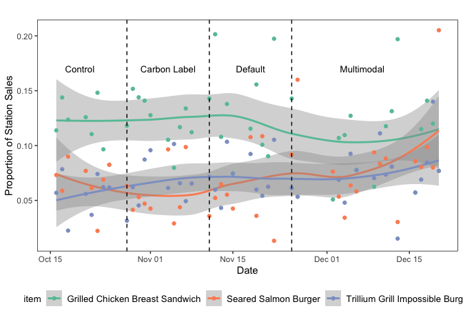<!-- -->

``` r
fall_data %>%
  filter(station=="Grill") %>%
  filter(item_cat=="Main") %>%
  group_by(date,menu_condition,station,item) %>%
  summarise(total_count=sum(count)) %>%
  mutate(prop_low=case_when(item=="Black Bean Burger"&menu_condition=="Carbon Label"&date=="1-Nov"~total_count/(94),
                             item=="Black Bean Burger"&menu_condition=="Multimodal"&date=="10-Dec"~total_count/(72),
                             item=="Black Bean Burger"&menu_condition=="Multimodal"&date=="11-Dec"~total_count/(68),
                             item=="Black Bean Burger"&menu_condition=="Default"&date=="11-Nov"~total_count/(112),
                             item=="Black Bean Burger"&menu_condition=="Multimodal"&date=="12-Dec"~total_count/(99),
                             item=="Black Bean Burger"&menu_condition=="Default"&date=="12-Nov"~total_count/(134),
                             item=="Black Bean Burger"&menu_condition=="Multimodal"&date=="13-Dec"~total_count/(66),
                             item=="Black Bean Burger"&menu_condition=="Default"&date=="13-Nov"~total_count/(139),
                             item=="Black Bean Burger"&menu_condition=="Default"&date=="14-Nov"~total_count/(145),
                             item=="Black Bean Burger"&menu_condition=="Default"&date=="15-Nov"~total_count/(94),
                             item=="Black Bean Burger"&menu_condition=="Multimodal"&date=="16-Dec"~total_count/(70),
                             item=="Black Bean Burger"&menu_condition=="Control"&date=="16-Oct"~total_count/(123),
                             item=="Black Bean Burger"&menu_condition=="Multimodal"&date=="17-Dec"~total_count/(87),
                             item=="Black Bean Burger"&menu_condition=="Control"&date=="17-Oct"~total_count/(153),
                             item=="Black Bean Burger"&menu_condition=="Multimodal"&date=="18-Dec"~total_count/(71),
                             item=="Black Bean Burger"&menu_condition=="Default"&date=="18-Nov"~total_count/(130),
                             item=="Black Bean Burger"&menu_condition=="Control"&date=="18-Oct"~total_count/(89),
                             item=="Black Bean Burger"&menu_condition=="Multimodal"&date=="19-Dec"~total_count/(50),
                             item=="Black Bean Burger"&menu_condition=="Default"&date=="19-Nov"~total_count/(167),
                             item=="Black Bean Burger"&menu_condition=="Multimodal"&date=="2-Dec"~total_count/(118),
                             item=="Black Bean Burger"&menu_condition=="Multimodal"&date=="20-Dec"~total_count/(39),
                             item=="Black Bean Burger"&menu_condition=="Default"&date=="20-Nov"~total_count/(129),
                             item=="Black Bean Burger"&menu_condition=="Default"&date=="21-Nov"~total_count/(144),
                             item=="Black Bean Burger"&menu_condition=="Control"&date=="21-Oct"~total_count/(143),
                             item=="Black Bean Burger"&menu_condition=="Default"&date=="22-Nov"~total_count/(76),
                             item=="Black Bean Burger"&menu_condition=="Control"&date=="22-Oct"~total_count/(163),
                             item=="Black Bean Burger"&menu_condition=="Control"&date=="23-Oct"~total_count/(135),
                             item=="Black Bean Burger"&menu_condition=="Control"&date=="24-Oct"~total_count/(145),
                             item=="Black Bean Burger"&menu_condition=="Multimodal"&date=="25-Nov"~total_count/(98),
                             item=="Black Bean Burger"&menu_condition=="Control"&date=="25-Oct"~total_count/(97),
                             item=="Black Bean Burger"&menu_condition=="Multimodal"&date=="26-Nov"~total_count/(75),
                             item=="Black Bean Burger"&menu_condition=="Carbon Label"&date=="28-Oct"~total_count/(127),
                             item=="Black Bean Burger"&menu_condition=="Carbon Label"&date=="29-Oct"~total_count/(145),
                             item=="Black Bean Burger"&menu_condition=="Multimodal"&date=="3-Dec"~total_count/(131),
                             item=="Black Bean Burger"&menu_condition=="Carbon Label"&date=="30-Oct"~total_count/(132),
                             item=="Black Bean Burger"&menu_condition=="Carbon Label"&date=="31-Oct"~total_count/(149),
                             item=="Black Bean Burger"&menu_condition=="Multimodal"&date=="4-Dec"~total_count/(146),
                             item=="Black Bean Burger"&menu_condition=="Carbon Label"&date=="4-Nov"~total_count/(114),
                             item=="Black Bean Burger"&menu_condition=="Multimodal"&date=="5-Dec"~total_count/(173),
                             item=="Black Bean Burger"&menu_condition=="Carbon Label"&date=="5-Nov"~total_count/(138),
                             item=="Black Bean Burger"&menu_condition=="Multimodal"&date=="6-Dec"~total_count/(103),
                             item=="Black Bean Burger"&menu_condition=="Carbon Label"&date=="6-Nov"~total_count/(137),
                             item=="Black Bean Burger"&menu_condition=="Carbon Label"&date=="7-Nov"~total_count/(142),
                             item=="Black Bean Burger"&menu_condition=="Carbon Label"&date=="8-Nov"~total_count/(107),
                             item=="Black Bean Burger"&menu_condition=="Multimodal"&date=="9-Dec"~total_count/(128))) %>%
  drop_na(prop_low) %>%
  mutate(date=case_when(date=="16-Oct"~"2024-10-16",
                        date=="17-Oct"~"2024-10-17",
                        date=="18-Oct"~"2024-10-18",
                        date=="21-Oct"~"2024-10-21",
                        date=="22-Oct"~"2024-10-22",
                        date=="23-Oct"~"2024-10-23",
                        date=="24-Oct"~"2024-10-24",
                        date=="25-Oct"~"2024-10-25",
                        date=="28-Oct"~"2024-10-28",
                        date=="29-Oct"~"2024-10-29",
                        date=="30-Oct"~"2024-10-30",
                        date=="31-Oct"~"2024-10-31",
                        date=="1-Nov"~"2024-11-1",
                        date=="4-Nov"~"2024-11-4",
                        date=="5-Nov"~"2024-11-5",
                        date=="6-Nov"~"2024-11-6",
                        date=="7-Nov"~"2024-11-7",
                        date=="8-Nov"~"2024-11-8",
                        date=="11-Nov"~"2024-11-11",
                        date=="12-Nov"~"2024-11-12",
                        date=="13-Nov"~"2024-11-13",
                        date=="14-Nov"~"2024-11-14",
                        date=="15-Nov"~"2024-11-15",
                        date=="18-Nov"~"2024-11-18",
                        date=="19-Nov"~"2024-11-19",
                        date=="20-Nov"~"2024-11-20",
                        date=="21-Nov"~"2024-11-21",
                        date=="22-Nov"~"2024-11-22",
                        date=="25-Nov"~"2024-11-25",
                        date=="26-Nov"~"2024-11-26",
                        date=="2-Dec"~"2024-12-2",
                        date=="3-Dec"~"2024-12-3",
                        date=="4-Dec"~"2024-12-4",
                        date=="5-Dec"~"2024-12-5",
                        date=="6-Dec"~"2024-12-6",
                        date=="9-Dec"~"2024-12-9",
                        date=="10-Dec"~"2024-12-10",
                        date=="11-Dec"~"2024-12-11",
                        date=="12-Dec"~"2024-12-12",
                        date=="13-Dec"~"2024-12-13",
                        date=="16-Dec"~"2024-12-16",
                        date=="17-Dec"~"2024-12-17",
                        date=="18-Dec"~"2024-12-18",
                        date=="19-Dec"~"2024-12-19",
                        date=="20-Dec"~"2024-12-20")) %>%
  mutate(date=as.Date(date)) %>%
  mutate(item=case_when(item=="Black Bean Burger"~"Lowest-Carbon Offering")) %>%
  ggplot(aes(x=menu_condition,y=prop_low)) +
  geom_violin() + 
  geom_jitter() +
  scale_x_discrete(limits=c("Control","Carbon Label","Default","Multimodal")) +
  coord_flip()
```

    ## `summarise()` has grouped output by 'date', 'menu_condition', 'station'. You
    ## can override using the `.groups` argument.

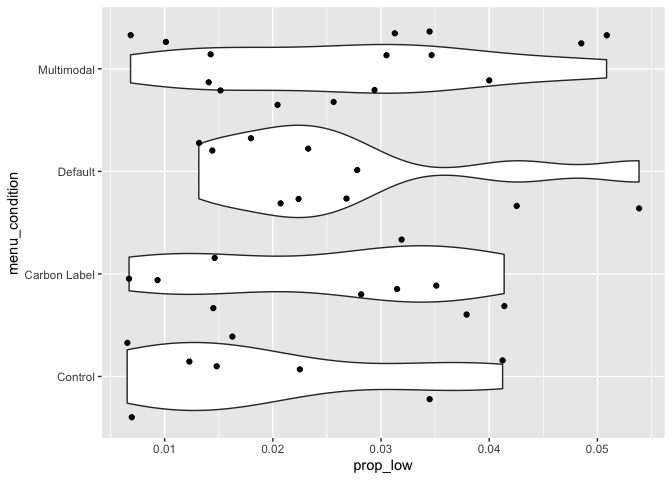<!-- -->

``` r
fall_data %>%
  filter(station=="Ramen") %>%
  filter(item_cat=="Main") %>%
  group_by(menu_condition,station,item) %>%
  summarise(total_count=sum(count)) %>%
  mutate(prop=case_when(menu_condition=="Carbon Label"~total_count/(685+135),
                        menu_condition=="Control"~total_count/(563+108),
                        menu_condition=="Default"~total_count/(698+172),
                        menu_condition=="Multimodal"~total_count/(860+182))) %>%
  filter(item=="Bowl Ramen Tofu")
```

    ## `summarise()` has grouped output by 'menu_condition', 'station'. You can
    ## override using the `.groups` argument.

    ## # A tibble: 4 × 5
    ## # Groups:   menu_condition, station [4]
    ##   menu_condition station item            total_count  prop
    ##   <chr>          <chr>   <chr>                 <int> <dbl>
    ## 1 Carbon Label   Ramen   Bowl Ramen Tofu         135 0.165
    ## 2 Control        Ramen   Bowl Ramen Tofu         108 0.161
    ## 3 Default        Ramen   Bowl Ramen Tofu         172 0.198
    ## 4 Multimodal     Ramen   Bowl Ramen Tofu         182 0.175

``` r
fall_prop_low_ramen_kruskal_data <- fall_data %>%
  filter(station=="Ramen") %>%
  filter(item_cat=="Main") %>%
  group_by(date,menu_condition,station,item) %>%
  summarise(total_count=sum(count)) %>%
  mutate(prop_low=case_when(item=="Bowl Ramen Tofu"&menu_condition=="Carbon Label"&date=="1-Nov"~total_count/(34+13),
                             item=="Bowl Ramen Tofu"&menu_condition=="Multimodal"&date=="10-Dec"~total_count/(37+4),
                             item=="Bowl Ramen Tofu"&menu_condition=="Multimodal"&date=="11-Dec"~total_count/(42+7),
                             item=="Bowl Ramen Tofu"&menu_condition=="Default"&date=="11-Nov"~total_count/(69+12),
                             item=="Bowl Ramen Tofu"&menu_condition=="Multimodal"&date=="12-Dec"~total_count/(46+9),
                             item=="Bowl Ramen Tofu"&menu_condition=="Default"&date=="12-Nov"~total_count/(76+19),
                             item=="Bowl Ramen Tofu"&menu_condition=="Multimodal"&date=="13-Dec"~total_count/(50+7),
                             item=="Bowl Ramen Tofu"&menu_condition=="Default"&date=="13-Nov"~total_count/(74+17),
                             item=="Bowl Ramen Tofu"&menu_condition=="Default"&date=="14-Nov"~total_count/(78+21),
                             item=="Bowl Ramen Tofu"&menu_condition=="Default"&date=="15-Nov"~total_count/(59+17),
                             item=="Bowl Ramen Tofu"&menu_condition=="Multimodal"&date=="16-Dec"~total_count/(40+7),
                             item=="Bowl Ramen Tofu"&menu_condition=="Control"&date=="16-Oct"~total_count/(88+16),
                             item=="Bowl Ramen Tofu"&menu_condition=="Multimodal"&date=="17-Dec"~total_count/(35+6),
                             item=="Bowl Ramen Tofu"&menu_condition=="Control"&date=="17-Oct"~total_count/(68+14),
                             item=="Bowl Ramen Tofu"&menu_condition=="Multimodal"&date=="18-Dec"~total_count/(39+7),
                             item=="Bowl Ramen Tofu"&menu_condition=="Default"&date=="18-Nov"~total_count/(66+11),
                             item=="Bowl Ramen Tofu"&menu_condition=="Control"&date=="18-Oct"~total_count/(44+21),
                             item=="Bowl Ramen Tofu"&menu_condition=="Multimodal"&date=="19-Dec"~total_count/(10+4),
                             item=="Bowl Ramen Tofu"&menu_condition=="Default"&date=="19-Nov"~total_count/(70+28),
                             item=="Bowl Ramen Tofu"&menu_condition=="Multimodal"&date=="2-Dec"~total_count/(94+19),
                             item=="Bowl Ramen Tofu"&menu_condition=="Multimodal"&date=="20-Dec"~total_count/(21+2),
                             item=="Bowl Ramen Tofu"&menu_condition=="Default"&date=="20-Nov"~total_count/(80+19),
                             item=="Bowl Ramen Tofu"&menu_condition=="Default"&date=="21-Nov"~total_count/(77+20),
                             item=="Bowl Ramen Tofu"&menu_condition=="Control"&date=="21-Oct"~total_count/(71+14),
                             item=="Bowl Ramen Tofu"&menu_condition=="Default"&date=="22-Nov"~total_count/(49+8),
                             item=="Bowl Ramen Tofu"&menu_condition=="Control"&date=="22-Oct"~total_count/(73+10),
                             item=="Bowl Ramen Tofu"&menu_condition=="Control"&date=="23-Oct"~total_count/(83+9),
                             item=="Bowl Ramen Tofu"&menu_condition=="Control"&date=="24-Oct"~total_count/(92+15),
                             item=="Bowl Ramen Tofu"&menu_condition=="Multimodal"&date=="25-Nov"~total_count/(56+10),
                             item=="Bowl Ramen Tofu"&menu_condition=="Control"&date=="25-Oct"~total_count/(44+9),
                             item=="Bowl Ramen Tofu"&menu_condition=="Multimodal"&date=="26-Nov"~total_count/(45+6),
                             item=="Bowl Ramen Tofu"&menu_condition=="Carbon Label"&date=="28-Oct"~total_count/(65+11),
                             item=="Bowl Ramen Tofu"&menu_condition=="Carbon Label"&date=="29-Oct"~total_count/(67+13),
                             item=="Bowl Ramen Tofu"&menu_condition=="Multimodal"&date=="3-Dec"~total_count/(76+21),
                             item=="Bowl Ramen Tofu"&menu_condition=="Carbon Label"&date=="30-Oct"~total_count/(70+12),
                             item=="Bowl Ramen Tofu"&menu_condition=="Carbon Label"&date=="31-Oct"~total_count/(79+10),
                             item=="Bowl Ramen Tofu"&menu_condition=="Multimodal"&date=="4-Dec"~total_count/(84+13),
                             item=="Bowl Ramen Tofu"&menu_condition=="Carbon Label"&date=="4-Nov"~total_count/(65+20),
                             item=="Bowl Ramen Tofu"&menu_condition=="Multimodal"&date=="5-Dec"~total_count/(70+22),
                             item=="Bowl Ramen Tofu"&menu_condition=="Carbon Label"&date=="5-Nov"~total_count/(73+11),
                             item=="Bowl Ramen Tofu"&menu_condition=="Multimodal"&date=="6-Dec"~total_count/(58+18),
                             item=="Bowl Ramen Tofu"&menu_condition=="Carbon Label"&date=="6-Nov"~total_count/(90+17),
                             item=="Bowl Ramen Tofu"&menu_condition=="Carbon Label"&date=="7-Nov"~total_count/(83+14),
                             item=="Bowl Ramen Tofu"&menu_condition=="Carbon Label"&date=="8-Nov"~total_count/(59+14),
                             item=="Bowl Ramen Tofu"&menu_condition=="Multimodal"&date=="9-Dec"~total_count/(57+20))) %>%
drop_na(prop_low) %>%
  mutate(date=case_when(date=="16-Oct"~"2024-10-16",
                        date=="17-Oct"~"2024-10-17",
                        date=="18-Oct"~"2024-10-18",
                        date=="21-Oct"~"2024-10-21",
                        date=="22-Oct"~"2024-10-22",
                        date=="23-Oct"~"2024-10-23",
                        date=="24-Oct"~"2024-10-24",
                        date=="25-Oct"~"2024-10-25",
                        date=="28-Oct"~"2024-10-28",
                        date=="29-Oct"~"2024-10-29",
                        date=="30-Oct"~"2024-10-30",
                        date=="31-Oct"~"2024-10-31",
                        date=="1-Nov"~"2024-11-1",
                        date=="4-Nov"~"2024-11-4",
                        date=="5-Nov"~"2024-11-5",
                        date=="6-Nov"~"2024-11-6",
                        date=="7-Nov"~"2024-11-7",
                        date=="8-Nov"~"2024-11-8",
                        date=="11-Nov"~"2024-11-11",
                        date=="12-Nov"~"2024-11-12",
                        date=="13-Nov"~"2024-11-13",
                        date=="14-Nov"~"2024-11-14",
                        date=="15-Nov"~"2024-11-15",
                        date=="18-Nov"~"2024-11-18",
                        date=="19-Nov"~"2024-11-19",
                        date=="20-Nov"~"2024-11-20",
                        date=="21-Nov"~"2024-11-21",
                        date=="22-Nov"~"2024-11-22",
                        date=="25-Nov"~"2024-11-25",
                        date=="26-Nov"~"2024-11-26",
                        date=="2-Dec"~"2024-12-2",
                        date=="3-Dec"~"2024-12-3",
                        date=="4-Dec"~"2024-12-4",
                        date=="5-Dec"~"2024-12-5",
                        date=="6-Dec"~"2024-12-6",
                        date=="9-Dec"~"2024-12-9",
                        date=="10-Dec"~"2024-12-10",
                        date=="11-Dec"~"2024-12-11",
                        date=="12-Dec"~"2024-12-12",
                        date=="13-Dec"~"2024-12-13",
                        date=="16-Dec"~"2024-12-16",
                        date=="17-Dec"~"2024-12-17",
                        date=="18-Dec"~"2024-12-18",
                        date=="19-Dec"~"2024-12-19",
                        date=="20-Dec"~"2024-12-20")) %>%
  mutate(date=as.Date(date)) %>%
  mutate(item=case_when(item=="Bowl Ramen Tofu"~"Lowest-Carbon Offering")) %>%
  ungroup() %>%
  select(menu_condition,prop_low) 
```

    ## `summarise()` has grouped output by 'date', 'menu_condition', 'station'. You
    ## can override using the `.groups` argument.

``` r
kruskal.test(prop_low~menu_condition,data=fall_prop_low_ramen_kruskal_data) 
```

    ## 
    ##  Kruskal-Wallis rank sum test
    ## 
    ## data:  prop_low by menu_condition
    ## Kruskal-Wallis chi-squared = 2.3428, df = 3, p-value = 0.5044

``` r
fall_prop_low_ramen_ttest_data <- fall_data %>%
  filter(station=="Ramen") %>%
  filter(item_cat=="Main") %>%
  group_by(date,menu_condition,station,item) %>%
  summarise(total_count=sum(count)) %>%
  mutate(prop_low=case_when(item=="Bowl Ramen Tofu"&menu_condition=="Carbon Label"&date=="1-Nov"~total_count/(34+13),
                             item=="Bowl Ramen Tofu"&menu_condition=="Multimodal"&date=="10-Dec"~total_count/(37+4),
                             item=="Bowl Ramen Tofu"&menu_condition=="Multimodal"&date=="11-Dec"~total_count/(42+7),
                             item=="Bowl Ramen Tofu"&menu_condition=="Default"&date=="11-Nov"~total_count/(69+12),
                             item=="Bowl Ramen Tofu"&menu_condition=="Multimodal"&date=="12-Dec"~total_count/(46+9),
                             item=="Bowl Ramen Tofu"&menu_condition=="Default"&date=="12-Nov"~total_count/(76+19),
                             item=="Bowl Ramen Tofu"&menu_condition=="Multimodal"&date=="13-Dec"~total_count/(50+7),
                             item=="Bowl Ramen Tofu"&menu_condition=="Default"&date=="13-Nov"~total_count/(74+17),
                             item=="Bowl Ramen Tofu"&menu_condition=="Default"&date=="14-Nov"~total_count/(78+21),
                             item=="Bowl Ramen Tofu"&menu_condition=="Default"&date=="15-Nov"~total_count/(59+17),
                             item=="Bowl Ramen Tofu"&menu_condition=="Multimodal"&date=="16-Dec"~total_count/(40+7),
                             item=="Bowl Ramen Tofu"&menu_condition=="Control"&date=="16-Oct"~total_count/(88+16),
                             item=="Bowl Ramen Tofu"&menu_condition=="Multimodal"&date=="17-Dec"~total_count/(35+6),
                             item=="Bowl Ramen Tofu"&menu_condition=="Control"&date=="17-Oct"~total_count/(68+14),
                             item=="Bowl Ramen Tofu"&menu_condition=="Multimodal"&date=="18-Dec"~total_count/(39+7),
                             item=="Bowl Ramen Tofu"&menu_condition=="Default"&date=="18-Nov"~total_count/(66+11),
                             item=="Bowl Ramen Tofu"&menu_condition=="Control"&date=="18-Oct"~total_count/(44+21),
                             item=="Bowl Ramen Tofu"&menu_condition=="Multimodal"&date=="19-Dec"~total_count/(10+4),
                             item=="Bowl Ramen Tofu"&menu_condition=="Default"&date=="19-Nov"~total_count/(70+28),
                             item=="Bowl Ramen Tofu"&menu_condition=="Multimodal"&date=="2-Dec"~total_count/(94+19),
                             item=="Bowl Ramen Tofu"&menu_condition=="Multimodal"&date=="20-Dec"~total_count/(21+2),
                             item=="Bowl Ramen Tofu"&menu_condition=="Default"&date=="20-Nov"~total_count/(80+19),
                             item=="Bowl Ramen Tofu"&menu_condition=="Default"&date=="21-Nov"~total_count/(77+20),
                             item=="Bowl Ramen Tofu"&menu_condition=="Control"&date=="21-Oct"~total_count/(71+14),
                             item=="Bowl Ramen Tofu"&menu_condition=="Default"&date=="22-Nov"~total_count/(49+8),
                             item=="Bowl Ramen Tofu"&menu_condition=="Control"&date=="22-Oct"~total_count/(73+10),
                             item=="Bowl Ramen Tofu"&menu_condition=="Control"&date=="23-Oct"~total_count/(83+9),
                             item=="Bowl Ramen Tofu"&menu_condition=="Control"&date=="24-Oct"~total_count/(92+15),
                             item=="Bowl Ramen Tofu"&menu_condition=="Multimodal"&date=="25-Nov"~total_count/(56+10),
                             item=="Bowl Ramen Tofu"&menu_condition=="Control"&date=="25-Oct"~total_count/(44+9),
                             item=="Bowl Ramen Tofu"&menu_condition=="Multimodal"&date=="26-Nov"~total_count/(45+6),
                             item=="Bowl Ramen Tofu"&menu_condition=="Carbon Label"&date=="28-Oct"~total_count/(65+11),
                             item=="Bowl Ramen Tofu"&menu_condition=="Carbon Label"&date=="29-Oct"~total_count/(67+13),
                             item=="Bowl Ramen Tofu"&menu_condition=="Multimodal"&date=="3-Dec"~total_count/(76+21),
                             item=="Bowl Ramen Tofu"&menu_condition=="Carbon Label"&date=="30-Oct"~total_count/(70+12),
                             item=="Bowl Ramen Tofu"&menu_condition=="Carbon Label"&date=="31-Oct"~total_count/(79+10),
                             item=="Bowl Ramen Tofu"&menu_condition=="Multimodal"&date=="4-Dec"~total_count/(84+13),
                             item=="Bowl Ramen Tofu"&menu_condition=="Carbon Label"&date=="4-Nov"~total_count/(65+20),
                             item=="Bowl Ramen Tofu"&menu_condition=="Multimodal"&date=="5-Dec"~total_count/(70+22),
                             item=="Bowl Ramen Tofu"&menu_condition=="Carbon Label"&date=="5-Nov"~total_count/(73+11),
                             item=="Bowl Ramen Tofu"&menu_condition=="Multimodal"&date=="6-Dec"~total_count/(58+18),
                             item=="Bowl Ramen Tofu"&menu_condition=="Carbon Label"&date=="6-Nov"~total_count/(90+17),
                             item=="Bowl Ramen Tofu"&menu_condition=="Carbon Label"&date=="7-Nov"~total_count/(83+14),
                             item=="Bowl Ramen Tofu"&menu_condition=="Carbon Label"&date=="8-Nov"~total_count/(59+14),
                             item=="Bowl Ramen Tofu"&menu_condition=="Multimodal"&date=="9-Dec"~total_count/(57+20))) %>%
drop_na(prop_low) %>%
  mutate(date=case_when(date=="16-Oct"~"2024-10-16",
                        date=="17-Oct"~"2024-10-17",
                        date=="18-Oct"~"2024-10-18",
                        date=="21-Oct"~"2024-10-21",
                        date=="22-Oct"~"2024-10-22",
                        date=="23-Oct"~"2024-10-23",
                        date=="24-Oct"~"2024-10-24",
                        date=="25-Oct"~"2024-10-25",
                        date=="28-Oct"~"2024-10-28",
                        date=="29-Oct"~"2024-10-29",
                        date=="30-Oct"~"2024-10-30",
                        date=="31-Oct"~"2024-10-31",
                        date=="1-Nov"~"2024-11-1",
                        date=="4-Nov"~"2024-11-4",
                        date=="5-Nov"~"2024-11-5",
                        date=="6-Nov"~"2024-11-6",
                        date=="7-Nov"~"2024-11-7",
                        date=="8-Nov"~"2024-11-8",
                        date=="11-Nov"~"2024-11-11",
                        date=="12-Nov"~"2024-11-12",
                        date=="13-Nov"~"2024-11-13",
                        date=="14-Nov"~"2024-11-14",
                        date=="15-Nov"~"2024-11-15",
                        date=="18-Nov"~"2024-11-18",
                        date=="19-Nov"~"2024-11-19",
                        date=="20-Nov"~"2024-11-20",
                        date=="21-Nov"~"2024-11-21",
                        date=="22-Nov"~"2024-11-22",
                        date=="25-Nov"~"2024-11-25",
                        date=="26-Nov"~"2024-11-26",
                        date=="2-Dec"~"2024-12-2",
                        date=="3-Dec"~"2024-12-3",
                        date=="4-Dec"~"2024-12-4",
                        date=="5-Dec"~"2024-12-5",
                        date=="6-Dec"~"2024-12-6",
                        date=="9-Dec"~"2024-12-9",
                        date=="10-Dec"~"2024-12-10",
                        date=="11-Dec"~"2024-12-11",
                        date=="12-Dec"~"2024-12-12",
                        date=="13-Dec"~"2024-12-13",
                        date=="16-Dec"~"2024-12-16",
                        date=="17-Dec"~"2024-12-17",
                        date=="18-Dec"~"2024-12-18",
                        date=="19-Dec"~"2024-12-19",
                        date=="20-Dec"~"2024-12-20")) %>%
  mutate(date=as.Date(date)) %>%
  mutate(item=case_when(item=="Bowl Ramen Tofu"~"Lowest-Carbon Offering")) %>%
  ungroup() %>%
  select(menu_condition,prop_low) %>%
  filter(menu_condition=="Control"|menu_condition=="Default") %>%
  arrange(menu_condition)
```

    ## `summarise()` has grouped output by 'date', 'menu_condition', 'station'. You
    ## can override using the `.groups` argument.

``` r
t.test(prop_low~menu_condition,data=fall_prop_low_ramen_ttest_data)
```

    ## 
    ##  Welch Two Sample t-test
    ## 
    ## data:  prop_low by menu_condition
    ## t = -0.94439, df = 11.498, p-value = 0.3644
    ## alternative hypothesis: true difference in means between group Control and group Default is not equal to 0
    ## 95 percent confidence interval:
    ##  -0.08692669  0.03453465
    ## sample estimates:
    ## mean in group Control mean in group Default 
    ##             0.1675834             0.1937794

``` r
fall_prop_low_ramen_aov_data <- fall_data %>%
  filter(station=="Ramen") %>%
  filter(item_cat=="Main") %>%
  group_by(date,menu_condition,station,item) %>%
  summarise(total_count=sum(count)) %>%
  mutate(prop_low=case_when(item=="Bowl Ramen Tofu"&menu_condition=="Carbon Label"&date=="1-Nov"~total_count/(34+13),
                             item=="Bowl Ramen Tofu"&menu_condition=="Multimodal"&date=="10-Dec"~total_count/(37+4),
                             item=="Bowl Ramen Tofu"&menu_condition=="Multimodal"&date=="11-Dec"~total_count/(42+7),
                             item=="Bowl Ramen Tofu"&menu_condition=="Default"&date=="11-Nov"~total_count/(69+12),
                             item=="Bowl Ramen Tofu"&menu_condition=="Multimodal"&date=="12-Dec"~total_count/(46+9),
                             item=="Bowl Ramen Tofu"&menu_condition=="Default"&date=="12-Nov"~total_count/(76+19),
                             item=="Bowl Ramen Tofu"&menu_condition=="Multimodal"&date=="13-Dec"~total_count/(50+7),
                             item=="Bowl Ramen Tofu"&menu_condition=="Default"&date=="13-Nov"~total_count/(74+17),
                             item=="Bowl Ramen Tofu"&menu_condition=="Default"&date=="14-Nov"~total_count/(78+21),
                             item=="Bowl Ramen Tofu"&menu_condition=="Default"&date=="15-Nov"~total_count/(59+17),
                             item=="Bowl Ramen Tofu"&menu_condition=="Multimodal"&date=="16-Dec"~total_count/(40+7),
                             item=="Bowl Ramen Tofu"&menu_condition=="Control"&date=="16-Oct"~total_count/(88+16),
                             item=="Bowl Ramen Tofu"&menu_condition=="Multimodal"&date=="17-Dec"~total_count/(35+6),
                             item=="Bowl Ramen Tofu"&menu_condition=="Control"&date=="17-Oct"~total_count/(68+14),
                             item=="Bowl Ramen Tofu"&menu_condition=="Multimodal"&date=="18-Dec"~total_count/(39+7),
                             item=="Bowl Ramen Tofu"&menu_condition=="Default"&date=="18-Nov"~total_count/(66+11),
                             item=="Bowl Ramen Tofu"&menu_condition=="Control"&date=="18-Oct"~total_count/(44+21),
                             item=="Bowl Ramen Tofu"&menu_condition=="Multimodal"&date=="19-Dec"~total_count/(10+4),
                             item=="Bowl Ramen Tofu"&menu_condition=="Default"&date=="19-Nov"~total_count/(70+28),
                             item=="Bowl Ramen Tofu"&menu_condition=="Multimodal"&date=="2-Dec"~total_count/(94+19),
                             item=="Bowl Ramen Tofu"&menu_condition=="Multimodal"&date=="20-Dec"~total_count/(21+2),
                             item=="Bowl Ramen Tofu"&menu_condition=="Default"&date=="20-Nov"~total_count/(80+19),
                             item=="Bowl Ramen Tofu"&menu_condition=="Default"&date=="21-Nov"~total_count/(77+20),
                             item=="Bowl Ramen Tofu"&menu_condition=="Control"&date=="21-Oct"~total_count/(71+14),
                             item=="Bowl Ramen Tofu"&menu_condition=="Default"&date=="22-Nov"~total_count/(49+8),
                             item=="Bowl Ramen Tofu"&menu_condition=="Control"&date=="22-Oct"~total_count/(73+10),
                             item=="Bowl Ramen Tofu"&menu_condition=="Control"&date=="23-Oct"~total_count/(83+9),
                             item=="Bowl Ramen Tofu"&menu_condition=="Control"&date=="24-Oct"~total_count/(92+15),
                             item=="Bowl Ramen Tofu"&menu_condition=="Multimodal"&date=="25-Nov"~total_count/(56+10),
                             item=="Bowl Ramen Tofu"&menu_condition=="Control"&date=="25-Oct"~total_count/(44+9),
                             item=="Bowl Ramen Tofu"&menu_condition=="Multimodal"&date=="26-Nov"~total_count/(45+6),
                             item=="Bowl Ramen Tofu"&menu_condition=="Carbon Label"&date=="28-Oct"~total_count/(65+11),
                             item=="Bowl Ramen Tofu"&menu_condition=="Carbon Label"&date=="29-Oct"~total_count/(67+13),
                             item=="Bowl Ramen Tofu"&menu_condition=="Multimodal"&date=="3-Dec"~total_count/(76+21),
                             item=="Bowl Ramen Tofu"&menu_condition=="Carbon Label"&date=="30-Oct"~total_count/(70+12),
                             item=="Bowl Ramen Tofu"&menu_condition=="Carbon Label"&date=="31-Oct"~total_count/(79+10),
                             item=="Bowl Ramen Tofu"&menu_condition=="Multimodal"&date=="4-Dec"~total_count/(84+13),
                             item=="Bowl Ramen Tofu"&menu_condition=="Carbon Label"&date=="4-Nov"~total_count/(65+20),
                             item=="Bowl Ramen Tofu"&menu_condition=="Multimodal"&date=="5-Dec"~total_count/(70+22),
                             item=="Bowl Ramen Tofu"&menu_condition=="Carbon Label"&date=="5-Nov"~total_count/(73+11),
                             item=="Bowl Ramen Tofu"&menu_condition=="Multimodal"&date=="6-Dec"~total_count/(58+18),
                             item=="Bowl Ramen Tofu"&menu_condition=="Carbon Label"&date=="6-Nov"~total_count/(90+17),
                             item=="Bowl Ramen Tofu"&menu_condition=="Carbon Label"&date=="7-Nov"~total_count/(83+14),
                             item=="Bowl Ramen Tofu"&menu_condition=="Carbon Label"&date=="8-Nov"~total_count/(59+14),
                             item=="Bowl Ramen Tofu"&menu_condition=="Multimodal"&date=="9-Dec"~total_count/(57+20))) %>%
drop_na(prop_low) %>%
  mutate(date=case_when(date=="16-Oct"~"2024-10-16",
                        date=="17-Oct"~"2024-10-17",
                        date=="18-Oct"~"2024-10-18",
                        date=="21-Oct"~"2024-10-21",
                        date=="22-Oct"~"2024-10-22",
                        date=="23-Oct"~"2024-10-23",
                        date=="24-Oct"~"2024-10-24",
                        date=="25-Oct"~"2024-10-25",
                        date=="28-Oct"~"2024-10-28",
                        date=="29-Oct"~"2024-10-29",
                        date=="30-Oct"~"2024-10-30",
                        date=="31-Oct"~"2024-10-31",
                        date=="1-Nov"~"2024-11-1",
                        date=="4-Nov"~"2024-11-4",
                        date=="5-Nov"~"2024-11-5",
                        date=="6-Nov"~"2024-11-6",
                        date=="7-Nov"~"2024-11-7",
                        date=="8-Nov"~"2024-11-8",
                        date=="11-Nov"~"2024-11-11",
                        date=="12-Nov"~"2024-11-12",
                        date=="13-Nov"~"2024-11-13",
                        date=="14-Nov"~"2024-11-14",
                        date=="15-Nov"~"2024-11-15",
                        date=="18-Nov"~"2024-11-18",
                        date=="19-Nov"~"2024-11-19",
                        date=="20-Nov"~"2024-11-20",
                        date=="21-Nov"~"2024-11-21",
                        date=="22-Nov"~"2024-11-22",
                        date=="25-Nov"~"2024-11-25",
                        date=="26-Nov"~"2024-11-26",
                        date=="2-Dec"~"2024-12-2",
                        date=="3-Dec"~"2024-12-3",
                        date=="4-Dec"~"2024-12-4",
                        date=="5-Dec"~"2024-12-5",
                        date=="6-Dec"~"2024-12-6",
                        date=="9-Dec"~"2024-12-9",
                        date=="10-Dec"~"2024-12-10",
                        date=="11-Dec"~"2024-12-11",
                        date=="12-Dec"~"2024-12-12",
                        date=="13-Dec"~"2024-12-13",
                        date=="16-Dec"~"2024-12-16",
                        date=="17-Dec"~"2024-12-17",
                        date=="18-Dec"~"2024-12-18",
                        date=="19-Dec"~"2024-12-19",
                        date=="20-Dec"~"2024-12-20")) %>%
  mutate(date=as.Date(date)) %>%
  mutate(item=case_when(item=="Bowl Ramen Tofu"~"Lowest-Carbon Offering")) %>%
  ungroup() %>%
  select(menu_condition,prop_low) %>%
  arrange(menu_condition)
```

    ## `summarise()` has grouped output by 'date', 'menu_condition', 'station'. You
    ## can override using the `.groups` argument.

``` r
shapiro.test(fall_prop_low_ramen_aov_data$prop_low) 
```

    ## 
    ##  Shapiro-Wilk normality test
    ## 
    ## data:  fall_prop_low_ramen_aov_data$prop_low
    ## W = 0.93068, p-value = 0.009914

``` r
oneway.test(prop_low~menu_condition,data=fall_prop_low_ramen_aov_data,var.equal=TRUE)
```

    ## 
    ##  One-way analysis of means
    ## 
    ## data:  prop_low and menu_condition
    ## F = 0.52047, num df = 3, denom df = 41, p-value = 0.6706

``` r
fall_prop_low_ramen <- fall_data %>%
  filter(station=="Ramen") %>%
  filter(item_cat=="Main") %>%
  group_by(date,menu_condition,station,item) %>%
  summarise(total_count=sum(count)) %>%
  mutate(prop_low=case_when(item=="Bowl Ramen Tofu"&menu_condition=="Carbon Label"&date=="1-Nov"~total_count/(34+13),
                             item=="Bowl Ramen Tofu"&menu_condition=="Multimodal"&date=="10-Dec"~total_count/(37+4),
                             item=="Bowl Ramen Tofu"&menu_condition=="Multimodal"&date=="11-Dec"~total_count/(42+7),
                             item=="Bowl Ramen Tofu"&menu_condition=="Default"&date=="11-Nov"~total_count/(69+12),
                             item=="Bowl Ramen Tofu"&menu_condition=="Multimodal"&date=="12-Dec"~total_count/(46+9),
                             item=="Bowl Ramen Tofu"&menu_condition=="Default"&date=="12-Nov"~total_count/(76+19),
                             item=="Bowl Ramen Tofu"&menu_condition=="Multimodal"&date=="13-Dec"~total_count/(50+7),
                             item=="Bowl Ramen Tofu"&menu_condition=="Default"&date=="13-Nov"~total_count/(74+17),
                             item=="Bowl Ramen Tofu"&menu_condition=="Default"&date=="14-Nov"~total_count/(78+21),
                             item=="Bowl Ramen Tofu"&menu_condition=="Default"&date=="15-Nov"~total_count/(59+17),
                             item=="Bowl Ramen Tofu"&menu_condition=="Multimodal"&date=="16-Dec"~total_count/(40+7),
                             item=="Bowl Ramen Tofu"&menu_condition=="Control"&date=="16-Oct"~total_count/(88+16),
                             item=="Bowl Ramen Tofu"&menu_condition=="Multimodal"&date=="17-Dec"~total_count/(35+6),
                             item=="Bowl Ramen Tofu"&menu_condition=="Control"&date=="17-Oct"~total_count/(68+14),
                             item=="Bowl Ramen Tofu"&menu_condition=="Multimodal"&date=="18-Dec"~total_count/(39+7),
                             item=="Bowl Ramen Tofu"&menu_condition=="Default"&date=="18-Nov"~total_count/(66+11),
                             item=="Bowl Ramen Tofu"&menu_condition=="Control"&date=="18-Oct"~total_count/(44+21),
                             item=="Bowl Ramen Tofu"&menu_condition=="Multimodal"&date=="19-Dec"~total_count/(10+4),
                             item=="Bowl Ramen Tofu"&menu_condition=="Default"&date=="19-Nov"~total_count/(70+28),
                             item=="Bowl Ramen Tofu"&menu_condition=="Multimodal"&date=="2-Dec"~total_count/(94+19),
                             item=="Bowl Ramen Tofu"&menu_condition=="Multimodal"&date=="20-Dec"~total_count/(21+2),
                             item=="Bowl Ramen Tofu"&menu_condition=="Default"&date=="20-Nov"~total_count/(80+19),
                             item=="Bowl Ramen Tofu"&menu_condition=="Default"&date=="21-Nov"~total_count/(77+20),
                             item=="Bowl Ramen Tofu"&menu_condition=="Control"&date=="21-Oct"~total_count/(71+14),
                             item=="Bowl Ramen Tofu"&menu_condition=="Default"&date=="22-Nov"~total_count/(49+8),
                             item=="Bowl Ramen Tofu"&menu_condition=="Control"&date=="22-Oct"~total_count/(73+10),
                             item=="Bowl Ramen Tofu"&menu_condition=="Control"&date=="23-Oct"~total_count/(83+9),
                             item=="Bowl Ramen Tofu"&menu_condition=="Control"&date=="24-Oct"~total_count/(92+15),
                             item=="Bowl Ramen Tofu"&menu_condition=="Multimodal"&date=="25-Nov"~total_count/(56+10),
                             item=="Bowl Ramen Tofu"&menu_condition=="Control"&date=="25-Oct"~total_count/(44+9),
                             item=="Bowl Ramen Tofu"&menu_condition=="Multimodal"&date=="26-Nov"~total_count/(45+6),
                             item=="Bowl Ramen Tofu"&menu_condition=="Carbon Label"&date=="28-Oct"~total_count/(65+11),
                             item=="Bowl Ramen Tofu"&menu_condition=="Carbon Label"&date=="29-Oct"~total_count/(67+13),
                             item=="Bowl Ramen Tofu"&menu_condition=="Multimodal"&date=="3-Dec"~total_count/(76+21),
                             item=="Bowl Ramen Tofu"&menu_condition=="Carbon Label"&date=="30-Oct"~total_count/(70+12),
                             item=="Bowl Ramen Tofu"&menu_condition=="Carbon Label"&date=="31-Oct"~total_count/(79+10),
                             item=="Bowl Ramen Tofu"&menu_condition=="Multimodal"&date=="4-Dec"~total_count/(84+13),
                             item=="Bowl Ramen Tofu"&menu_condition=="Carbon Label"&date=="4-Nov"~total_count/(65+20),
                             item=="Bowl Ramen Tofu"&menu_condition=="Multimodal"&date=="5-Dec"~total_count/(70+22),
                             item=="Bowl Ramen Tofu"&menu_condition=="Carbon Label"&date=="5-Nov"~total_count/(73+11),
                             item=="Bowl Ramen Tofu"&menu_condition=="Multimodal"&date=="6-Dec"~total_count/(58+18),
                             item=="Bowl Ramen Tofu"&menu_condition=="Carbon Label"&date=="6-Nov"~total_count/(90+17),
                             item=="Bowl Ramen Tofu"&menu_condition=="Carbon Label"&date=="7-Nov"~total_count/(83+14),
                             item=="Bowl Ramen Tofu"&menu_condition=="Carbon Label"&date=="8-Nov"~total_count/(59+14),
                             item=="Bowl Ramen Tofu"&menu_condition=="Multimodal"&date=="9-Dec"~total_count/(57+20))) %>%
drop_na(prop_low) %>%
  mutate(date=case_when(date=="16-Oct"~"2024-10-16",
                        date=="17-Oct"~"2024-10-17",
                        date=="18-Oct"~"2024-10-18",
                        date=="21-Oct"~"2024-10-21",
                        date=="22-Oct"~"2024-10-22",
                        date=="23-Oct"~"2024-10-23",
                        date=="24-Oct"~"2024-10-24",
                        date=="25-Oct"~"2024-10-25",
                        date=="28-Oct"~"2024-10-28",
                        date=="29-Oct"~"2024-10-29",
                        date=="30-Oct"~"2024-10-30",
                        date=="31-Oct"~"2024-10-31",
                        date=="1-Nov"~"2024-11-1",
                        date=="4-Nov"~"2024-11-4",
                        date=="5-Nov"~"2024-11-5",
                        date=="6-Nov"~"2024-11-6",
                        date=="7-Nov"~"2024-11-7",
                        date=="8-Nov"~"2024-11-8",
                        date=="11-Nov"~"2024-11-11",
                        date=="12-Nov"~"2024-11-12",
                        date=="13-Nov"~"2024-11-13",
                        date=="14-Nov"~"2024-11-14",
                        date=="15-Nov"~"2024-11-15",
                        date=="18-Nov"~"2024-11-18",
                        date=="19-Nov"~"2024-11-19",
                        date=="20-Nov"~"2024-11-20",
                        date=="21-Nov"~"2024-11-21",
                        date=="22-Nov"~"2024-11-22",
                        date=="25-Nov"~"2024-11-25",
                        date=="26-Nov"~"2024-11-26",
                        date=="2-Dec"~"2024-12-2",
                        date=="3-Dec"~"2024-12-3",
                        date=="4-Dec"~"2024-12-4",
                        date=="5-Dec"~"2024-12-5",
                        date=="6-Dec"~"2024-12-6",
                        date=="9-Dec"~"2024-12-9",
                        date=="10-Dec"~"2024-12-10",
                        date=="11-Dec"~"2024-12-11",
                        date=="12-Dec"~"2024-12-12",
                        date=="13-Dec"~"2024-12-13",
                        date=="16-Dec"~"2024-12-16",
                        date=="17-Dec"~"2024-12-17",
                        date=="18-Dec"~"2024-12-18",
                        date=="19-Dec"~"2024-12-19",
                        date=="20-Dec"~"2024-12-20")) %>%
  mutate(date=as.Date(date)) %>%
  mutate(item=case_when(item=="Bowl Ramen Tofu"~"Lowest-Carbon Offering")) %>%
  ggplot(aes(x=date,y=prop_low,color=item,fill=item)) + 
  geom_smooth(alpha=0.2) + 
  geom_point() +
  geom_vline(xintercept=as.numeric(daily_prop_low_fall_data$date[fall_vline]),linetype=2) +
  xlab("Date") + 
  ylab("Proportion of Station Sales") +
  scale_color_brewer(palette="Dark2",name="") +
  scale_fill_brewer(palette="Dark2",name="") +
  scale_x_date(breaks=as.Date(c("2024-10-16","2024-10-28","2024-11-11","2024-11-25","2024-12-20")),labels=c("Oct 16","Oct 28","Nov 11","Nov 25","Dec 20")) +
  annotate("text",x=as.Date("2024-10-22"),y=0.1509538,label="Control",size=10/.pt) +
  annotate("text",x=as.Date("2024-11-4"),y=0.1546341,label="Carbon Label",size=10/.pt) +
  annotate("text",x=as.Date("2024-11-18"),y=0.1877011,label="Default",size=10/.pt) +
  annotate("text",x=as.Date("2024-12-7"),y=0.1646641,label="Multimodal",size=10/.pt) +
  annotate("point",x=as.Date("2024-10-22"),y=0.1609538) +
  annotate("point",x=as.Date("2024-11-4"),y=0.1646341) +
  annotate("point",x=as.Date("2024-11-18"),y=0.1977011) +
  annotate("point",x=as.Date("2024-12-7"),y=0.1746641) +
  labs(title="Ramen Station (Treated)",caption="F(3,41)=0.52047, p=0.6706") +
  theme(aspect.ratio=0.55,legend.position="bottom",panel.grid=element_blank(),panel.background=element_rect(fill="white"),panel.border=element_rect(fill=NA),legend.title=element_text(size=10),legend.text=element_text(size=10),plot.title=element_text(size=10),axis.title=element_text(size=10),axis.text=element_text(size=10)) 
```

    ## `summarise()` has grouped output by 'date', 'menu_condition', 'station'. You
    ## can override using the `.groups` argument.

``` r
fall_prop_low_ramen
```

    ## `geom_smooth()` using method = 'loess' and formula = 'y ~ x'

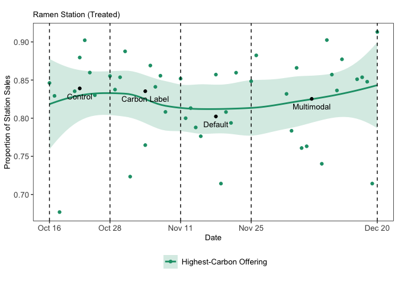<!-- -->

``` r
fall_data %>%
  filter(station=="Ramen"|station=="Grill") %>%
  filter(item_cat=="Main") %>%
  group_by(menu_condition,station,item) %>%
  summarise(total_count=sum(count)) %>%
  mutate(prop=case_when(menu_condition=="Carbon Label"~total_count/(32+159+935+74+85+685+135),
                        menu_condition=="Control"~total_count/(19+125+776+68+60+563+108),
                        menu_condition=="Default"~total_count/(33+167+904+76+90+698+172),
                        menu_condition=="Multimodal"~total_count/(41+165+1157+125+107+860+182))) %>%
   mutate(item=case_when(item=="Bowl Ramen Tofu"~"Lowest-Carbon Offering",
                        item=="Black Bean Burger"~"Lowest-Carbon Offering",
                        item=="Bowl Ramen Chicken"~"Highest-Carbon Offering",
                        item=="Grilled Hamburger"~"Highest-Carbon Offering",
                        item=="Grilled Chicken Breast Sandwich"~"Middle",
                        item=="Seared Salmon Burger"~"Middle",
                        item=="Trillium Grill Impossible Burger"~"Middle")) %>%
  ungroup() %>%
  group_by(menu_condition,item) %>%
  summarise(prop=sum(prop)) %>%
  filter(item=="Lowest-Carbon Offering")
```

    ## `summarise()` has grouped output by 'menu_condition', 'station'. You can
    ## override using the `.groups` argument.
    ## `summarise()` has grouped output by 'menu_condition'. You can override using
    ## the `.groups` argument.

    ## # A tibble: 4 × 3
    ## # Groups:   menu_condition [4]
    ##   menu_condition item                     prop
    ##   <chr>          <chr>                   <dbl>
    ## 1 Carbon Label   Lowest-Carbon Offering 0.0793
    ## 2 Control        Lowest-Carbon Offering 0.0739
    ## 3 Default        Lowest-Carbon Offering 0.0958
    ## 4 Multimodal     Lowest-Carbon Offering 0.0846

``` r
fall_prop_low_treatment_kruskal_data <- fall_data %>%
  filter(station=="Ramen"|station=="Grill") %>%
  filter(item_cat=="Main") %>%
  group_by(date,menu_condition,station,item) %>%
  summarise(total_count=sum(count)) %>%
  mutate(item=case_when(item=="Bowl Ramen Tofu"~"Lowest-Carbon Offering",
                        item=="Black Bean Burger"~"Lowest-Carbon Offering",
                        item=="Bowl Ramen Chicken"~"High",
                        item=="Grilled Hamburger"~"High",
                        item=="Grilled Chicken Breast Sandwich"~"Middle",
                        item=="Seared Salmon Burger"~"Middle",
                        item=="Trillium Grill Impossible Burger"~"Middle")) %>%
  group_by(date,menu_condition,item) %>%
  summarise(total_count=sum(total_count)) %>%
  mutate(prop_low=case_when(item=="Lowest-Carbon Offering"&menu_condition=="Carbon Label"&date=="1-Nov"~total_count/(100+16+25),
                             item=="Lowest-Carbon Offering"&menu_condition=="Multimodal"&date=="10-Dec"~total_count/(89+4+20),
                             item=="Lowest-Carbon Offering"&menu_condition=="Multimodal"&date=="11-Dec"~total_count/(89+9+19),
                             item=="Lowest-Carbon Offering"&menu_condition=="Default"&date=="11-Nov"~total_count/(150+15+28),
                             item=="Lowest-Carbon Offering"&menu_condition=="Multimodal"&date=="12-Dec"~total_count/(115+10+29),
                             item=="Lowest-Carbon Offering"&menu_condition=="Default"&date=="12-Nov"~total_count/(165+22+42),
                             item=="Lowest-Carbon Offering"&menu_condition=="Multimodal"&date=="13-Dec"~total_count/(99+8+16),
                             item=="Lowest-Carbon Offering"&menu_condition=="Default"&date=="13-Nov"~total_count/(181+19+30),
                             item=="Lowest-Carbon Offering"&menu_condition=="Default"&date=="14-Nov"~total_count/(177+24+43),
                             item=="Lowest-Carbon Offering"&menu_condition=="Default"&date=="15-Nov"~total_count/(131+21+18),
                             item=="Lowest-Carbon Offering"&menu_condition=="Multimodal"&date=="16-Dec"~total_count/(95+8+14),
                             item=="Lowest-Carbon Offering"&menu_condition=="Control"&date=="16-Oct"~total_count/(179+18+30),
                             item=="Lowest-Carbon Offering"&menu_condition=="Multimodal"&date=="17-Dec"~total_count/(96+9+23),
                             item=="Lowest-Carbon Offering"&menu_condition=="Control"&date=="17-Oct"~total_count/(177+15+43),
                             item=="Lowest-Carbon Offering"&menu_condition=="Multimodal"&date=="18-Dec"~total_count/(86+8+23),
                             item=="Lowest-Carbon Offering"&menu_condition=="Default"&date=="18-Nov"~total_count/(148+18+41),
                             item=="Lowest-Carbon Offering"&menu_condition=="Control"&date=="18-Oct"~total_count/(110+23+21),
                             item=="Lowest-Carbon Offering"&menu_condition=="Multimodal"&date=="19-Dec"~total_count/(43+4+17),
                             item=="Lowest-Carbon Offering"&menu_condition=="Default"&date=="19-Nov"~total_count/(192+31+42),
                             item=="Lowest-Carbon Offering"&menu_condition=="Multimodal"&date=="2-Dec"~total_count/(191+25+15),
                             item=="Lowest-Carbon Offering"&menu_condition=="Multimodal"&date=="20-Dec"~total_count/(45+3+14),
                             item=="Lowest-Carbon Offering"&menu_condition=="Default"&date=="20-Nov"~total_count/(172+22+34),
                             item=="Lowest-Carbon Offering"&menu_condition=="Default"&date=="21-Nov"~total_count/(186+24+31),
                             item=="Lowest-Carbon Offering"&menu_condition=="Control"&date=="21-Oct"~total_count/(176+15+37),
                             item=="Lowest-Carbon Offering"&menu_condition=="Default"&date=="22-Nov"~total_count/(100+9+24),
                             item=="Lowest-Carbon Offering"&menu_condition=="Control"&date=="22-Oct"~total_count/(200+12+34),
                             item=="Lowest-Carbon Offering"&menu_condition=="Control"&date=="23-Oct"~total_count/(183+11+33),
                             item=="Lowest-Carbon Offering"&menu_condition=="Control"&date=="24-Oct"~total_count/(199+20+33),
                             item=="Lowest-Carbon Offering"&menu_condition=="Multimodal"&date=="25-Nov"~total_count/(123+12+29),
                             item=="Lowest-Carbon Offering"&menu_condition=="Control"&date=="25-Oct"~total_count/(115+13+22),
                             item=="Lowest-Carbon Offering"&menu_condition=="Multimodal"&date=="26-Nov"~total_count/(97+9+20),
                             item=="Lowest-Carbon Offering"&menu_condition=="Carbon Label"&date=="28-Oct"~total_count/(161+15+27),
                             item=="Lowest-Carbon Offering"&menu_condition=="Carbon Label"&date=="29-Oct"~total_count/(169+19+37),
                             item=="Lowest-Carbon Offering"&menu_condition=="Multimodal"&date=="3-Dec"~total_count/(173+25+30),
                             item=="Lowest-Carbon Offering"&menu_condition=="Carbon Label"&date=="30-Oct"~total_count/(165+17+32),
                             item=="Lowest-Carbon Offering"&menu_condition=="Carbon Label"&date=="31-Oct"~total_count/(186+11+41),
                             item=="Lowest-Carbon Offering"&menu_condition=="Multimodal"&date=="4-Dec"~total_count/(201+14+28),
                             item=="Lowest-Carbon Offering"&menu_condition=="Carbon Label"&date=="4-Nov"~total_count/(145+24+30),
                             item=="Lowest-Carbon Offering"&menu_condition=="Multimodal"&date=="5-Dec"~total_count/(188+28+49),
                             item=="Lowest-Carbon Offering"&menu_condition=="Carbon Label"&date=="5-Nov"~total_count/(180+13+29),
                             item=="Lowest-Carbon Offering"&menu_condition=="Multimodal"&date=="6-Dec"~total_count/(134+23+22),
                             item=="Lowest-Carbon Offering"&menu_condition=="Carbon Label"&date=="6-Nov"~total_count/(194+19+31),
                             item=="Lowest-Carbon Offering"&menu_condition=="Carbon Label"&date=="7-Nov"~total_count/(181+18+40),
                             item=="Lowest-Carbon Offering"&menu_condition=="Carbon Label"&date=="8-Nov"~total_count/(139+15+26),
                             item=="Lowest-Carbon Offering"&menu_condition=="Multimodal"&date=="9-Dec"~total_count/(153+24+29))) %>%
  drop_na(prop_low) %>%
  mutate(date=case_when(date=="16-Oct"~"2024-10-16",
                        date=="17-Oct"~"2024-10-17",
                        date=="18-Oct"~"2024-10-18",
                        date=="21-Oct"~"2024-10-21",
                        date=="22-Oct"~"2024-10-22",
                        date=="23-Oct"~"2024-10-23",
                        date=="24-Oct"~"2024-10-24",
                        date=="25-Oct"~"2024-10-25",
                        date=="28-Oct"~"2024-10-28",
                        date=="29-Oct"~"2024-10-29",
                        date=="30-Oct"~"2024-10-30",
                        date=="31-Oct"~"2024-10-31",
                        date=="1-Nov"~"2024-11-1",
                        date=="4-Nov"~"2024-11-4",
                        date=="5-Nov"~"2024-11-5",
                        date=="6-Nov"~"2024-11-6",
                        date=="7-Nov"~"2024-11-7",
                        date=="8-Nov"~"2024-11-8",
                        date=="11-Nov"~"2024-11-11",
                        date=="12-Nov"~"2024-11-12",
                        date=="13-Nov"~"2024-11-13",
                        date=="14-Nov"~"2024-11-14",
                        date=="15-Nov"~"2024-11-15",
                        date=="18-Nov"~"2024-11-18",
                        date=="19-Nov"~"2024-11-19",
                        date=="20-Nov"~"2024-11-20",
                        date=="21-Nov"~"2024-11-21",
                        date=="22-Nov"~"2024-11-22",
                        date=="25-Nov"~"2024-11-25",
                        date=="26-Nov"~"2024-11-26",
                        date=="2-Dec"~"2024-12-2",
                        date=="3-Dec"~"2024-12-3",
                        date=="4-Dec"~"2024-12-4",
                        date=="5-Dec"~"2024-12-5",
                        date=="6-Dec"~"2024-12-6",
                        date=="9-Dec"~"2024-12-9",
                        date=="10-Dec"~"2024-12-10",
                        date=="11-Dec"~"2024-12-11",
                        date=="12-Dec"~"2024-12-12",
                        date=="13-Dec"~"2024-12-13",
                        date=="16-Dec"~"2024-12-16",
                        date=="17-Dec"~"2024-12-17",
                        date=="18-Dec"~"2024-12-18",
                        date=="19-Dec"~"2024-12-19",
                        date=="20-Dec"~"2024-12-20")) %>%
  mutate(date=as.Date(date)) %>%
  ungroup() %>%
  select(menu_condition,prop_low) %>%
  arrange(menu_condition)
```

    ## `summarise()` has grouped output by 'date', 'menu_condition', 'station'. You
    ## can override using the `.groups` argument.
    ## `summarise()` has grouped output by 'date', 'menu_condition'. You can override
    ## using the `.groups` argument.

``` r
kruskal.test(prop_low~menu_condition,data=fall_prop_low_treatment_kruskal_data) 
```

    ## 
    ##  Kruskal-Wallis rank sum test
    ## 
    ## data:  prop_low by menu_condition
    ## Kruskal-Wallis chi-squared = 5.5399, df = 3, p-value = 0.1363

``` r
fall_prop_low_treatment_ttest_data <- fall_data %>%
  filter(station=="Ramen"|station=="Grill") %>%
  filter(item_cat=="Main") %>%
  group_by(date,menu_condition,station,item) %>%
  summarise(total_count=sum(count)) %>%
  mutate(item=case_when(item=="Bowl Ramen Tofu"~"Lowest-Carbon Offering",
                        item=="Black Bean Burger"~"Lowest-Carbon Offering",
                        item=="Bowl Ramen Chicken"~"High",
                        item=="Grilled Hamburger"~"High",
                        item=="Grilled Chicken Breast Sandwich"~"Middle",
                        item=="Seared Salmon Burger"~"Middle",
                        item=="Trillium Grill Impossible Burger"~"Middle")) %>%
  group_by(date,menu_condition,item) %>%
  summarise(total_count=sum(total_count)) %>%
  mutate(prop_low=case_when(item=="Lowest-Carbon Offering"&menu_condition=="Carbon Label"&date=="1-Nov"~total_count/(100+16+25),
                             item=="Lowest-Carbon Offering"&menu_condition=="Multimodal"&date=="10-Dec"~total_count/(89+4+20),
                             item=="Lowest-Carbon Offering"&menu_condition=="Multimodal"&date=="11-Dec"~total_count/(89+9+19),
                             item=="Lowest-Carbon Offering"&menu_condition=="Default"&date=="11-Nov"~total_count/(150+15+28),
                             item=="Lowest-Carbon Offering"&menu_condition=="Multimodal"&date=="12-Dec"~total_count/(115+10+29),
                             item=="Lowest-Carbon Offering"&menu_condition=="Default"&date=="12-Nov"~total_count/(165+22+42),
                             item=="Lowest-Carbon Offering"&menu_condition=="Multimodal"&date=="13-Dec"~total_count/(99+8+16),
                             item=="Lowest-Carbon Offering"&menu_condition=="Default"&date=="13-Nov"~total_count/(181+19+30),
                             item=="Lowest-Carbon Offering"&menu_condition=="Default"&date=="14-Nov"~total_count/(177+24+43),
                             item=="Lowest-Carbon Offering"&menu_condition=="Default"&date=="15-Nov"~total_count/(131+21+18),
                             item=="Lowest-Carbon Offering"&menu_condition=="Multimodal"&date=="16-Dec"~total_count/(95+8+14),
                             item=="Lowest-Carbon Offering"&menu_condition=="Control"&date=="16-Oct"~total_count/(179+18+30),
                             item=="Lowest-Carbon Offering"&menu_condition=="Multimodal"&date=="17-Dec"~total_count/(96+9+23),
                             item=="Lowest-Carbon Offering"&menu_condition=="Control"&date=="17-Oct"~total_count/(177+15+43),
                             item=="Lowest-Carbon Offering"&menu_condition=="Multimodal"&date=="18-Dec"~total_count/(86+8+23),
                             item=="Lowest-Carbon Offering"&menu_condition=="Default"&date=="18-Nov"~total_count/(148+18+41),
                             item=="Lowest-Carbon Offering"&menu_condition=="Control"&date=="18-Oct"~total_count/(110+23+21),
                             item=="Lowest-Carbon Offering"&menu_condition=="Multimodal"&date=="19-Dec"~total_count/(43+4+17),
                             item=="Lowest-Carbon Offering"&menu_condition=="Default"&date=="19-Nov"~total_count/(192+31+42),
                             item=="Lowest-Carbon Offering"&menu_condition=="Multimodal"&date=="2-Dec"~total_count/(191+25+15),
                             item=="Lowest-Carbon Offering"&menu_condition=="Multimodal"&date=="20-Dec"~total_count/(45+3+14),
                             item=="Lowest-Carbon Offering"&menu_condition=="Default"&date=="20-Nov"~total_count/(172+22+34),
                             item=="Lowest-Carbon Offering"&menu_condition=="Default"&date=="21-Nov"~total_count/(186+24+31),
                             item=="Lowest-Carbon Offering"&menu_condition=="Control"&date=="21-Oct"~total_count/(176+15+37),
                             item=="Lowest-Carbon Offering"&menu_condition=="Default"&date=="22-Nov"~total_count/(100+9+24),
                             item=="Lowest-Carbon Offering"&menu_condition=="Control"&date=="22-Oct"~total_count/(200+12+34),
                             item=="Lowest-Carbon Offering"&menu_condition=="Control"&date=="23-Oct"~total_count/(183+11+33),
                             item=="Lowest-Carbon Offering"&menu_condition=="Control"&date=="24-Oct"~total_count/(199+20+33),
                             item=="Lowest-Carbon Offering"&menu_condition=="Multimodal"&date=="25-Nov"~total_count/(123+12+29),
                             item=="Lowest-Carbon Offering"&menu_condition=="Control"&date=="25-Oct"~total_count/(115+13+22),
                             item=="Lowest-Carbon Offering"&menu_condition=="Multimodal"&date=="26-Nov"~total_count/(97+9+20),
                             item=="Lowest-Carbon Offering"&menu_condition=="Carbon Label"&date=="28-Oct"~total_count/(161+15+27),
                             item=="Lowest-Carbon Offering"&menu_condition=="Carbon Label"&date=="29-Oct"~total_count/(169+19+37),
                             item=="Lowest-Carbon Offering"&menu_condition=="Multimodal"&date=="3-Dec"~total_count/(173+25+30),
                             item=="Lowest-Carbon Offering"&menu_condition=="Carbon Label"&date=="30-Oct"~total_count/(165+17+32),
                             item=="Lowest-Carbon Offering"&menu_condition=="Carbon Label"&date=="31-Oct"~total_count/(186+11+41),
                             item=="Lowest-Carbon Offering"&menu_condition=="Multimodal"&date=="4-Dec"~total_count/(201+14+28),
                             item=="Lowest-Carbon Offering"&menu_condition=="Carbon Label"&date=="4-Nov"~total_count/(145+24+30),
                             item=="Lowest-Carbon Offering"&menu_condition=="Multimodal"&date=="5-Dec"~total_count/(188+28+49),
                             item=="Lowest-Carbon Offering"&menu_condition=="Carbon Label"&date=="5-Nov"~total_count/(180+13+29),
                             item=="Lowest-Carbon Offering"&menu_condition=="Multimodal"&date=="6-Dec"~total_count/(134+23+22),
                             item=="Lowest-Carbon Offering"&menu_condition=="Carbon Label"&date=="6-Nov"~total_count/(194+19+31),
                             item=="Lowest-Carbon Offering"&menu_condition=="Carbon Label"&date=="7-Nov"~total_count/(181+18+40),
                             item=="Lowest-Carbon Offering"&menu_condition=="Carbon Label"&date=="8-Nov"~total_count/(139+15+26),
                             item=="Lowest-Carbon Offering"&menu_condition=="Multimodal"&date=="9-Dec"~total_count/(153+24+29))) %>%
  drop_na(prop_low) %>%
  mutate(date=case_when(date=="16-Oct"~"2024-10-16",
                        date=="17-Oct"~"2024-10-17",
                        date=="18-Oct"~"2024-10-18",
                        date=="21-Oct"~"2024-10-21",
                        date=="22-Oct"~"2024-10-22",
                        date=="23-Oct"~"2024-10-23",
                        date=="24-Oct"~"2024-10-24",
                        date=="25-Oct"~"2024-10-25",
                        date=="28-Oct"~"2024-10-28",
                        date=="29-Oct"~"2024-10-29",
                        date=="30-Oct"~"2024-10-30",
                        date=="31-Oct"~"2024-10-31",
                        date=="1-Nov"~"2024-11-1",
                        date=="4-Nov"~"2024-11-4",
                        date=="5-Nov"~"2024-11-5",
                        date=="6-Nov"~"2024-11-6",
                        date=="7-Nov"~"2024-11-7",
                        date=="8-Nov"~"2024-11-8",
                        date=="11-Nov"~"2024-11-11",
                        date=="12-Nov"~"2024-11-12",
                        date=="13-Nov"~"2024-11-13",
                        date=="14-Nov"~"2024-11-14",
                        date=="15-Nov"~"2024-11-15",
                        date=="18-Nov"~"2024-11-18",
                        date=="19-Nov"~"2024-11-19",
                        date=="20-Nov"~"2024-11-20",
                        date=="21-Nov"~"2024-11-21",
                        date=="22-Nov"~"2024-11-22",
                        date=="25-Nov"~"2024-11-25",
                        date=="26-Nov"~"2024-11-26",
                        date=="2-Dec"~"2024-12-2",
                        date=="3-Dec"~"2024-12-3",
                        date=="4-Dec"~"2024-12-4",
                        date=="5-Dec"~"2024-12-5",
                        date=="6-Dec"~"2024-12-6",
                        date=="9-Dec"~"2024-12-9",
                        date=="10-Dec"~"2024-12-10",
                        date=="11-Dec"~"2024-12-11",
                        date=="12-Dec"~"2024-12-12",
                        date=="13-Dec"~"2024-12-13",
                        date=="16-Dec"~"2024-12-16",
                        date=="17-Dec"~"2024-12-17",
                        date=="18-Dec"~"2024-12-18",
                        date=="19-Dec"~"2024-12-19",
                        date=="20-Dec"~"2024-12-20")) %>%
  mutate(date=as.Date(date)) %>%
  ungroup() %>%
  select(menu_condition,prop_low) %>%
  arrange(menu_condition) %>%
  filter(menu_condition=="Control"|menu_condition=="Default")
```

    ## `summarise()` has grouped output by 'date', 'menu_condition', 'station'. You
    ## can override using the `.groups` argument.
    ## `summarise()` has grouped output by 'date', 'menu_condition'. You can override
    ## using the `.groups` argument.

``` r
t.test(prop_low~menu_condition,data=fall_prop_low_treatment_ttest_data)
```

    ## 
    ##  Welch Two Sample t-test
    ## 
    ## data:  prop_low by menu_condition
    ## t = -1.344, df = 10.078, p-value = 0.2084
    ## alternative hypothesis: true difference in means between group Control and group Default is not equal to 0
    ## 95 percent confidence interval:
    ##  -0.04490178  0.01109125
    ## sample estimates:
    ## mean in group Control mean in group Default 
    ##            0.07769193            0.09459720

``` r
fall_prop_low_treatment_aov_data <- fall_data %>%
  filter(station=="Ramen"|station=="Grill") %>%
  filter(item_cat=="Main") %>%
  group_by(date,menu_condition,station,item) %>%
  summarise(total_count=sum(count)) %>%
  mutate(item=case_when(item=="Bowl Ramen Tofu"~"Lowest-Carbon Offering",
                        item=="Black Bean Burger"~"Lowest-Carbon Offering",
                        item=="Bowl Ramen Chicken"~"High",
                        item=="Grilled Hamburger"~"High",
                        item=="Grilled Chicken Breast Sandwich"~"Middle",
                        item=="Seared Salmon Burger"~"Middle",
                        item=="Trillium Grill Impossible Burger"~"Middle")) %>%
  group_by(date,menu_condition,item) %>%
  summarise(total_count=sum(total_count)) %>%
  mutate(prop_low=case_when(item=="Lowest-Carbon Offering"&menu_condition=="Carbon Label"&date=="1-Nov"~total_count/(100+16+25),
                             item=="Lowest-Carbon Offering"&menu_condition=="Multimodal"&date=="10-Dec"~total_count/(89+4+20),
                             item=="Lowest-Carbon Offering"&menu_condition=="Multimodal"&date=="11-Dec"~total_count/(89+9+19),
                             item=="Lowest-Carbon Offering"&menu_condition=="Default"&date=="11-Nov"~total_count/(150+15+28),
                             item=="Lowest-Carbon Offering"&menu_condition=="Multimodal"&date=="12-Dec"~total_count/(115+10+29),
                             item=="Lowest-Carbon Offering"&menu_condition=="Default"&date=="12-Nov"~total_count/(165+22+42),
                             item=="Lowest-Carbon Offering"&menu_condition=="Multimodal"&date=="13-Dec"~total_count/(99+8+16),
                             item=="Lowest-Carbon Offering"&menu_condition=="Default"&date=="13-Nov"~total_count/(181+19+30),
                             item=="Lowest-Carbon Offering"&menu_condition=="Default"&date=="14-Nov"~total_count/(177+24+43),
                             item=="Lowest-Carbon Offering"&menu_condition=="Default"&date=="15-Nov"~total_count/(131+21+18),
                             item=="Lowest-Carbon Offering"&menu_condition=="Multimodal"&date=="16-Dec"~total_count/(95+8+14),
                             item=="Lowest-Carbon Offering"&menu_condition=="Control"&date=="16-Oct"~total_count/(179+18+30),
                             item=="Lowest-Carbon Offering"&menu_condition=="Multimodal"&date=="17-Dec"~total_count/(96+9+23),
                             item=="Lowest-Carbon Offering"&menu_condition=="Control"&date=="17-Oct"~total_count/(177+15+43),
                             item=="Lowest-Carbon Offering"&menu_condition=="Multimodal"&date=="18-Dec"~total_count/(86+8+23),
                             item=="Lowest-Carbon Offering"&menu_condition=="Default"&date=="18-Nov"~total_count/(148+18+41),
                             item=="Lowest-Carbon Offering"&menu_condition=="Control"&date=="18-Oct"~total_count/(110+23+21),
                             item=="Lowest-Carbon Offering"&menu_condition=="Multimodal"&date=="19-Dec"~total_count/(43+4+17),
                             item=="Lowest-Carbon Offering"&menu_condition=="Default"&date=="19-Nov"~total_count/(192+31+42),
                             item=="Lowest-Carbon Offering"&menu_condition=="Multimodal"&date=="2-Dec"~total_count/(191+25+15),
                             item=="Lowest-Carbon Offering"&menu_condition=="Multimodal"&date=="20-Dec"~total_count/(45+3+14),
                             item=="Lowest-Carbon Offering"&menu_condition=="Default"&date=="20-Nov"~total_count/(172+22+34),
                             item=="Lowest-Carbon Offering"&menu_condition=="Default"&date=="21-Nov"~total_count/(186+24+31),
                             item=="Lowest-Carbon Offering"&menu_condition=="Control"&date=="21-Oct"~total_count/(176+15+37),
                             item=="Lowest-Carbon Offering"&menu_condition=="Default"&date=="22-Nov"~total_count/(100+9+24),
                             item=="Lowest-Carbon Offering"&menu_condition=="Control"&date=="22-Oct"~total_count/(200+12+34),
                             item=="Lowest-Carbon Offering"&menu_condition=="Control"&date=="23-Oct"~total_count/(183+11+33),
                             item=="Lowest-Carbon Offering"&menu_condition=="Control"&date=="24-Oct"~total_count/(199+20+33),
                             item=="Lowest-Carbon Offering"&menu_condition=="Multimodal"&date=="25-Nov"~total_count/(123+12+29),
                             item=="Lowest-Carbon Offering"&menu_condition=="Control"&date=="25-Oct"~total_count/(115+13+22),
                             item=="Lowest-Carbon Offering"&menu_condition=="Multimodal"&date=="26-Nov"~total_count/(97+9+20),
                             item=="Lowest-Carbon Offering"&menu_condition=="Carbon Label"&date=="28-Oct"~total_count/(161+15+27),
                             item=="Lowest-Carbon Offering"&menu_condition=="Carbon Label"&date=="29-Oct"~total_count/(169+19+37),
                             item=="Lowest-Carbon Offering"&menu_condition=="Multimodal"&date=="3-Dec"~total_count/(173+25+30),
                             item=="Lowest-Carbon Offering"&menu_condition=="Carbon Label"&date=="30-Oct"~total_count/(165+17+32),
                             item=="Lowest-Carbon Offering"&menu_condition=="Carbon Label"&date=="31-Oct"~total_count/(186+11+41),
                             item=="Lowest-Carbon Offering"&menu_condition=="Multimodal"&date=="4-Dec"~total_count/(201+14+28),
                             item=="Lowest-Carbon Offering"&menu_condition=="Carbon Label"&date=="4-Nov"~total_count/(145+24+30),
                             item=="Lowest-Carbon Offering"&menu_condition=="Multimodal"&date=="5-Dec"~total_count/(188+28+49),
                             item=="Lowest-Carbon Offering"&menu_condition=="Carbon Label"&date=="5-Nov"~total_count/(180+13+29),
                             item=="Lowest-Carbon Offering"&menu_condition=="Multimodal"&date=="6-Dec"~total_count/(134+23+22),
                             item=="Lowest-Carbon Offering"&menu_condition=="Carbon Label"&date=="6-Nov"~total_count/(194+19+31),
                             item=="Lowest-Carbon Offering"&menu_condition=="Carbon Label"&date=="7-Nov"~total_count/(181+18+40),
                             item=="Lowest-Carbon Offering"&menu_condition=="Carbon Label"&date=="8-Nov"~total_count/(139+15+26),
                             item=="Lowest-Carbon Offering"&menu_condition=="Multimodal"&date=="9-Dec"~total_count/(153+24+29))) %>%
  drop_na(prop_low) %>%
  mutate(date=case_when(date=="16-Oct"~"2024-10-16",
                        date=="17-Oct"~"2024-10-17",
                        date=="18-Oct"~"2024-10-18",
                        date=="21-Oct"~"2024-10-21",
                        date=="22-Oct"~"2024-10-22",
                        date=="23-Oct"~"2024-10-23",
                        date=="24-Oct"~"2024-10-24",
                        date=="25-Oct"~"2024-10-25",
                        date=="28-Oct"~"2024-10-28",
                        date=="29-Oct"~"2024-10-29",
                        date=="30-Oct"~"2024-10-30",
                        date=="31-Oct"~"2024-10-31",
                        date=="1-Nov"~"2024-11-1",
                        date=="4-Nov"~"2024-11-4",
                        date=="5-Nov"~"2024-11-5",
                        date=="6-Nov"~"2024-11-6",
                        date=="7-Nov"~"2024-11-7",
                        date=="8-Nov"~"2024-11-8",
                        date=="11-Nov"~"2024-11-11",
                        date=="12-Nov"~"2024-11-12",
                        date=="13-Nov"~"2024-11-13",
                        date=="14-Nov"~"2024-11-14",
                        date=="15-Nov"~"2024-11-15",
                        date=="18-Nov"~"2024-11-18",
                        date=="19-Nov"~"2024-11-19",
                        date=="20-Nov"~"2024-11-20",
                        date=="21-Nov"~"2024-11-21",
                        date=="22-Nov"~"2024-11-22",
                        date=="25-Nov"~"2024-11-25",
                        date=="26-Nov"~"2024-11-26",
                        date=="2-Dec"~"2024-12-2",
                        date=="3-Dec"~"2024-12-3",
                        date=="4-Dec"~"2024-12-4",
                        date=="5-Dec"~"2024-12-5",
                        date=="6-Dec"~"2024-12-6",
                        date=="9-Dec"~"2024-12-9",
                        date=="10-Dec"~"2024-12-10",
                        date=="11-Dec"~"2024-12-11",
                        date=="12-Dec"~"2024-12-12",
                        date=="13-Dec"~"2024-12-13",
                        date=="16-Dec"~"2024-12-16",
                        date=="17-Dec"~"2024-12-17",
                        date=="18-Dec"~"2024-12-18",
                        date=="19-Dec"~"2024-12-19",
                        date=="20-Dec"~"2024-12-20")) %>%
  mutate(date=as.Date(date)) %>%
  ungroup() %>%
  select(menu_condition,prop_low) %>%
  arrange(menu_condition) 
```

    ## `summarise()` has grouped output by 'date', 'menu_condition', 'station'. You
    ## can override using the `.groups` argument.
    ## `summarise()` has grouped output by 'date', 'menu_condition'. You can override
    ## using the `.groups` argument.

``` r
shapiro.test(fall_prop_low_treatment_aov_data$prop_low) ## Shapiro-Wilk test, test assumption of normality, p-value is greater than 0.05, do not reject the null hypothesis, data follow a normal distribution
```

    ## 
    ##  Shapiro-Wilk normality test
    ## 
    ## data:  fall_prop_low_treatment_aov_data$prop_low
    ## W = 0.96814, p-value = 0.2475

``` r
oneway.test(prop_low~menu_condition,data=fall_prop_low_treatment_aov_data,var.equal=TRUE)
```

    ## 
    ##  One-way analysis of means
    ## 
    ## data:  prop_low and menu_condition
    ## F = 1.0733, num df = 3, denom df = 41, p-value = 0.371

``` r
fall_prop_low_treatment <- fall_data %>%
  filter(station=="Ramen"|station=="Grill") %>%
  filter(item_cat=="Main") %>%
  group_by(date,menu_condition,station,item) %>%
  summarise(total_count=sum(count)) %>%
  mutate(item=case_when(item=="Bowl Ramen Tofu"~"Lowest-Carbon Offering",
                        item=="Black Bean Burger"~"Lowest-Carbon Offering",
                        item=="Bowl Ramen Chicken"~"High",
                        item=="Grilled Hamburger"~"High",
                        item=="Grilled Chicken Breast Sandwich"~"Middle",
                        item=="Seared Salmon Burger"~"Middle",
                        item=="Trillium Grill Impossible Burger"~"Middle")) %>%
  group_by(date,menu_condition,item) %>%
  summarise(total_count=sum(total_count)) %>%
  mutate(prop_low=case_when(item=="Lowest-Carbon Offering"&menu_condition=="Carbon Label"&date=="1-Nov"~total_count/(100+16+25),
                             item=="Lowest-Carbon Offering"&menu_condition=="Multimodal"&date=="10-Dec"~total_count/(89+4+20),
                             item=="Lowest-Carbon Offering"&menu_condition=="Multimodal"&date=="11-Dec"~total_count/(89+9+19),
                             item=="Lowest-Carbon Offering"&menu_condition=="Default"&date=="11-Nov"~total_count/(150+15+28),
                             item=="Lowest-Carbon Offering"&menu_condition=="Multimodal"&date=="12-Dec"~total_count/(115+10+29),
                             item=="Lowest-Carbon Offering"&menu_condition=="Default"&date=="12-Nov"~total_count/(165+22+42),
                             item=="Lowest-Carbon Offering"&menu_condition=="Multimodal"&date=="13-Dec"~total_count/(99+8+16),
                             item=="Lowest-Carbon Offering"&menu_condition=="Default"&date=="13-Nov"~total_count/(181+19+30),
                             item=="Lowest-Carbon Offering"&menu_condition=="Default"&date=="14-Nov"~total_count/(177+24+43),
                             item=="Lowest-Carbon Offering"&menu_condition=="Default"&date=="15-Nov"~total_count/(131+21+18),
                             item=="Lowest-Carbon Offering"&menu_condition=="Multimodal"&date=="16-Dec"~total_count/(95+8+14),
                             item=="Lowest-Carbon Offering"&menu_condition=="Control"&date=="16-Oct"~total_count/(179+18+30),
                             item=="Lowest-Carbon Offering"&menu_condition=="Multimodal"&date=="17-Dec"~total_count/(96+9+23),
                             item=="Lowest-Carbon Offering"&menu_condition=="Control"&date=="17-Oct"~total_count/(177+15+43),
                             item=="Lowest-Carbon Offering"&menu_condition=="Multimodal"&date=="18-Dec"~total_count/(86+8+23),
                             item=="Lowest-Carbon Offering"&menu_condition=="Default"&date=="18-Nov"~total_count/(148+18+41),
                             item=="Lowest-Carbon Offering"&menu_condition=="Control"&date=="18-Oct"~total_count/(110+23+21),
                             item=="Lowest-Carbon Offering"&menu_condition=="Multimodal"&date=="19-Dec"~total_count/(43+4+17),
                             item=="Lowest-Carbon Offering"&menu_condition=="Default"&date=="19-Nov"~total_count/(192+31+42),
                             item=="Lowest-Carbon Offering"&menu_condition=="Multimodal"&date=="2-Dec"~total_count/(191+25+15),
                             item=="Lowest-Carbon Offering"&menu_condition=="Multimodal"&date=="20-Dec"~total_count/(45+3+14),
                             item=="Lowest-Carbon Offering"&menu_condition=="Default"&date=="20-Nov"~total_count/(172+22+34),
                             item=="Lowest-Carbon Offering"&menu_condition=="Default"&date=="21-Nov"~total_count/(186+24+31),
                             item=="Lowest-Carbon Offering"&menu_condition=="Control"&date=="21-Oct"~total_count/(176+15+37),
                             item=="Lowest-Carbon Offering"&menu_condition=="Default"&date=="22-Nov"~total_count/(100+9+24),
                             item=="Lowest-Carbon Offering"&menu_condition=="Control"&date=="22-Oct"~total_count/(200+12+34),
                             item=="Lowest-Carbon Offering"&menu_condition=="Control"&date=="23-Oct"~total_count/(183+11+33),
                             item=="Lowest-Carbon Offering"&menu_condition=="Control"&date=="24-Oct"~total_count/(199+20+33),
                             item=="Lowest-Carbon Offering"&menu_condition=="Multimodal"&date=="25-Nov"~total_count/(123+12+29),
                             item=="Lowest-Carbon Offering"&menu_condition=="Control"&date=="25-Oct"~total_count/(115+13+22),
                             item=="Lowest-Carbon Offering"&menu_condition=="Multimodal"&date=="26-Nov"~total_count/(97+9+20),
                             item=="Lowest-Carbon Offering"&menu_condition=="Carbon Label"&date=="28-Oct"~total_count/(161+15+27),
                             item=="Lowest-Carbon Offering"&menu_condition=="Carbon Label"&date=="29-Oct"~total_count/(169+19+37),
                             item=="Lowest-Carbon Offering"&menu_condition=="Multimodal"&date=="3-Dec"~total_count/(173+25+30),
                             item=="Lowest-Carbon Offering"&menu_condition=="Carbon Label"&date=="30-Oct"~total_count/(165+17+32),
                             item=="Lowest-Carbon Offering"&menu_condition=="Carbon Label"&date=="31-Oct"~total_count/(186+11+41),
                             item=="Lowest-Carbon Offering"&menu_condition=="Multimodal"&date=="4-Dec"~total_count/(201+14+28),
                             item=="Lowest-Carbon Offering"&menu_condition=="Carbon Label"&date=="4-Nov"~total_count/(145+24+30),
                             item=="Lowest-Carbon Offering"&menu_condition=="Multimodal"&date=="5-Dec"~total_count/(188+28+49),
                             item=="Lowest-Carbon Offering"&menu_condition=="Carbon Label"&date=="5-Nov"~total_count/(180+13+29),
                             item=="Lowest-Carbon Offering"&menu_condition=="Multimodal"&date=="6-Dec"~total_count/(134+23+22),
                             item=="Lowest-Carbon Offering"&menu_condition=="Carbon Label"&date=="6-Nov"~total_count/(194+19+31),
                             item=="Lowest-Carbon Offering"&menu_condition=="Carbon Label"&date=="7-Nov"~total_count/(181+18+40),
                             item=="Lowest-Carbon Offering"&menu_condition=="Carbon Label"&date=="8-Nov"~total_count/(139+15+26),
                             item=="Lowest-Carbon Offering"&menu_condition=="Multimodal"&date=="9-Dec"~total_count/(153+24+29))) %>%
  drop_na(prop_low) %>%
  mutate(date=case_when(date=="16-Oct"~"2024-10-16",
                        date=="17-Oct"~"2024-10-17",
                        date=="18-Oct"~"2024-10-18",
                        date=="21-Oct"~"2024-10-21",
                        date=="22-Oct"~"2024-10-22",
                        date=="23-Oct"~"2024-10-23",
                        date=="24-Oct"~"2024-10-24",
                        date=="25-Oct"~"2024-10-25",
                        date=="28-Oct"~"2024-10-28",
                        date=="29-Oct"~"2024-10-29",
                        date=="30-Oct"~"2024-10-30",
                        date=="31-Oct"~"2024-10-31",
                        date=="1-Nov"~"2024-11-1",
                        date=="4-Nov"~"2024-11-4",
                        date=="5-Nov"~"2024-11-5",
                        date=="6-Nov"~"2024-11-6",
                        date=="7-Nov"~"2024-11-7",
                        date=="8-Nov"~"2024-11-8",
                        date=="11-Nov"~"2024-11-11",
                        date=="12-Nov"~"2024-11-12",
                        date=="13-Nov"~"2024-11-13",
                        date=="14-Nov"~"2024-11-14",
                        date=="15-Nov"~"2024-11-15",
                        date=="18-Nov"~"2024-11-18",
                        date=="19-Nov"~"2024-11-19",
                        date=="20-Nov"~"2024-11-20",
                        date=="21-Nov"~"2024-11-21",
                        date=="22-Nov"~"2024-11-22",
                        date=="25-Nov"~"2024-11-25",
                        date=="26-Nov"~"2024-11-26",
                        date=="2-Dec"~"2024-12-2",
                        date=="3-Dec"~"2024-12-3",
                        date=="4-Dec"~"2024-12-4",
                        date=="5-Dec"~"2024-12-5",
                        date=="6-Dec"~"2024-12-6",
                        date=="9-Dec"~"2024-12-9",
                        date=="10-Dec"~"2024-12-10",
                        date=="11-Dec"~"2024-12-11",
                        date=="12-Dec"~"2024-12-12",
                        date=="13-Dec"~"2024-12-13",
                        date=="16-Dec"~"2024-12-16",
                        date=="17-Dec"~"2024-12-17",
                        date=="18-Dec"~"2024-12-18",
                        date=="19-Dec"~"2024-12-19",
                        date=="20-Dec"~"2024-12-20")) %>%
  mutate(date=as.Date(date)) %>%
  ggplot(aes(x=date,y=prop_low,color=item,fill=item)) + 
  geom_smooth(alpha=0.2) + 
  geom_point() +
  geom_vline(xintercept=as.numeric(daily_prop_low_fall_data$date[fall_vline]),linetype=2) +
  xlab("Date") + 
  ylab("Proportion of Station Sales") +
  scale_color_brewer(palette="Dark2",name="") +
  scale_fill_brewer(palette="Dark2",name="") +
  scale_x_date(breaks=as.Date(c("2024-10-16","2024-10-28","2024-11-11","2024-11-25","2024-12-20")),labels=c("Oct 16","Oct 28","Nov 11","Nov 25","Dec 20")) +
  annotate("text",x=as.Date("2024-10-22"),y=0.06788016,label="Control",size=10/.pt) +
  annotate("text",x=as.Date("2024-11-4"),y=0.07333492,label="Carbon Label",size=10/.pt) +
  annotate("text",x=as.Date("2024-11-18"),y=0.08979439,label="Default",size=10/.pt) +
  annotate("text",x=as.Date("2024-12-7"),y=0.07856579,label="Multimodal",size=10/.pt) +
  annotate("point",x=as.Date("2024-10-22"),y=0.07388016) +
  annotate("point",x=as.Date("2024-11-4"),y=0.07933492) +
  annotate("point",x=as.Date("2024-11-18"),y=0.09579439) +
  annotate("point",x=as.Date("2024-12-7"),y=0.08456579) +
  labs(title="Ramen & Grill Stations (Treated)",caption="F(3,41)=1.0733,p=0.371") +
  theme(aspect.ratio=0.55,legend.position="bottom",panel.grid=element_blank(),panel.background=element_rect(fill="white"),panel.border=element_rect(fill=NA),legend.title=element_text(size=10),legend.text=element_text(size=10),plot.title=element_text(size=10),axis.title=element_text(size=10),axis.text=element_text(size=10)) 
```

    ## `summarise()` has grouped output by 'date', 'menu_condition', 'station'. You
    ## can override using the `.groups` argument.
    ## `summarise()` has grouped output by 'date', 'menu_condition'. You can override
    ## using the `.groups` argument.

``` r
fall_prop_low_treatment
```

    ## `geom_smooth()` using method = 'loess' and formula = 'y ~ x'

<!-- -->

``` r
fall_data %>%
  filter(station=="Pasta") %>%
  filter(item_cat=="Main") %>%
  group_by(menu_condition,station,item) %>%
  summarise(total_count=sum(count)) %>%
  mutate(prop=case_when(menu_condition=="Carbon Label"&item=="Create Your Pasta Bowl MEAT"~total_count/(1159+249),
                        menu_condition=="Carbon Label"&item=="Create Your Pasta Bowl VEG"~total_count/(1159+249),
                        menu_condition=="Control"&item=="Create Your Pasta Bowl MEAT"~total_count/(951+207),
                        menu_condition=="Control"&item=="Create Your Pasta Bowl VEG"~total_count/(951+207),
                        menu_condition=="Default"&item=="Create Your Pasta Bowl MEAT"~total_count/(1101+240),
                        menu_condition=="Default"&item=="Create Your Pasta Bowl VEG"~total_count/(1101+240),
                        menu_condition=="Multimodal"&item=="Create Your Pasta Bowl MEAT"~total_count/(1068+261),
                        menu_condition=="Multimodal"&item=="Create Your Pasta Bowl VEG"~total_count/(1068+261)))
```

    ## `summarise()` has grouped output by 'menu_condition', 'station'. You can
    ## override using the `.groups` argument.

    ## # A tibble: 8 × 5
    ## # Groups:   menu_condition, station [4]
    ##   menu_condition station item                        total_count  prop
    ##   <chr>          <chr>   <chr>                             <int> <dbl>
    ## 1 Carbon Label   Pasta   Create Your Pasta Bowl MEAT        1159 0.823
    ## 2 Carbon Label   Pasta   Create Your Pasta Bowl VEG          249 0.177
    ## 3 Control        Pasta   Create Your Pasta Bowl MEAT         951 0.821
    ## 4 Control        Pasta   Create Your Pasta Bowl VEG          207 0.179
    ## 5 Default        Pasta   Create Your Pasta Bowl MEAT        1101 0.821
    ## 6 Default        Pasta   Create Your Pasta Bowl VEG          240 0.179
    ## 7 Multimodal     Pasta   Create Your Pasta Bowl MEAT        1068 0.804
    ## 8 Multimodal     Pasta   Create Your Pasta Bowl VEG          261 0.196

``` r
fall_data %>%
  filter(station=="Pasta") %>%
  filter(item_cat=="Main") %>%
  group_by(menu_condition,station,item) %>%
  summarise(total_count=sum(count)) %>%
  mutate(prop=case_when(menu_condition=="Carbon Label"~total_count/(1159+249),
                        menu_condition=="Control"~total_count/(951+207),
                        menu_condition=="Default"~total_count/(1101+240),
                        menu_condition=="Multimodal"~total_count/(1068+261))) %>%
  filter(item=="Create Your Pasta Bowl VEG")
```

    ## `summarise()` has grouped output by 'menu_condition', 'station'. You can
    ## override using the `.groups` argument.

    ## # A tibble: 4 × 5
    ## # Groups:   menu_condition, station [4]
    ##   menu_condition station item                       total_count  prop
    ##   <chr>          <chr>   <chr>                            <int> <dbl>
    ## 1 Carbon Label   Pasta   Create Your Pasta Bowl VEG         249 0.177
    ## 2 Control        Pasta   Create Your Pasta Bowl VEG         207 0.179
    ## 3 Default        Pasta   Create Your Pasta Bowl VEG         240 0.179
    ## 4 Multimodal     Pasta   Create Your Pasta Bowl VEG         261 0.196

``` r
fall_prop_low_control_kruskal_data <- fall_data %>%
  filter(station=="Pasta") %>%
  filter(item_cat=="Main") %>%
  group_by(date,menu_condition,station,item) %>%
  summarise(total_count=sum(count)) %>%
  mutate(prop_low=case_when(item=="Create Your Pasta Bowl VEG"&menu_condition=="Carbon Label"&date=="1-Nov"~total_count/(87+8),
                             item=="Create Your Pasta Bowl VEG"&menu_condition=="Multimodal"&date=="10-Dec"~total_count/(45+9),
                             item=="Create Your Pasta Bowl VEG"&menu_condition=="Multimodal"&date=="11-Dec"~total_count/(41+15),
                             item=="Create Your Pasta Bowl VEG"&menu_condition=="Default"&date=="11-Nov"~total_count/(119+25),
                             item=="Create Your Pasta Bowl VEG"&menu_condition=="Multimodal"&date=="12-Dec"~total_count/(34+15),
                             item=="Create Your Pasta Bowl VEG"&menu_condition=="Default"&date=="12-Nov"~total_count/(112+20),
                             item=="Create Your Pasta Bowl VEG"&menu_condition=="Multimodal"&date=="13-Dec"~total_count/(45+5),
                             item=="Create Your Pasta Bowl VEG"&menu_condition=="Default"&date=="13-Nov"~total_count/(113+26),
                             item=="Create Your Pasta Bowl VEG"&menu_condition=="Default"&date=="14-Nov"~total_count/(103+31),
                             item=="Create Your Pasta Bowl VEG"&menu_condition=="Default"&date=="15-Nov"~total_count/(79+15),
                             item=="Create Your Pasta Bowl VEG"&menu_condition=="Multimodal"&date=="16-Dec"~total_count/(46+7),
                             item=="Create Your Pasta Bowl VEG"&menu_condition=="Control"&date=="16-Oct"~total_count/(149+24),
                             item=="Create Your Pasta Bowl VEG"&menu_condition=="Multimodal"&date=="17-Dec"~total_count/(30+10),
                             item=="Create Your Pasta Bowl VEG"&menu_condition=="Control"&date=="17-Oct"~total_count/(128+33),
                             item=="Create Your Pasta Bowl VEG"&menu_condition=="Multimodal"&date=="18-Dec"~total_count/(25+11),
                             item=="Create Your Pasta Bowl VEG"&menu_condition=="Default"&date=="18-Nov"~total_count/(116+30),
                             item=="Create Your Pasta Bowl VEG"&menu_condition=="Control"&date=="18-Oct"~total_count/(83+13),
                             item=="Create Your Pasta Bowl VEG"&menu_condition=="Multimodal"&date=="19-Dec"~total_count/(12+4),
                             item=="Create Your Pasta Bowl VEG"&menu_condition=="Default"&date=="19-Nov"~total_count/(115+28),
                             item=="Create Your Pasta Bowl VEG"&menu_condition=="Multimodal"&date=="2-Dec"~total_count/(128+24),
                             item=="Create Your Pasta Bowl VEG"&menu_condition=="Multimodal"&date=="20-Dec"~total_count/(16+5),
                             item=="Create Your Pasta Bowl VEG"&menu_condition=="Default"&date=="20-Nov"~total_count/(143+32),
                             item=="Create Your Pasta Bowl VEG"&menu_condition=="Default"&date=="21-Nov"~total_count/(131+24),
                             item=="Create Your Pasta Bowl VEG"&menu_condition=="Control"&date=="21-Oct"~total_count/(124+37),
                             item=="Create Your Pasta Bowl VEG"&menu_condition=="Default"&date=="22-Nov"~total_count/(70+9),
                             item=="Create Your Pasta Bowl VEG"&menu_condition=="Control"&date=="22-Oct"~total_count/(132+26),
                             item=="Create Your Pasta Bowl VEG"&menu_condition=="Control"&date=="23-Oct"~total_count/(124+28),
                             item=="Create Your Pasta Bowl VEG"&menu_condition=="Control"&date=="24-Oct"~total_count/(131+32),
                             item=="Create Your Pasta Bowl VEG"&menu_condition=="Multimodal"&date=="25-Nov"~total_count/(55+20),
                             item=="Create Your Pasta Bowl VEG"&menu_condition=="Control"&date=="25-Oct"~total_count/(80+14),
                             item=="Create Your Pasta Bowl VEG"&menu_condition=="Multimodal"&date=="26-Nov"~total_count/(29+6),
                             item=="Create Your Pasta Bowl VEG"&menu_condition=="Carbon Label"&date=="28-Oct"~total_count/(127+38),
                             item=="Create Your Pasta Bowl VEG"&menu_condition=="Carbon Label"&date=="29-Oct"~total_count/(108+25),
                             item=="Create Your Pasta Bowl VEG"&menu_condition=="Multimodal"&date=="3-Dec"~total_count/(116+28),
                             item=="Create Your Pasta Bowl VEG"&menu_condition=="Carbon Label"&date=="30-Oct"~total_count/(136+23),
                             item=="Create Your Pasta Bowl VEG"&menu_condition=="Carbon Label"&date=="31-Oct"~total_count/(120+27),
                             item=="Create Your Pasta Bowl VEG"&menu_condition=="Multimodal"&date=="4-Dec"~total_count/(142+27),
                             item=="Create Your Pasta Bowl VEG"&menu_condition=="Carbon Label"&date=="4-Nov"~total_count/(118+34),
                             item=="Create Your Pasta Bowl VEG"&menu_condition=="Multimodal"&date=="5-Dec"~total_count/(113+32),
                             item=="Create Your Pasta Bowl VEG"&menu_condition=="Carbon Label"&date=="5-Nov"~total_count/(103+20),
                             item=="Create Your Pasta Bowl VEG"&menu_condition=="Multimodal"&date=="6-Dec"~total_count/(83+12),
                             item=="Create Your Pasta Bowl VEG"&menu_condition=="Carbon Label"&date=="6-Nov"~total_count/(136+30),
                             item=="Create Your Pasta Bowl VEG"&menu_condition=="Carbon Label"&date=="7-Nov"~total_count/(132+28),
                             item=="Create Your Pasta Bowl VEG"&menu_condition=="Carbon Label"&date=="8-Nov"~total_count/(92+16),
                             item=="Create Your Pasta Bowl VEG"&menu_condition=="Multimodal"&date=="9-Dec"~total_count/(108+32))) %>%
  drop_na(prop_low) %>%
  mutate(date=case_when(date=="16-Oct"~"2024-10-16",
                        date=="17-Oct"~"2024-10-17",
                        date=="18-Oct"~"2024-10-18",
                        date=="21-Oct"~"2024-10-21",
                        date=="22-Oct"~"2024-10-22",
                        date=="23-Oct"~"2024-10-23",
                        date=="24-Oct"~"2024-10-24",
                        date=="25-Oct"~"2024-10-25",
                        date=="28-Oct"~"2024-10-28",
                        date=="29-Oct"~"2024-10-29",
                        date=="30-Oct"~"2024-10-30",
                        date=="31-Oct"~"2024-10-31",
                        date=="1-Nov"~"2024-11-1",
                        date=="4-Nov"~"2024-11-4",
                        date=="5-Nov"~"2024-11-5",
                        date=="6-Nov"~"2024-11-6",
                        date=="7-Nov"~"2024-11-7",
                        date=="8-Nov"~"2024-11-8",
                        date=="11-Nov"~"2024-11-11",
                        date=="12-Nov"~"2024-11-12",
                        date=="13-Nov"~"2024-11-13",
                        date=="14-Nov"~"2024-11-14",
                        date=="15-Nov"~"2024-11-15",
                        date=="18-Nov"~"2024-11-18",
                        date=="19-Nov"~"2024-11-19",
                        date=="20-Nov"~"2024-11-20",
                        date=="21-Nov"~"2024-11-21",
                        date=="22-Nov"~"2024-11-22",
                        date=="25-Nov"~"2024-11-25",
                        date=="26-Nov"~"2024-11-26",
                        date=="2-Dec"~"2024-12-2",
                        date=="3-Dec"~"2024-12-3",
                        date=="4-Dec"~"2024-12-4",
                        date=="5-Dec"~"2024-12-5",
                        date=="6-Dec"~"2024-12-6",
                        date=="9-Dec"~"2024-12-9",
                        date=="10-Dec"~"2024-12-10",
                        date=="11-Dec"~"2024-12-11",
                        date=="12-Dec"~"2024-12-12",
                        date=="13-Dec"~"2024-12-13",
                        date=="16-Dec"~"2024-12-16",
                        date=="17-Dec"~"2024-12-17",
                        date=="18-Dec"~"2024-12-18",
                        date=="19-Dec"~"2024-12-19",
                        date=="20-Dec"~"2024-12-20")) %>%
  mutate(date=as.Date(date)) %>%
  mutate(item=case_when(item=="Create Your Pasta Bowl VEG"~"Lowest-Carbon Offering")) %>%
  ungroup() %>%
  select(menu_condition,prop_low) %>%
  arrange(menu_condition) 
```

    ## `summarise()` has grouped output by 'date', 'menu_condition', 'station'. You
    ## can override using the `.groups` argument.

``` r
kruskal.test(prop_low~menu_condition,data=fall_prop_low_control_kruskal_data) 
```

    ## 
    ##  Kruskal-Wallis rank sum test
    ## 
    ## data:  prop_low by menu_condition
    ## Kruskal-Wallis chi-squared = 3.1068, df = 3, p-value = 0.3755

``` r
fall_prop_low_control_aov_data <- fall_data %>%
  filter(station=="Pasta") %>%
  filter(item_cat=="Main") %>%
  group_by(date,menu_condition,station,item) %>%
  summarise(total_count=sum(count)) %>%
  mutate(prop_low=case_when(item=="Create Your Pasta Bowl VEG"&menu_condition=="Carbon Label"&date=="1-Nov"~total_count/(87+8),
                             item=="Create Your Pasta Bowl VEG"&menu_condition=="Multimodal"&date=="10-Dec"~total_count/(45+9),
                             item=="Create Your Pasta Bowl VEG"&menu_condition=="Multimodal"&date=="11-Dec"~total_count/(41+15),
                             item=="Create Your Pasta Bowl VEG"&menu_condition=="Default"&date=="11-Nov"~total_count/(119+25),
                             item=="Create Your Pasta Bowl VEG"&menu_condition=="Multimodal"&date=="12-Dec"~total_count/(34+15),
                             item=="Create Your Pasta Bowl VEG"&menu_condition=="Default"&date=="12-Nov"~total_count/(112+20),
                             item=="Create Your Pasta Bowl VEG"&menu_condition=="Multimodal"&date=="13-Dec"~total_count/(45+5),
                             item=="Create Your Pasta Bowl VEG"&menu_condition=="Default"&date=="13-Nov"~total_count/(113+26),
                             item=="Create Your Pasta Bowl VEG"&menu_condition=="Default"&date=="14-Nov"~total_count/(103+31),
                             item=="Create Your Pasta Bowl VEG"&menu_condition=="Default"&date=="15-Nov"~total_count/(79+15),
                             item=="Create Your Pasta Bowl VEG"&menu_condition=="Multimodal"&date=="16-Dec"~total_count/(46+7),
                             item=="Create Your Pasta Bowl VEG"&menu_condition=="Control"&date=="16-Oct"~total_count/(149+24),
                             item=="Create Your Pasta Bowl VEG"&menu_condition=="Multimodal"&date=="17-Dec"~total_count/(30+10),
                             item=="Create Your Pasta Bowl VEG"&menu_condition=="Control"&date=="17-Oct"~total_count/(128+33),
                             item=="Create Your Pasta Bowl VEG"&menu_condition=="Multimodal"&date=="18-Dec"~total_count/(25+11),
                             item=="Create Your Pasta Bowl VEG"&menu_condition=="Default"&date=="18-Nov"~total_count/(116+30),
                             item=="Create Your Pasta Bowl VEG"&menu_condition=="Control"&date=="18-Oct"~total_count/(83+13),
                             item=="Create Your Pasta Bowl VEG"&menu_condition=="Multimodal"&date=="19-Dec"~total_count/(12+4),
                             item=="Create Your Pasta Bowl VEG"&menu_condition=="Default"&date=="19-Nov"~total_count/(115+28),
                             item=="Create Your Pasta Bowl VEG"&menu_condition=="Multimodal"&date=="2-Dec"~total_count/(128+24),
                             item=="Create Your Pasta Bowl VEG"&menu_condition=="Multimodal"&date=="20-Dec"~total_count/(16+5),
                             item=="Create Your Pasta Bowl VEG"&menu_condition=="Default"&date=="20-Nov"~total_count/(143+32),
                             item=="Create Your Pasta Bowl VEG"&menu_condition=="Default"&date=="21-Nov"~total_count/(131+24),
                             item=="Create Your Pasta Bowl VEG"&menu_condition=="Control"&date=="21-Oct"~total_count/(124+37),
                             item=="Create Your Pasta Bowl VEG"&menu_condition=="Default"&date=="22-Nov"~total_count/(70+9),
                             item=="Create Your Pasta Bowl VEG"&menu_condition=="Control"&date=="22-Oct"~total_count/(132+26),
                             item=="Create Your Pasta Bowl VEG"&menu_condition=="Control"&date=="23-Oct"~total_count/(124+28),
                             item=="Create Your Pasta Bowl VEG"&menu_condition=="Control"&date=="24-Oct"~total_count/(131+32),
                             item=="Create Your Pasta Bowl VEG"&menu_condition=="Multimodal"&date=="25-Nov"~total_count/(55+20),
                             item=="Create Your Pasta Bowl VEG"&menu_condition=="Control"&date=="25-Oct"~total_count/(80+14),
                             item=="Create Your Pasta Bowl VEG"&menu_condition=="Multimodal"&date=="26-Nov"~total_count/(29+6),
                             item=="Create Your Pasta Bowl VEG"&menu_condition=="Carbon Label"&date=="28-Oct"~total_count/(127+38),
                             item=="Create Your Pasta Bowl VEG"&menu_condition=="Carbon Label"&date=="29-Oct"~total_count/(108+25),
                             item=="Create Your Pasta Bowl VEG"&menu_condition=="Multimodal"&date=="3-Dec"~total_count/(116+28),
                             item=="Create Your Pasta Bowl VEG"&menu_condition=="Carbon Label"&date=="30-Oct"~total_count/(136+23),
                             item=="Create Your Pasta Bowl VEG"&menu_condition=="Carbon Label"&date=="31-Oct"~total_count/(120+27),
                             item=="Create Your Pasta Bowl VEG"&menu_condition=="Multimodal"&date=="4-Dec"~total_count/(142+27),
                             item=="Create Your Pasta Bowl VEG"&menu_condition=="Carbon Label"&date=="4-Nov"~total_count/(118+34),
                             item=="Create Your Pasta Bowl VEG"&menu_condition=="Multimodal"&date=="5-Dec"~total_count/(113+32),
                             item=="Create Your Pasta Bowl VEG"&menu_condition=="Carbon Label"&date=="5-Nov"~total_count/(103+20),
                             item=="Create Your Pasta Bowl VEG"&menu_condition=="Multimodal"&date=="6-Dec"~total_count/(83+12),
                             item=="Create Your Pasta Bowl VEG"&menu_condition=="Carbon Label"&date=="6-Nov"~total_count/(136+30),
                             item=="Create Your Pasta Bowl VEG"&menu_condition=="Carbon Label"&date=="7-Nov"~total_count/(132+28),
                             item=="Create Your Pasta Bowl VEG"&menu_condition=="Carbon Label"&date=="8-Nov"~total_count/(92+16),
                             item=="Create Your Pasta Bowl VEG"&menu_condition=="Multimodal"&date=="9-Dec"~total_count/(108+32))) %>%
  drop_na(prop_low) %>%
  mutate(date=case_when(date=="16-Oct"~"2024-10-16",
                        date=="17-Oct"~"2024-10-17",
                        date=="18-Oct"~"2024-10-18",
                        date=="21-Oct"~"2024-10-21",
                        date=="22-Oct"~"2024-10-22",
                        date=="23-Oct"~"2024-10-23",
                        date=="24-Oct"~"2024-10-24",
                        date=="25-Oct"~"2024-10-25",
                        date=="28-Oct"~"2024-10-28",
                        date=="29-Oct"~"2024-10-29",
                        date=="30-Oct"~"2024-10-30",
                        date=="31-Oct"~"2024-10-31",
                        date=="1-Nov"~"2024-11-1",
                        date=="4-Nov"~"2024-11-4",
                        date=="5-Nov"~"2024-11-5",
                        date=="6-Nov"~"2024-11-6",
                        date=="7-Nov"~"2024-11-7",
                        date=="8-Nov"~"2024-11-8",
                        date=="11-Nov"~"2024-11-11",
                        date=="12-Nov"~"2024-11-12",
                        date=="13-Nov"~"2024-11-13",
                        date=="14-Nov"~"2024-11-14",
                        date=="15-Nov"~"2024-11-15",
                        date=="18-Nov"~"2024-11-18",
                        date=="19-Nov"~"2024-11-19",
                        date=="20-Nov"~"2024-11-20",
                        date=="21-Nov"~"2024-11-21",
                        date=="22-Nov"~"2024-11-22",
                        date=="25-Nov"~"2024-11-25",
                        date=="26-Nov"~"2024-11-26",
                        date=="2-Dec"~"2024-12-2",
                        date=="3-Dec"~"2024-12-3",
                        date=="4-Dec"~"2024-12-4",
                        date=="5-Dec"~"2024-12-5",
                        date=="6-Dec"~"2024-12-6",
                        date=="9-Dec"~"2024-12-9",
                        date=="10-Dec"~"2024-12-10",
                        date=="11-Dec"~"2024-12-11",
                        date=="12-Dec"~"2024-12-12",
                        date=="13-Dec"~"2024-12-13",
                        date=="16-Dec"~"2024-12-16",
                        date=="17-Dec"~"2024-12-17",
                        date=="18-Dec"~"2024-12-18",
                        date=="19-Dec"~"2024-12-19",
                        date=="20-Dec"~"2024-12-20")) %>%
  mutate(date=as.Date(date)) %>%
  mutate(item=case_when(item=="Create Your Pasta Bowl VEG"~"Lowest-Carbon Offering")) %>%
  ungroup() %>%
  select(menu_condition,prop_low) %>%
  arrange(menu_condition) 
```

    ## `summarise()` has grouped output by 'date', 'menu_condition', 'station'. You
    ## can override using the `.groups` argument.

``` r
shapiro.test(fall_prop_low_control_aov_data$prop_low) 
```

    ## 
    ##  Shapiro-Wilk normality test
    ## 
    ## data:  fall_prop_low_control_aov_data$prop_low
    ## W = 0.98474, p-value = 0.8101

``` r
oneway.test(prop_low~menu_condition,data=fall_prop_low_control_aov_data,var.equal=TRUE)
```

    ## 
    ##  One-way analysis of means
    ## 
    ## data:  prop_low and menu_condition
    ## F = 1.6878, num df = 3, denom df = 41, p-value = 0.1846

``` r
fall_prop_low_control <- fall_data %>%
  filter(station=="Pasta") %>%
  filter(item_cat=="Main") %>%
  group_by(date,menu_condition,station,item) %>%
  summarise(total_count=sum(count)) %>%
  mutate(prop_low=case_when(item=="Create Your Pasta Bowl VEG"&menu_condition=="Carbon Label"&date=="1-Nov"~total_count/(87+8),
                             item=="Create Your Pasta Bowl VEG"&menu_condition=="Multimodal"&date=="10-Dec"~total_count/(45+9),
                             item=="Create Your Pasta Bowl VEG"&menu_condition=="Multimodal"&date=="11-Dec"~total_count/(41+15),
                             item=="Create Your Pasta Bowl VEG"&menu_condition=="Default"&date=="11-Nov"~total_count/(119+25),
                             item=="Create Your Pasta Bowl VEG"&menu_condition=="Multimodal"&date=="12-Dec"~total_count/(34+15),
                             item=="Create Your Pasta Bowl VEG"&menu_condition=="Default"&date=="12-Nov"~total_count/(112+20),
                             item=="Create Your Pasta Bowl VEG"&menu_condition=="Multimodal"&date=="13-Dec"~total_count/(45+5),
                             item=="Create Your Pasta Bowl VEG"&menu_condition=="Default"&date=="13-Nov"~total_count/(113+26),
                             item=="Create Your Pasta Bowl VEG"&menu_condition=="Default"&date=="14-Nov"~total_count/(103+31),
                             item=="Create Your Pasta Bowl VEG"&menu_condition=="Default"&date=="15-Nov"~total_count/(79+15),
                             item=="Create Your Pasta Bowl VEG"&menu_condition=="Multimodal"&date=="16-Dec"~total_count/(46+7),
                             item=="Create Your Pasta Bowl VEG"&menu_condition=="Control"&date=="16-Oct"~total_count/(149+24),
                             item=="Create Your Pasta Bowl VEG"&menu_condition=="Multimodal"&date=="17-Dec"~total_count/(30+10),
                             item=="Create Your Pasta Bowl VEG"&menu_condition=="Control"&date=="17-Oct"~total_count/(128+33),
                             item=="Create Your Pasta Bowl VEG"&menu_condition=="Multimodal"&date=="18-Dec"~total_count/(25+11),
                             item=="Create Your Pasta Bowl VEG"&menu_condition=="Default"&date=="18-Nov"~total_count/(116+30),
                             item=="Create Your Pasta Bowl VEG"&menu_condition=="Control"&date=="18-Oct"~total_count/(83+13),
                             item=="Create Your Pasta Bowl VEG"&menu_condition=="Multimodal"&date=="19-Dec"~total_count/(12+4),
                             item=="Create Your Pasta Bowl VEG"&menu_condition=="Default"&date=="19-Nov"~total_count/(115+28),
                             item=="Create Your Pasta Bowl VEG"&menu_condition=="Multimodal"&date=="2-Dec"~total_count/(128+24),
                             item=="Create Your Pasta Bowl VEG"&menu_condition=="Multimodal"&date=="20-Dec"~total_count/(16+5),
                             item=="Create Your Pasta Bowl VEG"&menu_condition=="Default"&date=="20-Nov"~total_count/(143+32),
                             item=="Create Your Pasta Bowl VEG"&menu_condition=="Default"&date=="21-Nov"~total_count/(131+24),
                             item=="Create Your Pasta Bowl VEG"&menu_condition=="Control"&date=="21-Oct"~total_count/(124+37),
                             item=="Create Your Pasta Bowl VEG"&menu_condition=="Default"&date=="22-Nov"~total_count/(70+9),
                             item=="Create Your Pasta Bowl VEG"&menu_condition=="Control"&date=="22-Oct"~total_count/(132+26),
                             item=="Create Your Pasta Bowl VEG"&menu_condition=="Control"&date=="23-Oct"~total_count/(124+28),
                             item=="Create Your Pasta Bowl VEG"&menu_condition=="Control"&date=="24-Oct"~total_count/(131+32),
                             item=="Create Your Pasta Bowl VEG"&menu_condition=="Multimodal"&date=="25-Nov"~total_count/(55+20),
                             item=="Create Your Pasta Bowl VEG"&menu_condition=="Control"&date=="25-Oct"~total_count/(80+14),
                             item=="Create Your Pasta Bowl VEG"&menu_condition=="Multimodal"&date=="26-Nov"~total_count/(29+6),
                             item=="Create Your Pasta Bowl VEG"&menu_condition=="Carbon Label"&date=="28-Oct"~total_count/(127+38),
                             item=="Create Your Pasta Bowl VEG"&menu_condition=="Carbon Label"&date=="29-Oct"~total_count/(108+25),
                             item=="Create Your Pasta Bowl VEG"&menu_condition=="Multimodal"&date=="3-Dec"~total_count/(116+28),
                             item=="Create Your Pasta Bowl VEG"&menu_condition=="Carbon Label"&date=="30-Oct"~total_count/(136+23),
                             item=="Create Your Pasta Bowl VEG"&menu_condition=="Carbon Label"&date=="31-Oct"~total_count/(120+27),
                             item=="Create Your Pasta Bowl VEG"&menu_condition=="Multimodal"&date=="4-Dec"~total_count/(142+27),
                             item=="Create Your Pasta Bowl VEG"&menu_condition=="Carbon Label"&date=="4-Nov"~total_count/(118+34),
                             item=="Create Your Pasta Bowl VEG"&menu_condition=="Multimodal"&date=="5-Dec"~total_count/(113+32),
                             item=="Create Your Pasta Bowl VEG"&menu_condition=="Carbon Label"&date=="5-Nov"~total_count/(103+20),
                             item=="Create Your Pasta Bowl VEG"&menu_condition=="Multimodal"&date=="6-Dec"~total_count/(83+12),
                             item=="Create Your Pasta Bowl VEG"&menu_condition=="Carbon Label"&date=="6-Nov"~total_count/(136+30),
                             item=="Create Your Pasta Bowl VEG"&menu_condition=="Carbon Label"&date=="7-Nov"~total_count/(132+28),
                             item=="Create Your Pasta Bowl VEG"&menu_condition=="Carbon Label"&date=="8-Nov"~total_count/(92+16),
                             item=="Create Your Pasta Bowl VEG"&menu_condition=="Multimodal"&date=="9-Dec"~total_count/(108+32))) %>%
  drop_na(prop_low) %>%
  mutate(date=case_when(date=="16-Oct"~"2024-10-16",
                        date=="17-Oct"~"2024-10-17",
                        date=="18-Oct"~"2024-10-18",
                        date=="21-Oct"~"2024-10-21",
                        date=="22-Oct"~"2024-10-22",
                        date=="23-Oct"~"2024-10-23",
                        date=="24-Oct"~"2024-10-24",
                        date=="25-Oct"~"2024-10-25",
                        date=="28-Oct"~"2024-10-28",
                        date=="29-Oct"~"2024-10-29",
                        date=="30-Oct"~"2024-10-30",
                        date=="31-Oct"~"2024-10-31",
                        date=="1-Nov"~"2024-11-1",
                        date=="4-Nov"~"2024-11-4",
                        date=="5-Nov"~"2024-11-5",
                        date=="6-Nov"~"2024-11-6",
                        date=="7-Nov"~"2024-11-7",
                        date=="8-Nov"~"2024-11-8",
                        date=="11-Nov"~"2024-11-11",
                        date=="12-Nov"~"2024-11-12",
                        date=="13-Nov"~"2024-11-13",
                        date=="14-Nov"~"2024-11-14",
                        date=="15-Nov"~"2024-11-15",
                        date=="18-Nov"~"2024-11-18",
                        date=="19-Nov"~"2024-11-19",
                        date=="20-Nov"~"2024-11-20",
                        date=="21-Nov"~"2024-11-21",
                        date=="22-Nov"~"2024-11-22",
                        date=="25-Nov"~"2024-11-25",
                        date=="26-Nov"~"2024-11-26",
                        date=="2-Dec"~"2024-12-2",
                        date=="3-Dec"~"2024-12-3",
                        date=="4-Dec"~"2024-12-4",
                        date=="5-Dec"~"2024-12-5",
                        date=="6-Dec"~"2024-12-6",
                        date=="9-Dec"~"2024-12-9",
                        date=="10-Dec"~"2024-12-10",
                        date=="11-Dec"~"2024-12-11",
                        date=="12-Dec"~"2024-12-12",
                        date=="13-Dec"~"2024-12-13",
                        date=="16-Dec"~"2024-12-16",
                        date=="17-Dec"~"2024-12-17",
                        date=="18-Dec"~"2024-12-18",
                        date=="19-Dec"~"2024-12-19",
                        date=="20-Dec"~"2024-12-20")) %>%
  mutate(date=as.Date(date)) %>%
  mutate(item=case_when(item=="Create Your Pasta Bowl VEG"~"Lowest-Carbon Offering")) %>%
  ggplot(aes(x=date,y=prop_low,color=item,fill=item)) + 
  geom_smooth(alpha=0.2) + 
  geom_point() +
  geom_vline(xintercept=as.numeric(daily_prop_low_fall_data$date[fall_vline]),linetype=2) +
  xlab("Date") + 
  ylab("Proportion of Station Sales") +
  scale_color_brewer(palette="Set1",name="") +
  scale_fill_brewer(palette="Set1",name="") +
  scale_x_date(breaks=as.Date(c("2024-10-16","2024-10-28","2024-11-11","2024-11-25","2024-12-20")),labels=c("Oct 16","Oct 28","Nov 11","Nov 25","Dec 20")) +
  annotate("text",x=as.Date("2024-10-22"),y=0.1687565,label="Control",size=10/.pt) +
  annotate("text",x=as.Date("2024-11-4"),y=0.1668466,label="Carbon Label",size=10/.pt) +
  annotate("text",x=as.Date("2024-11-18"),y=0.1689709,label="Default",size=10/.pt) +
  annotate("text",x=as.Date("2024-12-7"),y=0.1863883,label="Multimodal",size=10/.pt) +
  annotate("point",x=as.Date("2024-10-22"),y=0.1787565) +
  annotate("point",x=as.Date("2024-11-4"),y=0.1768466) +
  annotate("point",x=as.Date("2024-11-18"),y=0.1789709) +
  annotate("point",x=as.Date("2024-12-7"),y=0.1963883) +
  labs(title="Pasta Station (Untreated)",caption="F(3,41)=1.6878, p=0.1846") +
  theme(aspect.ratio=0.55,legend.position="bottom",panel.grid=element_blank(),panel.background=element_rect(fill="white"),panel.border=element_rect(fill=NA),legend.title=element_text(size=10),legend.text=element_text(size=10),plot.title=element_text(size=10),axis.title=element_text(size=10),axis.text=element_text(size=10)) 
```

    ## `summarise()` has grouped output by 'date', 'menu_condition', 'station'. You
    ## can override using the `.groups` argument.

``` r
fall_prop_low_control
```

    ## `geom_smooth()` using method = 'loess' and formula = 'y ~ x'

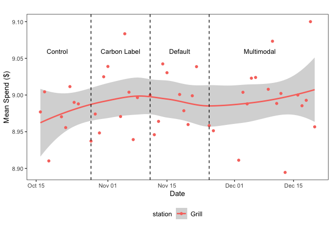<!-- -->

``` r
fall_prop_low <- ggarrange(fall_prop_low_ramen,fall_prop_low_grill,fall_prop_low_treatment,fall_prop_low_control,
          labels=c("A","B","C","D"),
          legend="none")
```

    ## `geom_smooth()` using method = 'loess' and formula = 'y ~ x'
    ## `geom_smooth()` using method = 'loess' and formula = 'y ~ x'
    ## `geom_smooth()` using method = 'loess' and formula = 'y ~ x'
    ## `geom_smooth()` using method = 'loess' and formula = 'y ~ x'

``` r
fall_prop_low <- annotate_figure(fall_prop_low,top=text_grob("Daily Sales Percentages of Lowest-Carbon Offerings (%)", 
               color="black",face="bold",size = 12))
ggsave(filename="fall_prop_low.png",plot=fall_prop_low,path="/Users/kenjinchang/github/multimodal-framework-validation/figures",width=40,height=24,units="cm",dpi=150,limitsize=TRUE)
fall_prop_low
```

<!-- -->

### Proportion of highest-emitting selections

``` r
fall_data %>%
  filter(station_type=="Treatment") %>%
  filter(item_cat=="Main") %>%
  group_by(menu_condition,station,item) %>%
  summarise(total_count=sum(count)) %>%
  mutate(prop_high=case_when(item=="Grilled Hamburger" & menu_condition=="Carbon Label" ~ total_count/(32+159+935+74+85),
                            item=="Bowl Ramen Chicken" & menu_condition=="Carbon Label" ~ total_count/(685+135),
                            item=="Grilled Hamburger" & menu_condition=="Control" ~ total_count/(19+125+776+68+60),
                            item=="Bowl Ramen Chicken" & menu_condition=="Control" ~ total_count/(563+108),
                            item=="Grilled Hamburger" & menu_condition=="Default" ~ total_count/(33+167+904+76+90),
                            item=="Bowl Ramen Chicken" & menu_condition=="Default" ~ total_count/(698+172),
                            item=="Grilled Hamburger" & menu_condition=="Multimodal" ~ total_count/(41+165+1157+125+107),
                            item=="Bowl Ramen Chicken" & menu_condition=="Multimodal" ~ total_count/(860+182))) %>%
  drop_na(prop_high)
```

    ## `summarise()` has grouped output by 'menu_condition', 'station'. You can
    ## override using the `.groups` argument.

    ## # A tibble: 8 × 5
    ## # Groups:   menu_condition, station [8]
    ##   menu_condition station item               total_count prop_high
    ##   <chr>          <chr>   <chr>                    <int>     <dbl>
    ## 1 Carbon Label   Grill   Grilled Hamburger          935     0.728
    ## 2 Carbon Label   Ramen   Bowl Ramen Chicken         685     0.835
    ## 3 Control        Grill   Grilled Hamburger          776     0.740
    ## 4 Control        Ramen   Bowl Ramen Chicken         563     0.839
    ## 5 Default        Grill   Grilled Hamburger          904     0.712
    ## 6 Default        Ramen   Bowl Ramen Chicken         698     0.802
    ## 7 Multimodal     Grill   Grilled Hamburger         1157     0.725
    ## 8 Multimodal     Ramen   Bowl Ramen Chicken         860     0.825

``` r
fall_data %>%
  filter(station_type=="Treatment") %>%
  filter(item_cat=="Main") %>%
  group_by(menu_condition,station,item) %>%
  summarise(total_count=sum(count)) %>%
  mutate(prop_high=case_when(item=="Grilled Hamburger" & menu_condition=="Carbon Label" ~ total_count/(32+159+935+74+85),
                            item=="Bowl Ramen Chicken" & menu_condition=="Carbon Label" ~ total_count/(685+135),
                            item=="Grilled Hamburger" & menu_condition=="Control" ~ total_count/(19+125+776+68+60),
                            item=="Bowl Ramen Chicken" & menu_condition=="Control" ~ total_count/(563+108),
                            item=="Grilled Hamburger" & menu_condition=="Default" ~ total_count/(33+167+904+76+90),
                            item=="Bowl Ramen Chicken" & menu_condition=="Default" ~ total_count/(698+172),
                            item=="Grilled Hamburger" & menu_condition=="Multimodal" ~ total_count/(41+165+1157+125+107),
                            item=="Bowl Ramen Chicken" & menu_condition=="Multimodal" ~ total_count/(860+182))) %>%
  drop_na(prop_high) %>%
  ggplot(aes(x=menu_condition,y=prop_high,fill=station)) +
  geom_col(position="dodge") + 
  scale_x_discrete(limits=c("Control","Carbon Label","Default","Multimodal"))
```

    ## `summarise()` has grouped output by 'menu_condition', 'station'. You can
    ## override using the `.groups` argument.

<!-- -->

Now on a daily level to see if there are diminishing effects over time
across each menu condition

``` r
fall_data %>%
  filter(station_type=="Treatment") %>%
  filter(item_cat=="Main") %>%
  group_by(date,station) %>%
  summarise(daily_station_count=sum(count)) 
```

    ## `summarise()` has grouped output by 'date'. You can override using the
    ## `.groups` argument.

    ## # A tibble: 90 × 3
    ## # Groups:   date [45]
    ##    date   station daily_station_count
    ##    <chr>  <chr>                 <int>
    ##  1 1-Nov  Grill                    94
    ##  2 1-Nov  Ramen                    47
    ##  3 10-Dec Grill                    72
    ##  4 10-Dec Ramen                    41
    ##  5 11-Dec Grill                    68
    ##  6 11-Dec Ramen                    49
    ##  7 11-Nov Grill                   112
    ##  8 11-Nov Ramen                    81
    ##  9 12-Dec Grill                    99
    ## 10 12-Dec Ramen                    55
    ## # ℹ 80 more rows

``` r
fall_data %>%
  filter(station_type=="Treatment") %>%
  filter(item_cat=="Main") %>%
  group_by(date,menu_condition,station,item) %>%
  summarise(total_count=sum(count)) %>%
  mutate(prop_high=case_when(item=="Grilled Hamburger"&menu_condition=="Carbon Label"&date=="1-Nov"~total_count/(94),
                             item=="Bowl Ramen Chicken"&menu_condition=="Carbon Label"&date=="1-Nov"~total_count/(47),
                             item=="Grilled Hamburger"&menu_condition=="Multimodal"&date=="10-Dec"~total_count/(72),
                             item=="Bowl Ramen Chicken"&menu_condition=="Multimodal"&date=="10-Dec"~total_count/(41),
                             item=="Grilled Hamburger"&menu_condition=="Multimodal"&date=="11-Dec"~total_count/(68),
                             item=="Bowl Ramen Chicken"&menu_condition=="Multimodal"&date=="11-Dec"~total_count/(49),
                             item=="Grilled Hamburger"&menu_condition=="Default"&date=="11-Nov"~total_count/(112),
                             item=="Bowl Ramen Chicken"&menu_condition=="Default"&date=="11-Nov"~total_count/(81),
                             item=="Grilled Hamburger"&menu_condition=="Multimodal"&date=="12-Dec"~total_count/(99),
                             item=="Bowl Ramen Chicken"&menu_condition=="Multimodal"&date=="12-Dec"~total_count/(55),
                             item=="Grilled Hamburger"&menu_condition=="Default"&date=="12-Nov"~total_count/(134),
                             item=="Bowl Ramen Chicken"&menu_condition=="Default"&date=="12-Nov"~total_count/(95),
                             item=="Grilled Hamburger"&menu_condition=="Multimodal"&date=="13-Dec"~total_count/(66),
                             item=="Bowl Ramen Chicken"&menu_condition=="Multimodal"&date=="13-Dec"~total_count/(57),
                             item=="Grilled Hamburger"&menu_condition=="Default"&date=="13-Nov"~total_count/(139),
                             item=="Bowl Ramen Chicken"&menu_condition=="Default"&date=="13-Nov"~total_count/(91),
                             item=="Grilled Hamburger"&menu_condition=="Default"&date=="14-Nov"~total_count/(145),
                             item=="Bowl Ramen Chicken"&menu_condition=="Default"&date=="14-Nov"~total_count/(99),
                             item=="Grilled Hamburger"&menu_condition=="Default"&date=="15-Nov"~total_count/(94),
                             item=="Bowl Ramen Chicken"&menu_condition=="Default"&date=="15-Nov"~total_count/(76),
                             item=="Grilled Hamburger"&menu_condition=="Multimodal"&date=="16-Dec"~total_count/(70),
                             item=="Bowl Ramen Chicken"&menu_condition=="Multimodal"&date=="16-Dec"~total_count/(47),
                             item=="Grilled Hamburger"&menu_condition=="Control"&date=="16-Oct"~total_count/(123),
                             item=="Bowl Ramen Chicken"&menu_condition=="Control"&date=="16-Oct"~total_count/(104),
                             item=="Grilled Hamburger"&menu_condition=="Multimodal"&date=="17-Dec"~total_count/(87),
                             item=="Bowl Ramen Chicken"&menu_condition=="Multimodal"&date=="17-Dec"~total_count/(41),
                             item=="Grilled Hamburger"&menu_condition=="Control"&date=="17-Oct"~total_count/(153),
                             item=="Bowl Ramen Chicken"&menu_condition=="Control"&date=="17-Oct"~total_count/(82),
                             item=="Grilled Hamburger"&menu_condition=="Multimodal"&date=="18-Dec"~total_count/(71),
                             item=="Bowl Ramen Chicken"&menu_condition=="Multimodal"&date=="18-Dec"~total_count/(46),
                             item=="Grilled Hamburger"&menu_condition=="Default"&date=="18-Nov"~total_count/(130),
                             item=="Bowl Ramen Chicken"&menu_condition=="Default"&date=="18-Nov"~total_count/(77),
                             item=="Grilled Hamburger"&menu_condition=="Control"&date=="18-Oct"~total_count/(89),
                             item=="Bowl Ramen Chicken"&menu_condition=="Control"&date=="18-Oct"~total_count/(65),
                             item=="Grilled Hamburger"&menu_condition=="Multimodal"&date=="19-Dec"~total_count/(50),
                             item=="Bowl Ramen Chicken"&menu_condition=="Multimodal"&date=="19-Dec"~total_count/(14),
                             item=="Grilled Hamburger"&menu_condition=="Default"&date=="19-Nov"~total_count/(167),
                             item=="Bowl Ramen Chicken"&menu_condition=="Default"&date=="19-Nov"~total_count/(98),
                             item=="Grilled Hamburger"&menu_condition=="Multimodal"&date=="2-Dec"~total_count/(118),
                             item=="Bowl Ramen Chicken"&menu_condition=="Multimodal"&date=="2-Dec"~total_count/(113),
                             item=="Grilled Hamburger"&menu_condition=="Multimodal"&date=="20-Dec"~total_count/(39),
                             item=="Bowl Ramen Chicken"&menu_condition=="Multimodal"&date=="20-Dec"~total_count/(23),
                             item=="Grilled Hamburger"&menu_condition=="Default"&date=="20-Nov"~total_count/(129),
                             item=="Bowl Ramen Chicken"&menu_condition=="Default"&date=="20-Nov"~total_count/(99),
                             item=="Grilled Hamburger"&menu_condition=="Default"&date=="21-Nov"~total_count/(144),
                             item=="Bowl Ramen Chicken"&menu_condition=="Default"&date=="21-Nov"~total_count/(97),
                             item=="Grilled Hamburger"&menu_condition=="Control"&date=="21-Oct"~total_count/(143),
                             item=="Bowl Ramen Chicken"&menu_condition=="Control"&date=="21-Oct"~total_count/(85),
                             item=="Grilled Hamburger"&menu_condition=="Default"&date=="22-Nov"~total_count/(76),
                             item=="Bowl Ramen Chicken"&menu_condition=="Default"&date=="22-Nov"~total_count/(57),
                             item=="Grilled Hamburger"&menu_condition=="Control"&date=="22-Oct"~total_count/(163),
                             item=="Bowl Ramen Chicken"&menu_condition=="Control"&date=="22-Oct"~total_count/(83),
                             item=="Grilled Hamburger"&menu_condition=="Control"&date=="23-Oct"~total_count/(135),
                             item=="Bowl Ramen Chicken"&menu_condition=="Control"&date=="23-Oct"~total_count/(92),
                             item=="Grilled Hamburger"&menu_condition=="Control"&date=="24-Oct"~total_count/(145),
                             item=="Bowl Ramen Chicken"&menu_condition=="Control"&date=="24-Oct"~total_count/(107),
                             item=="Grilled Hamburger"&menu_condition=="Multimodal"&date=="25-Nov"~total_count/(98),
                             item=="Bowl Ramen Chicken"&menu_condition=="Multimodal"&date=="25-Nov"~total_count/(66),
                             item=="Grilled Hamburger"&menu_condition=="Control"&date=="25-Oct"~total_count/(97),
                             item=="Bowl Ramen Chicken"&menu_condition=="Control"&date=="25-Oct"~total_count/(53),
                             item=="Grilled Hamburger"&menu_condition=="Multimodal"&date=="26-Nov"~total_count/(75),
                             item=="Bowl Ramen Chicken"&menu_condition=="Multimodal"&date=="26-Nov"~total_count/(51),
                             item=="Grilled Hamburger"&menu_condition=="Carbon Label"&date=="28-Oct"~total_count/(127),
                             item=="Bowl Ramen Chicken"&menu_condition=="Carbon Label"&date=="28-Oct"~total_count/(76),
                             item=="Grilled Hamburger"&menu_condition=="Carbon Label"&date=="29-Oct"~total_count/(145),
                             item=="Bowl Ramen Chicken"&menu_condition=="Carbon Label"&date=="29-Oct"~total_count/(80),
                             item=="Grilled Hamburger"&menu_condition=="Multimodal"&date=="3-Dec"~total_count/(131),
                             item=="Bowl Ramen Chicken"&menu_condition=="Multimodal"&date=="3-Dec"~total_count/(97),
                             item=="Grilled Hamburger"&menu_condition=="Carbon Label"&date=="30-Oct"~total_count/(132),
                             item=="Bowl Ramen Chicken"&menu_condition=="Carbon Label"&date=="30-Oct"~total_count/(82),
                             item=="Grilled Hamburger"&menu_condition=="Carbon Label"&date=="31-Oct"~total_count/(149),
                             item=="Bowl Ramen Chicken"&menu_condition=="Carbon Label"&date=="31-Oct"~total_count/(89),
                             item=="Grilled Hamburger"&menu_condition=="Multimodal"&date=="4-Dec"~total_count/(146),
                             item=="Bowl Ramen Chicken"&menu_condition=="Multimodal"&date=="4-Dec"~total_count/(97),
                             item=="Grilled Hamburger"&menu_condition=="Carbon Label"&date=="4-Nov"~total_count/(114),
                             item=="Bowl Ramen Chicken"&menu_condition=="Carbon Label"&date=="4-Nov"~total_count/(85),
                             item=="Grilled Hamburger"&menu_condition=="Multimodal"&date=="5-Dec"~total_count/(173),
                             item=="Bowl Ramen Chicken"&menu_condition=="Multimodal"&date=="5-Dec"~total_count/(92),
                             item=="Grilled Hamburger"&menu_condition=="Carbon Label"&date=="5-Nov"~total_count/(138),
                             item=="Bowl Ramen Chicken"&menu_condition=="Carbon Label"&date=="5-Nov"~total_count/(84),
                             item=="Grilled Hamburger"&menu_condition=="Multimodal"&date=="6-Dec"~total_count/(103),
                             item=="Bowl Ramen Chicken"&menu_condition=="Multimodal"&date=="6-Dec"~total_count/(76),
                             item=="Grilled Hamburger"&menu_condition=="Carbon Label"&date=="6-Nov"~total_count/(137),
                             item=="Bowl Ramen Chicken"&menu_condition=="Carbon Label"&date=="6-Nov"~total_count/(107),
                             item=="Grilled Hamburger"&menu_condition=="Carbon Label"&date=="7-Nov"~total_count/(142),
                             item=="Bowl Ramen Chicken"&menu_condition=="Carbon Label"&date=="7-Nov"~total_count/(97),
                             item=="Grilled Hamburger"&menu_condition=="Carbon Label"&date=="8-Nov"~total_count/(107),
                             item=="Bowl Ramen Chicken"&menu_condition=="Carbon Label"&date=="8-Nov"~total_count/(73),
                             item=="Grilled Hamburger"&menu_condition=="Multimodal"&date=="9-Dec"~total_count/(128),
                             item=="Bowl Ramen Chicken"&menu_condition=="Multimodal"&date=="9-Dec"~total_count/(77))) %>%
  drop_na(prop_high) 
```

    ## `summarise()` has grouped output by 'date', 'menu_condition', 'station'. You
    ## can override using the `.groups` argument.

    ## # A tibble: 90 × 6
    ## # Groups:   date, menu_condition, station [90]
    ##    date   menu_condition station item               total_count prop_high
    ##    <chr>  <chr>          <chr>   <chr>                    <int>     <dbl>
    ##  1 1-Nov  Carbon Label   Grill   Grilled Hamburger           66     0.702
    ##  2 1-Nov  Carbon Label   Ramen   Bowl Ramen Chicken          34     0.723
    ##  3 10-Dec Multimodal     Grill   Grilled Hamburger           52     0.722
    ##  4 10-Dec Multimodal     Ramen   Bowl Ramen Chicken          37     0.902
    ##  5 11-Dec Multimodal     Grill   Grilled Hamburger           47     0.691
    ##  6 11-Dec Multimodal     Ramen   Bowl Ramen Chicken          42     0.857
    ##  7 11-Nov Default        Grill   Grilled Hamburger           81     0.723
    ##  8 11-Nov Default        Ramen   Bowl Ramen Chicken          69     0.852
    ##  9 12-Dec Multimodal     Grill   Grilled Hamburger           69     0.697
    ## 10 12-Dec Multimodal     Ramen   Bowl Ramen Chicken          46     0.836
    ## # ℹ 80 more rows

``` r
daily_prop_high_fall_data <- fall_data %>%
  filter(station_type=="Treatment") %>%
  filter(item_cat=="Main") %>%
  group_by(date,menu_condition,station,item) %>%
  summarise(total_count=sum(count)) %>%
  mutate(prop_high=case_when(item=="Grilled Hamburger"&menu_condition=="Carbon Label"&date=="1-Nov"~total_count/(94),
                             item=="Bowl Ramen Chicken"&menu_condition=="Carbon Label"&date=="1-Nov"~total_count/(47),
                             item=="Grilled Hamburger"&menu_condition=="Multimodal"&date=="10-Dec"~total_count/(72),
                             item=="Bowl Ramen Chicken"&menu_condition=="Multimodal"&date=="10-Dec"~total_count/(41),
                             item=="Grilled Hamburger"&menu_condition=="Multimodal"&date=="11-Dec"~total_count/(68),
                             item=="Bowl Ramen Chicken"&menu_condition=="Multimodal"&date=="11-Dec"~total_count/(49),
                             item=="Grilled Hamburger"&menu_condition=="Default"&date=="11-Nov"~total_count/(112),
                             item=="Bowl Ramen Chicken"&menu_condition=="Default"&date=="11-Nov"~total_count/(81),
                             item=="Grilled Hamburger"&menu_condition=="Multimodal"&date=="12-Dec"~total_count/(99),
                             item=="Bowl Ramen Chicken"&menu_condition=="Multimodal"&date=="12-Dec"~total_count/(55),
                             item=="Grilled Hamburger"&menu_condition=="Default"&date=="12-Nov"~total_count/(134),
                             item=="Bowl Ramen Chicken"&menu_condition=="Default"&date=="12-Nov"~total_count/(95),
                             item=="Grilled Hamburger"&menu_condition=="Multimodal"&date=="13-Dec"~total_count/(66),
                             item=="Bowl Ramen Chicken"&menu_condition=="Multimodal"&date=="13-Dec"~total_count/(57),
                             item=="Grilled Hamburger"&menu_condition=="Default"&date=="13-Nov"~total_count/(139),
                             item=="Bowl Ramen Chicken"&menu_condition=="Default"&date=="13-Nov"~total_count/(91),
                             item=="Grilled Hamburger"&menu_condition=="Default"&date=="14-Nov"~total_count/(145),
                             item=="Bowl Ramen Chicken"&menu_condition=="Default"&date=="14-Nov"~total_count/(99),
                             item=="Grilled Hamburger"&menu_condition=="Default"&date=="15-Nov"~total_count/(94),
                             item=="Bowl Ramen Chicken"&menu_condition=="Default"&date=="15-Nov"~total_count/(76),
                             item=="Grilled Hamburger"&menu_condition=="Multimodal"&date=="16-Dec"~total_count/(70),
                             item=="Bowl Ramen Chicken"&menu_condition=="Multimodal"&date=="16-Dec"~total_count/(47),
                             item=="Grilled Hamburger"&menu_condition=="Control"&date=="16-Oct"~total_count/(123),
                             item=="Bowl Ramen Chicken"&menu_condition=="Control"&date=="16-Oct"~total_count/(104),
                             item=="Grilled Hamburger"&menu_condition=="Multimodal"&date=="17-Dec"~total_count/(87),
                             item=="Bowl Ramen Chicken"&menu_condition=="Multimodal"&date=="17-Dec"~total_count/(41),
                             item=="Grilled Hamburger"&menu_condition=="Control"&date=="17-Oct"~total_count/(153),
                             item=="Bowl Ramen Chicken"&menu_condition=="Control"&date=="17-Oct"~total_count/(82),
                             item=="Grilled Hamburger"&menu_condition=="Multimodal"&date=="18-Dec"~total_count/(71),
                             item=="Bowl Ramen Chicken"&menu_condition=="Multimodal"&date=="18-Dec"~total_count/(46),
                             item=="Grilled Hamburger"&menu_condition=="Default"&date=="18-Nov"~total_count/(130),
                             item=="Bowl Ramen Chicken"&menu_condition=="Default"&date=="18-Nov"~total_count/(77),
                             item=="Grilled Hamburger"&menu_condition=="Control"&date=="18-Oct"~total_count/(89),
                             item=="Bowl Ramen Chicken"&menu_condition=="Control"&date=="18-Oct"~total_count/(65),
                             item=="Grilled Hamburger"&menu_condition=="Multimodal"&date=="19-Dec"~total_count/(50),
                             item=="Bowl Ramen Chicken"&menu_condition=="Multimodal"&date=="19-Dec"~total_count/(14),
                             item=="Grilled Hamburger"&menu_condition=="Default"&date=="19-Nov"~total_count/(167),
                             item=="Bowl Ramen Chicken"&menu_condition=="Default"&date=="19-Nov"~total_count/(98),
                             item=="Grilled Hamburger"&menu_condition=="Multimodal"&date=="2-Dec"~total_count/(118),
                             item=="Bowl Ramen Chicken"&menu_condition=="Multimodal"&date=="2-Dec"~total_count/(113),
                             item=="Grilled Hamburger"&menu_condition=="Multimodal"&date=="20-Dec"~total_count/(39),
                             item=="Bowl Ramen Chicken"&menu_condition=="Multimodal"&date=="20-Dec"~total_count/(23),
                             item=="Grilled Hamburger"&menu_condition=="Default"&date=="20-Nov"~total_count/(129),
                             item=="Bowl Ramen Chicken"&menu_condition=="Default"&date=="20-Nov"~total_count/(99),
                             item=="Grilled Hamburger"&menu_condition=="Default"&date=="21-Nov"~total_count/(144),
                             item=="Bowl Ramen Chicken"&menu_condition=="Default"&date=="21-Nov"~total_count/(97),
                             item=="Grilled Hamburger"&menu_condition=="Control"&date=="21-Oct"~total_count/(143),
                             item=="Bowl Ramen Chicken"&menu_condition=="Control"&date=="21-Oct"~total_count/(85),
                             item=="Grilled Hamburger"&menu_condition=="Default"&date=="22-Nov"~total_count/(76),
                             item=="Bowl Ramen Chicken"&menu_condition=="Default"&date=="22-Nov"~total_count/(57),
                             item=="Grilled Hamburger"&menu_condition=="Control"&date=="22-Oct"~total_count/(163),
                             item=="Bowl Ramen Chicken"&menu_condition=="Control"&date=="22-Oct"~total_count/(83),
                             item=="Grilled Hamburger"&menu_condition=="Control"&date=="23-Oct"~total_count/(135),
                             item=="Bowl Ramen Chicken"&menu_condition=="Control"&date=="23-Oct"~total_count/(92),
                             item=="Grilled Hamburger"&menu_condition=="Control"&date=="24-Oct"~total_count/(145),
                             item=="Bowl Ramen Chicken"&menu_condition=="Control"&date=="24-Oct"~total_count/(107),
                             item=="Grilled Hamburger"&menu_condition=="Multimodal"&date=="25-Nov"~total_count/(98),
                             item=="Bowl Ramen Chicken"&menu_condition=="Multimodal"&date=="25-Nov"~total_count/(66),
                             item=="Grilled Hamburger"&menu_condition=="Control"&date=="25-Oct"~total_count/(97),
                             item=="Bowl Ramen Chicken"&menu_condition=="Control"&date=="25-Oct"~total_count/(53),
                             item=="Grilled Hamburger"&menu_condition=="Multimodal"&date=="26-Nov"~total_count/(75),
                             item=="Bowl Ramen Chicken"&menu_condition=="Multimodal"&date=="26-Nov"~total_count/(51),
                             item=="Grilled Hamburger"&menu_condition=="Carbon Label"&date=="28-Oct"~total_count/(127),
                             item=="Bowl Ramen Chicken"&menu_condition=="Carbon Label"&date=="28-Oct"~total_count/(76),
                             item=="Grilled Hamburger"&menu_condition=="Carbon Label"&date=="29-Oct"~total_count/(145),
                             item=="Bowl Ramen Chicken"&menu_condition=="Carbon Label"&date=="29-Oct"~total_count/(80),
                             item=="Grilled Hamburger"&menu_condition=="Multimodal"&date=="3-Dec"~total_count/(131),
                             item=="Bowl Ramen Chicken"&menu_condition=="Multimodal"&date=="3-Dec"~total_count/(97),
                             item=="Grilled Hamburger"&menu_condition=="Carbon Label"&date=="30-Oct"~total_count/(132),
                             item=="Bowl Ramen Chicken"&menu_condition=="Carbon Label"&date=="30-Oct"~total_count/(82),
                             item=="Grilled Hamburger"&menu_condition=="Carbon Label"&date=="31-Oct"~total_count/(149),
                             item=="Bowl Ramen Chicken"&menu_condition=="Carbon Label"&date=="31-Oct"~total_count/(89),
                             item=="Grilled Hamburger"&menu_condition=="Multimodal"&date=="4-Dec"~total_count/(146),
                             item=="Bowl Ramen Chicken"&menu_condition=="Multimodal"&date=="4-Dec"~total_count/(97),
                             item=="Grilled Hamburger"&menu_condition=="Carbon Label"&date=="4-Nov"~total_count/(114),
                             item=="Bowl Ramen Chicken"&menu_condition=="Carbon Label"&date=="4-Nov"~total_count/(85),
                             item=="Grilled Hamburger"&menu_condition=="Multimodal"&date=="5-Dec"~total_count/(173),
                             item=="Bowl Ramen Chicken"&menu_condition=="Multimodal"&date=="5-Dec"~total_count/(92),
                             item=="Grilled Hamburger"&menu_condition=="Carbon Label"&date=="5-Nov"~total_count/(138),
                             item=="Bowl Ramen Chicken"&menu_condition=="Carbon Label"&date=="5-Nov"~total_count/(84),
                             item=="Grilled Hamburger"&menu_condition=="Multimodal"&date=="6-Dec"~total_count/(103),
                             item=="Bowl Ramen Chicken"&menu_condition=="Multimodal"&date=="6-Dec"~total_count/(76),
                             item=="Grilled Hamburger"&menu_condition=="Carbon Label"&date=="6-Nov"~total_count/(137),
                             item=="Bowl Ramen Chicken"&menu_condition=="Carbon Label"&date=="6-Nov"~total_count/(107),
                             item=="Grilled Hamburger"&menu_condition=="Carbon Label"&date=="7-Nov"~total_count/(142),
                             item=="Bowl Ramen Chicken"&menu_condition=="Carbon Label"&date=="7-Nov"~total_count/(97),
                             item=="Grilled Hamburger"&menu_condition=="Carbon Label"&date=="8-Nov"~total_count/(107),
                             item=="Bowl Ramen Chicken"&menu_condition=="Carbon Label"&date=="8-Nov"~total_count/(73),
                             item=="Grilled Hamburger"&menu_condition=="Multimodal"&date=="9-Dec"~total_count/(128),
                             item=="Bowl Ramen Chicken"&menu_condition=="Multimodal"&date=="9-Dec"~total_count/(77))) %>%
  drop_na(prop_high) %>%
  mutate(date=case_when(date=="16-Oct"~"2024-10-16",
                        date=="17-Oct"~"2024-10-17",
                        date=="18-Oct"~"2024-10-18",
                        date=="21-Oct"~"2024-10-21",
                        date=="22-Oct"~"2024-10-22",
                        date=="23-Oct"~"2024-10-23",
                        date=="24-Oct"~"2024-10-24",
                        date=="25-Oct"~"2024-10-25",
                        date=="28-Oct"~"2024-10-28",
                        date=="29-Oct"~"2024-10-29",
                        date=="30-Oct"~"2024-10-30",
                        date=="31-Oct"~"2024-10-31",
                        date=="1-Nov"~"2024-11-1",
                        date=="4-Nov"~"2024-11-4",
                        date=="5-Nov"~"2024-11-5",
                        date=="6-Nov"~"2024-11-6",
                        date=="7-Nov"~"2024-11-7",
                        date=="8-Nov"~"2024-11-8",
                        date=="11-Nov"~"2024-11-11",
                        date=="12-Nov"~"2024-11-12",
                        date=="13-Nov"~"2024-11-13",
                        date=="14-Nov"~"2024-11-14",
                        date=="15-Nov"~"2024-11-15",
                        date=="18-Nov"~"2024-11-18",
                        date=="19-Nov"~"2024-11-19",
                        date=="20-Nov"~"2024-11-20",
                        date=="21-Nov"~"2024-11-21",
                        date=="22-Nov"~"2024-11-22",
                        date=="25-Nov"~"2024-11-25",
                        date=="26-Nov"~"2024-11-26",
                        date=="2-Dec"~"2024-12-2",
                        date=="3-Dec"~"2024-12-3",
                        date=="4-Dec"~"2024-12-4",
                        date=="5-Dec"~"2024-12-5",
                        date=="6-Dec"~"2024-12-6",
                        date=="9-Dec"~"2024-12-9",
                        date=="10-Dec"~"2024-12-10",
                        date=="11-Dec"~"2024-12-11",
                        date=="12-Dec"~"2024-12-12",
                        date=="13-Dec"~"2024-12-13",
                        date=="16-Dec"~"2024-12-16",
                        date=="17-Dec"~"2024-12-17",
                        date=="18-Dec"~"2024-12-18",
                        date=="19-Dec"~"2024-12-19",
                        date=="20-Dec"~"2024-12-20")) %>%
  mutate(date=as.Date(date)) 
```

    ## `summarise()` has grouped output by 'date', 'menu_condition', 'station'. You
    ## can override using the `.groups` argument.

``` r
ggplot(daily_prop_high_fall_data,aes(x=date,y=prop_high,color=station)) + 
  geom_smooth() + 
  geom_point() +
  geom_vline(xintercept=as.numeric(daily_prop_low_fall_data$date[fall_vline]),linetype=2) 
```

    ## `geom_smooth()` using method = 'loess' and formula = 'y ~ x'

<!-- -->

``` r
fall_data %>%
  filter(station=="Grill") %>%
  filter(item_cat=="Main") %>%
  group_by(menu_condition,station,item) %>%
  summarise(total_count=sum(count)) %>%
  mutate(prop=case_when(menu_condition=="Carbon Label"~total_count/(32+159+935+74+85),
                        menu_condition=="Control"~total_count/(19+125+776+68+60),
                        menu_condition=="Default"~total_count/(33+167+904+76+90),
                        menu_condition=="Multimodal"~total_count/(41+165+1157+125+107))) %>%
  filter(item=="Grilled Hamburger")
```

    ## `summarise()` has grouped output by 'menu_condition', 'station'. You can
    ## override using the `.groups` argument.

    ## # A tibble: 4 × 5
    ## # Groups:   menu_condition, station [4]
    ##   menu_condition station item              total_count  prop
    ##   <chr>          <chr>   <chr>                   <int> <dbl>
    ## 1 Carbon Label   Grill   Grilled Hamburger         935 0.728
    ## 2 Control        Grill   Grilled Hamburger         776 0.740
    ## 3 Default        Grill   Grilled Hamburger         904 0.712
    ## 4 Multimodal     Grill   Grilled Hamburger        1157 0.725

``` r
 fall_prop_high_grill_aov_data <- daily_prop_high_fall_data %>%
  filter(item=="Grilled Hamburger") %>%
  ungroup() %>%
  select(menu_condition,prop_high) %>%
  arrange(menu_condition) 
shapiro.test(fall_prop_high_grill_aov_data$prop_high) 
```

    ## 
    ##  Shapiro-Wilk normality test
    ## 
    ## data:  fall_prop_high_grill_aov_data$prop_high
    ## W = 0.99284, p-value = 0.9935

``` r
oneway.test(prop_high~menu_condition,data=fall_prop_high_grill_aov_data,var.equal=TRUE)
```

    ## 
    ##  One-way analysis of means
    ## 
    ## data:  prop_high and menu_condition
    ## F = 0.79663, num df = 3, denom df = 41, p-value = 0.5029

``` r
fall_prop_high_grill <- daily_prop_high_fall_data %>%
  filter(item=="Grilled Hamburger") %>%
  mutate(item=case_when(item=="Grilled Hamburger"~"Highest-Carbon Offering")) %>%
  ggplot(aes(x=date,y=prop_high,color=item,fill=item)) + 
  geom_smooth(alpha=0.2) + 
  geom_point() +
  geom_vline(xintercept=as.numeric(daily_prop_low_fall_data$date[fall_vline]),linetype=2) +
  xlab("Date") + 
  ylab("Proportion of Station Sales") + 
  scale_color_brewer(palette="Dark2",name="") +
  scale_fill_brewer(palette="Dark2",name="") +
  scale_x_date(breaks=as.Date(c("2024-10-16","2024-10-28","2024-11-11","2024-11-25","2024-12-20")),labels=c("Oct 16","Oct 28","Nov 11","Nov 25","Dec 20")) +
  annotate("text",x=as.Date("2024-10-22"),y=0.7304580,label="Control",size=10/.pt) +
  annotate("text",x=as.Date("2024-11-4"),y=0.7176265,label="Carbon Label",size=10/.pt) +
  annotate("text",x=as.Date("2024-11-18"),y=0.7018110,label="Default",size=10/.pt) +
  annotate("text",x=as.Date("2024-12-7"),y=0.7153918,label="Multimodal",size=10/.pt) +
  annotate("point",x=as.Date("2024-10-22"),y=0.7404580) +
  annotate("point",x=as.Date("2024-11-4"),y=0.7276265) +
  annotate("point",x=as.Date("2024-11-18"),y=0.7118110) +
  annotate("point",x=as.Date("2024-12-7"),y=0.7253918) +
  labs(title="Grill Station (Treated)",caption="F(3,41)=0.79663, p=0.5029") +
  theme(aspect.ratio=0.55,legend.position="bottom",panel.grid=element_blank(),panel.background=element_rect(fill="white"),panel.border=element_rect(fill=NA),legend.title=element_text(size=10),legend.text=element_text(size=10),plot.title=element_text(size=10),axis.title=element_text(size=10),axis.text=element_text(size=10)) 
fall_prop_high_grill
```

    ## `geom_smooth()` using method = 'loess' and formula = 'y ~ x'

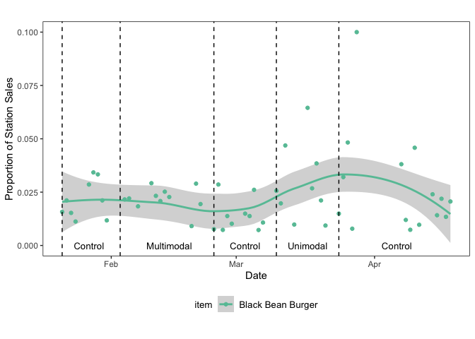<!-- -->

``` r
fall_data %>%
  filter(station=="Ramen") %>%
  filter(item_cat=="Main") %>%
  group_by(menu_condition,station,item) %>%
  summarise(total_count=sum(count)) %>%
  mutate(prop=case_when(menu_condition=="Carbon Label"~total_count/(685+135),
                        menu_condition=="Control"~total_count/(563+108),
                        menu_condition=="Default"~total_count/(698+172),
                        menu_condition=="Multimodal"~total_count/(860+182))) %>%
  filter(item=="Bowl Ramen Chicken")
```

    ## `summarise()` has grouped output by 'menu_condition', 'station'. You can
    ## override using the `.groups` argument.

    ## # A tibble: 4 × 5
    ## # Groups:   menu_condition, station [4]
    ##   menu_condition station item               total_count  prop
    ##   <chr>          <chr>   <chr>                    <int> <dbl>
    ## 1 Carbon Label   Ramen   Bowl Ramen Chicken         685 0.835
    ## 2 Control        Ramen   Bowl Ramen Chicken         563 0.839
    ## 3 Default        Ramen   Bowl Ramen Chicken         698 0.802
    ## 4 Multimodal     Ramen   Bowl Ramen Chicken         860 0.825

``` r
fall_prop_high_ramen_aov_data <- fall_data %>%
  filter(station=="Ramen") %>%
  filter(item_cat=="Main") %>%
  group_by(date,menu_condition,station,item) %>%
  summarise(total_count=sum(count)) %>%
  mutate(prop=case_when(date=="1-Nov"~total_count/(34+13),
                            date=="10-Dec"~total_count/(37+4),
                             date=="11-Dec"~total_count/(42+7),
                             date=="11-Nov"~total_count/(69+12),
                             date=="12-Dec"~total_count/(46+9),
                             date=="12-Nov"~total_count/(76+19),
                             date=="13-Dec"~total_count/(50+7),
                             date=="13-Nov"~total_count/(74+17),
                             date=="14-Nov"~total_count/(78+21),
                             date=="15-Nov"~total_count/(59+17),
                             date=="16-Dec"~total_count/(40+7),
                             date=="16-Oct"~total_count/(88+16),
                             date=="17-Dec"~total_count/(35+6),
                             date=="17-Oct"~total_count/(68+14),
                             date=="18-Dec"~total_count/(39+7),
                             date=="18-Nov"~total_count/(66+11),
                             date=="18-Oct"~total_count/(44+21),
                             date=="19-Dec"~total_count/(10+4),
                             date=="19-Nov"~total_count/(70+28),
                             date=="2-Dec"~total_count/(94+19),
                             date=="20-Dec"~total_count/(21+2),
                             date=="20-Nov"~total_count/(80+19),
                             date=="21-Nov"~total_count/(77+20),
                             date=="21-Oct"~total_count/(71+14),
                             date=="22-Nov"~total_count/(49+8),
                             date=="22-Oct"~total_count/(73+10),
                             date=="23-Oct"~total_count/(83+9),
                             date=="24-Oct"~total_count/(92+15),
                             date=="25-Nov"~total_count/(56+10),
                             date=="25-Oct"~total_count/(44+9),
                             date=="26-Nov"~total_count/(45+6),
                             date=="28-Oct"~total_count/(65+11),
                             date=="29-Oct"~total_count/(67+13),
                             date=="3-Dec"~total_count/(76+21),
                             date=="30-Oct"~total_count/(70+12),
                             date=="31-Oct"~total_count/(79+10),
                             date=="4-Dec"~total_count/(84+13),
                             date=="4-Nov"~total_count/(65+20),
                             date=="5-Dec"~total_count/(70+22),
                             date=="5-Nov"~total_count/(73+11),
                             date=="6-Dec"~total_count/(58+18),
                             date=="6-Nov"~total_count/(90+17),
                             date=="7-Nov"~total_count/(83+14),
                             date=="8-Nov"~total_count/(59+14),
                             date=="9-Dec"~total_count/(57+20))) %>%
  mutate(date=case_when(date=="16-Oct"~"2024-10-16",
                        date=="17-Oct"~"2024-10-17",
                        date=="18-Oct"~"2024-10-18",
                        date=="21-Oct"~"2024-10-21",
                        date=="22-Oct"~"2024-10-22",
                        date=="23-Oct"~"2024-10-23",
                        date=="24-Oct"~"2024-10-24",
                        date=="25-Oct"~"2024-10-25",
                        date=="28-Oct"~"2024-10-28",
                        date=="29-Oct"~"2024-10-29",
                        date=="30-Oct"~"2024-10-30",
                        date=="31-Oct"~"2024-10-31",
                        date=="1-Nov"~"2024-11-1",
                        date=="4-Nov"~"2024-11-4",
                        date=="5-Nov"~"2024-11-5",
                        date=="6-Nov"~"2024-11-6",
                        date=="7-Nov"~"2024-11-7",
                        date=="8-Nov"~"2024-11-8",
                        date=="11-Nov"~"2024-11-11",
                        date=="12-Nov"~"2024-11-12",
                        date=="13-Nov"~"2024-11-13",
                        date=="14-Nov"~"2024-11-14",
                        date=="15-Nov"~"2024-11-15",
                        date=="18-Nov"~"2024-11-18",
                        date=="19-Nov"~"2024-11-19",
                        date=="20-Nov"~"2024-11-20",
                        date=="21-Nov"~"2024-11-21",
                        date=="22-Nov"~"2024-11-22",
                        date=="25-Nov"~"2024-11-25",
                        date=="26-Nov"~"2024-11-26",
                        date=="2-Dec"~"2024-12-2",
                        date=="3-Dec"~"2024-12-3",
                        date=="4-Dec"~"2024-12-4",
                        date=="5-Dec"~"2024-12-5",
                        date=="6-Dec"~"2024-12-6",
                        date=="9-Dec"~"2024-12-9",
                        date=="10-Dec"~"2024-12-10",
                        date=="11-Dec"~"2024-12-11",
                        date=="12-Dec"~"2024-12-12",
                        date=="13-Dec"~"2024-12-13",
                        date=="16-Dec"~"2024-12-16",
                        date=="17-Dec"~"2024-12-17",
                        date=="18-Dec"~"2024-12-18",
                        date=="19-Dec"~"2024-12-19",
                        date=="20-Dec"~"2024-12-20")) %>%
  mutate(date=as.Date(date)) %>%
  filter(item=="Bowl Ramen Chicken") %>% # Highest-carbon offering
  mutate(item=case_when(item=="Bowl Ramen Chicken"~"Highest-Carbon Offering")) %>%
  ungroup() %>%
  select(menu_condition,prop) %>%
  arrange(menu_condition)
```

    ## `summarise()` has grouped output by 'date', 'menu_condition', 'station'. You
    ## can override using the `.groups` argument.

``` r
shapiro.test(fall_prop_high_ramen_aov_data$prop) 
```

    ## 
    ##  Shapiro-Wilk normality test
    ## 
    ## data:  fall_prop_high_ramen_aov_data$prop
    ## W = 0.93068, p-value = 0.009914

``` r
oneway.test(prop~menu_condition,data=fall_prop_high_ramen_aov_data,var.equal=TRUE)
```

    ## 
    ##  One-way analysis of means
    ## 
    ## data:  prop and menu_condition
    ## F = 0.52047, num df = 3, denom df = 41, p-value = 0.6706

``` r
fall_prop_high_ramen <- fall_data %>%
  filter(station=="Ramen") %>%
  filter(item_cat=="Main") %>%
  group_by(date,menu_condition,station,item) %>%
  summarise(total_count=sum(count)) %>%
  mutate(prop=case_when(date=="1-Nov"~total_count/(34+13),
                            date=="10-Dec"~total_count/(37+4),
                             date=="11-Dec"~total_count/(42+7),
                             date=="11-Nov"~total_count/(69+12),
                             date=="12-Dec"~total_count/(46+9),
                             date=="12-Nov"~total_count/(76+19),
                             date=="13-Dec"~total_count/(50+7),
                             date=="13-Nov"~total_count/(74+17),
                             date=="14-Nov"~total_count/(78+21),
                             date=="15-Nov"~total_count/(59+17),
                             date=="16-Dec"~total_count/(40+7),
                             date=="16-Oct"~total_count/(88+16),
                             date=="17-Dec"~total_count/(35+6),
                             date=="17-Oct"~total_count/(68+14),
                             date=="18-Dec"~total_count/(39+7),
                             date=="18-Nov"~total_count/(66+11),
                             date=="18-Oct"~total_count/(44+21),
                             date=="19-Dec"~total_count/(10+4),
                             date=="19-Nov"~total_count/(70+28),
                             date=="2-Dec"~total_count/(94+19),
                             date=="20-Dec"~total_count/(21+2),
                             date=="20-Nov"~total_count/(80+19),
                             date=="21-Nov"~total_count/(77+20),
                             date=="21-Oct"~total_count/(71+14),
                             date=="22-Nov"~total_count/(49+8),
                             date=="22-Oct"~total_count/(73+10),
                             date=="23-Oct"~total_count/(83+9),
                             date=="24-Oct"~total_count/(92+15),
                             date=="25-Nov"~total_count/(56+10),
                             date=="25-Oct"~total_count/(44+9),
                             date=="26-Nov"~total_count/(45+6),
                             date=="28-Oct"~total_count/(65+11),
                             date=="29-Oct"~total_count/(67+13),
                             date=="3-Dec"~total_count/(76+21),
                             date=="30-Oct"~total_count/(70+12),
                             date=="31-Oct"~total_count/(79+10),
                             date=="4-Dec"~total_count/(84+13),
                             date=="4-Nov"~total_count/(65+20),
                             date=="5-Dec"~total_count/(70+22),
                             date=="5-Nov"~total_count/(73+11),
                             date=="6-Dec"~total_count/(58+18),
                             date=="6-Nov"~total_count/(90+17),
                             date=="7-Nov"~total_count/(83+14),
                             date=="8-Nov"~total_count/(59+14),
                             date=="9-Dec"~total_count/(57+20))) %>%
  mutate(date=case_when(date=="16-Oct"~"2024-10-16",
                        date=="17-Oct"~"2024-10-17",
                        date=="18-Oct"~"2024-10-18",
                        date=="21-Oct"~"2024-10-21",
                        date=="22-Oct"~"2024-10-22",
                        date=="23-Oct"~"2024-10-23",
                        date=="24-Oct"~"2024-10-24",
                        date=="25-Oct"~"2024-10-25",
                        date=="28-Oct"~"2024-10-28",
                        date=="29-Oct"~"2024-10-29",
                        date=="30-Oct"~"2024-10-30",
                        date=="31-Oct"~"2024-10-31",
                        date=="1-Nov"~"2024-11-1",
                        date=="4-Nov"~"2024-11-4",
                        date=="5-Nov"~"2024-11-5",
                        date=="6-Nov"~"2024-11-6",
                        date=="7-Nov"~"2024-11-7",
                        date=="8-Nov"~"2024-11-8",
                        date=="11-Nov"~"2024-11-11",
                        date=="12-Nov"~"2024-11-12",
                        date=="13-Nov"~"2024-11-13",
                        date=="14-Nov"~"2024-11-14",
                        date=="15-Nov"~"2024-11-15",
                        date=="18-Nov"~"2024-11-18",
                        date=="19-Nov"~"2024-11-19",
                        date=="20-Nov"~"2024-11-20",
                        date=="21-Nov"~"2024-11-21",
                        date=="22-Nov"~"2024-11-22",
                        date=="25-Nov"~"2024-11-25",
                        date=="26-Nov"~"2024-11-26",
                        date=="2-Dec"~"2024-12-2",
                        date=="3-Dec"~"2024-12-3",
                        date=="4-Dec"~"2024-12-4",
                        date=="5-Dec"~"2024-12-5",
                        date=="6-Dec"~"2024-12-6",
                        date=="9-Dec"~"2024-12-9",
                        date=="10-Dec"~"2024-12-10",
                        date=="11-Dec"~"2024-12-11",
                        date=="12-Dec"~"2024-12-12",
                        date=="13-Dec"~"2024-12-13",
                        date=="16-Dec"~"2024-12-16",
                        date=="17-Dec"~"2024-12-17",
                        date=="18-Dec"~"2024-12-18",
                        date=="19-Dec"~"2024-12-19",
                        date=="20-Dec"~"2024-12-20")) %>%
  mutate(date=as.Date(date)) %>%
  filter(item=="Bowl Ramen Chicken") %>% # Highest-carbon offering
  mutate(item=case_when(item=="Bowl Ramen Chicken"~"Highest-Carbon Offering")) %>%
  ggplot(aes(x=date,y=prop,color=item,fill=item)) + 
  geom_smooth(alpha=0.2) + 
  geom_point() +
  geom_vline(xintercept=as.numeric(daily_prop_low_fall_data$date[fall_vline]),linetype=2) +
  xlab("Date") + 
  ylab("Proportion of Station Sales") +
  scale_color_brewer(palette="Dark2",name="") +
  scale_fill_brewer(palette="Dark2",name="") +
  scale_x_date(breaks=as.Date(c("2024-10-16","2024-10-28","2024-11-11","2024-11-25","2024-12-20")),labels=c("Oct 16","Oct 28","Nov 11","Nov 25","Dec 20")) +
  annotate("text",x=as.Date("2024-10-22"),y=0.8290462,label="Control",size=10/.pt) +
  annotate("text",x=as.Date("2024-11-4"),y=0.8253659,label="Carbon Label",size=10/.pt) +
  annotate("text",x=as.Date("2024-11-18"),y=0.7922989,label="Default",size=10/.pt) +
  annotate("text",x=as.Date("2024-12-7"),y=0.8153359,label="Multimodal",size=10/.pt) +
  annotate("point",x=as.Date("2024-10-22"),y=0.8390462) +
  annotate("point",x=as.Date("2024-11-4"),y=0.8353659) +
  annotate("point",x=as.Date("2024-11-18"),y=0.8022989) +
  annotate("point",x=as.Date("2024-12-7"),y=0.8253359) +
  labs(title="Ramen Station (Treated)",caption="F(3,41)=0.52047, p=0.6706") +
  theme(aspect.ratio=0.55,legend.position="bottom",panel.grid=element_blank(),panel.background=element_rect(fill="white"),panel.border=element_rect(fill=NA),legend.title=element_text(size=10),legend.text=element_text(size=10),plot.title=element_text(size=10),axis.title=element_text(size=10),axis.text=element_text(size=10)) 
```

    ## `summarise()` has grouped output by 'date', 'menu_condition', 'station'. You
    ## can override using the `.groups` argument.

``` r
fall_prop_high_ramen
```

    ## `geom_smooth()` using method = 'loess' and formula = 'y ~ x'

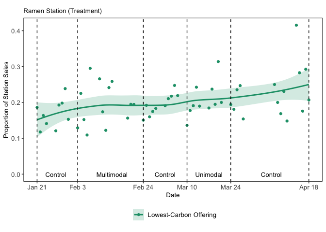<!-- -->

``` r
fall_data %>%
  filter(station=="Ramen"|station=="Grill") %>%
  filter(item_cat=="Main") %>%
  group_by(menu_condition,station,item) %>%
  summarise(total_count=sum(count)) %>%
  mutate(prop=case_when(menu_condition=="Carbon Label"~total_count/(32+159+935+74+85+685+135),
                        menu_condition=="Control"~total_count/(19+125+776+68+60+563+108),
                        menu_condition=="Default"~total_count/(33+167+904+76+90+698+172),
                        menu_condition=="Multimodal"~total_count/(41+165+1157+125+107+860+182))) %>%
   mutate(item=case_when(item=="Bowl Ramen Tofu"~"Lowest-Carbon Offering",
                        item=="Black Bean Burger"~"Lowest-Carbon Offering",
                        item=="Bowl Ramen Chicken"~"Highest-Carbon Offering",
                        item=="Grilled Hamburger"~"Highest-Carbon Offering",
                        item=="Grilled Chicken Breast Sandwich"~"Middle",
                        item=="Seared Salmon Burger"~"Middle",
                        item=="Trillium Grill Impossible Burger"~"Middle")) %>%
  ungroup() %>%
  group_by(menu_condition,item) %>%
  summarise(prop=sum(prop)) %>%
  filter(item=="Highest-Carbon Offering")
```

    ## `summarise()` has grouped output by 'menu_condition', 'station'. You can
    ## override using the `.groups` argument.
    ## `summarise()` has grouped output by 'menu_condition'. You can override using
    ## the `.groups` argument.

    ## # A tibble: 4 × 3
    ## # Groups:   menu_condition [4]
    ##   menu_condition item                     prop
    ##   <chr>          <chr>                   <dbl>
    ## 1 Carbon Label   Highest-Carbon Offering 0.770
    ## 2 Control        Highest-Carbon Offering 0.779
    ## 3 Default        Highest-Carbon Offering 0.749
    ## 4 Multimodal     Highest-Carbon Offering 0.765

``` r
fall_prop_high_treatment_aov_data <- fall_data %>%
  filter(station=="Ramen"|station=="Grill") %>%
  filter(item_cat=="Main") %>%
  group_by(date,menu_condition,station,item) %>%
  summarise(total_count=sum(count)) %>%
  mutate(item=case_when(item=="Bowl Ramen Tofu"~"Lowest-Carbon Offering",
                        item=="Black Bean Burger"~"Lowest-Carbon Offering",
                        item=="Bowl Ramen Chicken"~"Highest-Carbon Offering",
                        item=="Grilled Hamburger"~"Highest-Carbon Offering",
                        item=="Grilled Chicken Breast Sandwich"~"Middle",
                        item=="Seared Salmon Burger"~"Middle",
                        item=="Trillium Grill Impossible Burger"~"Middle")) %>%
  group_by(date,menu_condition,item) %>%
  summarise(total_count=sum(total_count)) %>%
  mutate(prop_high=case_when(item=="Highest-Carbon Offering"&menu_condition=="Carbon Label"&date=="1-Nov"~total_count/(100+16+25),
                             item=="Highest-Carbon Offering"&menu_condition=="Multimodal"&date=="10-Dec"~total_count/(89+4+20),
                             item=="Highest-Carbon Offering"&menu_condition=="Multimodal"&date=="11-Dec"~total_count/(89+9+19),
                             item=="Highest-Carbon Offering"&menu_condition=="Default"&date=="11-Nov"~total_count/(150+15+28),
                             item=="Highest-Carbon Offering"&menu_condition=="Multimodal"&date=="12-Dec"~total_count/(115+10+29),
                             item=="Highest-Carbon Offering"&menu_condition=="Default"&date=="12-Nov"~total_count/(165+22+42),
                             item=="Highest-Carbon Offering"&menu_condition=="Multimodal"&date=="13-Dec"~total_count/(99+8+16),
                             item=="Highest-Carbon Offering"&menu_condition=="Default"&date=="13-Nov"~total_count/(181+19+30),
                             item=="Highest-Carbon Offering"&menu_condition=="Default"&date=="14-Nov"~total_count/(177+24+43),
                             item=="Highest-Carbon Offering"&menu_condition=="Default"&date=="15-Nov"~total_count/(131+21+18),
                             item=="Highest-Carbon Offering"&menu_condition=="Multimodal"&date=="16-Dec"~total_count/(95+8+14),
                             item=="Highest-Carbon Offering"&menu_condition=="Control"&date=="16-Oct"~total_count/(179+18+30),
                             item=="Highest-Carbon Offering"&menu_condition=="Multimodal"&date=="17-Dec"~total_count/(96+9+23),
                             item=="Highest-Carbon Offering"&menu_condition=="Control"&date=="17-Oct"~total_count/(177+15+43),
                             item=="Highest-Carbon Offering"&menu_condition=="Multimodal"&date=="18-Dec"~total_count/(86+8+23),
                             item=="Highest-Carbon Offering"&menu_condition=="Default"&date=="18-Nov"~total_count/(148+18+41),
                             item=="Highest-Carbon Offering"&menu_condition=="Control"&date=="18-Oct"~total_count/(110+23+21),
                             item=="Highest-Carbon Offering"&menu_condition=="Multimodal"&date=="19-Dec"~total_count/(43+4+17),
                             item=="Highest-Carbon Offering"&menu_condition=="Default"&date=="19-Nov"~total_count/(192+31+42),
                             item=="Highest-Carbon Offering"&menu_condition=="Multimodal"&date=="2-Dec"~total_count/(191+25+15),
                             item=="Highest-Carbon Offering"&menu_condition=="Multimodal"&date=="20-Dec"~total_count/(45+3+14),
                             item=="Highest-Carbon Offering"&menu_condition=="Default"&date=="20-Nov"~total_count/(172+22+34),
                             item=="Highest-Carbon Offering"&menu_condition=="Default"&date=="21-Nov"~total_count/(186+24+31),
                             item=="Highest-Carbon Offering"&menu_condition=="Control"&date=="21-Oct"~total_count/(176+15+37),
                             item=="Highest-Carbon Offering"&menu_condition=="Default"&date=="22-Nov"~total_count/(100+9+24),
                             item=="Highest-Carbon Offering"&menu_condition=="Control"&date=="22-Oct"~total_count/(200+12+34),
                             item=="Highest-Carbon Offering"&menu_condition=="Control"&date=="23-Oct"~total_count/(183+11+33),
                             item=="Highest-Carbon Offering"&menu_condition=="Control"&date=="24-Oct"~total_count/(199+20+33),
                             item=="Highest-Carbon Offering"&menu_condition=="Multimodal"&date=="25-Nov"~total_count/(123+12+29),
                             item=="Highest-Carbon Offering"&menu_condition=="Control"&date=="25-Oct"~total_count/(115+13+22),
                             item=="Highest-Carbon Offering"&menu_condition=="Multimodal"&date=="26-Nov"~total_count/(97+9+20),
                             item=="Highest-Carbon Offering"&menu_condition=="Carbon Label"&date=="28-Oct"~total_count/(161+15+27),
                             item=="Highest-Carbon Offering"&menu_condition=="Carbon Label"&date=="29-Oct"~total_count/(169+19+37),
                             item=="Highest-Carbon Offering"&menu_condition=="Multimodal"&date=="3-Dec"~total_count/(173+25+30),
                             item=="Highest-Carbon Offering"&menu_condition=="Carbon Label"&date=="30-Oct"~total_count/(165+17+32),
                             item=="Highest-Carbon Offering"&menu_condition=="Carbon Label"&date=="31-Oct"~total_count/(186+11+41),
                             item=="Highest-Carbon Offering"&menu_condition=="Multimodal"&date=="4-Dec"~total_count/(201+14+28),
                             item=="Highest-Carbon Offering"&menu_condition=="Carbon Label"&date=="4-Nov"~total_count/(145+24+30),
                             item=="Highest-Carbon Offering"&menu_condition=="Multimodal"&date=="5-Dec"~total_count/(188+28+49),
                             item=="Highest-Carbon Offering"&menu_condition=="Carbon Label"&date=="5-Nov"~total_count/(180+13+29),
                             item=="Highest-Carbon Offering"&menu_condition=="Multimodal"&date=="6-Dec"~total_count/(134+23+22),
                             item=="Highest-Carbon Offering"&menu_condition=="Carbon Label"&date=="6-Nov"~total_count/(194+19+31),
                             item=="Highest-Carbon Offering"&menu_condition=="Carbon Label"&date=="7-Nov"~total_count/(181+18+40),
                             item=="Highest-Carbon Offering"&menu_condition=="Carbon Label"&date=="8-Nov"~total_count/(139+15+26),
                             item=="Highest-Carbon Offering"&menu_condition=="Multimodal"&date=="9-Dec"~total_count/(153+24+29))) %>%
  drop_na(prop_high) %>%
  mutate(date=case_when(date=="16-Oct"~"2024-10-16",
                        date=="17-Oct"~"2024-10-17",
                        date=="18-Oct"~"2024-10-18",
                        date=="21-Oct"~"2024-10-21",
                        date=="22-Oct"~"2024-10-22",
                        date=="23-Oct"~"2024-10-23",
                        date=="24-Oct"~"2024-10-24",
                        date=="25-Oct"~"2024-10-25",
                        date=="28-Oct"~"2024-10-28",
                        date=="29-Oct"~"2024-10-29",
                        date=="30-Oct"~"2024-10-30",
                        date=="31-Oct"~"2024-10-31",
                        date=="1-Nov"~"2024-11-1",
                        date=="4-Nov"~"2024-11-4",
                        date=="5-Nov"~"2024-11-5",
                        date=="6-Nov"~"2024-11-6",
                        date=="7-Nov"~"2024-11-7",
                        date=="8-Nov"~"2024-11-8",
                        date=="11-Nov"~"2024-11-11",
                        date=="12-Nov"~"2024-11-12",
                        date=="13-Nov"~"2024-11-13",
                        date=="14-Nov"~"2024-11-14",
                        date=="15-Nov"~"2024-11-15",
                        date=="18-Nov"~"2024-11-18",
                        date=="19-Nov"~"2024-11-19",
                        date=="20-Nov"~"2024-11-20",
                        date=="21-Nov"~"2024-11-21",
                        date=="22-Nov"~"2024-11-22",
                        date=="25-Nov"~"2024-11-25",
                        date=="26-Nov"~"2024-11-26",
                        date=="2-Dec"~"2024-12-2",
                        date=="3-Dec"~"2024-12-3",
                        date=="4-Dec"~"2024-12-4",
                        date=="5-Dec"~"2024-12-5",
                        date=="6-Dec"~"2024-12-6",
                        date=="9-Dec"~"2024-12-9",
                        date=="10-Dec"~"2024-12-10",
                        date=="11-Dec"~"2024-12-11",
                        date=="12-Dec"~"2024-12-12",
                        date=="13-Dec"~"2024-12-13",
                        date=="16-Dec"~"2024-12-16",
                        date=="17-Dec"~"2024-12-17",
                        date=="18-Dec"~"2024-12-18",
                        date=="19-Dec"~"2024-12-19",
                        date=="20-Dec"~"2024-12-20")) %>%
  mutate(date=as.Date(date)) %>%
  ungroup() %>%
  select(menu_condition,prop_high) %>%
  arrange(menu_condition) 
```

    ## `summarise()` has grouped output by 'date', 'menu_condition', 'station'. You
    ## can override using the `.groups` argument.
    ## `summarise()` has grouped output by 'date', 'menu_condition'. You can override
    ## using the `.groups` argument.

``` r
shapiro.test(fall_prop_high_treatment_aov_data$prop_high) 
```

    ## 
    ##  Shapiro-Wilk normality test
    ## 
    ## data:  fall_prop_high_treatment_aov_data$prop_high
    ## W = 0.98373, p-value = 0.771

``` r
oneway.test(prop_high~menu_condition,data=fall_prop_high_treatment_aov_data,var.equal=TRUE)
```

    ## 
    ##  One-way analysis of means
    ## 
    ## data:  prop_high and menu_condition
    ## F = 0.88407, num df = 3, denom df = 41, p-value = 0.4573

``` r
fall_prop_high_treatment <- fall_data %>%
  filter(station=="Ramen"|station=="Grill") %>%
  filter(item_cat=="Main") %>%
  group_by(date,menu_condition,station,item) %>%
  summarise(total_count=sum(count)) %>%
  mutate(item=case_when(item=="Bowl Ramen Tofu"~"Lowest-Carbon Offering",
                        item=="Black Bean Burger"~"Lowest-Carbon Offering",
                        item=="Bowl Ramen Chicken"~"Highest-Carbon Offering",
                        item=="Grilled Hamburger"~"Highest-Carbon Offering",
                        item=="Grilled Chicken Breast Sandwich"~"Middle",
                        item=="Seared Salmon Burger"~"Middle",
                        item=="Trillium Grill Impossible Burger"~"Middle")) %>%
  group_by(date,menu_condition,item) %>%
  summarise(total_count=sum(total_count)) %>%
  mutate(prop_high=case_when(item=="Highest-Carbon Offering"&menu_condition=="Carbon Label"&date=="1-Nov"~total_count/(100+16+25),
                             item=="Highest-Carbon Offering"&menu_condition=="Multimodal"&date=="10-Dec"~total_count/(89+4+20),
                             item=="Highest-Carbon Offering"&menu_condition=="Multimodal"&date=="11-Dec"~total_count/(89+9+19),
                             item=="Highest-Carbon Offering"&menu_condition=="Default"&date=="11-Nov"~total_count/(150+15+28),
                             item=="Highest-Carbon Offering"&menu_condition=="Multimodal"&date=="12-Dec"~total_count/(115+10+29),
                             item=="Highest-Carbon Offering"&menu_condition=="Default"&date=="12-Nov"~total_count/(165+22+42),
                             item=="Highest-Carbon Offering"&menu_condition=="Multimodal"&date=="13-Dec"~total_count/(99+8+16),
                             item=="Highest-Carbon Offering"&menu_condition=="Default"&date=="13-Nov"~total_count/(181+19+30),
                             item=="Highest-Carbon Offering"&menu_condition=="Default"&date=="14-Nov"~total_count/(177+24+43),
                             item=="Highest-Carbon Offering"&menu_condition=="Default"&date=="15-Nov"~total_count/(131+21+18),
                             item=="Highest-Carbon Offering"&menu_condition=="Multimodal"&date=="16-Dec"~total_count/(95+8+14),
                             item=="Highest-Carbon Offering"&menu_condition=="Control"&date=="16-Oct"~total_count/(179+18+30),
                             item=="Highest-Carbon Offering"&menu_condition=="Multimodal"&date=="17-Dec"~total_count/(96+9+23),
                             item=="Highest-Carbon Offering"&menu_condition=="Control"&date=="17-Oct"~total_count/(177+15+43),
                             item=="Highest-Carbon Offering"&menu_condition=="Multimodal"&date=="18-Dec"~total_count/(86+8+23),
                             item=="Highest-Carbon Offering"&menu_condition=="Default"&date=="18-Nov"~total_count/(148+18+41),
                             item=="Highest-Carbon Offering"&menu_condition=="Control"&date=="18-Oct"~total_count/(110+23+21),
                             item=="Highest-Carbon Offering"&menu_condition=="Multimodal"&date=="19-Dec"~total_count/(43+4+17),
                             item=="Highest-Carbon Offering"&menu_condition=="Default"&date=="19-Nov"~total_count/(192+31+42),
                             item=="Highest-Carbon Offering"&menu_condition=="Multimodal"&date=="2-Dec"~total_count/(191+25+15),
                             item=="Highest-Carbon Offering"&menu_condition=="Multimodal"&date=="20-Dec"~total_count/(45+3+14),
                             item=="Highest-Carbon Offering"&menu_condition=="Default"&date=="20-Nov"~total_count/(172+22+34),
                             item=="Highest-Carbon Offering"&menu_condition=="Default"&date=="21-Nov"~total_count/(186+24+31),
                             item=="Highest-Carbon Offering"&menu_condition=="Control"&date=="21-Oct"~total_count/(176+15+37),
                             item=="Highest-Carbon Offering"&menu_condition=="Default"&date=="22-Nov"~total_count/(100+9+24),
                             item=="Highest-Carbon Offering"&menu_condition=="Control"&date=="22-Oct"~total_count/(200+12+34),
                             item=="Highest-Carbon Offering"&menu_condition=="Control"&date=="23-Oct"~total_count/(183+11+33),
                             item=="Highest-Carbon Offering"&menu_condition=="Control"&date=="24-Oct"~total_count/(199+20+33),
                             item=="Highest-Carbon Offering"&menu_condition=="Multimodal"&date=="25-Nov"~total_count/(123+12+29),
                             item=="Highest-Carbon Offering"&menu_condition=="Control"&date=="25-Oct"~total_count/(115+13+22),
                             item=="Highest-Carbon Offering"&menu_condition=="Multimodal"&date=="26-Nov"~total_count/(97+9+20),
                             item=="Highest-Carbon Offering"&menu_condition=="Carbon Label"&date=="28-Oct"~total_count/(161+15+27),
                             item=="Highest-Carbon Offering"&menu_condition=="Carbon Label"&date=="29-Oct"~total_count/(169+19+37),
                             item=="Highest-Carbon Offering"&menu_condition=="Multimodal"&date=="3-Dec"~total_count/(173+25+30),
                             item=="Highest-Carbon Offering"&menu_condition=="Carbon Label"&date=="30-Oct"~total_count/(165+17+32),
                             item=="Highest-Carbon Offering"&menu_condition=="Carbon Label"&date=="31-Oct"~total_count/(186+11+41),
                             item=="Highest-Carbon Offering"&menu_condition=="Multimodal"&date=="4-Dec"~total_count/(201+14+28),
                             item=="Highest-Carbon Offering"&menu_condition=="Carbon Label"&date=="4-Nov"~total_count/(145+24+30),
                             item=="Highest-Carbon Offering"&menu_condition=="Multimodal"&date=="5-Dec"~total_count/(188+28+49),
                             item=="Highest-Carbon Offering"&menu_condition=="Carbon Label"&date=="5-Nov"~total_count/(180+13+29),
                             item=="Highest-Carbon Offering"&menu_condition=="Multimodal"&date=="6-Dec"~total_count/(134+23+22),
                             item=="Highest-Carbon Offering"&menu_condition=="Carbon Label"&date=="6-Nov"~total_count/(194+19+31),
                             item=="Highest-Carbon Offering"&menu_condition=="Carbon Label"&date=="7-Nov"~total_count/(181+18+40),
                             item=="Highest-Carbon Offering"&menu_condition=="Carbon Label"&date=="8-Nov"~total_count/(139+15+26),
                             item=="Highest-Carbon Offering"&menu_condition=="Multimodal"&date=="9-Dec"~total_count/(153+24+29))) %>%
  drop_na(prop_high) %>%
  mutate(date=case_when(date=="16-Oct"~"2024-10-16",
                        date=="17-Oct"~"2024-10-17",
                        date=="18-Oct"~"2024-10-18",
                        date=="21-Oct"~"2024-10-21",
                        date=="22-Oct"~"2024-10-22",
                        date=="23-Oct"~"2024-10-23",
                        date=="24-Oct"~"2024-10-24",
                        date=="25-Oct"~"2024-10-25",
                        date=="28-Oct"~"2024-10-28",
                        date=="29-Oct"~"2024-10-29",
                        date=="30-Oct"~"2024-10-30",
                        date=="31-Oct"~"2024-10-31",
                        date=="1-Nov"~"2024-11-1",
                        date=="4-Nov"~"2024-11-4",
                        date=="5-Nov"~"2024-11-5",
                        date=="6-Nov"~"2024-11-6",
                        date=="7-Nov"~"2024-11-7",
                        date=="8-Nov"~"2024-11-8",
                        date=="11-Nov"~"2024-11-11",
                        date=="12-Nov"~"2024-11-12",
                        date=="13-Nov"~"2024-11-13",
                        date=="14-Nov"~"2024-11-14",
                        date=="15-Nov"~"2024-11-15",
                        date=="18-Nov"~"2024-11-18",
                        date=="19-Nov"~"2024-11-19",
                        date=="20-Nov"~"2024-11-20",
                        date=="21-Nov"~"2024-11-21",
                        date=="22-Nov"~"2024-11-22",
                        date=="25-Nov"~"2024-11-25",
                        date=="26-Nov"~"2024-11-26",
                        date=="2-Dec"~"2024-12-2",
                        date=="3-Dec"~"2024-12-3",
                        date=="4-Dec"~"2024-12-4",
                        date=="5-Dec"~"2024-12-5",
                        date=="6-Dec"~"2024-12-6",
                        date=="9-Dec"~"2024-12-9",
                        date=="10-Dec"~"2024-12-10",
                        date=="11-Dec"~"2024-12-11",
                        date=="12-Dec"~"2024-12-12",
                        date=="13-Dec"~"2024-12-13",
                        date=="16-Dec"~"2024-12-16",
                        date=="17-Dec"~"2024-12-17",
                        date=="18-Dec"~"2024-12-18",
                        date=="19-Dec"~"2024-12-19",
                        date=="20-Dec"~"2024-12-20")) %>%
  mutate(date=as.Date(date)) %>%
  ggplot(aes(x=date,y=prop_high,color=item,fill=item)) + 
  geom_smooth(alpha=0.2) + 
  geom_point() +
  geom_vline(xintercept=as.numeric(daily_prop_low_fall_data$date[fall_vline]),linetype=2) +
  xlab("Date") + 
  ylab("Proportion of Station Sales") +
  scale_color_brewer(palette="Dark2",name="") +
  scale_fill_brewer(palette="Dark2",name="") +
  scale_x_date(breaks=as.Date(c("2024-10-16","2024-10-28","2024-11-11","2024-11-25","2024-12-20")),labels=c("Oct 16","Oct 28","Nov 11","Nov 25","Dec 20")) +
  annotate("text",x=as.Date("2024-10-22"),y=0.7689412,label="Control",size=10/.pt) +
  annotate("text",x=as.Date("2024-11-4"),y=0.7595962,label="Carbon Label",size=10/.pt) +
  annotate("text",x=as.Date("2024-11-18"),y=0.7385981,label="Default",size=10/.pt) +
  annotate("text",x=as.Date("2024-12-7"),y=0.7548843,label="Multimodal",size=10/.pt) +
  annotate("point",x=as.Date("2024-10-22"),y=0.7789412) +
  annotate("point",x=as.Date("2024-11-4"),y=0.7695962) +
  annotate("point",x=as.Date("2024-11-18"),y=0.7485981) +
  annotate("point",x=as.Date("2024-12-7"),y=0.7648843) +
  labs(title="Ramen & Grill Stations (Treated)",caption="F(3,41)= 0.88407, p=0.4573") +
  theme(aspect.ratio=0.55,legend.position="bottom",panel.grid=element_blank(),panel.background=element_rect(fill="white"),panel.border=element_rect(fill=NA),legend.title=element_text(size=10),legend.text=element_text(size=10),plot.title=element_text(size=10),axis.title=element_text(size=10),axis.text=element_text(size=10))
```

    ## `summarise()` has grouped output by 'date', 'menu_condition', 'station'. You
    ## can override using the `.groups` argument.
    ## `summarise()` has grouped output by 'date', 'menu_condition'. You can override
    ## using the `.groups` argument.

``` r
fall_prop_high_treatment
```

    ## `geom_smooth()` using method = 'loess' and formula = 'y ~ x'

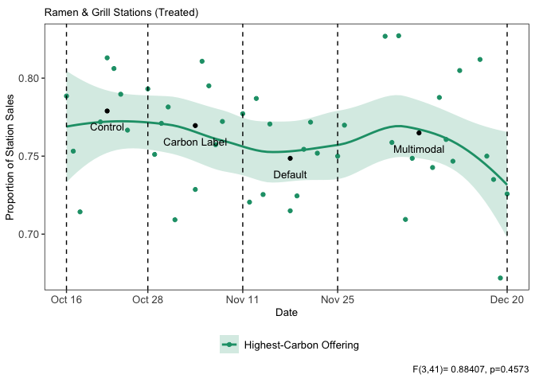<!-- -->

``` r
fall_data %>%
  filter(station=="Pasta") %>%
  filter(item_cat=="Main") %>%
  group_by(menu_condition,station,item) %>%
  summarise(total_count=sum(count)) %>%
  mutate(prop=case_when(menu_condition=="Carbon Label"~total_count/(1159+249),
                        menu_condition=="Control"~total_count/(951+207),
                        menu_condition=="Default"~total_count/(1101+240),
                        menu_condition=="Multimodal"~total_count/(1068+261))) %>%
  filter(item=="Create Your Pasta Bowl MEAT")
```

    ## `summarise()` has grouped output by 'menu_condition', 'station'. You can
    ## override using the `.groups` argument.

    ## # A tibble: 4 × 5
    ## # Groups:   menu_condition, station [4]
    ##   menu_condition station item                        total_count  prop
    ##   <chr>          <chr>   <chr>                             <int> <dbl>
    ## 1 Carbon Label   Pasta   Create Your Pasta Bowl MEAT        1159 0.823
    ## 2 Control        Pasta   Create Your Pasta Bowl MEAT         951 0.821
    ## 3 Default        Pasta   Create Your Pasta Bowl MEAT        1101 0.821
    ## 4 Multimodal     Pasta   Create Your Pasta Bowl MEAT        1068 0.804

``` r
fall_prop_high_control_aov_data <- fall_data %>%
  filter(station=="Pasta") %>%
  filter(item_cat=="Main") %>%
  group_by(date,menu_condition,station,item) %>%
  summarise(total_count=sum(count)) %>%
  mutate(prop_high=case_when(item=="Create Your Pasta Bowl MEAT"&menu_condition=="Carbon Label"&date=="1-Nov"~total_count/(87+8),
                             item=="Create Your Pasta Bowl MEAT"&menu_condition=="Multimodal"&date=="10-Dec"~total_count/(45+9),
                             item=="Create Your Pasta Bowl MEAT"&menu_condition=="Multimodal"&date=="11-Dec"~total_count/(41+15),
                             item=="Create Your Pasta Bowl MEAT"&menu_condition=="Default"&date=="11-Nov"~total_count/(119+25),
                             item=="Create Your Pasta Bowl MEAT"&menu_condition=="Multimodal"&date=="12-Dec"~total_count/(34+15),
                             item=="Create Your Pasta Bowl MEAT"&menu_condition=="Default"&date=="12-Nov"~total_count/(112+20),
                             item=="Create Your Pasta Bowl MEAT"&menu_condition=="Multimodal"&date=="13-Dec"~total_count/(45+5),
                             item=="Create Your Pasta Bowl MEAT"&menu_condition=="Default"&date=="13-Nov"~total_count/(113+26),
                             item=="Create Your Pasta Bowl MEAT"&menu_condition=="Default"&date=="14-Nov"~total_count/(103+31),
                             item=="Create Your Pasta Bowl MEAT"&menu_condition=="Default"&date=="15-Nov"~total_count/(79+15),
                             item=="Create Your Pasta Bowl MEAT"&menu_condition=="Multimodal"&date=="16-Dec"~total_count/(46+7),
                             item=="Create Your Pasta Bowl MEAT"&menu_condition=="Control"&date=="16-Oct"~total_count/(149+24),
                             item=="Create Your Pasta Bowl MEAT"&menu_condition=="Multimodal"&date=="17-Dec"~total_count/(30+10),
                             item=="Create Your Pasta Bowl MEAT"&menu_condition=="Control"&date=="17-Oct"~total_count/(128+33),
                             item=="Create Your Pasta Bowl MEAT"&menu_condition=="Multimodal"&date=="18-Dec"~total_count/(25+11),
                             item=="Create Your Pasta Bowl MEAT"&menu_condition=="Default"&date=="18-Nov"~total_count/(116+30),
                             item=="Create Your Pasta Bowl MEAT"&menu_condition=="Control"&date=="18-Oct"~total_count/(83+13),
                             item=="Create Your Pasta Bowl MEAT"&menu_condition=="Multimodal"&date=="19-Dec"~total_count/(12+4),
                             item=="Create Your Pasta Bowl MEAT"&menu_condition=="Default"&date=="19-Nov"~total_count/(115+28),
                             item=="Create Your Pasta Bowl MEAT"&menu_condition=="Multimodal"&date=="2-Dec"~total_count/(128+24),
                             item=="Create Your Pasta Bowl MEAT"&menu_condition=="Multimodal"&date=="20-Dec"~total_count/(16+5),
                             item=="Create Your Pasta Bowl MEAT"&menu_condition=="Default"&date=="20-Nov"~total_count/(143+32),
                             item=="Create Your Pasta Bowl MEAT"&menu_condition=="Default"&date=="21-Nov"~total_count/(131+24),
                             item=="Create Your Pasta Bowl MEAT"&menu_condition=="Control"&date=="21-Oct"~total_count/(124+37),
                             item=="Create Your Pasta Bowl MEAT"&menu_condition=="Default"&date=="22-Nov"~total_count/(70+9),
                             item=="Create Your Pasta Bowl MEAT"&menu_condition=="Control"&date=="22-Oct"~total_count/(132+26),
                             item=="Create Your Pasta Bowl MEAT"&menu_condition=="Control"&date=="23-Oct"~total_count/(124+28),
                             item=="Create Your Pasta Bowl MEAT"&menu_condition=="Control"&date=="24-Oct"~total_count/(131+32),
                             item=="Create Your Pasta Bowl MEAT"&menu_condition=="Multimodal"&date=="25-Nov"~total_count/(55+20),
                             item=="Create Your Pasta Bowl MEAT"&menu_condition=="Control"&date=="25-Oct"~total_count/(80+14),
                             item=="Create Your Pasta Bowl MEAT"&menu_condition=="Multimodal"&date=="26-Nov"~total_count/(29+6),
                             item=="Create Your Pasta Bowl MEAT"&menu_condition=="Carbon Label"&date=="28-Oct"~total_count/(127+38),
                             item=="Create Your Pasta Bowl MEAT"&menu_condition=="Carbon Label"&date=="29-Oct"~total_count/(108+25),
                             item=="Create Your Pasta Bowl MEAT"&menu_condition=="Multimodal"&date=="3-Dec"~total_count/(116+28),
                             item=="Create Your Pasta Bowl MEAT"&menu_condition=="Carbon Label"&date=="30-Oct"~total_count/(136+23),
                             item=="Create Your Pasta Bowl MEAT"&menu_condition=="Carbon Label"&date=="31-Oct"~total_count/(120+27),
                             item=="Create Your Pasta Bowl MEAT"&menu_condition=="Multimodal"&date=="4-Dec"~total_count/(142+27),
                             item=="Create Your Pasta Bowl MEAT"&menu_condition=="Carbon Label"&date=="4-Nov"~total_count/(118+34),
                             item=="Create Your Pasta Bowl MEAT"&menu_condition=="Multimodal"&date=="5-Dec"~total_count/(113+32),
                             item=="Create Your Pasta Bowl MEAT"&menu_condition=="Carbon Label"&date=="5-Nov"~total_count/(103+20),
                             item=="Create Your Pasta Bowl MEAT"&menu_condition=="Multimodal"&date=="6-Dec"~total_count/(83+12),
                             item=="Create Your Pasta Bowl MEAT"&menu_condition=="Carbon Label"&date=="6-Nov"~total_count/(136+30),
                             item=="Create Your Pasta Bowl MEAT"&menu_condition=="Carbon Label"&date=="7-Nov"~total_count/(132+28),
                             item=="Create Your Pasta Bowl MEAT"&menu_condition=="Carbon Label"&date=="8-Nov"~total_count/(92+16),
                             item=="Create Your Pasta Bowl MEAT"&menu_condition=="Multimodal"&date=="9-Dec"~total_count/(108+32))) %>%
  drop_na(prop_high) %>%
  mutate(date=case_when(date=="16-Oct"~"2024-10-16",
                        date=="17-Oct"~"2024-10-17",
                        date=="18-Oct"~"2024-10-18",
                        date=="21-Oct"~"2024-10-21",
                        date=="22-Oct"~"2024-10-22",
                        date=="23-Oct"~"2024-10-23",
                        date=="24-Oct"~"2024-10-24",
                        date=="25-Oct"~"2024-10-25",
                        date=="28-Oct"~"2024-10-28",
                        date=="29-Oct"~"2024-10-29",
                        date=="30-Oct"~"2024-10-30",
                        date=="31-Oct"~"2024-10-31",
                        date=="1-Nov"~"2024-11-1",
                        date=="4-Nov"~"2024-11-4",
                        date=="5-Nov"~"2024-11-5",
                        date=="6-Nov"~"2024-11-6",
                        date=="7-Nov"~"2024-11-7",
                        date=="8-Nov"~"2024-11-8",
                        date=="11-Nov"~"2024-11-11",
                        date=="12-Nov"~"2024-11-12",
                        date=="13-Nov"~"2024-11-13",
                        date=="14-Nov"~"2024-11-14",
                        date=="15-Nov"~"2024-11-15",
                        date=="18-Nov"~"2024-11-18",
                        date=="19-Nov"~"2024-11-19",
                        date=="20-Nov"~"2024-11-20",
                        date=="21-Nov"~"2024-11-21",
                        date=="22-Nov"~"2024-11-22",
                        date=="25-Nov"~"2024-11-25",
                        date=="26-Nov"~"2024-11-26",
                        date=="2-Dec"~"2024-12-2",
                        date=="3-Dec"~"2024-12-3",
                        date=="4-Dec"~"2024-12-4",
                        date=="5-Dec"~"2024-12-5",
                        date=="6-Dec"~"2024-12-6",
                        date=="9-Dec"~"2024-12-9",
                        date=="10-Dec"~"2024-12-10",
                        date=="11-Dec"~"2024-12-11",
                        date=="12-Dec"~"2024-12-12",
                        date=="13-Dec"~"2024-12-13",
                        date=="16-Dec"~"2024-12-16",
                        date=="17-Dec"~"2024-12-17",
                        date=="18-Dec"~"2024-12-18",
                        date=="19-Dec"~"2024-12-19",
                        date=="20-Dec"~"2024-12-20")) %>%
  mutate(date=as.Date(date)) %>%
  mutate(item=case_when(item=="Create Your Pasta Bowl MEAT"~"Highest-Carbon Offering")) %>%
  ungroup() %>%
  select(menu_condition,prop_high) %>%
  arrange(menu_condition)
```

    ## `summarise()` has grouped output by 'date', 'menu_condition', 'station'. You
    ## can override using the `.groups` argument.

``` r
shapiro.test(fall_prop_high_control_aov_data$prop_high) 
```

    ## 
    ##  Shapiro-Wilk normality test
    ## 
    ## data:  fall_prop_high_control_aov_data$prop_high
    ## W = 0.97805, p-value = 0.5427

``` r
oneway.test(prop_high~menu_condition,data=fall_prop_high_control_aov_data,var.equal=TRUE)
```

    ## 
    ##  One-way analysis of means
    ## 
    ## data:  prop_high and menu_condition
    ## F = 1.7451, num df = 3, denom df = 41, p-value = 0.1728

``` r
fall_prop_high_control <- fall_data %>%
  filter(station=="Pasta") %>%
  filter(item_cat=="Main") %>%
  group_by(date,menu_condition,station,item) %>%
  summarise(total_count=sum(count)) %>%
  mutate(prop_high=case_when(item=="Create Your Pasta Bowl MEAT"&menu_condition=="Carbon Label"&date=="1-Nov"~total_count/(87+8),
                             item=="Create Your Pasta Bowl MEAT"&menu_condition=="Multimodal"&date=="10-Dec"~total_count/(45+9),
                             item=="Create Your Pasta Bowl MEAT"&menu_condition=="Multimodal"&date=="11-Dec"~total_count/(41+15),
                             item=="Create Your Pasta Bowl MEAT"&menu_condition=="Default"&date=="11-Nov"~total_count/(119+25),
                             item=="Create Your Pasta Bowl MEAT"&menu_condition=="Multimodal"&date=="12-Dec"~total_count/(34+15),
                             item=="Create Your Pasta Bowl MEAT"&menu_condition=="Default"&date=="12-Nov"~total_count/(112+20),
                             item=="Create Your Pasta Bowl MEAT"&menu_condition=="Multimodal"&date=="13-Dec"~total_count/(45+5),
                             item=="Create Your Pasta Bowl MEAT"&menu_condition=="Default"&date=="13-Nov"~total_count/(113+26),
                             item=="Create Your Pasta Bowl MEAT"&menu_condition=="Default"&date=="14-Nov"~total_count/(103+31),
                             item=="Create Your Pasta Bowl MEAT"&menu_condition=="Default"&date=="15-Nov"~total_count/(79+15),
                             item=="Create Your Pasta Bowl MEAT"&menu_condition=="Multimodal"&date=="16-Dec"~total_count/(46+7),
                             item=="Create Your Pasta Bowl MEAT"&menu_condition=="Control"&date=="16-Oct"~total_count/(149+24),
                             item=="Create Your Pasta Bowl MEAT"&menu_condition=="Multimodal"&date=="17-Dec"~total_count/(30+10),
                             item=="Create Your Pasta Bowl MEAT"&menu_condition=="Control"&date=="17-Oct"~total_count/(128+33),
                             item=="Create Your Pasta Bowl MEAT"&menu_condition=="Multimodal"&date=="18-Dec"~total_count/(25+11),
                             item=="Create Your Pasta Bowl MEAT"&menu_condition=="Default"&date=="18-Nov"~total_count/(116+30),
                             item=="Create Your Pasta Bowl MEAT"&menu_condition=="Control"&date=="18-Oct"~total_count/(83+13),
                             item=="Create Your Pasta Bowl MEAT"&menu_condition=="Multimodal"&date=="19-Dec"~total_count/(12+4),
                             item=="Create Your Pasta Bowl MEAT"&menu_condition=="Default"&date=="19-Nov"~total_count/(115+28),
                             item=="Create Your Pasta Bowl MEAT"&menu_condition=="Multimodal"&date=="2-Dec"~total_count/(128+24),
                             item=="Create Your Pasta Bowl MEAT"&menu_condition=="Multimodal"&date=="20-Dec"~total_count/(16+5),
                             item=="Create Your Pasta Bowl MEAT"&menu_condition=="Default"&date=="20-Nov"~total_count/(143+32),
                             item=="Create Your Pasta Bowl MEAT"&menu_condition=="Default"&date=="21-Nov"~total_count/(131+24),
                             item=="Create Your Pasta Bowl MEAT"&menu_condition=="Control"&date=="21-Oct"~total_count/(124+37),
                             item=="Create Your Pasta Bowl MEAT"&menu_condition=="Default"&date=="22-Nov"~total_count/(70+9),
                             item=="Create Your Pasta Bowl MEAT"&menu_condition=="Control"&date=="22-Oct"~total_count/(132+26),
                             item=="Create Your Pasta Bowl MEAT"&menu_condition=="Control"&date=="23-Oct"~total_count/(124+28),
                             item=="Create Your Pasta Bowl MEAT"&menu_condition=="Control"&date=="24-Oct"~total_count/(131+32),
                             item=="Create Your Pasta Bowl MEAT"&menu_condition=="Multimodal"&date=="25-Nov"~total_count/(55+20),
                             item=="Create Your Pasta Bowl MEAT"&menu_condition=="Control"&date=="25-Oct"~total_count/(80+14),
                             item=="Create Your Pasta Bowl MEAT"&menu_condition=="Multimodal"&date=="26-Nov"~total_count/(29+6),
                             item=="Create Your Pasta Bowl MEAT"&menu_condition=="Carbon Label"&date=="28-Oct"~total_count/(127+38),
                             item=="Create Your Pasta Bowl MEAT"&menu_condition=="Carbon Label"&date=="29-Oct"~total_count/(108+25),
                             item=="Create Your Pasta Bowl MEAT"&menu_condition=="Multimodal"&date=="3-Dec"~total_count/(116+28),
                             item=="Create Your Pasta Bowl MEAT"&menu_condition=="Carbon Label"&date=="30-Oct"~total_count/(136+23),
                             item=="Create Your Pasta Bowl MEAT"&menu_condition=="Carbon Label"&date=="31-Oct"~total_count/(120+27),
                             item=="Create Your Pasta Bowl MEAT"&menu_condition=="Multimodal"&date=="4-Dec"~total_count/(142+27),
                             item=="Create Your Pasta Bowl MEAT"&menu_condition=="Carbon Label"&date=="4-Nov"~total_count/(118+34),
                             item=="Create Your Pasta Bowl MEAT"&menu_condition=="Multimodal"&date=="5-Dec"~total_count/(113+32),
                             item=="Create Your Pasta Bowl MEAT"&menu_condition=="Carbon Label"&date=="5-Nov"~total_count/(103+20),
                             item=="Create Your Pasta Bowl MEAT"&menu_condition=="Multimodal"&date=="6-Dec"~total_count/(83+12),
                             item=="Create Your Pasta Bowl MEAT"&menu_condition=="Carbon Label"&date=="6-Nov"~total_count/(136+30),
                             item=="Create Your Pasta Bowl MEAT"&menu_condition=="Carbon Label"&date=="7-Nov"~total_count/(132+28),
                             item=="Create Your Pasta Bowl MEAT"&menu_condition=="Carbon Label"&date=="8-Nov"~total_count/(92+16),
                             item=="Create Your Pasta Bowl MEAT"&menu_condition=="Multimodal"&date=="9-Dec"~total_count/(108+32))) %>%
  drop_na(prop_high) %>%
  mutate(date=case_when(date=="16-Oct"~"2024-10-16",
                        date=="17-Oct"~"2024-10-17",
                        date=="18-Oct"~"2024-10-18",
                        date=="21-Oct"~"2024-10-21",
                        date=="22-Oct"~"2024-10-22",
                        date=="23-Oct"~"2024-10-23",
                        date=="24-Oct"~"2024-10-24",
                        date=="25-Oct"~"2024-10-25",
                        date=="28-Oct"~"2024-10-28",
                        date=="29-Oct"~"2024-10-29",
                        date=="30-Oct"~"2024-10-30",
                        date=="31-Oct"~"2024-10-31",
                        date=="1-Nov"~"2024-11-1",
                        date=="4-Nov"~"2024-11-4",
                        date=="5-Nov"~"2024-11-5",
                        date=="6-Nov"~"2024-11-6",
                        date=="7-Nov"~"2024-11-7",
                        date=="8-Nov"~"2024-11-8",
                        date=="11-Nov"~"2024-11-11",
                        date=="12-Nov"~"2024-11-12",
                        date=="13-Nov"~"2024-11-13",
                        date=="14-Nov"~"2024-11-14",
                        date=="15-Nov"~"2024-11-15",
                        date=="18-Nov"~"2024-11-18",
                        date=="19-Nov"~"2024-11-19",
                        date=="20-Nov"~"2024-11-20",
                        date=="21-Nov"~"2024-11-21",
                        date=="22-Nov"~"2024-11-22",
                        date=="25-Nov"~"2024-11-25",
                        date=="26-Nov"~"2024-11-26",
                        date=="2-Dec"~"2024-12-2",
                        date=="3-Dec"~"2024-12-3",
                        date=="4-Dec"~"2024-12-4",
                        date=="5-Dec"~"2024-12-5",
                        date=="6-Dec"~"2024-12-6",
                        date=="9-Dec"~"2024-12-9",
                        date=="10-Dec"~"2024-12-10",
                        date=="11-Dec"~"2024-12-11",
                        date=="12-Dec"~"2024-12-12",
                        date=="13-Dec"~"2024-12-13",
                        date=="16-Dec"~"2024-12-16",
                        date=="17-Dec"~"2024-12-17",
                        date=="18-Dec"~"2024-12-18",
                        date=="19-Dec"~"2024-12-19",
                        date=="20-Dec"~"2024-12-20")) %>%
  mutate(date=as.Date(date)) %>%
  mutate(item=case_when(item=="Create Your Pasta Bowl MEAT"~"Highest-Carbon Offering")) %>%
  ggplot(aes(x=date,y=prop_high,color=item,fill=item)) + 
  geom_smooth(alpha=0.2) + 
  geom_point() +
  geom_vline(xintercept=as.numeric(daily_prop_low_fall_data$date[fall_vline]),linetype=2) +
  xlab("Date") + 
  ylab("Proportion of Station Sales") +
  scale_color_brewer(palette="Set1",name="") +
  scale_fill_brewer(palette="Set1",name="") +
  scale_x_date(breaks=as.Date(c("2024-10-16","2024-10-28","2024-11-11","2024-11-25","2024-12-20")),labels=c("Oct 16","Oct 28","Nov 11","Nov 25","Dec 20")) +
  annotate("text",x=as.Date("2024-10-22"),y=0.8112435,label="Control",size=10/.pt) +
  annotate("text",x=as.Date("2024-11-4"),y=0.8131534,label="Carbon Label",size=10/.pt) +
  annotate("text",x=as.Date("2024-11-18"),y=0.8110291,label="Default",size=10/.pt) +
  annotate("text",x=as.Date("2024-12-7"),y=0.7936117,label="Multimodal",size=10/.pt) +
  annotate("point",x=as.Date("2024-10-22"),y=0.8212435) +
  annotate("point",x=as.Date("2024-11-4"),y=0.8231534) +
  annotate("point",x=as.Date("2024-11-18"),y=0.8210291) +
  annotate("point",x=as.Date("2024-12-7"),y=0.8036117) +
  labs(title="Pasta Station (Untreated)",caption="F(3,41)=1.7451, p=0.1728") +
  theme(aspect.ratio=0.55,legend.position="bottom",panel.grid=element_blank(),panel.background=element_rect(fill="white"),panel.border=element_rect(fill=NA),legend.title=element_text(size=10),legend.text=element_text(size=10),plot.title=element_text(size=10),axis.title=element_text(size=10),axis.text=element_text(size=10)) 
```

    ## `summarise()` has grouped output by 'date', 'menu_condition', 'station'. You
    ## can override using the `.groups` argument.

``` r
fall_prop_high_control
```

    ## `geom_smooth()` using method = 'loess' and formula = 'y ~ x'

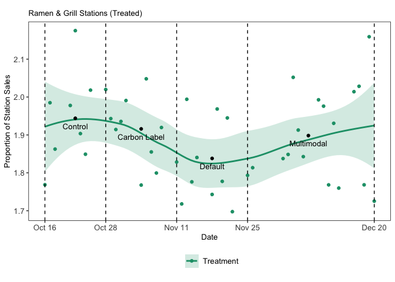<!-- -->

``` r
fall_prop_high <- ggarrange(fall_prop_high_ramen,fall_prop_high_grill,fall_prop_high_treatment,fall_prop_high_control,
          labels=c("A","B","C","D"),
          legend="none")
```

    ## `geom_smooth()` using method = 'loess' and formula = 'y ~ x'
    ## `geom_smooth()` using method = 'loess' and formula = 'y ~ x'
    ## `geom_smooth()` using method = 'loess' and formula = 'y ~ x'
    ## `geom_smooth()` using method = 'loess' and formula = 'y ~ x'

``` r
fall_prop_high <- annotate_figure(fall_prop_high,top=text_grob("Daily Sales Percentages of Highest-Carbon Offerings (%)", 
               color="black",face="bold",size=12))
ggsave(filename="fall_prop_high.png",plot=fall_prop_high,path="/Users/kenjinchang/github/multimodal-framework-validation/figures",width=40,height=24,units="cm",dpi=150,limitsize=TRUE)
fall_prop_high
```

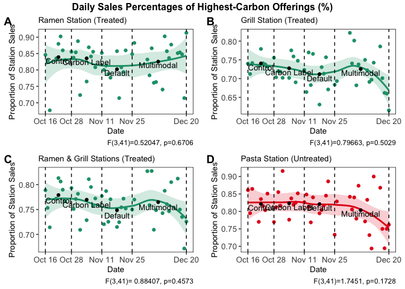<!-- -->

## mean carbon

``` r
fall_data %>%
  filter(station=="Grill") %>%
  filter(item_cat=="Main") %>%
  group_by(menu_condition,station) %>%
  summarise(total_carbon_cost=sum(corr_carbon_cost),total_sales=sum(count)) %>%
  mutate(mean_carbon_cost=total_carbon_cost/total_sales)
```

    ## `summarise()` has grouped output by 'menu_condition'. You can override using
    ## the `.groups` argument.

    ## # A tibble: 4 × 5
    ## # Groups:   menu_condition [4]
    ##   menu_condition station total_carbon_cost total_sales mean_carbon_cost
    ##   <chr>          <chr>               <dbl>       <int>            <dbl>
    ## 1 Carbon Label   Grill               3732.        1285             2.90
    ## 2 Control        Grill               3095.        1048             2.95
    ## 3 Default        Grill               3616.        1270             2.85
    ## 4 Multimodal     Grill               4623.        1595             2.90

``` r
fall_mean_carbon_grill_aov_data <- fall_data %>%
  filter(station=="Grill") %>%
  filter(item_cat=="Main") %>%
  group_by(date,menu_condition,station) %>%
  summarise(total_carbon_cost=sum(corr_carbon_cost),total_sales=sum(count)) %>%
  mutate(mean_carbon_cost=total_carbon_cost/total_sales) %>%
  mutate(date=case_when(date=="16-Oct"~"2024-10-16",
                        date=="17-Oct"~"2024-10-17",
                        date=="18-Oct"~"2024-10-18",
                        date=="21-Oct"~"2024-10-21",
                        date=="22-Oct"~"2024-10-22",
                        date=="23-Oct"~"2024-10-23",
                        date=="24-Oct"~"2024-10-24",
                        date=="25-Oct"~"2024-10-25",
                        date=="28-Oct"~"2024-10-28",
                        date=="29-Oct"~"2024-10-29",
                        date=="30-Oct"~"2024-10-30",
                        date=="31-Oct"~"2024-10-31",
                        date=="1-Nov"~"2024-11-1",
                        date=="4-Nov"~"2024-11-4",
                        date=="5-Nov"~"2024-11-5",
                        date=="6-Nov"~"2024-11-6",
                        date=="7-Nov"~"2024-11-7",
                        date=="8-Nov"~"2024-11-8",
                        date=="11-Nov"~"2024-11-11",
                        date=="12-Nov"~"2024-11-12",
                        date=="13-Nov"~"2024-11-13",
                        date=="14-Nov"~"2024-11-14",
                        date=="15-Nov"~"2024-11-15",
                        date=="18-Nov"~"2024-11-18",
                        date=="19-Nov"~"2024-11-19",
                        date=="20-Nov"~"2024-11-20",
                        date=="21-Nov"~"2024-11-21",
                        date=="22-Nov"~"2024-11-22",
                        date=="25-Nov"~"2024-11-25",
                        date=="26-Nov"~"2024-11-26",
                        date=="2-Dec"~"2024-12-2",
                        date=="3-Dec"~"2024-12-3",
                        date=="4-Dec"~"2024-12-4",
                        date=="5-Dec"~"2024-12-5",
                        date=="6-Dec"~"2024-12-6",
                        date=="9-Dec"~"2024-12-9",
                        date=="10-Dec"~"2024-12-10",
                        date=="11-Dec"~"2024-12-11",
                        date=="12-Dec"~"2024-12-12",
                        date=="13-Dec"~"2024-12-13",
                        date=="16-Dec"~"2024-12-16",
                        date=="17-Dec"~"2024-12-17",
                        date=="18-Dec"~"2024-12-18",
                        date=="19-Dec"~"2024-12-19",
                        date=="20-Dec"~"2024-12-20")) %>%
  mutate(date=as.Date(date)) %>%
  ungroup() %>%
  select(menu_condition,mean_carbon_cost) %>%
  arrange(menu_condition)
```

    ## `summarise()` has grouped output by 'date', 'menu_condition'. You can override
    ## using the `.groups` argument.

``` r
shapiro.test(fall_mean_carbon_grill_aov_data$mean_carbon_cost) 
```

    ## 
    ##  Shapiro-Wilk normality test
    ## 
    ## data:  fall_mean_carbon_grill_aov_data$mean_carbon_cost
    ## W = 0.99232, p-value = 0.9902

``` r
oneway.test(mean_carbon_cost~menu_condition,data=fall_mean_carbon_grill_aov_data,var.equal=TRUE)
```

    ## 
    ##  One-way analysis of means
    ## 
    ## data:  mean_carbon_cost and menu_condition
    ## F = 0.84363, num df = 3, denom df = 41, p-value = 0.4779

oneway.test(mean_carbon_cost~menu_condition,data=fall_mean_carbon_grill_aov_data,var.equal=TRUE)

``` r
fall_mean_carbon_grill <- fall_data %>%
  filter(station=="Grill") %>%
  filter(item_cat=="Main") %>%
  group_by(date,menu_condition,station) %>%
  summarise(total_carbon_cost=sum(corr_carbon_cost),total_sales=sum(count)) %>%
  mutate(mean_carbon_cost=total_carbon_cost/total_sales) %>%
  mutate(date=case_when(date=="16-Oct"~"2024-10-16",
                        date=="17-Oct"~"2024-10-17",
                        date=="18-Oct"~"2024-10-18",
                        date=="21-Oct"~"2024-10-21",
                        date=="22-Oct"~"2024-10-22",
                        date=="23-Oct"~"2024-10-23",
                        date=="24-Oct"~"2024-10-24",
                        date=="25-Oct"~"2024-10-25",
                        date=="28-Oct"~"2024-10-28",
                        date=="29-Oct"~"2024-10-29",
                        date=="30-Oct"~"2024-10-30",
                        date=="31-Oct"~"2024-10-31",
                        date=="1-Nov"~"2024-11-1",
                        date=="4-Nov"~"2024-11-4",
                        date=="5-Nov"~"2024-11-5",
                        date=="6-Nov"~"2024-11-6",
                        date=="7-Nov"~"2024-11-7",
                        date=="8-Nov"~"2024-11-8",
                        date=="11-Nov"~"2024-11-11",
                        date=="12-Nov"~"2024-11-12",
                        date=="13-Nov"~"2024-11-13",
                        date=="14-Nov"~"2024-11-14",
                        date=="15-Nov"~"2024-11-15",
                        date=="18-Nov"~"2024-11-18",
                        date=="19-Nov"~"2024-11-19",
                        date=="20-Nov"~"2024-11-20",
                        date=="21-Nov"~"2024-11-21",
                        date=="22-Nov"~"2024-11-22",
                        date=="25-Nov"~"2024-11-25",
                        date=="26-Nov"~"2024-11-26",
                        date=="2-Dec"~"2024-12-2",
                        date=="3-Dec"~"2024-12-3",
                        date=="4-Dec"~"2024-12-4",
                        date=="5-Dec"~"2024-12-5",
                        date=="6-Dec"~"2024-12-6",
                        date=="9-Dec"~"2024-12-9",
                        date=="10-Dec"~"2024-12-10",
                        date=="11-Dec"~"2024-12-11",
                        date=="12-Dec"~"2024-12-12",
                        date=="13-Dec"~"2024-12-13",
                        date=="16-Dec"~"2024-12-16",
                        date=="17-Dec"~"2024-12-17",
                        date=="18-Dec"~"2024-12-18",
                        date=="19-Dec"~"2024-12-19",
                        date=="20-Dec"~"2024-12-20")) %>%
  mutate(date=as.Date(date)) %>%
  ggplot(aes(x=date,y=mean_carbon_cost,color=station,fill=station)) + 
  geom_smooth(alpha=0.2) + 
  geom_point() +
  geom_vline(xintercept=as.numeric(daily_prop_low_fall_data$date[fall_vline]),linetype=2) +
  xlab("Date") + 
  ylab(bquote('Kilograms of CO'[2]*'e')) +
  scale_color_brewer(palette="Dark2",name="") +
  scale_fill_brewer(palette="Dark2",name="") +
  scale_x_date(breaks=as.Date(c("2024-10-16","2024-10-28","2024-11-11","2024-11-25","2024-12-20")),labels=c("Oct 16","Oct 28","Nov 11","Nov 25","Dec 20")) +
  labs(title="Grill Station (Treated)",caption="F(3,41)=0.84363, p=0.4779") +
  annotate("text",x=as.Date("2024-10-22"),y=2.912993,label="Control",size=10/.pt) +
  annotate("text",x=as.Date("2024-11-4"),y=2.863895,label="Carbon Label",size=10/.pt) +
  annotate("text",x=as.Date("2024-11-18"),y=2.806977,label="Default",size=10/.pt) +
  annotate("text",x=as.Date("2024-12-7"),y=2.858700,label="Multimodal",size=10/.pt) +
  annotate("point",x=as.Date("2024-10-22"),y=2.952993) +
  annotate("point",x=as.Date("2024-11-4"),y=2.903895) +
  annotate("point",x=as.Date("2024-11-18"),y=2.846977) +
  annotate("point",x=as.Date("2024-12-7"),y=2.898700) +
  theme(aspect.ratio=0.55,legend.position="bottom",panel.grid=element_blank(),panel.background=element_rect(fill="white"),panel.border=element_rect(fill=NA),legend.title=element_text(size=10),legend.text=element_text(size=10),plot.title=element_text(size=10),axis.title=element_text(size=10),axis.text=element_text(size=10)) 
```

    ## `summarise()` has grouped output by 'date', 'menu_condition'. You can override
    ## using the `.groups` argument.

``` r
fall_mean_carbon_grill
```

    ## `geom_smooth()` using method = 'loess' and formula = 'y ~ x'

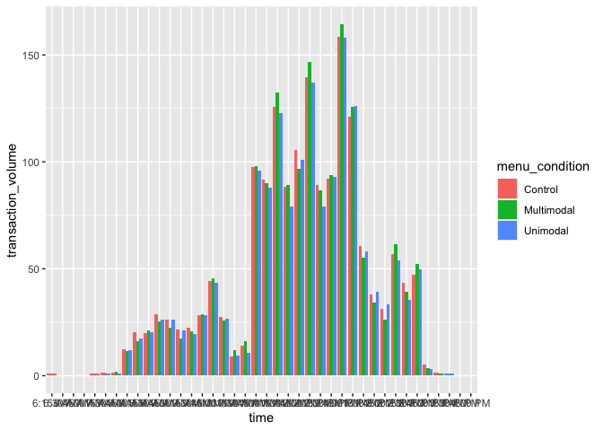<!-- -->

``` r
fall_data %>%
  filter(station=="Ramen") %>%
  filter(item_cat=="Main") %>%
  group_by(menu_condition,station) %>%
  summarise(total_carbon_cost=sum(corr_carbon_cost),total_sales=sum(count)) %>%
  mutate(mean_carbon_cost=total_carbon_cost/total_sales) 
```

    ## `summarise()` has grouped output by 'menu_condition'. You can override using
    ## the `.groups` argument.

    ## # A tibble: 4 × 5
    ## # Groups:   menu_condition [4]
    ##   menu_condition station total_carbon_cost total_sales mean_carbon_cost
    ##   <chr>          <chr>               <dbl>       <int>            <dbl>
    ## 1 Carbon Label   Ramen                301.         820            0.368
    ## 2 Control        Ramen                247.         671            0.368
    ## 3 Default        Ramen                318.         870            0.365
    ## 4 Multimodal     Ramen                382.        1042            0.367

``` r
fall_mean_carbon_ramen_aov_data <- fall_data %>%
  filter(station=="Ramen") %>%
  filter(item_cat=="Main") %>%
  group_by(date,menu_condition,station) %>%
  summarise(total_carbon_cost=sum(corr_carbon_cost),total_sales=sum(count)) %>%
  mutate(mean_carbon_cost=total_carbon_cost/total_sales) %>%
  mutate(date=case_when(date=="16-Oct"~"2024-10-16",
                        date=="17-Oct"~"2024-10-17",
                        date=="18-Oct"~"2024-10-18",
                        date=="21-Oct"~"2024-10-21",
                        date=="22-Oct"~"2024-10-22",
                        date=="23-Oct"~"2024-10-23",
                        date=="24-Oct"~"2024-10-24",
                        date=="25-Oct"~"2024-10-25",
                        date=="28-Oct"~"2024-10-28",
                        date=="29-Oct"~"2024-10-29",
                        date=="30-Oct"~"2024-10-30",
                        date=="31-Oct"~"2024-10-31",
                        date=="1-Nov"~"2024-11-1",
                        date=="4-Nov"~"2024-11-4",
                        date=="5-Nov"~"2024-11-5",
                        date=="6-Nov"~"2024-11-6",
                        date=="7-Nov"~"2024-11-7",
                        date=="8-Nov"~"2024-11-8",
                        date=="11-Nov"~"2024-11-11",
                        date=="12-Nov"~"2024-11-12",
                        date=="13-Nov"~"2024-11-13",
                        date=="14-Nov"~"2024-11-14",
                        date=="15-Nov"~"2024-11-15",
                        date=="18-Nov"~"2024-11-18",
                        date=="19-Nov"~"2024-11-19",
                        date=="20-Nov"~"2024-11-20",
                        date=="21-Nov"~"2024-11-21",
                        date=="22-Nov"~"2024-11-22",
                        date=="25-Nov"~"2024-11-25",
                        date=="26-Nov"~"2024-11-26",
                        date=="2-Dec"~"2024-12-2",
                        date=="3-Dec"~"2024-12-3",
                        date=="4-Dec"~"2024-12-4",
                        date=="5-Dec"~"2024-12-5",
                        date=="6-Dec"~"2024-12-6",
                        date=="9-Dec"~"2024-12-9",
                        date=="10-Dec"~"2024-12-10",
                        date=="11-Dec"~"2024-12-11",
                        date=="12-Dec"~"2024-12-12",
                        date=="13-Dec"~"2024-12-13",
                        date=="16-Dec"~"2024-12-16",
                        date=="17-Dec"~"2024-12-17",
                        date=="18-Dec"~"2024-12-18",
                        date=="19-Dec"~"2024-12-19",
                        date=="20-Dec"~"2024-12-20")) %>%
  mutate(date=as.Date(date)) %>%
  ungroup() %>%
  select(menu_condition,mean_carbon_cost) %>%
  arrange(menu_condition)
```

    ## `summarise()` has grouped output by 'date', 'menu_condition'. You can override
    ## using the `.groups` argument.

``` r
shapiro.test(fall_mean_carbon_ramen_aov_data$mean_carbon_cost) 
```

    ## 
    ##  Shapiro-Wilk normality test
    ## 
    ## data:  fall_mean_carbon_ramen_aov_data$mean_carbon_cost
    ## W = 0.93068, p-value = 0.009914

``` r
oneway.test(mean_carbon_cost~menu_condition,data=fall_mean_carbon_ramen_aov_data,var.equal=TRUE)
```

    ## 
    ##  One-way analysis of means
    ## 
    ## data:  mean_carbon_cost and menu_condition
    ## F = 0.52047, num df = 3, denom df = 41, p-value = 0.6706

``` r
fall_mean_carbon_ramen <- fall_data %>%
  filter(station=="Ramen") %>%
  filter(item_cat=="Main") %>%
  group_by(date,menu_condition,station) %>%
  summarise(total_carbon_cost=sum(corr_carbon_cost),total_sales=sum(count)) %>%
  mutate(mean_carbon_cost=total_carbon_cost/total_sales) %>%
  mutate(date=case_when(date=="16-Oct"~"2024-10-16",
                        date=="17-Oct"~"2024-10-17",
                        date=="18-Oct"~"2024-10-18",
                        date=="21-Oct"~"2024-10-21",
                        date=="22-Oct"~"2024-10-22",
                        date=="23-Oct"~"2024-10-23",
                        date=="24-Oct"~"2024-10-24",
                        date=="25-Oct"~"2024-10-25",
                        date=="28-Oct"~"2024-10-28",
                        date=="29-Oct"~"2024-10-29",
                        date=="30-Oct"~"2024-10-30",
                        date=="31-Oct"~"2024-10-31",
                        date=="1-Nov"~"2024-11-1",
                        date=="4-Nov"~"2024-11-4",
                        date=="5-Nov"~"2024-11-5",
                        date=="6-Nov"~"2024-11-6",
                        date=="7-Nov"~"2024-11-7",
                        date=="8-Nov"~"2024-11-8",
                        date=="11-Nov"~"2024-11-11",
                        date=="12-Nov"~"2024-11-12",
                        date=="13-Nov"~"2024-11-13",
                        date=="14-Nov"~"2024-11-14",
                        date=="15-Nov"~"2024-11-15",
                        date=="18-Nov"~"2024-11-18",
                        date=="19-Nov"~"2024-11-19",
                        date=="20-Nov"~"2024-11-20",
                        date=="21-Nov"~"2024-11-21",
                        date=="22-Nov"~"2024-11-22",
                        date=="25-Nov"~"2024-11-25",
                        date=="26-Nov"~"2024-11-26",
                        date=="2-Dec"~"2024-12-2",
                        date=="3-Dec"~"2024-12-3",
                        date=="4-Dec"~"2024-12-4",
                        date=="5-Dec"~"2024-12-5",
                        date=="6-Dec"~"2024-12-6",
                        date=="9-Dec"~"2024-12-9",
                        date=="10-Dec"~"2024-12-10",
                        date=="11-Dec"~"2024-12-11",
                        date=="12-Dec"~"2024-12-12",
                        date=="13-Dec"~"2024-12-13",
                        date=="16-Dec"~"2024-12-16",
                        date=="17-Dec"~"2024-12-17",
                        date=="18-Dec"~"2024-12-18",
                        date=="19-Dec"~"2024-12-19",
                        date=="20-Dec"~"2024-12-20")) %>%
  mutate(date=as.Date(date)) %>%
  ggplot(aes(x=date,y=mean_carbon_cost,color=station,fill=station)) + 
  geom_smooth(alpha=0.2) + 
  geom_point() +
  geom_vline(xintercept=as.numeric(daily_prop_low_fall_data$date[fall_vline]),linetype=2) +
  xlab("Date") + 
  ylab(bquote('Kilograms of CO'[2]*'e')) +
  scale_color_brewer(palette="Dark2",name="") +
  scale_fill_brewer(palette="Dark2",name="") +
  scale_x_date(breaks=as.Date(c("2024-10-16","2024-10-28","2024-11-11","2024-11-25","2024-12-20")),labels=c("Oct 16","Oct 28","Nov 11","Nov 25","Dec 20")) +
  labs(title="Ramen Station (Treated)",caption="F(3,41)=0.52047, p-value=0.6706") +
  annotate("text",x=as.Date("2024-10-22"),y=0.3669079,label="Control",size=10/.pt) +
  annotate("text",x=as.Date("2024-11-4"),y=0.3666386,label="Carbon Label",size=10/.pt) +
  annotate("text",x=as.Date("2024-11-18"),y=0.3642188,label="Default",size=10/.pt) +
  annotate("text",x=as.Date("2024-12-7"),y=0.3659046,label="Multimodal",size=10/.pt) +
  annotate("point",x=as.Date("2024-10-22"),y=0.3679079) +
  annotate("point",x=as.Date("2024-11-4"),y=0.3676386) +
  annotate("point",x=as.Date("2024-11-18"),y=0.3652188) +
  annotate("point",x=as.Date("2024-12-7"),y=0.3669046) +
  theme(aspect.ratio=0.55,legend.position="bottom",panel.grid=element_blank(),panel.background=element_rect(fill="white"),panel.border=element_rect(fill=NA),legend.title=element_text(size=10),legend.text=element_text(size=10),plot.title=element_text(size=10),axis.title=element_text(size=10),axis.text=element_text(size=10)) 
```

    ## `summarise()` has grouped output by 'date', 'menu_condition'. You can override
    ## using the `.groups` argument.

``` r
fall_mean_carbon_ramen
```

    ## `geom_smooth()` using method = 'loess' and formula = 'y ~ x'

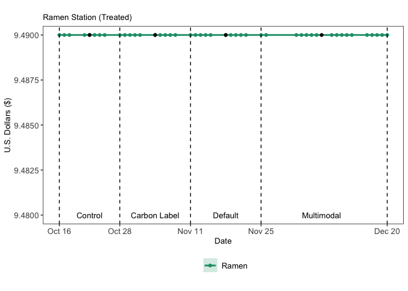<!-- -->

``` r
fall_data %>%
  filter(station=="Ramen"|station=="Grill") %>%
  filter(item_cat=="Main") %>%
  group_by(menu_condition) %>%
  summarise(total_carbon_cost=sum(corr_carbon_cost),total_sales=sum(count)) %>%
  mutate(mean_carbon_cost=total_carbon_cost/total_sales)
```

    ## # A tibble: 4 × 4
    ##   menu_condition total_carbon_cost total_sales mean_carbon_cost
    ##   <chr>                      <dbl>       <int>            <dbl>
    ## 1 Carbon Label               4033.        2105             1.92
    ## 2 Control                    3342.        1719             1.94
    ## 3 Default                    3933.        2140             1.84
    ## 4 Multimodal                 5006.        2637             1.90

``` r
fall_mean_carbon_treatment_aov_data <- fall_data %>%
  filter(station=="Ramen"|station=="Grill") %>%
  filter(item_cat=="Main") %>%
  group_by(date,menu_condition) %>%
  summarise(total_carbon_cost=sum(corr_carbon_cost),total_sales=sum(count)) %>%
  mutate(mean_carbon_cost=total_carbon_cost/total_sales) %>%
  mutate(date=case_when(date=="16-Oct"~"2024-10-16",
                        date=="17-Oct"~"2024-10-17",
                        date=="18-Oct"~"2024-10-18",
                        date=="21-Oct"~"2024-10-21",
                        date=="22-Oct"~"2024-10-22",
                        date=="23-Oct"~"2024-10-23",
                        date=="24-Oct"~"2024-10-24",
                        date=="25-Oct"~"2024-10-25",
                        date=="28-Oct"~"2024-10-28",
                        date=="29-Oct"~"2024-10-29",
                        date=="30-Oct"~"2024-10-30",
                        date=="31-Oct"~"2024-10-31",
                        date=="1-Nov"~"2024-11-1",
                        date=="4-Nov"~"2024-11-4",
                        date=="5-Nov"~"2024-11-5",
                        date=="6-Nov"~"2024-11-6",
                        date=="7-Nov"~"2024-11-7",
                        date=="8-Nov"~"2024-11-8",
                        date=="11-Nov"~"2024-11-11",
                        date=="12-Nov"~"2024-11-12",
                        date=="13-Nov"~"2024-11-13",
                        date=="14-Nov"~"2024-11-14",
                        date=="15-Nov"~"2024-11-15",
                        date=="18-Nov"~"2024-11-18",
                        date=="19-Nov"~"2024-11-19",
                        date=="20-Nov"~"2024-11-20",
                        date=="21-Nov"~"2024-11-21",
                        date=="22-Nov"~"2024-11-22",
                        date=="25-Nov"~"2024-11-25",
                        date=="26-Nov"~"2024-11-26",
                        date=="2-Dec"~"2024-12-2",
                        date=="3-Dec"~"2024-12-3",
                        date=="4-Dec"~"2024-12-4",
                        date=="5-Dec"~"2024-12-5",
                        date=="6-Dec"~"2024-12-6",
                        date=="9-Dec"~"2024-12-9",
                        date=="10-Dec"~"2024-12-10",
                        date=="11-Dec"~"2024-12-11",
                        date=="12-Dec"~"2024-12-12",
                        date=="13-Dec"~"2024-12-13",
                        date=="16-Dec"~"2024-12-16",
                        date=="17-Dec"~"2024-12-17",
                        date=="18-Dec"~"2024-12-18",
                        date=="19-Dec"~"2024-12-19",
                        date=="20-Dec"~"2024-12-20")) %>%
  mutate(date=as.Date(date)) %>%
  mutate(station="Treatment") %>%
  ungroup() %>%
  select(menu_condition,mean_carbon_cost) %>%
  arrange(menu_condition) 
```

    ## `summarise()` has grouped output by 'date'. You can override using the
    ## `.groups` argument.

``` r
shapiro.test(fall_mean_carbon_treatment_aov_data$mean_carbon_cost) 
```

    ## 
    ##  Shapiro-Wilk normality test
    ## 
    ## data:  fall_mean_carbon_treatment_aov_data$mean_carbon_cost
    ## W = 0.96298, p-value = 0.1585

``` r
oneway.test(mean_carbon_cost~menu_condition,data=fall_mean_carbon_treatment_aov_data,var.equal=TRUE)
```

    ## 
    ##  One-way analysis of means
    ## 
    ## data:  mean_carbon_cost and menu_condition
    ## F = 1.7301, num df = 3, denom df = 41, p-value = 0.1758

``` r
fall_mean_carbon_treatment <- fall_data %>%
  filter(station=="Ramen"|station=="Grill") %>%
  filter(item_cat=="Main") %>%
  group_by(date,menu_condition) %>%
  summarise(total_carbon_cost=sum(corr_carbon_cost),total_sales=sum(count)) %>%
  mutate(mean_carbon_cost=total_carbon_cost/total_sales) %>%
  mutate(date=case_when(date=="16-Oct"~"2024-10-16",
                        date=="17-Oct"~"2024-10-17",
                        date=="18-Oct"~"2024-10-18",
                        date=="21-Oct"~"2024-10-21",
                        date=="22-Oct"~"2024-10-22",
                        date=="23-Oct"~"2024-10-23",
                        date=="24-Oct"~"2024-10-24",
                        date=="25-Oct"~"2024-10-25",
                        date=="28-Oct"~"2024-10-28",
                        date=="29-Oct"~"2024-10-29",
                        date=="30-Oct"~"2024-10-30",
                        date=="31-Oct"~"2024-10-31",
                        date=="1-Nov"~"2024-11-1",
                        date=="4-Nov"~"2024-11-4",
                        date=="5-Nov"~"2024-11-5",
                        date=="6-Nov"~"2024-11-6",
                        date=="7-Nov"~"2024-11-7",
                        date=="8-Nov"~"2024-11-8",
                        date=="11-Nov"~"2024-11-11",
                        date=="12-Nov"~"2024-11-12",
                        date=="13-Nov"~"2024-11-13",
                        date=="14-Nov"~"2024-11-14",
                        date=="15-Nov"~"2024-11-15",
                        date=="18-Nov"~"2024-11-18",
                        date=="19-Nov"~"2024-11-19",
                        date=="20-Nov"~"2024-11-20",
                        date=="21-Nov"~"2024-11-21",
                        date=="22-Nov"~"2024-11-22",
                        date=="25-Nov"~"2024-11-25",
                        date=="26-Nov"~"2024-11-26",
                        date=="2-Dec"~"2024-12-2",
                        date=="3-Dec"~"2024-12-3",
                        date=="4-Dec"~"2024-12-4",
                        date=="5-Dec"~"2024-12-5",
                        date=="6-Dec"~"2024-12-6",
                        date=="9-Dec"~"2024-12-9",
                        date=="10-Dec"~"2024-12-10",
                        date=="11-Dec"~"2024-12-11",
                        date=="12-Dec"~"2024-12-12",
                        date=="13-Dec"~"2024-12-13",
                        date=="16-Dec"~"2024-12-16",
                        date=="17-Dec"~"2024-12-17",
                        date=="18-Dec"~"2024-12-18",
                        date=="19-Dec"~"2024-12-19",
                        date=="20-Dec"~"2024-12-20")) %>%
  mutate(date=as.Date(date)) %>%
  mutate(station="Treatment") %>%
  ggplot(aes(x=date,y=mean_carbon_cost,color=station,fill=station)) + 
  geom_smooth(alpha=0.2) + 
  geom_point() +
  geom_vline(xintercept=as.numeric(daily_prop_low_fall_data$date[fall_vline]),linetype=2) +
  xlab("Date") + 
  ylab(bquote('Kilograms of CO'[2]*'e')) +
  scale_color_brewer(palette="Dark2",name="") +
  scale_fill_brewer(palette="Dark2",name="") +
  scale_x_date(breaks=as.Date(c("2024-10-16","2024-10-28","2024-11-11","2024-11-25","2024-12-20")),labels=c("Oct 16","Oct 28","Nov 11","Nov 25","Dec 20")) +
  labs(title="Ramen & Grill Stations (Treated)",caption="F(3,41)=1.7301, p=0.1758") +
  annotate("text",x=as.Date("2024-10-22"),y=1.923922,label="Control",size=10/.pt) +
  annotate("text",x=as.Date("2024-11-4"),y=1.895899,label="Carbon Label",size=10/.pt) +
  annotate("text",x=as.Date("2024-11-18"),y=1.818038,label="Default",size=10/.pt) +
  annotate("text",x=as.Date("2024-12-7"),y=1.878271,label="Multimodal",size=10/.pt) +
  annotate("point",x=as.Date("2024-10-22"),y=1.943922) +
  annotate("point",x=as.Date("2024-11-4"),y=1.915899) +
  annotate("point",x=as.Date("2024-11-18"),y=1.838038) +
  annotate("point",x=as.Date("2024-12-7"),y=1.898271) +
  theme(aspect.ratio=0.55,legend.position="bottom",panel.grid=element_blank(),panel.background=element_rect(fill="white"),panel.border=element_rect(fill=NA),legend.title=element_text(size=10),legend.text=element_text(size=10),plot.title=element_text(size=10),axis.title=element_text(size=10),axis.text=element_text(size=10)) 
```

    ## `summarise()` has grouped output by 'date'. You can override using the
    ## `.groups` argument.

``` r
fall_mean_carbon_treatment
```

    ## `geom_smooth()` using method = 'loess' and formula = 'y ~ x'

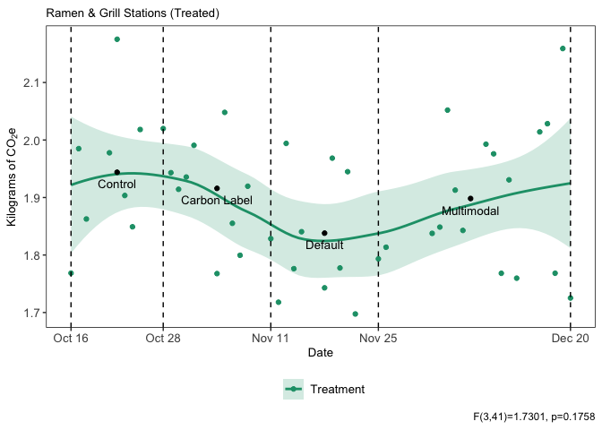<!-- -->

``` r
fall_data %>%
  filter(station=="Pasta") %>%
  filter(item_cat=="Main") %>%
  group_by(menu_condition) %>% 
  summarise(total_carbon_cost=sum(corr_carbon_cost),total_sales=sum(count)) %>%
  mutate(mean_carbon_cost=total_carbon_cost/total_sales)
```

    ## # A tibble: 4 × 4
    ##   menu_condition total_carbon_cost total_sales mean_carbon_cost
    ##   <chr>                      <dbl>       <int>            <dbl>
    ## 1 Carbon Label                760.        1408            0.540
    ## 2 Control                     624.        1158            0.539
    ## 3 Default                     722.        1341            0.539
    ## 4 Multimodal                  705.        1329            0.530

``` r
fall_mean_carbon_control_aov_data <- fall_data %>%
  filter(station=="Pasta") %>%
  filter(item_cat=="Main") %>%
  group_by(date,menu_condition,station) %>%
  summarise(total_carbon_cost=sum(corr_carbon_cost),total_sales=sum(count)) %>%
  mutate(mean_carbon_cost=total_carbon_cost/total_sales) %>%
  mutate(date=case_when(date=="16-Oct"~"2024-10-16",
                        date=="17-Oct"~"2024-10-17",
                        date=="18-Oct"~"2024-10-18",
                        date=="21-Oct"~"2024-10-21",
                        date=="22-Oct"~"2024-10-22",
                        date=="23-Oct"~"2024-10-23",
                        date=="24-Oct"~"2024-10-24",
                        date=="25-Oct"~"2024-10-25",
                        date=="28-Oct"~"2024-10-28",
                        date=="29-Oct"~"2024-10-29",
                        date=="30-Oct"~"2024-10-30",
                        date=="31-Oct"~"2024-10-31",
                        date=="1-Nov"~"2024-11-1",
                        date=="4-Nov"~"2024-11-4",
                        date=="5-Nov"~"2024-11-5",
                        date=="6-Nov"~"2024-11-6",
                        date=="7-Nov"~"2024-11-7",
                        date=="8-Nov"~"2024-11-8",
                        date=="11-Nov"~"2024-11-11",
                        date=="12-Nov"~"2024-11-12",
                        date=="13-Nov"~"2024-11-13",
                        date=="14-Nov"~"2024-11-14",
                        date=="15-Nov"~"2024-11-15",
                        date=="18-Nov"~"2024-11-18",
                        date=="19-Nov"~"2024-11-19",
                        date=="20-Nov"~"2024-11-20",
                        date=="21-Nov"~"2024-11-21",
                        date=="22-Nov"~"2024-11-22",
                        date=="25-Nov"~"2024-11-25",
                        date=="26-Nov"~"2024-11-26",
                        date=="2-Dec"~"2024-12-2",
                        date=="3-Dec"~"2024-12-3",
                        date=="4-Dec"~"2024-12-4",
                        date=="5-Dec"~"2024-12-5",
                        date=="6-Dec"~"2024-12-6",
                        date=="9-Dec"~"2024-12-9",
                        date=="10-Dec"~"2024-12-10",
                        date=="11-Dec"~"2024-12-11",
                        date=="12-Dec"~"2024-12-12",
                        date=="13-Dec"~"2024-12-13",
                        date=="16-Dec"~"2024-12-16",
                        date=="17-Dec"~"2024-12-17",
                        date=="18-Dec"~"2024-12-18",
                        date=="19-Dec"~"2024-12-19",
                        date=="20-Dec"~"2024-12-20")) %>%
  mutate(date=as.Date(date)) %>%
  ungroup() %>%
  select(menu_condition,mean_carbon_cost) %>%
  arrange(menu_condition)
```

    ## `summarise()` has grouped output by 'date', 'menu_condition'. You can override
    ## using the `.groups` argument.

``` r
shapiro.test(fall_mean_carbon_control_aov_data$mean_carbon_cost)
```

    ## 
    ##  Shapiro-Wilk normality test
    ## 
    ## data:  fall_mean_carbon_control_aov_data$mean_carbon_cost
    ## W = 0.98336, p-value = 0.7563

``` r
oneway.test(mean_carbon_cost~menu_condition,data=fall_mean_carbon_control_aov_data,var.equal=TRUE)
```

    ## 
    ##  One-way analysis of means
    ## 
    ## data:  mean_carbon_cost and menu_condition
    ## F = 1.706, num df = 3, denom df = 41, p-value = 0.1808

``` r
fall_mean_carbon_control <- fall_data %>%
  filter(station=="Pasta") %>%
  filter(item_cat=="Main") %>%
  group_by(date,menu_condition,station) %>%
  summarise(total_carbon_cost=sum(corr_carbon_cost),total_sales=sum(count)) %>%
  mutate(mean_carbon_cost=total_carbon_cost/total_sales) %>%
  mutate(date=case_when(date=="16-Oct"~"2024-10-16",
                        date=="17-Oct"~"2024-10-17",
                        date=="18-Oct"~"2024-10-18",
                        date=="21-Oct"~"2024-10-21",
                        date=="22-Oct"~"2024-10-22",
                        date=="23-Oct"~"2024-10-23",
                        date=="24-Oct"~"2024-10-24",
                        date=="25-Oct"~"2024-10-25",
                        date=="28-Oct"~"2024-10-28",
                        date=="29-Oct"~"2024-10-29",
                        date=="30-Oct"~"2024-10-30",
                        date=="31-Oct"~"2024-10-31",
                        date=="1-Nov"~"2024-11-1",
                        date=="4-Nov"~"2024-11-4",
                        date=="5-Nov"~"2024-11-5",
                        date=="6-Nov"~"2024-11-6",
                        date=="7-Nov"~"2024-11-7",
                        date=="8-Nov"~"2024-11-8",
                        date=="11-Nov"~"2024-11-11",
                        date=="12-Nov"~"2024-11-12",
                        date=="13-Nov"~"2024-11-13",
                        date=="14-Nov"~"2024-11-14",
                        date=="15-Nov"~"2024-11-15",
                        date=="18-Nov"~"2024-11-18",
                        date=="19-Nov"~"2024-11-19",
                        date=="20-Nov"~"2024-11-20",
                        date=="21-Nov"~"2024-11-21",
                        date=="22-Nov"~"2024-11-22",
                        date=="25-Nov"~"2024-11-25",
                        date=="26-Nov"~"2024-11-26",
                        date=="2-Dec"~"2024-12-2",
                        date=="3-Dec"~"2024-12-3",
                        date=="4-Dec"~"2024-12-4",
                        date=="5-Dec"~"2024-12-5",
                        date=="6-Dec"~"2024-12-6",
                        date=="9-Dec"~"2024-12-9",
                        date=="10-Dec"~"2024-12-10",
                        date=="11-Dec"~"2024-12-11",
                        date=="12-Dec"~"2024-12-12",
                        date=="13-Dec"~"2024-12-13",
                        date=="16-Dec"~"2024-12-16",
                        date=="17-Dec"~"2024-12-17",
                        date=="18-Dec"~"2024-12-18",
                        date=="19-Dec"~"2024-12-19",
                        date=="20-Dec"~"2024-12-20")) %>%
  mutate(date=as.Date(date)) %>%
  ggplot(aes(x=date,y=mean_carbon_cost,color=station,fill=station)) + 
  geom_smooth(alpha=0.2) + 
  geom_point() +
  geom_vline(xintercept=as.numeric(daily_prop_low_fall_data$date[fall_vline]),linetype=2) +
  xlab("Date") + 
  ylab(bquote('Kilograms of CO'[2]*'e')) +
  scale_color_brewer(palette="Set1",name="") +
  scale_fill_brewer(palette="Set1",name="") +
  scale_x_date(breaks=as.Date(c("2024-10-16","2024-10-28","2024-11-11","2024-11-25","2024-12-20")),labels=c("Oct 16","Oct 28","Nov 11","Nov 25","Dec 20")) +
  labs(title="Pasta Station (Untreated)",caption="F(3,41)=1.706, p=0.1808") +
  annotate("text",x=as.Date("2024-10-22"),y=0.5328448,label="Control",size=10/.pt) +
  annotate("text",x=as.Date("2024-11-4"),y=0.5337717,label="Carbon Label",size=10/.pt) +
  annotate("text",x=as.Date("2024-11-18"),y=0.5327407,label="Default",size=10/.pt) +
  annotate("text",x=as.Date("2024-12-7"),y=0.5242881,label="Multimodal",size=10/.pt) +
  annotate("point",x=as.Date("2024-10-22"),y=0.5388448) +
  annotate("point",x=as.Date("2024-11-4"),y=0.5397717) +
  annotate("point",x=as.Date("2024-11-18"),y=0.5387407) +
  annotate("point",x=as.Date("2024-12-7"),y=0.5302881) +
  theme(aspect.ratio=0.55,legend.position="bottom",panel.grid=element_blank(),panel.background=element_rect(fill="white"),panel.border=element_rect(fill=NA),legend.title=element_text(size=10),legend.text=element_text(size=10),plot.title=element_text(size=10),axis.title=element_text(size=10),axis.text=element_text(size=10)) 
```

    ## `summarise()` has grouped output by 'date', 'menu_condition'. You can override
    ## using the `.groups` argument.

``` r
fall_mean_carbon_control
```

    ## `geom_smooth()` using method = 'loess' and formula = 'y ~ x'

<!-- -->

``` r
fall_mean_carbon <- ggarrange(fall_mean_carbon_ramen,fall_mean_carbon_grill,fall_mean_carbon_treatment,fall_mean_carbon_control,
          labels=c("A","B","C","D"),
          legend="none")
```

    ## `geom_smooth()` using method = 'loess' and formula = 'y ~ x'
    ## `geom_smooth()` using method = 'loess' and formula = 'y ~ x'
    ## `geom_smooth()` using method = 'loess' and formula = 'y ~ x'
    ## `geom_smooth()` using method = 'loess' and formula = 'y ~ x'

``` r
fall_mean_carbon <- annotate_figure(fall_mean_carbon,top=text_grob("Mean Emissions Cost of Station Sales (kg CO2e)",color="black",face="bold",size=12))
ggsave(filename="fall_mean_carbon.png",plot=fall_mean_carbon,path="/Users/kenjinchang/github/multimodal-framework-validation/figures",width=40,height=24,units="cm",dpi=150,limitsize=TRUE)
fall_mean_carbon
```

<!-- -->

mean_spend

``` r
fall_data %>% 
  filter(station=="Grill") %>%
  filter(item_cat=="Main") %>%
  group_by(menu_condition) %>%
  summarise(total_dollar_cost=sum(corr_dollar_cost),total_sales=sum(count)) %>%
  mutate(mean_dollar_cost=total_dollar_cost/total_sales)
```

    ## # A tibble: 4 × 4
    ##   menu_condition total_dollar_cost total_sales mean_dollar_cost
    ##   <chr>                      <dbl>       <int>            <dbl>
    ## 1 Carbon Label              11554.        1285             8.99
    ## 2 Control                    9409.        1048             8.98
    ## 3 Default                   11421.        1270             8.99
    ## 4 Multimodal                14342.        1595             8.99

``` r
fall_mean_spend_grill_aov_data <- fall_data %>%
  filter(station=="Grill") %>%
  filter(item_cat=="Main") %>%
  group_by(date,menu_condition,station) %>%
  summarise(total_dollar_cost=sum(corr_dollar_cost),total_sales=sum(count)) %>%
  mutate(mean_dollar_cost=total_dollar_cost/total_sales) %>%
  mutate(date=case_when(date=="16-Oct"~"2024-10-16",
                        date=="17-Oct"~"2024-10-17",
                        date=="18-Oct"~"2024-10-18",
                        date=="21-Oct"~"2024-10-21",
                        date=="22-Oct"~"2024-10-22",
                        date=="23-Oct"~"2024-10-23",
                        date=="24-Oct"~"2024-10-24",
                        date=="25-Oct"~"2024-10-25",
                        date=="28-Oct"~"2024-10-28",
                        date=="29-Oct"~"2024-10-29",
                        date=="30-Oct"~"2024-10-30",
                        date=="31-Oct"~"2024-10-31",
                        date=="1-Nov"~"2024-11-1",
                        date=="4-Nov"~"2024-11-4",
                        date=="5-Nov"~"2024-11-5",
                        date=="6-Nov"~"2024-11-6",
                        date=="7-Nov"~"2024-11-7",
                        date=="8-Nov"~"2024-11-8",
                        date=="11-Nov"~"2024-11-11",
                        date=="12-Nov"~"2024-11-12",
                        date=="13-Nov"~"2024-11-13",
                        date=="14-Nov"~"2024-11-14",
                        date=="15-Nov"~"2024-11-15",
                        date=="18-Nov"~"2024-11-18",
                        date=="19-Nov"~"2024-11-19",
                        date=="20-Nov"~"2024-11-20",
                        date=="21-Nov"~"2024-11-21",
                        date=="22-Nov"~"2024-11-22",
                        date=="25-Nov"~"2024-11-25",
                        date=="26-Nov"~"2024-11-26",
                        date=="2-Dec"~"2024-12-2",
                        date=="3-Dec"~"2024-12-3",
                        date=="4-Dec"~"2024-12-4",
                        date=="5-Dec"~"2024-12-5",
                        date=="6-Dec"~"2024-12-6",
                        date=="9-Dec"~"2024-12-9",
                        date=="10-Dec"~"2024-12-10",
                        date=="11-Dec"~"2024-12-11",
                        date=="12-Dec"~"2024-12-12",
                        date=="13-Dec"~"2024-12-13",
                        date=="16-Dec"~"2024-12-16",
                        date=="17-Dec"~"2024-12-17",
                        date=="18-Dec"~"2024-12-18",
                        date=="19-Dec"~"2024-12-19",
                        date=="20-Dec"~"2024-12-20")) %>%
  mutate(date=as.Date(date)) %>%
  ungroup() %>%
  select(menu_condition,mean_dollar_cost) %>%
  arrange(menu_condition)
```

    ## `summarise()` has grouped output by 'date', 'menu_condition'. You can override
    ## using the `.groups` argument.

``` r
shapiro.test(fall_mean_spend_grill_aov_data$mean_dollar_cost) 
```

    ## 
    ##  Shapiro-Wilk normality test
    ## 
    ## data:  fall_mean_spend_grill_aov_data$mean_dollar_cost
    ## W = 0.98088, p-value = 0.6553

``` r
oneway.test(mean_dollar_cost~menu_condition,data=fall_mean_spend_grill_aov_data,var.equal=TRUE)
```

    ## 
    ##  One-way analysis of means
    ## 
    ## data:  mean_dollar_cost and menu_condition
    ## F = 0.35315, num df = 3, denom df = 41, p-value = 0.7871

``` r
fall_mean_spend_grill <- fall_data %>%
  filter(station=="Grill") %>%
  filter(item_cat=="Main") %>%
  group_by(date,menu_condition,station) %>%
  summarise(total_dollar_cost=sum(corr_dollar_cost),total_sales=sum(count)) %>%
  mutate(mean_dollar_cost=total_dollar_cost/total_sales) %>%
  mutate(date=case_when(date=="16-Oct"~"2024-10-16",
                        date=="17-Oct"~"2024-10-17",
                        date=="18-Oct"~"2024-10-18",
                        date=="21-Oct"~"2024-10-21",
                        date=="22-Oct"~"2024-10-22",
                        date=="23-Oct"~"2024-10-23",
                        date=="24-Oct"~"2024-10-24",
                        date=="25-Oct"~"2024-10-25",
                        date=="28-Oct"~"2024-10-28",
                        date=="29-Oct"~"2024-10-29",
                        date=="30-Oct"~"2024-10-30",
                        date=="31-Oct"~"2024-10-31",
                        date=="1-Nov"~"2024-11-1",
                        date=="4-Nov"~"2024-11-4",
                        date=="5-Nov"~"2024-11-5",
                        date=="6-Nov"~"2024-11-6",
                        date=="7-Nov"~"2024-11-7",
                        date=="8-Nov"~"2024-11-8",
                        date=="11-Nov"~"2024-11-11",
                        date=="12-Nov"~"2024-11-12",
                        date=="13-Nov"~"2024-11-13",
                        date=="14-Nov"~"2024-11-14",
                        date=="15-Nov"~"2024-11-15",
                        date=="18-Nov"~"2024-11-18",
                        date=="19-Nov"~"2024-11-19",
                        date=="20-Nov"~"2024-11-20",
                        date=="21-Nov"~"2024-11-21",
                        date=="22-Nov"~"2024-11-22",
                        date=="25-Nov"~"2024-11-25",
                        date=="26-Nov"~"2024-11-26",
                        date=="2-Dec"~"2024-12-2",
                        date=="3-Dec"~"2024-12-3",
                        date=="4-Dec"~"2024-12-4",
                        date=="5-Dec"~"2024-12-5",
                        date=="6-Dec"~"2024-12-6",
                        date=="9-Dec"~"2024-12-9",
                        date=="10-Dec"~"2024-12-10",
                        date=="11-Dec"~"2024-12-11",
                        date=="12-Dec"~"2024-12-12",
                        date=="13-Dec"~"2024-12-13",
                        date=="16-Dec"~"2024-12-16",
                        date=="17-Dec"~"2024-12-17",
                        date=="18-Dec"~"2024-12-18",
                        date=="19-Dec"~"2024-12-19",
                        date=="20-Dec"~"2024-12-20")) %>%
  mutate(date=as.Date(date)) %>%
  ggplot(aes(x=date,y=mean_dollar_cost,color=station,fill=station)) + 
  geom_smooth(alpha=0.2) + 
  geom_point() +
  geom_vline(xintercept=as.numeric(daily_prop_low_fall_data$date[fall_vline]),linetype=2) +
  xlab("Date") + 
  ylab("U.S. Dollars ($)") +
  scale_color_brewer(palette="Dark2",name="") +
  scale_fill_brewer(palette="Dark2",name="") +
  scale_x_date(breaks=as.Date(c("2024-10-16","2024-10-28","2024-11-11","2024-11-25","2024-12-20")),labels=c("Oct 16","Oct 28","Nov 11","Nov 25","Dec 20")) +
  labs(title="Grill Station (Treated)",caption="F(3,41)=0.35315,p=0.7871") +
  annotate("text",x=as.Date("2024-10-22"),y=8.978359-0.01,label="Control",size=10/.pt) +
  annotate("text",x=as.Date("2024-11-4"),y=8.991089-0.01,label="Carbon Label",size=10/.pt) +
  annotate("text",x=as.Date("2024-11-18"),y=8.992835-0.01,label="Default",size=10/.pt) +
  annotate("text",x=as.Date("2024-12-7"),y=8.992006-0.01,label="Multimodal",size=10/.pt) +
  annotate("point",x=as.Date("2024-10-22"),y=8.978359) +
  annotate("point",x=as.Date("2024-11-4"),y=8.991089) +
  annotate("point",x=as.Date("2024-11-18"),y=8.992835) +
  annotate("point",x=as.Date("2024-12-7"),y=8.992006) +
  theme(aspect.ratio=0.55,legend.position="bottom",panel.grid=element_blank(),panel.background=element_rect(fill="white"),panel.border=element_rect(fill=NA),legend.title=element_text(size=10),legend.text=element_text(size=10),plot.title=element_text(size=10),axis.title=element_text(size=10),axis.text=element_text(size=10)) 
```

    ## `summarise()` has grouped output by 'date', 'menu_condition'. You can override
    ## using the `.groups` argument.

``` r
fall_mean_spend_grill
```

    ## `geom_smooth()` using method = 'loess' and formula = 'y ~ x'

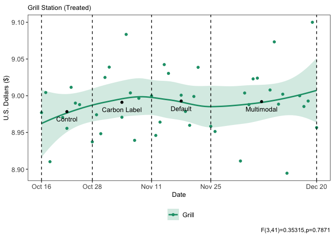<!-- -->

``` r
fall_data %>% 
  filter(station=="Ramen") %>%
  filter(item_cat=="Main") %>%
  group_by(menu_condition) %>%
  summarise(total_dollar_cost=sum(corr_dollar_cost),total_sales=sum(count)) %>%
  mutate(mean_dollar_cost=total_dollar_cost/total_sales)
```

    ## # A tibble: 4 × 4
    ##   menu_condition total_dollar_cost total_sales mean_dollar_cost
    ##   <chr>                      <dbl>       <int>            <dbl>
    ## 1 Carbon Label               7782.         820             9.49
    ## 2 Control                    6368.         671             9.49
    ## 3 Default                    8256.         870             9.49
    ## 4 Multimodal                 9889.        1042             9.49

``` r
fall_mean_spend_ramen_aov_data <- fall_data %>%
  filter(station=="Ramen") %>%
  filter(item_cat=="Main") %>%
  group_by(date,menu_condition,station) %>%
  summarise(total_dollar_cost=sum(corr_dollar_cost),total_sales=sum(count)) %>%
  mutate(mean_dollar_cost=total_dollar_cost/total_sales) %>%
  mutate(date=case_when(date=="16-Oct"~"2024-10-16",
                        date=="17-Oct"~"2024-10-17",
                        date=="18-Oct"~"2024-10-18",
                        date=="21-Oct"~"2024-10-21",
                        date=="22-Oct"~"2024-10-22",
                        date=="23-Oct"~"2024-10-23",
                        date=="24-Oct"~"2024-10-24",
                        date=="25-Oct"~"2024-10-25",
                        date=="28-Oct"~"2024-10-28",
                        date=="29-Oct"~"2024-10-29",
                        date=="30-Oct"~"2024-10-30",
                        date=="31-Oct"~"2024-10-31",
                        date=="1-Nov"~"2024-11-1",
                        date=="4-Nov"~"2024-11-4",
                        date=="5-Nov"~"2024-11-5",
                        date=="6-Nov"~"2024-11-6",
                        date=="7-Nov"~"2024-11-7",
                        date=="8-Nov"~"2024-11-8",
                        date=="11-Nov"~"2024-11-11",
                        date=="12-Nov"~"2024-11-12",
                        date=="13-Nov"~"2024-11-13",
                        date=="14-Nov"~"2024-11-14",
                        date=="15-Nov"~"2024-11-15",
                        date=="18-Nov"~"2024-11-18",
                        date=="19-Nov"~"2024-11-19",
                        date=="20-Nov"~"2024-11-20",
                        date=="21-Nov"~"2024-11-21",
                        date=="22-Nov"~"2024-11-22",
                        date=="25-Nov"~"2024-11-25",
                        date=="26-Nov"~"2024-11-26",
                        date=="2-Dec"~"2024-12-2",
                        date=="3-Dec"~"2024-12-3",
                        date=="4-Dec"~"2024-12-4",
                        date=="5-Dec"~"2024-12-5",
                        date=="6-Dec"~"2024-12-6",
                        date=="9-Dec"~"2024-12-9",
                        date=="10-Dec"~"2024-12-10",
                        date=="11-Dec"~"2024-12-11",
                        date=="12-Dec"~"2024-12-12",
                        date=="13-Dec"~"2024-12-13",
                        date=="16-Dec"~"2024-12-16",
                        date=="17-Dec"~"2024-12-17",
                        date=="18-Dec"~"2024-12-18",
                        date=="19-Dec"~"2024-12-19",
                        date=="20-Dec"~"2024-12-20")) %>%
  mutate(date=as.Date(date)) %>%
  ungroup() %>%
  select(menu_condition,mean_dollar_cost) %>%
  arrange(menu_condition)
```

    ## `summarise()` has grouped output by 'date', 'menu_condition'. You can override
    ## using the `.groups` argument.

``` r
shapiro.test(fall_mean_spend_ramen_aov_data$mean_dollar_cost) 
```

    ## 
    ##  Shapiro-Wilk normality test
    ## 
    ## data:  fall_mean_spend_ramen_aov_data$mean_dollar_cost
    ## W = 0.002492, p-value = 7.262e-16

``` r
oneway.test(mean_dollar_cost~menu_condition,data=fall_mean_spend_ramen_aov_data,var.equal=TRUE)
```

    ## 
    ##  One-way analysis of means
    ## 
    ## data:  mean_dollar_cost and menu_condition
    ## F = 0, num df = 3, denom df = 41, p-value = 1

``` r
fall_mean_spend_ramen <- fall_data %>%
  filter(station=="Ramen") %>%
  filter(item_cat=="Main") %>%
  group_by(date,menu_condition,station) %>%
  summarise(total_dollar_cost=sum(corr_dollar_cost),total_sales=sum(count)) %>%
  mutate(mean_dollar_cost=total_dollar_cost/total_sales) %>%
  mutate(date=case_when(date=="16-Oct"~"2024-10-16",
                        date=="17-Oct"~"2024-10-17",
                        date=="18-Oct"~"2024-10-18",
                        date=="21-Oct"~"2024-10-21",
                        date=="22-Oct"~"2024-10-22",
                        date=="23-Oct"~"2024-10-23",
                        date=="24-Oct"~"2024-10-24",
                        date=="25-Oct"~"2024-10-25",
                        date=="28-Oct"~"2024-10-28",
                        date=="29-Oct"~"2024-10-29",
                        date=="30-Oct"~"2024-10-30",
                        date=="31-Oct"~"2024-10-31",
                        date=="1-Nov"~"2024-11-1",
                        date=="4-Nov"~"2024-11-4",
                        date=="5-Nov"~"2024-11-5",
                        date=="6-Nov"~"2024-11-6",
                        date=="7-Nov"~"2024-11-7",
                        date=="8-Nov"~"2024-11-8",
                        date=="11-Nov"~"2024-11-11",
                        date=="12-Nov"~"2024-11-12",
                        date=="13-Nov"~"2024-11-13",
                        date=="14-Nov"~"2024-11-14",
                        date=="15-Nov"~"2024-11-15",
                        date=="18-Nov"~"2024-11-18",
                        date=="19-Nov"~"2024-11-19",
                        date=="20-Nov"~"2024-11-20",
                        date=="21-Nov"~"2024-11-21",
                        date=="22-Nov"~"2024-11-22",
                        date=="25-Nov"~"2024-11-25",
                        date=="26-Nov"~"2024-11-26",
                        date=="2-Dec"~"2024-12-2",
                        date=="3-Dec"~"2024-12-3",
                        date=="4-Dec"~"2024-12-4",
                        date=="5-Dec"~"2024-12-5",
                        date=="6-Dec"~"2024-12-6",
                        date=="9-Dec"~"2024-12-9",
                        date=="10-Dec"~"2024-12-10",
                        date=="11-Dec"~"2024-12-11",
                        date=="12-Dec"~"2024-12-12",
                        date=="13-Dec"~"2024-12-13",
                        date=="16-Dec"~"2024-12-16",
                        date=="17-Dec"~"2024-12-17",
                        date=="18-Dec"~"2024-12-18",
                        date=="19-Dec"~"2024-12-19",
                        date=="20-Dec"~"2024-12-20")) %>%
  mutate(date=as.Date(date)) %>%
  ggplot(aes(x=date,y=mean_dollar_cost,color=station,fill=station)) + 
  geom_smooth(alpha=0.2) + 
  geom_point() +
  geom_vline(xintercept=as.numeric(daily_prop_low_fall_data$date[fall_vline]),linetype=2) +
  xlab("Date") + 
  ylab("U.S. Dollars ($)") +
  scale_color_brewer(palette="Dark2",name="") +
  scale_fill_brewer(palette="Dark2",name="") +
  scale_x_date(breaks=as.Date(c("2024-10-16","2024-10-28","2024-11-11","2024-11-25","2024-12-20")),labels=c("Oct 16","Oct 28","Nov 11","Nov 25","Dec 20")) +
  labs(title="Ramen Station (Treated)",caption="F(3,41)=0, p=1") +
  annotate("text",x=as.Date("2024-10-22"),y=9.49-0.01,label="Control",size=10/.pt) +
  annotate("text",x=as.Date("2024-11-4"),y=9.49-0.01,label="Carbon Label",size=10/.pt) +
  annotate("text",x=as.Date("2024-11-18"),y=9.49-0.01,label="Default",size=10/.pt) +
  annotate("text",x=as.Date("2024-12-7"),y=9.49-0.01,label="Multimodal",size=10/.pt) +
  annotate("point",x=as.Date("2024-10-22"),y=9.49) +
  annotate("point",x=as.Date("2024-11-4"),y=9.49) +
  annotate("point",x=as.Date("2024-11-18"),y=9.49) +
  annotate("point",x=as.Date("2024-12-7"),y=9.49) +
  theme(aspect.ratio=0.55,legend.position="bottom",panel.grid=element_blank(),panel.background=element_rect(fill="white"),panel.border=element_rect(fill=NA),legend.title=element_text(size=10),legend.text=element_text(size=10),plot.title=element_text(size=10),axis.title=element_text(size=10),axis.text=element_text(size=10)) 
```

    ## `summarise()` has grouped output by 'date', 'menu_condition'. You can override
    ## using the `.groups` argument.

``` r
fall_mean_spend_ramen
```

    ## `geom_smooth()` using method = 'loess' and formula = 'y ~ x'

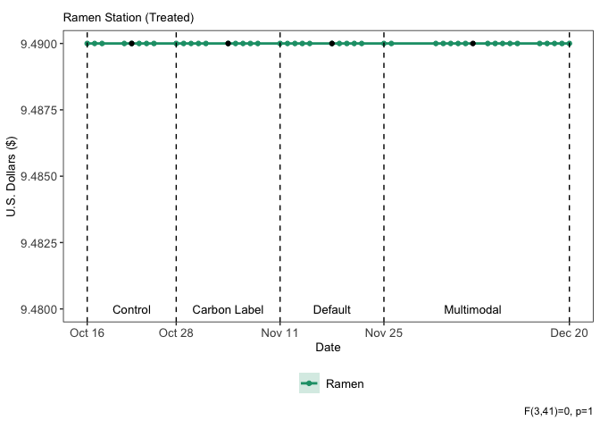<!-- -->

``` r
fall_data %>%
  filter(station=="Ramen"|station=="Grill") %>%
  filter(item_cat=="Main") %>%
  group_by(menu_condition) %>%
  summarise(total_dollar_cost=sum(corr_dollar_cost),total_sales=sum(count)) %>%
  mutate(mean_dollar_cost=total_dollar_cost/total_sales)
```

    ## # A tibble: 4 × 4
    ##   menu_condition total_dollar_cost total_sales mean_dollar_cost
    ##   <chr>                      <dbl>       <int>            <dbl>
    ## 1 Carbon Label              19335.        2105             9.19
    ## 2 Control                   15777.        1719             9.18
    ## 3 Default                   19677.        2140             9.19
    ## 4 Multimodal                24231.        2637             9.19

``` r
fall_mean_spend_treatment_aov_data <- fall_data %>%
  filter(station=="Ramen"|station=="Grill") %>%
  filter(item_cat=="Main") %>%
  group_by(date,menu_condition) %>%
  summarise(total_dollar_cost=sum(corr_dollar_cost),total_sales=sum(count)) %>%
  mutate(mean_dollar_cost=total_dollar_cost/total_sales) %>%
  mutate(date=case_when(date=="16-Oct"~"2024-10-16",
                        date=="17-Oct"~"2024-10-17",
                        date=="18-Oct"~"2024-10-18",
                        date=="21-Oct"~"2024-10-21",
                        date=="22-Oct"~"2024-10-22",
                        date=="23-Oct"~"2024-10-23",
                        date=="24-Oct"~"2024-10-24",
                        date=="25-Oct"~"2024-10-25",
                        date=="28-Oct"~"2024-10-28",
                        date=="29-Oct"~"2024-10-29",
                        date=="30-Oct"~"2024-10-30",
                        date=="31-Oct"~"2024-10-31",
                        date=="1-Nov"~"2024-11-1",
                        date=="4-Nov"~"2024-11-4",
                        date=="5-Nov"~"2024-11-5",
                        date=="6-Nov"~"2024-11-6",
                        date=="7-Nov"~"2024-11-7",
                        date=="8-Nov"~"2024-11-8",
                        date=="11-Nov"~"2024-11-11",
                        date=="12-Nov"~"2024-11-12",
                        date=="13-Nov"~"2024-11-13",
                        date=="14-Nov"~"2024-11-14",
                        date=="15-Nov"~"2024-11-15",
                        date=="18-Nov"~"2024-11-18",
                        date=="19-Nov"~"2024-11-19",
                        date=="20-Nov"~"2024-11-20",
                        date=="21-Nov"~"2024-11-21",
                        date=="22-Nov"~"2024-11-22",
                        date=="25-Nov"~"2024-11-25",
                        date=="26-Nov"~"2024-11-26",
                        date=="2-Dec"~"2024-12-2",
                        date=="3-Dec"~"2024-12-3",
                        date=="4-Dec"~"2024-12-4",
                        date=="5-Dec"~"2024-12-5",
                        date=="6-Dec"~"2024-12-6",
                        date=="9-Dec"~"2024-12-9",
                        date=="10-Dec"~"2024-12-10",
                        date=="11-Dec"~"2024-12-11",
                        date=="12-Dec"~"2024-12-12",
                        date=="13-Dec"~"2024-12-13",
                        date=="16-Dec"~"2024-12-16",
                        date=="17-Dec"~"2024-12-17",
                        date=="18-Dec"~"2024-12-18",
                        date=="19-Dec"~"2024-12-19",
                        date=="20-Dec"~"2024-12-20")) %>%
  mutate(date=as.Date(date)) %>%
  mutate(station="Treatment") %>%
  ungroup() %>%
  select(menu_condition,mean_dollar_cost) %>%
  arrange(menu_condition) 
```

    ## `summarise()` has grouped output by 'date'. You can override using the
    ## `.groups` argument.

``` r
shapiro.test(fall_mean_spend_treatment_aov_data$mean_dollar_cost) 
```

    ## 
    ##  Shapiro-Wilk normality test
    ## 
    ## data:  fall_mean_spend_treatment_aov_data$mean_dollar_cost
    ## W = 0.98288, p-value = 0.7369

``` r
oneway.test(mean_dollar_cost~menu_condition,data=fall_mean_spend_treatment_aov_data,var.equal=TRUE)
```

    ## 
    ##  One-way analysis of means
    ## 
    ## data:  mean_dollar_cost and menu_condition
    ## F = 1.0792, num df = 3, denom df = 41, p-value = 0.3686

``` r
fall_mean_spend_treatment <- fall_data %>%
  filter(station=="Ramen"|station=="Grill") %>%
  filter(item_cat=="Main") %>%
  group_by(date,menu_condition) %>%
  summarise(total_dollar_cost=sum(corr_dollar_cost),total_sales=sum(count)) %>%
  mutate(mean_dollar_cost=total_dollar_cost/total_sales) %>%
  mutate(date=case_when(date=="16-Oct"~"2024-10-16",
                        date=="17-Oct"~"2024-10-17",
                        date=="18-Oct"~"2024-10-18",
                        date=="21-Oct"~"2024-10-21",
                        date=="22-Oct"~"2024-10-22",
                        date=="23-Oct"~"2024-10-23",
                        date=="24-Oct"~"2024-10-24",
                        date=="25-Oct"~"2024-10-25",
                        date=="28-Oct"~"2024-10-28",
                        date=="29-Oct"~"2024-10-29",
                        date=="30-Oct"~"2024-10-30",
                        date=="31-Oct"~"2024-10-31",
                        date=="1-Nov"~"2024-11-1",
                        date=="4-Nov"~"2024-11-4",
                        date=="5-Nov"~"2024-11-5",
                        date=="6-Nov"~"2024-11-6",
                        date=="7-Nov"~"2024-11-7",
                        date=="8-Nov"~"2024-11-8",
                        date=="11-Nov"~"2024-11-11",
                        date=="12-Nov"~"2024-11-12",
                        date=="13-Nov"~"2024-11-13",
                        date=="14-Nov"~"2024-11-14",
                        date=="15-Nov"~"2024-11-15",
                        date=="18-Nov"~"2024-11-18",
                        date=="19-Nov"~"2024-11-19",
                        date=="20-Nov"~"2024-11-20",
                        date=="21-Nov"~"2024-11-21",
                        date=="22-Nov"~"2024-11-22",
                        date=="25-Nov"~"2024-11-25",
                        date=="26-Nov"~"2024-11-26",
                        date=="2-Dec"~"2024-12-2",
                        date=="3-Dec"~"2024-12-3",
                        date=="4-Dec"~"2024-12-4",
                        date=="5-Dec"~"2024-12-5",
                        date=="6-Dec"~"2024-12-6",
                        date=="9-Dec"~"2024-12-9",
                        date=="10-Dec"~"2024-12-10",
                        date=="11-Dec"~"2024-12-11",
                        date=="12-Dec"~"2024-12-12",
                        date=="13-Dec"~"2024-12-13",
                        date=="16-Dec"~"2024-12-16",
                        date=="17-Dec"~"2024-12-17",
                        date=="18-Dec"~"2024-12-18",
                        date=="19-Dec"~"2024-12-19",
                        date=="20-Dec"~"2024-12-20")) %>%
  mutate(date=as.Date(date)) %>%
  mutate(station="Treatment") %>%
  ggplot(aes(x=date,y=mean_dollar_cost,color=station,fill=station)) + 
  geom_smooth(alpha=0.2) + 
  geom_point() +
  geom_vline(xintercept=as.numeric(daily_prop_low_fall_data$date[fall_vline]),linetype=2) +
  xlab("Date") + 
  ylab("U.S. Dollars ($)") +
  scale_color_brewer(palette="Dark2",name="") +
  scale_fill_brewer(palette="Dark2",name="") +
  scale_x_date(breaks=as.Date(c("2024-10-16","2024-10-28","2024-11-11","2024-11-25","2024-12-20")),labels=c("Oct 16","Oct 28","Nov 11","Nov 25","Dec 20")) +
  labs(title="Ramen & Grill Stations (Treated)",caption="F(3,41)=1.0792, p=0.3686") +
  annotate("text",x=as.Date("2024-10-22"),y=9.178074-0.005,label="Control",size=10/.pt) +
  annotate("text",x=as.Date("2024-11-4"),y=9.185439-0.005,label="Carbon Label",size=10/.pt) +
  annotate("text",x=as.Date("2024-11-18"),y=9.194953-0.005,label="Default",size=10/.pt) +
  annotate("text",x=as.Date("2024-12-7"),y=9.188786-0.005,label="Multimodal",size=10/.pt) +
  annotate("point",x=as.Date("2024-10-22"),y=9.178074) +
  annotate("point",x=as.Date("2024-11-4"),y=9.185439) +
  annotate("point",x=as.Date("2024-11-18"),y=9.194953) +
  annotate("point",x=as.Date("2024-12-7"),y=9.188786) +
  theme(aspect.ratio=0.55,legend.position="bottom",panel.grid=element_blank(),panel.background=element_rect(fill="white"),panel.border=element_rect(fill=NA),legend.title=element_text(size=10),legend.text=element_text(size=10),plot.title=element_text(size=10),axis.title=element_text(size=10),axis.text=element_text(size=10)) 
```

    ## `summarise()` has grouped output by 'date'. You can override using the
    ## `.groups` argument.

``` r
fall_mean_spend_treatment
```

    ## `geom_smooth()` using method = 'loess' and formula = 'y ~ x'

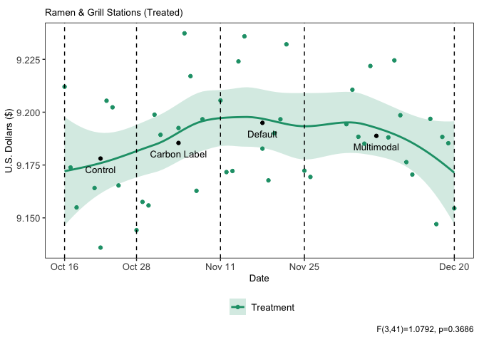<!-- -->

``` r
fall_data %>%
  filter(station=="Pasta") %>%
  filter(item_cat=="Main") %>%
  group_by(menu_condition) %>% 
  summarise(total_dollar_cost=sum(corr_dollar_cost),total_sales=sum(count)) %>%
  mutate(mean_dollar_cost=total_dollar_cost/total_sales) 
```

    ## # A tibble: 4 × 4
    ##   menu_condition total_dollar_cost total_sales mean_dollar_cost
    ##   <chr>                      <dbl>       <int>            <dbl>
    ## 1 Carbon Label              12533.        1408             8.90
    ## 2 Control                   10307.        1158             8.90
    ## 3 Default                   11936.        1341             8.90
    ## 4 Multimodal                11817.        1329             8.89

``` r
fall_mean_spend_control_aov_data <- fall_data %>%
  filter(station=="Pasta") %>%
  filter(item_cat=="Main") %>%
  group_by(date,menu_condition,station) %>%
  summarise(total_dollar_cost=sum(corr_dollar_cost),total_sales=sum(count)) %>%
  mutate(mean_dollar_cost=total_dollar_cost/total_sales) %>%
  mutate(date=case_when(date=="16-Oct"~"2024-10-16",
                        date=="17-Oct"~"2024-10-17",
                        date=="18-Oct"~"2024-10-18",
                        date=="21-Oct"~"2024-10-21",
                        date=="22-Oct"~"2024-10-22",
                        date=="23-Oct"~"2024-10-23",
                        date=="24-Oct"~"2024-10-24",
                        date=="25-Oct"~"2024-10-25",
                        date=="28-Oct"~"2024-10-28",
                        date=="29-Oct"~"2024-10-29",
                        date=="30-Oct"~"2024-10-30",
                        date=="31-Oct"~"2024-10-31",
                        date=="1-Nov"~"2024-11-1",
                        date=="4-Nov"~"2024-11-4",
                        date=="5-Nov"~"2024-11-5",
                        date=="6-Nov"~"2024-11-6",
                        date=="7-Nov"~"2024-11-7",
                        date=="8-Nov"~"2024-11-8",
                        date=="11-Nov"~"2024-11-11",
                        date=="12-Nov"~"2024-11-12",
                        date=="13-Nov"~"2024-11-13",
                        date=="14-Nov"~"2024-11-14",
                        date=="15-Nov"~"2024-11-15",
                        date=="18-Nov"~"2024-11-18",
                        date=="19-Nov"~"2024-11-19",
                        date=="20-Nov"~"2024-11-20",
                        date=="21-Nov"~"2024-11-21",
                        date=="22-Nov"~"2024-11-22",
                        date=="25-Nov"~"2024-11-25",
                        date=="26-Nov"~"2024-11-26",
                        date=="2-Dec"~"2024-12-2",
                        date=="3-Dec"~"2024-12-3",
                        date=="4-Dec"~"2024-12-4",
                        date=="5-Dec"~"2024-12-5",
                        date=="6-Dec"~"2024-12-6",
                        date=="9-Dec"~"2024-12-9",
                        date=="10-Dec"~"2024-12-10",
                        date=="11-Dec"~"2024-12-11",
                        date=="12-Dec"~"2024-12-12",
                        date=="13-Dec"~"2024-12-13",
                        date=="16-Dec"~"2024-12-16",
                        date=="17-Dec"~"2024-12-17",
                        date=="18-Dec"~"2024-12-18",
                        date=="19-Dec"~"2024-12-19",
                        date=="20-Dec"~"2024-12-20")) %>%
  mutate(date=as.Date(date)) %>%
  ungroup() %>%
  select(menu_condition,mean_dollar_cost) %>%
  arrange(menu_condition)
```

    ## `summarise()` has grouped output by 'date', 'menu_condition'. You can override
    ## using the `.groups` argument.

``` r
shapiro.test(fall_mean_spend_control_aov_data$mean_dollar_cost) 
```

    ## 
    ##  Shapiro-Wilk normality test
    ## 
    ## data:  fall_mean_spend_control_aov_data$mean_dollar_cost
    ## W = 0.98336, p-value = 0.7563

``` r
oneway.test(mean_dollar_cost~menu_condition,data=fall_mean_spend_control_aov_data,var.equal=TRUE)
```

    ## 
    ##  One-way analysis of means
    ## 
    ## data:  mean_dollar_cost and menu_condition
    ## F = 1.706, num df = 3, denom df = 41, p-value = 0.1808

``` r
fall_mean_spend_control <- fall_data %>%
  filter(station=="Pasta") %>%
  filter(item_cat=="Main") %>%
  group_by(date,menu_condition,station) %>%
  summarise(total_dollar_cost=sum(corr_dollar_cost),total_sales=sum(count)) %>%
  mutate(mean_dollar_cost=total_dollar_cost/total_sales) %>%
  mutate(date=case_when(date=="16-Oct"~"2024-10-16",
                        date=="17-Oct"~"2024-10-17",
                        date=="18-Oct"~"2024-10-18",
                        date=="21-Oct"~"2024-10-21",
                        date=="22-Oct"~"2024-10-22",
                        date=="23-Oct"~"2024-10-23",
                        date=="24-Oct"~"2024-10-24",
                        date=="25-Oct"~"2024-10-25",
                        date=="28-Oct"~"2024-10-28",
                        date=="29-Oct"~"2024-10-29",
                        date=="30-Oct"~"2024-10-30",
                        date=="31-Oct"~"2024-10-31",
                        date=="1-Nov"~"2024-11-1",
                        date=="4-Nov"~"2024-11-4",
                        date=="5-Nov"~"2024-11-5",
                        date=="6-Nov"~"2024-11-6",
                        date=="7-Nov"~"2024-11-7",
                        date=="8-Nov"~"2024-11-8",
                        date=="11-Nov"~"2024-11-11",
                        date=="12-Nov"~"2024-11-12",
                        date=="13-Nov"~"2024-11-13",
                        date=="14-Nov"~"2024-11-14",
                        date=="15-Nov"~"2024-11-15",
                        date=="18-Nov"~"2024-11-18",
                        date=="19-Nov"~"2024-11-19",
                        date=="20-Nov"~"2024-11-20",
                        date=="21-Nov"~"2024-11-21",
                        date=="22-Nov"~"2024-11-22",
                        date=="25-Nov"~"2024-11-25",
                        date=="26-Nov"~"2024-11-26",
                        date=="2-Dec"~"2024-12-2",
                        date=="3-Dec"~"2024-12-3",
                        date=="4-Dec"~"2024-12-4",
                        date=="5-Dec"~"2024-12-5",
                        date=="6-Dec"~"2024-12-6",
                        date=="9-Dec"~"2024-12-9",
                        date=="10-Dec"~"2024-12-10",
                        date=="11-Dec"~"2024-12-11",
                        date=="12-Dec"~"2024-12-12",
                        date=="13-Dec"~"2024-12-13",
                        date=="16-Dec"~"2024-12-16",
                        date=="17-Dec"~"2024-12-17",
                        date=="18-Dec"~"2024-12-18",
                        date=="19-Dec"~"2024-12-19",
                        date=="20-Dec"~"2024-12-20")) %>%
  mutate(date=as.Date(date)) %>%
  ggplot(aes(x=date,y=mean_dollar_cost,color=station,fill=station)) + 
  geom_smooth(alpha=0.2) + 
  geom_point() +
  geom_vline(xintercept=as.numeric(daily_prop_low_fall_data$date[fall_vline]),linetype=2) +
  xlab("Date") + 
  ylab("U.S. Dollars ($)") +
  scale_color_brewer(palette="Set1",name="") +
  scale_fill_brewer(palette="Set1",name="") +
  scale_x_date(breaks=as.Date(c("2024-10-16","2024-10-28","2024-11-11","2024-11-25","2024-12-20")),labels=c("Oct 16","Oct 28","Nov 11","Nov 25","Dec 20")) +
  labs(title="Pasta Station (Untreated)",caption="F(3,41)=1.706,p=0.1808") +
  annotate("text",x=as.Date("2024-10-22"),y=8.900622-0.005,label="Control",size=10/.pt) +
  annotate("text",x=as.Date("2024-11-4"),y=8.901577-0.005,label="Carbon Label",size=10/.pt) +
  annotate("text",x=as.Date("2024-11-18"),y=8.900515-0.005,label="Default",size=10/.pt) +
  annotate("text",x=as.Date("2024-12-7"),y=8.891806-0.005,label="Multimodal",size=10/.pt) +
  annotate("point",x=as.Date("2024-10-22"),y=8.900622) +
  annotate("point",x=as.Date("2024-11-4"),y=8.901577) +
  annotate("point",x=as.Date("2024-11-18"),y=8.900515) +
  annotate("point",x=as.Date("2024-12-7"),y=8.891806) +
  theme(aspect.ratio=0.55,legend.position="bottom",panel.grid=element_blank(),panel.background=element_rect(fill="white"),panel.border=element_rect(fill=NA),legend.title=element_text(size=10),legend.text=element_text(size=10),plot.title=element_text(size=10),axis.title=element_text(size=10),axis.text=element_text(size=10)) 
```

    ## `summarise()` has grouped output by 'date', 'menu_condition'. You can override
    ## using the `.groups` argument.

``` r
fall_mean_spend_control
```

    ## `geom_smooth()` using method = 'loess' and formula = 'y ~ x'

<!-- -->

``` r
fall_mean_spend <- ggarrange(fall_mean_spend_ramen,fall_mean_spend_grill,fall_mean_spend_treatment,fall_mean_spend_control,
          labels=c("A","B","C","D"),
          legend="none")
```

    ## `geom_smooth()` using method = 'loess' and formula = 'y ~ x'
    ## `geom_smooth()` using method = 'loess' and formula = 'y ~ x'
    ## `geom_smooth()` using method = 'loess' and formula = 'y ~ x'
    ## `geom_smooth()` using method = 'loess' and formula = 'y ~ x'

``` r
fall_mean_spend <- annotate_figure(fall_mean_spend,top=text_grob("Mean Revenue Per Station Sale ($)",color="black",face="bold",size=12))
ggsave(filename="fall_mean_spend.png",plot=fall_mean_spend,path="/Users/kenjinchang/github/multimodal-framework-validation/figures",width=40,height=24,units="cm",dpi=150,limitsize=TRUE)
fall_mean_spend
```

<!-- -->

## prop mid

``` r
fall_data %>%
  filter(station=="Grill") %>%
  filter(item_cat=="Main") %>%
  mutate(item=case_when(item=="Black Bean Burger"~"Lowest-Emitting Offering",
                        item=="Grilled Hamburger"~"Highest-Emitting Offering",
                        item=="Grilled Chicken Breast Sandwich"~"Middle-Emitting Offerings",
                        item=="Seared Salmon Burger"~"Middle-Emitting Offerings",
                        item=="Trillium Grill Impossible Burger"~"Middle-Emitting Offerings")) %>%
  group_by(menu_condition,station,item) %>%
  summarise(total_count=sum(count)) %>%
  mutate(prop=case_when(menu_condition=="Carbon Label"~total_count/(935+32+318),
                        menu_condition=="Control"~total_count/(776+19+253),
                        menu_condition=="Default"~total_count/(904+33+333),
                        menu_condition=="Multimodal"~total_count/(1157+41+397))) %>%
  filter(item=="Middle-Emitting Offerings")
```

    ## `summarise()` has grouped output by 'menu_condition', 'station'. You can
    ## override using the `.groups` argument.

    ## # A tibble: 4 × 5
    ## # Groups:   menu_condition, station [4]
    ##   menu_condition station item                      total_count  prop
    ##   <chr>          <chr>   <chr>                           <int> <dbl>
    ## 1 Carbon Label   Grill   Middle-Emitting Offerings         318 0.247
    ## 2 Control        Grill   Middle-Emitting Offerings         253 0.241
    ## 3 Default        Grill   Middle-Emitting Offerings         333 0.262
    ## 4 Multimodal     Grill   Middle-Emitting Offerings         397 0.249

``` r
fall_prop_middle_aggregate_aov_data <- fall_data %>%
  filter(station=="Grill") %>%
  filter(item_cat=="Main") %>%
  mutate(item=case_when(item=="Black Bean Burger"~"Lowest-Emitting Offering",
                        item=="Grilled Hamburger"~"Highest-Emitting Offering",
                        item=="Grilled Chicken Breast Sandwich"~"Middle-Emitting Offerings",
                        item=="Seared Salmon Burger"~"Middle-Emitting Offerings",
                        item=="Trillium Grill Impossible Burger"~"Middle-Emitting Offerings")) %>%
  group_by(date,menu_condition,station,item) %>%
  summarise(total_count=sum(count)) %>%
  mutate(prop=case_when(date=="1-Nov"~total_count/(66+3+25),
                            date=="10-Dec"~total_count/(52+20),
                             date=="11-Dec"~total_count/(47+2+19),
                             date=="11-Nov"~total_count/(81+3+28),
                             date=="12-Dec"~total_count/(69+1+29),
                             date=="12-Nov"~total_count/(89+3+42),
                             date=="13-Dec"~total_count/(49+1+16),
                             date=="13-Nov"~total_count/(107+2+30),
                             date=="14-Nov"~total_count/(99+3+43),
                             date=="15-Nov"~total_count/(72+4+18),
                             date=="16-Dec"~total_count/(55+1+14),
                             date=="16-Oct"~total_count/(91+2+30),
                             date=="17-Dec"~total_count/(61+3+23),
                             date=="17-Oct"~total_count/(109+1+43),
                             date=="18-Dec"~total_count/(47+1+23),
                             date=="18-Nov"~total_count/(82+7+41),
                             date=="18-Oct"~total_count/(66+2+21),
                             date=="19-Dec"~total_count/(33+17),
                             date=="19-Nov"~total_count/(122+3+42),
                             date=="2-Dec"~total_count/(97+6+15),
                             date=="20-Dec"~total_count/(24+1+14),
                             date=="20-Nov"~total_count/(92+3+34),
                             date=="21-Nov"~total_count/(109+4+31),
                             date=="21-Oct"~total_count/(105+1+37),
                             date=="22-Nov"~total_count/(51+1+24),
                             date=="22-Oct"~total_count/(127+2+34),
                             date=="23-Oct"~total_count/(100+2+33),
                             date=="24-Oct"~total_count/(107+5+33),
                             date=="25-Nov"~total_count/(67+2+29),
                             date=="25-Oct"~total_count/(71+4+22),
                             date=="26-Nov"~total_count/(52+3+20),
                             date=="28-Oct"~total_count/(96+4+27),
                             date=="29-Oct"~total_count/(102+6+37),
                             date=="3-Dec"~total_count/(97+4+30),
                             date=="30-Oct"~total_count/(95+5+32),
                             date=="31-Oct"~total_count/(107+1+41),
                             date=="4-Dec"~total_count/(117+1+28),
                             date=="4-Nov"~total_count/(80+4+30),
                             date=="5-Dec"~total_count/(118+6+49),
                             date=="5-Nov"~total_count/(107+2+29),
                             date=="6-Dec"~total_count/(76+5+22),
                             date=="6-Nov"~total_count/(104+2+31),
                             date=="7-Nov"~total_count/(98+4+40),
                             date=="8-Nov"~total_count/(80+1+26),
                             date=="9-Dec"~total_count/(96+4+29))) %>%
  filter(item=="Middle-Emitting Offerings") %>%
  mutate(date=case_when(date=="16-Oct"~"2024-10-16",
                        date=="17-Oct"~"2024-10-17",
                        date=="18-Oct"~"2024-10-18",
                        date=="21-Oct"~"2024-10-21",
                        date=="22-Oct"~"2024-10-22",
                        date=="23-Oct"~"2024-10-23",
                        date=="24-Oct"~"2024-10-24",
                        date=="25-Oct"~"2024-10-25",
                        date=="28-Oct"~"2024-10-28",
                        date=="29-Oct"~"2024-10-29",
                        date=="30-Oct"~"2024-10-30",
                        date=="31-Oct"~"2024-10-31",
                        date=="1-Nov"~"2024-11-1",
                        date=="4-Nov"~"2024-11-4",
                        date=="5-Nov"~"2024-11-5",
                        date=="6-Nov"~"2024-11-6",
                        date=="7-Nov"~"2024-11-7",
                        date=="8-Nov"~"2024-11-8",
                        date=="11-Nov"~"2024-11-11",
                        date=="12-Nov"~"2024-11-12",
                        date=="13-Nov"~"2024-11-13",
                        date=="14-Nov"~"2024-11-14",
                        date=="15-Nov"~"2024-11-15",
                        date=="18-Nov"~"2024-11-18",
                        date=="19-Nov"~"2024-11-19",
                        date=="20-Nov"~"2024-11-20",
                        date=="21-Nov"~"2024-11-21",
                        date=="22-Nov"~"2024-11-22",
                        date=="25-Nov"~"2024-11-25",
                        date=="26-Nov"~"2024-11-26",
                        date=="2-Dec"~"2024-12-2",
                        date=="3-Dec"~"2024-12-3",
                        date=="4-Dec"~"2024-12-4",
                        date=="5-Dec"~"2024-12-5",
                        date=="6-Dec"~"2024-12-6",
                        date=="9-Dec"~"2024-12-9",
                        date=="10-Dec"~"2024-12-10",
                        date=="11-Dec"~"2024-12-11",
                        date=="12-Dec"~"2024-12-12",
                        date=="13-Dec"~"2024-12-13",
                        date=="16-Dec"~"2024-12-16",
                        date=="17-Dec"~"2024-12-17",
                        date=="18-Dec"~"2024-12-18",
                        date=="19-Dec"~"2024-12-19",
                        date=="20-Dec"~"2024-12-20")) %>%
  mutate(date=as.Date(date)) %>%
  ungroup() %>%
  select(menu_condition,prop) %>%
  arrange(menu_condition) 
```

    ## `summarise()` has grouped output by 'date', 'menu_condition', 'station'. You
    ## can override using the `.groups` argument.

``` r
shapiro.test(fall_prop_middle_aggregate_aov_data$prop) 
```

    ## 
    ##  Shapiro-Wilk normality test
    ## 
    ## data:  fall_prop_middle_aggregate_aov_data$prop
    ## W = 0.98413, p-value = 0.7869

``` r
oneway.test(prop~menu_condition,data=fall_prop_middle_aggregate_aov_data,var.equal=TRUE)
```

    ## 
    ##  One-way analysis of means
    ## 
    ## data:  prop and menu_condition
    ## F = 0.51136, num df = 3, denom df = 41, p-value = 0.6767

``` r
fall_prop_middle_aggregate <- fall_data %>%
  filter(station=="Grill") %>%
  filter(item_cat=="Main") %>%
  mutate(item=case_when(item=="Black Bean Burger"~"Lowest-Emitting Offering",
                        item=="Grilled Hamburger"~"Highest-Emitting Offering",
                        item=="Grilled Chicken Breast Sandwich"~"Middle-Emitting Offerings",
                        item=="Seared Salmon Burger"~"Middle-Emitting Offerings",
                        item=="Trillium Grill Impossible Burger"~"Middle-Emitting Offerings")) %>%
  group_by(date,menu_condition,station,item) %>%
  summarise(total_count=sum(count)) %>%
  mutate(prop=case_when(date=="1-Nov"~total_count/(66+3+25),
                            date=="10-Dec"~total_count/(52+20),
                             date=="11-Dec"~total_count/(47+2+19),
                             date=="11-Nov"~total_count/(81+3+28),
                             date=="12-Dec"~total_count/(69+1+29),
                             date=="12-Nov"~total_count/(89+3+42),
                             date=="13-Dec"~total_count/(49+1+16),
                             date=="13-Nov"~total_count/(107+2+30),
                             date=="14-Nov"~total_count/(99+3+43),
                             date=="15-Nov"~total_count/(72+4+18),
                             date=="16-Dec"~total_count/(55+1+14),
                             date=="16-Oct"~total_count/(91+2+30),
                             date=="17-Dec"~total_count/(61+3+23),
                             date=="17-Oct"~total_count/(109+1+43),
                             date=="18-Dec"~total_count/(47+1+23),
                             date=="18-Nov"~total_count/(82+7+41),
                             date=="18-Oct"~total_count/(66+2+21),
                             date=="19-Dec"~total_count/(33+17),
                             date=="19-Nov"~total_count/(122+3+42),
                             date=="2-Dec"~total_count/(97+6+15),
                             date=="20-Dec"~total_count/(24+1+14),
                             date=="20-Nov"~total_count/(92+3+34),
                             date=="21-Nov"~total_count/(109+4+31),
                             date=="21-Oct"~total_count/(105+1+37),
                             date=="22-Nov"~total_count/(51+1+24),
                             date=="22-Oct"~total_count/(127+2+34),
                             date=="23-Oct"~total_count/(100+2+33),
                             date=="24-Oct"~total_count/(107+5+33),
                             date=="25-Nov"~total_count/(67+2+29),
                             date=="25-Oct"~total_count/(71+4+22),
                             date=="26-Nov"~total_count/(52+3+20),
                             date=="28-Oct"~total_count/(96+4+27),
                             date=="29-Oct"~total_count/(102+6+37),
                             date=="3-Dec"~total_count/(97+4+30),
                             date=="30-Oct"~total_count/(95+5+32),
                             date=="31-Oct"~total_count/(107+1+41),
                             date=="4-Dec"~total_count/(117+1+28),
                             date=="4-Nov"~total_count/(80+4+30),
                             date=="5-Dec"~total_count/(118+6+49),
                             date=="5-Nov"~total_count/(107+2+29),
                             date=="6-Dec"~total_count/(76+5+22),
                             date=="6-Nov"~total_count/(104+2+31),
                             date=="7-Nov"~total_count/(98+4+40),
                             date=="8-Nov"~total_count/(80+1+26),
                             date=="9-Dec"~total_count/(96+4+29))) %>%
  filter(item=="Middle-Emitting Offerings") %>%
  mutate(date=case_when(date=="16-Oct"~"2024-10-16",
                        date=="17-Oct"~"2024-10-17",
                        date=="18-Oct"~"2024-10-18",
                        date=="21-Oct"~"2024-10-21",
                        date=="22-Oct"~"2024-10-22",
                        date=="23-Oct"~"2024-10-23",
                        date=="24-Oct"~"2024-10-24",
                        date=="25-Oct"~"2024-10-25",
                        date=="28-Oct"~"2024-10-28",
                        date=="29-Oct"~"2024-10-29",
                        date=="30-Oct"~"2024-10-30",
                        date=="31-Oct"~"2024-10-31",
                        date=="1-Nov"~"2024-11-1",
                        date=="4-Nov"~"2024-11-4",
                        date=="5-Nov"~"2024-11-5",
                        date=="6-Nov"~"2024-11-6",
                        date=="7-Nov"~"2024-11-7",
                        date=="8-Nov"~"2024-11-8",
                        date=="11-Nov"~"2024-11-11",
                        date=="12-Nov"~"2024-11-12",
                        date=="13-Nov"~"2024-11-13",
                        date=="14-Nov"~"2024-11-14",
                        date=="15-Nov"~"2024-11-15",
                        date=="18-Nov"~"2024-11-18",
                        date=="19-Nov"~"2024-11-19",
                        date=="20-Nov"~"2024-11-20",
                        date=="21-Nov"~"2024-11-21",
                        date=="22-Nov"~"2024-11-22",
                        date=="25-Nov"~"2024-11-25",
                        date=="26-Nov"~"2024-11-26",
                        date=="2-Dec"~"2024-12-2",
                        date=="3-Dec"~"2024-12-3",
                        date=="4-Dec"~"2024-12-4",
                        date=="5-Dec"~"2024-12-5",
                        date=="6-Dec"~"2024-12-6",
                        date=="9-Dec"~"2024-12-9",
                        date=="10-Dec"~"2024-12-10",
                        date=="11-Dec"~"2024-12-11",
                        date=="12-Dec"~"2024-12-12",
                        date=="13-Dec"~"2024-12-13",
                        date=="16-Dec"~"2024-12-16",
                        date=="17-Dec"~"2024-12-17",
                        date=="18-Dec"~"2024-12-18",
                        date=="19-Dec"~"2024-12-19",
                        date=="20-Dec"~"2024-12-20")) %>%
  mutate(date=as.Date(date)) %>%
  ggplot(aes(x=date,y=prop,color=item,fill=item)) + 
  geom_smooth(alpha=0.2) + 
  geom_point() +
  geom_vline(xintercept=as.numeric(daily_prop_low_fall_data$date[fall_vline]),linetype=2) +
  xlab("Date") + 
  ylab("Proportion of Station Sales") +
  scale_color_brewer(palette="Dark2",name="") +
  scale_fill_brewer(palette="Dark2",name="") +
  scale_x_date(breaks=as.Date(c("2024-10-16","2024-10-28","2024-11-11","2024-11-25","2024-12-20")),labels=c("Oct 16","Oct 28","Nov 11","Nov 25","Dec 20")) +
  labs(title="Grill Station (Treated)",caption="F(3,41)=0.51136, p=0.6767") +
  annotate("text",x=as.Date("2024-10-22"),y=0.2414122-0.015,label="Control",size=10/.pt) +
  annotate("text",x=as.Date("2024-11-4"),y=0.2474708-0.015,label="Carbon Label",size=10/.pt) +
  annotate("text",x=as.Date("2024-11-18"),y=0.2622047-0.015,label="Default",size=10/.pt) +
  annotate("text",x=as.Date("2024-12-7"),y=0.2489028-0.015,label="Multimodal",size=10/.pt) +
  annotate("point",x=as.Date("2024-10-22"),y=0.2414122) +
  annotate("point",x=as.Date("2024-11-4"),y=0.2474708) +
  annotate("point",x=as.Date("2024-11-18"),y=0.2622047) +
  annotate("point",x=as.Date("2024-12-7"),y=0.2489028) +
  theme(aspect.ratio=0.55,legend.position="bottom",panel.grid=element_blank(),panel.background=element_rect(fill="white"),panel.border=element_rect(fill=NA),legend.title=element_text(size=10),legend.text=element_text(size=10),plot.title=element_text(size=10),axis.title=element_text(size=10),axis.text=element_text(size=10)) 
```

    ## `summarise()` has grouped output by 'date', 'menu_condition', 'station'. You
    ## can override using the `.groups` argument.

``` r
fall_prop_middle_aggregate
```

    ## `geom_smooth()` using method = 'loess' and formula = 'y ~ x'

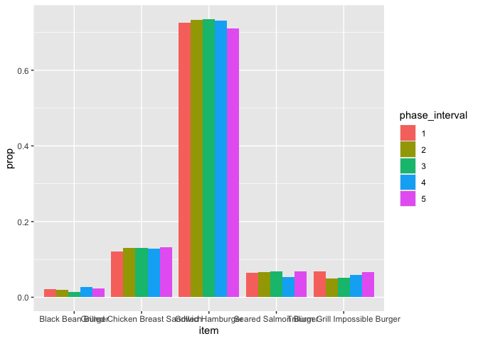<!-- -->

``` r
fall_data %>%
  filter(station=="Grill") %>%
  filter(item_cat=="Main") %>%
  group_by(menu_condition,station,item) %>%
  summarise(total_count=sum(count)) %>%
  mutate(prop=case_when(menu_condition=="Carbon Label"~total_count/(935+32+318),
                        menu_condition=="Control"~total_count/(776+19+253),
                        menu_condition=="Default"~total_count/(904+33+333),
                        menu_condition=="Multimodal"~total_count/(1157+41+397))) %>%
  filter(item=="Trillium Grill Impossible Burger")
```

    ## `summarise()` has grouped output by 'menu_condition', 'station'. You can
    ## override using the `.groups` argument.

    ## # A tibble: 4 × 5
    ## # Groups:   menu_condition, station [4]
    ##   menu_condition station item                             total_count   prop
    ##   <chr>          <chr>   <chr>                                  <int>  <dbl>
    ## 1 Carbon Label   Grill   Trillium Grill Impossible Burger          85 0.0661
    ## 2 Control        Grill   Trillium Grill Impossible Burger          60 0.0573
    ## 3 Default        Grill   Trillium Grill Impossible Burger          90 0.0709
    ## 4 Multimodal     Grill   Trillium Grill Impossible Burger         107 0.0671

``` r
fall_data %>%
  filter(station=="Grill") %>%
  filter(item_cat=="Main") %>%
  group_by(menu_condition,station,item) %>%
  summarise(total_count=sum(count)) %>%
  mutate(prop=case_when(menu_condition=="Carbon Label"~total_count/(935+32+318),
                        menu_condition=="Control"~total_count/(776+19+253),
                        menu_condition=="Default"~total_count/(904+33+333),
                        menu_condition=="Multimodal"~total_count/(1157+41+397))) %>%
  filter(item=="Seared Salmon Burger")
```

    ## `summarise()` has grouped output by 'menu_condition', 'station'. You can
    ## override using the `.groups` argument.

    ## # A tibble: 4 × 5
    ## # Groups:   menu_condition, station [4]
    ##   menu_condition station item                 total_count   prop
    ##   <chr>          <chr>   <chr>                      <int>  <dbl>
    ## 1 Carbon Label   Grill   Seared Salmon Burger          74 0.0576
    ## 2 Control        Grill   Seared Salmon Burger          68 0.0649
    ## 3 Default        Grill   Seared Salmon Burger          76 0.0598
    ## 4 Multimodal     Grill   Seared Salmon Burger         125 0.0784

``` r
fall_data %>%
  filter(station=="Grill") %>%
  filter(item_cat=="Main") %>%
  group_by(menu_condition,station,item) %>%
  summarise(total_count=sum(count)) %>%
  mutate(prop=case_when(menu_condition=="Carbon Label"~total_count/(935+32+318),
                        menu_condition=="Control"~total_count/(776+19+253),
                        menu_condition=="Default"~total_count/(904+33+333),
                        menu_condition=="Multimodal"~total_count/(1157+41+397))) %>%
  filter(item=="Grilled Chicken Breast Sandwich")
```

    ## `summarise()` has grouped output by 'menu_condition', 'station'. You can
    ## override using the `.groups` argument.

    ## # A tibble: 4 × 5
    ## # Groups:   menu_condition, station [4]
    ##   menu_condition station item                            total_count  prop
    ##   <chr>          <chr>   <chr>                                 <int> <dbl>
    ## 1 Carbon Label   Grill   Grilled Chicken Breast Sandwich         159 0.124
    ## 2 Control        Grill   Grilled Chicken Breast Sandwich         125 0.119
    ## 3 Default        Grill   Grilled Chicken Breast Sandwich         167 0.131
    ## 4 Multimodal     Grill   Grilled Chicken Breast Sandwich         165 0.103

``` r
fall_prop_middle_individual_chicken_aov_data <- fall_data %>%
  filter(station=="Grill") %>%
  filter(item_cat=="Main") %>%
  mutate(item=case_when(item=="Black Bean Burger"~"Lowest-Emitting Offering",
                        item=="Grilled Hamburger"~"Highest-Emitting Offering",
                        item=="Grilled Chicken Breast Sandwich"~"Chicken",
                        item=="Seared Salmon Burger"~"Salmon",
                        item=="Trillium Grill Impossible Burger"~"Impossible")) %>%
  group_by(date,menu_condition,station,item) %>%
  summarise(total_count=sum(count)) %>%
  mutate(prop=case_when(date=="1-Nov"~total_count/(66+3+25),
                            date=="10-Dec"~total_count/(52+20),
                             date=="11-Dec"~total_count/(47+2+19),
                             date=="11-Nov"~total_count/(81+3+28),
                             date=="12-Dec"~total_count/(69+1+29),
                             date=="12-Nov"~total_count/(89+3+42),
                             date=="13-Dec"~total_count/(49+1+16),
                             date=="13-Nov"~total_count/(107+2+30),
                             date=="14-Nov"~total_count/(99+3+43),
                             date=="15-Nov"~total_count/(72+4+18),
                             date=="16-Dec"~total_count/(55+1+14),
                             date=="16-Oct"~total_count/(91+2+30),
                             date=="17-Dec"~total_count/(61+3+23),
                             date=="17-Oct"~total_count/(109+1+43),
                             date=="18-Dec"~total_count/(47+1+23),
                             date=="18-Nov"~total_count/(82+7+41),
                             date=="18-Oct"~total_count/(66+2+21),
                             date=="19-Dec"~total_count/(33+17),
                             date=="19-Nov"~total_count/(122+3+42),
                             date=="2-Dec"~total_count/(97+6+15),
                             date=="20-Dec"~total_count/(24+1+14),
                             date=="20-Nov"~total_count/(92+3+34),
                             date=="21-Nov"~total_count/(109+4+31),
                             date=="21-Oct"~total_count/(105+1+37),
                             date=="22-Nov"~total_count/(51+1+24),
                             date=="22-Oct"~total_count/(127+2+34),
                             date=="23-Oct"~total_count/(100+2+33),
                             date=="24-Oct"~total_count/(107+5+33),
                             date=="25-Nov"~total_count/(67+2+29),
                             date=="25-Oct"~total_count/(71+4+22),
                             date=="26-Nov"~total_count/(52+3+20),
                             date=="28-Oct"~total_count/(96+4+27),
                             date=="29-Oct"~total_count/(102+6+37),
                             date=="3-Dec"~total_count/(97+4+30),
                             date=="30-Oct"~total_count/(95+5+32),
                             date=="31-Oct"~total_count/(107+1+41),
                             date=="4-Dec"~total_count/(117+1+28),
                             date=="4-Nov"~total_count/(80+4+30),
                             date=="5-Dec"~total_count/(118+6+49),
                             date=="5-Nov"~total_count/(107+2+29),
                             date=="6-Dec"~total_count/(76+5+22),
                             date=="6-Nov"~total_count/(104+2+31),
                             date=="7-Nov"~total_count/(98+4+40),
                             date=="8-Nov"~total_count/(80+1+26),
                             date=="9-Dec"~total_count/(96+4+29))) %>%
  filter(item=="Chicken"|item=="Salmon"|item=="Impossible") %>%
  mutate(date=case_when(date=="16-Oct"~"2024-10-16",
                        date=="17-Oct"~"2024-10-17",
                        date=="18-Oct"~"2024-10-18",
                        date=="21-Oct"~"2024-10-21",
                        date=="22-Oct"~"2024-10-22",
                        date=="23-Oct"~"2024-10-23",
                        date=="24-Oct"~"2024-10-24",
                        date=="25-Oct"~"2024-10-25",
                        date=="28-Oct"~"2024-10-28",
                        date=="29-Oct"~"2024-10-29",
                        date=="30-Oct"~"2024-10-30",
                        date=="31-Oct"~"2024-10-31",
                        date=="1-Nov"~"2024-11-1",
                        date=="4-Nov"~"2024-11-4",
                        date=="5-Nov"~"2024-11-5",
                        date=="6-Nov"~"2024-11-6",
                        date=="7-Nov"~"2024-11-7",
                        date=="8-Nov"~"2024-11-8",
                        date=="11-Nov"~"2024-11-11",
                        date=="12-Nov"~"2024-11-12",
                        date=="13-Nov"~"2024-11-13",
                        date=="14-Nov"~"2024-11-14",
                        date=="15-Nov"~"2024-11-15",
                        date=="18-Nov"~"2024-11-18",
                        date=="19-Nov"~"2024-11-19",
                        date=="20-Nov"~"2024-11-20",
                        date=="21-Nov"~"2024-11-21",
                        date=="22-Nov"~"2024-11-22",
                        date=="25-Nov"~"2024-11-25",
                        date=="26-Nov"~"2024-11-26",
                        date=="2-Dec"~"2024-12-2",
                        date=="3-Dec"~"2024-12-3",
                        date=="4-Dec"~"2024-12-4",
                        date=="5-Dec"~"2024-12-5",
                        date=="6-Dec"~"2024-12-6",
                        date=="9-Dec"~"2024-12-9",
                        date=="10-Dec"~"2024-12-10",
                        date=="11-Dec"~"2024-12-11",
                        date=="12-Dec"~"2024-12-12",
                        date=="13-Dec"~"2024-12-13",
                        date=="16-Dec"~"2024-12-16",
                        date=="17-Dec"~"2024-12-17",
                        date=="18-Dec"~"2024-12-18",
                        date=="19-Dec"~"2024-12-19",
                        date=="20-Dec"~"2024-12-20")) %>%
  mutate(date=as.Date(date)) %>% 
  ungroup() %>%
  filter(item=="Chicken") %>%
  select(menu_condition,prop) %>%
  arrange(menu_condition)
```

    ## `summarise()` has grouped output by 'date', 'menu_condition', 'station'. You
    ## can override using the `.groups` argument.

``` r
shapiro.test(fall_prop_middle_individual_chicken_aov_data$prop) 
```

    ## 
    ##  Shapiro-Wilk normality test
    ## 
    ## data:  fall_prop_middle_individual_chicken_aov_data$prop
    ## W = 0.96264, p-value = 0.154

``` r
oneway.test(prop~menu_condition,data=fall_prop_middle_individual_chicken_aov_data,var.equal=TRUE)
```

    ## 
    ##  One-way analysis of means
    ## 
    ## data:  prop and menu_condition
    ## F = 1.5615, num df = 3, denom df = 41, p-value = 0.2133

``` r
fall_prop_middle_individual_salmon_aov_data <- fall_data %>%
  filter(station=="Grill") %>%
  filter(item_cat=="Main") %>%
  mutate(item=case_when(item=="Black Bean Burger"~"Lowest-Emitting Offering",
                        item=="Grilled Hamburger"~"Highest-Emitting Offering",
                        item=="Grilled Chicken Breast Sandwich"~"Chicken",
                        item=="Seared Salmon Burger"~"Salmon",
                        item=="Trillium Grill Impossible Burger"~"Impossible")) %>%
  group_by(date,menu_condition,station,item) %>%
  summarise(total_count=sum(count)) %>%
  mutate(prop=case_when(date=="1-Nov"~total_count/(66+3+25),
                            date=="10-Dec"~total_count/(52+20),
                             date=="11-Dec"~total_count/(47+2+19),
                             date=="11-Nov"~total_count/(81+3+28),
                             date=="12-Dec"~total_count/(69+1+29),
                             date=="12-Nov"~total_count/(89+3+42),
                             date=="13-Dec"~total_count/(49+1+16),
                             date=="13-Nov"~total_count/(107+2+30),
                             date=="14-Nov"~total_count/(99+3+43),
                             date=="15-Nov"~total_count/(72+4+18),
                             date=="16-Dec"~total_count/(55+1+14),
                             date=="16-Oct"~total_count/(91+2+30),
                             date=="17-Dec"~total_count/(61+3+23),
                             date=="17-Oct"~total_count/(109+1+43),
                             date=="18-Dec"~total_count/(47+1+23),
                             date=="18-Nov"~total_count/(82+7+41),
                             date=="18-Oct"~total_count/(66+2+21),
                             date=="19-Dec"~total_count/(33+17),
                             date=="19-Nov"~total_count/(122+3+42),
                             date=="2-Dec"~total_count/(97+6+15),
                             date=="20-Dec"~total_count/(24+1+14),
                             date=="20-Nov"~total_count/(92+3+34),
                             date=="21-Nov"~total_count/(109+4+31),
                             date=="21-Oct"~total_count/(105+1+37),
                             date=="22-Nov"~total_count/(51+1+24),
                             date=="22-Oct"~total_count/(127+2+34),
                             date=="23-Oct"~total_count/(100+2+33),
                             date=="24-Oct"~total_count/(107+5+33),
                             date=="25-Nov"~total_count/(67+2+29),
                             date=="25-Oct"~total_count/(71+4+22),
                             date=="26-Nov"~total_count/(52+3+20),
                             date=="28-Oct"~total_count/(96+4+27),
                             date=="29-Oct"~total_count/(102+6+37),
                             date=="3-Dec"~total_count/(97+4+30),
                             date=="30-Oct"~total_count/(95+5+32),
                             date=="31-Oct"~total_count/(107+1+41),
                             date=="4-Dec"~total_count/(117+1+28),
                             date=="4-Nov"~total_count/(80+4+30),
                             date=="5-Dec"~total_count/(118+6+49),
                             date=="5-Nov"~total_count/(107+2+29),
                             date=="6-Dec"~total_count/(76+5+22),
                             date=="6-Nov"~total_count/(104+2+31),
                             date=="7-Nov"~total_count/(98+4+40),
                             date=="8-Nov"~total_count/(80+1+26),
                             date=="9-Dec"~total_count/(96+4+29))) %>%
  filter(item=="Chicken"|item=="Salmon"|item=="Impossible") %>%
  mutate(date=case_when(date=="16-Oct"~"2024-10-16",
                        date=="17-Oct"~"2024-10-17",
                        date=="18-Oct"~"2024-10-18",
                        date=="21-Oct"~"2024-10-21",
                        date=="22-Oct"~"2024-10-22",
                        date=="23-Oct"~"2024-10-23",
                        date=="24-Oct"~"2024-10-24",
                        date=="25-Oct"~"2024-10-25",
                        date=="28-Oct"~"2024-10-28",
                        date=="29-Oct"~"2024-10-29",
                        date=="30-Oct"~"2024-10-30",
                        date=="31-Oct"~"2024-10-31",
                        date=="1-Nov"~"2024-11-1",
                        date=="4-Nov"~"2024-11-4",
                        date=="5-Nov"~"2024-11-5",
                        date=="6-Nov"~"2024-11-6",
                        date=="7-Nov"~"2024-11-7",
                        date=="8-Nov"~"2024-11-8",
                        date=="11-Nov"~"2024-11-11",
                        date=="12-Nov"~"2024-11-12",
                        date=="13-Nov"~"2024-11-13",
                        date=="14-Nov"~"2024-11-14",
                        date=="15-Nov"~"2024-11-15",
                        date=="18-Nov"~"2024-11-18",
                        date=="19-Nov"~"2024-11-19",
                        date=="20-Nov"~"2024-11-20",
                        date=="21-Nov"~"2024-11-21",
                        date=="22-Nov"~"2024-11-22",
                        date=="25-Nov"~"2024-11-25",
                        date=="26-Nov"~"2024-11-26",
                        date=="2-Dec"~"2024-12-2",
                        date=="3-Dec"~"2024-12-3",
                        date=="4-Dec"~"2024-12-4",
                        date=="5-Dec"~"2024-12-5",
                        date=="6-Dec"~"2024-12-6",
                        date=="9-Dec"~"2024-12-9",
                        date=="10-Dec"~"2024-12-10",
                        date=="11-Dec"~"2024-12-11",
                        date=="12-Dec"~"2024-12-12",
                        date=="13-Dec"~"2024-12-13",
                        date=="16-Dec"~"2024-12-16",
                        date=="17-Dec"~"2024-12-17",
                        date=="18-Dec"~"2024-12-18",
                        date=="19-Dec"~"2024-12-19",
                        date=="20-Dec"~"2024-12-20")) %>%
  mutate(date=as.Date(date)) %>% 
  ungroup() %>%
  filter(item=="Salmon") %>%
  select(menu_condition,prop) %>%
  arrange(menu_condition)
```

    ## `summarise()` has grouped output by 'date', 'menu_condition', 'station'. You
    ## can override using the `.groups` argument.

``` r
shapiro.test(fall_prop_middle_individual_salmon_aov_data$prop) 
```

    ## 
    ##  Shapiro-Wilk normality test
    ## 
    ## data:  fall_prop_middle_individual_salmon_aov_data$prop
    ## W = 0.88685, p-value = 0.0003785

``` r
oneway.test(prop~menu_condition,data=fall_prop_middle_individual_salmon_aov_data,var.equal=TRUE) 
```

    ## 
    ##  One-way analysis of means
    ## 
    ## data:  prop and menu_condition
    ## F = 2.2704, num df = 3, denom df = 41, p-value = 0.09467

``` r
fall_prop_middle_individual_salmon_aov_model <- aov(prop~menu_condition,data=fall_prop_middle_individual_salmon_aov_data) 
summary(fall_prop_middle_individual_salmon_aov_model)
```

    ##                Df  Sum Sq  Mean Sq F value Pr(>F)  
    ## menu_condition  3 0.00739 0.002465    2.27 0.0947 .
    ## Residuals      41 0.04451 0.001086                 
    ## ---
    ## Signif. codes:  0 '***' 0.001 '**' 0.01 '*' 0.05 '.' 0.1 ' ' 1

``` r
TukeyHSD(fall_prop_middle_individual_salmon_aov_model,conf.level=0.9)
```

    ##   Tukey multiple comparisons of means
    ##     90% family-wise confidence level
    ## 
    ## Fit: aov(formula = prop ~ menu_condition, data = fall_prop_middle_individual_salmon_aov_data)
    ## 
    ## $menu_condition
    ##                                  diff          lwr        upr     p adj
    ## Control-Carbon Label     0.0087051535 -0.028268341 0.04567865 0.9441015
    ## Default-Carbon Label    -0.0001986886 -0.035057633 0.03466026 0.9999991
    ## Multimodal-Carbon Label  0.0280499948 -0.003013954 0.05911394 0.1588199
    ## Default-Control         -0.0089038421 -0.045877337 0.02806965 0.9405182
    ## Multimodal-Control       0.0193448413 -0.014074647 0.05276433 0.5252639
    ## Multimodal-Default       0.0282486834 -0.002815265 0.05931263 0.1542565

``` r
fall_prop_middle_individual_impossible_aov_data <- fall_data %>%
  filter(station=="Grill") %>%
  filter(item_cat=="Main") %>%
  mutate(item=case_when(item=="Black Bean Burger"~"Lowest-Emitting Offering",
                        item=="Grilled Hamburger"~"Highest-Emitting Offering",
                        item=="Grilled Chicken Breast Sandwich"~"Chicken",
                        item=="Seared Salmon Burger"~"Salmon",
                        item=="Trillium Grill Impossible Burger"~"Impossible")) %>%
  group_by(date,menu_condition,station,item) %>%
  summarise(total_count=sum(count)) %>%
  mutate(prop=case_when(date=="1-Nov"~total_count/(66+3+25),
                            date=="10-Dec"~total_count/(52+20),
                             date=="11-Dec"~total_count/(47+2+19),
                             date=="11-Nov"~total_count/(81+3+28),
                             date=="12-Dec"~total_count/(69+1+29),
                             date=="12-Nov"~total_count/(89+3+42),
                             date=="13-Dec"~total_count/(49+1+16),
                             date=="13-Nov"~total_count/(107+2+30),
                             date=="14-Nov"~total_count/(99+3+43),
                             date=="15-Nov"~total_count/(72+4+18),
                             date=="16-Dec"~total_count/(55+1+14),
                             date=="16-Oct"~total_count/(91+2+30),
                             date=="17-Dec"~total_count/(61+3+23),
                             date=="17-Oct"~total_count/(109+1+43),
                             date=="18-Dec"~total_count/(47+1+23),
                             date=="18-Nov"~total_count/(82+7+41),
                             date=="18-Oct"~total_count/(66+2+21),
                             date=="19-Dec"~total_count/(33+17),
                             date=="19-Nov"~total_count/(122+3+42),
                             date=="2-Dec"~total_count/(97+6+15),
                             date=="20-Dec"~total_count/(24+1+14),
                             date=="20-Nov"~total_count/(92+3+34),
                             date=="21-Nov"~total_count/(109+4+31),
                             date=="21-Oct"~total_count/(105+1+37),
                             date=="22-Nov"~total_count/(51+1+24),
                             date=="22-Oct"~total_count/(127+2+34),
                             date=="23-Oct"~total_count/(100+2+33),
                             date=="24-Oct"~total_count/(107+5+33),
                             date=="25-Nov"~total_count/(67+2+29),
                             date=="25-Oct"~total_count/(71+4+22),
                             date=="26-Nov"~total_count/(52+3+20),
                             date=="28-Oct"~total_count/(96+4+27),
                             date=="29-Oct"~total_count/(102+6+37),
                             date=="3-Dec"~total_count/(97+4+30),
                             date=="30-Oct"~total_count/(95+5+32),
                             date=="31-Oct"~total_count/(107+1+41),
                             date=="4-Dec"~total_count/(117+1+28),
                             date=="4-Nov"~total_count/(80+4+30),
                             date=="5-Dec"~total_count/(118+6+49),
                             date=="5-Nov"~total_count/(107+2+29),
                             date=="6-Dec"~total_count/(76+5+22),
                             date=="6-Nov"~total_count/(104+2+31),
                             date=="7-Nov"~total_count/(98+4+40),
                             date=="8-Nov"~total_count/(80+1+26),
                             date=="9-Dec"~total_count/(96+4+29))) %>%
  filter(item=="Chicken"|item=="Salmon"|item=="Impossible") %>%
  mutate(date=case_when(date=="16-Oct"~"2024-10-16",
                        date=="17-Oct"~"2024-10-17",
                        date=="18-Oct"~"2024-10-18",
                        date=="21-Oct"~"2024-10-21",
                        date=="22-Oct"~"2024-10-22",
                        date=="23-Oct"~"2024-10-23",
                        date=="24-Oct"~"2024-10-24",
                        date=="25-Oct"~"2024-10-25",
                        date=="28-Oct"~"2024-10-28",
                        date=="29-Oct"~"2024-10-29",
                        date=="30-Oct"~"2024-10-30",
                        date=="31-Oct"~"2024-10-31",
                        date=="1-Nov"~"2024-11-1",
                        date=="4-Nov"~"2024-11-4",
                        date=="5-Nov"~"2024-11-5",
                        date=="6-Nov"~"2024-11-6",
                        date=="7-Nov"~"2024-11-7",
                        date=="8-Nov"~"2024-11-8",
                        date=="11-Nov"~"2024-11-11",
                        date=="12-Nov"~"2024-11-12",
                        date=="13-Nov"~"2024-11-13",
                        date=="14-Nov"~"2024-11-14",
                        date=="15-Nov"~"2024-11-15",
                        date=="18-Nov"~"2024-11-18",
                        date=="19-Nov"~"2024-11-19",
                        date=="20-Nov"~"2024-11-20",
                        date=="21-Nov"~"2024-11-21",
                        date=="22-Nov"~"2024-11-22",
                        date=="25-Nov"~"2024-11-25",
                        date=="26-Nov"~"2024-11-26",
                        date=="2-Dec"~"2024-12-2",
                        date=="3-Dec"~"2024-12-3",
                        date=="4-Dec"~"2024-12-4",
                        date=="5-Dec"~"2024-12-5",
                        date=="6-Dec"~"2024-12-6",
                        date=="9-Dec"~"2024-12-9",
                        date=="10-Dec"~"2024-12-10",
                        date=="11-Dec"~"2024-12-11",
                        date=="12-Dec"~"2024-12-12",
                        date=="13-Dec"~"2024-12-13",
                        date=="16-Dec"~"2024-12-16",
                        date=="17-Dec"~"2024-12-17",
                        date=="18-Dec"~"2024-12-18",
                        date=="19-Dec"~"2024-12-19",
                        date=="20-Dec"~"2024-12-20")) %>%
  mutate(date=as.Date(date)) %>% 
  ungroup() %>%
  filter(item=="Impossible") %>%
  select(menu_condition,prop) %>%
  arrange(menu_condition)
```

    ## `summarise()` has grouped output by 'date', 'menu_condition', 'station'. You
    ## can override using the `.groups` argument.

``` r
shapiro.test(fall_prop_middle_individual_impossible_aov_data$prop) 
```

    ## 
    ##  Shapiro-Wilk normality test
    ## 
    ## data:  fall_prop_middle_individual_impossible_aov_data$prop
    ## W = 0.97537, p-value = 0.4604

``` r
oneway.test(prop~menu_condition,data=fall_prop_middle_individual_impossible_aov_data,var.equal=TRUE)
```

    ## 
    ##  One-way analysis of means
    ## 
    ## data:  prop and menu_condition
    ## F = 1.1236, num df = 3, denom df = 40, p-value = 0.351

``` r
fall_prop_middle_individual <- fall_data %>%
  filter(station=="Grill") %>%
  filter(item_cat=="Main") %>%
  mutate(item=case_when(item=="Black Bean Burger"~"Lowest-Emitting Offering",
                        item=="Grilled Hamburger"~"Highest-Emitting Offering",
                        item=="Grilled Chicken Breast Sandwich"~"Chicken",
                        item=="Seared Salmon Burger"~"Salmon",
                        item=="Trillium Grill Impossible Burger"~"Impossible")) %>%
  group_by(date,menu_condition,station,item) %>%
  summarise(total_count=sum(count)) %>%
  mutate(prop=case_when(date=="1-Nov"~total_count/(66+3+25),
                            date=="10-Dec"~total_count/(52+20),
                             date=="11-Dec"~total_count/(47+2+19),
                             date=="11-Nov"~total_count/(81+3+28),
                             date=="12-Dec"~total_count/(69+1+29),
                             date=="12-Nov"~total_count/(89+3+42),
                             date=="13-Dec"~total_count/(49+1+16),
                             date=="13-Nov"~total_count/(107+2+30),
                             date=="14-Nov"~total_count/(99+3+43),
                             date=="15-Nov"~total_count/(72+4+18),
                             date=="16-Dec"~total_count/(55+1+14),
                             date=="16-Oct"~total_count/(91+2+30),
                             date=="17-Dec"~total_count/(61+3+23),
                             date=="17-Oct"~total_count/(109+1+43),
                             date=="18-Dec"~total_count/(47+1+23),
                             date=="18-Nov"~total_count/(82+7+41),
                             date=="18-Oct"~total_count/(66+2+21),
                             date=="19-Dec"~total_count/(33+17),
                             date=="19-Nov"~total_count/(122+3+42),
                             date=="2-Dec"~total_count/(97+6+15),
                             date=="20-Dec"~total_count/(24+1+14),
                             date=="20-Nov"~total_count/(92+3+34),
                             date=="21-Nov"~total_count/(109+4+31),
                             date=="21-Oct"~total_count/(105+1+37),
                             date=="22-Nov"~total_count/(51+1+24),
                             date=="22-Oct"~total_count/(127+2+34),
                             date=="23-Oct"~total_count/(100+2+33),
                             date=="24-Oct"~total_count/(107+5+33),
                             date=="25-Nov"~total_count/(67+2+29),
                             date=="25-Oct"~total_count/(71+4+22),
                             date=="26-Nov"~total_count/(52+3+20),
                             date=="28-Oct"~total_count/(96+4+27),
                             date=="29-Oct"~total_count/(102+6+37),
                             date=="3-Dec"~total_count/(97+4+30),
                             date=="30-Oct"~total_count/(95+5+32),
                             date=="31-Oct"~total_count/(107+1+41),
                             date=="4-Dec"~total_count/(117+1+28),
                             date=="4-Nov"~total_count/(80+4+30),
                             date=="5-Dec"~total_count/(118+6+49),
                             date=="5-Nov"~total_count/(107+2+29),
                             date=="6-Dec"~total_count/(76+5+22),
                             date=="6-Nov"~total_count/(104+2+31),
                             date=="7-Nov"~total_count/(98+4+40),
                             date=="8-Nov"~total_count/(80+1+26),
                             date=="9-Dec"~total_count/(96+4+29))) %>%
  filter(item=="Chicken"|item=="Salmon"|item=="Impossible") %>%
  mutate(date=case_when(date=="16-Oct"~"2024-10-16",
                        date=="17-Oct"~"2024-10-17",
                        date=="18-Oct"~"2024-10-18",
                        date=="21-Oct"~"2024-10-21",
                        date=="22-Oct"~"2024-10-22",
                        date=="23-Oct"~"2024-10-23",
                        date=="24-Oct"~"2024-10-24",
                        date=="25-Oct"~"2024-10-25",
                        date=="28-Oct"~"2024-10-28",
                        date=="29-Oct"~"2024-10-29",
                        date=="30-Oct"~"2024-10-30",
                        date=="31-Oct"~"2024-10-31",
                        date=="1-Nov"~"2024-11-1",
                        date=="4-Nov"~"2024-11-4",
                        date=="5-Nov"~"2024-11-5",
                        date=="6-Nov"~"2024-11-6",
                        date=="7-Nov"~"2024-11-7",
                        date=="8-Nov"~"2024-11-8",
                        date=="11-Nov"~"2024-11-11",
                        date=="12-Nov"~"2024-11-12",
                        date=="13-Nov"~"2024-11-13",
                        date=="14-Nov"~"2024-11-14",
                        date=="15-Nov"~"2024-11-15",
                        date=="18-Nov"~"2024-11-18",
                        date=="19-Nov"~"2024-11-19",
                        date=="20-Nov"~"2024-11-20",
                        date=="21-Nov"~"2024-11-21",
                        date=="22-Nov"~"2024-11-22",
                        date=="25-Nov"~"2024-11-25",
                        date=="26-Nov"~"2024-11-26",
                        date=="2-Dec"~"2024-12-2",
                        date=="3-Dec"~"2024-12-3",
                        date=="4-Dec"~"2024-12-4",
                        date=="5-Dec"~"2024-12-5",
                        date=="6-Dec"~"2024-12-6",
                        date=="9-Dec"~"2024-12-9",
                        date=="10-Dec"~"2024-12-10",
                        date=="11-Dec"~"2024-12-11",
                        date=="12-Dec"~"2024-12-12",
                        date=="13-Dec"~"2024-12-13",
                        date=="16-Dec"~"2024-12-16",
                        date=="17-Dec"~"2024-12-17",
                        date=="18-Dec"~"2024-12-18",
                        date=="19-Dec"~"2024-12-19",
                        date=="20-Dec"~"2024-12-20")) %>%
  mutate(date=as.Date(date)) %>%
  ggplot(aes(x=date,y=prop,color=item,fill=item)) + 
  geom_smooth(alpha=0.2) + 
  geom_point() +
  geom_vline(xintercept=as.numeric(daily_prop_low_fall_data$date[fall_vline]),linetype=2) +
  xlab("Date") + 
  ylab("Proportion of Station Sales") +
  scale_color_manual(values=c("aquamarine4","mediumseagreen","darkgreen")) +
  scale_fill_manual(values=c("aquamarine4","mediumseagreen","darkgreen")) +
  scale_x_date(breaks=as.Date(c("2024-10-16","2024-10-28","2024-11-11","2024-11-25","2024-12-20")),labels=c("Oct 16","Oct 28","Nov 11","Nov 25","Dec 20")) +
  labs(title="Grill Station (Treated)",fill="",color="",caption="Chicken: F(3,41)=1.5615, p=0.2133; Salmon: F(3,41)=2.2704,p=0.09467; Impossible: F(3,40)=1.1236, p=0.351") +
  annotate("text",x=as.Date("2024-10-22"),y=0.19-0.015,label="Control",size=10/.pt) +
  annotate("text",x=as.Date("2024-11-4"),y=0.19-0.015,label="Carbon Label",size=10/.pt) +
  annotate("text",x=as.Date("2024-11-18"),y=0.19-0.015,label="Default",size=10/.pt) +
  annotate("text",x=as.Date("2024-12-7"),y=0.19-0.015,label="Multimodal",size=10/.pt) +
  theme(aspect.ratio=0.55,legend.position="bottom",panel.grid=element_blank(),panel.background=element_rect(fill="white"),panel.border=element_rect(fill=NA),legend.title=element_text(size=10),legend.text=element_text(size=10),plot.title=element_text(size=10),axis.title=element_text(size=10),axis.text=element_text(size=10)) 
```

    ## `summarise()` has grouped output by 'date', 'menu_condition', 'station'. You
    ## can override using the `.groups` argument.

``` r
fall_prop_middle_individual
```

    ## `geom_smooth()` using method = 'loess' and formula = 'y ~ x'

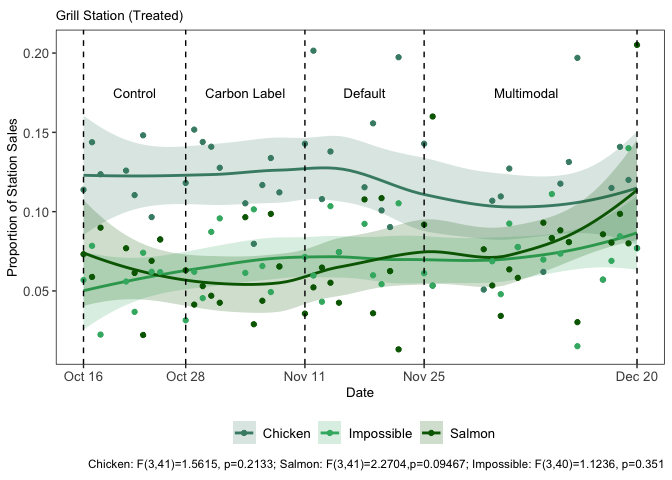<!-- -->

``` r
fall_prop_middle <- ggarrange(fall_prop_middle_aggregate,fall_prop_middle_individual,
          labels=c("A","B"))
```

    ## `geom_smooth()` using method = 'loess' and formula = 'y ~ x'
    ## `geom_smooth()` using method = 'loess' and formula = 'y ~ x'

``` r
fall_prop_middle <- annotate_figure(fall_prop_middle,top=text_grob("Daily Sales Percentages of Middle-Emitting Offerings (%)", 
               color="black",face="bold",size = 12))
ggsave(filename="fall_prop_middle.png",plot=fall_prop_middle,path="/Users/kenjinchang/github/multimodal-framework-validation/figures",width=34,height=12,units="cm",dpi=150,limitsize=TRUE)
fall_prop_middle
```

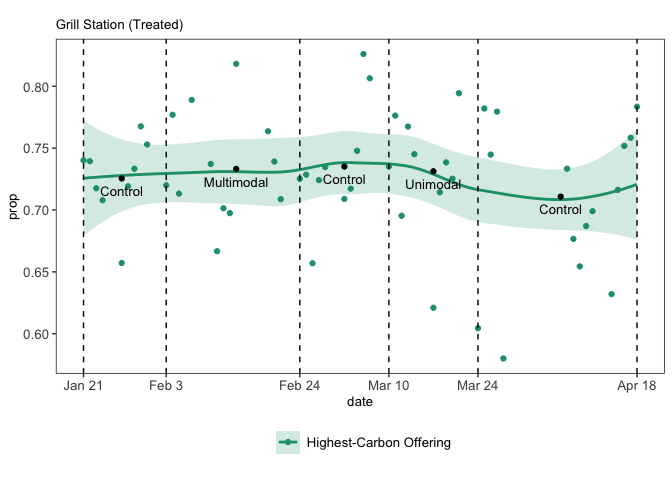<!-- -->

### Proportion of medium-emitting selections???? OMG Consider fixing code for prop-low and prop-high

menu_condition level

``` r
period_prop_middle_fall_data <- fall_data %>%
  filter(station=="Grill") %>%
  filter(item_cat=="Main") %>%
  group_by(menu_condition,item) %>%
  summarise(total_count=sum(count)) %>%
  mutate(prop=case_when(item=="Black Bean Burger"&menu_condition=="Carbon Label"~total_count/(32+159+935+74+85),
                        item=="Grilled Chicken Breast Sandwich"&menu_condition=="Carbon Label"~total_count/(32+159+935+74+85),
                        item=="Grilled Hamburger"&menu_condition=="Carbon Label"~total_count/(32+159+935+74+85),
                        item=="Seared Salmon Burger"&menu_condition=="Carbon Label"~total_count/(32+159+935+74+85),
                        item=="Trillium Grill Impossible Burger"&menu_condition=="Carbon Label"~total_count/(32+159+935+74+85),
                        item=="Black Bean Burger"&menu_condition=="Control"~total_count/(19+125+776+68+60),
                        item=="Grilled Chicken Breast Sandwich"&menu_condition=="Control"~total_count/(19+125+776+68+60),
                        item=="Grilled Hamburger"&menu_condition=="Control"~total_count/(19+125+776+68+60),
                        item=="Seared Salmon Burger"&menu_condition=="Control"~total_count/(19+125+776+68+60),
                        item=="Trillium Grill Impossible Burger"&menu_condition=="Control"~total_count/(19+125+776+68+60),
                        item=="Black Bean Burger"&menu_condition=="Default"~total_count/(33+167+904+76+90),
                        item=="Grilled Chicken Breast Sandwich"&menu_condition=="Default"~total_count/(33+167+904+76+90),
                        item=="Grilled Hamburger"&menu_condition=="Default"~total_count/(33+167+904+76+90),
                        item=="Seared Salmon Burger"&menu_condition=="Default"~total_count/(33+167+904+76+90),
                        item=="Trillium Grill Impossible Burger"&menu_condition=="Default"~total_count/(33+167+904+76+90),
                        item=="Black Bean Burger"&menu_condition=="Multimodal"~total_count/(41+165+1157+125+107),
                        item=="Grilled Chicken Breast Sandwich"&menu_condition=="Multimodal"~total_count/(41+165+1157+125+107),
                        item=="Grilled Hamburger"&menu_condition=="Multimodal"~total_count/(41+165+1157+125+107),
                        item=="Seared Salmon Burger"&menu_condition=="Multimodal"~total_count/(41+165+1157+125+107),
                        item=="Trillium Grill Impossible Burger"&menu_condition=="Multimodal"~total_count/(41+165+1157+125+107)))
```

    ## `summarise()` has grouped output by 'menu_condition'. You can override using
    ## the `.groups` argument.

``` r
period_prop_middle_fall_data
```

    ## # A tibble: 20 × 4
    ## # Groups:   menu_condition [4]
    ##    menu_condition item                             total_count   prop
    ##    <chr>          <chr>                                  <int>  <dbl>
    ##  1 Carbon Label   Black Bean Burger                         32 0.0249
    ##  2 Carbon Label   Grilled Chicken Breast Sandwich          159 0.124 
    ##  3 Carbon Label   Grilled Hamburger                        935 0.728 
    ##  4 Carbon Label   Seared Salmon Burger                      74 0.0576
    ##  5 Carbon Label   Trillium Grill Impossible Burger          85 0.0661
    ##  6 Control        Black Bean Burger                         19 0.0181
    ##  7 Control        Grilled Chicken Breast Sandwich          125 0.119 
    ##  8 Control        Grilled Hamburger                        776 0.740 
    ##  9 Control        Seared Salmon Burger                      68 0.0649
    ## 10 Control        Trillium Grill Impossible Burger          60 0.0573
    ## 11 Default        Black Bean Burger                         33 0.0260
    ## 12 Default        Grilled Chicken Breast Sandwich          167 0.131 
    ## 13 Default        Grilled Hamburger                        904 0.712 
    ## 14 Default        Seared Salmon Burger                      76 0.0598
    ## 15 Default        Trillium Grill Impossible Burger          90 0.0709
    ## 16 Multimodal     Black Bean Burger                         41 0.0257
    ## 17 Multimodal     Grilled Chicken Breast Sandwich          165 0.103 
    ## 18 Multimodal     Grilled Hamburger                       1157 0.725 
    ## 19 Multimodal     Seared Salmon Burger                     125 0.0784
    ## 20 Multimodal     Trillium Grill Impossible Burger         107 0.0671

``` r
period_prop_middle_fall_data %>%
  filter(item=="Black Bean Burger") %>%
  group_by(menu_condition) %>%
  summarise(sum(prop))
```

    ## # A tibble: 4 × 2
    ##   menu_condition `sum(prop)`
    ##   <chr>                <dbl>
    ## 1 Carbon Label        0.0249
    ## 2 Control             0.0181
    ## 3 Default             0.0260
    ## 4 Multimodal          0.0257

``` r
period_prop_middle_fall_data %>%
  ggplot(aes(x=item,y=prop,fill=menu_condition)) +
  geom_col(position="dodge") 
```

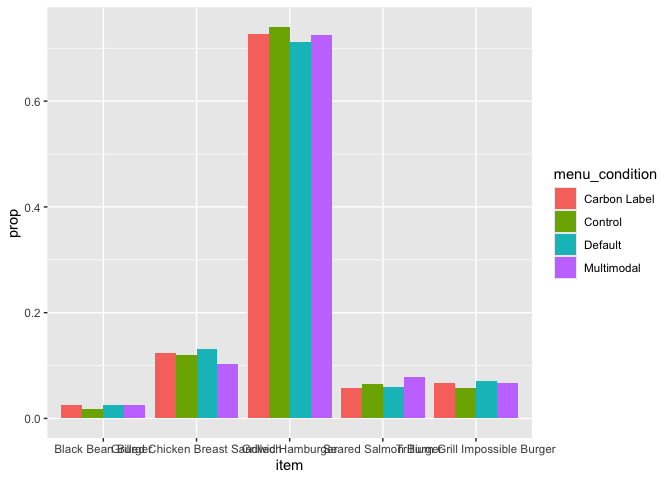<!-- -->

``` r
daily_prop_middle_fall_data <-fall_data %>%
  filter(station=="Grill") %>%
  filter(item_cat=="Main") %>%
  group_by(date,menu_condition,item) %>%
  summarise(total_count=sum(count)) %>%
  mutate(prop=case_when(menu_condition=="Carbon Label"&date=="1-Nov"~total_count/(94),
                        menu_condition=="Multimodal"&date=="10-Dec"~total_count/(72),
                        menu_condition=="Multimodal"&date=="11-Dec"~total_count/(68),
                        menu_condition=="Default"&date=="11-Nov"~total_count/(112),
                        menu_condition=="Multimodal"&date=="12-Dec"~total_count/(99),
                        menu_condition=="Default"&date=="12-Nov"~total_count/(134),
                        menu_condition=="Multimodal"&date=="13-Dec"~total_count/(66),
                        menu_condition=="Default"&date=="13-Nov"~total_count/(139),
                        menu_condition=="Default"&date=="14-Nov"~total_count/(145),
                        menu_condition=="Default"&date=="15-Nov"~total_count/(94),
                        menu_condition=="Multimodal"&date=="16-Dec"~total_count/(70),
                        menu_condition=="Control"&date=="16-Oct"~total_count/(123),
                        menu_condition=="Multimodal"&date=="17-Dec"~total_count/(87),
                        menu_condition=="Control"&date=="17-Oct"~total_count/(153),
                        menu_condition=="Multimodal"&date=="18-Dec"~total_count/(71),
                        menu_condition=="Default"&date=="18-Nov"~total_count/(130),
                        menu_condition=="Control"&date=="18-Oct"~total_count/(89),
                        menu_condition=="Multimodal"&date=="19-Dec"~total_count/(50),
                        menu_condition=="Default"&date=="19-Nov"~total_count/(167),
                        menu_condition=="Multimodal"&date=="2-Dec"~total_count/(118),
                        menu_condition=="Multimodal"&date=="20-Dec"~total_count/(39),
                        menu_condition=="Default"&date=="20-Nov"~total_count/(129),
                        menu_condition=="Default"&date=="21-Nov"~total_count/(144),
                        menu_condition=="Control"&date=="21-Oct"~total_count/(143),
                        menu_condition=="Default"&date=="22-Nov"~total_count/(76),
                        menu_condition=="Control"&date=="22-Oct"~total_count/(163),
                        menu_condition=="Control"&date=="23-Oct"~total_count/(135),
                        menu_condition=="Control"&date=="24-Oct"~total_count/(145),
                        menu_condition=="Multimodal"&date=="25-Nov"~total_count/(98),
                        menu_condition=="Control"&date=="25-Oct"~total_count/(97),
                        menu_condition=="Multimodal"&date=="26-Nov"~total_count/(75),
                        menu_condition=="Carbon Label"&date=="28-Oct"~total_count/(127),
                        menu_condition=="Carbon Label"&date=="29-Oct"~total_count/(145),
                        menu_condition=="Multimodal"&date=="3-Dec"~total_count/(131),
                        menu_condition=="Carbon Label"&date=="30-Oct"~total_count/(132),
                        menu_condition=="Carbon Label"&date=="31-Oct"~total_count/(149),
                        menu_condition=="Multimodal"&date=="4-Dec"~total_count/(146),
                        menu_condition=="Carbon Label"&date=="4-Nov"~total_count/(114),
                        menu_condition=="Multimodal"&date=="5-Dec"~total_count/(173),
                        menu_condition=="Carbon Label"&date=="5-Nov"~total_count/(138),
                        menu_condition=="Multimodal"&date=="6-Dec"~total_count/(103),
                        menu_condition=="Carbon Label"&date=="6-Nov"~total_count/(137),
                        menu_condition=="Carbon Label"&date=="7-Nov"~total_count/(142),
                        menu_condition=="Carbon Label"&date=="8-Nov"~total_count/(107),
                        menu_condition=="Multimodal"&date=="9-Dec"~total_count/(128))) 
```

    ## `summarise()` has grouped output by 'date', 'menu_condition'. You can override
    ## using the `.groups` argument.

``` r
daily_prop_middle_fall_data <- daily_prop_middle_fall_data %>%
  filter(item=="Grilled Chicken Breast Sandwich"|item=="Seared Salmon Burger"|item=="Trillium Grill Impossible Burger") %>%
  mutate(date=case_when(date=="16-Oct"~"2024-10-16",
                        date=="17-Oct"~"2024-10-17",
                        date=="18-Oct"~"2024-10-18",
                        date=="21-Oct"~"2024-10-21",
                        date=="22-Oct"~"2024-10-22",
                        date=="23-Oct"~"2024-10-23",
                        date=="24-Oct"~"2024-10-24",
                        date=="25-Oct"~"2024-10-25",
                        date=="28-Oct"~"2024-10-28",
                        date=="29-Oct"~"2024-10-29",
                        date=="30-Oct"~"2024-10-30",
                        date=="31-Oct"~"2024-10-31",
                        date=="1-Nov"~"2024-11-1",
                        date=="4-Nov"~"2024-11-4",
                        date=="5-Nov"~"2024-11-5",
                        date=="6-Nov"~"2024-11-6",
                        date=="7-Nov"~"2024-11-7",
                        date=="8-Nov"~"2024-11-8",
                        date=="11-Nov"~"2024-11-11",
                        date=="12-Nov"~"2024-11-12",
                        date=="13-Nov"~"2024-11-13",
                        date=="14-Nov"~"2024-11-14",
                        date=="15-Nov"~"2024-11-15",
                        date=="18-Nov"~"2024-11-18",
                        date=="19-Nov"~"2024-11-19",
                        date=="20-Nov"~"2024-11-20",
                        date=="21-Nov"~"2024-11-21",
                        date=="22-Nov"~"2024-11-22",
                        date=="25-Nov"~"2024-11-25",
                        date=="26-Nov"~"2024-11-26",
                        date=="2-Dec"~"2024-12-2",
                        date=="3-Dec"~"2024-12-3",
                        date=="4-Dec"~"2024-12-4",
                        date=="5-Dec"~"2024-12-5",
                        date=="6-Dec"~"2024-12-6",
                        date=="9-Dec"~"2024-12-9",
                        date=="10-Dec"~"2024-12-10",
                        date=="11-Dec"~"2024-12-11",
                        date=="12-Dec"~"2024-12-12",
                        date=="13-Dec"~"2024-12-13",
                        date=="16-Dec"~"2024-12-16",
                        date=="17-Dec"~"2024-12-17",
                        date=="18-Dec"~"2024-12-18",
                        date=="19-Dec"~"2024-12-19",
                        date=="20-Dec"~"2024-12-20")) %>%
  mutate(date=as.Date(date)) 
```

``` r
grill_prop_mid <- ggplot(daily_prop_middle_fall_data,aes(x=date,y=prop,fill=item,color=item)) + 
  geom_smooth() + 
  geom_point() +
  geom_vline(xintercept=as.numeric(daily_prop_low_fall_data$date[fall_vline]),linetype=2) +
  scale_color_brewer(palette="Set1") +
  scale_fill_brewer(palette="Set1") +
  xlab("Date") + 
  ylab("Proportion of Station Sales") +
  theme(aspect.ratio=0.55,legend.position="bottom",panel.grid=element_blank(),panel.background=element_rect(fill="white"),panel.border=element_rect(fill=NA),legend.title=element_text(size=10),legend.text=element_text(size=10),plot.title=element_text(size=10)) +
  annotate("text",x=as.Date("2024-10-20"),y=0.17,label="Control",size=10/.pt) +
  annotate("text",x=as.Date("2024-11-4"),y=0.17,label="Carbon Label",size=10/.pt) +
  annotate("text",x=as.Date("2024-11-18"),y=0.17,label="Default",size=10/.pt) +
  annotate("text",x=as.Date("2024-12-7"),y=0.17,label="Multimodal",size=10/.pt) 
grill_prop_mid
```

    ## `geom_smooth()` using method = 'loess' and formula = 'y ~ x'

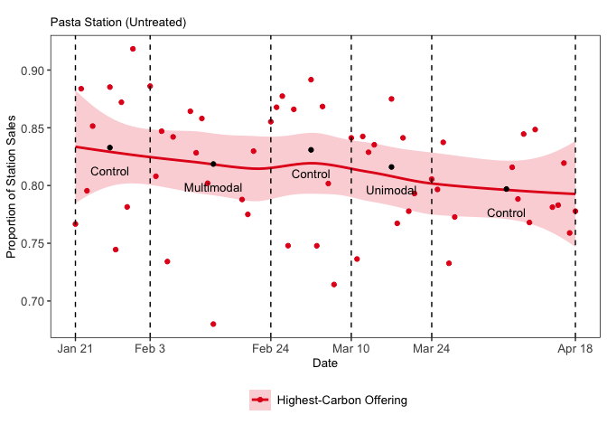<!-- -->
ggsave(filename=“prop_middle.png”,plot=grill_prop_mid,path=“/Users/kenjinchang/github/multimodal-framework-validation/figures”,width=30,height=20,units=“cm”,dpi=150,limitsize=TRUE)

Now trying just prop of all items at grill

``` r
daily_prop_fall_data <-fall_data %>%
  filter(station=="Grill") %>%
  filter(item_cat=="Main") %>%
  group_by(date,menu_condition,item) %>%
  summarise(total_count=sum(count)) %>%
  mutate(prop=case_when(menu_condition=="Carbon Label"&date=="1-Nov"~total_count/(94),
                        menu_condition=="Multimodal"&date=="10-Dec"~total_count/(72),
                        menu_condition=="Multimodal"&date=="11-Dec"~total_count/(68),
                        menu_condition=="Default"&date=="11-Nov"~total_count/(112),
                        menu_condition=="Multimodal"&date=="12-Dec"~total_count/(99),
                        menu_condition=="Default"&date=="12-Nov"~total_count/(134),
                        menu_condition=="Multimodal"&date=="13-Dec"~total_count/(66),
                        menu_condition=="Default"&date=="13-Nov"~total_count/(139),
                        menu_condition=="Default"&date=="14-Nov"~total_count/(145),
                        menu_condition=="Default"&date=="15-Nov"~total_count/(94),
                        menu_condition=="Multimodal"&date=="16-Dec"~total_count/(70),
                        menu_condition=="Control"&date=="16-Oct"~total_count/(123),
                        menu_condition=="Multimodal"&date=="17-Dec"~total_count/(87),
                        menu_condition=="Control"&date=="17-Oct"~total_count/(153),
                        menu_condition=="Multimodal"&date=="18-Dec"~total_count/(71),
                        menu_condition=="Default"&date=="18-Nov"~total_count/(130),
                        menu_condition=="Control"&date=="18-Oct"~total_count/(89),
                        menu_condition=="Multimodal"&date=="19-Dec"~total_count/(50),
                        menu_condition=="Default"&date=="19-Nov"~total_count/(167),
                        menu_condition=="Multimodal"&date=="2-Dec"~total_count/(118),
                        menu_condition=="Multimodal"&date=="20-Dec"~total_count/(39),
                        menu_condition=="Default"&date=="20-Nov"~total_count/(129),
                        menu_condition=="Default"&date=="21-Nov"~total_count/(144),
                        menu_condition=="Control"&date=="21-Oct"~total_count/(143),
                        menu_condition=="Default"&date=="22-Nov"~total_count/(76),
                        menu_condition=="Control"&date=="22-Oct"~total_count/(163),
                        menu_condition=="Control"&date=="23-Oct"~total_count/(135),
                        menu_condition=="Control"&date=="24-Oct"~total_count/(145),
                        menu_condition=="Multimodal"&date=="25-Nov"~total_count/(98),
                        menu_condition=="Control"&date=="25-Oct"~total_count/(97),
                        menu_condition=="Multimodal"&date=="26-Nov"~total_count/(75),
                        menu_condition=="Carbon Label"&date=="28-Oct"~total_count/(127),
                        menu_condition=="Carbon Label"&date=="29-Oct"~total_count/(145),
                        menu_condition=="Multimodal"&date=="3-Dec"~total_count/(131),
                        menu_condition=="Carbon Label"&date=="30-Oct"~total_count/(132),
                        menu_condition=="Carbon Label"&date=="31-Oct"~total_count/(149),
                        menu_condition=="Multimodal"&date=="4-Dec"~total_count/(146),
                        menu_condition=="Carbon Label"&date=="4-Nov"~total_count/(114),
                        menu_condition=="Multimodal"&date=="5-Dec"~total_count/(173),
                        menu_condition=="Carbon Label"&date=="5-Nov"~total_count/(138),
                        menu_condition=="Multimodal"&date=="6-Dec"~total_count/(103),
                        menu_condition=="Carbon Label"&date=="6-Nov"~total_count/(137),
                        menu_condition=="Carbon Label"&date=="7-Nov"~total_count/(142),
                        menu_condition=="Carbon Label"&date=="8-Nov"~total_count/(107),
                        menu_condition=="Multimodal"&date=="9-Dec"~total_count/(128))) %>%
  mutate(date=case_when(date=="16-Oct"~"2024-10-16",
                        date=="17-Oct"~"2024-10-17",
                        date=="18-Oct"~"2024-10-18",
                        date=="21-Oct"~"2024-10-21",
                        date=="22-Oct"~"2024-10-22",
                        date=="23-Oct"~"2024-10-23",
                        date=="24-Oct"~"2024-10-24",
                        date=="25-Oct"~"2024-10-25",
                        date=="28-Oct"~"2024-10-28",
                        date=="29-Oct"~"2024-10-29",
                        date=="30-Oct"~"2024-10-30",
                        date=="31-Oct"~"2024-10-31",
                        date=="1-Nov"~"2024-11-1",
                        date=="4-Nov"~"2024-11-4",
                        date=="5-Nov"~"2024-11-5",
                        date=="6-Nov"~"2024-11-6",
                        date=="7-Nov"~"2024-11-7",
                        date=="8-Nov"~"2024-11-8",
                        date=="11-Nov"~"2024-11-11",
                        date=="12-Nov"~"2024-11-12",
                        date=="13-Nov"~"2024-11-13",
                        date=="14-Nov"~"2024-11-14",
                        date=="15-Nov"~"2024-11-15",
                        date=="18-Nov"~"2024-11-18",
                        date=="19-Nov"~"2024-11-19",
                        date=="20-Nov"~"2024-11-20",
                        date=="21-Nov"~"2024-11-21",
                        date=="22-Nov"~"2024-11-22",
                        date=="25-Nov"~"2024-11-25",
                        date=="26-Nov"~"2024-11-26",
                        date=="2-Dec"~"2024-12-2",
                        date=="3-Dec"~"2024-12-3",
                        date=="4-Dec"~"2024-12-4",
                        date=="5-Dec"~"2024-12-5",
                        date=="6-Dec"~"2024-12-6",
                        date=="9-Dec"~"2024-12-9",
                        date=="10-Dec"~"2024-12-10",
                        date=="11-Dec"~"2024-12-11",
                        date=="12-Dec"~"2024-12-12",
                        date=="13-Dec"~"2024-12-13",
                        date=="16-Dec"~"2024-12-16",
                        date=="17-Dec"~"2024-12-17",
                        date=="18-Dec"~"2024-12-18",
                        date=="19-Dec"~"2024-12-19",
                        date=="20-Dec"~"2024-12-20")) %>%
  mutate(date=as.Date(date)) 
```

    ## `summarise()` has grouped output by 'date', 'menu_condition'. You can override
    ## using the `.groups` argument.

``` r
ggplot(daily_prop_fall_data,aes(x=date,y=prop,color=item)) + 
  geom_smooth() + 
  geom_point() +
  geom_vline(xintercept=as.numeric(daily_prop_low_fall_data$date[fall_vline]),linetype=2) 
```

    ## `geom_smooth()` using method = 'loess' and formula = 'y ~ x'

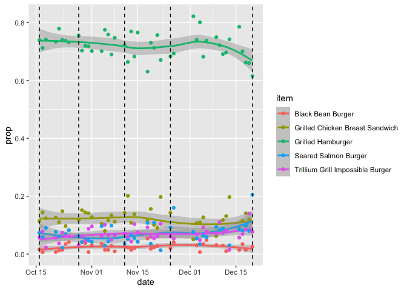<!-- -->

### Mean carbon costs

``` r
fall_data %>%
  filter(station_type=="Treatment") %>%
  filter(item_cat=="Main") %>%
  group_by(menu_condition,station) %>%
  summarise(tot_carbon_cost=sum(corr_carbon_cost),tot_water_cost=sum(corr_water_cost),tot_dollar_cost=sum(corr_dollar_cost),tot_sales=sum(count)) %>%
  mutate(mean_carbon_cost=tot_carbon_cost/tot_sales) %>%
  mutate(mean_water_cost=tot_water_cost/tot_sales) %>%
  mutate(mean_spend=tot_dollar_cost/tot_sales) %>%
  filter(station=="Grill") %>%
  select(menu_condition,mean_carbon_cost,mean_spend)
```

    ## `summarise()` has grouped output by 'menu_condition'. You can override using
    ## the `.groups` argument.

    ## # A tibble: 4 × 3
    ## # Groups:   menu_condition [4]
    ##   menu_condition mean_carbon_cost mean_spend
    ##   <chr>                     <dbl>      <dbl>
    ## 1 Carbon Label               2.90       8.99
    ## 2 Control                    2.95       8.98
    ## 3 Default                    2.85       8.99
    ## 4 Multimodal                 2.90       8.99

``` r
fall_data %>%
  filter(station_type=="Treatment") %>%
  filter(item_cat=="Main") %>%
  group_by(menu_condition,station) %>%
  summarise(tot_carbon_cost=sum(corr_carbon_cost),tot_water_cost=sum(corr_water_cost),tot_dollar_cost=sum(corr_dollar_cost),tot_sales=sum(count)) %>%
  mutate(mean_carbon_cost=tot_carbon_cost/tot_sales) %>%
  mutate(mean_water_cost=tot_water_cost/tot_sales) %>%
  mutate(mean_spend=tot_dollar_cost/tot_sales) %>%
  ggplot(aes(x=menu_condition,y=mean_carbon_cost,fill=station)) + 
  geom_col(position="dodge") + 
  scale_x_discrete(limits=c("Control","Carbon Label","Default","Multimodal"))
```

    ## `summarise()` has grouped output by 'menu_condition'. You can override using
    ## the `.groups` argument.

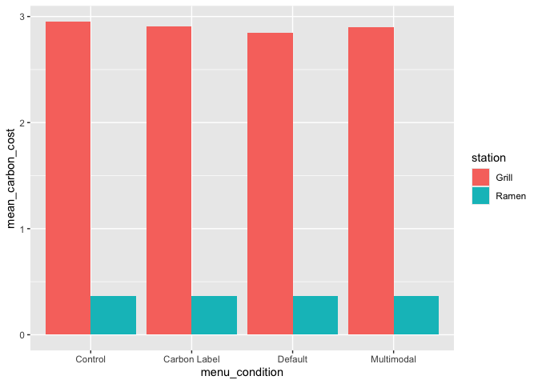<!-- -->

``` r
mean_per_day_carbon_cost_fall_data <- fall_data %>%
  filter(station_type=="Treatment") %>%
  filter(item_cat=="Main") %>%
  group_by(date,menu_condition,station) %>%
  summarise(total_carbon_cost=sum(corr_carbon_cost),total_sales=sum(count)) %>%
  mutate(mean_carbon_cost=total_carbon_cost/total_sales) %>%
  mutate(date=case_when(date=="16-Oct"~"2024-10-16",
                        date=="17-Oct"~"2024-10-17",
                        date=="18-Oct"~"2024-10-18",
                        date=="21-Oct"~"2024-10-21",
                        date=="22-Oct"~"2024-10-22",
                        date=="23-Oct"~"2024-10-23",
                        date=="24-Oct"~"2024-10-24",
                        date=="25-Oct"~"2024-10-25",
                        date=="28-Oct"~"2024-10-28",
                        date=="29-Oct"~"2024-10-29",
                        date=="30-Oct"~"2024-10-30",
                        date=="31-Oct"~"2024-10-31",
                        date=="1-Nov"~"2024-11-1",
                        date=="4-Nov"~"2024-11-4",
                        date=="5-Nov"~"2024-11-5",
                        date=="6-Nov"~"2024-11-6",
                        date=="7-Nov"~"2024-11-7",
                        date=="8-Nov"~"2024-11-8",
                        date=="11-Nov"~"2024-11-11",
                        date=="12-Nov"~"2024-11-12",
                        date=="13-Nov"~"2024-11-13",
                        date=="14-Nov"~"2024-11-14",
                        date=="15-Nov"~"2024-11-15",
                        date=="18-Nov"~"2024-11-18",
                        date=="19-Nov"~"2024-11-19",
                        date=="20-Nov"~"2024-11-20",
                        date=="21-Nov"~"2024-11-21",
                        date=="22-Nov"~"2024-11-22",
                        date=="25-Nov"~"2024-11-25",
                        date=="26-Nov"~"2024-11-26",
                        date=="2-Dec"~"2024-12-2",
                        date=="3-Dec"~"2024-12-3",
                        date=="4-Dec"~"2024-12-4",
                        date=="5-Dec"~"2024-12-5",
                        date=="6-Dec"~"2024-12-6",
                        date=="9-Dec"~"2024-12-9",
                        date=="10-Dec"~"2024-12-10",
                        date=="11-Dec"~"2024-12-11",
                        date=="12-Dec"~"2024-12-12",
                        date=="13-Dec"~"2024-12-13",
                        date=="16-Dec"~"2024-12-16",
                        date=="17-Dec"~"2024-12-17",
                        date=="18-Dec"~"2024-12-18",
                        date=="19-Dec"~"2024-12-19",
                        date=="20-Dec"~"2024-12-20")) %>%
  mutate(date=as.Date(date)) 
```

    ## `summarise()` has grouped output by 'date', 'menu_condition'. You can override
    ## using the `.groups` argument.

``` r
ggplot(mean_per_day_carbon_cost_fall_data,aes(x=date,y=mean_carbon_cost,color=station)) + 
  geom_smooth() + 
  geom_point() +
  geom_vline(xintercept=as.numeric(daily_prop_low_fall_data$date[fall_vline]),linetype=2) 
```

    ## `geom_smooth()` using method = 'loess' and formula = 'y ~ x'

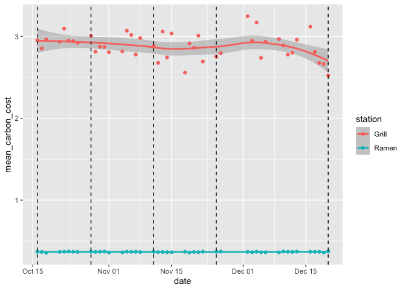<!-- -->

``` r
grill_mean_carbon_cost <- fall_data %>%
  filter(station=="Grill") %>%
  filter(item_cat=="Main") %>%
  group_by(date,menu_condition,station) %>%
  summarise(total_carbon_cost=sum(corr_carbon_cost),total_sales=sum(count)) %>%
  mutate(mean_carbon_cost=total_carbon_cost/total_sales) %>%
  mutate(date=case_when(date=="16-Oct"~"2024-10-16",
                        date=="17-Oct"~"2024-10-17",
                        date=="18-Oct"~"2024-10-18",
                        date=="21-Oct"~"2024-10-21",
                        date=="22-Oct"~"2024-10-22",
                        date=="23-Oct"~"2024-10-23",
                        date=="24-Oct"~"2024-10-24",
                        date=="25-Oct"~"2024-10-25",
                        date=="28-Oct"~"2024-10-28",
                        date=="29-Oct"~"2024-10-29",
                        date=="30-Oct"~"2024-10-30",
                        date=="31-Oct"~"2024-10-31",
                        date=="1-Nov"~"2024-11-1",
                        date=="4-Nov"~"2024-11-4",
                        date=="5-Nov"~"2024-11-5",
                        date=="6-Nov"~"2024-11-6",
                        date=="7-Nov"~"2024-11-7",
                        date=="8-Nov"~"2024-11-8",
                        date=="11-Nov"~"2024-11-11",
                        date=="12-Nov"~"2024-11-12",
                        date=="13-Nov"~"2024-11-13",
                        date=="14-Nov"~"2024-11-14",
                        date=="15-Nov"~"2024-11-15",
                        date=="18-Nov"~"2024-11-18",
                        date=="19-Nov"~"2024-11-19",
                        date=="20-Nov"~"2024-11-20",
                        date=="21-Nov"~"2024-11-21",
                        date=="22-Nov"~"2024-11-22",
                        date=="25-Nov"~"2024-11-25",
                        date=="26-Nov"~"2024-11-26",
                        date=="2-Dec"~"2024-12-2",
                        date=="3-Dec"~"2024-12-3",
                        date=="4-Dec"~"2024-12-4",
                        date=="5-Dec"~"2024-12-5",
                        date=="6-Dec"~"2024-12-6",
                        date=="9-Dec"~"2024-12-9",
                        date=="10-Dec"~"2024-12-10",
                        date=="11-Dec"~"2024-12-11",
                        date=="12-Dec"~"2024-12-12",
                        date=="13-Dec"~"2024-12-13",
                        date=="16-Dec"~"2024-12-16",
                        date=="17-Dec"~"2024-12-17",
                        date=="18-Dec"~"2024-12-18",
                        date=="19-Dec"~"2024-12-19",
                        date=="20-Dec"~"2024-12-20")) %>%
  mutate(date=as.Date(date)) %>%
  ggplot(aes(x=date,y=mean_carbon_cost,color=station)) + 
  geom_smooth() + 
  geom_point() +
  xlab("Date") +
  ylab(bquote('Mean Emissions Cost (kg CO'[2]*'e)')) +
  geom_vline(xintercept=as.numeric(daily_prop_low_fall_data$date[fall_vline]),linetype=2) +
  theme(aspect.ratio=0.55,legend.position="bottom",panel.grid=element_blank(),panel.background=element_rect(fill="white"),panel.border=element_rect(fill=NA),legend.title=element_text(size=10),legend.text=element_text(size=10),plot.title=element_text(size=10)) +
  annotate("text",x=as.Date("2024-10-20"),y=3.15,label="Control",size=10/.pt) +
  annotate("text",x=as.Date("2024-11-4"),y=3.15,label="Carbon Label",size=10/.pt) +
  annotate("text",x=as.Date("2024-11-18"),y=3.15,label="Default",size=10/.pt) +
  annotate("text",x=as.Date("2024-12-7"),y=3.15,label="Multimodal",size=10/.pt) 
```

    ## `summarise()` has grouped output by 'date', 'menu_condition'. You can override
    ## using the `.groups` argument.

``` r
grill_mean_carbon_cost
```

    ## `geom_smooth()` using method = 'loess' and formula = 'y ~ x'

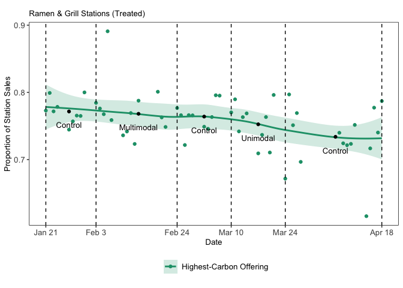<!-- -->
ggsave(filename=“mean_carbon.png”,plot=grill_mean_carbon_cost,path=“/Users/kenjinchang/github/multimodal-framework-validation/figures”,width=30,height=20,units=“cm”,dpi=150,limitsize=TRUE)

### Mean spend

``` r
fall_data %>%
  filter(station_type=="Treatment") %>%
  filter(item_cat=="Main") %>%
  group_by(menu_condition,station) %>%
  summarise(tot_carbon_cost=sum(corr_carbon_cost),tot_water_cost=sum(corr_water_cost),tot_dollar_cost=sum(corr_dollar_cost),tot_sales=sum(count)) %>%
  mutate(mean_carbon_cost=tot_carbon_cost/tot_sales) %>%
  mutate(mean_water_cost=tot_water_cost/tot_sales) %>%
  mutate(mean_spend=tot_dollar_cost/tot_sales) %>%
  ggplot(aes(x=menu_condition,y=mean_spend,fill=station)) + 
  geom_col(position="dodge") + 
  scale_x_discrete(limits=c("Control","Carbon Label","Default","Multimodal"))
```

    ## `summarise()` has grouped output by 'menu_condition'. You can override using
    ## the `.groups` argument.

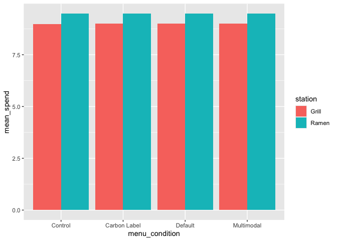<!-- -->

``` r
mean_daily_spend_fall_data <- fall_data %>%
  filter(station_type=="Treatment") %>%
  filter(item_cat=="Main") %>%
  group_by(date,menu_condition,station) %>%
  summarise(total_spend=sum(corr_dollar_cost),total_sales=sum(count)) %>%
  mutate(mean_spend=total_spend/total_sales) %>%
  mutate(date=case_when(date=="16-Oct"~"2024-10-16",
                        date=="17-Oct"~"2024-10-17",
                        date=="18-Oct"~"2024-10-18",
                        date=="21-Oct"~"2024-10-21",
                        date=="22-Oct"~"2024-10-22",
                        date=="23-Oct"~"2024-10-23",
                        date=="24-Oct"~"2024-10-24",
                        date=="25-Oct"~"2024-10-25",
                        date=="28-Oct"~"2024-10-28",
                        date=="29-Oct"~"2024-10-29",
                        date=="30-Oct"~"2024-10-30",
                        date=="31-Oct"~"2024-10-31",
                        date=="1-Nov"~"2024-11-1",
                        date=="4-Nov"~"2024-11-4",
                        date=="5-Nov"~"2024-11-5",
                        date=="6-Nov"~"2024-11-6",
                        date=="7-Nov"~"2024-11-7",
                        date=="8-Nov"~"2024-11-8",
                        date=="11-Nov"~"2024-11-11",
                        date=="12-Nov"~"2024-11-12",
                        date=="13-Nov"~"2024-11-13",
                        date=="14-Nov"~"2024-11-14",
                        date=="15-Nov"~"2024-11-15",
                        date=="18-Nov"~"2024-11-18",
                        date=="19-Nov"~"2024-11-19",
                        date=="20-Nov"~"2024-11-20",
                        date=="21-Nov"~"2024-11-21",
                        date=="22-Nov"~"2024-11-22",
                        date=="25-Nov"~"2024-11-25",
                        date=="26-Nov"~"2024-11-26",
                        date=="2-Dec"~"2024-12-2",
                        date=="3-Dec"~"2024-12-3",
                        date=="4-Dec"~"2024-12-4",
                        date=="5-Dec"~"2024-12-5",
                        date=="6-Dec"~"2024-12-6",
                        date=="9-Dec"~"2024-12-9",
                        date=="10-Dec"~"2024-12-10",
                        date=="11-Dec"~"2024-12-11",
                        date=="12-Dec"~"2024-12-12",
                        date=="13-Dec"~"2024-12-13",
                        date=="16-Dec"~"2024-12-16",
                        date=="17-Dec"~"2024-12-17",
                        date=="18-Dec"~"2024-12-18",
                        date=="19-Dec"~"2024-12-19",
                        date=="20-Dec"~"2024-12-20")) %>%
  mutate(date=as.Date(date)) 
```

    ## `summarise()` has grouped output by 'date', 'menu_condition'. You can override
    ## using the `.groups` argument.

``` r
ggplot(mean_daily_spend_fall_data,aes(x=date,y=mean_spend,color=station)) + 
  geom_smooth() + 
  geom_point() +
  geom_vline(xintercept=as.numeric(daily_prop_low_fall_data$date[fall_vline]),linetype=2) 
```

    ## `geom_smooth()` using method = 'loess' and formula = 'y ~ x'

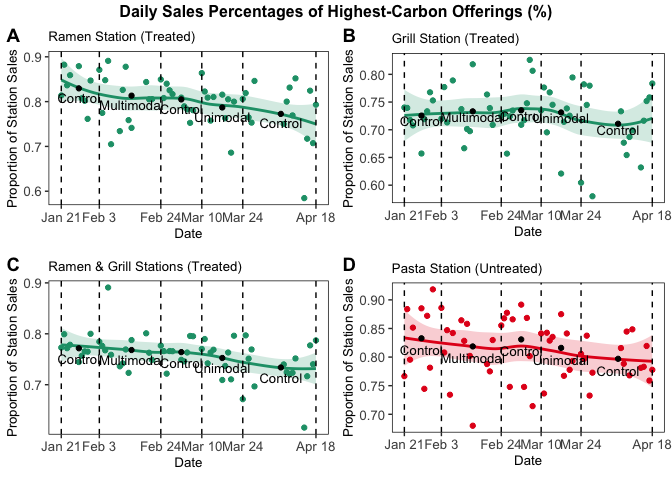<!-- -->

``` r
mean_spend <- fall_data %>%
  filter(station=="Grill") %>%
  filter(item_cat=="Main") %>%
  group_by(date,menu_condition,station) %>%
  summarise(total_spend=sum(corr_dollar_cost),total_sales=sum(count)) %>%
  mutate(mean_spend=total_spend/total_sales) %>%
  mutate(date=case_when(date=="16-Oct"~"2024-10-16",
                        date=="17-Oct"~"2024-10-17",
                        date=="18-Oct"~"2024-10-18",
                        date=="21-Oct"~"2024-10-21",
                        date=="22-Oct"~"2024-10-22",
                        date=="23-Oct"~"2024-10-23",
                        date=="24-Oct"~"2024-10-24",
                        date=="25-Oct"~"2024-10-25",
                        date=="28-Oct"~"2024-10-28",
                        date=="29-Oct"~"2024-10-29",
                        date=="30-Oct"~"2024-10-30",
                        date=="31-Oct"~"2024-10-31",
                        date=="1-Nov"~"2024-11-1",
                        date=="4-Nov"~"2024-11-4",
                        date=="5-Nov"~"2024-11-5",
                        date=="6-Nov"~"2024-11-6",
                        date=="7-Nov"~"2024-11-7",
                        date=="8-Nov"~"2024-11-8",
                        date=="11-Nov"~"2024-11-11",
                        date=="12-Nov"~"2024-11-12",
                        date=="13-Nov"~"2024-11-13",
                        date=="14-Nov"~"2024-11-14",
                        date=="15-Nov"~"2024-11-15",
                        date=="18-Nov"~"2024-11-18",
                        date=="19-Nov"~"2024-11-19",
                        date=="20-Nov"~"2024-11-20",
                        date=="21-Nov"~"2024-11-21",
                        date=="22-Nov"~"2024-11-22",
                        date=="25-Nov"~"2024-11-25",
                        date=="26-Nov"~"2024-11-26",
                        date=="2-Dec"~"2024-12-2",
                        date=="3-Dec"~"2024-12-3",
                        date=="4-Dec"~"2024-12-4",
                        date=="5-Dec"~"2024-12-5",
                        date=="6-Dec"~"2024-12-6",
                        date=="9-Dec"~"2024-12-9",
                        date=="10-Dec"~"2024-12-10",
                        date=="11-Dec"~"2024-12-11",
                        date=="12-Dec"~"2024-12-12",
                        date=="13-Dec"~"2024-12-13",
                        date=="16-Dec"~"2024-12-16",
                        date=="17-Dec"~"2024-12-17",
                        date=="18-Dec"~"2024-12-18",
                        date=="19-Dec"~"2024-12-19",
                        date=="20-Dec"~"2024-12-20")) %>%
  mutate(date=as.Date(date)) %>%
  ggplot(aes(x=date,y=mean_spend,color=station)) + 
  geom_smooth() + 
  geom_point() +
  geom_vline(xintercept=as.numeric(daily_prop_low_fall_data$date[fall_vline]),linetype=2) +
  xlab("Date") + 
  ylab("Mean Spend ($)") +
  theme(aspect.ratio=0.55,legend.position="bottom",panel.grid=element_blank(),panel.background=element_rect(fill="white"),panel.border=element_rect(fill=NA),legend.title=element_text(size=10),legend.text=element_text(size=10),plot.title=element_text(size=10)) +
  annotate("text",x=as.Date("2024-10-20"),y=9.06,label="Control",size=10/.pt) +
  annotate("text",x=as.Date("2024-11-4"),y=9.06,label="Carbon Label",size=10/.pt) +
  annotate("text",x=as.Date("2024-11-18"),y=9.06,label="Default",size=10/.pt) +
  annotate("text",x=as.Date("2024-12-7"),y=9.06,label="Multimodal",size=10/.pt) 
```

    ## `summarise()` has grouped output by 'date', 'menu_condition'. You can override
    ## using the `.groups` argument.

``` r
mean_spend
```

    ## `geom_smooth()` using method = 'loess' and formula = 'y ~ x'

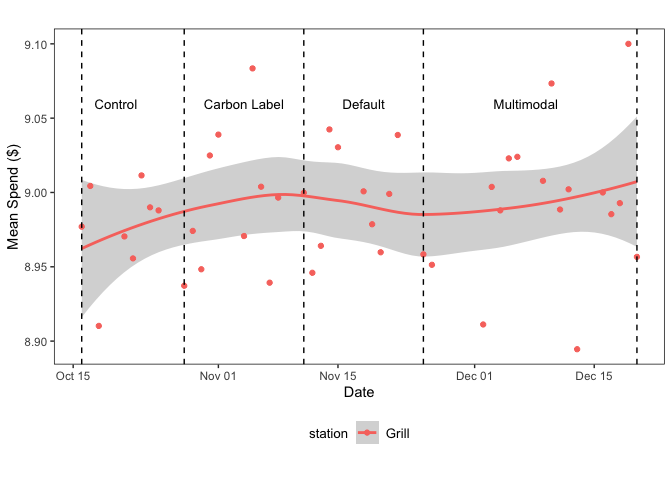<!-- -->
ggsave(filename=“mean_spend.png”,plot=mean_spend,path=“/Users/kenjinchang/github/multimodal-framework-validation/figures”,width=30,height=20,units=“cm”,dpi=150,limitsize=TRUE)

``` r
fall_data %>% filter(item_cat=="Main") %>% filter(station=="Pasta"|station=="Grill"|station=="Ramen") %>%
  summarise(sum(count))
```

    ##   sum(count)
    ## 1      13837

``` r
fall_data %>% filter(item_cat=="Main") %>% filter(station=="Pasta"|station=="Grill"|station=="Ramen") %>%
  group_by(menu_condition) %>%
  summarise(sum(count))
```

    ## # A tibble: 4 × 2
    ##   menu_condition `sum(count)`
    ##   <chr>                 <int>
    ## 1 Carbon Label           3513
    ## 2 Control                2877
    ## 3 Default                3481
    ## 4 Multimodal             3966

``` r
fall_data_daily_total <- fall_data %>% filter(item_cat=="Main") %>% filter(station=="Pasta"|station=="Grill"|station=="Ramen") %>%
  group_by(date) %>%
  summarise(daily_total=sum(count))
fall_data_daily_total
```

    ## # A tibble: 45 × 2
    ##    date   daily_total
    ##    <chr>        <int>
    ##  1 1-Nov          236
    ##  2 10-Dec         167
    ##  3 11-Dec         173
    ##  4 11-Nov         337
    ##  5 12-Dec         202
    ##  6 12-Nov         361
    ##  7 13-Dec         173
    ##  8 13-Nov         369
    ##  9 14-Nov         378
    ## 10 15-Nov         264
    ## # ℹ 35 more rows

``` r
fall_data_daily_total %>%
  mutate(date=case_when(date=="16-Oct"~"2024-10-16",
                        date=="17-Oct"~"2024-10-17",
                        date=="18-Oct"~"2024-10-18",
                        date=="21-Oct"~"2024-10-21",
                        date=="22-Oct"~"2024-10-22",
                        date=="23-Oct"~"2024-10-23",
                        date=="24-Oct"~"2024-10-24",
                        date=="25-Oct"~"2024-10-25",
                        date=="28-Oct"~"2024-10-28",
                        date=="29-Oct"~"2024-10-29",
                        date=="30-Oct"~"2024-10-30",
                        date=="31-Oct"~"2024-10-31",
                        date=="1-Nov"~"2024-11-1",
                        date=="4-Nov"~"2024-11-4",
                        date=="5-Nov"~"2024-11-5",
                        date=="6-Nov"~"2024-11-6",
                        date=="7-Nov"~"2024-11-7",
                        date=="8-Nov"~"2024-11-8",
                        date=="11-Nov"~"2024-11-11",
                        date=="12-Nov"~"2024-11-12",
                        date=="13-Nov"~"2024-11-13",
                        date=="14-Nov"~"2024-11-14",
                        date=="15-Nov"~"2024-11-15",
                        date=="18-Nov"~"2024-11-18",
                        date=="19-Nov"~"2024-11-19",
                        date=="20-Nov"~"2024-11-20",
                        date=="21-Nov"~"2024-11-21",
                        date=="22-Nov"~"2024-11-22",
                        date=="25-Nov"~"2024-11-25",
                        date=="26-Nov"~"2024-11-26",
                        date=="2-Dec"~"2024-12-2",
                        date=="3-Dec"~"2024-12-3",
                        date=="4-Dec"~"2024-12-4",
                        date=="5-Dec"~"2024-12-5",
                        date=="6-Dec"~"2024-12-6",
                        date=="9-Dec"~"2024-12-9",
                        date=="10-Dec"~"2024-12-10",
                        date=="11-Dec"~"2024-12-11",
                        date=="12-Dec"~"2024-12-12",
                        date=="13-Dec"~"2024-12-13",
                        date=="16-Dec"~"2024-12-16",
                        date=="17-Dec"~"2024-12-17",
                        date=="18-Dec"~"2024-12-18",
                        date=="19-Dec"~"2024-12-19",
                        date=="20-Dec"~"2024-12-20")) %>%
  mutate(date=as.Date(date)) %>%
  ggplot(aes(x=date,y=daily_total)) + 
  geom_smooth() + 
  geom_point() +
  geom_vline(xintercept=as.numeric(daily_prop_low_fall_data$date[fall_vline]),linetype=2) +
  theme(aspect.ratio=0.55,legend.position="bottom",panel.grid=element_blank(),panel.background=element_rect(fill="white"),panel.border=element_rect(fill=NA),legend.title=element_text(size=10),legend.text=element_text(size=10),plot.title=element_text(size=10)) +
  annotate("text",x=as.Date("2024-10-20"),y=9.06,label="Control",size=10/.pt) +
  annotate("text",x=as.Date("2024-11-4"),y=9.06,label="Carbon Label",size=10/.pt) +
  annotate("text",x=as.Date("2024-11-18"),y=9.06,label="Default",size=10/.pt) +
  annotate("text",x=as.Date("2024-12-7"),y=9.06,label="Multimodal",size=10/.pt) 
```

    ## `geom_smooth()` using method = 'loess' and formula = 'y ~ x'

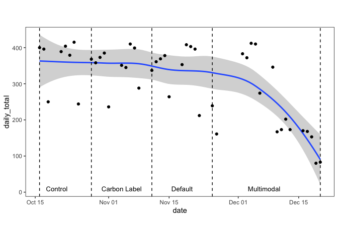<!-- -->

``` r
fall_data_daily_summary <- fall_data %>% filter(item_cat=="Main") %>% filter(station=="Pasta"|station=="Grill"|station=="Ramen") %>%
  mutate(meal_selection=case_when(item=="Grilled Hamburger"~"High",
                                  item=="Grilled Chicken Breast Sandwich"~"Middle",
                                  item=="Seared Salmon Burger"~"Middle",
                                  item=="Trillium Grill Impossible Burger"~"Middle",
                                  item=="Black Bean Burger" ~ "Low",
                                  item=="Bowl Ramen Chicken"~"High",
                                  item=="Bowl Ramen Tofu"~"Low",
                                  item=="Create Your Pasta Bowl MEAT"~"High",
                                  item=="Create Your Pasta Bowl VEG"~"Low")) 
```

``` r
fall_data_daily_summary <- left_join(fall_data_daily_summary,fall_data_daily_total)
```

    ## Joining with `by = join_by(date)`

``` r
fall_data_daily_summary
```

    ##       date                             item count sales_cat  semester
    ## 1   16-Oct                Grilled Hamburger    91     Grill Fall 2024
    ## 2   16-Oct  Grilled Chicken Breast Sandwich    14     Grill Fall 2024
    ## 3   16-Oct             Seared Salmon Burger     9     Grill Fall 2024
    ## 4   16-Oct Trillium Grill Impossible Burger     7     Grill Fall 2024
    ## 5   16-Oct                Black Bean Burger     2     Grill Fall 2024
    ## 6   16-Oct               Bowl Ramen Chicken    83     Asian Fall 2024
    ## 7   16-Oct                  Bowl Ramen Tofu    16     Asian Fall 2024
    ## 8   16-Oct               Bowl Ramen Chicken     5     Asian Fall 2024
    ## 9   16-Oct      Create Your Pasta Bowl MEAT   149   Italian Fall 2024
    ## 10  16-Oct       Create Your Pasta Bowl VEG    24   Italian Fall 2024
    ## 11  17-Oct                Grilled Hamburger   109     Grill Fall 2024
    ## 12  17-Oct  Grilled Chicken Breast Sandwich    22     Grill Fall 2024
    ## 13  17-Oct Trillium Grill Impossible Burger    12     Grill Fall 2024
    ## 14  17-Oct             Seared Salmon Burger     9     Grill Fall 2024
    ## 15  17-Oct                Black Bean Burger     1     Grill Fall 2024
    ## 16  17-Oct               Bowl Ramen Chicken    68     Asian Fall 2024
    ## 17  17-Oct                  Bowl Ramen Tofu    14     Asian Fall 2024
    ## 18  17-Oct      Create Your Pasta Bowl MEAT   128   Italian Fall 2024
    ## 19  17-Oct       Create Your Pasta Bowl VEG    33   Italian Fall 2024
    ## 20  18-Oct                Grilled Hamburger    66     Grill Fall 2024
    ## 21  18-Oct  Grilled Chicken Breast Sandwich    11     Grill Fall 2024
    ## 22  18-Oct             Seared Salmon Burger     8     Grill Fall 2024
    ## 23  18-Oct Trillium Grill Impossible Burger     2     Grill Fall 2024
    ## 24  18-Oct                Black Bean Burger     2     Grill Fall 2024
    ## 25  18-Oct               Bowl Ramen Chicken    44     Asian Fall 2024
    ## 26  18-Oct                  Bowl Ramen Tofu    21     Asian Fall 2024
    ## 27  18-Oct      Create Your Pasta Bowl MEAT    83   Italian Fall 2024
    ## 28  18-Oct       Create Your Pasta Bowl VEG    13   Italian Fall 2024
    ## 29  21-Oct                Grilled Hamburger   105     Grill Fall 2024
    ## 30  21-Oct  Grilled Chicken Breast Sandwich    18     Grill Fall 2024
    ## 31  21-Oct             Seared Salmon Burger    11     Grill Fall 2024
    ## 32  21-Oct Trillium Grill Impossible Burger     8     Grill Fall 2024
    ## 33  21-Oct                Black Bean Burger     1     Grill Fall 2024
    ## 34  21-Oct               Bowl Ramen Chicken    71     Asian Fall 2024
    ## 35  21-Oct                  Bowl Ramen Tofu    14     Asian Fall 2024
    ## 36  21-Oct      Create Your Pasta Bowl MEAT   124   Italian Fall 2024
    ## 37  21-Oct       Create Your Pasta Bowl VEG    37   Italian Fall 2024
    ## 38  22-Oct                Grilled Hamburger   127     Grill Fall 2024
    ## 39  22-Oct  Grilled Chicken Breast Sandwich    18     Grill Fall 2024
    ## 40  22-Oct             Seared Salmon Burger    10     Grill Fall 2024
    ## 41  22-Oct Trillium Grill Impossible Burger     6     Grill Fall 2024
    ## 42  22-Oct                Black Bean Burger     2     Grill Fall 2024
    ## 43  22-Oct               Bowl Ramen Chicken    73     Asian Fall 2024
    ## 44  22-Oct                  Bowl Ramen Tofu    10     Asian Fall 2024
    ## 45  22-Oct      Create Your Pasta Bowl MEAT   132   Italian Fall 2024
    ## 46  22-Oct       Create Your Pasta Bowl VEG    26   Italian Fall 2024
    ## 47  23-Oct                Grilled Hamburger   100     Grill Fall 2024
    ## 48  23-Oct  Grilled Chicken Breast Sandwich    20     Grill Fall 2024
    ## 49  23-Oct Trillium Grill Impossible Burger    10     Grill Fall 2024
    ## 50  23-Oct             Seared Salmon Burger     3     Grill Fall 2024
    ## 51  23-Oct                Black Bean Burger     2     Grill Fall 2024
    ## 52  23-Oct               Bowl Ramen Chicken    83     Asian Fall 2024
    ## 53  23-Oct                  Bowl Ramen Tofu     9     Asian Fall 2024
    ## 54  23-Oct      Create Your Pasta Bowl MEAT   124   Italian Fall 2024
    ## 55  23-Oct       Create Your Pasta Bowl VEG    28   Italian Fall 2024
    ## 56  24-Oct                Grilled Hamburger   107     Grill Fall 2024
    ## 57  24-Oct  Grilled Chicken Breast Sandwich    14     Grill Fall 2024
    ## 58  24-Oct Trillium Grill Impossible Burger     9     Grill Fall 2024
    ## 59  24-Oct             Seared Salmon Burger    10     Grill Fall 2024
    ## 60  24-Oct                Black Bean Burger     5     Grill Fall 2024
    ## 61  24-Oct               Bowl Ramen Chicken    92     Asian Fall 2024
    ## 62  24-Oct                  Bowl Ramen Tofu    15     Asian Fall 2024
    ## 63  24-Oct      Create Your Pasta Bowl MEAT   131   Italian Fall 2024
    ## 64  24-Oct       Create Your Pasta Bowl VEG    32   Italian Fall 2024
    ## 65  25-Oct                Grilled Hamburger    71     Grill Fall 2024
    ## 66  25-Oct  Grilled Chicken Breast Sandwich     8     Grill Fall 2024
    ## 67  25-Oct             Seared Salmon Burger     8     Grill Fall 2024
    ## 68  25-Oct Trillium Grill Impossible Burger     6     Grill Fall 2024
    ## 69  25-Oct                Black Bean Burger     4     Grill Fall 2024
    ## 70  25-Oct               Bowl Ramen Chicken    44     Asian Fall 2024
    ## 71  25-Oct                  Bowl Ramen Tofu     9     Asian Fall 2024
    ## 72  25-Oct      Create Your Pasta Bowl MEAT    80   Italian Fall 2024
    ## 73  25-Oct       Create Your Pasta Bowl VEG    14   Italian Fall 2024
    ## 74  28-Oct                Grilled Hamburger    96     Grill Fall 2024
    ## 75  28-Oct  Grilled Chicken Breast Sandwich    15     Grill Fall 2024
    ## 76  28-Oct             Seared Salmon Burger     8     Grill Fall 2024
    ## 77  28-Oct Trillium Grill Impossible Burger     4     Grill Fall 2024
    ## 78  28-Oct                Black Bean Burger     4     Grill Fall 2024
    ## 79  28-Oct               Bowl Ramen Chicken    65     Asian Fall 2024
    ## 80  28-Oct                  Bowl Ramen Tofu    11     Asian Fall 2024
    ## 81  28-Oct      Create Your Pasta Bowl MEAT   127   Italian Fall 2024
    ## 82  28-Oct       Create Your Pasta Bowl VEG    38   Italian Fall 2024
    ## 83  29-Oct                Grilled Hamburger   102     Grill Fall 2024
    ## 84  29-Oct  Grilled Chicken Breast Sandwich    22     Grill Fall 2024
    ## 85  29-Oct Trillium Grill Impossible Burger     9     Grill Fall 2024
    ## 86  29-Oct                Black Bean Burger     6     Grill Fall 2024
    ## 87  29-Oct             Seared Salmon Burger     6     Grill Fall 2024
    ## 88  29-Oct               Bowl Ramen Chicken    67     Asian Fall 2024
    ## 89  29-Oct                  Bowl Ramen Tofu    13     Asian Fall 2024
    ## 90  29-Oct      Create Your Pasta Bowl MEAT   108   Italian Fall 2024
    ## 91  29-Oct       Create Your Pasta Bowl VEG    25   Italian Fall 2024
    ## 92  30-Oct                Grilled Hamburger    95     Grill Fall 2024
    ## 93  30-Oct  Grilled Chicken Breast Sandwich    19     Grill Fall 2024
    ## 94  30-Oct Trillium Grill Impossible Burger     6     Grill Fall 2024
    ## 95  30-Oct             Seared Salmon Burger     7     Grill Fall 2024
    ## 96  30-Oct                Black Bean Burger     5     Grill Fall 2024
    ## 97  30-Oct               Bowl Ramen Chicken    70     Asian Fall 2024
    ## 98  30-Oct                  Bowl Ramen Tofu    12     Asian Fall 2024
    ## 99  30-Oct      Create Your Pasta Bowl MEAT   136   Italian Fall 2024
    ## 100 30-Oct       Create Your Pasta Bowl VEG    23   Italian Fall 2024
    ## 101 31-Oct                Grilled Hamburger   107     Grill Fall 2024
    ## 102 31-Oct  Grilled Chicken Breast Sandwich    21     Grill Fall 2024
    ## 103 31-Oct Trillium Grill Impossible Burger    13     Grill Fall 2024
    ## 104 31-Oct             Seared Salmon Burger     7     Grill Fall 2024
    ## 105 31-Oct                Black Bean Burger     1     Grill Fall 2024
    ## 106 31-Oct               Bowl Ramen Chicken    79     Asian Fall 2024
    ## 107 31-Oct                  Bowl Ramen Tofu    10     Asian Fall 2024
    ## 108 31-Oct      Create Your Pasta Bowl MEAT   120   Italian Fall 2024
    ## 109 31-Oct       Create Your Pasta Bowl VEG    27   Italian Fall 2024
    ## 110  1-Nov                Grilled Hamburger    66     Grill Fall 2024
    ## 111  1-Nov  Grilled Chicken Breast Sandwich    12     Grill Fall 2024
    ## 112  1-Nov Trillium Grill Impossible Burger     9     Grill Fall 2024
    ## 113  1-Nov             Seared Salmon Burger     4     Grill Fall 2024
    ## 114  1-Nov                Black Bean Burger     3     Grill Fall 2024
    ## 115  1-Nov               Bowl Ramen Chicken    34     Asian Fall 2024
    ## 116  1-Nov                  Bowl Ramen Tofu    13     Asian Fall 2024
    ## 117  1-Nov      Create Your Pasta Bowl MEAT    87   Italian Fall 2024
    ## 118  1-Nov       Create Your Pasta Bowl VEG     8   Italian Fall 2024
    ## 119  4-Nov                Grilled Hamburger    80     Grill Fall 2024
    ## 120  4-Nov  Grilled Chicken Breast Sandwich    12     Grill Fall 2024
    ## 121  4-Nov             Seared Salmon Burger    11     Grill Fall 2024
    ## 122  4-Nov Trillium Grill Impossible Burger     7     Grill Fall 2024
    ## 123  4-Nov                Black Bean Burger     4     Grill Fall 2024
    ## 124  4-Nov               Bowl Ramen Chicken    65     Asian Fall 2024
    ## 125  4-Nov                  Bowl Ramen Tofu    20     Asian Fall 2024
    ## 126  4-Nov      Create Your Pasta Bowl MEAT   118   Italian Fall 2024
    ## 127  4-Nov       Create Your Pasta Bowl VEG    34   Italian Fall 2024
    ## 128  5-Nov                Grilled Hamburger   107     Grill Fall 2024
    ## 129  5-Nov Trillium Grill Impossible Burger    14     Grill Fall 2024
    ## 130  5-Nov  Grilled Chicken Breast Sandwich    11     Grill Fall 2024
    ## 131  5-Nov             Seared Salmon Burger     4     Grill Fall 2024
    ## 132  5-Nov                Black Bean Burger     2     Grill Fall 2024
    ## 133  5-Nov               Bowl Ramen Chicken    73     Asian Fall 2024
    ## 134  5-Nov                  Bowl Ramen Tofu    11     Asian Fall 2024
    ## 135  5-Nov      Create Your Pasta Bowl MEAT   103   Italian Fall 2024
    ## 136  5-Nov       Create Your Pasta Bowl VEG    20   Italian Fall 2024
    ## 137  6-Nov                Grilled Hamburger   104     Grill Fall 2024
    ## 138  6-Nov  Grilled Chicken Breast Sandwich    16     Grill Fall 2024
    ## 139  6-Nov Trillium Grill Impossible Burger     9     Grill Fall 2024
    ## 140  6-Nov             Seared Salmon Burger     6     Grill Fall 2024
    ## 141  6-Nov                Black Bean Burger     2     Grill Fall 2024
    ## 142  6-Nov               Bowl Ramen Chicken    90     Asian Fall 2024
    ## 143  6-Nov                  Bowl Ramen Tofu    17     Asian Fall 2024
    ## 144  6-Nov      Create Your Pasta Bowl MEAT   136   Italian Fall 2024
    ## 145  6-Nov       Create Your Pasta Bowl VEG    30   Italian Fall 2024
    ## 146  7-Nov                Grilled Hamburger    98     Grill Fall 2024
    ## 147  7-Nov  Grilled Chicken Breast Sandwich    19     Grill Fall 2024
    ## 148  7-Nov             Seared Salmon Burger    14     Grill Fall 2024
    ## 149  7-Nov Trillium Grill Impossible Burger     7     Grill Fall 2024
    ## 150  7-Nov                Black Bean Burger     4     Grill Fall 2024
    ## 151  7-Nov               Bowl Ramen Chicken    82     Asian Fall 2024
    ## 152  7-Nov                  Bowl Ramen Tofu    14     Asian Fall 2024
    ## 153  7-Nov               Bowl Ramen Chicken     1     Asian Fall 2024
    ## 154  7-Nov      Create Your Pasta Bowl MEAT   132   Italian Fall 2024
    ## 155  7-Nov       Create Your Pasta Bowl VEG    28   Italian Fall 2024
    ## 156  8-Nov                Grilled Hamburger    80     Grill Fall 2024
    ## 157  8-Nov  Grilled Chicken Breast Sandwich    12     Grill Fall 2024
    ## 158  8-Nov Trillium Grill Impossible Burger     7     Grill Fall 2024
    ## 159  8-Nov             Seared Salmon Burger     7     Grill Fall 2024
    ## 160  8-Nov                Black Bean Burger     1     Grill Fall 2024
    ## 161  8-Nov               Bowl Ramen Chicken    59     Asian Fall 2024
    ## 162  8-Nov                  Bowl Ramen Tofu    14     Asian Fall 2024
    ## 163  8-Nov      Create Your Pasta Bowl MEAT    92   Italian Fall 2024
    ## 164  8-Nov       Create Your Pasta Bowl VEG    16   Italian Fall 2024
    ## 165 11-Nov                Grilled Hamburger    81     Grill Fall 2024
    ## 166 11-Nov  Grilled Chicken Breast Sandwich    16     Grill Fall 2024
    ## 167 11-Nov Trillium Grill Impossible Burger     8     Grill Fall 2024
    ## 168 11-Nov             Seared Salmon Burger     4     Grill Fall 2024
    ## 169 11-Nov                Black Bean Burger     3     Grill Fall 2024
    ## 170 11-Nov               Bowl Ramen Chicken    69     Asian Fall 2024
    ## 171 11-Nov                  Bowl Ramen Tofu    12     Asian Fall 2024
    ## 172 11-Nov      Create Your Pasta Bowl MEAT   119   Italian Fall 2024
    ## 173 11-Nov       Create Your Pasta Bowl VEG    25   Italian Fall 2024
    ## 174 12-Nov                Grilled Hamburger    89     Grill Fall 2024
    ## 175 12-Nov  Grilled Chicken Breast Sandwich    27     Grill Fall 2024
    ## 176 12-Nov Trillium Grill Impossible Burger     8     Grill Fall 2024
    ## 177 12-Nov             Seared Salmon Burger     7     Grill Fall 2024
    ## 178 12-Nov                Black Bean Burger     3     Grill Fall 2024
    ## 179 12-Nov               Bowl Ramen Chicken    75     Asian Fall 2024
    ## 180 12-Nov                  Bowl Ramen Tofu    19     Asian Fall 2024
    ## 181 12-Nov               Bowl Ramen Chicken     1     Asian Fall 2024
    ## 182 12-Nov      Create Your Pasta Bowl MEAT   112   Italian Fall 2024
    ## 183 12-Nov       Create Your Pasta Bowl VEG    20   Italian Fall 2024
    ## 184 13-Nov                Grilled Hamburger   107     Grill Fall 2024
    ## 185 13-Nov  Grilled Chicken Breast Sandwich    15     Grill Fall 2024
    ## 186 13-Nov             Seared Salmon Burger     9     Grill Fall 2024
    ## 187 13-Nov Trillium Grill Impossible Burger     6     Grill Fall 2024
    ## 188 13-Nov                Black Bean Burger     2     Grill Fall 2024
    ## 189 13-Nov               Bowl Ramen Chicken    74     Asian Fall 2024
    ## 190 13-Nov                  Bowl Ramen Tofu    17     Asian Fall 2024
    ## 191 13-Nov      Create Your Pasta Bowl MEAT   113   Italian Fall 2024
    ## 192 13-Nov       Create Your Pasta Bowl VEG    26   Italian Fall 2024
    ## 193 14-Nov                Grilled Hamburger    99     Grill Fall 2024
    ## 194 14-Nov  Grilled Chicken Breast Sandwich    20     Grill Fall 2024
    ## 195 14-Nov Trillium Grill Impossible Burger    15     Grill Fall 2024
    ## 196 14-Nov             Seared Salmon Burger     8     Grill Fall 2024
    ## 197 14-Nov                Black Bean Burger     3     Grill Fall 2024
    ## 198 14-Nov               Bowl Ramen Chicken    78     Asian Fall 2024
    ## 199 14-Nov                  Bowl Ramen Tofu    21     Asian Fall 2024
    ## 200 14-Nov      Create Your Pasta Bowl MEAT   103   Italian Fall 2024
    ## 201 14-Nov       Create Your Pasta Bowl VEG    31   Italian Fall 2024
    ## 202 15-Nov                Grilled Hamburger    72     Grill Fall 2024
    ## 203 15-Nov Trillium Grill Impossible Burger     7     Grill Fall 2024
    ## 204 15-Nov  Grilled Chicken Breast Sandwich     7     Grill Fall 2024
    ## 205 15-Nov                Black Bean Burger     4     Grill Fall 2024
    ## 206 15-Nov             Seared Salmon Burger     4     Grill Fall 2024
    ## 207 15-Nov               Bowl Ramen Chicken    59     Asian Fall 2024
    ## 208 15-Nov                  Bowl Ramen Tofu    17     Asian Fall 2024
    ## 209 15-Nov      Create Your Pasta Bowl MEAT    79   Italian Fall 2024
    ## 210 15-Nov       Create Your Pasta Bowl VEG    15   Italian Fall 2024
    ## 211 18-Nov                Grilled Hamburger    82     Grill Fall 2024
    ## 212 18-Nov  Grilled Chicken Breast Sandwich    15     Grill Fall 2024
    ## 213 18-Nov Trillium Grill Impossible Burger    12     Grill Fall 2024
    ## 214 18-Nov             Seared Salmon Burger    14     Grill Fall 2024
    ## 215 18-Nov                Black Bean Burger     7     Grill Fall 2024
    ## 216 18-Nov               Bowl Ramen Chicken    66     Asian Fall 2024
    ## 217 18-Nov                  Bowl Ramen Tofu    11     Asian Fall 2024
    ## 218 18-Nov      Create Your Pasta Bowl MEAT   116   Italian Fall 2024
    ## 219 18-Nov       Create Your Pasta Bowl VEG    30   Italian Fall 2024
    ## 220 19-Nov                Grilled Hamburger   122     Grill Fall 2024
    ## 221 19-Nov  Grilled Chicken Breast Sandwich    26     Grill Fall 2024
    ## 222 19-Nov Trillium Grill Impossible Burger    10     Grill Fall 2024
    ## 223 19-Nov             Seared Salmon Burger     6     Grill Fall 2024
    ## 224 19-Nov                Black Bean Burger     3     Grill Fall 2024
    ## 225 19-Nov               Bowl Ramen Chicken    70     Asian Fall 2024
    ## 226 19-Nov                  Bowl Ramen Tofu    28     Asian Fall 2024
    ## 227 19-Nov      Create Your Pasta Bowl MEAT   115   Italian Fall 2024
    ## 228 19-Nov       Create Your Pasta Bowl VEG    28   Italian Fall 2024
    ## 229 20-Nov                Grilled Hamburger    92     Grill Fall 2024
    ## 230 20-Nov             Seared Salmon Burger    14     Grill Fall 2024
    ## 231 20-Nov  Grilled Chicken Breast Sandwich    13     Grill Fall 2024
    ## 232 20-Nov Trillium Grill Impossible Burger     7     Grill Fall 2024
    ## 233 20-Nov                Black Bean Burger     3     Grill Fall 2024
    ## 234 20-Nov               Bowl Ramen Chicken    80     Asian Fall 2024
    ## 235 20-Nov                  Bowl Ramen Tofu    19     Asian Fall 2024
    ## 236 20-Nov      Create Your Pasta Bowl MEAT   143   Italian Fall 2024
    ## 237 20-Nov       Create Your Pasta Bowl VEG    32   Italian Fall 2024
    ## 238 21-Nov                Grilled Hamburger   109     Grill Fall 2024
    ## 239 21-Nov  Grilled Chicken Breast Sandwich    13     Grill Fall 2024
    ## 240 21-Nov Trillium Grill Impossible Burger     9     Grill Fall 2024
    ## 241 21-Nov             Seared Salmon Burger     9     Grill Fall 2024
    ## 242 21-Nov                Black Bean Burger     4     Grill Fall 2024
    ## 243 21-Nov               Bowl Ramen Chicken    77     Asian Fall 2024
    ## 244 21-Nov                  Bowl Ramen Tofu    20     Asian Fall 2024
    ## 245 21-Nov      Create Your Pasta Bowl MEAT   131   Italian Fall 2024
    ## 246 21-Nov       Create Your Pasta Bowl VEG    24   Italian Fall 2024
    ## 247 22-Nov                Grilled Hamburger    51     Grill Fall 2024
    ## 248 22-Nov  Grilled Chicken Breast Sandwich    15     Grill Fall 2024
    ## 249 22-Nov Trillium Grill Impossible Burger     8     Grill Fall 2024
    ## 250 22-Nov                Black Bean Burger     1     Grill Fall 2024
    ## 251 22-Nov             Seared Salmon Burger     1     Grill Fall 2024
    ## 252 22-Nov               Bowl Ramen Chicken    49     Asian Fall 2024
    ## 253 22-Nov                  Bowl Ramen Tofu     8     Asian Fall 2024
    ## 254 22-Nov      Create Your Pasta Bowl MEAT    70   Italian Fall 2024
    ## 255 22-Nov       Create Your Pasta Bowl VEG     9   Italian Fall 2024
    ## 256 25-Nov                Grilled Hamburger    67     Grill Fall 2024
    ## 257 25-Nov  Grilled Chicken Breast Sandwich    14     Grill Fall 2024
    ## 258 25-Nov             Seared Salmon Burger     9     Grill Fall 2024
    ## 259 25-Nov Trillium Grill Impossible Burger     6     Grill Fall 2024
    ## 260 25-Nov                Black Bean Burger     2     Grill Fall 2024
    ## 261 25-Nov               Bowl Ramen Chicken    56     Asian Fall 2024
    ## 262 25-Nov                  Bowl Ramen Tofu    10     Asian Fall 2024
    ## 263 25-Nov      Create Your Pasta Bowl MEAT    55   Italian Fall 2024
    ## 264 25-Nov       Create Your Pasta Bowl VEG    20   Italian Fall 2024
    ## 265 26-Nov                Grilled Hamburger    52     Grill Fall 2024
    ## 266 26-Nov             Seared Salmon Burger    12     Grill Fall 2024
    ## 267 26-Nov Trillium Grill Impossible Burger     4     Grill Fall 2024
    ## 268 26-Nov  Grilled Chicken Breast Sandwich     4     Grill Fall 2024
    ## 269 26-Nov                Black Bean Burger     3     Grill Fall 2024
    ## 270 26-Nov               Bowl Ramen Chicken    45     Asian Fall 2024
    ## 271 26-Nov                  Bowl Ramen Tofu     6     Asian Fall 2024
    ## 272 26-Nov      Create Your Pasta Bowl MEAT    29   Italian Fall 2024
    ## 273 26-Nov       Create Your Pasta Bowl VEG     6   Italian Fall 2024
    ## 274  2-Dec                Grilled Hamburger    97     Grill Fall 2024
    ## 275  2-Dec             Seared Salmon Burger     9     Grill Fall 2024
    ## 276  2-Dec                Black Bean Burger     6     Grill Fall 2024
    ## 277  2-Dec  Grilled Chicken Breast Sandwich     6     Grill Fall 2024
    ## 278  2-Dec               Bowl Ramen Chicken    89     Asian Fall 2024
    ## 279  2-Dec                  Bowl Ramen Tofu    19     Asian Fall 2024
    ## 280  2-Dec               Bowl Ramen Chicken     5     Asian Fall 2024
    ## 281  2-Dec      Create Your Pasta Bowl MEAT   128   Italian Fall 2024
    ## 282  2-Dec       Create Your Pasta Bowl VEG    24   Italian Fall 2024
    ## 283  3-Dec                Grilled Hamburger    97     Grill Fall 2024
    ## 284  3-Dec  Grilled Chicken Breast Sandwich    14     Grill Fall 2024
    ## 285  3-Dec Trillium Grill Impossible Burger     9     Grill Fall 2024
    ## 286  3-Dec             Seared Salmon Burger     7     Grill Fall 2024
    ## 287  3-Dec                Black Bean Burger     4     Grill Fall 2024
    ## 288  3-Dec               Bowl Ramen Chicken    76     Asian Fall 2024
    ## 289  3-Dec                  Bowl Ramen Tofu    21     Asian Fall 2024
    ## 290  3-Dec      Create Your Pasta Bowl MEAT   116   Italian Fall 2024
    ## 291  3-Dec       Create Your Pasta Bowl VEG    28   Italian Fall 2024
    ## 292  4-Dec                Grilled Hamburger   117     Grill Fall 2024
    ## 293  4-Dec  Grilled Chicken Breast Sandwich    16     Grill Fall 2024
    ## 294  4-Dec Trillium Grill Impossible Burger     7     Grill Fall 2024
    ## 295  4-Dec             Seared Salmon Burger     5     Grill Fall 2024
    ## 296  4-Dec                Black Bean Burger     1     Grill Fall 2024
    ## 297  4-Dec               Bowl Ramen Chicken    84     Asian Fall 2024
    ## 298  4-Dec                  Bowl Ramen Tofu    13     Asian Fall 2024
    ## 299  4-Dec      Create Your Pasta Bowl MEAT   142   Italian Fall 2024
    ## 300  4-Dec       Create Your Pasta Bowl VEG    27   Italian Fall 2024
    ## 301  5-Dec                Grilled Hamburger   118     Grill Fall 2024
    ## 302  5-Dec  Grilled Chicken Breast Sandwich    22     Grill Fall 2024
    ## 303  5-Dec Trillium Grill Impossible Burger    16     Grill Fall 2024
    ## 304  5-Dec             Seared Salmon Burger    11     Grill Fall 2024
    ## 305  5-Dec                Black Bean Burger     6     Grill Fall 2024
    ## 306  5-Dec               Bowl Ramen Chicken    70     Asian Fall 2024
    ## 307  5-Dec                  Bowl Ramen Tofu    22     Asian Fall 2024
    ## 308  5-Dec      Create Your Pasta Bowl MEAT   113   Italian Fall 2024
    ## 309  5-Dec       Create Your Pasta Bowl VEG    32   Italian Fall 2024
    ## 310  6-Dec                Grilled Hamburger    76     Grill Fall 2024
    ## 311  6-Dec Trillium Grill Impossible Burger     8     Grill Fall 2024
    ## 312  6-Dec  Grilled Chicken Breast Sandwich     8     Grill Fall 2024
    ## 313  6-Dec             Seared Salmon Burger     6     Grill Fall 2024
    ## 314  6-Dec                Black Bean Burger     5     Grill Fall 2024
    ## 315  6-Dec               Bowl Ramen Chicken    58     Asian Fall 2024
    ## 316  6-Dec                  Bowl Ramen Tofu    18     Asian Fall 2024
    ## 317  6-Dec      Create Your Pasta Bowl MEAT    83   Italian Fall 2024
    ## 318  6-Dec       Create Your Pasta Bowl VEG    12   Italian Fall 2024
    ## 319  9-Dec                Grilled Hamburger    96     Grill Fall 2024
    ## 320  9-Dec             Seared Salmon Burger    12     Grill Fall 2024
    ## 321  9-Dec Trillium Grill Impossible Burger     9     Grill Fall 2024
    ## 322  9-Dec  Grilled Chicken Breast Sandwich     8     Grill Fall 2024
    ## 323  9-Dec                Black Bean Burger     4     Grill Fall 2024
    ## 324  9-Dec               Bowl Ramen Chicken    57     Asian Fall 2024
    ## 325  9-Dec                  Bowl Ramen Tofu    20     Asian Fall 2024
    ## 326  9-Dec      Create Your Pasta Bowl MEAT   108   Italian Fall 2024
    ## 327  9-Dec       Create Your Pasta Bowl VEG    32   Italian Fall 2024
    ## 328 10-Dec                Grilled Hamburger    52     Grill Fall 2024
    ## 329 10-Dec Trillium Grill Impossible Burger     8     Grill Fall 2024
    ## 330 10-Dec  Grilled Chicken Breast Sandwich     6     Grill Fall 2024
    ## 331 10-Dec             Seared Salmon Burger     6     Grill Fall 2024
    ## 332 10-Dec               Bowl Ramen Chicken    37     Asian Fall 2024
    ## 333 10-Dec                  Bowl Ramen Tofu     4     Asian Fall 2024
    ## 334 10-Dec      Create Your Pasta Bowl MEAT    45   Italian Fall 2024
    ## 335 10-Dec       Create Your Pasta Bowl VEG     9   Italian Fall 2024
    ## 336 11-Dec                Grilled Hamburger    47     Grill Fall 2024
    ## 337 11-Dec  Grilled Chicken Breast Sandwich     8     Grill Fall 2024
    ## 338 11-Dec Trillium Grill Impossible Burger     5     Grill Fall 2024
    ## 339 11-Dec             Seared Salmon Burger     6     Grill Fall 2024
    ## 340 11-Dec                Black Bean Burger     2     Grill Fall 2024
    ## 341 11-Dec               Bowl Ramen Chicken    42     Asian Fall 2024
    ## 342 11-Dec                  Bowl Ramen Tofu     7     Asian Fall 2024
    ## 343 11-Dec      Create Your Pasta Bowl MEAT    41   Italian Fall 2024
    ## 344 11-Dec       Create Your Pasta Bowl VEG    15   Italian Fall 2024
    ## 345 12-Dec                Grilled Hamburger    69     Grill Fall 2024
    ## 346 12-Dec  Grilled Chicken Breast Sandwich    13     Grill Fall 2024
    ## 347 12-Dec Trillium Grill Impossible Burger     8     Grill Fall 2024
    ## 348 12-Dec             Seared Salmon Burger     8     Grill Fall 2024
    ## 349 12-Dec                Black Bean Burger     1     Grill Fall 2024
    ## 350 12-Dec               Bowl Ramen Chicken    46     Asian Fall 2024
    ## 351 12-Dec                  Bowl Ramen Tofu     9     Asian Fall 2024
    ## 352 12-Dec      Create Your Pasta Bowl MEAT    34   Italian Fall 2024
    ## 353 12-Dec       Create Your Pasta Bowl VEG    14   Italian Fall 2024
    ## 354 13-Dec                Grilled Hamburger    49     Grill Fall 2024
    ## 355 13-Dec  Grilled Chicken Breast Sandwich    13     Grill Fall 2024
    ## 356 13-Dec             Seared Salmon Burger     2     Grill Fall 2024
    ## 357 13-Dec Trillium Grill Impossible Burger     1     Grill Fall 2024
    ## 358 13-Dec                Black Bean Burger     1     Grill Fall 2024
    ## 359 13-Dec               Bowl Ramen Chicken    50     Asian Fall 2024
    ## 360 13-Dec                  Bowl Ramen Tofu     7     Asian Fall 2024
    ## 361 13-Dec      Create Your Pasta Bowl MEAT    45   Italian Fall 2024
    ## 362 13-Dec       Create Your Pasta Bowl VEG     5   Italian Fall 2024
    ## 363 16-Dec                Grilled Hamburger    55     Grill Fall 2024
    ## 364 16-Dec             Seared Salmon Burger     6     Grill Fall 2024
    ## 365 16-Dec Trillium Grill Impossible Burger     4     Grill Fall 2024
    ## 366 16-Dec  Grilled Chicken Breast Sandwich     4     Grill Fall 2024
    ## 367 16-Dec                Black Bean Burger     1     Grill Fall 2024
    ## 368 16-Dec               Bowl Ramen Chicken    40     Asian Fall 2024
    ## 369 16-Dec                  Bowl Ramen Tofu     7     Asian Fall 2024
    ## 370 16-Dec      Create Your Pasta Bowl MEAT    46   Italian Fall 2024
    ## 371 16-Dec       Create Your Pasta Bowl VEG     7   Italian Fall 2024
    ## 372 17-Dec                Grilled Hamburger    61     Grill Fall 2024
    ## 373 17-Dec  Grilled Chicken Breast Sandwich    10     Grill Fall 2024
    ## 374 17-Dec Trillium Grill Impossible Burger     6     Grill Fall 2024
    ## 375 17-Dec             Seared Salmon Burger     7     Grill Fall 2024
    ## 376 17-Dec                Black Bean Burger     3     Grill Fall 2024
    ## 377 17-Dec               Bowl Ramen Chicken    35     Asian Fall 2024
    ## 378 17-Dec                  Bowl Ramen Tofu     6     Asian Fall 2024
    ## 379 17-Dec      Create Your Pasta Bowl MEAT    30   Italian Fall 2024
    ## 380 17-Dec       Create Your Pasta Bowl VEG    10   Italian Fall 2024
    ## 381 18-Dec                Grilled Hamburger    47     Grill Fall 2024
    ## 382 18-Dec  Grilled Chicken Breast Sandwich    10     Grill Fall 2024
    ## 383 18-Dec Trillium Grill Impossible Burger     6     Grill Fall 2024
    ## 384 18-Dec             Seared Salmon Burger     7     Grill Fall 2024
    ## 385 18-Dec                Black Bean Burger     1     Grill Fall 2024
    ## 386 18-Dec               Bowl Ramen Chicken    38     Asian Fall 2024
    ## 387 18-Dec                  Bowl Ramen Tofu     7     Asian Fall 2024
    ## 388 18-Dec               Bowl Ramen Chicken     1     Asian Fall 2024
    ## 389 18-Dec      Create Your Pasta Bowl MEAT    25   Italian Fall 2024
    ## 390 18-Dec       Create Your Pasta Bowl VEG    11   Italian Fall 2024
    ## 391 19-Dec                Grilled Hamburger    33     Grill Fall 2024
    ## 392 19-Dec Trillium Grill Impossible Burger     7     Grill Fall 2024
    ## 393 19-Dec  Grilled Chicken Breast Sandwich     6     Grill Fall 2024
    ## 394 19-Dec             Seared Salmon Burger     4     Grill Fall 2024
    ## 395 19-Dec               Bowl Ramen Chicken    10     Asian Fall 2024
    ## 396 19-Dec                  Bowl Ramen Tofu     4     Asian Fall 2024
    ## 397 19-Dec      Create Your Pasta Bowl MEAT    12   Italian Fall 2024
    ## 398 19-Dec       Create Your Pasta Bowl VEG     4   Italian Fall 2024
    ## 399 20-Dec                Grilled Hamburger    24     Grill Fall 2024
    ## 400 20-Dec             Seared Salmon Burger     8     Grill Fall 2024
    ## 401 20-Dec Trillium Grill Impossible Burger     3     Grill Fall 2024
    ## 402 20-Dec  Grilled Chicken Breast Sandwich     3     Grill Fall 2024
    ## 403 20-Dec                Black Bean Burger     1     Grill Fall 2024
    ## 404 20-Dec               Bowl Ramen Chicken    20     Asian Fall 2024
    ## 405 20-Dec                  Bowl Ramen Tofu     2     Asian Fall 2024
    ## 406 20-Dec               Bowl Ramen Chicken     1     Asian Fall 2024
    ## 407 20-Dec      Create Your Pasta Bowl MEAT    16   Italian Fall 2024
    ## 408 20-Dec       Create Your Pasta Bowl VEG     5   Italian Fall 2024
    ##     menu_condition station item_cat station_type meal_period ind_carbon_cost
    ## 1          Control   Grill     Main    Treatment       Lunch       3.8812122
    ## 2          Control   Grill     Main    Treatment       Lunch       0.3015537
    ## 3          Control   Grill     Main    Treatment       Lunch       0.4479261
    ## 4          Control   Grill     Main    Treatment       Lunch       0.2109111
    ## 5          Control   Grill     Main    Treatment       Lunch       0.1109447
    ## 6          Control   Ramen     Main    Treatment       Lunch       0.3796859
    ## 7          Control   Ramen     Main    Treatment       Lunch       0.3065094
    ## 8          Control   Ramen     Main    Treatment       Lunch       0.3796859
    ## 9          Control   Pasta     Main    Satellite       Lunch       0.6255955
    ## 10         Control   Pasta     Main    Satellite       Lunch       0.1402946
    ## 11         Control   Grill     Main    Treatment       Lunch       3.8812122
    ## 12         Control   Grill     Main    Treatment       Lunch       0.3015537
    ## 13         Control   Grill     Main    Treatment       Lunch       0.2109111
    ## 14         Control   Grill     Main    Treatment       Lunch       0.4479261
    ## 15         Control   Grill     Main    Treatment       Lunch       0.1109447
    ## 16         Control   Ramen     Main    Treatment       Lunch       0.3796859
    ## 17         Control   Ramen     Main    Treatment       Lunch       0.3065094
    ## 18         Control   Pasta     Main    Satellite       Lunch       0.6255955
    ## 19         Control   Pasta     Main    Satellite       Lunch       0.1402946
    ## 20         Control   Grill     Main    Treatment       Lunch       3.8812122
    ## 21         Control   Grill     Main    Treatment       Lunch       0.3015537
    ## 22         Control   Grill     Main    Treatment       Lunch       0.4479261
    ## 23         Control   Grill     Main    Treatment       Lunch       0.2109111
    ## 24         Control   Grill     Main    Treatment       Lunch       0.1109447
    ## 25         Control   Ramen     Main    Treatment       Lunch       0.3796859
    ## 26         Control   Ramen     Main    Treatment       Lunch       0.3065094
    ## 27         Control   Pasta     Main    Satellite       Lunch       0.6255955
    ## 28         Control   Pasta     Main    Satellite       Lunch       0.1402946
    ## 29         Control   Grill     Main    Treatment       Lunch       3.8812122
    ## 30         Control   Grill     Main    Treatment       Lunch       0.3015537
    ## 31         Control   Grill     Main    Treatment       Lunch       0.4479261
    ## 32         Control   Grill     Main    Treatment       Lunch       0.2109111
    ## 33         Control   Grill     Main    Treatment       Lunch       0.1109447
    ## 34         Control   Ramen     Main    Treatment       Lunch       0.3796859
    ## 35         Control   Ramen     Main    Treatment       Lunch       0.3065094
    ## 36         Control   Pasta     Main    Satellite       Lunch       0.6255955
    ## 37         Control   Pasta     Main    Satellite       Lunch       0.1402946
    ## 38         Control   Grill     Main    Treatment       Lunch       3.8812122
    ## 39         Control   Grill     Main    Treatment       Lunch       0.3015537
    ## 40         Control   Grill     Main    Treatment       Lunch       0.4479261
    ## 41         Control   Grill     Main    Treatment       Lunch       0.2109111
    ## 42         Control   Grill     Main    Treatment       Lunch       0.1109447
    ## 43         Control   Ramen     Main    Treatment       Lunch       0.3796859
    ## 44         Control   Ramen     Main    Treatment       Lunch       0.3065094
    ## 45         Control   Pasta     Main    Satellite       Lunch       0.6255955
    ## 46         Control   Pasta     Main    Satellite       Lunch       0.1402946
    ## 47         Control   Grill     Main    Treatment       Lunch       3.8812122
    ## 48         Control   Grill     Main    Treatment       Lunch       0.3015537
    ## 49         Control   Grill     Main    Treatment       Lunch       0.2109111
    ## 50         Control   Grill     Main    Treatment       Lunch       0.4479261
    ## 51         Control   Grill     Main    Treatment       Lunch       0.1109447
    ## 52         Control   Ramen     Main    Treatment       Lunch       0.3796859
    ## 53         Control   Ramen     Main    Treatment       Lunch       0.3065094
    ## 54         Control   Pasta     Main    Satellite       Lunch       0.6255955
    ## 55         Control   Pasta     Main    Satellite       Lunch       0.1402946
    ## 56         Control   Grill     Main    Treatment       Lunch       3.8812122
    ## 57         Control   Grill     Main    Treatment       Lunch       0.3015537
    ## 58         Control   Grill     Main    Treatment       Lunch       0.2109111
    ## 59         Control   Grill     Main    Treatment       Lunch       0.4479261
    ## 60         Control   Grill     Main    Treatment       Lunch       0.1109447
    ## 61         Control   Ramen     Main    Treatment       Lunch       0.3796859
    ## 62         Control   Ramen     Main    Treatment       Lunch       0.3065094
    ## 63         Control   Pasta     Main    Satellite       Lunch       0.6255955
    ## 64         Control   Pasta     Main    Satellite       Lunch       0.1402946
    ## 65         Control   Grill     Main    Treatment       Lunch       3.8812122
    ## 66         Control   Grill     Main    Treatment       Lunch       0.3015537
    ## 67         Control   Grill     Main    Treatment       Lunch       0.4479261
    ## 68         Control   Grill     Main    Treatment       Lunch       0.2109111
    ## 69         Control   Grill     Main    Treatment       Lunch       0.1109447
    ## 70         Control   Ramen     Main    Treatment       Lunch       0.3796859
    ## 71         Control   Ramen     Main    Treatment       Lunch       0.3065094
    ## 72         Control   Pasta     Main    Satellite       Lunch       0.6255955
    ## 73         Control   Pasta     Main    Satellite       Lunch       0.1402946
    ## 74    Carbon Label   Grill     Main    Treatment       Lunch       3.8812122
    ## 75    Carbon Label   Grill     Main    Treatment       Lunch       0.3015537
    ## 76    Carbon Label   Grill     Main    Treatment       Lunch       0.4479261
    ## 77    Carbon Label   Grill     Main    Treatment       Lunch       0.2109111
    ## 78    Carbon Label   Grill     Main    Treatment       Lunch       0.1109447
    ## 79    Carbon Label   Ramen     Main    Treatment       Lunch       0.3796859
    ## 80    Carbon Label   Ramen     Main    Treatment       Lunch       0.3065094
    ## 81    Carbon Label   Pasta     Main    Satellite       Lunch       0.6255955
    ## 82    Carbon Label   Pasta     Main    Satellite       Lunch       0.1402946
    ## 83    Carbon Label   Grill     Main    Treatment       Lunch       3.8812122
    ## 84    Carbon Label   Grill     Main    Treatment       Lunch       0.3015537
    ## 85    Carbon Label   Grill     Main    Treatment       Lunch       0.2109111
    ## 86    Carbon Label   Grill     Main    Treatment       Lunch       0.1109447
    ## 87    Carbon Label   Grill     Main    Treatment       Lunch       0.4479261
    ## 88    Carbon Label   Ramen     Main    Treatment       Lunch       0.3796859
    ## 89    Carbon Label   Ramen     Main    Treatment       Lunch       0.3065094
    ## 90    Carbon Label   Pasta     Main    Satellite       Lunch       0.6255955
    ## 91    Carbon Label   Pasta     Main    Satellite       Lunch       0.1402946
    ## 92    Carbon Label   Grill     Main    Treatment       Lunch       3.8812122
    ## 93    Carbon Label   Grill     Main    Treatment       Lunch       0.3015537
    ## 94    Carbon Label   Grill     Main    Treatment       Lunch       0.2109111
    ## 95    Carbon Label   Grill     Main    Treatment       Lunch       0.4479261
    ## 96    Carbon Label   Grill     Main    Treatment       Lunch       0.1109447
    ## 97    Carbon Label   Ramen     Main    Treatment       Lunch       0.3796859
    ## 98    Carbon Label   Ramen     Main    Treatment       Lunch       0.3065094
    ## 99    Carbon Label   Pasta     Main    Satellite       Lunch       0.6255955
    ## 100   Carbon Label   Pasta     Main    Satellite       Lunch       0.1402946
    ## 101   Carbon Label   Grill     Main    Treatment       Lunch       3.8812122
    ## 102   Carbon Label   Grill     Main    Treatment       Lunch       0.3015537
    ## 103   Carbon Label   Grill     Main    Treatment       Lunch       0.2109111
    ## 104   Carbon Label   Grill     Main    Treatment       Lunch       0.4479261
    ## 105   Carbon Label   Grill     Main    Treatment       Lunch       0.1109447
    ## 106   Carbon Label   Ramen     Main    Treatment       Lunch       0.3796859
    ## 107   Carbon Label   Ramen     Main    Treatment       Lunch       0.3065094
    ## 108   Carbon Label   Pasta     Main    Satellite       Lunch       0.6255955
    ## 109   Carbon Label   Pasta     Main    Satellite       Lunch       0.1402946
    ## 110   Carbon Label   Grill     Main    Treatment       Lunch       3.8812122
    ## 111   Carbon Label   Grill     Main    Treatment       Lunch       0.3015537
    ## 112   Carbon Label   Grill     Main    Treatment       Lunch       0.2109111
    ## 113   Carbon Label   Grill     Main    Treatment       Lunch       0.4479261
    ## 114   Carbon Label   Grill     Main    Treatment       Lunch       0.1109447
    ## 115   Carbon Label   Ramen     Main    Treatment       Lunch       0.3796859
    ## 116   Carbon Label   Ramen     Main    Treatment       Lunch       0.3065094
    ## 117   Carbon Label   Pasta     Main    Satellite       Lunch       0.6255955
    ## 118   Carbon Label   Pasta     Main    Satellite       Lunch       0.1402946
    ## 119   Carbon Label   Grill     Main    Treatment       Lunch       3.8812122
    ## 120   Carbon Label   Grill     Main    Treatment       Lunch       0.3015537
    ## 121   Carbon Label   Grill     Main    Treatment       Lunch       0.4479261
    ## 122   Carbon Label   Grill     Main    Treatment       Lunch       0.2109111
    ## 123   Carbon Label   Grill     Main    Treatment       Lunch       0.1109447
    ## 124   Carbon Label   Ramen     Main    Treatment       Lunch       0.3796859
    ## 125   Carbon Label   Ramen     Main    Treatment       Lunch       0.3065094
    ## 126   Carbon Label   Pasta     Main    Satellite       Lunch       0.6255955
    ## 127   Carbon Label   Pasta     Main    Satellite       Lunch       0.1402946
    ## 128   Carbon Label   Grill     Main    Treatment       Lunch       3.8812122
    ## 129   Carbon Label   Grill     Main    Treatment       Lunch       0.2109111
    ## 130   Carbon Label   Grill     Main    Treatment       Lunch       0.3015537
    ## 131   Carbon Label   Grill     Main    Treatment       Lunch       0.4479261
    ## 132   Carbon Label   Grill     Main    Treatment       Lunch       0.1109447
    ## 133   Carbon Label   Ramen     Main    Treatment       Lunch       0.3796859
    ## 134   Carbon Label   Ramen     Main    Treatment       Lunch       0.3065094
    ## 135   Carbon Label   Pasta     Main    Satellite       Lunch       0.6255955
    ## 136   Carbon Label   Pasta     Main    Satellite       Lunch       0.1402946
    ## 137   Carbon Label   Grill     Main    Treatment       Lunch       3.8812122
    ## 138   Carbon Label   Grill     Main    Treatment       Lunch       0.3015537
    ## 139   Carbon Label   Grill     Main    Treatment       Lunch       0.2109111
    ## 140   Carbon Label   Grill     Main    Treatment       Lunch       0.4479261
    ## 141   Carbon Label   Grill     Main    Treatment       Lunch       0.1109447
    ## 142   Carbon Label   Ramen     Main    Treatment       Lunch       0.3796859
    ## 143   Carbon Label   Ramen     Main    Treatment       Lunch       0.3065094
    ## 144   Carbon Label   Pasta     Main    Satellite       Lunch       0.6255955
    ## 145   Carbon Label   Pasta     Main    Satellite       Lunch       0.1402946
    ## 146   Carbon Label   Grill     Main    Treatment       Lunch       3.8812122
    ## 147   Carbon Label   Grill     Main    Treatment       Lunch       0.3015537
    ## 148   Carbon Label   Grill     Main    Treatment       Lunch       0.4479261
    ## 149   Carbon Label   Grill     Main    Treatment       Lunch       0.2109111
    ## 150   Carbon Label   Grill     Main    Treatment       Lunch       0.1109447
    ## 151   Carbon Label   Ramen     Main    Treatment       Lunch       0.3796859
    ## 152   Carbon Label   Ramen     Main    Treatment       Lunch       0.3065094
    ## 153   Carbon Label   Ramen     Main    Treatment       Lunch       0.3796859
    ## 154   Carbon Label   Pasta     Main    Satellite       Lunch       0.6255955
    ## 155   Carbon Label   Pasta     Main    Satellite       Lunch       0.1402946
    ## 156   Carbon Label   Grill     Main    Treatment       Lunch       3.8812122
    ## 157   Carbon Label   Grill     Main    Treatment       Lunch       0.3015537
    ## 158   Carbon Label   Grill     Main    Treatment       Lunch       0.2109111
    ## 159   Carbon Label   Grill     Main    Treatment       Lunch       0.4479261
    ## 160   Carbon Label   Grill     Main    Treatment       Lunch       0.1109447
    ## 161   Carbon Label   Ramen     Main    Treatment       Lunch       0.3796859
    ## 162   Carbon Label   Ramen     Main    Treatment       Lunch       0.3065094
    ## 163   Carbon Label   Pasta     Main    Satellite       Lunch       0.6255955
    ## 164   Carbon Label   Pasta     Main    Satellite       Lunch       0.1402946
    ## 165        Default   Grill     Main    Treatment       Lunch       3.8812122
    ## 166        Default   Grill     Main    Treatment       Lunch       0.3015537
    ## 167        Default   Grill     Main    Treatment       Lunch       0.2109111
    ## 168        Default   Grill     Main    Treatment       Lunch       0.4479261
    ## 169        Default   Grill     Main    Treatment       Lunch       0.1109447
    ## 170        Default   Ramen     Main    Treatment       Lunch       0.3796859
    ## 171        Default   Ramen     Main    Treatment       Lunch       0.3065094
    ## 172        Default   Pasta     Main    Satellite       Lunch       0.6255955
    ## 173        Default   Pasta     Main    Satellite       Lunch       0.1402946
    ## 174        Default   Grill     Main    Treatment       Lunch       3.8812122
    ## 175        Default   Grill     Main    Treatment       Lunch       0.3015537
    ## 176        Default   Grill     Main    Treatment       Lunch       0.2109111
    ## 177        Default   Grill     Main    Treatment       Lunch       0.4479261
    ## 178        Default   Grill     Main    Treatment       Lunch       0.1109447
    ## 179        Default   Ramen     Main    Treatment       Lunch       0.3796859
    ## 180        Default   Ramen     Main    Treatment       Lunch       0.3065094
    ## 181        Default   Ramen     Main    Treatment       Lunch       0.3796859
    ## 182        Default   Pasta     Main    Satellite       Lunch       0.6255955
    ## 183        Default   Pasta     Main    Satellite       Lunch       0.1402946
    ## 184        Default   Grill     Main    Treatment       Lunch       3.8812122
    ## 185        Default   Grill     Main    Treatment       Lunch       0.3015537
    ## 186        Default   Grill     Main    Treatment       Lunch       0.4479261
    ## 187        Default   Grill     Main    Treatment       Lunch       0.2109111
    ## 188        Default   Grill     Main    Treatment       Lunch       0.1109447
    ## 189        Default   Ramen     Main    Treatment       Lunch       0.3796859
    ## 190        Default   Ramen     Main    Treatment       Lunch       0.3065094
    ## 191        Default   Pasta     Main    Satellite       Lunch       0.6255955
    ## 192        Default   Pasta     Main    Satellite       Lunch       0.1402946
    ## 193        Default   Grill     Main    Treatment       Lunch       3.8812122
    ## 194        Default   Grill     Main    Treatment       Lunch       0.3015537
    ## 195        Default   Grill     Main    Treatment       Lunch       0.2109111
    ## 196        Default   Grill     Main    Treatment       Lunch       0.4479261
    ## 197        Default   Grill     Main    Treatment       Lunch       0.1109447
    ## 198        Default   Ramen     Main    Treatment       Lunch       0.3796859
    ## 199        Default   Ramen     Main    Treatment       Lunch       0.3065094
    ## 200        Default   Pasta     Main    Satellite       Lunch       0.6255955
    ## 201        Default   Pasta     Main    Satellite       Lunch       0.1402946
    ## 202        Default   Grill     Main    Treatment       Lunch       3.8812122
    ## 203        Default   Grill     Main    Treatment       Lunch       0.2109111
    ## 204        Default   Grill     Main    Treatment       Lunch       0.3015537
    ## 205        Default   Grill     Main    Treatment       Lunch       0.1109447
    ## 206        Default   Grill     Main    Treatment       Lunch       0.4479261
    ## 207        Default   Ramen     Main    Treatment       Lunch       0.3796859
    ## 208        Default   Ramen     Main    Treatment       Lunch       0.3065094
    ## 209        Default   Pasta     Main    Satellite       Lunch       0.6255955
    ## 210        Default   Pasta     Main    Satellite       Lunch       0.1402946
    ## 211        Default   Grill     Main    Treatment       Lunch       3.8812122
    ## 212        Default   Grill     Main    Treatment       Lunch       0.3015537
    ## 213        Default   Grill     Main    Treatment       Lunch       0.2109111
    ## 214        Default   Grill     Main    Treatment       Lunch       0.4479261
    ## 215        Default   Grill     Main    Treatment       Lunch       0.1109447
    ## 216        Default   Ramen     Main    Treatment       Lunch       0.3796859
    ## 217        Default   Ramen     Main    Treatment       Lunch       0.3065094
    ## 218        Default   Pasta     Main    Satellite       Lunch       0.6255955
    ## 219        Default   Pasta     Main    Satellite       Lunch       0.1402946
    ## 220        Default   Grill     Main    Treatment       Lunch       3.8812122
    ## 221        Default   Grill     Main    Treatment       Lunch       0.3015537
    ## 222        Default   Grill     Main    Treatment       Lunch       0.2109111
    ## 223        Default   Grill     Main    Treatment       Lunch       0.4479261
    ## 224        Default   Grill     Main    Treatment       Lunch       0.1109447
    ## 225        Default   Ramen     Main    Treatment       Lunch       0.3796859
    ## 226        Default   Ramen     Main    Treatment       Lunch       0.3065094
    ## 227        Default   Pasta     Main    Satellite       Lunch       0.6255955
    ## 228        Default   Pasta     Main    Satellite       Lunch       0.1402946
    ## 229        Default   Grill     Main    Treatment       Lunch       3.8812122
    ## 230        Default   Grill     Main    Treatment       Lunch       0.4479261
    ## 231        Default   Grill     Main    Treatment       Lunch       0.3015537
    ## 232        Default   Grill     Main    Treatment       Lunch       0.2109111
    ## 233        Default   Grill     Main    Treatment       Lunch       0.1109447
    ## 234        Default   Ramen     Main    Treatment       Lunch       0.3796859
    ## 235        Default   Ramen     Main    Treatment       Lunch       0.3065094
    ## 236        Default   Pasta     Main    Satellite       Lunch       0.6255955
    ## 237        Default   Pasta     Main    Satellite       Lunch       0.1402946
    ## 238        Default   Grill     Main    Treatment       Lunch       3.8812122
    ## 239        Default   Grill     Main    Treatment       Lunch       0.3015537
    ## 240        Default   Grill     Main    Treatment       Lunch       0.2109111
    ## 241        Default   Grill     Main    Treatment       Lunch       0.4479261
    ## 242        Default   Grill     Main    Treatment       Lunch       0.1109447
    ## 243        Default   Ramen     Main    Treatment       Lunch       0.3796859
    ## 244        Default   Ramen     Main    Treatment       Lunch       0.3065094
    ## 245        Default   Pasta     Main    Satellite       Lunch       0.6255955
    ## 246        Default   Pasta     Main    Satellite       Lunch       0.1402946
    ## 247        Default   Grill     Main    Treatment       Lunch       3.8812122
    ## 248        Default   Grill     Main    Treatment       Lunch       0.3015537
    ## 249        Default   Grill     Main    Treatment       Lunch       0.2109111
    ## 250        Default   Grill     Main    Treatment       Lunch       0.1109447
    ## 251        Default   Grill     Main    Treatment       Lunch       0.4479261
    ## 252        Default   Ramen     Main    Treatment       Lunch       0.3796859
    ## 253        Default   Ramen     Main    Treatment       Lunch       0.3065094
    ## 254        Default   Pasta     Main    Satellite       Lunch       0.6255955
    ## 255        Default   Pasta     Main    Satellite       Lunch       0.1402946
    ## 256     Multimodal   Grill     Main    Treatment       Lunch       3.8812122
    ## 257     Multimodal   Grill     Main    Treatment       Lunch       0.3015537
    ## 258     Multimodal   Grill     Main    Treatment       Lunch       0.4479261
    ## 259     Multimodal   Grill     Main    Treatment       Lunch       0.2109111
    ## 260     Multimodal   Grill     Main    Treatment       Lunch       0.1109447
    ## 261     Multimodal   Ramen     Main    Treatment       Lunch       0.3796859
    ## 262     Multimodal   Ramen     Main    Treatment       Lunch       0.3065094
    ## 263     Multimodal   Pasta     Main    Satellite       Lunch       0.6255955
    ## 264     Multimodal   Pasta     Main    Satellite       Lunch       0.1402946
    ## 265     Multimodal   Grill     Main    Treatment       Lunch       3.8812122
    ## 266     Multimodal   Grill     Main    Treatment       Lunch       0.4479261
    ## 267     Multimodal   Grill     Main    Treatment       Lunch       0.2109111
    ## 268     Multimodal   Grill     Main    Treatment       Lunch       0.3015537
    ## 269     Multimodal   Grill     Main    Treatment       Lunch       0.1109447
    ## 270     Multimodal   Ramen     Main    Treatment       Lunch       0.3796859
    ## 271     Multimodal   Ramen     Main    Treatment       Lunch       0.3065094
    ## 272     Multimodal   Pasta     Main    Satellite       Lunch       0.6255955
    ## 273     Multimodal   Pasta     Main    Satellite       Lunch       0.1402946
    ## 274     Multimodal   Grill     Main    Treatment       Lunch       3.8812122
    ## 275     Multimodal   Grill     Main    Treatment       Lunch       0.4479261
    ## 276     Multimodal   Grill     Main    Treatment       Lunch       0.1109447
    ## 277     Multimodal   Grill     Main    Treatment       Lunch       0.3015537
    ## 278     Multimodal   Ramen     Main    Treatment       Lunch       0.3796859
    ## 279     Multimodal   Ramen     Main    Treatment       Lunch       0.3065094
    ## 280     Multimodal   Ramen     Main    Treatment       Lunch       0.3796859
    ## 281     Multimodal   Pasta     Main    Satellite       Lunch       0.6255955
    ## 282     Multimodal   Pasta     Main    Satellite       Lunch       0.1402946
    ## 283     Multimodal   Grill     Main    Treatment       Lunch       3.8812122
    ## 284     Multimodal   Grill     Main    Treatment       Lunch       0.3015537
    ## 285     Multimodal   Grill     Main    Treatment       Lunch       0.2109111
    ## 286     Multimodal   Grill     Main    Treatment       Lunch       0.4479261
    ## 287     Multimodal   Grill     Main    Treatment       Lunch       0.1109447
    ## 288     Multimodal   Ramen     Main    Treatment       Lunch       0.3796859
    ## 289     Multimodal   Ramen     Main    Treatment       Lunch       0.3065094
    ## 290     Multimodal   Pasta     Main    Satellite       Lunch       0.6255955
    ## 291     Multimodal   Pasta     Main    Satellite       Lunch       0.1402946
    ## 292     Multimodal   Grill     Main    Treatment       Lunch       3.8812122
    ## 293     Multimodal   Grill     Main    Treatment       Lunch       0.3015537
    ## 294     Multimodal   Grill     Main    Treatment       Lunch       0.2109111
    ## 295     Multimodal   Grill     Main    Treatment       Lunch       0.4479261
    ## 296     Multimodal   Grill     Main    Treatment       Lunch       0.1109447
    ## 297     Multimodal   Ramen     Main    Treatment       Lunch       0.3796859
    ## 298     Multimodal   Ramen     Main    Treatment       Lunch       0.3065094
    ## 299     Multimodal   Pasta     Main    Satellite       Lunch       0.6255955
    ## 300     Multimodal   Pasta     Main    Satellite       Lunch       0.1402946
    ## 301     Multimodal   Grill     Main    Treatment       Lunch       3.8812122
    ## 302     Multimodal   Grill     Main    Treatment       Lunch       0.3015537
    ## 303     Multimodal   Grill     Main    Treatment       Lunch       0.2109111
    ## 304     Multimodal   Grill     Main    Treatment       Lunch       0.4479261
    ## 305     Multimodal   Grill     Main    Treatment       Lunch       0.1109447
    ## 306     Multimodal   Ramen     Main    Treatment       Lunch       0.3796859
    ## 307     Multimodal   Ramen     Main    Treatment       Lunch       0.3065094
    ## 308     Multimodal   Pasta     Main    Satellite       Lunch       0.6255955
    ## 309     Multimodal   Pasta     Main    Satellite       Lunch       0.1402946
    ## 310     Multimodal   Grill     Main    Treatment       Lunch       3.8812122
    ## 311     Multimodal   Grill     Main    Treatment       Lunch       0.2109111
    ## 312     Multimodal   Grill     Main    Treatment       Lunch       0.3015537
    ## 313     Multimodal   Grill     Main    Treatment       Lunch       0.4479261
    ## 314     Multimodal   Grill     Main    Treatment       Lunch       0.1109447
    ## 315     Multimodal   Ramen     Main    Treatment       Lunch       0.3796859
    ## 316     Multimodal   Ramen     Main    Treatment       Lunch       0.3065094
    ## 317     Multimodal   Pasta     Main    Satellite       Lunch       0.6255955
    ## 318     Multimodal   Pasta     Main    Satellite       Lunch       0.1402946
    ## 319     Multimodal   Grill     Main    Treatment       Lunch       3.8812122
    ## 320     Multimodal   Grill     Main    Treatment       Lunch       0.4479261
    ## 321     Multimodal   Grill     Main    Treatment       Lunch       0.2109111
    ## 322     Multimodal   Grill     Main    Treatment       Lunch       0.3015537
    ## 323     Multimodal   Grill     Main    Treatment       Lunch       0.1109447
    ## 324     Multimodal   Ramen     Main    Treatment       Lunch       0.3796859
    ## 325     Multimodal   Ramen     Main    Treatment       Lunch       0.3065094
    ## 326     Multimodal   Pasta     Main    Satellite       Lunch       0.6255955
    ## 327     Multimodal   Pasta     Main    Satellite       Lunch       0.1402946
    ## 328     Multimodal   Grill     Main    Treatment       Lunch       3.8812122
    ## 329     Multimodal   Grill     Main    Treatment       Lunch       0.2109111
    ## 330     Multimodal   Grill     Main    Treatment       Lunch       0.3015537
    ## 331     Multimodal   Grill     Main    Treatment       Lunch       0.4479261
    ## 332     Multimodal   Ramen     Main    Treatment       Lunch       0.3796859
    ## 333     Multimodal   Ramen     Main    Treatment       Lunch       0.3065094
    ## 334     Multimodal   Pasta     Main    Satellite       Lunch       0.6255955
    ## 335     Multimodal   Pasta     Main    Satellite       Lunch       0.1402946
    ## 336     Multimodal   Grill     Main    Treatment       Lunch       3.8812122
    ## 337     Multimodal   Grill     Main    Treatment       Lunch       0.3015537
    ## 338     Multimodal   Grill     Main    Treatment       Lunch       0.2109111
    ## 339     Multimodal   Grill     Main    Treatment       Lunch       0.4479261
    ## 340     Multimodal   Grill     Main    Treatment       Lunch       0.1109447
    ## 341     Multimodal   Ramen     Main    Treatment       Lunch       0.3796859
    ## 342     Multimodal   Ramen     Main    Treatment       Lunch       0.3065094
    ## 343     Multimodal   Pasta     Main    Satellite       Lunch       0.6255955
    ## 344     Multimodal   Pasta     Main    Satellite       Lunch       0.1402946
    ## 345     Multimodal   Grill     Main    Treatment       Lunch       3.8812122
    ## 346     Multimodal   Grill     Main    Treatment       Lunch       0.3015537
    ## 347     Multimodal   Grill     Main    Treatment       Lunch       0.2109111
    ## 348     Multimodal   Grill     Main    Treatment       Lunch       0.4479261
    ## 349     Multimodal   Grill     Main    Treatment       Lunch       0.1109447
    ## 350     Multimodal   Ramen     Main    Treatment       Lunch       0.3796859
    ## 351     Multimodal   Ramen     Main    Treatment       Lunch       0.3065094
    ## 352     Multimodal   Pasta     Main    Satellite       Lunch       0.6255955
    ## 353     Multimodal   Pasta     Main    Satellite       Lunch       0.1402946
    ## 354     Multimodal   Grill     Main    Treatment       Lunch       3.8812122
    ## 355     Multimodal   Grill     Main    Treatment       Lunch       0.3015537
    ## 356     Multimodal   Grill     Main    Treatment       Lunch       0.4479261
    ## 357     Multimodal   Grill     Main    Treatment       Lunch       0.2109111
    ## 358     Multimodal   Grill     Main    Treatment       Lunch       0.1109447
    ## 359     Multimodal   Ramen     Main    Treatment       Lunch       0.3796859
    ## 360     Multimodal   Ramen     Main    Treatment       Lunch       0.3065094
    ## 361     Multimodal   Pasta     Main    Satellite       Lunch       0.6255955
    ## 362     Multimodal   Pasta     Main    Satellite       Lunch       0.1402946
    ## 363     Multimodal   Grill     Main    Treatment       Lunch       3.8812122
    ## 364     Multimodal   Grill     Main    Treatment       Lunch       0.4479261
    ## 365     Multimodal   Grill     Main    Treatment       Lunch       0.2109111
    ## 366     Multimodal   Grill     Main    Treatment       Lunch       0.3015537
    ## 367     Multimodal   Grill     Main    Treatment       Lunch       0.1109447
    ## 368     Multimodal   Ramen     Main    Treatment       Lunch       0.3796859
    ## 369     Multimodal   Ramen     Main    Treatment       Lunch       0.3065094
    ## 370     Multimodal   Pasta     Main    Satellite       Lunch       0.6255955
    ## 371     Multimodal   Pasta     Main    Satellite       Lunch       0.1402946
    ## 372     Multimodal   Grill     Main    Treatment       Lunch       3.8812122
    ## 373     Multimodal   Grill     Main    Treatment       Lunch       0.3015537
    ## 374     Multimodal   Grill     Main    Treatment       Lunch       0.2109111
    ## 375     Multimodal   Grill     Main    Treatment       Lunch       0.4479261
    ## 376     Multimodal   Grill     Main    Treatment       Lunch       0.1109447
    ## 377     Multimodal   Ramen     Main    Treatment       Lunch       0.3796859
    ## 378     Multimodal   Ramen     Main    Treatment       Lunch       0.3065094
    ## 379     Multimodal   Pasta     Main    Satellite       Lunch       0.6255955
    ## 380     Multimodal   Pasta     Main    Satellite       Lunch       0.1402946
    ## 381     Multimodal   Grill     Main    Treatment       Lunch       3.8812122
    ## 382     Multimodal   Grill     Main    Treatment       Lunch       0.3015537
    ## 383     Multimodal   Grill     Main    Treatment       Lunch       0.2109111
    ## 384     Multimodal   Grill     Main    Treatment       Lunch       0.4479261
    ## 385     Multimodal   Grill     Main    Treatment       Lunch       0.1109447
    ## 386     Multimodal   Ramen     Main    Treatment       Lunch       0.3796859
    ## 387     Multimodal   Ramen     Main    Treatment       Lunch       0.3065094
    ## 388     Multimodal   Ramen     Main    Treatment       Lunch       0.3796859
    ## 389     Multimodal   Pasta     Main    Satellite       Lunch       0.6255955
    ## 390     Multimodal   Pasta     Main    Satellite       Lunch       0.1402946
    ## 391     Multimodal   Grill     Main    Treatment       Lunch       3.8812122
    ## 392     Multimodal   Grill     Main    Treatment       Lunch       0.2109111
    ## 393     Multimodal   Grill     Main    Treatment       Lunch       0.3015537
    ## 394     Multimodal   Grill     Main    Treatment       Lunch       0.4479261
    ## 395     Multimodal   Ramen     Main    Treatment       Lunch       0.3796859
    ## 396     Multimodal   Ramen     Main    Treatment       Lunch       0.3065094
    ## 397     Multimodal   Pasta     Main    Satellite       Lunch       0.6255955
    ## 398     Multimodal   Pasta     Main    Satellite       Lunch       0.1402946
    ## 399     Multimodal   Grill     Main    Treatment       Lunch       3.8812122
    ## 400     Multimodal   Grill     Main    Treatment       Lunch       0.4479261
    ## 401     Multimodal   Grill     Main    Treatment       Lunch       0.2109111
    ## 402     Multimodal   Grill     Main    Treatment       Lunch       0.3015537
    ## 403     Multimodal   Grill     Main    Treatment       Lunch       0.1109447
    ## 404     Multimodal   Ramen     Main    Treatment       Lunch       0.3796859
    ## 405     Multimodal   Ramen     Main    Treatment       Lunch       0.3065094
    ## 406     Multimodal   Ramen     Main    Treatment       Lunch       0.3796859
    ## 407     Multimodal   Pasta     Main    Satellite       Lunch       0.6255955
    ## 408     Multimodal   Pasta     Main    Satellite       Lunch       0.1402946
    ##     ind_water_cost ind_dollar_cost corr_carbon_cost corr_water_cost
    ## 1         88.87936            8.99      353.1903079      8088.02183
    ## 2         69.47065            8.49        4.2217524       972.58908
    ## 3         44.69722            8.49        4.0313347       402.27500
    ## 4         23.25359           10.49        1.4763776       162.77515
    ## 5         54.98882            8.69        0.2218894       109.97765
    ## 6        104.60764            9.49       31.5139309      8682.43431
    ## 7         91.98868            9.49        4.9041507      1471.81892
    ## 8        104.60764            9.49        1.8984296       523.03821
    ## 9         47.83852            8.99       93.2137290      7127.93931
    ## 10        10.55215            8.49        3.3670694       253.25167
    ## 11        88.87936            8.99      423.0521270      9687.85032
    ## 12        69.47065            8.49        6.6341824      1528.35427
    ## 13        23.25359           10.49        2.5309331       279.04312
    ## 14        44.69722            8.49        4.0313347       402.27500
    ## 15        54.98882            8.69        0.1109447        54.98882
    ## 16       104.60764            9.49       25.8186422      7113.31968
    ## 17        91.98868            9.49        4.2911319      1287.84155
    ## 18        47.83852            8.99       80.0762236      6123.33041
    ## 19        10.55215            8.49        4.6297204       348.22104
    ## 20        88.87936            8.99      256.1600035      5866.03781
    ## 21        69.47065            8.49        3.3170912       764.17714
    ## 22        44.69722            8.49        3.5834086       357.57778
    ## 23        23.25359           10.49        0.4218222        46.50719
    ## 24        54.98882            8.69        0.2218894       109.97765
    ## 25       104.60764            9.49       16.7061803      4602.73626
    ## 26        91.98868            9.49        6.4366978      1931.76233
    ## 27        47.83852            8.99       51.9244262      3970.59706
    ## 28        10.55215            8.49        1.8238292       137.17799
    ## 29        88.87936            8.99      407.5272783      9332.33288
    ## 30        69.47065            8.49        5.4279674      1250.47168
    ## 31        44.69722            8.49        4.9271868       491.66944
    ## 32        23.25359           10.49        1.6872887       186.02875
    ## 33        54.98882            8.69        0.1109447        54.98882
    ## 34       104.60764            9.49       26.9577000      7427.14261
    ## 35        91.98868            9.49        4.2911319      1287.84155
    ## 36        47.83852            8.99       77.5738416      5931.97634
    ## 37        10.55215            8.49        5.1908986       390.42965
    ## 38        88.87936            8.99      492.9139462     11287.67881
    ## 39        69.47065            8.49        5.4279674      1250.47168
    ## 40        44.69722            8.49        4.4792607       446.97222
    ## 41        23.25359           10.49        1.2654665       139.52156
    ## 42        54.98882            8.69        0.2218894       109.97765
    ## 43       104.60764            9.49       27.7170718      7636.35789
    ## 44        91.98868            9.49        3.0650942       919.88682
    ## 45        47.83852            8.99       82.5786056      6314.68449
    ## 46        10.55215            8.49        3.6476585       274.35597
    ## 47        88.87936            8.99      388.1212175      8887.93607
    ## 48        69.47065            8.49        6.0310749      1389.41298
    ## 49        23.25359           10.49        2.1091109       232.53594
    ## 50        44.69722            8.49        1.3437782       134.09167
    ## 51        54.98882            8.69        0.2218894       109.97765
    ## 52       104.60764            9.49       31.5139309      8682.43431
    ## 53        91.98868            9.49        2.7585848       827.89814
    ## 54        47.83852            8.99       77.5738416      5931.97634
    ## 55        10.55215            8.49        3.9282476       295.46028
    ## 56        88.87936            8.99      415.2897027      9510.09160
    ## 57        69.47065            8.49        4.2217524       972.58908
    ## 58        23.25359           10.49        1.8981998       209.28234
    ## 59        44.69722            8.49        4.4792607       446.97222
    ## 60        54.98882            8.69        0.5547236       274.94411
    ## 61       104.60764            9.49       34.9311042      9623.90310
    ## 62        91.98868            9.49        4.5976413      1379.83023
    ## 63        47.83852            8.99       81.9530101      6266.84597
    ## 64        10.55215            8.49        4.4894258       337.66889
    ## 65        88.87936            8.99      275.5660644      6310.43461
    ## 66        69.47065            8.49        2.4124300       555.76519
    ## 67        44.69722            8.49        3.5834086       357.57778
    ## 68        23.25359           10.49        1.2654665       139.52156
    ## 69        54.98882            8.69        0.4437788       219.95529
    ## 70       104.60764            9.49       16.7061803      4602.73626
    ## 71        91.98868            9.49        2.7585848       827.89814
    ## 72        47.83852            8.99       50.0476397      3827.08151
    ## 73        10.55215            8.49        1.9641238       147.73014
    ## 74        88.87936            8.99      372.5963688      8532.41863
    ## 75        69.47065            8.49        4.5233062      1042.05973
    ## 76        44.69722            8.49        3.5834086       357.57778
    ## 77        23.25359           10.49        0.8436444        93.01437
    ## 78        54.98882            8.69        0.4437788       219.95529
    ## 79       104.60764            9.49       24.6795845      6799.49675
    ## 80        91.98868            9.49        3.3716036      1011.87551
    ## 81        47.83852            8.99       79.4506281      6075.49189
    ## 82        10.55215            8.49        5.3311931       400.98180
    ## 83        88.87936            8.99      395.8836418      9065.69480
    ## 84        69.47065            8.49        6.6341824      1528.35427
    ## 85        23.25359           10.49        1.8981998       209.28234
    ## 86        54.98882            8.69        0.6656683       329.93294
    ## 87        44.69722            8.49        2.6875564       268.18333
    ## 88       104.60764            9.49       25.4389563      7008.71204
    ## 89        91.98868            9.49        3.9846225      1195.85287
    ## 90        47.83852            8.99       67.5643137      5166.56004
    ## 91        10.55215            8.49        3.5073639       263.80382
    ## 92        88.87936            8.99      368.7151566      8443.53927
    ## 93        69.47065            8.49        5.7295212      1319.94233
    ## 94        23.25359           10.49        1.2654665       139.52156
    ## 95        44.69722            8.49        3.1354825       312.88056
    ## 96        54.98882            8.69        0.5547236       274.94411
    ## 97       104.60764            9.49       26.5780141      7322.53496
    ## 98        91.98868            9.49        3.6781130      1103.86419
    ## 99        47.83852            8.99       85.0809876      6506.03856
    ## 100       10.55215            8.49        3.2267748       242.69951
    ## 101       88.87936            8.99      415.2897027      9510.09160
    ## 102       69.47065            8.49        6.3326287      1458.88363
    ## 103       23.25359           10.49        2.7418441       302.29672
    ## 104       44.69722            8.49        3.1354825       312.88056
    ## 105       54.98882            8.69        0.1109447        54.98882
    ## 106      104.60764            9.49       29.9951873      8264.00375
    ## 107       91.98868            9.49        3.0650942       919.88682
    ## 108       47.83852            8.99       75.0714596      5740.62226
    ## 109       10.55215            8.49        3.7879530       284.90812
    ## 110       88.87936            8.99      256.1600035      5866.03781
    ## 111       69.47065            8.49        3.6186449       833.64779
    ## 112       23.25359           10.49        1.8981998       209.28234
    ## 113       44.69722            8.49        1.7917043       178.78889
    ## 114       54.98882            8.69        0.3328341       164.96647
    ## 115      104.60764            9.49       12.9093211      3556.65984
    ## 116       91.98868            9.49        3.9846225      1195.85287
    ## 117       47.83852            8.99       54.4268082      4161.95114
    ## 118       10.55215            8.49        1.1223565        84.41722
    ## 119       88.87936            8.99      310.4969740      7110.34886
    ## 120       69.47065            8.49        3.6186449       833.64779
    ## 121       44.69722            8.49        4.9271868       491.66944
    ## 122       23.25359           10.49        1.4763776       162.77515
    ## 123       54.98882            8.69        0.4437788       219.95529
    ## 124      104.60764            9.49       24.6795845      6799.49675
    ## 125       91.98868            9.49        6.1301884      1839.77365
    ## 126       47.83852            8.99       73.8202686      5644.94522
    ## 127       10.55215            8.49        4.7700149       358.77319
    ## 128       88.87936            8.99      415.2897027      9510.09160
    ## 129       23.25359           10.49        2.9527552       325.55031
    ## 130       69.47065            8.49        3.3170912       764.17714
    ## 131       44.69722            8.49        1.7917043       178.78889
    ## 132       54.98882            8.69        0.2218894       109.97765
    ## 133      104.60764            9.49       27.7170718      7636.35789
    ## 134       91.98868            9.49        3.3716036      1011.87551
    ## 135       47.83852            8.99       64.4363362      4927.36744
    ## 136       10.55215            8.49        2.8058911       211.04305
    ## 137       88.87936            8.99      403.6460662      9243.45352
    ## 138       69.47065            8.49        4.8248599      1111.53038
    ## 139       23.25359           10.49        1.8981998       209.28234
    ## 140       44.69722            8.49        2.6875564       268.18333
    ## 141       54.98882            8.69        0.2218894       109.97765
    ## 142      104.60764            9.49       34.1717324      9414.68781
    ## 143       91.98868            9.49        5.2106601      1563.80760
    ## 144       47.83852            8.99       85.0809876      6506.03856
    ## 145       10.55215            8.49        4.2088367       316.56458
    ## 146       88.87936            8.99      380.3587931      8710.17735
    ## 147       69.47065            8.49        5.7295212      1319.94233
    ## 148       44.69722            8.49        6.2709650       625.76111
    ## 149       23.25359           10.49        1.4763776       162.77515
    ## 150       54.98882            8.69        0.4437788       219.95529
    ## 151      104.60764            9.49       31.1342450      8577.82667
    ## 152       91.98868            9.49        4.2911319      1287.84155
    ## 153      104.60764            9.49        0.3796859       104.60764
    ## 154       47.83852            8.99       82.5786056      6314.68449
    ## 155       10.55215            8.49        3.9282476       295.46028
    ## 156       88.87936            8.99      310.4969740      7110.34886
    ## 157       69.47065            8.49        3.6186449       833.64779
    ## 158       23.25359           10.49        1.4763776       162.77515
    ## 159       44.69722            8.49        3.1354825       312.88056
    ## 160       54.98882            8.69        0.1109447        54.98882
    ## 161      104.60764            9.49       22.4014690      6171.85090
    ## 162       91.98868            9.49        4.2911319      1287.84155
    ## 163       47.83852            8.99       57.5547857      4401.14373
    ## 164       10.55215            8.49        2.2447129       168.83444
    ## 165       88.87936            8.99      314.3781861      7199.22822
    ## 166       69.47065            8.49        4.8248599      1111.53038
    ## 167       23.25359           10.49        1.6872887       186.02875
    ## 168       44.69722            8.49        1.7917043       178.78889
    ## 169       54.98882            8.69        0.3328341       164.96647
    ## 170      104.60764            9.49       26.1983281      7217.92732
    ## 171       91.98868            9.49        3.6781130      1103.86419
    ## 172       47.83852            8.99       74.4458641      5692.78374
    ## 173       10.55215            8.49        3.5073639       263.80382
    ## 174       88.87936            8.99      345.4278835      7910.26311
    ## 175       69.47065            8.49        8.1419511      1875.70752
    ## 176       23.25359           10.49        1.6872887       186.02875
    ## 177       44.69722            8.49        3.1354825       312.88056
    ## 178       54.98882            8.69        0.3328341       164.96647
    ## 179      104.60764            9.49       28.4764436      7845.57318
    ## 180       91.98868            9.49        5.8236790      1747.78496
    ## 181      104.60764            9.49        0.3796859       104.60764
    ## 182       47.83852            8.99       70.0666956      5357.91411
    ## 183       10.55215            8.49        2.8058911       211.04305
    ## 184       88.87936            8.99      415.2897027      9510.09160
    ## 185       69.47065            8.49        4.5233062      1042.05973
    ## 186       44.69722            8.49        4.0313347       402.27500
    ## 187       23.25359           10.49        1.2654665       139.52156
    ## 188       54.98882            8.69        0.2218894       109.97765
    ## 189      104.60764            9.49       28.0967577      7740.96553
    ## 190       91.98868            9.49        5.2106601      1563.80760
    ## 191       47.83852            8.99       70.6922911      5405.75263
    ## 192       10.55215            8.49        3.6476585       274.35597
    ## 193       88.87936            8.99      384.2400053      8799.05671
    ## 194       69.47065            8.49        6.0310749      1389.41298
    ## 195       23.25359           10.49        3.1636663       348.80390
    ## 196       44.69722            8.49        3.5834086       357.57778
    ## 197       54.98882            8.69        0.3328341       164.96647
    ## 198      104.60764            9.49       29.6155014      8159.39610
    ## 199       91.98868            9.49        6.4366978      1931.76233
    ## 200       47.83852            8.99       64.4363362      4927.36744
    ## 201       10.55215            8.49        4.3491313       327.11673
    ## 202       88.87936            8.99      279.4472766      6399.31397
    ## 203       23.25359           10.49        1.4763776       162.77515
    ## 204       69.47065            8.49        2.1108762       486.29454
    ## 205       54.98882            8.69        0.4437788       219.95529
    ## 206       44.69722            8.49        1.7917043       178.78889
    ## 207      104.60764            9.49       22.4014690      6171.85090
    ## 208       91.98868            9.49        5.2106601      1563.80760
    ## 209       47.83852            8.99       49.4220443      3779.24299
    ## 210       10.55215            8.49        2.1044183       158.28229
    ## 211       88.87936            8.99      318.2593983      7288.10758
    ## 212       69.47065            8.49        4.5233062      1042.05973
    ## 213       23.25359           10.49        2.5309331       279.04312
    ## 214       44.69722            8.49        6.2709650       625.76111
    ## 215       54.98882            8.69        0.7766130       384.92176
    ## 216      104.60764            9.49       25.0592704      6904.10439
    ## 217       91.98868            9.49        3.3716036      1011.87551
    ## 218       47.83852            8.99       72.5690776      5549.26819
    ## 219       10.55215            8.49        4.2088367       316.56458
    ## 220       88.87936            8.99      473.5078853     10843.28201
    ## 221       69.47065            8.49        7.8403974      1806.23687
    ## 222       23.25359           10.49        2.1091109       232.53594
    ## 223       44.69722            8.49        2.6875564       268.18333
    ## 224       54.98882            8.69        0.3328341       164.96647
    ## 225      104.60764            9.49       26.5780141      7322.53496
    ## 226       91.98868            9.49        8.5822638      2575.68310
    ## 227       47.83852            8.99       71.9434821      5501.42967
    ## 228       10.55215            8.49        3.9282476       295.46028
    ## 229       88.87936            8.99      357.0715201      8176.90119
    ## 230       44.69722            8.49        6.2709650       625.76111
    ## 231       69.47065            8.49        3.9201987       903.11844
    ## 232       23.25359           10.49        1.4763776       162.77515
    ## 233       54.98882            8.69        0.3328341       164.96647
    ## 234      104.60764            9.49       30.3748732      8368.61139
    ## 235       91.98868            9.49        5.8236790      1747.78496
    ## 236       47.83852            8.99       89.4601561      6840.90820
    ## 237       10.55215            8.49        4.4894258       337.66889
    ## 238       88.87936            8.99      423.0521270      9687.85032
    ## 239       69.47065            8.49        3.9201987       903.11844
    ## 240       23.25359           10.49        1.8981998       209.28234
    ## 241       44.69722            8.49        4.0313347       402.27500
    ## 242       54.98882            8.69        0.4437788       219.95529
    ## 243      104.60764            9.49       29.2358155      8054.78846
    ## 244       91.98868            9.49        6.1301884      1839.77365
    ## 245       47.83852            8.99       81.9530101      6266.84597
    ## 246       10.55215            8.49        3.3670694       253.25167
    ## 247       88.87936            8.99      197.9418209      4532.84740
    ## 248       69.47065            8.49        4.5233062      1042.05973
    ## 249       23.25359           10.49        1.6872887       186.02875
    ## 250       54.98882            8.69        0.1109447        54.98882
    ## 251       44.69722            8.49        0.4479261        44.69722
    ## 252      104.60764            9.49       18.6046098      5125.77447
    ## 253       91.98868            9.49        2.4520754       735.90946
    ## 254       47.83852            8.99       43.7916848      3348.69632
    ## 255       10.55215            8.49        1.2626510        94.96937
    ## 256       88.87936            8.99      260.0412157      5954.91717
    ## 257       69.47065            8.49        4.2217524       972.58908
    ## 258       44.69722            8.49        4.0313347       402.27500
    ## 259       23.25359           10.49        1.2654665       139.52156
    ## 260       54.98882            8.69        0.2218894       109.97765
    ## 261      104.60764            9.49       21.2624112      5858.02797
    ## 262       91.98868            9.49        3.0650942       919.88682
    ## 263       47.83852            8.99       34.4077523      2631.11854
    ## 264       10.55215            8.49        2.8058911       211.04305
    ## 265       88.87936            8.99      201.8230331      4621.72676
    ## 266       44.69722            8.49        5.3751129       536.36667
    ## 267       23.25359           10.49        0.8436444        93.01437
    ## 268       69.47065            8.49        1.2062150       277.88260
    ## 269       54.98882            8.69        0.3328341       164.96647
    ## 270      104.60764            9.49       17.0858662      4707.34391
    ## 271       91.98868            9.49        1.8390565       551.93209
    ## 272       47.83852            8.99       18.1422694      1387.31705
    ## 273       10.55215            8.49        0.8417673        63.31292
    ## 274       88.87936            8.99      376.4775809      8621.29799
    ## 275       44.69722            8.49        4.0313347       402.27500
    ## 276       54.98882            8.69        0.6656683       329.93294
    ## 277       69.47065            8.49        1.8093225       416.82389
    ## 278      104.60764            9.49       33.7920464      9310.08017
    ## 279       91.98868            9.49        5.8236790      1747.78496
    ## 280      104.60764            9.49        1.8984296       523.03821
    ## 281       47.83852            8.99       80.0762236      6123.33041
    ## 282       10.55215            8.49        3.3670694       253.25167
    ## 283       88.87936            8.99      376.4775809      8621.29799
    ## 284       69.47065            8.49        4.2217524       972.58908
    ## 285       23.25359           10.49        1.8981998       209.28234
    ## 286       44.69722            8.49        3.1354825       312.88056
    ## 287       54.98882            8.69        0.4437788       219.95529
    ## 288      104.60764            9.49       28.8561295      7950.18082
    ## 289       91.98868            9.49        6.4366978      1931.76233
    ## 290       47.83852            8.99       72.5690776      5549.26819
    ## 291       10.55215            8.49        3.9282476       295.46028
    ## 292       88.87936            8.99      454.1018244     10398.88521
    ## 293       69.47065            8.49        4.8248599      1111.53038
    ## 294       23.25359           10.49        1.4763776       162.77515
    ## 295       44.69722            8.49        2.2396304       223.48611
    ## 296       54.98882            8.69        0.1109447        54.98882
    ## 297      104.60764            9.49       31.8936169      8787.04196
    ## 298       91.98868            9.49        3.9846225      1195.85287
    ## 299       47.83852            8.99       88.8345606      6793.06968
    ## 300       10.55215            8.49        3.7879530       284.90812
    ## 301       88.87936            8.99      457.9830366     10487.76457
    ## 302       69.47065            8.49        6.6341824      1528.35427
    ## 303       23.25359           10.49        3.3745774       372.05750
    ## 304       44.69722            8.49        4.9271868       491.66944
    ## 305       54.98882            8.69        0.6656683       329.93294
    ## 306      104.60764            9.49       26.5780141      7322.53496
    ## 307       91.98868            9.49        6.7432072      2023.75101
    ## 308       47.83852            8.99       70.6922911      5405.75263
    ## 309       10.55215            8.49        4.4894258       337.66889
    ## 310       88.87936            8.99      294.9721253      6754.83142
    ## 311       23.25359           10.49        1.6872887       186.02875
    ## 312       69.47065            8.49        2.4124300       555.76519
    ## 313       44.69722            8.49        2.6875564       268.18333
    ## 314       54.98882            8.69        0.5547236       274.94411
    ## 315      104.60764            9.49       22.0217831      6067.24326
    ## 316       91.98868            9.49        5.5171696      1655.79628
    ## 317       47.83852            8.99       51.9244262      3970.59706
    ## 318       10.55215            8.49        1.6835347       126.62583
    ## 319       88.87936            8.99      372.5963688      8532.41863
    ## 320       44.69722            8.49        5.3751129       536.36667
    ## 321       23.25359           10.49        1.8981998       209.28234
    ## 322       69.47065            8.49        2.4124300       555.76519
    ## 323       54.98882            8.69        0.4437788       219.95529
    ## 324      104.60764            9.49       21.6420972      5962.63561
    ## 325       91.98868            9.49        6.1301884      1839.77365
    ## 326       47.83852            8.99       67.5643137      5166.56004
    ## 327       10.55215            8.49        4.4894258       337.66889
    ## 328       88.87936            8.99      201.8230331      4621.72676
    ## 329       23.25359           10.49        1.6872887       186.02875
    ## 330       69.47065            8.49        1.8093225       416.82389
    ## 331       44.69722            8.49        2.6875564       268.18333
    ## 332      104.60764            9.49       14.0483789      3870.48277
    ## 333       91.98868            9.49        1.2260377       367.95473
    ## 334       47.83852            8.99       28.1517974      2152.73335
    ## 335       10.55215            8.49        1.2626510        94.96937
    ## 336       88.87936            8.99      182.4169722      4177.32996
    ## 337       69.47065            8.49        2.4124300       555.76519
    ## 338       23.25359           10.49        1.0545554       116.26797
    ## 339       44.69722            8.49        2.6875564       268.18333
    ## 340       54.98882            8.69        0.2218894       109.97765
    ## 341      104.60764            9.49       15.9468084      4393.52098
    ## 342       91.98868            9.49        2.1455659       643.92078
    ## 343       47.83852            8.99       25.6494154      1961.37927
    ## 344       10.55215            8.49        2.1044183       158.28229
    ## 345       88.87936            8.99      267.8036400      6132.67589
    ## 346       69.47065            8.49        3.9201987       903.11844
    ## 347       23.25359           10.49        1.6872887       186.02875
    ## 348       44.69722            8.49        3.5834086       357.57778
    ## 349       54.98882            8.69        0.1109447        54.98882
    ## 350      104.60764            9.49       17.4655521      4811.95155
    ## 351       91.98868            9.49        2.7585848       827.89814
    ## 352       47.83852            8.99       21.2702469      1626.50964
    ## 353       10.55215            8.49        1.9641238       147.73014
    ## 354       88.87936            8.99      190.1793966      4355.08868
    ## 355       69.47065            8.49        3.9201987       903.11844
    ## 356       44.69722            8.49        0.8958521        89.39444
    ## 357       23.25359           10.49        0.2109111        23.25359
    ## 358       54.98882            8.69        0.1109447        54.98882
    ## 359      104.60764            9.49       18.9842958      5230.38212
    ## 360       91.98868            9.49        2.1455659       643.92078
    ## 361       47.83852            8.99       28.1517974      2152.73335
    ## 362       10.55215            8.49        0.7014728        52.76076
    ## 363       88.87936            8.99      213.4666696      4888.36484
    ## 364       44.69722            8.49        2.6875564       268.18333
    ## 365       23.25359           10.49        0.8436444        93.01437
    ## 366       69.47065            8.49        1.2062150       277.88260
    ## 367       54.98882            8.69        0.1109447        54.98882
    ## 368      104.60764            9.49       15.1874366      4184.30569
    ## 369       91.98868            9.49        2.1455659       643.92078
    ## 370       47.83852            8.99       28.7773929      2200.57187
    ## 371       10.55215            8.49        0.9820619        73.86507
    ## 372       88.87936            8.99      236.7539427      5421.64101
    ## 373       69.47065            8.49        3.0155375       694.70649
    ## 374       23.25359           10.49        1.2654665       139.52156
    ## 375       44.69722            8.49        3.1354825       312.88056
    ## 376       54.98882            8.69        0.3328341       164.96647
    ## 377      104.60764            9.49       13.2890070      3661.26748
    ## 378       91.98868            9.49        1.8390565       551.93209
    ## 379       47.83852            8.99       18.7678649      1435.15557
    ## 380       10.55215            8.49        1.4029456       105.52153
    ## 381       88.87936            8.99      182.4169722      4177.32996
    ## 382       69.47065            8.49        3.0155375       694.70649
    ## 383       23.25359           10.49        1.2654665       139.52156
    ## 384       44.69722            8.49        3.1354825       312.88056
    ## 385       54.98882            8.69        0.1109447        54.98882
    ## 386      104.60764            9.49       14.4280648      3975.09041
    ## 387       91.98868            9.49        2.1455659       643.92078
    ## 388      104.60764            9.49        0.3796859       104.60764
    ## 389       47.83852            8.99       15.6398874      1195.96297
    ## 390       10.55215            8.49        1.5432401       116.07368
    ## 391       88.87936            8.99      128.0800018      2933.01890
    ## 392       23.25359           10.49        1.4763776       162.77515
    ## 393       69.47065            8.49        1.8093225       416.82389
    ## 394       44.69722            8.49        1.7917043       178.78889
    ## 395      104.60764            9.49        3.7968592      1046.07642
    ## 396       91.98868            9.49        1.2260377       367.95473
    ## 397       47.83852            8.99        7.5071460       574.06223
    ## 398       10.55215            8.49        0.5611782        42.20861
    ## 399       88.87936            8.99       93.1490922      2133.10466
    ## 400       44.69722            8.49        3.5834086       357.57778
    ## 401       23.25359           10.49        0.6327333        69.76078
    ## 402       69.47065            8.49        0.9046612       208.41195
    ## 403       54.98882            8.69        0.1109447        54.98882
    ## 404      104.60764            9.49        7.5937183      2092.15285
    ## 405       91.98868            9.49        0.6130188       183.97736
    ## 406      104.60764            9.49        0.3796859       104.60764
    ## 407       47.83852            8.99       10.0095279       765.41630
    ## 408       10.55215            8.49        0.7014728        52.76076
    ##     corr_dollar_cost meal_selection daily_total
    ## 1             818.09           High         400
    ## 2             118.86         Middle         400
    ## 3              76.41         Middle         400
    ## 4              73.43         Middle         400
    ## 5              17.38            Low         400
    ## 6             787.67           High         400
    ## 7             151.84            Low         400
    ## 8              47.45           High         400
    ## 9            1339.51           High         400
    ## 10            203.76            Low         400
    ## 11            979.91           High         396
    ## 12            186.78         Middle         396
    ## 13            125.88         Middle         396
    ## 14             76.41         Middle         396
    ## 15              8.69            Low         396
    ## 16            645.32           High         396
    ## 17            132.86            Low         396
    ## 18           1150.72           High         396
    ## 19            280.17            Low         396
    ## 20            593.34           High         250
    ## 21             93.39         Middle         250
    ## 22             67.92         Middle         250
    ## 23             20.98         Middle         250
    ## 24             17.38            Low         250
    ## 25            417.56           High         250
    ## 26            199.29            Low         250
    ## 27            746.17           High         250
    ## 28            110.37            Low         250
    ## 29            943.95           High         389
    ## 30            152.82         Middle         389
    ## 31             93.39         Middle         389
    ## 32             83.92         Middle         389
    ## 33              8.69            Low         389
    ## 34            673.79           High         389
    ## 35            132.86            Low         389
    ## 36           1114.76           High         389
    ## 37            314.13            Low         389
    ## 38           1141.73           High         404
    ## 39            152.82         Middle         404
    ## 40             84.90         Middle         404
    ## 41             62.94         Middle         404
    ## 42             17.38            Low         404
    ## 43            692.77           High         404
    ## 44             94.90            Low         404
    ## 45           1186.68           High         404
    ## 46            220.74            Low         404
    ## 47            899.00           High         379
    ## 48            169.80         Middle         379
    ## 49            104.90         Middle         379
    ## 50             25.47         Middle         379
    ## 51             17.38            Low         379
    ## 52            787.67           High         379
    ## 53             85.41            Low         379
    ## 54           1114.76           High         379
    ## 55            237.72            Low         379
    ## 56            961.93           High         415
    ## 57            118.86         Middle         415
    ## 58             94.41         Middle         415
    ## 59             84.90         Middle         415
    ## 60             43.45            Low         415
    ## 61            873.08           High         415
    ## 62            142.35            Low         415
    ## 63           1177.69           High         415
    ## 64            271.68            Low         415
    ## 65            638.29           High         244
    ## 66             67.92         Middle         244
    ## 67             67.92         Middle         244
    ## 68             62.94         Middle         244
    ## 69             34.76            Low         244
    ## 70            417.56           High         244
    ## 71             85.41            Low         244
    ## 72            719.20           High         244
    ## 73            118.86            Low         244
    ## 74            863.04           High         368
    ## 75            127.35         Middle         368
    ## 76             67.92         Middle         368
    ## 77             41.96         Middle         368
    ## 78             34.76            Low         368
    ## 79            616.85           High         368
    ## 80            104.39            Low         368
    ## 81           1141.73           High         368
    ## 82            322.62            Low         368
    ## 83            916.98           High         358
    ## 84            186.78         Middle         358
    ## 85             94.41         Middle         358
    ## 86             52.14            Low         358
    ## 87             50.94         Middle         358
    ## 88            635.83           High         358
    ## 89            123.37            Low         358
    ## 90            970.92           High         358
    ## 91            212.25            Low         358
    ## 92            854.05           High         373
    ## 93            161.31         Middle         373
    ## 94             62.94         Middle         373
    ## 95             59.43         Middle         373
    ## 96             43.45            Low         373
    ## 97            664.30           High         373
    ## 98            113.88            Low         373
    ## 99           1222.64           High         373
    ## 100           195.27            Low         373
    ## 101           961.93           High         385
    ## 102           178.29         Middle         385
    ## 103           136.37         Middle         385
    ## 104            59.43         Middle         385
    ## 105             8.69            Low         385
    ## 106           749.71           High         385
    ## 107            94.90            Low         385
    ## 108          1078.80           High         385
    ## 109           229.23            Low         385
    ## 110           593.34           High         236
    ## 111           101.88         Middle         236
    ## 112            94.41         Middle         236
    ## 113            33.96         Middle         236
    ## 114            26.07            Low         236
    ## 115           322.66           High         236
    ## 116           123.37            Low         236
    ## 117           782.13           High         236
    ## 118            67.92            Low         236
    ## 119           719.20           High         351
    ## 120           101.88         Middle         351
    ## 121            93.39         Middle         351
    ## 122            73.43         Middle         351
    ## 123            34.76            Low         351
    ## 124           616.85           High         351
    ## 125           189.80            Low         351
    ## 126          1060.82           High         351
    ## 127           288.66            Low         351
    ## 128           961.93           High         345
    ## 129           146.86         Middle         345
    ## 130            93.39         Middle         345
    ## 131            33.96         Middle         345
    ## 132            17.38            Low         345
    ## 133           692.77           High         345
    ## 134           104.39            Low         345
    ## 135           925.97           High         345
    ## 136           169.80            Low         345
    ## 137           934.96           High         410
    ## 138           135.84         Middle         410
    ## 139            94.41         Middle         410
    ## 140            50.94         Middle         410
    ## 141            17.38            Low         410
    ## 142           854.10           High         410
    ## 143           161.33            Low         410
    ## 144          1222.64           High         410
    ## 145           254.70            Low         410
    ## 146           881.02           High         399
    ## 147           161.31         Middle         399
    ## 148           118.86         Middle         399
    ## 149            73.43         Middle         399
    ## 150            34.76            Low         399
    ## 151           778.18           High         399
    ## 152           132.86            Low         399
    ## 153             9.49           High         399
    ## 154          1186.68           High         399
    ## 155           237.72            Low         399
    ## 156           719.20           High         288
    ## 157           101.88         Middle         288
    ## 158            73.43         Middle         288
    ## 159            59.43         Middle         288
    ## 160             8.69            Low         288
    ## 161           559.91           High         288
    ## 162           132.86            Low         288
    ## 163           827.08           High         288
    ## 164           135.84            Low         288
    ## 165           728.19           High         337
    ## 166           135.84         Middle         337
    ## 167            83.92         Middle         337
    ## 168            33.96         Middle         337
    ## 169            26.07            Low         337
    ## 170           654.81           High         337
    ## 171           113.88            Low         337
    ## 172          1069.81           High         337
    ## 173           212.25            Low         337
    ## 174           800.11           High         361
    ## 175           229.23         Middle         361
    ## 176            83.92         Middle         361
    ## 177            59.43         Middle         361
    ## 178            26.07            Low         361
    ## 179           711.75           High         361
    ## 180           180.31            Low         361
    ## 181             9.49           High         361
    ## 182          1006.88           High         361
    ## 183           169.80            Low         361
    ## 184           961.93           High         369
    ## 185           127.35         Middle         369
    ## 186            76.41         Middle         369
    ## 187            62.94         Middle         369
    ## 188            17.38            Low         369
    ## 189           702.26           High         369
    ## 190           161.33            Low         369
    ## 191          1015.87           High         369
    ## 192           220.74            Low         369
    ## 193           890.01           High         378
    ## 194           169.80         Middle         378
    ## 195           157.35         Middle         378
    ## 196            67.92         Middle         378
    ## 197            26.07            Low         378
    ## 198           740.22           High         378
    ## 199           199.29            Low         378
    ## 200           925.97           High         378
    ## 201           263.19            Low         378
    ## 202           647.28           High         264
    ## 203            73.43         Middle         264
    ## 204            59.43         Middle         264
    ## 205            34.76            Low         264
    ## 206            33.96         Middle         264
    ## 207           559.91           High         264
    ## 208           161.33            Low         264
    ## 209           710.21           High         264
    ## 210           127.35            Low         264
    ## 211           737.18           High         353
    ## 212           127.35         Middle         353
    ## 213           125.88         Middle         353
    ## 214           118.86         Middle         353
    ## 215            60.83            Low         353
    ## 216           626.34           High         353
    ## 217           104.39            Low         353
    ## 218          1042.84           High         353
    ## 219           254.70            Low         353
    ## 220          1096.78           High         408
    ## 221           220.74         Middle         408
    ## 222           104.90         Middle         408
    ## 223            50.94         Middle         408
    ## 224            26.07            Low         408
    ## 225           664.30           High         408
    ## 226           265.72            Low         408
    ## 227          1033.85           High         408
    ## 228           237.72            Low         408
    ## 229           827.08           High         403
    ## 230           118.86         Middle         403
    ## 231           110.37         Middle         403
    ## 232            73.43         Middle         403
    ## 233            26.07            Low         403
    ## 234           759.20           High         403
    ## 235           180.31            Low         403
    ## 236          1285.57           High         403
    ## 237           271.68            Low         403
    ## 238           979.91           High         396
    ## 239           110.37         Middle         396
    ## 240            94.41         Middle         396
    ## 241            76.41         Middle         396
    ## 242            34.76            Low         396
    ## 243           730.73           High         396
    ## 244           189.80            Low         396
    ## 245          1177.69           High         396
    ## 246           203.76            Low         396
    ## 247           458.49           High         212
    ## 248           127.35         Middle         212
    ## 249            83.92         Middle         212
    ## 250             8.69            Low         212
    ## 251             8.49         Middle         212
    ## 252           465.01           High         212
    ## 253            75.92            Low         212
    ## 254           629.30           High         212
    ## 255            76.41            Low         212
    ## 256           602.33           High         239
    ## 257           118.86         Middle         239
    ## 258            76.41         Middle         239
    ## 259            62.94         Middle         239
    ## 260            17.38            Low         239
    ## 261           531.44           High         239
    ## 262            94.90            Low         239
    ## 263           494.45           High         239
    ## 264           169.80            Low         239
    ## 265           467.48           High         161
    ## 266           101.88         Middle         161
    ## 267            41.96         Middle         161
    ## 268            33.96         Middle         161
    ## 269            26.07            Low         161
    ## 270           427.05           High         161
    ## 271            56.94            Low         161
    ## 272           260.71           High         161
    ## 273            50.94            Low         161
    ## 274           872.03           High         383
    ## 275            76.41         Middle         383
    ## 276            52.14            Low         383
    ## 277            50.94         Middle         383
    ## 278           844.61           High         383
    ## 279           180.31            Low         383
    ## 280            47.45           High         383
    ## 281          1150.72           High         383
    ## 282           203.76            Low         383
    ## 283           872.03           High         372
    ## 284           118.86         Middle         372
    ## 285            94.41         Middle         372
    ## 286            59.43         Middle         372
    ## 287            34.76            Low         372
    ## 288           721.24           High         372
    ## 289           199.29            Low         372
    ## 290          1042.84           High         372
    ## 291           237.72            Low         372
    ## 292          1051.83           High         412
    ## 293           135.84         Middle         412
    ## 294            73.43         Middle         412
    ## 295            42.45         Middle         412
    ## 296             8.69            Low         412
    ## 297           797.16           High         412
    ## 298           123.37            Low         412
    ## 299          1276.58           High         412
    ## 300           229.23            Low         412
    ## 301          1060.82           High         410
    ## 302           186.78         Middle         410
    ## 303           167.84         Middle         410
    ## 304            93.39         Middle         410
    ## 305            52.14            Low         410
    ## 306           664.30           High         410
    ## 307           208.78            Low         410
    ## 308          1015.87           High         410
    ## 309           271.68            Low         410
    ## 310           683.24           High         274
    ## 311            83.92         Middle         274
    ## 312            67.92         Middle         274
    ## 313            50.94         Middle         274
    ## 314            43.45            Low         274
    ## 315           550.42           High         274
    ## 316           170.82            Low         274
    ## 317           746.17           High         274
    ## 318           101.88            Low         274
    ## 319           863.04           High         346
    ## 320           101.88         Middle         346
    ## 321            94.41         Middle         346
    ## 322            67.92         Middle         346
    ## 323            34.76            Low         346
    ## 324           540.93           High         346
    ## 325           189.80            Low         346
    ## 326           970.92           High         346
    ## 327           271.68            Low         346
    ## 328           467.48           High         167
    ## 329            83.92         Middle         167
    ## 330            50.94         Middle         167
    ## 331            50.94         Middle         167
    ## 332           351.13           High         167
    ## 333            37.96            Low         167
    ## 334           404.55           High         167
    ## 335            76.41            Low         167
    ## 336           422.53           High         173
    ## 337            67.92         Middle         173
    ## 338            52.45         Middle         173
    ## 339            50.94         Middle         173
    ## 340            17.38            Low         173
    ## 341           398.58           High         173
    ## 342            66.43            Low         173
    ## 343           368.59           High         173
    ## 344           127.35            Low         173
    ## 345           620.31           High         202
    ## 346           110.37         Middle         202
    ## 347            83.92         Middle         202
    ## 348            67.92         Middle         202
    ## 349             8.69            Low         202
    ## 350           436.54           High         202
    ## 351            85.41            Low         202
    ## 352           305.66           High         202
    ## 353           118.86            Low         202
    ## 354           440.51           High         173
    ## 355           110.37         Middle         173
    ## 356            16.98         Middle         173
    ## 357            10.49         Middle         173
    ## 358             8.69            Low         173
    ## 359           474.50           High         173
    ## 360            66.43            Low         173
    ## 361           404.55           High         173
    ## 362            42.45            Low         173
    ## 363           494.45           High         170
    ## 364            50.94         Middle         170
    ## 365            41.96         Middle         170
    ## 366            33.96         Middle         170
    ## 367             8.69            Low         170
    ## 368           379.60           High         170
    ## 369            66.43            Low         170
    ## 370           413.54           High         170
    ## 371            59.43            Low         170
    ## 372           548.39           High         168
    ## 373            84.90         Middle         168
    ## 374            62.94         Middle         168
    ## 375            59.43         Middle         168
    ## 376            26.07            Low         168
    ## 377           332.15           High         168
    ## 378            56.94            Low         168
    ## 379           269.70           High         168
    ## 380            84.90            Low         168
    ## 381           422.53           High         153
    ## 382            84.90         Middle         153
    ## 383            62.94         Middle         153
    ## 384            59.43         Middle         153
    ## 385             8.69            Low         153
    ## 386           360.62           High         153
    ## 387            66.43            Low         153
    ## 388             9.49           High         153
    ## 389           224.75           High         153
    ## 390            93.39            Low         153
    ## 391           296.67           High          80
    ## 392            73.43         Middle          80
    ## 393            50.94         Middle          80
    ## 394            33.96         Middle          80
    ## 395            94.90           High          80
    ## 396            37.96            Low          80
    ## 397           107.88           High          80
    ## 398            33.96            Low          80
    ## 399           215.76           High          83
    ## 400            67.92         Middle          83
    ## 401            31.47         Middle          83
    ## 402            25.47         Middle          83
    ## 403             8.69            Low          83
    ## 404           189.80           High          83
    ## 405            18.98            Low          83
    ## 406             9.49           High          83
    ## 407           143.84           High          83
    ## 408            42.45            Low          83

``` r
fall_data_daily_summary <- fall_data_daily_summary %>%
  relocate(meal_selection,.after=item) %>%
  relocate(station_type,.after=meal_selection) %>%
  mutate(daily_total_by_station_type=case_when(date=="16-Oct"&station_type=="Treatment"~91+14+9+7+2+83+16+5,
                                               date=="16-Oct"&station_type=="Satellite"~149+24,
                                               date=="17-Oct"&station_type=="Treatment"~109+22+12+9+1+68+14,
                                               date=="17-Oct"&station_type=="Satellite"~128+33,
                                               date=="18-Oct"&station_type=="Treatment"~66+11+8+2+2+44+21,
                                               date=="18-Oct"&station_type=="Satellite"~83+13,
                                               date=="21-Oct"&station_type=="Treatment"~105+18+11+8+1+71+14,
                                               date=="21-Oct"&station_type=="Satellite"~124+37,
                                               date=="22-Oct"&station_type=="Treatment"~127+18+10+6+2+73+10,
                                               date=="22-Oct"&station_type=="Satellite"~132+26,
                                               date=="23-Oct"&station_type=="Treatment"~100+20+10+3+2+83+9,
                                               date=="23-Oct"&station_type=="Satellite"~124+28,
                                               date=="24-Oct"&station_type=="Treatment"~107+14+9+10+5+92+15,
                                               date=="24-Oct"&station_type=="Satellite"~131+32,
                                               date=="25-Oct"&station_type=="Treatment"~71+8+8+6+4+44+9,
                                               date=="25-Oct"&station_type=="Satellite"~80+14,
                                               date=="28-Oct"&station_type=="Treatment"~96+15+8+4+4+65+11,
                                               date=="28-Oct"&station_type=="Satellite"~127+38,
                                               date=="29-Oct"&station_type=="Treatment"~102+22+9+6+6+67+13,
                                               date=="29-Oct"&station_type=="Satellite"~108+25,
                                               date=="30-Oct"&station_type=="Treatment"~95+19+6+7+5+70+12,
                                               date=="30-Oct"&station_type=="Satellite"~136+23,
                                               date=="31-Oct"&station_type=="Treatment"~107+21+13+7+1+79+10,
                                               date=="31-Oct"&station_type=="Satellite"~120+27,
                                               date=="1-Nov"&station_type=="Treatment"~66+12+9+4+3+34+13,
                                               date=="1-Nov"&station_type=="Satellite"~87+8,
                                               date=="4-Nov"&station_type=="Treatment"~80+12+11+7+4+65+20,
                                               date=="4-Nov"&station_type=="Satellite"~118+34,
                                               date=="5-Nov"&station_type=="Treatment"~107+14+11+4+2+73+11,
                                               date=="5-Nov"&station_type=="Satellite"~103+20,
                                               date=="6-Nov"&station_type=="Treatment"~104+16+9+6+2+90+17,
                                               date=="6-Nov"&station_type=="Satellite"~136+30,
                                               date=="7-Nov"&station_type=="Treatment"~98+19+14+7+4+82+14+1,
                                               date=="7-Nov"&station_type=="Satellite"~132+28,
                                               date=="8-Nov"&station_type=="Treatment"~80+12+7+7+1+59+14,
                                               date=="8-Nov"&station_type=="Satellite"~92+16,
                                               date=="11-Nov"&station_type=="Treatment"~81+16+8+4+3+69+12,
                                               date=="11-Nov"&station_type=="Satellite"~119+25,
                                               date=="12-Nov"&station_type=="Treatment"~89+27+8+7+3+75+19+1,
                                               date=="12-Nov"&station_type=="Satellite"~112+20,
                                               date=="13-Nov"&station_type=="Treatment"~107+15+9+6+2+74+17,
                                               date=="13-Nov"&station_type=="Satellite"~113+26,
                                               date=="14-Nov"&station_type=="Treatment"~99+20+15+8+3+78+21,
                                               date=="14-Nov"&station_type=="Satellite"~103+31,
                                               date=="15-Nov"&station_type=="Treatment"~72+7+7+4+4+59+17,
                                               date=="15-Nov"&station_type=="Satellite"~79+15,
                                               date=="18-Nov"&station_type=="Treatment"~82+15+12+14+7+66+11,
                                               date=="18-Nov"&station_type=="Satellite"~116+30,
                                               date=="19-Nov"&station_type=="Treatment"~122+26+10+6+3+70+28,
                                               date=="19-Nov"&station_type=="Satellite"~115+28,
                                               date=="20-Nov"&station_type=="Treatment"~92+14+13+7+3+80+19,
                                               date=="20-Nov"&station_type=="Satellite"~143+32,
                                               date=="21-Nov"&station_type=="Treatment"~109+13+9+9+4+77+20,
                                               date=="21-Nov"&station_type=="Satellite"~131+24,
                                               date=="22-Nov"&station_type=="Treatment"~51+15+8+1+1+49+8,
                                               date=="22-Nov"&station_type=="Satellite"~70+9,
                                               date=="25-Nov"&station_type=="Treatment"~67+14+9+6+2+56+10,
                                               date=="25-Nov"&station_type=="Satellite"~55+20,
                                               date=="26-Nov"&station_type=="Treatment"~52+12+4+4+3+45+6,
                                               date=="26-Nov"&station_type=="Satellite"~29+6,
                                               date=="2-Dec"&station_type=="Treatment"~97+9+6+6+89+19+5,
                                               date=="2-Dec"&station_type=="Satellite"~128+24,
                                               date=="3-Dec"&station_type=="Treatment"~97+14+9+7+4+76+21,
                                               date=="3-Dec"&station_type=="Satellite"~116+28,
                                               date=="4-Dec"&station_type=="Treatment"~117+16+7+5+1+84+13,
                                               date=="4-Dec"&station_type=="Satellite"~142+27,
                                               date=="5-Dec"&station_type=="Treatment"~118+22+16+11+6+70+22,
                                               date=="5-Dec"&station_type=="Satellite"~113+32,
                                               date=="6-Dec"&station_type=="Treatment"~76+8+8+6+5+58+18,
                                               date=="6-Dec"&station_type=="Satellite"~83+12,
                                               date=="9-Dec"&station_type=="Treatment"~96+12+9+8+4+57+20,
                                               date=="9-Dec"&station_type=="Satellite"~108+32,
                                               date=="10-Dec"&station_type=="Treatment"~52+8+6+6+37+4,
                                               date=="10-Dec"&station_type=="Satellite"~45+9,
                                               date=="11-Dec"&station_type=="Treatment"~47+8+5+6+2+42+7,
                                               date=="11-Dec"&station_type=="Satellite"~41+15,
                                               date=="12-Dec"&station_type=="Treatment"~69+13+8+8+1+46+9,
                                               date=="12-Dec"&station_type=="Satellite"~34+14,
                                               date=="13-Dec"&station_type=="Treatment"~49+13+2+1+1+50+7,
                                               date=="13-Dec"&station_type=="Satellite"~45+5,
                                               date=="16-Dec"&station_type=="Treatment"~55+6+4+4+1+40+7,
                                               date=="16-Dec"&station_type=="Satellite"~46+7,
                                               date=="17-Dec"&station_type=="Treatment"~61+10+6+7+3+35+6,
                                               date=="17-Dec"&station_type=="Satellite"~30+10,
                                               date=="18-Dec"&station_type=="Treatment"~47+10+6+7+1+38+7,
                                               date=="18-Dec"&station_type=="Satellite"~25+11,
                                               date=="19-Dec"&station_type=="Treatment"~33+7+6+4+10+4,
                                               date=="19-Dec"&station_type=="Satellite"~12+4,
                                               date=="20-Dec"&station_type=="Treatment"~24+8+3+3+1+20+2+1,
                                               date=="20-Dec"&station_type=="Satellite"~16+5)) %>%
  mutate(daily_proportion_by_station_type=count/daily_total_by_station_type)
```

``` r
fall_data_daily_summary
```

    ##       date                             item meal_selection station_type count
    ## 1   16-Oct                Grilled Hamburger           High    Treatment    91
    ## 2   16-Oct  Grilled Chicken Breast Sandwich         Middle    Treatment    14
    ## 3   16-Oct             Seared Salmon Burger         Middle    Treatment     9
    ## 4   16-Oct Trillium Grill Impossible Burger         Middle    Treatment     7
    ## 5   16-Oct                Black Bean Burger            Low    Treatment     2
    ## 6   16-Oct               Bowl Ramen Chicken           High    Treatment    83
    ## 7   16-Oct                  Bowl Ramen Tofu            Low    Treatment    16
    ## 8   16-Oct               Bowl Ramen Chicken           High    Treatment     5
    ## 9   16-Oct      Create Your Pasta Bowl MEAT           High    Satellite   149
    ## 10  16-Oct       Create Your Pasta Bowl VEG            Low    Satellite    24
    ## 11  17-Oct                Grilled Hamburger           High    Treatment   109
    ## 12  17-Oct  Grilled Chicken Breast Sandwich         Middle    Treatment    22
    ## 13  17-Oct Trillium Grill Impossible Burger         Middle    Treatment    12
    ## 14  17-Oct             Seared Salmon Burger         Middle    Treatment     9
    ## 15  17-Oct                Black Bean Burger            Low    Treatment     1
    ## 16  17-Oct               Bowl Ramen Chicken           High    Treatment    68
    ## 17  17-Oct                  Bowl Ramen Tofu            Low    Treatment    14
    ## 18  17-Oct      Create Your Pasta Bowl MEAT           High    Satellite   128
    ## 19  17-Oct       Create Your Pasta Bowl VEG            Low    Satellite    33
    ## 20  18-Oct                Grilled Hamburger           High    Treatment    66
    ## 21  18-Oct  Grilled Chicken Breast Sandwich         Middle    Treatment    11
    ## 22  18-Oct             Seared Salmon Burger         Middle    Treatment     8
    ## 23  18-Oct Trillium Grill Impossible Burger         Middle    Treatment     2
    ## 24  18-Oct                Black Bean Burger            Low    Treatment     2
    ## 25  18-Oct               Bowl Ramen Chicken           High    Treatment    44
    ## 26  18-Oct                  Bowl Ramen Tofu            Low    Treatment    21
    ## 27  18-Oct      Create Your Pasta Bowl MEAT           High    Satellite    83
    ## 28  18-Oct       Create Your Pasta Bowl VEG            Low    Satellite    13
    ## 29  21-Oct                Grilled Hamburger           High    Treatment   105
    ## 30  21-Oct  Grilled Chicken Breast Sandwich         Middle    Treatment    18
    ## 31  21-Oct             Seared Salmon Burger         Middle    Treatment    11
    ## 32  21-Oct Trillium Grill Impossible Burger         Middle    Treatment     8
    ## 33  21-Oct                Black Bean Burger            Low    Treatment     1
    ## 34  21-Oct               Bowl Ramen Chicken           High    Treatment    71
    ## 35  21-Oct                  Bowl Ramen Tofu            Low    Treatment    14
    ## 36  21-Oct      Create Your Pasta Bowl MEAT           High    Satellite   124
    ## 37  21-Oct       Create Your Pasta Bowl VEG            Low    Satellite    37
    ## 38  22-Oct                Grilled Hamburger           High    Treatment   127
    ## 39  22-Oct  Grilled Chicken Breast Sandwich         Middle    Treatment    18
    ## 40  22-Oct             Seared Salmon Burger         Middle    Treatment    10
    ## 41  22-Oct Trillium Grill Impossible Burger         Middle    Treatment     6
    ## 42  22-Oct                Black Bean Burger            Low    Treatment     2
    ## 43  22-Oct               Bowl Ramen Chicken           High    Treatment    73
    ## 44  22-Oct                  Bowl Ramen Tofu            Low    Treatment    10
    ## 45  22-Oct      Create Your Pasta Bowl MEAT           High    Satellite   132
    ## 46  22-Oct       Create Your Pasta Bowl VEG            Low    Satellite    26
    ## 47  23-Oct                Grilled Hamburger           High    Treatment   100
    ## 48  23-Oct  Grilled Chicken Breast Sandwich         Middle    Treatment    20
    ## 49  23-Oct Trillium Grill Impossible Burger         Middle    Treatment    10
    ## 50  23-Oct             Seared Salmon Burger         Middle    Treatment     3
    ## 51  23-Oct                Black Bean Burger            Low    Treatment     2
    ## 52  23-Oct               Bowl Ramen Chicken           High    Treatment    83
    ## 53  23-Oct                  Bowl Ramen Tofu            Low    Treatment     9
    ## 54  23-Oct      Create Your Pasta Bowl MEAT           High    Satellite   124
    ## 55  23-Oct       Create Your Pasta Bowl VEG            Low    Satellite    28
    ## 56  24-Oct                Grilled Hamburger           High    Treatment   107
    ## 57  24-Oct  Grilled Chicken Breast Sandwich         Middle    Treatment    14
    ## 58  24-Oct Trillium Grill Impossible Burger         Middle    Treatment     9
    ## 59  24-Oct             Seared Salmon Burger         Middle    Treatment    10
    ## 60  24-Oct                Black Bean Burger            Low    Treatment     5
    ## 61  24-Oct               Bowl Ramen Chicken           High    Treatment    92
    ## 62  24-Oct                  Bowl Ramen Tofu            Low    Treatment    15
    ## 63  24-Oct      Create Your Pasta Bowl MEAT           High    Satellite   131
    ## 64  24-Oct       Create Your Pasta Bowl VEG            Low    Satellite    32
    ## 65  25-Oct                Grilled Hamburger           High    Treatment    71
    ## 66  25-Oct  Grilled Chicken Breast Sandwich         Middle    Treatment     8
    ## 67  25-Oct             Seared Salmon Burger         Middle    Treatment     8
    ## 68  25-Oct Trillium Grill Impossible Burger         Middle    Treatment     6
    ## 69  25-Oct                Black Bean Burger            Low    Treatment     4
    ## 70  25-Oct               Bowl Ramen Chicken           High    Treatment    44
    ## 71  25-Oct                  Bowl Ramen Tofu            Low    Treatment     9
    ## 72  25-Oct      Create Your Pasta Bowl MEAT           High    Satellite    80
    ## 73  25-Oct       Create Your Pasta Bowl VEG            Low    Satellite    14
    ## 74  28-Oct                Grilled Hamburger           High    Treatment    96
    ## 75  28-Oct  Grilled Chicken Breast Sandwich         Middle    Treatment    15
    ## 76  28-Oct             Seared Salmon Burger         Middle    Treatment     8
    ## 77  28-Oct Trillium Grill Impossible Burger         Middle    Treatment     4
    ## 78  28-Oct                Black Bean Burger            Low    Treatment     4
    ## 79  28-Oct               Bowl Ramen Chicken           High    Treatment    65
    ## 80  28-Oct                  Bowl Ramen Tofu            Low    Treatment    11
    ## 81  28-Oct      Create Your Pasta Bowl MEAT           High    Satellite   127
    ## 82  28-Oct       Create Your Pasta Bowl VEG            Low    Satellite    38
    ## 83  29-Oct                Grilled Hamburger           High    Treatment   102
    ## 84  29-Oct  Grilled Chicken Breast Sandwich         Middle    Treatment    22
    ## 85  29-Oct Trillium Grill Impossible Burger         Middle    Treatment     9
    ## 86  29-Oct                Black Bean Burger            Low    Treatment     6
    ## 87  29-Oct             Seared Salmon Burger         Middle    Treatment     6
    ## 88  29-Oct               Bowl Ramen Chicken           High    Treatment    67
    ## 89  29-Oct                  Bowl Ramen Tofu            Low    Treatment    13
    ## 90  29-Oct      Create Your Pasta Bowl MEAT           High    Satellite   108
    ## 91  29-Oct       Create Your Pasta Bowl VEG            Low    Satellite    25
    ## 92  30-Oct                Grilled Hamburger           High    Treatment    95
    ## 93  30-Oct  Grilled Chicken Breast Sandwich         Middle    Treatment    19
    ## 94  30-Oct Trillium Grill Impossible Burger         Middle    Treatment     6
    ## 95  30-Oct             Seared Salmon Burger         Middle    Treatment     7
    ## 96  30-Oct                Black Bean Burger            Low    Treatment     5
    ## 97  30-Oct               Bowl Ramen Chicken           High    Treatment    70
    ## 98  30-Oct                  Bowl Ramen Tofu            Low    Treatment    12
    ## 99  30-Oct      Create Your Pasta Bowl MEAT           High    Satellite   136
    ## 100 30-Oct       Create Your Pasta Bowl VEG            Low    Satellite    23
    ## 101 31-Oct                Grilled Hamburger           High    Treatment   107
    ## 102 31-Oct  Grilled Chicken Breast Sandwich         Middle    Treatment    21
    ## 103 31-Oct Trillium Grill Impossible Burger         Middle    Treatment    13
    ## 104 31-Oct             Seared Salmon Burger         Middle    Treatment     7
    ## 105 31-Oct                Black Bean Burger            Low    Treatment     1
    ## 106 31-Oct               Bowl Ramen Chicken           High    Treatment    79
    ## 107 31-Oct                  Bowl Ramen Tofu            Low    Treatment    10
    ## 108 31-Oct      Create Your Pasta Bowl MEAT           High    Satellite   120
    ## 109 31-Oct       Create Your Pasta Bowl VEG            Low    Satellite    27
    ## 110  1-Nov                Grilled Hamburger           High    Treatment    66
    ## 111  1-Nov  Grilled Chicken Breast Sandwich         Middle    Treatment    12
    ## 112  1-Nov Trillium Grill Impossible Burger         Middle    Treatment     9
    ## 113  1-Nov             Seared Salmon Burger         Middle    Treatment     4
    ## 114  1-Nov                Black Bean Burger            Low    Treatment     3
    ## 115  1-Nov               Bowl Ramen Chicken           High    Treatment    34
    ## 116  1-Nov                  Bowl Ramen Tofu            Low    Treatment    13
    ## 117  1-Nov      Create Your Pasta Bowl MEAT           High    Satellite    87
    ## 118  1-Nov       Create Your Pasta Bowl VEG            Low    Satellite     8
    ## 119  4-Nov                Grilled Hamburger           High    Treatment    80
    ## 120  4-Nov  Grilled Chicken Breast Sandwich         Middle    Treatment    12
    ## 121  4-Nov             Seared Salmon Burger         Middle    Treatment    11
    ## 122  4-Nov Trillium Grill Impossible Burger         Middle    Treatment     7
    ## 123  4-Nov                Black Bean Burger            Low    Treatment     4
    ## 124  4-Nov               Bowl Ramen Chicken           High    Treatment    65
    ## 125  4-Nov                  Bowl Ramen Tofu            Low    Treatment    20
    ## 126  4-Nov      Create Your Pasta Bowl MEAT           High    Satellite   118
    ## 127  4-Nov       Create Your Pasta Bowl VEG            Low    Satellite    34
    ## 128  5-Nov                Grilled Hamburger           High    Treatment   107
    ## 129  5-Nov Trillium Grill Impossible Burger         Middle    Treatment    14
    ## 130  5-Nov  Grilled Chicken Breast Sandwich         Middle    Treatment    11
    ## 131  5-Nov             Seared Salmon Burger         Middle    Treatment     4
    ## 132  5-Nov                Black Bean Burger            Low    Treatment     2
    ## 133  5-Nov               Bowl Ramen Chicken           High    Treatment    73
    ## 134  5-Nov                  Bowl Ramen Tofu            Low    Treatment    11
    ## 135  5-Nov      Create Your Pasta Bowl MEAT           High    Satellite   103
    ## 136  5-Nov       Create Your Pasta Bowl VEG            Low    Satellite    20
    ## 137  6-Nov                Grilled Hamburger           High    Treatment   104
    ## 138  6-Nov  Grilled Chicken Breast Sandwich         Middle    Treatment    16
    ## 139  6-Nov Trillium Grill Impossible Burger         Middle    Treatment     9
    ## 140  6-Nov             Seared Salmon Burger         Middle    Treatment     6
    ## 141  6-Nov                Black Bean Burger            Low    Treatment     2
    ## 142  6-Nov               Bowl Ramen Chicken           High    Treatment    90
    ## 143  6-Nov                  Bowl Ramen Tofu            Low    Treatment    17
    ## 144  6-Nov      Create Your Pasta Bowl MEAT           High    Satellite   136
    ## 145  6-Nov       Create Your Pasta Bowl VEG            Low    Satellite    30
    ## 146  7-Nov                Grilled Hamburger           High    Treatment    98
    ## 147  7-Nov  Grilled Chicken Breast Sandwich         Middle    Treatment    19
    ## 148  7-Nov             Seared Salmon Burger         Middle    Treatment    14
    ## 149  7-Nov Trillium Grill Impossible Burger         Middle    Treatment     7
    ## 150  7-Nov                Black Bean Burger            Low    Treatment     4
    ## 151  7-Nov               Bowl Ramen Chicken           High    Treatment    82
    ## 152  7-Nov                  Bowl Ramen Tofu            Low    Treatment    14
    ## 153  7-Nov               Bowl Ramen Chicken           High    Treatment     1
    ## 154  7-Nov      Create Your Pasta Bowl MEAT           High    Satellite   132
    ## 155  7-Nov       Create Your Pasta Bowl VEG            Low    Satellite    28
    ## 156  8-Nov                Grilled Hamburger           High    Treatment    80
    ## 157  8-Nov  Grilled Chicken Breast Sandwich         Middle    Treatment    12
    ## 158  8-Nov Trillium Grill Impossible Burger         Middle    Treatment     7
    ## 159  8-Nov             Seared Salmon Burger         Middle    Treatment     7
    ## 160  8-Nov                Black Bean Burger            Low    Treatment     1
    ## 161  8-Nov               Bowl Ramen Chicken           High    Treatment    59
    ## 162  8-Nov                  Bowl Ramen Tofu            Low    Treatment    14
    ## 163  8-Nov      Create Your Pasta Bowl MEAT           High    Satellite    92
    ## 164  8-Nov       Create Your Pasta Bowl VEG            Low    Satellite    16
    ## 165 11-Nov                Grilled Hamburger           High    Treatment    81
    ## 166 11-Nov  Grilled Chicken Breast Sandwich         Middle    Treatment    16
    ## 167 11-Nov Trillium Grill Impossible Burger         Middle    Treatment     8
    ## 168 11-Nov             Seared Salmon Burger         Middle    Treatment     4
    ## 169 11-Nov                Black Bean Burger            Low    Treatment     3
    ## 170 11-Nov               Bowl Ramen Chicken           High    Treatment    69
    ## 171 11-Nov                  Bowl Ramen Tofu            Low    Treatment    12
    ## 172 11-Nov      Create Your Pasta Bowl MEAT           High    Satellite   119
    ## 173 11-Nov       Create Your Pasta Bowl VEG            Low    Satellite    25
    ## 174 12-Nov                Grilled Hamburger           High    Treatment    89
    ## 175 12-Nov  Grilled Chicken Breast Sandwich         Middle    Treatment    27
    ## 176 12-Nov Trillium Grill Impossible Burger         Middle    Treatment     8
    ## 177 12-Nov             Seared Salmon Burger         Middle    Treatment     7
    ## 178 12-Nov                Black Bean Burger            Low    Treatment     3
    ## 179 12-Nov               Bowl Ramen Chicken           High    Treatment    75
    ## 180 12-Nov                  Bowl Ramen Tofu            Low    Treatment    19
    ## 181 12-Nov               Bowl Ramen Chicken           High    Treatment     1
    ## 182 12-Nov      Create Your Pasta Bowl MEAT           High    Satellite   112
    ## 183 12-Nov       Create Your Pasta Bowl VEG            Low    Satellite    20
    ## 184 13-Nov                Grilled Hamburger           High    Treatment   107
    ## 185 13-Nov  Grilled Chicken Breast Sandwich         Middle    Treatment    15
    ## 186 13-Nov             Seared Salmon Burger         Middle    Treatment     9
    ## 187 13-Nov Trillium Grill Impossible Burger         Middle    Treatment     6
    ## 188 13-Nov                Black Bean Burger            Low    Treatment     2
    ## 189 13-Nov               Bowl Ramen Chicken           High    Treatment    74
    ## 190 13-Nov                  Bowl Ramen Tofu            Low    Treatment    17
    ## 191 13-Nov      Create Your Pasta Bowl MEAT           High    Satellite   113
    ## 192 13-Nov       Create Your Pasta Bowl VEG            Low    Satellite    26
    ## 193 14-Nov                Grilled Hamburger           High    Treatment    99
    ## 194 14-Nov  Grilled Chicken Breast Sandwich         Middle    Treatment    20
    ## 195 14-Nov Trillium Grill Impossible Burger         Middle    Treatment    15
    ## 196 14-Nov             Seared Salmon Burger         Middle    Treatment     8
    ## 197 14-Nov                Black Bean Burger            Low    Treatment     3
    ## 198 14-Nov               Bowl Ramen Chicken           High    Treatment    78
    ## 199 14-Nov                  Bowl Ramen Tofu            Low    Treatment    21
    ## 200 14-Nov      Create Your Pasta Bowl MEAT           High    Satellite   103
    ## 201 14-Nov       Create Your Pasta Bowl VEG            Low    Satellite    31
    ## 202 15-Nov                Grilled Hamburger           High    Treatment    72
    ## 203 15-Nov Trillium Grill Impossible Burger         Middle    Treatment     7
    ## 204 15-Nov  Grilled Chicken Breast Sandwich         Middle    Treatment     7
    ## 205 15-Nov                Black Bean Burger            Low    Treatment     4
    ## 206 15-Nov             Seared Salmon Burger         Middle    Treatment     4
    ## 207 15-Nov               Bowl Ramen Chicken           High    Treatment    59
    ## 208 15-Nov                  Bowl Ramen Tofu            Low    Treatment    17
    ## 209 15-Nov      Create Your Pasta Bowl MEAT           High    Satellite    79
    ## 210 15-Nov       Create Your Pasta Bowl VEG            Low    Satellite    15
    ## 211 18-Nov                Grilled Hamburger           High    Treatment    82
    ## 212 18-Nov  Grilled Chicken Breast Sandwich         Middle    Treatment    15
    ## 213 18-Nov Trillium Grill Impossible Burger         Middle    Treatment    12
    ## 214 18-Nov             Seared Salmon Burger         Middle    Treatment    14
    ## 215 18-Nov                Black Bean Burger            Low    Treatment     7
    ## 216 18-Nov               Bowl Ramen Chicken           High    Treatment    66
    ## 217 18-Nov                  Bowl Ramen Tofu            Low    Treatment    11
    ## 218 18-Nov      Create Your Pasta Bowl MEAT           High    Satellite   116
    ## 219 18-Nov       Create Your Pasta Bowl VEG            Low    Satellite    30
    ## 220 19-Nov                Grilled Hamburger           High    Treatment   122
    ## 221 19-Nov  Grilled Chicken Breast Sandwich         Middle    Treatment    26
    ## 222 19-Nov Trillium Grill Impossible Burger         Middle    Treatment    10
    ## 223 19-Nov             Seared Salmon Burger         Middle    Treatment     6
    ## 224 19-Nov                Black Bean Burger            Low    Treatment     3
    ## 225 19-Nov               Bowl Ramen Chicken           High    Treatment    70
    ## 226 19-Nov                  Bowl Ramen Tofu            Low    Treatment    28
    ## 227 19-Nov      Create Your Pasta Bowl MEAT           High    Satellite   115
    ## 228 19-Nov       Create Your Pasta Bowl VEG            Low    Satellite    28
    ## 229 20-Nov                Grilled Hamburger           High    Treatment    92
    ## 230 20-Nov             Seared Salmon Burger         Middle    Treatment    14
    ## 231 20-Nov  Grilled Chicken Breast Sandwich         Middle    Treatment    13
    ## 232 20-Nov Trillium Grill Impossible Burger         Middle    Treatment     7
    ## 233 20-Nov                Black Bean Burger            Low    Treatment     3
    ## 234 20-Nov               Bowl Ramen Chicken           High    Treatment    80
    ## 235 20-Nov                  Bowl Ramen Tofu            Low    Treatment    19
    ## 236 20-Nov      Create Your Pasta Bowl MEAT           High    Satellite   143
    ## 237 20-Nov       Create Your Pasta Bowl VEG            Low    Satellite    32
    ## 238 21-Nov                Grilled Hamburger           High    Treatment   109
    ## 239 21-Nov  Grilled Chicken Breast Sandwich         Middle    Treatment    13
    ## 240 21-Nov Trillium Grill Impossible Burger         Middle    Treatment     9
    ## 241 21-Nov             Seared Salmon Burger         Middle    Treatment     9
    ## 242 21-Nov                Black Bean Burger            Low    Treatment     4
    ## 243 21-Nov               Bowl Ramen Chicken           High    Treatment    77
    ## 244 21-Nov                  Bowl Ramen Tofu            Low    Treatment    20
    ## 245 21-Nov      Create Your Pasta Bowl MEAT           High    Satellite   131
    ## 246 21-Nov       Create Your Pasta Bowl VEG            Low    Satellite    24
    ## 247 22-Nov                Grilled Hamburger           High    Treatment    51
    ## 248 22-Nov  Grilled Chicken Breast Sandwich         Middle    Treatment    15
    ## 249 22-Nov Trillium Grill Impossible Burger         Middle    Treatment     8
    ## 250 22-Nov                Black Bean Burger            Low    Treatment     1
    ## 251 22-Nov             Seared Salmon Burger         Middle    Treatment     1
    ## 252 22-Nov               Bowl Ramen Chicken           High    Treatment    49
    ## 253 22-Nov                  Bowl Ramen Tofu            Low    Treatment     8
    ## 254 22-Nov      Create Your Pasta Bowl MEAT           High    Satellite    70
    ## 255 22-Nov       Create Your Pasta Bowl VEG            Low    Satellite     9
    ## 256 25-Nov                Grilled Hamburger           High    Treatment    67
    ## 257 25-Nov  Grilled Chicken Breast Sandwich         Middle    Treatment    14
    ## 258 25-Nov             Seared Salmon Burger         Middle    Treatment     9
    ## 259 25-Nov Trillium Grill Impossible Burger         Middle    Treatment     6
    ## 260 25-Nov                Black Bean Burger            Low    Treatment     2
    ## 261 25-Nov               Bowl Ramen Chicken           High    Treatment    56
    ## 262 25-Nov                  Bowl Ramen Tofu            Low    Treatment    10
    ## 263 25-Nov      Create Your Pasta Bowl MEAT           High    Satellite    55
    ## 264 25-Nov       Create Your Pasta Bowl VEG            Low    Satellite    20
    ## 265 26-Nov                Grilled Hamburger           High    Treatment    52
    ## 266 26-Nov             Seared Salmon Burger         Middle    Treatment    12
    ## 267 26-Nov Trillium Grill Impossible Burger         Middle    Treatment     4
    ## 268 26-Nov  Grilled Chicken Breast Sandwich         Middle    Treatment     4
    ## 269 26-Nov                Black Bean Burger            Low    Treatment     3
    ## 270 26-Nov               Bowl Ramen Chicken           High    Treatment    45
    ## 271 26-Nov                  Bowl Ramen Tofu            Low    Treatment     6
    ## 272 26-Nov      Create Your Pasta Bowl MEAT           High    Satellite    29
    ## 273 26-Nov       Create Your Pasta Bowl VEG            Low    Satellite     6
    ## 274  2-Dec                Grilled Hamburger           High    Treatment    97
    ## 275  2-Dec             Seared Salmon Burger         Middle    Treatment     9
    ## 276  2-Dec                Black Bean Burger            Low    Treatment     6
    ## 277  2-Dec  Grilled Chicken Breast Sandwich         Middle    Treatment     6
    ## 278  2-Dec               Bowl Ramen Chicken           High    Treatment    89
    ## 279  2-Dec                  Bowl Ramen Tofu            Low    Treatment    19
    ## 280  2-Dec               Bowl Ramen Chicken           High    Treatment     5
    ## 281  2-Dec      Create Your Pasta Bowl MEAT           High    Satellite   128
    ## 282  2-Dec       Create Your Pasta Bowl VEG            Low    Satellite    24
    ## 283  3-Dec                Grilled Hamburger           High    Treatment    97
    ## 284  3-Dec  Grilled Chicken Breast Sandwich         Middle    Treatment    14
    ## 285  3-Dec Trillium Grill Impossible Burger         Middle    Treatment     9
    ## 286  3-Dec             Seared Salmon Burger         Middle    Treatment     7
    ## 287  3-Dec                Black Bean Burger            Low    Treatment     4
    ## 288  3-Dec               Bowl Ramen Chicken           High    Treatment    76
    ## 289  3-Dec                  Bowl Ramen Tofu            Low    Treatment    21
    ## 290  3-Dec      Create Your Pasta Bowl MEAT           High    Satellite   116
    ## 291  3-Dec       Create Your Pasta Bowl VEG            Low    Satellite    28
    ## 292  4-Dec                Grilled Hamburger           High    Treatment   117
    ## 293  4-Dec  Grilled Chicken Breast Sandwich         Middle    Treatment    16
    ## 294  4-Dec Trillium Grill Impossible Burger         Middle    Treatment     7
    ## 295  4-Dec             Seared Salmon Burger         Middle    Treatment     5
    ## 296  4-Dec                Black Bean Burger            Low    Treatment     1
    ## 297  4-Dec               Bowl Ramen Chicken           High    Treatment    84
    ## 298  4-Dec                  Bowl Ramen Tofu            Low    Treatment    13
    ## 299  4-Dec      Create Your Pasta Bowl MEAT           High    Satellite   142
    ## 300  4-Dec       Create Your Pasta Bowl VEG            Low    Satellite    27
    ## 301  5-Dec                Grilled Hamburger           High    Treatment   118
    ## 302  5-Dec  Grilled Chicken Breast Sandwich         Middle    Treatment    22
    ## 303  5-Dec Trillium Grill Impossible Burger         Middle    Treatment    16
    ## 304  5-Dec             Seared Salmon Burger         Middle    Treatment    11
    ## 305  5-Dec                Black Bean Burger            Low    Treatment     6
    ## 306  5-Dec               Bowl Ramen Chicken           High    Treatment    70
    ## 307  5-Dec                  Bowl Ramen Tofu            Low    Treatment    22
    ## 308  5-Dec      Create Your Pasta Bowl MEAT           High    Satellite   113
    ## 309  5-Dec       Create Your Pasta Bowl VEG            Low    Satellite    32
    ## 310  6-Dec                Grilled Hamburger           High    Treatment    76
    ## 311  6-Dec Trillium Grill Impossible Burger         Middle    Treatment     8
    ## 312  6-Dec  Grilled Chicken Breast Sandwich         Middle    Treatment     8
    ## 313  6-Dec             Seared Salmon Burger         Middle    Treatment     6
    ## 314  6-Dec                Black Bean Burger            Low    Treatment     5
    ## 315  6-Dec               Bowl Ramen Chicken           High    Treatment    58
    ## 316  6-Dec                  Bowl Ramen Tofu            Low    Treatment    18
    ## 317  6-Dec      Create Your Pasta Bowl MEAT           High    Satellite    83
    ## 318  6-Dec       Create Your Pasta Bowl VEG            Low    Satellite    12
    ## 319  9-Dec                Grilled Hamburger           High    Treatment    96
    ## 320  9-Dec             Seared Salmon Burger         Middle    Treatment    12
    ## 321  9-Dec Trillium Grill Impossible Burger         Middle    Treatment     9
    ## 322  9-Dec  Grilled Chicken Breast Sandwich         Middle    Treatment     8
    ## 323  9-Dec                Black Bean Burger            Low    Treatment     4
    ## 324  9-Dec               Bowl Ramen Chicken           High    Treatment    57
    ## 325  9-Dec                  Bowl Ramen Tofu            Low    Treatment    20
    ## 326  9-Dec      Create Your Pasta Bowl MEAT           High    Satellite   108
    ## 327  9-Dec       Create Your Pasta Bowl VEG            Low    Satellite    32
    ## 328 10-Dec                Grilled Hamburger           High    Treatment    52
    ## 329 10-Dec Trillium Grill Impossible Burger         Middle    Treatment     8
    ## 330 10-Dec  Grilled Chicken Breast Sandwich         Middle    Treatment     6
    ## 331 10-Dec             Seared Salmon Burger         Middle    Treatment     6
    ## 332 10-Dec               Bowl Ramen Chicken           High    Treatment    37
    ## 333 10-Dec                  Bowl Ramen Tofu            Low    Treatment     4
    ## 334 10-Dec      Create Your Pasta Bowl MEAT           High    Satellite    45
    ## 335 10-Dec       Create Your Pasta Bowl VEG            Low    Satellite     9
    ## 336 11-Dec                Grilled Hamburger           High    Treatment    47
    ## 337 11-Dec  Grilled Chicken Breast Sandwich         Middle    Treatment     8
    ## 338 11-Dec Trillium Grill Impossible Burger         Middle    Treatment     5
    ## 339 11-Dec             Seared Salmon Burger         Middle    Treatment     6
    ## 340 11-Dec                Black Bean Burger            Low    Treatment     2
    ## 341 11-Dec               Bowl Ramen Chicken           High    Treatment    42
    ## 342 11-Dec                  Bowl Ramen Tofu            Low    Treatment     7
    ## 343 11-Dec      Create Your Pasta Bowl MEAT           High    Satellite    41
    ## 344 11-Dec       Create Your Pasta Bowl VEG            Low    Satellite    15
    ## 345 12-Dec                Grilled Hamburger           High    Treatment    69
    ## 346 12-Dec  Grilled Chicken Breast Sandwich         Middle    Treatment    13
    ## 347 12-Dec Trillium Grill Impossible Burger         Middle    Treatment     8
    ## 348 12-Dec             Seared Salmon Burger         Middle    Treatment     8
    ## 349 12-Dec                Black Bean Burger            Low    Treatment     1
    ## 350 12-Dec               Bowl Ramen Chicken           High    Treatment    46
    ## 351 12-Dec                  Bowl Ramen Tofu            Low    Treatment     9
    ## 352 12-Dec      Create Your Pasta Bowl MEAT           High    Satellite    34
    ## 353 12-Dec       Create Your Pasta Bowl VEG            Low    Satellite    14
    ## 354 13-Dec                Grilled Hamburger           High    Treatment    49
    ## 355 13-Dec  Grilled Chicken Breast Sandwich         Middle    Treatment    13
    ## 356 13-Dec             Seared Salmon Burger         Middle    Treatment     2
    ## 357 13-Dec Trillium Grill Impossible Burger         Middle    Treatment     1
    ## 358 13-Dec                Black Bean Burger            Low    Treatment     1
    ## 359 13-Dec               Bowl Ramen Chicken           High    Treatment    50
    ## 360 13-Dec                  Bowl Ramen Tofu            Low    Treatment     7
    ## 361 13-Dec      Create Your Pasta Bowl MEAT           High    Satellite    45
    ## 362 13-Dec       Create Your Pasta Bowl VEG            Low    Satellite     5
    ## 363 16-Dec                Grilled Hamburger           High    Treatment    55
    ## 364 16-Dec             Seared Salmon Burger         Middle    Treatment     6
    ## 365 16-Dec Trillium Grill Impossible Burger         Middle    Treatment     4
    ## 366 16-Dec  Grilled Chicken Breast Sandwich         Middle    Treatment     4
    ## 367 16-Dec                Black Bean Burger            Low    Treatment     1
    ## 368 16-Dec               Bowl Ramen Chicken           High    Treatment    40
    ## 369 16-Dec                  Bowl Ramen Tofu            Low    Treatment     7
    ## 370 16-Dec      Create Your Pasta Bowl MEAT           High    Satellite    46
    ## 371 16-Dec       Create Your Pasta Bowl VEG            Low    Satellite     7
    ## 372 17-Dec                Grilled Hamburger           High    Treatment    61
    ## 373 17-Dec  Grilled Chicken Breast Sandwich         Middle    Treatment    10
    ## 374 17-Dec Trillium Grill Impossible Burger         Middle    Treatment     6
    ## 375 17-Dec             Seared Salmon Burger         Middle    Treatment     7
    ## 376 17-Dec                Black Bean Burger            Low    Treatment     3
    ## 377 17-Dec               Bowl Ramen Chicken           High    Treatment    35
    ## 378 17-Dec                  Bowl Ramen Tofu            Low    Treatment     6
    ## 379 17-Dec      Create Your Pasta Bowl MEAT           High    Satellite    30
    ## 380 17-Dec       Create Your Pasta Bowl VEG            Low    Satellite    10
    ## 381 18-Dec                Grilled Hamburger           High    Treatment    47
    ## 382 18-Dec  Grilled Chicken Breast Sandwich         Middle    Treatment    10
    ## 383 18-Dec Trillium Grill Impossible Burger         Middle    Treatment     6
    ## 384 18-Dec             Seared Salmon Burger         Middle    Treatment     7
    ## 385 18-Dec                Black Bean Burger            Low    Treatment     1
    ## 386 18-Dec               Bowl Ramen Chicken           High    Treatment    38
    ## 387 18-Dec                  Bowl Ramen Tofu            Low    Treatment     7
    ## 388 18-Dec               Bowl Ramen Chicken           High    Treatment     1
    ## 389 18-Dec      Create Your Pasta Bowl MEAT           High    Satellite    25
    ## 390 18-Dec       Create Your Pasta Bowl VEG            Low    Satellite    11
    ## 391 19-Dec                Grilled Hamburger           High    Treatment    33
    ## 392 19-Dec Trillium Grill Impossible Burger         Middle    Treatment     7
    ## 393 19-Dec  Grilled Chicken Breast Sandwich         Middle    Treatment     6
    ## 394 19-Dec             Seared Salmon Burger         Middle    Treatment     4
    ## 395 19-Dec               Bowl Ramen Chicken           High    Treatment    10
    ## 396 19-Dec                  Bowl Ramen Tofu            Low    Treatment     4
    ## 397 19-Dec      Create Your Pasta Bowl MEAT           High    Satellite    12
    ## 398 19-Dec       Create Your Pasta Bowl VEG            Low    Satellite     4
    ## 399 20-Dec                Grilled Hamburger           High    Treatment    24
    ## 400 20-Dec             Seared Salmon Burger         Middle    Treatment     8
    ## 401 20-Dec Trillium Grill Impossible Burger         Middle    Treatment     3
    ## 402 20-Dec  Grilled Chicken Breast Sandwich         Middle    Treatment     3
    ## 403 20-Dec                Black Bean Burger            Low    Treatment     1
    ## 404 20-Dec               Bowl Ramen Chicken           High    Treatment    20
    ## 405 20-Dec                  Bowl Ramen Tofu            Low    Treatment     2
    ## 406 20-Dec               Bowl Ramen Chicken           High    Treatment     1
    ## 407 20-Dec      Create Your Pasta Bowl MEAT           High    Satellite    16
    ## 408 20-Dec       Create Your Pasta Bowl VEG            Low    Satellite     5
    ##     sales_cat  semester menu_condition station item_cat meal_period
    ## 1       Grill Fall 2024        Control   Grill     Main       Lunch
    ## 2       Grill Fall 2024        Control   Grill     Main       Lunch
    ## 3       Grill Fall 2024        Control   Grill     Main       Lunch
    ## 4       Grill Fall 2024        Control   Grill     Main       Lunch
    ## 5       Grill Fall 2024        Control   Grill     Main       Lunch
    ## 6       Asian Fall 2024        Control   Ramen     Main       Lunch
    ## 7       Asian Fall 2024        Control   Ramen     Main       Lunch
    ## 8       Asian Fall 2024        Control   Ramen     Main       Lunch
    ## 9     Italian Fall 2024        Control   Pasta     Main       Lunch
    ## 10    Italian Fall 2024        Control   Pasta     Main       Lunch
    ## 11      Grill Fall 2024        Control   Grill     Main       Lunch
    ## 12      Grill Fall 2024        Control   Grill     Main       Lunch
    ## 13      Grill Fall 2024        Control   Grill     Main       Lunch
    ## 14      Grill Fall 2024        Control   Grill     Main       Lunch
    ## 15      Grill Fall 2024        Control   Grill     Main       Lunch
    ## 16      Asian Fall 2024        Control   Ramen     Main       Lunch
    ## 17      Asian Fall 2024        Control   Ramen     Main       Lunch
    ## 18    Italian Fall 2024        Control   Pasta     Main       Lunch
    ## 19    Italian Fall 2024        Control   Pasta     Main       Lunch
    ## 20      Grill Fall 2024        Control   Grill     Main       Lunch
    ## 21      Grill Fall 2024        Control   Grill     Main       Lunch
    ## 22      Grill Fall 2024        Control   Grill     Main       Lunch
    ## 23      Grill Fall 2024        Control   Grill     Main       Lunch
    ## 24      Grill Fall 2024        Control   Grill     Main       Lunch
    ## 25      Asian Fall 2024        Control   Ramen     Main       Lunch
    ## 26      Asian Fall 2024        Control   Ramen     Main       Lunch
    ## 27    Italian Fall 2024        Control   Pasta     Main       Lunch
    ## 28    Italian Fall 2024        Control   Pasta     Main       Lunch
    ## 29      Grill Fall 2024        Control   Grill     Main       Lunch
    ## 30      Grill Fall 2024        Control   Grill     Main       Lunch
    ## 31      Grill Fall 2024        Control   Grill     Main       Lunch
    ## 32      Grill Fall 2024        Control   Grill     Main       Lunch
    ## 33      Grill Fall 2024        Control   Grill     Main       Lunch
    ## 34      Asian Fall 2024        Control   Ramen     Main       Lunch
    ## 35      Asian Fall 2024        Control   Ramen     Main       Lunch
    ## 36    Italian Fall 2024        Control   Pasta     Main       Lunch
    ## 37    Italian Fall 2024        Control   Pasta     Main       Lunch
    ## 38      Grill Fall 2024        Control   Grill     Main       Lunch
    ## 39      Grill Fall 2024        Control   Grill     Main       Lunch
    ## 40      Grill Fall 2024        Control   Grill     Main       Lunch
    ## 41      Grill Fall 2024        Control   Grill     Main       Lunch
    ## 42      Grill Fall 2024        Control   Grill     Main       Lunch
    ## 43      Asian Fall 2024        Control   Ramen     Main       Lunch
    ## 44      Asian Fall 2024        Control   Ramen     Main       Lunch
    ## 45    Italian Fall 2024        Control   Pasta     Main       Lunch
    ## 46    Italian Fall 2024        Control   Pasta     Main       Lunch
    ## 47      Grill Fall 2024        Control   Grill     Main       Lunch
    ## 48      Grill Fall 2024        Control   Grill     Main       Lunch
    ## 49      Grill Fall 2024        Control   Grill     Main       Lunch
    ## 50      Grill Fall 2024        Control   Grill     Main       Lunch
    ## 51      Grill Fall 2024        Control   Grill     Main       Lunch
    ## 52      Asian Fall 2024        Control   Ramen     Main       Lunch
    ## 53      Asian Fall 2024        Control   Ramen     Main       Lunch
    ## 54    Italian Fall 2024        Control   Pasta     Main       Lunch
    ## 55    Italian Fall 2024        Control   Pasta     Main       Lunch
    ## 56      Grill Fall 2024        Control   Grill     Main       Lunch
    ## 57      Grill Fall 2024        Control   Grill     Main       Lunch
    ## 58      Grill Fall 2024        Control   Grill     Main       Lunch
    ## 59      Grill Fall 2024        Control   Grill     Main       Lunch
    ## 60      Grill Fall 2024        Control   Grill     Main       Lunch
    ## 61      Asian Fall 2024        Control   Ramen     Main       Lunch
    ## 62      Asian Fall 2024        Control   Ramen     Main       Lunch
    ## 63    Italian Fall 2024        Control   Pasta     Main       Lunch
    ## 64    Italian Fall 2024        Control   Pasta     Main       Lunch
    ## 65      Grill Fall 2024        Control   Grill     Main       Lunch
    ## 66      Grill Fall 2024        Control   Grill     Main       Lunch
    ## 67      Grill Fall 2024        Control   Grill     Main       Lunch
    ## 68      Grill Fall 2024        Control   Grill     Main       Lunch
    ## 69      Grill Fall 2024        Control   Grill     Main       Lunch
    ## 70      Asian Fall 2024        Control   Ramen     Main       Lunch
    ## 71      Asian Fall 2024        Control   Ramen     Main       Lunch
    ## 72    Italian Fall 2024        Control   Pasta     Main       Lunch
    ## 73    Italian Fall 2024        Control   Pasta     Main       Lunch
    ## 74      Grill Fall 2024   Carbon Label   Grill     Main       Lunch
    ## 75      Grill Fall 2024   Carbon Label   Grill     Main       Lunch
    ## 76      Grill Fall 2024   Carbon Label   Grill     Main       Lunch
    ## 77      Grill Fall 2024   Carbon Label   Grill     Main       Lunch
    ## 78      Grill Fall 2024   Carbon Label   Grill     Main       Lunch
    ## 79      Asian Fall 2024   Carbon Label   Ramen     Main       Lunch
    ## 80      Asian Fall 2024   Carbon Label   Ramen     Main       Lunch
    ## 81    Italian Fall 2024   Carbon Label   Pasta     Main       Lunch
    ## 82    Italian Fall 2024   Carbon Label   Pasta     Main       Lunch
    ## 83      Grill Fall 2024   Carbon Label   Grill     Main       Lunch
    ## 84      Grill Fall 2024   Carbon Label   Grill     Main       Lunch
    ## 85      Grill Fall 2024   Carbon Label   Grill     Main       Lunch
    ## 86      Grill Fall 2024   Carbon Label   Grill     Main       Lunch
    ## 87      Grill Fall 2024   Carbon Label   Grill     Main       Lunch
    ## 88      Asian Fall 2024   Carbon Label   Ramen     Main       Lunch
    ## 89      Asian Fall 2024   Carbon Label   Ramen     Main       Lunch
    ## 90    Italian Fall 2024   Carbon Label   Pasta     Main       Lunch
    ## 91    Italian Fall 2024   Carbon Label   Pasta     Main       Lunch
    ## 92      Grill Fall 2024   Carbon Label   Grill     Main       Lunch
    ## 93      Grill Fall 2024   Carbon Label   Grill     Main       Lunch
    ## 94      Grill Fall 2024   Carbon Label   Grill     Main       Lunch
    ## 95      Grill Fall 2024   Carbon Label   Grill     Main       Lunch
    ## 96      Grill Fall 2024   Carbon Label   Grill     Main       Lunch
    ## 97      Asian Fall 2024   Carbon Label   Ramen     Main       Lunch
    ## 98      Asian Fall 2024   Carbon Label   Ramen     Main       Lunch
    ## 99    Italian Fall 2024   Carbon Label   Pasta     Main       Lunch
    ## 100   Italian Fall 2024   Carbon Label   Pasta     Main       Lunch
    ## 101     Grill Fall 2024   Carbon Label   Grill     Main       Lunch
    ## 102     Grill Fall 2024   Carbon Label   Grill     Main       Lunch
    ## 103     Grill Fall 2024   Carbon Label   Grill     Main       Lunch
    ## 104     Grill Fall 2024   Carbon Label   Grill     Main       Lunch
    ## 105     Grill Fall 2024   Carbon Label   Grill     Main       Lunch
    ## 106     Asian Fall 2024   Carbon Label   Ramen     Main       Lunch
    ## 107     Asian Fall 2024   Carbon Label   Ramen     Main       Lunch
    ## 108   Italian Fall 2024   Carbon Label   Pasta     Main       Lunch
    ## 109   Italian Fall 2024   Carbon Label   Pasta     Main       Lunch
    ## 110     Grill Fall 2024   Carbon Label   Grill     Main       Lunch
    ## 111     Grill Fall 2024   Carbon Label   Grill     Main       Lunch
    ## 112     Grill Fall 2024   Carbon Label   Grill     Main       Lunch
    ## 113     Grill Fall 2024   Carbon Label   Grill     Main       Lunch
    ## 114     Grill Fall 2024   Carbon Label   Grill     Main       Lunch
    ## 115     Asian Fall 2024   Carbon Label   Ramen     Main       Lunch
    ## 116     Asian Fall 2024   Carbon Label   Ramen     Main       Lunch
    ## 117   Italian Fall 2024   Carbon Label   Pasta     Main       Lunch
    ## 118   Italian Fall 2024   Carbon Label   Pasta     Main       Lunch
    ## 119     Grill Fall 2024   Carbon Label   Grill     Main       Lunch
    ## 120     Grill Fall 2024   Carbon Label   Grill     Main       Lunch
    ## 121     Grill Fall 2024   Carbon Label   Grill     Main       Lunch
    ## 122     Grill Fall 2024   Carbon Label   Grill     Main       Lunch
    ## 123     Grill Fall 2024   Carbon Label   Grill     Main       Lunch
    ## 124     Asian Fall 2024   Carbon Label   Ramen     Main       Lunch
    ## 125     Asian Fall 2024   Carbon Label   Ramen     Main       Lunch
    ## 126   Italian Fall 2024   Carbon Label   Pasta     Main       Lunch
    ## 127   Italian Fall 2024   Carbon Label   Pasta     Main       Lunch
    ## 128     Grill Fall 2024   Carbon Label   Grill     Main       Lunch
    ## 129     Grill Fall 2024   Carbon Label   Grill     Main       Lunch
    ## 130     Grill Fall 2024   Carbon Label   Grill     Main       Lunch
    ## 131     Grill Fall 2024   Carbon Label   Grill     Main       Lunch
    ## 132     Grill Fall 2024   Carbon Label   Grill     Main       Lunch
    ## 133     Asian Fall 2024   Carbon Label   Ramen     Main       Lunch
    ## 134     Asian Fall 2024   Carbon Label   Ramen     Main       Lunch
    ## 135   Italian Fall 2024   Carbon Label   Pasta     Main       Lunch
    ## 136   Italian Fall 2024   Carbon Label   Pasta     Main       Lunch
    ## 137     Grill Fall 2024   Carbon Label   Grill     Main       Lunch
    ## 138     Grill Fall 2024   Carbon Label   Grill     Main       Lunch
    ## 139     Grill Fall 2024   Carbon Label   Grill     Main       Lunch
    ## 140     Grill Fall 2024   Carbon Label   Grill     Main       Lunch
    ## 141     Grill Fall 2024   Carbon Label   Grill     Main       Lunch
    ## 142     Asian Fall 2024   Carbon Label   Ramen     Main       Lunch
    ## 143     Asian Fall 2024   Carbon Label   Ramen     Main       Lunch
    ## 144   Italian Fall 2024   Carbon Label   Pasta     Main       Lunch
    ## 145   Italian Fall 2024   Carbon Label   Pasta     Main       Lunch
    ## 146     Grill Fall 2024   Carbon Label   Grill     Main       Lunch
    ## 147     Grill Fall 2024   Carbon Label   Grill     Main       Lunch
    ## 148     Grill Fall 2024   Carbon Label   Grill     Main       Lunch
    ## 149     Grill Fall 2024   Carbon Label   Grill     Main       Lunch
    ## 150     Grill Fall 2024   Carbon Label   Grill     Main       Lunch
    ## 151     Asian Fall 2024   Carbon Label   Ramen     Main       Lunch
    ## 152     Asian Fall 2024   Carbon Label   Ramen     Main       Lunch
    ## 153     Asian Fall 2024   Carbon Label   Ramen     Main       Lunch
    ## 154   Italian Fall 2024   Carbon Label   Pasta     Main       Lunch
    ## 155   Italian Fall 2024   Carbon Label   Pasta     Main       Lunch
    ## 156     Grill Fall 2024   Carbon Label   Grill     Main       Lunch
    ## 157     Grill Fall 2024   Carbon Label   Grill     Main       Lunch
    ## 158     Grill Fall 2024   Carbon Label   Grill     Main       Lunch
    ## 159     Grill Fall 2024   Carbon Label   Grill     Main       Lunch
    ## 160     Grill Fall 2024   Carbon Label   Grill     Main       Lunch
    ## 161     Asian Fall 2024   Carbon Label   Ramen     Main       Lunch
    ## 162     Asian Fall 2024   Carbon Label   Ramen     Main       Lunch
    ## 163   Italian Fall 2024   Carbon Label   Pasta     Main       Lunch
    ## 164   Italian Fall 2024   Carbon Label   Pasta     Main       Lunch
    ## 165     Grill Fall 2024        Default   Grill     Main       Lunch
    ## 166     Grill Fall 2024        Default   Grill     Main       Lunch
    ## 167     Grill Fall 2024        Default   Grill     Main       Lunch
    ## 168     Grill Fall 2024        Default   Grill     Main       Lunch
    ## 169     Grill Fall 2024        Default   Grill     Main       Lunch
    ## 170     Asian Fall 2024        Default   Ramen     Main       Lunch
    ## 171     Asian Fall 2024        Default   Ramen     Main       Lunch
    ## 172   Italian Fall 2024        Default   Pasta     Main       Lunch
    ## 173   Italian Fall 2024        Default   Pasta     Main       Lunch
    ## 174     Grill Fall 2024        Default   Grill     Main       Lunch
    ## 175     Grill Fall 2024        Default   Grill     Main       Lunch
    ## 176     Grill Fall 2024        Default   Grill     Main       Lunch
    ## 177     Grill Fall 2024        Default   Grill     Main       Lunch
    ## 178     Grill Fall 2024        Default   Grill     Main       Lunch
    ## 179     Asian Fall 2024        Default   Ramen     Main       Lunch
    ## 180     Asian Fall 2024        Default   Ramen     Main       Lunch
    ## 181     Asian Fall 2024        Default   Ramen     Main       Lunch
    ## 182   Italian Fall 2024        Default   Pasta     Main       Lunch
    ## 183   Italian Fall 2024        Default   Pasta     Main       Lunch
    ## 184     Grill Fall 2024        Default   Grill     Main       Lunch
    ## 185     Grill Fall 2024        Default   Grill     Main       Lunch
    ## 186     Grill Fall 2024        Default   Grill     Main       Lunch
    ## 187     Grill Fall 2024        Default   Grill     Main       Lunch
    ## 188     Grill Fall 2024        Default   Grill     Main       Lunch
    ## 189     Asian Fall 2024        Default   Ramen     Main       Lunch
    ## 190     Asian Fall 2024        Default   Ramen     Main       Lunch
    ## 191   Italian Fall 2024        Default   Pasta     Main       Lunch
    ## 192   Italian Fall 2024        Default   Pasta     Main       Lunch
    ## 193     Grill Fall 2024        Default   Grill     Main       Lunch
    ## 194     Grill Fall 2024        Default   Grill     Main       Lunch
    ## 195     Grill Fall 2024        Default   Grill     Main       Lunch
    ## 196     Grill Fall 2024        Default   Grill     Main       Lunch
    ## 197     Grill Fall 2024        Default   Grill     Main       Lunch
    ## 198     Asian Fall 2024        Default   Ramen     Main       Lunch
    ## 199     Asian Fall 2024        Default   Ramen     Main       Lunch
    ## 200   Italian Fall 2024        Default   Pasta     Main       Lunch
    ## 201   Italian Fall 2024        Default   Pasta     Main       Lunch
    ## 202     Grill Fall 2024        Default   Grill     Main       Lunch
    ## 203     Grill Fall 2024        Default   Grill     Main       Lunch
    ## 204     Grill Fall 2024        Default   Grill     Main       Lunch
    ## 205     Grill Fall 2024        Default   Grill     Main       Lunch
    ## 206     Grill Fall 2024        Default   Grill     Main       Lunch
    ## 207     Asian Fall 2024        Default   Ramen     Main       Lunch
    ## 208     Asian Fall 2024        Default   Ramen     Main       Lunch
    ## 209   Italian Fall 2024        Default   Pasta     Main       Lunch
    ## 210   Italian Fall 2024        Default   Pasta     Main       Lunch
    ## 211     Grill Fall 2024        Default   Grill     Main       Lunch
    ## 212     Grill Fall 2024        Default   Grill     Main       Lunch
    ## 213     Grill Fall 2024        Default   Grill     Main       Lunch
    ## 214     Grill Fall 2024        Default   Grill     Main       Lunch
    ## 215     Grill Fall 2024        Default   Grill     Main       Lunch
    ## 216     Asian Fall 2024        Default   Ramen     Main       Lunch
    ## 217     Asian Fall 2024        Default   Ramen     Main       Lunch
    ## 218   Italian Fall 2024        Default   Pasta     Main       Lunch
    ## 219   Italian Fall 2024        Default   Pasta     Main       Lunch
    ## 220     Grill Fall 2024        Default   Grill     Main       Lunch
    ## 221     Grill Fall 2024        Default   Grill     Main       Lunch
    ## 222     Grill Fall 2024        Default   Grill     Main       Lunch
    ## 223     Grill Fall 2024        Default   Grill     Main       Lunch
    ## 224     Grill Fall 2024        Default   Grill     Main       Lunch
    ## 225     Asian Fall 2024        Default   Ramen     Main       Lunch
    ## 226     Asian Fall 2024        Default   Ramen     Main       Lunch
    ## 227   Italian Fall 2024        Default   Pasta     Main       Lunch
    ## 228   Italian Fall 2024        Default   Pasta     Main       Lunch
    ## 229     Grill Fall 2024        Default   Grill     Main       Lunch
    ## 230     Grill Fall 2024        Default   Grill     Main       Lunch
    ## 231     Grill Fall 2024        Default   Grill     Main       Lunch
    ## 232     Grill Fall 2024        Default   Grill     Main       Lunch
    ## 233     Grill Fall 2024        Default   Grill     Main       Lunch
    ## 234     Asian Fall 2024        Default   Ramen     Main       Lunch
    ## 235     Asian Fall 2024        Default   Ramen     Main       Lunch
    ## 236   Italian Fall 2024        Default   Pasta     Main       Lunch
    ## 237   Italian Fall 2024        Default   Pasta     Main       Lunch
    ## 238     Grill Fall 2024        Default   Grill     Main       Lunch
    ## 239     Grill Fall 2024        Default   Grill     Main       Lunch
    ## 240     Grill Fall 2024        Default   Grill     Main       Lunch
    ## 241     Grill Fall 2024        Default   Grill     Main       Lunch
    ## 242     Grill Fall 2024        Default   Grill     Main       Lunch
    ## 243     Asian Fall 2024        Default   Ramen     Main       Lunch
    ## 244     Asian Fall 2024        Default   Ramen     Main       Lunch
    ## 245   Italian Fall 2024        Default   Pasta     Main       Lunch
    ## 246   Italian Fall 2024        Default   Pasta     Main       Lunch
    ## 247     Grill Fall 2024        Default   Grill     Main       Lunch
    ## 248     Grill Fall 2024        Default   Grill     Main       Lunch
    ## 249     Grill Fall 2024        Default   Grill     Main       Lunch
    ## 250     Grill Fall 2024        Default   Grill     Main       Lunch
    ## 251     Grill Fall 2024        Default   Grill     Main       Lunch
    ## 252     Asian Fall 2024        Default   Ramen     Main       Lunch
    ## 253     Asian Fall 2024        Default   Ramen     Main       Lunch
    ## 254   Italian Fall 2024        Default   Pasta     Main       Lunch
    ## 255   Italian Fall 2024        Default   Pasta     Main       Lunch
    ## 256     Grill Fall 2024     Multimodal   Grill     Main       Lunch
    ## 257     Grill Fall 2024     Multimodal   Grill     Main       Lunch
    ## 258     Grill Fall 2024     Multimodal   Grill     Main       Lunch
    ## 259     Grill Fall 2024     Multimodal   Grill     Main       Lunch
    ## 260     Grill Fall 2024     Multimodal   Grill     Main       Lunch
    ## 261     Asian Fall 2024     Multimodal   Ramen     Main       Lunch
    ## 262     Asian Fall 2024     Multimodal   Ramen     Main       Lunch
    ## 263   Italian Fall 2024     Multimodal   Pasta     Main       Lunch
    ## 264   Italian Fall 2024     Multimodal   Pasta     Main       Lunch
    ## 265     Grill Fall 2024     Multimodal   Grill     Main       Lunch
    ## 266     Grill Fall 2024     Multimodal   Grill     Main       Lunch
    ## 267     Grill Fall 2024     Multimodal   Grill     Main       Lunch
    ## 268     Grill Fall 2024     Multimodal   Grill     Main       Lunch
    ## 269     Grill Fall 2024     Multimodal   Grill     Main       Lunch
    ## 270     Asian Fall 2024     Multimodal   Ramen     Main       Lunch
    ## 271     Asian Fall 2024     Multimodal   Ramen     Main       Lunch
    ## 272   Italian Fall 2024     Multimodal   Pasta     Main       Lunch
    ## 273   Italian Fall 2024     Multimodal   Pasta     Main       Lunch
    ## 274     Grill Fall 2024     Multimodal   Grill     Main       Lunch
    ## 275     Grill Fall 2024     Multimodal   Grill     Main       Lunch
    ## 276     Grill Fall 2024     Multimodal   Grill     Main       Lunch
    ## 277     Grill Fall 2024     Multimodal   Grill     Main       Lunch
    ## 278     Asian Fall 2024     Multimodal   Ramen     Main       Lunch
    ## 279     Asian Fall 2024     Multimodal   Ramen     Main       Lunch
    ## 280     Asian Fall 2024     Multimodal   Ramen     Main       Lunch
    ## 281   Italian Fall 2024     Multimodal   Pasta     Main       Lunch
    ## 282   Italian Fall 2024     Multimodal   Pasta     Main       Lunch
    ## 283     Grill Fall 2024     Multimodal   Grill     Main       Lunch
    ## 284     Grill Fall 2024     Multimodal   Grill     Main       Lunch
    ## 285     Grill Fall 2024     Multimodal   Grill     Main       Lunch
    ## 286     Grill Fall 2024     Multimodal   Grill     Main       Lunch
    ## 287     Grill Fall 2024     Multimodal   Grill     Main       Lunch
    ## 288     Asian Fall 2024     Multimodal   Ramen     Main       Lunch
    ## 289     Asian Fall 2024     Multimodal   Ramen     Main       Lunch
    ## 290   Italian Fall 2024     Multimodal   Pasta     Main       Lunch
    ## 291   Italian Fall 2024     Multimodal   Pasta     Main       Lunch
    ## 292     Grill Fall 2024     Multimodal   Grill     Main       Lunch
    ## 293     Grill Fall 2024     Multimodal   Grill     Main       Lunch
    ## 294     Grill Fall 2024     Multimodal   Grill     Main       Lunch
    ## 295     Grill Fall 2024     Multimodal   Grill     Main       Lunch
    ## 296     Grill Fall 2024     Multimodal   Grill     Main       Lunch
    ## 297     Asian Fall 2024     Multimodal   Ramen     Main       Lunch
    ## 298     Asian Fall 2024     Multimodal   Ramen     Main       Lunch
    ## 299   Italian Fall 2024     Multimodal   Pasta     Main       Lunch
    ## 300   Italian Fall 2024     Multimodal   Pasta     Main       Lunch
    ## 301     Grill Fall 2024     Multimodal   Grill     Main       Lunch
    ## 302     Grill Fall 2024     Multimodal   Grill     Main       Lunch
    ## 303     Grill Fall 2024     Multimodal   Grill     Main       Lunch
    ## 304     Grill Fall 2024     Multimodal   Grill     Main       Lunch
    ## 305     Grill Fall 2024     Multimodal   Grill     Main       Lunch
    ## 306     Asian Fall 2024     Multimodal   Ramen     Main       Lunch
    ## 307     Asian Fall 2024     Multimodal   Ramen     Main       Lunch
    ## 308   Italian Fall 2024     Multimodal   Pasta     Main       Lunch
    ## 309   Italian Fall 2024     Multimodal   Pasta     Main       Lunch
    ## 310     Grill Fall 2024     Multimodal   Grill     Main       Lunch
    ## 311     Grill Fall 2024     Multimodal   Grill     Main       Lunch
    ## 312     Grill Fall 2024     Multimodal   Grill     Main       Lunch
    ## 313     Grill Fall 2024     Multimodal   Grill     Main       Lunch
    ## 314     Grill Fall 2024     Multimodal   Grill     Main       Lunch
    ## 315     Asian Fall 2024     Multimodal   Ramen     Main       Lunch
    ## 316     Asian Fall 2024     Multimodal   Ramen     Main       Lunch
    ## 317   Italian Fall 2024     Multimodal   Pasta     Main       Lunch
    ## 318   Italian Fall 2024     Multimodal   Pasta     Main       Lunch
    ## 319     Grill Fall 2024     Multimodal   Grill     Main       Lunch
    ## 320     Grill Fall 2024     Multimodal   Grill     Main       Lunch
    ## 321     Grill Fall 2024     Multimodal   Grill     Main       Lunch
    ## 322     Grill Fall 2024     Multimodal   Grill     Main       Lunch
    ## 323     Grill Fall 2024     Multimodal   Grill     Main       Lunch
    ## 324     Asian Fall 2024     Multimodal   Ramen     Main       Lunch
    ## 325     Asian Fall 2024     Multimodal   Ramen     Main       Lunch
    ## 326   Italian Fall 2024     Multimodal   Pasta     Main       Lunch
    ## 327   Italian Fall 2024     Multimodal   Pasta     Main       Lunch
    ## 328     Grill Fall 2024     Multimodal   Grill     Main       Lunch
    ## 329     Grill Fall 2024     Multimodal   Grill     Main       Lunch
    ## 330     Grill Fall 2024     Multimodal   Grill     Main       Lunch
    ## 331     Grill Fall 2024     Multimodal   Grill     Main       Lunch
    ## 332     Asian Fall 2024     Multimodal   Ramen     Main       Lunch
    ## 333     Asian Fall 2024     Multimodal   Ramen     Main       Lunch
    ## 334   Italian Fall 2024     Multimodal   Pasta     Main       Lunch
    ## 335   Italian Fall 2024     Multimodal   Pasta     Main       Lunch
    ## 336     Grill Fall 2024     Multimodal   Grill     Main       Lunch
    ## 337     Grill Fall 2024     Multimodal   Grill     Main       Lunch
    ## 338     Grill Fall 2024     Multimodal   Grill     Main       Lunch
    ## 339     Grill Fall 2024     Multimodal   Grill     Main       Lunch
    ## 340     Grill Fall 2024     Multimodal   Grill     Main       Lunch
    ## 341     Asian Fall 2024     Multimodal   Ramen     Main       Lunch
    ## 342     Asian Fall 2024     Multimodal   Ramen     Main       Lunch
    ## 343   Italian Fall 2024     Multimodal   Pasta     Main       Lunch
    ## 344   Italian Fall 2024     Multimodal   Pasta     Main       Lunch
    ## 345     Grill Fall 2024     Multimodal   Grill     Main       Lunch
    ## 346     Grill Fall 2024     Multimodal   Grill     Main       Lunch
    ## 347     Grill Fall 2024     Multimodal   Grill     Main       Lunch
    ## 348     Grill Fall 2024     Multimodal   Grill     Main       Lunch
    ## 349     Grill Fall 2024     Multimodal   Grill     Main       Lunch
    ## 350     Asian Fall 2024     Multimodal   Ramen     Main       Lunch
    ## 351     Asian Fall 2024     Multimodal   Ramen     Main       Lunch
    ## 352   Italian Fall 2024     Multimodal   Pasta     Main       Lunch
    ## 353   Italian Fall 2024     Multimodal   Pasta     Main       Lunch
    ## 354     Grill Fall 2024     Multimodal   Grill     Main       Lunch
    ## 355     Grill Fall 2024     Multimodal   Grill     Main       Lunch
    ## 356     Grill Fall 2024     Multimodal   Grill     Main       Lunch
    ## 357     Grill Fall 2024     Multimodal   Grill     Main       Lunch
    ## 358     Grill Fall 2024     Multimodal   Grill     Main       Lunch
    ## 359     Asian Fall 2024     Multimodal   Ramen     Main       Lunch
    ## 360     Asian Fall 2024     Multimodal   Ramen     Main       Lunch
    ## 361   Italian Fall 2024     Multimodal   Pasta     Main       Lunch
    ## 362   Italian Fall 2024     Multimodal   Pasta     Main       Lunch
    ## 363     Grill Fall 2024     Multimodal   Grill     Main       Lunch
    ## 364     Grill Fall 2024     Multimodal   Grill     Main       Lunch
    ## 365     Grill Fall 2024     Multimodal   Grill     Main       Lunch
    ## 366     Grill Fall 2024     Multimodal   Grill     Main       Lunch
    ## 367     Grill Fall 2024     Multimodal   Grill     Main       Lunch
    ## 368     Asian Fall 2024     Multimodal   Ramen     Main       Lunch
    ## 369     Asian Fall 2024     Multimodal   Ramen     Main       Lunch
    ## 370   Italian Fall 2024     Multimodal   Pasta     Main       Lunch
    ## 371   Italian Fall 2024     Multimodal   Pasta     Main       Lunch
    ## 372     Grill Fall 2024     Multimodal   Grill     Main       Lunch
    ## 373     Grill Fall 2024     Multimodal   Grill     Main       Lunch
    ## 374     Grill Fall 2024     Multimodal   Grill     Main       Lunch
    ## 375     Grill Fall 2024     Multimodal   Grill     Main       Lunch
    ## 376     Grill Fall 2024     Multimodal   Grill     Main       Lunch
    ## 377     Asian Fall 2024     Multimodal   Ramen     Main       Lunch
    ## 378     Asian Fall 2024     Multimodal   Ramen     Main       Lunch
    ## 379   Italian Fall 2024     Multimodal   Pasta     Main       Lunch
    ## 380   Italian Fall 2024     Multimodal   Pasta     Main       Lunch
    ## 381     Grill Fall 2024     Multimodal   Grill     Main       Lunch
    ## 382     Grill Fall 2024     Multimodal   Grill     Main       Lunch
    ## 383     Grill Fall 2024     Multimodal   Grill     Main       Lunch
    ## 384     Grill Fall 2024     Multimodal   Grill     Main       Lunch
    ## 385     Grill Fall 2024     Multimodal   Grill     Main       Lunch
    ## 386     Asian Fall 2024     Multimodal   Ramen     Main       Lunch
    ## 387     Asian Fall 2024     Multimodal   Ramen     Main       Lunch
    ## 388     Asian Fall 2024     Multimodal   Ramen     Main       Lunch
    ## 389   Italian Fall 2024     Multimodal   Pasta     Main       Lunch
    ## 390   Italian Fall 2024     Multimodal   Pasta     Main       Lunch
    ## 391     Grill Fall 2024     Multimodal   Grill     Main       Lunch
    ## 392     Grill Fall 2024     Multimodal   Grill     Main       Lunch
    ## 393     Grill Fall 2024     Multimodal   Grill     Main       Lunch
    ## 394     Grill Fall 2024     Multimodal   Grill     Main       Lunch
    ## 395     Asian Fall 2024     Multimodal   Ramen     Main       Lunch
    ## 396     Asian Fall 2024     Multimodal   Ramen     Main       Lunch
    ## 397   Italian Fall 2024     Multimodal   Pasta     Main       Lunch
    ## 398   Italian Fall 2024     Multimodal   Pasta     Main       Lunch
    ## 399     Grill Fall 2024     Multimodal   Grill     Main       Lunch
    ## 400     Grill Fall 2024     Multimodal   Grill     Main       Lunch
    ## 401     Grill Fall 2024     Multimodal   Grill     Main       Lunch
    ## 402     Grill Fall 2024     Multimodal   Grill     Main       Lunch
    ## 403     Grill Fall 2024     Multimodal   Grill     Main       Lunch
    ## 404     Asian Fall 2024     Multimodal   Ramen     Main       Lunch
    ## 405     Asian Fall 2024     Multimodal   Ramen     Main       Lunch
    ## 406     Asian Fall 2024     Multimodal   Ramen     Main       Lunch
    ## 407   Italian Fall 2024     Multimodal   Pasta     Main       Lunch
    ## 408   Italian Fall 2024     Multimodal   Pasta     Main       Lunch
    ##     ind_carbon_cost ind_water_cost ind_dollar_cost corr_carbon_cost
    ## 1         3.8812122       88.87936            8.99      353.1903079
    ## 2         0.3015537       69.47065            8.49        4.2217524
    ## 3         0.4479261       44.69722            8.49        4.0313347
    ## 4         0.2109111       23.25359           10.49        1.4763776
    ## 5         0.1109447       54.98882            8.69        0.2218894
    ## 6         0.3796859      104.60764            9.49       31.5139309
    ## 7         0.3065094       91.98868            9.49        4.9041507
    ## 8         0.3796859      104.60764            9.49        1.8984296
    ## 9         0.6255955       47.83852            8.99       93.2137290
    ## 10        0.1402946       10.55215            8.49        3.3670694
    ## 11        3.8812122       88.87936            8.99      423.0521270
    ## 12        0.3015537       69.47065            8.49        6.6341824
    ## 13        0.2109111       23.25359           10.49        2.5309331
    ## 14        0.4479261       44.69722            8.49        4.0313347
    ## 15        0.1109447       54.98882            8.69        0.1109447
    ## 16        0.3796859      104.60764            9.49       25.8186422
    ## 17        0.3065094       91.98868            9.49        4.2911319
    ## 18        0.6255955       47.83852            8.99       80.0762236
    ## 19        0.1402946       10.55215            8.49        4.6297204
    ## 20        3.8812122       88.87936            8.99      256.1600035
    ## 21        0.3015537       69.47065            8.49        3.3170912
    ## 22        0.4479261       44.69722            8.49        3.5834086
    ## 23        0.2109111       23.25359           10.49        0.4218222
    ## 24        0.1109447       54.98882            8.69        0.2218894
    ## 25        0.3796859      104.60764            9.49       16.7061803
    ## 26        0.3065094       91.98868            9.49        6.4366978
    ## 27        0.6255955       47.83852            8.99       51.9244262
    ## 28        0.1402946       10.55215            8.49        1.8238292
    ## 29        3.8812122       88.87936            8.99      407.5272783
    ## 30        0.3015537       69.47065            8.49        5.4279674
    ## 31        0.4479261       44.69722            8.49        4.9271868
    ## 32        0.2109111       23.25359           10.49        1.6872887
    ## 33        0.1109447       54.98882            8.69        0.1109447
    ## 34        0.3796859      104.60764            9.49       26.9577000
    ## 35        0.3065094       91.98868            9.49        4.2911319
    ## 36        0.6255955       47.83852            8.99       77.5738416
    ## 37        0.1402946       10.55215            8.49        5.1908986
    ## 38        3.8812122       88.87936            8.99      492.9139462
    ## 39        0.3015537       69.47065            8.49        5.4279674
    ## 40        0.4479261       44.69722            8.49        4.4792607
    ## 41        0.2109111       23.25359           10.49        1.2654665
    ## 42        0.1109447       54.98882            8.69        0.2218894
    ## 43        0.3796859      104.60764            9.49       27.7170718
    ## 44        0.3065094       91.98868            9.49        3.0650942
    ## 45        0.6255955       47.83852            8.99       82.5786056
    ## 46        0.1402946       10.55215            8.49        3.6476585
    ## 47        3.8812122       88.87936            8.99      388.1212175
    ## 48        0.3015537       69.47065            8.49        6.0310749
    ## 49        0.2109111       23.25359           10.49        2.1091109
    ## 50        0.4479261       44.69722            8.49        1.3437782
    ## 51        0.1109447       54.98882            8.69        0.2218894
    ## 52        0.3796859      104.60764            9.49       31.5139309
    ## 53        0.3065094       91.98868            9.49        2.7585848
    ## 54        0.6255955       47.83852            8.99       77.5738416
    ## 55        0.1402946       10.55215            8.49        3.9282476
    ## 56        3.8812122       88.87936            8.99      415.2897027
    ## 57        0.3015537       69.47065            8.49        4.2217524
    ## 58        0.2109111       23.25359           10.49        1.8981998
    ## 59        0.4479261       44.69722            8.49        4.4792607
    ## 60        0.1109447       54.98882            8.69        0.5547236
    ## 61        0.3796859      104.60764            9.49       34.9311042
    ## 62        0.3065094       91.98868            9.49        4.5976413
    ## 63        0.6255955       47.83852            8.99       81.9530101
    ## 64        0.1402946       10.55215            8.49        4.4894258
    ## 65        3.8812122       88.87936            8.99      275.5660644
    ## 66        0.3015537       69.47065            8.49        2.4124300
    ## 67        0.4479261       44.69722            8.49        3.5834086
    ## 68        0.2109111       23.25359           10.49        1.2654665
    ## 69        0.1109447       54.98882            8.69        0.4437788
    ## 70        0.3796859      104.60764            9.49       16.7061803
    ## 71        0.3065094       91.98868            9.49        2.7585848
    ## 72        0.6255955       47.83852            8.99       50.0476397
    ## 73        0.1402946       10.55215            8.49        1.9641238
    ## 74        3.8812122       88.87936            8.99      372.5963688
    ## 75        0.3015537       69.47065            8.49        4.5233062
    ## 76        0.4479261       44.69722            8.49        3.5834086
    ## 77        0.2109111       23.25359           10.49        0.8436444
    ## 78        0.1109447       54.98882            8.69        0.4437788
    ## 79        0.3796859      104.60764            9.49       24.6795845
    ## 80        0.3065094       91.98868            9.49        3.3716036
    ## 81        0.6255955       47.83852            8.99       79.4506281
    ## 82        0.1402946       10.55215            8.49        5.3311931
    ## 83        3.8812122       88.87936            8.99      395.8836418
    ## 84        0.3015537       69.47065            8.49        6.6341824
    ## 85        0.2109111       23.25359           10.49        1.8981998
    ## 86        0.1109447       54.98882            8.69        0.6656683
    ## 87        0.4479261       44.69722            8.49        2.6875564
    ## 88        0.3796859      104.60764            9.49       25.4389563
    ## 89        0.3065094       91.98868            9.49        3.9846225
    ## 90        0.6255955       47.83852            8.99       67.5643137
    ## 91        0.1402946       10.55215            8.49        3.5073639
    ## 92        3.8812122       88.87936            8.99      368.7151566
    ## 93        0.3015537       69.47065            8.49        5.7295212
    ## 94        0.2109111       23.25359           10.49        1.2654665
    ## 95        0.4479261       44.69722            8.49        3.1354825
    ## 96        0.1109447       54.98882            8.69        0.5547236
    ## 97        0.3796859      104.60764            9.49       26.5780141
    ## 98        0.3065094       91.98868            9.49        3.6781130
    ## 99        0.6255955       47.83852            8.99       85.0809876
    ## 100       0.1402946       10.55215            8.49        3.2267748
    ## 101       3.8812122       88.87936            8.99      415.2897027
    ## 102       0.3015537       69.47065            8.49        6.3326287
    ## 103       0.2109111       23.25359           10.49        2.7418441
    ## 104       0.4479261       44.69722            8.49        3.1354825
    ## 105       0.1109447       54.98882            8.69        0.1109447
    ## 106       0.3796859      104.60764            9.49       29.9951873
    ## 107       0.3065094       91.98868            9.49        3.0650942
    ## 108       0.6255955       47.83852            8.99       75.0714596
    ## 109       0.1402946       10.55215            8.49        3.7879530
    ## 110       3.8812122       88.87936            8.99      256.1600035
    ## 111       0.3015537       69.47065            8.49        3.6186449
    ## 112       0.2109111       23.25359           10.49        1.8981998
    ## 113       0.4479261       44.69722            8.49        1.7917043
    ## 114       0.1109447       54.98882            8.69        0.3328341
    ## 115       0.3796859      104.60764            9.49       12.9093211
    ## 116       0.3065094       91.98868            9.49        3.9846225
    ## 117       0.6255955       47.83852            8.99       54.4268082
    ## 118       0.1402946       10.55215            8.49        1.1223565
    ## 119       3.8812122       88.87936            8.99      310.4969740
    ## 120       0.3015537       69.47065            8.49        3.6186449
    ## 121       0.4479261       44.69722            8.49        4.9271868
    ## 122       0.2109111       23.25359           10.49        1.4763776
    ## 123       0.1109447       54.98882            8.69        0.4437788
    ## 124       0.3796859      104.60764            9.49       24.6795845
    ## 125       0.3065094       91.98868            9.49        6.1301884
    ## 126       0.6255955       47.83852            8.99       73.8202686
    ## 127       0.1402946       10.55215            8.49        4.7700149
    ## 128       3.8812122       88.87936            8.99      415.2897027
    ## 129       0.2109111       23.25359           10.49        2.9527552
    ## 130       0.3015537       69.47065            8.49        3.3170912
    ## 131       0.4479261       44.69722            8.49        1.7917043
    ## 132       0.1109447       54.98882            8.69        0.2218894
    ## 133       0.3796859      104.60764            9.49       27.7170718
    ## 134       0.3065094       91.98868            9.49        3.3716036
    ## 135       0.6255955       47.83852            8.99       64.4363362
    ## 136       0.1402946       10.55215            8.49        2.8058911
    ## 137       3.8812122       88.87936            8.99      403.6460662
    ## 138       0.3015537       69.47065            8.49        4.8248599
    ## 139       0.2109111       23.25359           10.49        1.8981998
    ## 140       0.4479261       44.69722            8.49        2.6875564
    ## 141       0.1109447       54.98882            8.69        0.2218894
    ## 142       0.3796859      104.60764            9.49       34.1717324
    ## 143       0.3065094       91.98868            9.49        5.2106601
    ## 144       0.6255955       47.83852            8.99       85.0809876
    ## 145       0.1402946       10.55215            8.49        4.2088367
    ## 146       3.8812122       88.87936            8.99      380.3587931
    ## 147       0.3015537       69.47065            8.49        5.7295212
    ## 148       0.4479261       44.69722            8.49        6.2709650
    ## 149       0.2109111       23.25359           10.49        1.4763776
    ## 150       0.1109447       54.98882            8.69        0.4437788
    ## 151       0.3796859      104.60764            9.49       31.1342450
    ## 152       0.3065094       91.98868            9.49        4.2911319
    ## 153       0.3796859      104.60764            9.49        0.3796859
    ## 154       0.6255955       47.83852            8.99       82.5786056
    ## 155       0.1402946       10.55215            8.49        3.9282476
    ## 156       3.8812122       88.87936            8.99      310.4969740
    ## 157       0.3015537       69.47065            8.49        3.6186449
    ## 158       0.2109111       23.25359           10.49        1.4763776
    ## 159       0.4479261       44.69722            8.49        3.1354825
    ## 160       0.1109447       54.98882            8.69        0.1109447
    ## 161       0.3796859      104.60764            9.49       22.4014690
    ## 162       0.3065094       91.98868            9.49        4.2911319
    ## 163       0.6255955       47.83852            8.99       57.5547857
    ## 164       0.1402946       10.55215            8.49        2.2447129
    ## 165       3.8812122       88.87936            8.99      314.3781861
    ## 166       0.3015537       69.47065            8.49        4.8248599
    ## 167       0.2109111       23.25359           10.49        1.6872887
    ## 168       0.4479261       44.69722            8.49        1.7917043
    ## 169       0.1109447       54.98882            8.69        0.3328341
    ## 170       0.3796859      104.60764            9.49       26.1983281
    ## 171       0.3065094       91.98868            9.49        3.6781130
    ## 172       0.6255955       47.83852            8.99       74.4458641
    ## 173       0.1402946       10.55215            8.49        3.5073639
    ## 174       3.8812122       88.87936            8.99      345.4278835
    ## 175       0.3015537       69.47065            8.49        8.1419511
    ## 176       0.2109111       23.25359           10.49        1.6872887
    ## 177       0.4479261       44.69722            8.49        3.1354825
    ## 178       0.1109447       54.98882            8.69        0.3328341
    ## 179       0.3796859      104.60764            9.49       28.4764436
    ## 180       0.3065094       91.98868            9.49        5.8236790
    ## 181       0.3796859      104.60764            9.49        0.3796859
    ## 182       0.6255955       47.83852            8.99       70.0666956
    ## 183       0.1402946       10.55215            8.49        2.8058911
    ## 184       3.8812122       88.87936            8.99      415.2897027
    ## 185       0.3015537       69.47065            8.49        4.5233062
    ## 186       0.4479261       44.69722            8.49        4.0313347
    ## 187       0.2109111       23.25359           10.49        1.2654665
    ## 188       0.1109447       54.98882            8.69        0.2218894
    ## 189       0.3796859      104.60764            9.49       28.0967577
    ## 190       0.3065094       91.98868            9.49        5.2106601
    ## 191       0.6255955       47.83852            8.99       70.6922911
    ## 192       0.1402946       10.55215            8.49        3.6476585
    ## 193       3.8812122       88.87936            8.99      384.2400053
    ## 194       0.3015537       69.47065            8.49        6.0310749
    ## 195       0.2109111       23.25359           10.49        3.1636663
    ## 196       0.4479261       44.69722            8.49        3.5834086
    ## 197       0.1109447       54.98882            8.69        0.3328341
    ## 198       0.3796859      104.60764            9.49       29.6155014
    ## 199       0.3065094       91.98868            9.49        6.4366978
    ## 200       0.6255955       47.83852            8.99       64.4363362
    ## 201       0.1402946       10.55215            8.49        4.3491313
    ## 202       3.8812122       88.87936            8.99      279.4472766
    ## 203       0.2109111       23.25359           10.49        1.4763776
    ## 204       0.3015537       69.47065            8.49        2.1108762
    ## 205       0.1109447       54.98882            8.69        0.4437788
    ## 206       0.4479261       44.69722            8.49        1.7917043
    ## 207       0.3796859      104.60764            9.49       22.4014690
    ## 208       0.3065094       91.98868            9.49        5.2106601
    ## 209       0.6255955       47.83852            8.99       49.4220443
    ## 210       0.1402946       10.55215            8.49        2.1044183
    ## 211       3.8812122       88.87936            8.99      318.2593983
    ## 212       0.3015537       69.47065            8.49        4.5233062
    ## 213       0.2109111       23.25359           10.49        2.5309331
    ## 214       0.4479261       44.69722            8.49        6.2709650
    ## 215       0.1109447       54.98882            8.69        0.7766130
    ## 216       0.3796859      104.60764            9.49       25.0592704
    ## 217       0.3065094       91.98868            9.49        3.3716036
    ## 218       0.6255955       47.83852            8.99       72.5690776
    ## 219       0.1402946       10.55215            8.49        4.2088367
    ## 220       3.8812122       88.87936            8.99      473.5078853
    ## 221       0.3015537       69.47065            8.49        7.8403974
    ## 222       0.2109111       23.25359           10.49        2.1091109
    ## 223       0.4479261       44.69722            8.49        2.6875564
    ## 224       0.1109447       54.98882            8.69        0.3328341
    ## 225       0.3796859      104.60764            9.49       26.5780141
    ## 226       0.3065094       91.98868            9.49        8.5822638
    ## 227       0.6255955       47.83852            8.99       71.9434821
    ## 228       0.1402946       10.55215            8.49        3.9282476
    ## 229       3.8812122       88.87936            8.99      357.0715201
    ## 230       0.4479261       44.69722            8.49        6.2709650
    ## 231       0.3015537       69.47065            8.49        3.9201987
    ## 232       0.2109111       23.25359           10.49        1.4763776
    ## 233       0.1109447       54.98882            8.69        0.3328341
    ## 234       0.3796859      104.60764            9.49       30.3748732
    ## 235       0.3065094       91.98868            9.49        5.8236790
    ## 236       0.6255955       47.83852            8.99       89.4601561
    ## 237       0.1402946       10.55215            8.49        4.4894258
    ## 238       3.8812122       88.87936            8.99      423.0521270
    ## 239       0.3015537       69.47065            8.49        3.9201987
    ## 240       0.2109111       23.25359           10.49        1.8981998
    ## 241       0.4479261       44.69722            8.49        4.0313347
    ## 242       0.1109447       54.98882            8.69        0.4437788
    ## 243       0.3796859      104.60764            9.49       29.2358155
    ## 244       0.3065094       91.98868            9.49        6.1301884
    ## 245       0.6255955       47.83852            8.99       81.9530101
    ## 246       0.1402946       10.55215            8.49        3.3670694
    ## 247       3.8812122       88.87936            8.99      197.9418209
    ## 248       0.3015537       69.47065            8.49        4.5233062
    ## 249       0.2109111       23.25359           10.49        1.6872887
    ## 250       0.1109447       54.98882            8.69        0.1109447
    ## 251       0.4479261       44.69722            8.49        0.4479261
    ## 252       0.3796859      104.60764            9.49       18.6046098
    ## 253       0.3065094       91.98868            9.49        2.4520754
    ## 254       0.6255955       47.83852            8.99       43.7916848
    ## 255       0.1402946       10.55215            8.49        1.2626510
    ## 256       3.8812122       88.87936            8.99      260.0412157
    ## 257       0.3015537       69.47065            8.49        4.2217524
    ## 258       0.4479261       44.69722            8.49        4.0313347
    ## 259       0.2109111       23.25359           10.49        1.2654665
    ## 260       0.1109447       54.98882            8.69        0.2218894
    ## 261       0.3796859      104.60764            9.49       21.2624112
    ## 262       0.3065094       91.98868            9.49        3.0650942
    ## 263       0.6255955       47.83852            8.99       34.4077523
    ## 264       0.1402946       10.55215            8.49        2.8058911
    ## 265       3.8812122       88.87936            8.99      201.8230331
    ## 266       0.4479261       44.69722            8.49        5.3751129
    ## 267       0.2109111       23.25359           10.49        0.8436444
    ## 268       0.3015537       69.47065            8.49        1.2062150
    ## 269       0.1109447       54.98882            8.69        0.3328341
    ## 270       0.3796859      104.60764            9.49       17.0858662
    ## 271       0.3065094       91.98868            9.49        1.8390565
    ## 272       0.6255955       47.83852            8.99       18.1422694
    ## 273       0.1402946       10.55215            8.49        0.8417673
    ## 274       3.8812122       88.87936            8.99      376.4775809
    ## 275       0.4479261       44.69722            8.49        4.0313347
    ## 276       0.1109447       54.98882            8.69        0.6656683
    ## 277       0.3015537       69.47065            8.49        1.8093225
    ## 278       0.3796859      104.60764            9.49       33.7920464
    ## 279       0.3065094       91.98868            9.49        5.8236790
    ## 280       0.3796859      104.60764            9.49        1.8984296
    ## 281       0.6255955       47.83852            8.99       80.0762236
    ## 282       0.1402946       10.55215            8.49        3.3670694
    ## 283       3.8812122       88.87936            8.99      376.4775809
    ## 284       0.3015537       69.47065            8.49        4.2217524
    ## 285       0.2109111       23.25359           10.49        1.8981998
    ## 286       0.4479261       44.69722            8.49        3.1354825
    ## 287       0.1109447       54.98882            8.69        0.4437788
    ## 288       0.3796859      104.60764            9.49       28.8561295
    ## 289       0.3065094       91.98868            9.49        6.4366978
    ## 290       0.6255955       47.83852            8.99       72.5690776
    ## 291       0.1402946       10.55215            8.49        3.9282476
    ## 292       3.8812122       88.87936            8.99      454.1018244
    ## 293       0.3015537       69.47065            8.49        4.8248599
    ## 294       0.2109111       23.25359           10.49        1.4763776
    ## 295       0.4479261       44.69722            8.49        2.2396304
    ## 296       0.1109447       54.98882            8.69        0.1109447
    ## 297       0.3796859      104.60764            9.49       31.8936169
    ## 298       0.3065094       91.98868            9.49        3.9846225
    ## 299       0.6255955       47.83852            8.99       88.8345606
    ## 300       0.1402946       10.55215            8.49        3.7879530
    ## 301       3.8812122       88.87936            8.99      457.9830366
    ## 302       0.3015537       69.47065            8.49        6.6341824
    ## 303       0.2109111       23.25359           10.49        3.3745774
    ## 304       0.4479261       44.69722            8.49        4.9271868
    ## 305       0.1109447       54.98882            8.69        0.6656683
    ## 306       0.3796859      104.60764            9.49       26.5780141
    ## 307       0.3065094       91.98868            9.49        6.7432072
    ## 308       0.6255955       47.83852            8.99       70.6922911
    ## 309       0.1402946       10.55215            8.49        4.4894258
    ## 310       3.8812122       88.87936            8.99      294.9721253
    ## 311       0.2109111       23.25359           10.49        1.6872887
    ## 312       0.3015537       69.47065            8.49        2.4124300
    ## 313       0.4479261       44.69722            8.49        2.6875564
    ## 314       0.1109447       54.98882            8.69        0.5547236
    ## 315       0.3796859      104.60764            9.49       22.0217831
    ## 316       0.3065094       91.98868            9.49        5.5171696
    ## 317       0.6255955       47.83852            8.99       51.9244262
    ## 318       0.1402946       10.55215            8.49        1.6835347
    ## 319       3.8812122       88.87936            8.99      372.5963688
    ## 320       0.4479261       44.69722            8.49        5.3751129
    ## 321       0.2109111       23.25359           10.49        1.8981998
    ## 322       0.3015537       69.47065            8.49        2.4124300
    ## 323       0.1109447       54.98882            8.69        0.4437788
    ## 324       0.3796859      104.60764            9.49       21.6420972
    ## 325       0.3065094       91.98868            9.49        6.1301884
    ## 326       0.6255955       47.83852            8.99       67.5643137
    ## 327       0.1402946       10.55215            8.49        4.4894258
    ## 328       3.8812122       88.87936            8.99      201.8230331
    ## 329       0.2109111       23.25359           10.49        1.6872887
    ## 330       0.3015537       69.47065            8.49        1.8093225
    ## 331       0.4479261       44.69722            8.49        2.6875564
    ## 332       0.3796859      104.60764            9.49       14.0483789
    ## 333       0.3065094       91.98868            9.49        1.2260377
    ## 334       0.6255955       47.83852            8.99       28.1517974
    ## 335       0.1402946       10.55215            8.49        1.2626510
    ## 336       3.8812122       88.87936            8.99      182.4169722
    ## 337       0.3015537       69.47065            8.49        2.4124300
    ## 338       0.2109111       23.25359           10.49        1.0545554
    ## 339       0.4479261       44.69722            8.49        2.6875564
    ## 340       0.1109447       54.98882            8.69        0.2218894
    ## 341       0.3796859      104.60764            9.49       15.9468084
    ## 342       0.3065094       91.98868            9.49        2.1455659
    ## 343       0.6255955       47.83852            8.99       25.6494154
    ## 344       0.1402946       10.55215            8.49        2.1044183
    ## 345       3.8812122       88.87936            8.99      267.8036400
    ## 346       0.3015537       69.47065            8.49        3.9201987
    ## 347       0.2109111       23.25359           10.49        1.6872887
    ## 348       0.4479261       44.69722            8.49        3.5834086
    ## 349       0.1109447       54.98882            8.69        0.1109447
    ## 350       0.3796859      104.60764            9.49       17.4655521
    ## 351       0.3065094       91.98868            9.49        2.7585848
    ## 352       0.6255955       47.83852            8.99       21.2702469
    ## 353       0.1402946       10.55215            8.49        1.9641238
    ## 354       3.8812122       88.87936            8.99      190.1793966
    ## 355       0.3015537       69.47065            8.49        3.9201987
    ## 356       0.4479261       44.69722            8.49        0.8958521
    ## 357       0.2109111       23.25359           10.49        0.2109111
    ## 358       0.1109447       54.98882            8.69        0.1109447
    ## 359       0.3796859      104.60764            9.49       18.9842958
    ## 360       0.3065094       91.98868            9.49        2.1455659
    ## 361       0.6255955       47.83852            8.99       28.1517974
    ## 362       0.1402946       10.55215            8.49        0.7014728
    ## 363       3.8812122       88.87936            8.99      213.4666696
    ## 364       0.4479261       44.69722            8.49        2.6875564
    ## 365       0.2109111       23.25359           10.49        0.8436444
    ## 366       0.3015537       69.47065            8.49        1.2062150
    ## 367       0.1109447       54.98882            8.69        0.1109447
    ## 368       0.3796859      104.60764            9.49       15.1874366
    ## 369       0.3065094       91.98868            9.49        2.1455659
    ## 370       0.6255955       47.83852            8.99       28.7773929
    ## 371       0.1402946       10.55215            8.49        0.9820619
    ## 372       3.8812122       88.87936            8.99      236.7539427
    ## 373       0.3015537       69.47065            8.49        3.0155375
    ## 374       0.2109111       23.25359           10.49        1.2654665
    ## 375       0.4479261       44.69722            8.49        3.1354825
    ## 376       0.1109447       54.98882            8.69        0.3328341
    ## 377       0.3796859      104.60764            9.49       13.2890070
    ## 378       0.3065094       91.98868            9.49        1.8390565
    ## 379       0.6255955       47.83852            8.99       18.7678649
    ## 380       0.1402946       10.55215            8.49        1.4029456
    ## 381       3.8812122       88.87936            8.99      182.4169722
    ## 382       0.3015537       69.47065            8.49        3.0155375
    ## 383       0.2109111       23.25359           10.49        1.2654665
    ## 384       0.4479261       44.69722            8.49        3.1354825
    ## 385       0.1109447       54.98882            8.69        0.1109447
    ## 386       0.3796859      104.60764            9.49       14.4280648
    ## 387       0.3065094       91.98868            9.49        2.1455659
    ## 388       0.3796859      104.60764            9.49        0.3796859
    ## 389       0.6255955       47.83852            8.99       15.6398874
    ## 390       0.1402946       10.55215            8.49        1.5432401
    ## 391       3.8812122       88.87936            8.99      128.0800018
    ## 392       0.2109111       23.25359           10.49        1.4763776
    ## 393       0.3015537       69.47065            8.49        1.8093225
    ## 394       0.4479261       44.69722            8.49        1.7917043
    ## 395       0.3796859      104.60764            9.49        3.7968592
    ## 396       0.3065094       91.98868            9.49        1.2260377
    ## 397       0.6255955       47.83852            8.99        7.5071460
    ## 398       0.1402946       10.55215            8.49        0.5611782
    ## 399       3.8812122       88.87936            8.99       93.1490922
    ## 400       0.4479261       44.69722            8.49        3.5834086
    ## 401       0.2109111       23.25359           10.49        0.6327333
    ## 402       0.3015537       69.47065            8.49        0.9046612
    ## 403       0.1109447       54.98882            8.69        0.1109447
    ## 404       0.3796859      104.60764            9.49        7.5937183
    ## 405       0.3065094       91.98868            9.49        0.6130188
    ## 406       0.3796859      104.60764            9.49        0.3796859
    ## 407       0.6255955       47.83852            8.99       10.0095279
    ## 408       0.1402946       10.55215            8.49        0.7014728
    ##     corr_water_cost corr_dollar_cost daily_total daily_total_by_station_type
    ## 1        8088.02183           818.09         400                         227
    ## 2         972.58908           118.86         400                         227
    ## 3         402.27500            76.41         400                         227
    ## 4         162.77515            73.43         400                         227
    ## 5         109.97765            17.38         400                         227
    ## 6        8682.43431           787.67         400                         227
    ## 7        1471.81892           151.84         400                         227
    ## 8         523.03821            47.45         400                         227
    ## 9        7127.93931          1339.51         400                         173
    ## 10        253.25167           203.76         400                         173
    ## 11       9687.85032           979.91         396                         235
    ## 12       1528.35427           186.78         396                         235
    ## 13        279.04312           125.88         396                         235
    ## 14        402.27500            76.41         396                         235
    ## 15         54.98882             8.69         396                         235
    ## 16       7113.31968           645.32         396                         235
    ## 17       1287.84155           132.86         396                         235
    ## 18       6123.33041          1150.72         396                         161
    ## 19        348.22104           280.17         396                         161
    ## 20       5866.03781           593.34         250                         154
    ## 21        764.17714            93.39         250                         154
    ## 22        357.57778            67.92         250                         154
    ## 23         46.50719            20.98         250                         154
    ## 24        109.97765            17.38         250                         154
    ## 25       4602.73626           417.56         250                         154
    ## 26       1931.76233           199.29         250                         154
    ## 27       3970.59706           746.17         250                          96
    ## 28        137.17799           110.37         250                          96
    ## 29       9332.33288           943.95         389                         228
    ## 30       1250.47168           152.82         389                         228
    ## 31        491.66944            93.39         389                         228
    ## 32        186.02875            83.92         389                         228
    ## 33         54.98882             8.69         389                         228
    ## 34       7427.14261           673.79         389                         228
    ## 35       1287.84155           132.86         389                         228
    ## 36       5931.97634          1114.76         389                         161
    ## 37        390.42965           314.13         389                         161
    ## 38      11287.67881          1141.73         404                         246
    ## 39       1250.47168           152.82         404                         246
    ## 40        446.97222            84.90         404                         246
    ## 41        139.52156            62.94         404                         246
    ## 42        109.97765            17.38         404                         246
    ## 43       7636.35789           692.77         404                         246
    ## 44        919.88682            94.90         404                         246
    ## 45       6314.68449          1186.68         404                         158
    ## 46        274.35597           220.74         404                         158
    ## 47       8887.93607           899.00         379                         227
    ## 48       1389.41298           169.80         379                         227
    ## 49        232.53594           104.90         379                         227
    ## 50        134.09167            25.47         379                         227
    ## 51        109.97765            17.38         379                         227
    ## 52       8682.43431           787.67         379                         227
    ## 53        827.89814            85.41         379                         227
    ## 54       5931.97634          1114.76         379                         152
    ## 55        295.46028           237.72         379                         152
    ## 56       9510.09160           961.93         415                         252
    ## 57        972.58908           118.86         415                         252
    ## 58        209.28234            94.41         415                         252
    ## 59        446.97222            84.90         415                         252
    ## 60        274.94411            43.45         415                         252
    ## 61       9623.90310           873.08         415                         252
    ## 62       1379.83023           142.35         415                         252
    ## 63       6266.84597          1177.69         415                         163
    ## 64        337.66889           271.68         415                         163
    ## 65       6310.43461           638.29         244                         150
    ## 66        555.76519            67.92         244                         150
    ## 67        357.57778            67.92         244                         150
    ## 68        139.52156            62.94         244                         150
    ## 69        219.95529            34.76         244                         150
    ## 70       4602.73626           417.56         244                         150
    ## 71        827.89814            85.41         244                         150
    ## 72       3827.08151           719.20         244                          94
    ## 73        147.73014           118.86         244                          94
    ## 74       8532.41863           863.04         368                         203
    ## 75       1042.05973           127.35         368                         203
    ## 76        357.57778            67.92         368                         203
    ## 77         93.01437            41.96         368                         203
    ## 78        219.95529            34.76         368                         203
    ## 79       6799.49675           616.85         368                         203
    ## 80       1011.87551           104.39         368                         203
    ## 81       6075.49189          1141.73         368                         165
    ## 82        400.98180           322.62         368                         165
    ## 83       9065.69480           916.98         358                         225
    ## 84       1528.35427           186.78         358                         225
    ## 85        209.28234            94.41         358                         225
    ## 86        329.93294            52.14         358                         225
    ## 87        268.18333            50.94         358                         225
    ## 88       7008.71204           635.83         358                         225
    ## 89       1195.85287           123.37         358                         225
    ## 90       5166.56004           970.92         358                         133
    ## 91        263.80382           212.25         358                         133
    ## 92       8443.53927           854.05         373                         214
    ## 93       1319.94233           161.31         373                         214
    ## 94        139.52156            62.94         373                         214
    ## 95        312.88056            59.43         373                         214
    ## 96        274.94411            43.45         373                         214
    ## 97       7322.53496           664.30         373                         214
    ## 98       1103.86419           113.88         373                         214
    ## 99       6506.03856          1222.64         373                         159
    ## 100       242.69951           195.27         373                         159
    ## 101      9510.09160           961.93         385                         238
    ## 102      1458.88363           178.29         385                         238
    ## 103       302.29672           136.37         385                         238
    ## 104       312.88056            59.43         385                         238
    ## 105        54.98882             8.69         385                         238
    ## 106      8264.00375           749.71         385                         238
    ## 107       919.88682            94.90         385                         238
    ## 108      5740.62226          1078.80         385                         147
    ## 109       284.90812           229.23         385                         147
    ## 110      5866.03781           593.34         236                         141
    ## 111       833.64779           101.88         236                         141
    ## 112       209.28234            94.41         236                         141
    ## 113       178.78889            33.96         236                         141
    ## 114       164.96647            26.07         236                         141
    ## 115      3556.65984           322.66         236                         141
    ## 116      1195.85287           123.37         236                         141
    ## 117      4161.95114           782.13         236                          95
    ## 118        84.41722            67.92         236                          95
    ## 119      7110.34886           719.20         351                         199
    ## 120       833.64779           101.88         351                         199
    ## 121       491.66944            93.39         351                         199
    ## 122       162.77515            73.43         351                         199
    ## 123       219.95529            34.76         351                         199
    ## 124      6799.49675           616.85         351                         199
    ## 125      1839.77365           189.80         351                         199
    ## 126      5644.94522          1060.82         351                         152
    ## 127       358.77319           288.66         351                         152
    ## 128      9510.09160           961.93         345                         222
    ## 129       325.55031           146.86         345                         222
    ## 130       764.17714            93.39         345                         222
    ## 131       178.78889            33.96         345                         222
    ## 132       109.97765            17.38         345                         222
    ## 133      7636.35789           692.77         345                         222
    ## 134      1011.87551           104.39         345                         222
    ## 135      4927.36744           925.97         345                         123
    ## 136       211.04305           169.80         345                         123
    ## 137      9243.45352           934.96         410                         244
    ## 138      1111.53038           135.84         410                         244
    ## 139       209.28234            94.41         410                         244
    ## 140       268.18333            50.94         410                         244
    ## 141       109.97765            17.38         410                         244
    ## 142      9414.68781           854.10         410                         244
    ## 143      1563.80760           161.33         410                         244
    ## 144      6506.03856          1222.64         410                         166
    ## 145       316.56458           254.70         410                         166
    ## 146      8710.17735           881.02         399                         239
    ## 147      1319.94233           161.31         399                         239
    ## 148       625.76111           118.86         399                         239
    ## 149       162.77515            73.43         399                         239
    ## 150       219.95529            34.76         399                         239
    ## 151      8577.82667           778.18         399                         239
    ## 152      1287.84155           132.86         399                         239
    ## 153       104.60764             9.49         399                         239
    ## 154      6314.68449          1186.68         399                         160
    ## 155       295.46028           237.72         399                         160
    ## 156      7110.34886           719.20         288                         180
    ## 157       833.64779           101.88         288                         180
    ## 158       162.77515            73.43         288                         180
    ## 159       312.88056            59.43         288                         180
    ## 160        54.98882             8.69         288                         180
    ## 161      6171.85090           559.91         288                         180
    ## 162      1287.84155           132.86         288                         180
    ## 163      4401.14373           827.08         288                         108
    ## 164       168.83444           135.84         288                         108
    ## 165      7199.22822           728.19         337                         193
    ## 166      1111.53038           135.84         337                         193
    ## 167       186.02875            83.92         337                         193
    ## 168       178.78889            33.96         337                         193
    ## 169       164.96647            26.07         337                         193
    ## 170      7217.92732           654.81         337                         193
    ## 171      1103.86419           113.88         337                         193
    ## 172      5692.78374          1069.81         337                         144
    ## 173       263.80382           212.25         337                         144
    ## 174      7910.26311           800.11         361                         229
    ## 175      1875.70752           229.23         361                         229
    ## 176       186.02875            83.92         361                         229
    ## 177       312.88056            59.43         361                         229
    ## 178       164.96647            26.07         361                         229
    ## 179      7845.57318           711.75         361                         229
    ## 180      1747.78496           180.31         361                         229
    ## 181       104.60764             9.49         361                         229
    ## 182      5357.91411          1006.88         361                         132
    ## 183       211.04305           169.80         361                         132
    ## 184      9510.09160           961.93         369                         230
    ## 185      1042.05973           127.35         369                         230
    ## 186       402.27500            76.41         369                         230
    ## 187       139.52156            62.94         369                         230
    ## 188       109.97765            17.38         369                         230
    ## 189      7740.96553           702.26         369                         230
    ## 190      1563.80760           161.33         369                         230
    ## 191      5405.75263          1015.87         369                         139
    ## 192       274.35597           220.74         369                         139
    ## 193      8799.05671           890.01         378                         244
    ## 194      1389.41298           169.80         378                         244
    ## 195       348.80390           157.35         378                         244
    ## 196       357.57778            67.92         378                         244
    ## 197       164.96647            26.07         378                         244
    ## 198      8159.39610           740.22         378                         244
    ## 199      1931.76233           199.29         378                         244
    ## 200      4927.36744           925.97         378                         134
    ## 201       327.11673           263.19         378                         134
    ## 202      6399.31397           647.28         264                         170
    ## 203       162.77515            73.43         264                         170
    ## 204       486.29454            59.43         264                         170
    ## 205       219.95529            34.76         264                         170
    ## 206       178.78889            33.96         264                         170
    ## 207      6171.85090           559.91         264                         170
    ## 208      1563.80760           161.33         264                         170
    ## 209      3779.24299           710.21         264                          94
    ## 210       158.28229           127.35         264                          94
    ## 211      7288.10758           737.18         353                         207
    ## 212      1042.05973           127.35         353                         207
    ## 213       279.04312           125.88         353                         207
    ## 214       625.76111           118.86         353                         207
    ## 215       384.92176            60.83         353                         207
    ## 216      6904.10439           626.34         353                         207
    ## 217      1011.87551           104.39         353                         207
    ## 218      5549.26819          1042.84         353                         146
    ## 219       316.56458           254.70         353                         146
    ## 220     10843.28201          1096.78         408                         265
    ## 221      1806.23687           220.74         408                         265
    ## 222       232.53594           104.90         408                         265
    ## 223       268.18333            50.94         408                         265
    ## 224       164.96647            26.07         408                         265
    ## 225      7322.53496           664.30         408                         265
    ## 226      2575.68310           265.72         408                         265
    ## 227      5501.42967          1033.85         408                         143
    ## 228       295.46028           237.72         408                         143
    ## 229      8176.90119           827.08         403                         228
    ## 230       625.76111           118.86         403                         228
    ## 231       903.11844           110.37         403                         228
    ## 232       162.77515            73.43         403                         228
    ## 233       164.96647            26.07         403                         228
    ## 234      8368.61139           759.20         403                         228
    ## 235      1747.78496           180.31         403                         228
    ## 236      6840.90820          1285.57         403                         175
    ## 237       337.66889           271.68         403                         175
    ## 238      9687.85032           979.91         396                         241
    ## 239       903.11844           110.37         396                         241
    ## 240       209.28234            94.41         396                         241
    ## 241       402.27500            76.41         396                         241
    ## 242       219.95529            34.76         396                         241
    ## 243      8054.78846           730.73         396                         241
    ## 244      1839.77365           189.80         396                         241
    ## 245      6266.84597          1177.69         396                         155
    ## 246       253.25167           203.76         396                         155
    ## 247      4532.84740           458.49         212                         133
    ## 248      1042.05973           127.35         212                         133
    ## 249       186.02875            83.92         212                         133
    ## 250        54.98882             8.69         212                         133
    ## 251        44.69722             8.49         212                         133
    ## 252      5125.77447           465.01         212                         133
    ## 253       735.90946            75.92         212                         133
    ## 254      3348.69632           629.30         212                          79
    ## 255        94.96937            76.41         212                          79
    ## 256      5954.91717           602.33         239                         164
    ## 257       972.58908           118.86         239                         164
    ## 258       402.27500            76.41         239                         164
    ## 259       139.52156            62.94         239                         164
    ## 260       109.97765            17.38         239                         164
    ## 261      5858.02797           531.44         239                         164
    ## 262       919.88682            94.90         239                         164
    ## 263      2631.11854           494.45         239                          75
    ## 264       211.04305           169.80         239                          75
    ## 265      4621.72676           467.48         161                         126
    ## 266       536.36667           101.88         161                         126
    ## 267        93.01437            41.96         161                         126
    ## 268       277.88260            33.96         161                         126
    ## 269       164.96647            26.07         161                         126
    ## 270      4707.34391           427.05         161                         126
    ## 271       551.93209            56.94         161                         126
    ## 272      1387.31705           260.71         161                          35
    ## 273        63.31292            50.94         161                          35
    ## 274      8621.29799           872.03         383                         231
    ## 275       402.27500            76.41         383                         231
    ## 276       329.93294            52.14         383                         231
    ## 277       416.82389            50.94         383                         231
    ## 278      9310.08017           844.61         383                         231
    ## 279      1747.78496           180.31         383                         231
    ## 280       523.03821            47.45         383                         231
    ## 281      6123.33041          1150.72         383                         152
    ## 282       253.25167           203.76         383                         152
    ## 283      8621.29799           872.03         372                         228
    ## 284       972.58908           118.86         372                         228
    ## 285       209.28234            94.41         372                         228
    ## 286       312.88056            59.43         372                         228
    ## 287       219.95529            34.76         372                         228
    ## 288      7950.18082           721.24         372                         228
    ## 289      1931.76233           199.29         372                         228
    ## 290      5549.26819          1042.84         372                         144
    ## 291       295.46028           237.72         372                         144
    ## 292     10398.88521          1051.83         412                         243
    ## 293      1111.53038           135.84         412                         243
    ## 294       162.77515            73.43         412                         243
    ## 295       223.48611            42.45         412                         243
    ## 296        54.98882             8.69         412                         243
    ## 297      8787.04196           797.16         412                         243
    ## 298      1195.85287           123.37         412                         243
    ## 299      6793.06968          1276.58         412                         169
    ## 300       284.90812           229.23         412                         169
    ## 301     10487.76457          1060.82         410                         265
    ## 302      1528.35427           186.78         410                         265
    ## 303       372.05750           167.84         410                         265
    ## 304       491.66944            93.39         410                         265
    ## 305       329.93294            52.14         410                         265
    ## 306      7322.53496           664.30         410                         265
    ## 307      2023.75101           208.78         410                         265
    ## 308      5405.75263          1015.87         410                         145
    ## 309       337.66889           271.68         410                         145
    ## 310      6754.83142           683.24         274                         179
    ## 311       186.02875            83.92         274                         179
    ## 312       555.76519            67.92         274                         179
    ## 313       268.18333            50.94         274                         179
    ## 314       274.94411            43.45         274                         179
    ## 315      6067.24326           550.42         274                         179
    ## 316      1655.79628           170.82         274                         179
    ## 317      3970.59706           746.17         274                          95
    ## 318       126.62583           101.88         274                          95
    ## 319      8532.41863           863.04         346                         206
    ## 320       536.36667           101.88         346                         206
    ## 321       209.28234            94.41         346                         206
    ## 322       555.76519            67.92         346                         206
    ## 323       219.95529            34.76         346                         206
    ## 324      5962.63561           540.93         346                         206
    ## 325      1839.77365           189.80         346                         206
    ## 326      5166.56004           970.92         346                         140
    ## 327       337.66889           271.68         346                         140
    ## 328      4621.72676           467.48         167                         113
    ## 329       186.02875            83.92         167                         113
    ## 330       416.82389            50.94         167                         113
    ## 331       268.18333            50.94         167                         113
    ## 332      3870.48277           351.13         167                         113
    ## 333       367.95473            37.96         167                         113
    ## 334      2152.73335           404.55         167                          54
    ## 335        94.96937            76.41         167                          54
    ## 336      4177.32996           422.53         173                         117
    ## 337       555.76519            67.92         173                         117
    ## 338       116.26797            52.45         173                         117
    ## 339       268.18333            50.94         173                         117
    ## 340       109.97765            17.38         173                         117
    ## 341      4393.52098           398.58         173                         117
    ## 342       643.92078            66.43         173                         117
    ## 343      1961.37927           368.59         173                          56
    ## 344       158.28229           127.35         173                          56
    ## 345      6132.67589           620.31         202                         154
    ## 346       903.11844           110.37         202                         154
    ## 347       186.02875            83.92         202                         154
    ## 348       357.57778            67.92         202                         154
    ## 349        54.98882             8.69         202                         154
    ## 350      4811.95155           436.54         202                         154
    ## 351       827.89814            85.41         202                         154
    ## 352      1626.50964           305.66         202                          48
    ## 353       147.73014           118.86         202                          48
    ## 354      4355.08868           440.51         173                         123
    ## 355       903.11844           110.37         173                         123
    ## 356        89.39444            16.98         173                         123
    ## 357        23.25359            10.49         173                         123
    ## 358        54.98882             8.69         173                         123
    ## 359      5230.38212           474.50         173                         123
    ## 360       643.92078            66.43         173                         123
    ## 361      2152.73335           404.55         173                          50
    ## 362        52.76076            42.45         173                          50
    ## 363      4888.36484           494.45         170                         117
    ## 364       268.18333            50.94         170                         117
    ## 365        93.01437            41.96         170                         117
    ## 366       277.88260            33.96         170                         117
    ## 367        54.98882             8.69         170                         117
    ## 368      4184.30569           379.60         170                         117
    ## 369       643.92078            66.43         170                         117
    ## 370      2200.57187           413.54         170                          53
    ## 371        73.86507            59.43         170                          53
    ## 372      5421.64101           548.39         168                         128
    ## 373       694.70649            84.90         168                         128
    ## 374       139.52156            62.94         168                         128
    ## 375       312.88056            59.43         168                         128
    ## 376       164.96647            26.07         168                         128
    ## 377      3661.26748           332.15         168                         128
    ## 378       551.93209            56.94         168                         128
    ## 379      1435.15557           269.70         168                          40
    ## 380       105.52153            84.90         168                          40
    ## 381      4177.32996           422.53         153                         116
    ## 382       694.70649            84.90         153                         116
    ## 383       139.52156            62.94         153                         116
    ## 384       312.88056            59.43         153                         116
    ## 385        54.98882             8.69         153                         116
    ## 386      3975.09041           360.62         153                         116
    ## 387       643.92078            66.43         153                         116
    ## 388       104.60764             9.49         153                         116
    ## 389      1195.96297           224.75         153                          36
    ## 390       116.07368            93.39         153                          36
    ## 391      2933.01890           296.67          80                          64
    ## 392       162.77515            73.43          80                          64
    ## 393       416.82389            50.94          80                          64
    ## 394       178.78889            33.96          80                          64
    ## 395      1046.07642            94.90          80                          64
    ## 396       367.95473            37.96          80                          64
    ## 397       574.06223           107.88          80                          16
    ## 398        42.20861            33.96          80                          16
    ## 399      2133.10466           215.76          83                          62
    ## 400       357.57778            67.92          83                          62
    ## 401        69.76078            31.47          83                          62
    ## 402       208.41195            25.47          83                          62
    ## 403        54.98882             8.69          83                          62
    ## 404      2092.15285           189.80          83                          62
    ## 405       183.97736            18.98          83                          62
    ## 406       104.60764             9.49          83                          62
    ## 407       765.41630           143.84          83                          21
    ## 408        52.76076            42.45          83                          21
    ##     daily_proportion_by_station_type
    ## 1                        0.400881057
    ## 2                        0.061674009
    ## 3                        0.039647577
    ## 4                        0.030837004
    ## 5                        0.008810573
    ## 6                        0.365638767
    ## 7                        0.070484581
    ## 8                        0.022026432
    ## 9                        0.861271676
    ## 10                       0.138728324
    ## 11                       0.463829787
    ## 12                       0.093617021
    ## 13                       0.051063830
    ## 14                       0.038297872
    ## 15                       0.004255319
    ## 16                       0.289361702
    ## 17                       0.059574468
    ## 18                       0.795031056
    ## 19                       0.204968944
    ## 20                       0.428571429
    ## 21                       0.071428571
    ## 22                       0.051948052
    ## 23                       0.012987013
    ## 24                       0.012987013
    ## 25                       0.285714286
    ## 26                       0.136363636
    ## 27                       0.864583333
    ## 28                       0.135416667
    ## 29                       0.460526316
    ## 30                       0.078947368
    ## 31                       0.048245614
    ## 32                       0.035087719
    ## 33                       0.004385965
    ## 34                       0.311403509
    ## 35                       0.061403509
    ## 36                       0.770186335
    ## 37                       0.229813665
    ## 38                       0.516260163
    ## 39                       0.073170732
    ## 40                       0.040650407
    ## 41                       0.024390244
    ## 42                       0.008130081
    ## 43                       0.296747967
    ## 44                       0.040650407
    ## 45                       0.835443038
    ## 46                       0.164556962
    ## 47                       0.440528634
    ## 48                       0.088105727
    ## 49                       0.044052863
    ## 50                       0.013215859
    ## 51                       0.008810573
    ## 52                       0.365638767
    ## 53                       0.039647577
    ## 54                       0.815789474
    ## 55                       0.184210526
    ## 56                       0.424603175
    ## 57                       0.055555556
    ## 58                       0.035714286
    ## 59                       0.039682540
    ## 60                       0.019841270
    ## 61                       0.365079365
    ## 62                       0.059523810
    ## 63                       0.803680982
    ## 64                       0.196319018
    ## 65                       0.473333333
    ## 66                       0.053333333
    ## 67                       0.053333333
    ## 68                       0.040000000
    ## 69                       0.026666667
    ## 70                       0.293333333
    ## 71                       0.060000000
    ## 72                       0.851063830
    ## 73                       0.148936170
    ## 74                       0.472906404
    ## 75                       0.073891626
    ## 76                       0.039408867
    ## 77                       0.019704433
    ## 78                       0.019704433
    ## 79                       0.320197044
    ## 80                       0.054187192
    ## 81                       0.769696970
    ## 82                       0.230303030
    ## 83                       0.453333333
    ## 84                       0.097777778
    ## 85                       0.040000000
    ## 86                       0.026666667
    ## 87                       0.026666667
    ## 88                       0.297777778
    ## 89                       0.057777778
    ## 90                       0.812030075
    ## 91                       0.187969925
    ## 92                       0.443925234
    ## 93                       0.088785047
    ## 94                       0.028037383
    ## 95                       0.032710280
    ## 96                       0.023364486
    ## 97                       0.327102804
    ## 98                       0.056074766
    ## 99                       0.855345912
    ## 100                      0.144654088
    ## 101                      0.449579832
    ## 102                      0.088235294
    ## 103                      0.054621849
    ## 104                      0.029411765
    ## 105                      0.004201681
    ## 106                      0.331932773
    ## 107                      0.042016807
    ## 108                      0.816326531
    ## 109                      0.183673469
    ## 110                      0.468085106
    ## 111                      0.085106383
    ## 112                      0.063829787
    ## 113                      0.028368794
    ## 114                      0.021276596
    ## 115                      0.241134752
    ## 116                      0.092198582
    ## 117                      0.915789474
    ## 118                      0.084210526
    ## 119                      0.402010050
    ## 120                      0.060301508
    ## 121                      0.055276382
    ## 122                      0.035175879
    ## 123                      0.020100503
    ## 124                      0.326633166
    ## 125                      0.100502513
    ## 126                      0.776315789
    ## 127                      0.223684211
    ## 128                      0.481981982
    ## 129                      0.063063063
    ## 130                      0.049549550
    ## 131                      0.018018018
    ## 132                      0.009009009
    ## 133                      0.328828829
    ## 134                      0.049549550
    ## 135                      0.837398374
    ## 136                      0.162601626
    ## 137                      0.426229508
    ## 138                      0.065573770
    ## 139                      0.036885246
    ## 140                      0.024590164
    ## 141                      0.008196721
    ## 142                      0.368852459
    ## 143                      0.069672131
    ## 144                      0.819277108
    ## 145                      0.180722892
    ## 146                      0.410041841
    ## 147                      0.079497908
    ## 148                      0.058577406
    ## 149                      0.029288703
    ## 150                      0.016736402
    ## 151                      0.343096234
    ## 152                      0.058577406
    ## 153                      0.004184100
    ## 154                      0.825000000
    ## 155                      0.175000000
    ## 156                      0.444444444
    ## 157                      0.066666667
    ## 158                      0.038888889
    ## 159                      0.038888889
    ## 160                      0.005555556
    ## 161                      0.327777778
    ## 162                      0.077777778
    ## 163                      0.851851852
    ## 164                      0.148148148
    ## 165                      0.419689119
    ## 166                      0.082901554
    ## 167                      0.041450777
    ## 168                      0.020725389
    ## 169                      0.015544041
    ## 170                      0.357512953
    ## 171                      0.062176166
    ## 172                      0.826388889
    ## 173                      0.173611111
    ## 174                      0.388646288
    ## 175                      0.117903930
    ## 176                      0.034934498
    ## 177                      0.030567686
    ## 178                      0.013100437
    ## 179                      0.327510917
    ## 180                      0.082969432
    ## 181                      0.004366812
    ## 182                      0.848484848
    ## 183                      0.151515152
    ## 184                      0.465217391
    ## 185                      0.065217391
    ## 186                      0.039130435
    ## 187                      0.026086957
    ## 188                      0.008695652
    ## 189                      0.321739130
    ## 190                      0.073913043
    ## 191                      0.812949640
    ## 192                      0.187050360
    ## 193                      0.405737705
    ## 194                      0.081967213
    ## 195                      0.061475410
    ## 196                      0.032786885
    ## 197                      0.012295082
    ## 198                      0.319672131
    ## 199                      0.086065574
    ## 200                      0.768656716
    ## 201                      0.231343284
    ## 202                      0.423529412
    ## 203                      0.041176471
    ## 204                      0.041176471
    ## 205                      0.023529412
    ## 206                      0.023529412
    ## 207                      0.347058824
    ## 208                      0.100000000
    ## 209                      0.840425532
    ## 210                      0.159574468
    ## 211                      0.396135266
    ## 212                      0.072463768
    ## 213                      0.057971014
    ## 214                      0.067632850
    ## 215                      0.033816425
    ## 216                      0.318840580
    ## 217                      0.053140097
    ## 218                      0.794520548
    ## 219                      0.205479452
    ## 220                      0.460377358
    ## 221                      0.098113208
    ## 222                      0.037735849
    ## 223                      0.022641509
    ## 224                      0.011320755
    ## 225                      0.264150943
    ## 226                      0.105660377
    ## 227                      0.804195804
    ## 228                      0.195804196
    ## 229                      0.403508772
    ## 230                      0.061403509
    ## 231                      0.057017544
    ## 232                      0.030701754
    ## 233                      0.013157895
    ## 234                      0.350877193
    ## 235                      0.083333333
    ## 236                      0.817142857
    ## 237                      0.182857143
    ## 238                      0.452282158
    ## 239                      0.053941909
    ## 240                      0.037344398
    ## 241                      0.037344398
    ## 242                      0.016597510
    ## 243                      0.319502075
    ## 244                      0.082987552
    ## 245                      0.845161290
    ## 246                      0.154838710
    ## 247                      0.383458647
    ## 248                      0.112781955
    ## 249                      0.060150376
    ## 250                      0.007518797
    ## 251                      0.007518797
    ## 252                      0.368421053
    ## 253                      0.060150376
    ## 254                      0.886075949
    ## 255                      0.113924051
    ## 256                      0.408536585
    ## 257                      0.085365854
    ## 258                      0.054878049
    ## 259                      0.036585366
    ## 260                      0.012195122
    ## 261                      0.341463415
    ## 262                      0.060975610
    ## 263                      0.733333333
    ## 264                      0.266666667
    ## 265                      0.412698413
    ## 266                      0.095238095
    ## 267                      0.031746032
    ## 268                      0.031746032
    ## 269                      0.023809524
    ## 270                      0.357142857
    ## 271                      0.047619048
    ## 272                      0.828571429
    ## 273                      0.171428571
    ## 274                      0.419913420
    ## 275                      0.038961039
    ## 276                      0.025974026
    ## 277                      0.025974026
    ## 278                      0.385281385
    ## 279                      0.082251082
    ## 280                      0.021645022
    ## 281                      0.842105263
    ## 282                      0.157894737
    ## 283                      0.425438596
    ## 284                      0.061403509
    ## 285                      0.039473684
    ## 286                      0.030701754
    ## 287                      0.017543860
    ## 288                      0.333333333
    ## 289                      0.092105263
    ## 290                      0.805555556
    ## 291                      0.194444444
    ## 292                      0.481481481
    ## 293                      0.065843621
    ## 294                      0.028806584
    ## 295                      0.020576132
    ## 296                      0.004115226
    ## 297                      0.345679012
    ## 298                      0.053497942
    ## 299                      0.840236686
    ## 300                      0.159763314
    ## 301                      0.445283019
    ## 302                      0.083018868
    ## 303                      0.060377358
    ## 304                      0.041509434
    ## 305                      0.022641509
    ## 306                      0.264150943
    ## 307                      0.083018868
    ## 308                      0.779310345
    ## 309                      0.220689655
    ## 310                      0.424581006
    ## 311                      0.044692737
    ## 312                      0.044692737
    ## 313                      0.033519553
    ## 314                      0.027932961
    ## 315                      0.324022346
    ## 316                      0.100558659
    ## 317                      0.873684211
    ## 318                      0.126315789
    ## 319                      0.466019417
    ## 320                      0.058252427
    ## 321                      0.043689320
    ## 322                      0.038834951
    ## 323                      0.019417476
    ## 324                      0.276699029
    ## 325                      0.097087379
    ## 326                      0.771428571
    ## 327                      0.228571429
    ## 328                      0.460176991
    ## 329                      0.070796460
    ## 330                      0.053097345
    ## 331                      0.053097345
    ## 332                      0.327433628
    ## 333                      0.035398230
    ## 334                      0.833333333
    ## 335                      0.166666667
    ## 336                      0.401709402
    ## 337                      0.068376068
    ## 338                      0.042735043
    ## 339                      0.051282051
    ## 340                      0.017094017
    ## 341                      0.358974359
    ## 342                      0.059829060
    ## 343                      0.732142857
    ## 344                      0.267857143
    ## 345                      0.448051948
    ## 346                      0.084415584
    ## 347                      0.051948052
    ## 348                      0.051948052
    ## 349                      0.006493506
    ## 350                      0.298701299
    ## 351                      0.058441558
    ## 352                      0.708333333
    ## 353                      0.291666667
    ## 354                      0.398373984
    ## 355                      0.105691057
    ## 356                      0.016260163
    ## 357                      0.008130081
    ## 358                      0.008130081
    ## 359                      0.406504065
    ## 360                      0.056910569
    ## 361                      0.900000000
    ## 362                      0.100000000
    ## 363                      0.470085470
    ## 364                      0.051282051
    ## 365                      0.034188034
    ## 366                      0.034188034
    ## 367                      0.008547009
    ## 368                      0.341880342
    ## 369                      0.059829060
    ## 370                      0.867924528
    ## 371                      0.132075472
    ## 372                      0.476562500
    ## 373                      0.078125000
    ## 374                      0.046875000
    ## 375                      0.054687500
    ## 376                      0.023437500
    ## 377                      0.273437500
    ## 378                      0.046875000
    ## 379                      0.750000000
    ## 380                      0.250000000
    ## 381                      0.405172414
    ## 382                      0.086206897
    ## 383                      0.051724138
    ## 384                      0.060344828
    ## 385                      0.008620690
    ## 386                      0.327586207
    ## 387                      0.060344828
    ## 388                      0.008620690
    ## 389                      0.694444444
    ## 390                      0.305555556
    ## 391                      0.515625000
    ## 392                      0.109375000
    ## 393                      0.093750000
    ## 394                      0.062500000
    ## 395                      0.156250000
    ## 396                      0.062500000
    ## 397                      0.750000000
    ## 398                      0.250000000
    ## 399                      0.387096774
    ## 400                      0.129032258
    ## 401                      0.048387097
    ## 402                      0.048387097
    ## 403                      0.016129032
    ## 404                      0.322580645
    ## 405                      0.032258065
    ## 406                      0.016129032
    ## 407                      0.761904762
    ## 408                      0.238095238

``` r
fall_data_daily_summary %>%
  group_by(menu_condition,station_type,meal_selection) %>%
  summarise(mean(daily_proportion_by_station_type))
```

    ## `summarise()` has grouped output by 'menu_condition', 'station_type'. You can
    ## override using the `.groups` argument.

    ## # A tibble: 20 × 4
    ## # Groups:   menu_condition, station_type [8]
    ##    menu_condition station_type meal_selection mean(daily_proportion_by_station…¹
    ##    <chr>          <chr>        <chr>                                       <dbl>
    ##  1 Carbon Label   Satellite    High                                       0.828 
    ##  2 Carbon Label   Satellite    Low                                        0.172 
    ##  3 Carbon Label   Treatment    High                                       0.365 
    ##  4 Carbon Label   Treatment    Low                                        0.0407
    ##  5 Carbon Label   Treatment    Middle                                     0.0506
    ##  6 Control        Satellite    High                                       0.825 
    ##  7 Control        Satellite    Low                                        0.175 
    ##  8 Control        Treatment    High                                       0.365 
    ##  9 Control        Treatment    Low                                        0.0388
    ## 10 Control        Treatment    Middle                                     0.0490
    ## 11 Default        Satellite    High                                       0.824 
    ## 12 Default        Satellite    Low                                        0.176 
    ## 13 Default        Treatment    High                                       0.357 
    ## 14 Default        Treatment    Low                                        0.0473
    ## 15 Default        Treatment    Middle                                     0.0519
    ## 16 Multimodal     Satellite    High                                       0.792 
    ## 17 Multimodal     Satellite    Low                                        0.208 
    ## 18 Multimodal     Treatment    High                                       0.350 
    ## 19 Multimodal     Treatment    Low                                        0.0416
    ## 20 Multimodal     Treatment    Middle                                     0.0549
    ## # ℹ abbreviated name: ¹​`mean(daily_proportion_by_station_type)`

``` r
fall_data_meal_selection_summary <- fall_data_daily_summary %>%
  group_by(menu_condition,station_type,meal_selection) %>%
  summarise(total_count=sum(count))
```

    ## `summarise()` has grouped output by 'menu_condition', 'station_type'. You can
    ## override using the `.groups` argument.

``` r
fall_data_meal_selection_summary
```

    ## # A tibble: 20 × 4
    ## # Groups:   menu_condition, station_type [8]
    ##    menu_condition station_type meal_selection total_count
    ##    <chr>          <chr>        <chr>                <int>
    ##  1 Carbon Label   Satellite    High                  1159
    ##  2 Carbon Label   Satellite    Low                    249
    ##  3 Carbon Label   Treatment    High                  1620
    ##  4 Carbon Label   Treatment    Low                    167
    ##  5 Carbon Label   Treatment    Middle                 318
    ##  6 Control        Satellite    High                   951
    ##  7 Control        Satellite    Low                    207
    ##  8 Control        Treatment    High                  1339
    ##  9 Control        Treatment    Low                    127
    ## 10 Control        Treatment    Middle                 253
    ## 11 Default        Satellite    High                  1101
    ## 12 Default        Satellite    Low                    240
    ## 13 Default        Treatment    High                  1602
    ## 14 Default        Treatment    Low                    205
    ## 15 Default        Treatment    Middle                 333
    ## 16 Multimodal     Satellite    High                  1068
    ## 17 Multimodal     Satellite    Low                    261
    ## 18 Multimodal     Treatment    High                  2017
    ## 19 Multimodal     Treatment    Low                    223
    ## 20 Multimodal     Treatment    Middle                 397

``` r
fall_data_meal_selection_summary <- fall_data_meal_selection_summary %>% 
  mutate(selection_prop=case_when(menu_condition=="Carbon Label"&station_type=="Satellite"~total_count/(1159+249),
                                  menu_condition=="Carbon Label"&station_type=="Treatment"~total_count/(1620+167+318),
                                  menu_condition=="Control"&station_type=="Satellite"~total_count/(951+207),
                                  menu_condition=="Control"&station_type=="Treatment"~total_count/(1339+127+253),
                                  menu_condition=="Default"&station_type=="Satellite"~total_count/(1101+240),
                                  menu_condition=="Default"&station_type=="Treatment"~total_count/(1602+205+333),
                                  menu_condition=="Multimodal"&station_type=="Satellite"~total_count/(1068+261),
                                  menu_condition=="Multimodal"&station_type=="Treatment"~total_count/(2017+223+397)))
fall_data_meal_selection_summary
```

    ## # A tibble: 20 × 5
    ## # Groups:   menu_condition, station_type [8]
    ##    menu_condition station_type meal_selection total_count selection_prop
    ##    <chr>          <chr>        <chr>                <int>          <dbl>
    ##  1 Carbon Label   Satellite    High                  1159         0.823 
    ##  2 Carbon Label   Satellite    Low                    249         0.177 
    ##  3 Carbon Label   Treatment    High                  1620         0.770 
    ##  4 Carbon Label   Treatment    Low                    167         0.0793
    ##  5 Carbon Label   Treatment    Middle                 318         0.151 
    ##  6 Control        Satellite    High                   951         0.821 
    ##  7 Control        Satellite    Low                    207         0.179 
    ##  8 Control        Treatment    High                  1339         0.779 
    ##  9 Control        Treatment    Low                    127         0.0739
    ## 10 Control        Treatment    Middle                 253         0.147 
    ## 11 Default        Satellite    High                  1101         0.821 
    ## 12 Default        Satellite    Low                    240         0.179 
    ## 13 Default        Treatment    High                  1602         0.749 
    ## 14 Default        Treatment    Low                    205         0.0958
    ## 15 Default        Treatment    Middle                 333         0.156 
    ## 16 Multimodal     Satellite    High                  1068         0.804 
    ## 17 Multimodal     Satellite    Low                    261         0.196 
    ## 18 Multimodal     Treatment    High                  2017         0.765 
    ## 19 Multimodal     Treatment    Low                    223         0.0846
    ## 20 Multimodal     Treatment    Middle                 397         0.151

``` r
fall_data_meal_selection_summary %>%
  filter(station_type=="Satellite") %>%
  filter(meal_selection=="Low")
```

    ## # A tibble: 4 × 5
    ## # Groups:   menu_condition, station_type [4]
    ##   menu_condition station_type meal_selection total_count selection_prop
    ##   <chr>          <chr>        <chr>                <int>          <dbl>
    ## 1 Carbon Label   Satellite    Low                    249          0.177
    ## 2 Control        Satellite    Low                    207          0.179
    ## 3 Default        Satellite    Low                    240          0.179
    ## 4 Multimodal     Satellite    Low                    261          0.196

``` r
fall_data_meal_selection_summary %>%
  filter(station_type=="Treatment") %>%
  filter(meal_selection=="Low")
```

    ## # A tibble: 4 × 5
    ## # Groups:   menu_condition, station_type [4]
    ##   menu_condition station_type meal_selection total_count selection_prop
    ##   <chr>          <chr>        <chr>                <int>          <dbl>
    ## 1 Carbon Label   Treatment    Low                    167         0.0793
    ## 2 Control        Treatment    Low                    127         0.0739
    ## 3 Default        Treatment    Low                    205         0.0958
    ## 4 Multimodal     Treatment    Low                    223         0.0846

``` r
fall_data_meal_selection_summary %>%
  filter(station_type=="Satellite") %>%
  filter(meal_selection=="High")
```

    ## # A tibble: 4 × 5
    ## # Groups:   menu_condition, station_type [4]
    ##   menu_condition station_type meal_selection total_count selection_prop
    ##   <chr>          <chr>        <chr>                <int>          <dbl>
    ## 1 Carbon Label   Satellite    High                  1159          0.823
    ## 2 Control        Satellite    High                   951          0.821
    ## 3 Default        Satellite    High                  1101          0.821
    ## 4 Multimodal     Satellite    High                  1068          0.804

``` r
fall_data_meal_selection_summary %>%
  filter(station_type=="Treatment") %>%
  filter(meal_selection=="High")
```

    ## # A tibble: 4 × 5
    ## # Groups:   menu_condition, station_type [4]
    ##   menu_condition station_type meal_selection total_count selection_prop
    ##   <chr>          <chr>        <chr>                <int>          <dbl>
    ## 1 Carbon Label   Treatment    High                  1620          0.770
    ## 2 Control        Treatment    High                  1339          0.779
    ## 3 Default        Treatment    High                  1602          0.749
    ## 4 Multimodal     Treatment    High                  2017          0.765

``` r
fall_data_meal_selection_summary %>%
  filter(station_type=="Treatment") %>%
  filter(meal_selection=="Middle")
```

    ## # A tibble: 4 × 5
    ## # Groups:   menu_condition, station_type [4]
    ##   menu_condition station_type meal_selection total_count selection_prop
    ##   <chr>          <chr>        <chr>                <int>          <dbl>
    ## 1 Carbon Label   Treatment    Middle                 318          0.151
    ## 2 Control        Treatment    Middle                 253          0.147
    ## 3 Default        Treatment    Middle                 333          0.156
    ## 4 Multimodal     Treatment    Middle                 397          0.151

## CLeaning and Analysis (Spring 2025)

### Proportion of lowest-carbon selections

``` r
spring_data %>%
  filter(station=="Grill") %>%
  filter(item_cat=="Main") %>%
  mutate(phase_interval=case_when(date=="21-Jan"~"1",
                                  date=="22-Jan"~"1",
                                  date=="23-Jan"~"1",
                                  date=="24-Jan"~"1",
                                  date=="27-Jan"~"1",
                                  date=="28-Jan"~"1",
                                  date=="29-Jan"~"1",
                                  date=="30-Jan"~"1",
                                  date=="31-Jan"~"1",
                                  date=="3-Feb"~"2",
                                  date=="4-Feb"~"2",
                                  date=="5-Feb"~"2",
                                  date=="6-Feb"~"2",
                                  date=="7-Feb"~"2",
                                  date=="10-Feb"~"2",
                                  date=="11-Feb"~"2",
                                  date=="12-Feb"~"2",
                                  date=="13-Feb"~"2",
                                  date=="14-Feb"~"2",
                                  date=="19-Feb"~"2",
                                  date=="20-Feb"~"2",
                                  date=="21-Feb"~"2",
                                  date=="24-Feb"~"3",
                                  date=="25-Feb"~"3",
                                  date=="26-Feb"~"3",
                                  date=="27-Feb"~"3",
                                  date=="28-Feb"~"3",
                                  date=="3-Mar"~"3",
                                  date=="4-Mar"~"3",
                                  date=="5-Mar"~"3",
                                  date=="6-Mar"~"3",
                                  date=="7-Mar"~"3",
                                  date=="10-Mar"~"4",
                                  date=="11-Mar"~"4",
                                  date=="12-Mar"~"4",
                                  date=="13-Mar"~"4",
                                  date=="14-Mar"~"4",
                                  date=="17-Mar"~"4",
                                  date=="18-Mar"~"4",
                                  date=="19-Mar"~"4",
                                  date=="20-Mar"~"4",
                                  date=="21-Mar"~"4",
                                  date=="24-Mar"~"5",
                                  date=="25-Mar"~"5",
                                  date=="26-Mar"~"5",
                                  date=="27-Mar"~"5",
                                  date=="28-Mar"~"5",
                                  date=="7-Apr"~"5",
                                  date=="8-Apr"~"5",
                                  date=="9-Apr"~"5",
                                  date=="10-Apr"~"5",
                                  date=="11-Apr"~"5",
                                  date=="14-Apr"~"5",
                                  date=="15-Apr"~"5",
                                  date=="16-Apr"~"5",
                                  date=="17-Apr"~"5",
                                  date=="18-Apr"~"5")) %>%
  group_by(phase_interval,item) %>%
  summarise(total_count=sum(count)) %>%
  mutate(prop=case_when(item=="Black Bean Burger"&phase_interval=="1"~total_count/(25+135+814+72+76),
                        item=="Grilled Chicken Breast Sandwich"&phase_interval=="1"~total_count/(25+135+814+72+76),
                        item=="Grilled Hamburger"&phase_interval=="1"~total_count/(25+135+814+72+76),
                        item=="Seared Salmon Burger"&phase_interval=="1"~total_count/(25+135+814+72+76),
                        item=="Trillium Grill Impossible Burger"&phase_interval=="1"~total_count/(25+135+814+72+76),
                        item=="Black Bean Burger"&phase_interval=="2"~total_count/(30+193+1083+97+74),
                        item=="Grilled Chicken Breast Sandwich"&phase_interval=="2"~total_count/(30+193+1083+97+74),
                        item=="Grilled Hamburger"&phase_interval=="2"~total_count/(30+193+1083+97+74),
                        item=="Seared Salmon Burger"&phase_interval=="2"~total_count/(30+193+1083+97+74),
                        item=="Trillium Grill Impossible Burger"&phase_interval=="2"~total_count/(30+193+1083+97+74),
                        item=="Black Bean Burger"&phase_interval=="3"~total_count/(18+167+938+87+66),
                        item=="Grilled Chicken Breast Sandwich"&phase_interval=="3"~total_count/(18+167+938+87+66),
                        item=="Grilled Hamburger"&phase_interval=="3"~total_count/(18+167+938+87+66),
                        item=="Seared Salmon Burger"&phase_interval=="3"~total_count/(18+167+938+87+66),
                        item=="Trillium Grill Impossible Burger"&phase_interval=="3"~total_count/(18+167+938+87+66),
                        item=="Black Bean Burger"&phase_interval=="4"~total_count/(33+160+909+67+74),
                        item=="Grilled Chicken Breast Sandwich"&phase_interval=="4"~total_count/(33+160+909+67+74),
                        item=="Grilled Hamburger"&phase_interval=="4"~total_count/(33+160+909+67+74),
                        item=="Seared Salmon Burger"&phase_interval=="4"~total_count/(33+160+909+67+74),
                        item=="Trillium Grill Impossible Burger"&phase_interval=="4"~total_count/(33+160+909+67+74),
                        item=="Black Bean Burger"&phase_interval=="5"~total_count/(46+250+1352+130+125),
                        item=="Grilled Chicken Breast Sandwich"&phase_interval=="5"~total_count/(46+250+1352+130+125),
                        item=="Grilled Hamburger"&phase_interval=="5"~total_count/(46+250+1352+130+125),
                        item=="Seared Salmon Burger"&phase_interval=="5"~total_count/(46+250+1352+130+125),
                        item=="Trillium Grill Impossible Burger"&phase_interval=="5"~total_count/(46+250+1352+130+125))) %>%
  ggplot(aes(x=item,y=prop,fill=phase_interval)) + 
  geom_col(position="dodge")
```

    ## `summarise()` has grouped output by 'phase_interval'. You can override using
    ## the `.groups` argument.

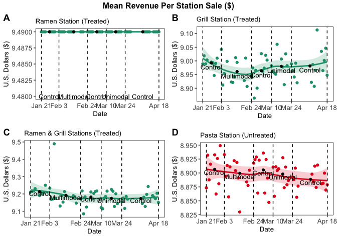<!-- -->

``` r
spring_data %>%
  filter(station=="Grill") %>%
  filter(item_cat=="Main") %>%
  mutate(phase_interval=case_when(date=="21-Jan"~"1",
                                  date=="22-Jan"~"1",
                                  date=="23-Jan"~"1",
                                  date=="24-Jan"~"1",
                                  date=="27-Jan"~"1",
                                  date=="28-Jan"~"1",
                                  date=="29-Jan"~"1",
                                  date=="30-Jan"~"1",
                                  date=="31-Jan"~"1",
                                  date=="3-Feb"~"2",
                                  date=="4-Feb"~"2",
                                  date=="5-Feb"~"2",
                                  date=="6-Feb"~"2",
                                  date=="7-Feb"~"2",
                                  date=="10-Feb"~"2",
                                  date=="11-Feb"~"2",
                                  date=="12-Feb"~"2",
                                  date=="13-Feb"~"2",
                                  date=="14-Feb"~"2",
                                  date=="19-Feb"~"2",
                                  date=="20-Feb"~"2",
                                  date=="21-Feb"~"2",
                                  date=="24-Feb"~"3",
                                  date=="25-Feb"~"3",
                                  date=="26-Feb"~"3",
                                  date=="27-Feb"~"3",
                                  date=="28-Feb"~"3",
                                  date=="3-Mar"~"3",
                                  date=="4-Mar"~"3",
                                  date=="5-Mar"~"3",
                                  date=="6-Mar"~"3",
                                  date=="7-Mar"~"3",
                                  date=="10-Mar"~"4",
                                  date=="11-Mar"~"4",
                                  date=="12-Mar"~"4",
                                  date=="13-Mar"~"4",
                                  date=="14-Mar"~"4",
                                  date=="17-Mar"~"4",
                                  date=="18-Mar"~"4",
                                  date=="19-Mar"~"4",
                                  date=="20-Mar"~"4",
                                  date=="21-Mar"~"4",
                                  date=="24-Mar"~"5",
                                  date=="25-Mar"~"5",
                                  date=="26-Mar"~"5",
                                  date=="27-Mar"~"5",
                                  date=="28-Mar"~"5",
                                  date=="7-Apr"~"5",
                                  date=="8-Apr"~"5",
                                  date=="9-Apr"~"5",
                                  date=="10-Apr"~"5",
                                  date=="11-Apr"~"5",
                                  date=="14-Apr"~"5",
                                  date=="15-Apr"~"5",
                                  date=="16-Apr"~"5",
                                  date=="17-Apr"~"5",
                                  date=="18-Apr"~"5")) %>%
  group_by(phase_interval,item) %>%
  summarise(total_count=sum(count)) %>%
  mutate(prop=case_when(item=="Black Bean Burger"&phase_interval=="1"~total_count/(25+135+814+72+76),
                        item=="Grilled Chicken Breast Sandwich"&phase_interval=="1"~total_count/(25+135+814+72+76),
                        item=="Grilled Hamburger"&phase_interval=="1"~total_count/(25+135+814+72+76),
                        item=="Seared Salmon Burger"&phase_interval=="1"~total_count/(25+135+814+72+76),
                        item=="Trillium Grill Impossible Burger"&phase_interval=="1"~total_count/(25+135+814+72+76),
                        item=="Black Bean Burger"&phase_interval=="2"~total_count/(30+193+1083+97+74),
                        item=="Grilled Chicken Breast Sandwich"&phase_interval=="2"~total_count/(30+193+1083+97+74),
                        item=="Grilled Hamburger"&phase_interval=="2"~total_count/(30+193+1083+97+74),
                        item=="Seared Salmon Burger"&phase_interval=="2"~total_count/(30+193+1083+97+74),
                        item=="Trillium Grill Impossible Burger"&phase_interval=="2"~total_count/(30+193+1083+97+74),
                        item=="Black Bean Burger"&phase_interval=="3"~total_count/(18+167+938+87+66),
                        item=="Grilled Chicken Breast Sandwich"&phase_interval=="3"~total_count/(18+167+938+87+66),
                        item=="Grilled Hamburger"&phase_interval=="3"~total_count/(18+167+938+87+66),
                        item=="Seared Salmon Burger"&phase_interval=="3"~total_count/(18+167+938+87+66),
                        item=="Trillium Grill Impossible Burger"&phase_interval=="3"~total_count/(18+167+938+87+66),
                        item=="Black Bean Burger"&phase_interval=="4"~total_count/(33+160+909+67+74),
                        item=="Grilled Chicken Breast Sandwich"&phase_interval=="4"~total_count/(33+160+909+67+74),
                        item=="Grilled Hamburger"&phase_interval=="4"~total_count/(33+160+909+67+74),
                        item=="Seared Salmon Burger"&phase_interval=="4"~total_count/(33+160+909+67+74),
                        item=="Trillium Grill Impossible Burger"&phase_interval=="4"~total_count/(33+160+909+67+74),
                        item=="Black Bean Burger"&phase_interval=="5"~total_count/(46+250+1352+130+125),
                        item=="Grilled Chicken Breast Sandwich"&phase_interval=="5"~total_count/(46+250+1352+130+125),
                        item=="Grilled Hamburger"&phase_interval=="5"~total_count/(46+250+1352+130+125),
                        item=="Seared Salmon Burger"&phase_interval=="5"~total_count/(46+250+1352+130+125),
                        item=="Trillium Grill Impossible Burger"&phase_interval=="5"~total_count/(46+250+1352+130+125))) %>%
  filter(item=="Grilled Hamburger") 
```

    ## `summarise()` has grouped output by 'phase_interval'. You can override using
    ## the `.groups` argument.

    ## # A tibble: 5 × 4
    ## # Groups:   phase_interval [5]
    ##   phase_interval item              total_count  prop
    ##   <chr>          <chr>                   <int> <dbl>
    ## 1 1              Grilled Hamburger         814 0.725
    ## 2 2              Grilled Hamburger        1083 0.733
    ## 3 3              Grilled Hamburger         938 0.735
    ## 4 4              Grilled Hamburger         909 0.731
    ## 5 5              Grilled Hamburger        1352 0.710

mutate(prop=case_when(item==““&phase_interval==”“~))

``` r
spring_data %>%
  filter(station=="Grill") %>%
  filter(item_cat=="Main") %>%
  group_by(menu_condition,station,item) %>%
  summarise(total_count=sum(count)) %>%
  mutate(prop=case_when(item=="Black Bean Burger"&menu_condition=="Control"~total_count/(89+552+3104+289+267),
                        item=="Grilled Chicken Breast Sandwich"&menu_condition=="Control"~total_count/(89+552+3104+289+267),
                        item=="Grilled Hamburger"&menu_condition=="Control"~total_count/(89+552+3104+289+267),
                        item=="Seared Salmon Burger"&menu_condition=="Control"~total_count/(89+552+3104+289+267),
                        item=="Trillium Grill Impossible Burger"&menu_condition=="Control"~total_count/(89+552+3104+289+267),
                        item=="Black Bean Burger"&menu_condition=="Multimodal"~total_count/(30+193+1083+97+74),
                        item=="Grilled Chicken Breast Sandwich"&menu_condition=="Multimodal"~total_count/(30+193+1083+97+74),
                        item=="Grilled Hamburger"&menu_condition=="Multimodal"~total_count/(30+193+1083+97+74),
                        item=="Seared Salmon Burger"&menu_condition=="Multimodal"~total_count/(30+193+1083+97+74),
                        item=="Trillium Grill Impossible Burger"&menu_condition=="Multimodal"~total_count/(30+193+1083+97+74),
                        item=="Black Bean Burger"&menu_condition=="Unimodal"~total_count/(33+160+909+67+74),
                        item=="Grilled Chicken Breast Sandwich"&menu_condition=="Unimodal"~total_count/(33+160+909+67+74),
                        item=="Grilled Hamburger"&menu_condition=="Unimodal"~total_count/(33+160+909+67+74),
                        item=="Seared Salmon Burger"&menu_condition=="Unimodal"~total_count/(33+160+909+67+74),
                        item=="Trillium Grill Impossible Burger"&menu_condition=="Unimodal"~total_count/(33+160+909+67+74))) 
```

    ## `summarise()` has grouped output by 'menu_condition', 'station'. You can
    ## override using the `.groups` argument.

    ## # A tibble: 15 × 5
    ## # Groups:   menu_condition, station [3]
    ##    menu_condition station item                             total_count   prop
    ##    <chr>          <chr>   <chr>                                  <int>  <dbl>
    ##  1 Control        Grill   Black Bean Burger                         89 0.0207
    ##  2 Control        Grill   Grilled Chicken Breast Sandwich          552 0.128 
    ##  3 Control        Grill   Grilled Hamburger                       3104 0.722 
    ##  4 Control        Grill   Seared Salmon Burger                     289 0.0672
    ##  5 Control        Grill   Trillium Grill Impossible Burger         267 0.0621
    ##  6 Multimodal     Grill   Black Bean Burger                         30 0.0203
    ##  7 Multimodal     Grill   Grilled Chicken Breast Sandwich          193 0.131 
    ##  8 Multimodal     Grill   Grilled Hamburger                       1083 0.733 
    ##  9 Multimodal     Grill   Seared Salmon Burger                      97 0.0657
    ## 10 Multimodal     Grill   Trillium Grill Impossible Burger          74 0.0501
    ## 11 Unimodal       Grill   Black Bean Burger                         33 0.0265
    ## 12 Unimodal       Grill   Grilled Chicken Breast Sandwich          160 0.129 
    ## 13 Unimodal       Grill   Grilled Hamburger                        909 0.731 
    ## 14 Unimodal       Grill   Seared Salmon Burger                      67 0.0539
    ## 15 Unimodal       Grill   Trillium Grill Impossible Burger          74 0.0595

period level

``` r
spring_data <- spring_data %>%
  mutate(phase_interval=case_when(date=="21-Jan"~"1",
                                  date=="22-Jan"~"1",
                                  date=="23-Jan"~"1",
                                  date=="24-Jan"~"1",
                                  date=="27-Jan"~"1",
                                  date=="28-Jan"~"1",
                                  date=="29-Jan"~"1",
                                  date=="30-Jan"~"1",
                                  date=="31-Jan"~"1",
                                  date=="3-Feb"~"2",
                                  date=="4-Feb"~"2",
                                  date=="5-Feb"~"2",
                                  date=="6-Feb"~"2",
                                  date=="7-Feb"~"2",
                                  date=="10-Feb"~"2",
                                  date=="11-Feb"~"2",
                                  date=="12-Feb"~"2",
                                  date=="13-Feb"~"2",
                                  date=="14-Feb"~"2",
                                  date=="19-Feb"~"2",
                                  date=="20-Feb"~"2",
                                  date=="21-Feb"~"2",
                                  date=="24-Feb"~"3",
                                  date=="25-Feb"~"3",
                                  date=="26-Feb"~"3",
                                  date=="27-Feb"~"3",
                                  date=="28-Feb"~"3",
                                  date=="3-Mar"~"3",
                                  date=="4-Mar"~"3",
                                  date=="5-Mar"~"3",
                                  date=="6-Mar"~"3",
                                  date=="7-Mar"~"3",
                                  date=="10-Mar"~"4",
                                  date=="11-Mar"~"4",
                                  date=="12-Mar"~"4",
                                  date=="13-Mar"~"4",
                                  date=="14-Mar"~"4",
                                  date=="17-Mar"~"4",
                                  date=="18-Mar"~"4",
                                  date=="19-Mar"~"4",
                                  date=="20-Mar"~"4",
                                  date=="21-Mar"~"4",
                                  date=="24-Mar"~"5",
                                  date=="25-Mar"~"5",
                                  date=="26-Mar"~"5",
                                  date=="27-Mar"~"5",
                                  date=="28-Mar"~"5",
                                  date=="7-Apr"~"5",
                                  date=="8-Apr"~"5",
                                  date=="9-Apr"~"5",
                                  date=="10-Apr"~"5",
                                  date=="11-Apr"~"5",
                                  date=="14-Apr"~"5",
                                  date=="15-Apr"~"5",
                                  date=="16-Apr"~"5",
                                  date=="17-Apr"~"5",
                                  date=="18-Apr"~"5")) 
```

fall_data %\>% filter(station_type==“Treatment”) %\>%
filter(item_cat==“Main”) %\>% group_by(menu_condition,station) %\>%
summarise(tot_carbon_cost=sum(corr_carbon_cost),tot_water_cost=sum(corr_water_cost),tot_dollar_cost=sum(corr_dollar_cost),tot_sales=sum(count))
%\>% mutate(mean_carbon_cost=tot_carbon_cost/tot_sales) %\>%
mutate(mean_water_cost=tot_water_cost/tot_sales) %\>%
mutate(mean_spend=tot_dollar_cost/tot_sales) %\>%
filter(station==“Grill”) %\>%
select(menu_condition,mean_carbon_cost,mean_spend)

``` r
spring_data %>%
  filter(station=="Grill") %>%
  filter(item_cat=="Main") %>%
  group_by(phase_interval) %>%
  summarise(tot_carbon_cost=sum(corr_carbon_cost),tot_dollar_cost=sum(corr_dollar_cost),tot_sales=sum(count)) %>%
  mutate(mean_carbon_cost=tot_carbon_cost/tot_sales) %>%
  mutate(mean_spend=tot_dollar_cost/tot_sales) %>%
  select(phase_interval,mean_carbon_cost,mean_spend)
```

    ## # A tibble: 5 × 3
    ##   phase_interval mean_carbon_cost mean_spend
    ##   <chr>                     <dbl>      <dbl>
    ## 1 1                          2.90       8.99
    ## 2 2                          2.93       8.96
    ## 3 3                          2.94       8.96
    ## 4 4                          2.92       8.98
    ## 5 5                          2.84       8.98

daily

``` r
daily_prop_spring_data <- spring_data %>%
  filter(station=="Grill") %>%
  filter(item_cat=="Main") %>%
  group_by(date,phase_interval,item) %>%
  summarise(total_count=sum(count)) %>%
  mutate(prop=case_when(date=="10-Apr"~total_count/(6+17+90+10+8),
                        date=="10-Feb"~total_count/(4+14+101+14+4),
                        date=="10-Mar"~total_count/(3+13+86+8+7),
                        date=="11-Apr"~total_count/(1+9+72+7+14),
                        date=="11-Feb"~total_count/(3+26+86+8+6),
                        date=="11-Mar"~total_count/(3+20+118+5+6),
                        date=="12-Feb"~total_count/(3+21+101+12+7),
                        date=="12-Mar"~total_count/(6+19+89+7+7),
                        date=="13-Feb"~total_count/(3+12+83+11+10),
                        date=="13-Mar"~total_count/(17+99+8+5),
                        date=="14-Apr"~total_count/(3+19+79+10+14),
                        date=="14-Feb"~total_count/(2+5+72+5+4),
                        date=="14-Mar"~total_count/(1+11+76+4+10),
                        date=="15-Apr"~total_count/(2+20+101+10+8),
                        date=="16-Apr"~total_count/(3+13+103+9+9),
                        date=="17-Apr"~total_count/(2+16+113+5+13),
                        date=="17-Mar"~total_count/(8+17+77+10+12),
                        date=="18-Apr"~total_count/(2+6+76+10+3),
                        date=="18-Mar"~total_count/(3+16+80+6+7),
                        date=="19-Feb"~total_count/(1+17+84+5+3),
                        date=="19-Mar"~total_count/(5+20+96+6+3),
                        date=="20-Feb"~total_count/(4+17+102+5+10),
                        date=="20-Mar"~total_count/(3+18+103+6+12),
                        date=="21-Feb"~total_count/(2+17+73+8+3),
                        date=="21-Jan"~total_count/(2+17+94+6+8),
                        date=="21-Mar"~total_count/(1+9+85+7+5),
                        date=="22-Jan"~total_count/(3+14+105+9+11),
                        date=="23-Jan"~total_count/(2+15+94+11+9),
                        date=="24-Feb"~total_count/(1+15+95+14+6),
                        date=="24-Jan"~total_count/(1+13+63+5+7),
                        date=="24-Mar"~total_count/(2+23+81+15+13),
                        date=="25-Feb"~total_count/(4+20+102+6+8),
                        date=="25-Mar"~total_count/(5+15+122+8+6),
                        date=="26-Feb"~total_count/(1+28+90+15+3),
                        date=="26-Mar"~total_count/(7+19+108+6+5),
                        date=="27-Feb"~total_count/(2+17+105+13+8),
                        date=="27-Jan"~total_count/(4+22+92+10+12),
                        date=="27-Mar"~total_count/(1+10+99+10+7),
                        date=="28-Feb"~total_count/(1+14+72+9+2),
                        date=="28-Jan"~total_count/(5+19+105+7+10),
                        date=="28-Mar"~total_count/(5+8+29+5+3),
                        date=="29-Jan"~total_count/(4+12+88+11+5),
                        date=="3-Feb"~total_count/(15+90+8+12),
                        date=="3-Mar"~total_count/(2+16+95+9+12),
                        date=="30-Jan"~total_count/(3+14+109+8+8),
                        date=="31-Jan"~total_count/(1+9+64+5+6),
                        date=="4-Feb"~total_count/(3+19+108+7+2),
                        date=="4-Mar"~total_count/(2+21+104+10+8),
                        date=="5-Feb"~total_count/(3+23+97+6+7),
                        date=="5-Mar"~total_count/(3+16+86+4+6),
                        date=="6-Mar"~total_count/(1+12+114+3+8),
                        date=="7-Apr"~total_count/(4+17+77+4+3),
                        date=="7-Feb"~total_count/(2+7+86+8+6),
                        date=="7-Mar"~total_count/(1+8+75+4+5),
                        date=="8-Apr"~total_count/(2+28+113+11+13),
                        date=="9-Apr"~total_count/(1+30+89+10+6))) %>%
  mutate(date=case_when(date=="10-Apr"~"2025-4-10",
                        date=="10-Feb"~"2025-2-10",
                        date=="10-Mar"~"2025-3-10",
                        date=="11-Apr"~"2025-4-11",
                        date=="11-Feb"~"2025-2-11",
                        date=="11-Mar"~"2025-3-11",
                        date=="12-Feb"~"2025-2-12",
                        date=="12-Mar"~"2025-3-12",
                        date=="13-Feb"~"2025-2-13",
                        date=="13-Mar"~"2025-3-13",
                        date=="14-Apr"~"2025-4-14",
                        date=="14-Feb"~"2025-2-14",
                        date=="14-Mar"~"2025-3-14",
                        date=="15-Apr"~"2025-4-15",
                        date=="16-Apr"~"2025-4-16",
                        date=="17-Apr"~"2025-4-17",
                        date=="17-Mar"~"2025-3-17",
                        date=="18-Apr"~"2025-4-18",
                        date=="18-Mar"~"2025-3-18",
                        date=="19-Feb"~"2025-2-19",
                        date=="19-Mar"~"2025-3-19",
                        date=="20-Feb"~"2025-2-20",
                        date=="20-Mar"~"2025-3-20",
                        date=="21-Feb"~"2025-2-21",
                        date=="21-Jan"~"2025-1-21",
                        date=="21-Mar"~"2025-3-21",
                        date=="22-Jan"~"2025-1-22",
                        date=="23-Jan"~"2025-1-23",
                        date=="24-Feb"~"2025-2-24",
                        date=="24-Jan"~"2025-1-24",
                        date=="24-Mar"~"2025-3-24",
                        date=="25-Feb"~"2025-2-25",
                        date=="25-Mar"~"2025-3-25",
                        date=="26-Feb"~"2025-2-26",
                        date=="26-Mar"~"2025-3-26",
                        date=="27-Feb"~"2025-2-27",
                        date=="27-Jan"~"2025-1-27",
                        date=="27-Mar"~"2025-3-27",
                        date=="28-Feb"~"2025-2-28",
                        date=="28-Jan"~"2025-1-28",
                        date=="28-Mar"~"2025-3-28",
                        date=="29-Jan"~"2025-1-29",
                        date=="3-Feb"~"2025-2-3",
                        date=="3-Mar"~"2025-3-3",
                        date=="30-Jan"~"2025-1-30",
                        date=="31-Jan"~"2025-1-31",
                        date=="4-Feb"~"2025-2-4",
                        date=="4-Mar"~"2025-3-4",
                        date=="5-Feb"~"2025-2-5",
                        date=="5-Mar"~"2025-3-5",
                        date=="6-Feb"~"2025-2-6",
                        date=="6-Mar"~"2025-3-6",
                        date=="7-Apr"~"2025-4-7",
                        date=="7-Feb"~"2025-2-7",
                        date=="7-Mar"~"2025-3-7",
                        date=="8-Apr"~"2025-4-8",
                        date=="9-Apr"~"2025-4-9")) %>%
  mutate(date=as.Date(date)) 
```

    ## `summarise()` has grouped output by 'date', 'phase_interval'. You can override
    ## using the `.groups` argument.

``` r
daily_prop_spring_data
```

    ## # A tibble: 278 × 5
    ## # Groups:   date, phase_interval [56]
    ##    date       phase_interval item                             total_count   prop
    ##    <date>     <chr>          <chr>                                  <int>  <dbl>
    ##  1 2025-04-10 5              Black Bean Burger                          6 0.0458
    ##  2 2025-04-10 5              Grilled Chicken Breast Sandwich           17 0.130 
    ##  3 2025-04-10 5              Grilled Hamburger                         90 0.687 
    ##  4 2025-04-10 5              Seared Salmon Burger                      10 0.0763
    ##  5 2025-04-10 5              Trillium Grill Impossible Burger           8 0.0611
    ##  6 2025-02-10 2              Black Bean Burger                          4 0.0292
    ##  7 2025-02-10 2              Grilled Chicken Breast Sandwich           14 0.102 
    ##  8 2025-02-10 2              Grilled Hamburger                        101 0.737 
    ##  9 2025-02-10 2              Seared Salmon Burger                      14 0.102 
    ## 10 2025-02-10 2              Trillium Grill Impossible Burger           4 0.0292
    ## # ℹ 268 more rows

``` r
spring_vline <- as.Date(c("2025-01-21","2025-02-03","2025-02-24","2025-03-10","2025-03-24","2025-04-18")) 
spring_vline <- which(daily_prop_spring_data$date %in% spring_vline)
```

``` r
spring_data %>%
  filter(station=="Grill") %>%
  filter(item_cat=="Main") %>%
  group_by(phase_interval,station,item) %>%
  summarise(total_count=sum(count)) %>%
  mutate(prop=case_when(phase_interval=="1"~total_count/(25+135+814+72+76),
                        phase_interval=="2"~total_count/(30+193+1083+97+74),
                        phase_interval=="3"~total_count/(18+167+938+87+66),
                        phase_interval=="4"~total_count/(33+160+909+67+74),
                        phase_interval=="5"~total_count/(45+250+1352+130+125))) %>%
  filter(item=="Black Bean Burger")
```

    ## `summarise()` has grouped output by 'phase_interval', 'station'. You can
    ## override using the `.groups` argument.

    ## # A tibble: 5 × 5
    ## # Groups:   phase_interval, station [5]
    ##   phase_interval station item              total_count   prop
    ##   <chr>          <chr>   <chr>                   <int>  <dbl>
    ## 1 1              Grill   Black Bean Burger          25 0.0223
    ## 2 2              Grill   Black Bean Burger          30 0.0203
    ## 3 3              Grill   Black Bean Burger          18 0.0141
    ## 4 4              Grill   Black Bean Burger          33 0.0265
    ## 5 5              Grill   Black Bean Burger          46 0.0242

``` r
daily_prop_spring_data
```

    ## # A tibble: 278 × 5
    ## # Groups:   date, phase_interval [56]
    ##    date       phase_interval item                             total_count   prop
    ##    <date>     <chr>          <chr>                                  <int>  <dbl>
    ##  1 2025-04-10 5              Black Bean Burger                          6 0.0458
    ##  2 2025-04-10 5              Grilled Chicken Breast Sandwich           17 0.130 
    ##  3 2025-04-10 5              Grilled Hamburger                         90 0.687 
    ##  4 2025-04-10 5              Seared Salmon Burger                      10 0.0763
    ##  5 2025-04-10 5              Trillium Grill Impossible Burger           8 0.0611
    ##  6 2025-02-10 2              Black Bean Burger                          4 0.0292
    ##  7 2025-02-10 2              Grilled Chicken Breast Sandwich           14 0.102 
    ##  8 2025-02-10 2              Grilled Hamburger                        101 0.737 
    ##  9 2025-02-10 2              Seared Salmon Burger                      14 0.102 
    ## 10 2025-02-10 2              Trillium Grill Impossible Burger           4 0.0292
    ## # ℹ 268 more rows

``` r
spring_prop_low_ramen_aov_data <- daily_prop_spring_data %>%
  ungroup() %>%
  filter(item=="Black Bean Burger") %>%
  select(phase_interval,prop) %>%
  arrange(phase_interval) 
shapiro.test(spring_prop_low_ramen_aov_data$prop) 
```

    ## 
    ##  Shapiro-Wilk normality test
    ## 
    ## data:  spring_prop_low_ramen_aov_data$prop
    ## W = 0.77446, p-value = 1.055e-07

``` r
oneway.test(prop~phase_interval,data=spring_prop_low_ramen_aov_data,var.equal=TRUE)
```

    ## 
    ##  One-way analysis of means
    ## 
    ## data:  prop and phase_interval
    ## F = 1.4755, num df = 4, denom df = 49, p-value = 0.224

``` r
spring_prop_low_grill <- daily_prop_spring_data %>%
  filter(item=="Black Bean Burger") %>%
  mutate(item=case_when(item=="Black Bean Burger"~"Lowest-Carbon Offering")) %>%
  ggplot(aes(x=date,y=prop,color=item,fill=item)) + 
  geom_smooth(alpha=0.2) + 
  geom_point() + 
  geom_vline(xintercept=as.numeric(daily_prop_spring_data$date[spring_vline]),linetype=2) +
  xlab("Date") + 
  ylab("Proportion of Station Sales") + 
  scale_color_brewer(palette="Dark2",name="") +
  scale_fill_brewer(palette="Dark2",name="") +
  scale_x_date(breaks=as.Date(c("2025-01-21","2025-02-03","2025-02-24","2025-03-10","2025-03-24","2025-04-18")),labels=c("Jan 21","Feb 3","Feb 24","Mar 10","Mar 24","Apr 18")) +
  annotate("text",x=as.Date("2025-01-27"),y=0.01828164,label="Control",size=10/.pt) +
  annotate("text",x=as.Date("2025-02-14"),y=0.01631144,label="Multimodal",size=10/.pt) +
  annotate("text",x=as.Date("2025-03-03"),y=0.01010658,label="Control",size=10/.pt) +
  annotate("text",x=as.Date("2025-03-17"),y=0.02254867,label="Unimodal",size=10/.pt) +
  annotate("text",x=as.Date("2025-04-06"),y=0.02018507,label="Control",size=10/.pt) +
  annotate("point",x=as.Date("2025-01-27"),y=0.02228164) +
  annotate("point",x=as.Date("2025-02-14"),y=0.02031144) +
  annotate("point",x=as.Date("2025-03-03"),y=0.01410658) +
  annotate("point",x=as.Date("2025-03-17"),y=0.02654867) +
  annotate("point",x=as.Date("2025-04-06"),y=0.02418507) +
  labs(title="Grill Station (Treated)",caption="F(4,49)=1.4755,p=0.224") +
  theme(aspect.ratio=0.55,legend.position="bottom",panel.grid=element_blank(),panel.background=element_rect(fill="white"),panel.border=element_rect(fill=NA),legend.title=element_text(size=10),legend.text=element_text(size=10),plot.title=element_text(size=10),axis.title=element_text(size=10),axis.text=element_text(size=10)) 
spring_prop_low_grill
```

    ## `geom_smooth()` using method = 'loess' and formula = 'y ~ x'

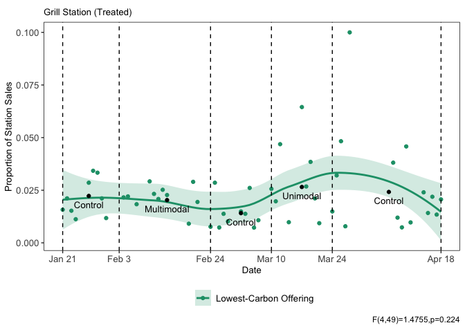<!-- -->

FOR RAMEN STATION

``` r
spring_data %>%
  filter(station=="Ramen") %>%
  filter(item_cat=="Main") %>%
  group_by(phase_interval,station,item) %>%
  summarise(total_count=sum(count)) %>%
  mutate(prop=case_when(phase_interval=="1"~total_count/(740+152),
                        phase_interval=="2"~total_count/(928+213),
                        phase_interval=="3"~total_count/(726+176),
                        phase_interval=="4"~total_count/(602+163),
                        phase_interval=="5"~total_count/(890+262))) %>%
  filter(item=="Bowl Ramen Tofu")
```

    ## `summarise()` has grouped output by 'phase_interval', 'station'. You can
    ## override using the `.groups` argument.

    ## # A tibble: 5 × 5
    ## # Groups:   phase_interval, station [5]
    ##   phase_interval station item            total_count  prop
    ##   <chr>          <chr>   <chr>                 <int> <dbl>
    ## 1 1              Ramen   Bowl Ramen Tofu         152 0.170
    ## 2 2              Ramen   Bowl Ramen Tofu         213 0.187
    ## 3 3              Ramen   Bowl Ramen Tofu         176 0.195
    ## 4 4              Ramen   Bowl Ramen Tofu         163 0.213
    ## 5 5              Ramen   Bowl Ramen Tofu         262 0.227

``` r
spring_prop_low_ramen_aov_data <- spring_data %>%
  filter(station=="Ramen") %>%
  filter(item_cat=="Main") %>%
  group_by(date,phase_interval,station,item) %>%
  summarise(total_count=sum(count)) %>%
  mutate(prop=case_when(date=="10-Apr"~total_count/(80+24),
                        date=="10-Feb"~total_count/(58+21),
                        date=="10-Mar"~total_count/(38+6),
                        date=="11-Apr"~total_count/(46+8),
                        date=="11-Feb"~total_count/(95+20),
                        date=="11-Mar"~total_count/(51+11),
                        date=="12-Feb"~total_count/(79+11),
                        date=="12-Mar"~total_count/(72+17),
                        date=="13-Feb"~total_count/(66+21),
                        date=="13-Mar"~total_count/(75+24),
                        date=="14-Apr"~total_count/(38+27),
                        date=="14-Feb"~total_count/(43+15),
                        date=="14-Mar"~total_count/(47+11),
                        date=="15-Apr"~total_count/(71+28),
                        date=="16-Apr"~total_count/(61+13),
                        date=="17-Apr"~total_count/(58+24),
                        date=="17-Mar"~total_count/(84+19),
                        date=="18-Apr"~total_count/(46+12),
                        date=="18-Mar"~total_count/(74+23),
                        date=="19-Feb"~total_count/(81+15),
                        date=="19-Mar"~total_count/(62+15),
                        date=="20-Feb"~total_count/(62+15),
                        date=="20-Mar"~total_count/(59+27),
                        date=="21-Feb"~total_count/(58+14),
                        date=="21-Jan"~total_count/(83+19),
                        date=="21-Mar"~total_count/(40+10),
                        date=="22-Jan"~total_count/(90+12),
                        date=="23-Jan"~total_count/(92+18),
                        date=="24-Feb"~total_count/(79+14),
                        date=="24-Jan"~total_count/(67+11),
                        date=="24-Mar"~total_count/(54+13),
                        date=="25-Feb"~total_count/(101+24),
                        date=="25-Mar"~total_count/(86+19),
                        date=="26-Feb"~total_count/(63+12),
                        date=="26-Mar"~total_count/(52+16),
                        date=="27-Feb"~total_count/(85+18),
                        date=="27-Jan"~total_count/(80+11),
                        date=="27-Mar"~total_count/(61+20),
                        date=="28-Feb"~total_count/(49+11),
                        date=="28-Jan"~total_count/(88+21),
                        date=="28-Mar"~total_count/(33+6),
                        date=="29-Jan"~total_count/(85+21),
                        date=="3-Feb"~total_count/(81+12),
                        date=="3-Mar"~total_count/(72+17),
                        date=="30-Jan"~total_count/(83+26),
                        date=="31-Jan"~total_count/(72+13),
                        date=="4-Feb"~total_count/(86+25),
                        date=="4-Mar"~total_count/(75+20),
                        date=="5-Feb"~total_count/(78+14),
                        date=="5-Mar"~total_count/(72+20),
                        date=="6-Feb"~total_count/(98+12),
                        date=="6-Mar"~total_count/(73+24),
                        date=="7-Apr"~total_count/(51+17),
                        date=="7-Feb"~total_count/(43+18),
                        date=="7-Mar"~total_count/(57+16),
                        date=="8-Apr"~total_count/(84+21),
                        date=="9-Apr"~total_count/(69+14))) %>%
  mutate(date=case_when(date=="10-Apr"~"2025-4-10",
                        date=="10-Feb"~"2025-2-10",
                        date=="10-Mar"~"2025-3-10",
                        date=="11-Apr"~"2025-4-11",
                        date=="11-Feb"~"2025-2-11",
                        date=="11-Mar"~"2025-3-11",
                        date=="12-Feb"~"2025-2-12",
                        date=="12-Mar"~"2025-3-12",
                        date=="13-Feb"~"2025-2-13",
                        date=="13-Mar"~"2025-3-13",
                        date=="14-Apr"~"2025-4-14",
                        date=="14-Feb"~"2025-2-14",
                        date=="14-Mar"~"2025-3-14",
                        date=="15-Apr"~"2025-4-15",
                        date=="16-Apr"~"2025-4-16",
                        date=="17-Apr"~"2025-4-17",
                        date=="17-Mar"~"2025-3-17",
                        date=="18-Apr"~"2025-4-18",
                        date=="18-Mar"~"2025-3-18",
                        date=="19-Feb"~"2025-2-19",
                        date=="19-Mar"~"2025-3-19",
                        date=="20-Feb"~"2025-2-20",
                        date=="20-Mar"~"2025-3-20",
                        date=="21-Feb"~"2025-2-21",
                        date=="21-Jan"~"2025-1-21",
                        date=="21-Mar"~"2025-3-21",
                        date=="22-Jan"~"2025-1-22",
                        date=="23-Jan"~"2025-1-23",
                        date=="24-Feb"~"2025-2-24",
                        date=="24-Jan"~"2025-1-24",
                        date=="24-Mar"~"2025-3-24",
                        date=="25-Feb"~"2025-2-25",
                        date=="25-Mar"~"2025-3-25",
                        date=="26-Feb"~"2025-2-26",
                        date=="26-Mar"~"2025-3-26",
                        date=="27-Feb"~"2025-2-27",
                        date=="27-Jan"~"2025-1-27",
                        date=="27-Mar"~"2025-3-27",
                        date=="28-Feb"~"2025-2-28",
                        date=="28-Jan"~"2025-1-28",
                        date=="28-Mar"~"2025-3-28",
                        date=="29-Jan"~"2025-1-29",
                        date=="3-Feb"~"2025-2-3",
                        date=="3-Mar"~"2025-3-3",
                        date=="30-Jan"~"2025-1-30",
                        date=="31-Jan"~"2025-1-31",
                        date=="4-Feb"~"2025-2-4",
                        date=="4-Mar"~"2025-3-4",
                        date=="5-Feb"~"2025-2-5",
                        date=="5-Mar"~"2025-3-5",
                        date=="6-Feb"~"2025-2-6",
                        date=="6-Mar"~"2025-3-6",
                        date=="7-Apr"~"2025-4-7",
                        date=="7-Feb"~"2025-2-7",
                        date=="7-Mar"~"2025-3-7",
                        date=="8-Apr"~"2025-4-8",
                        date=="9-Apr"~"2025-4-9")) %>%
  filter(item=="Bowl Ramen Tofu") %>%
  ungroup() %>%
  select(phase_interval,prop) %>%
  arrange(phase_interval)
```

    ## `summarise()` has grouped output by 'date', 'phase_interval', 'station'. You
    ## can override using the `.groups` argument.

``` r
shapiro.test(spring_prop_low_ramen_aov_data$prop) 
```

    ## 
    ##  Shapiro-Wilk normality test
    ## 
    ## data:  spring_prop_low_ramen_aov_data$prop
    ## W = 0.93245, p-value = 0.003391

``` r
oneway.test(prop~phase_interval,data=spring_prop_low_ramen_aov_data,var.equal=TRUE)
```

    ## 
    ##  One-way analysis of means
    ## 
    ## data:  prop and phase_interval
    ## F = 1.7531, num df = 4, denom df = 52, p-value = 0.1525

``` r
spring_prop_low_ramen <- spring_data %>%
  filter(station=="Ramen") %>%
  filter(item_cat=="Main") %>%
  group_by(date,phase_interval,station,item) %>%
  summarise(total_count=sum(count)) %>%
  mutate(prop=case_when(date=="10-Apr"~total_count/(80+24),
                        date=="10-Feb"~total_count/(58+21),
                        date=="10-Mar"~total_count/(38+6),
                        date=="11-Apr"~total_count/(46+8),
                        date=="11-Feb"~total_count/(95+20),
                        date=="11-Mar"~total_count/(51+11),
                        date=="12-Feb"~total_count/(79+11),
                        date=="12-Mar"~total_count/(72+17),
                        date=="13-Feb"~total_count/(66+21),
                        date=="13-Mar"~total_count/(75+24),
                        date=="14-Apr"~total_count/(38+27),
                        date=="14-Feb"~total_count/(43+15),
                        date=="14-Mar"~total_count/(47+11),
                        date=="15-Apr"~total_count/(71+28),
                        date=="16-Apr"~total_count/(61+13),
                        date=="17-Apr"~total_count/(58+24),
                        date=="17-Mar"~total_count/(84+19),
                        date=="18-Apr"~total_count/(46+12),
                        date=="18-Mar"~total_count/(74+23),
                        date=="19-Feb"~total_count/(81+15),
                        date=="19-Mar"~total_count/(62+15),
                        date=="20-Feb"~total_count/(62+15),
                        date=="20-Mar"~total_count/(59+27),
                        date=="21-Feb"~total_count/(58+14),
                        date=="21-Jan"~total_count/(83+19),
                        date=="21-Mar"~total_count/(40+10),
                        date=="22-Jan"~total_count/(90+12),
                        date=="23-Jan"~total_count/(92+18),
                        date=="24-Feb"~total_count/(79+14),
                        date=="24-Jan"~total_count/(67+11),
                        date=="24-Mar"~total_count/(54+13),
                        date=="25-Feb"~total_count/(101+24),
                        date=="25-Mar"~total_count/(86+19),
                        date=="26-Feb"~total_count/(63+12),
                        date=="26-Mar"~total_count/(52+16),
                        date=="27-Feb"~total_count/(85+18),
                        date=="27-Jan"~total_count/(80+11),
                        date=="27-Mar"~total_count/(61+20),
                        date=="28-Feb"~total_count/(49+11),
                        date=="28-Jan"~total_count/(88+21),
                        date=="28-Mar"~total_count/(33+6),
                        date=="29-Jan"~total_count/(85+21),
                        date=="3-Feb"~total_count/(81+12),
                        date=="3-Mar"~total_count/(72+17),
                        date=="30-Jan"~total_count/(83+26),
                        date=="31-Jan"~total_count/(72+13),
                        date=="4-Feb"~total_count/(86+25),
                        date=="4-Mar"~total_count/(75+20),
                        date=="5-Feb"~total_count/(78+14),
                        date=="5-Mar"~total_count/(72+20),
                        date=="6-Feb"~total_count/(98+12),
                        date=="6-Mar"~total_count/(73+24),
                        date=="7-Apr"~total_count/(51+17),
                        date=="7-Feb"~total_count/(43+18),
                        date=="7-Mar"~total_count/(57+16),
                        date=="8-Apr"~total_count/(84+21),
                        date=="9-Apr"~total_count/(69+14))) %>%
  mutate(date=case_when(date=="10-Apr"~"2025-4-10",
                        date=="10-Feb"~"2025-2-10",
                        date=="10-Mar"~"2025-3-10",
                        date=="11-Apr"~"2025-4-11",
                        date=="11-Feb"~"2025-2-11",
                        date=="11-Mar"~"2025-3-11",
                        date=="12-Feb"~"2025-2-12",
                        date=="12-Mar"~"2025-3-12",
                        date=="13-Feb"~"2025-2-13",
                        date=="13-Mar"~"2025-3-13",
                        date=="14-Apr"~"2025-4-14",
                        date=="14-Feb"~"2025-2-14",
                        date=="14-Mar"~"2025-3-14",
                        date=="15-Apr"~"2025-4-15",
                        date=="16-Apr"~"2025-4-16",
                        date=="17-Apr"~"2025-4-17",
                        date=="17-Mar"~"2025-3-17",
                        date=="18-Apr"~"2025-4-18",
                        date=="18-Mar"~"2025-3-18",
                        date=="19-Feb"~"2025-2-19",
                        date=="19-Mar"~"2025-3-19",
                        date=="20-Feb"~"2025-2-20",
                        date=="20-Mar"~"2025-3-20",
                        date=="21-Feb"~"2025-2-21",
                        date=="21-Jan"~"2025-1-21",
                        date=="21-Mar"~"2025-3-21",
                        date=="22-Jan"~"2025-1-22",
                        date=="23-Jan"~"2025-1-23",
                        date=="24-Feb"~"2025-2-24",
                        date=="24-Jan"~"2025-1-24",
                        date=="24-Mar"~"2025-3-24",
                        date=="25-Feb"~"2025-2-25",
                        date=="25-Mar"~"2025-3-25",
                        date=="26-Feb"~"2025-2-26",
                        date=="26-Mar"~"2025-3-26",
                        date=="27-Feb"~"2025-2-27",
                        date=="27-Jan"~"2025-1-27",
                        date=="27-Mar"~"2025-3-27",
                        date=="28-Feb"~"2025-2-28",
                        date=="28-Jan"~"2025-1-28",
                        date=="28-Mar"~"2025-3-28",
                        date=="29-Jan"~"2025-1-29",
                        date=="3-Feb"~"2025-2-3",
                        date=="3-Mar"~"2025-3-3",
                        date=="30-Jan"~"2025-1-30",
                        date=="31-Jan"~"2025-1-31",
                        date=="4-Feb"~"2025-2-4",
                        date=="4-Mar"~"2025-3-4",
                        date=="5-Feb"~"2025-2-5",
                        date=="5-Mar"~"2025-3-5",
                        date=="6-Feb"~"2025-2-6",
                        date=="6-Mar"~"2025-3-6",
                        date=="7-Apr"~"2025-4-7",
                        date=="7-Feb"~"2025-2-7",
                        date=="7-Mar"~"2025-3-7",
                        date=="8-Apr"~"2025-4-8",
                        date=="9-Apr"~"2025-4-9")) %>%
  filter(item=="Bowl Ramen Tofu") %>% ### Lowest-carbon offering
  mutate(date=as.Date(date)) %>%
  mutate(item=case_when(item=="Bowl Ramen Tofu"~"Lowest-Carbon Offering")) %>%
  ggplot(aes(x=date,y=prop,color=item,fill=item)) + 
  geom_smooth(alpha=0.2) + 
  geom_point() +
  geom_vline(xintercept=as.numeric(daily_prop_spring_data$date[spring_vline]),linetype=2) + 
  xlab("Date") + 
  ylab("Proportion of Station Sales") + 
  scale_color_brewer(palette="Dark2",name="") +
  scale_fill_brewer(palette="Dark2",name="") +
  scale_x_date(breaks=as.Date(c("2025-01-21","2025-02-03","2025-02-24","2025-03-10","2025-03-24","2025-04-18")),labels=c("Jan 21","Feb 3","Feb 24","Mar 10","Mar 24","Apr 18")) +
  annotate("text",x=as.Date("2025-01-27"),y=0.1504036,label="Control",size=10/.pt) +
  annotate("text",x=as.Date("2025-02-14"),y=0.1666784,label="Multimodal",size=10/.pt) +
  annotate("text",x=as.Date("2025-03-03"),y=0.1751220,label="Control",size=10/.pt) +
  annotate("text",x=as.Date("2025-03-17"),y=0.1930719,label="Unimodal",size=10/.pt) +
  annotate("text",x=as.Date("2025-04-06"),y=0.2074306,label="Control",size=10/.pt) +
  annotate("point",x=as.Date("2025-01-27"),y=0.1704036) +
  annotate("point",x=as.Date("2025-02-14"),y=0.1866784) +
  annotate("point",x=as.Date("2025-03-03"),y=0.1951220) +
  annotate("point",x=as.Date("2025-03-17"),y=0.2130719) +
  annotate("point",x=as.Date("2025-04-06"),y=0.2274306) +
  labs(title="Ramen Station (Treated)",caption="F(4,52)=1.7531, p=0.1525") +
  theme(aspect.ratio=0.55,legend.position="bottom",panel.grid=element_blank(),panel.background=element_rect(fill="white"),panel.border=element_rect(fill=NA),legend.title=element_text(size=10),legend.text=element_text(size=10),plot.title=element_text(size=10),axis.title=element_text(size=10),axis.text=element_text(size=10)) 
```

    ## `summarise()` has grouped output by 'date', 'phase_interval', 'station'. You
    ## can override using the `.groups` argument.

``` r
spring_prop_low_ramen
```

    ## `geom_smooth()` using method = 'loess' and formula = 'y ~ x'

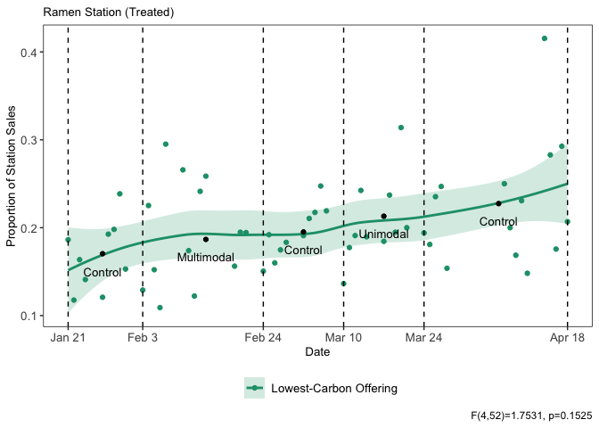<!-- -->

FOR AGGREGATE

``` r
spring_data %>%
  filter(station=="Ramen"|station=="Grill") %>%
  filter(item_cat=="Main") %>%
  group_by(phase_interval,station,item) %>%
  summarise(total_count=sum(count))  %>%
  mutate(prop=case_when(phase_interval=="1"~total_count/(25+135+814+72+76+740+152),
                        phase_interval=="2"~total_count/(30+193+1083+97+74+928+213),
                        phase_interval=="3"~total_count/(18+167+938+87+66+726+176),
                        phase_interval=="4"~total_count/(33+160+909+67+74+602+163),
                        phase_interval=="5"~total_count/(46+250+1352+130+125+890+262))) %>%
   mutate(item=case_when(item=="Bowl Ramen Tofu"~"Lowest-Carbon Offering",
                        item=="Black Bean Burger"~"Lowest-Carbon Offering",
                        item=="Bowl Ramen Chicken"~"Highest-Carbon Offering",
                        item=="Grilled Hamburger"~"Highest-Carbon Offering",
                        item=="Grilled Chicken Breast Sandwich"~"Middle",
                        item=="Seared Salmon Burger"~"Middle",
                        item=="Trillium Grill Impossible Burger"~"Middle")) %>%
  ungroup() %>%
  group_by(phase_interval,item) %>%
  summarise(prop=sum(prop)) %>%
  filter(item=="Lowest-Carbon Offering")
```

    ## `summarise()` has grouped output by 'phase_interval', 'station'. You can
    ## override using the `.groups` argument.
    ## `summarise()` has grouped output by 'phase_interval'. You can override using
    ## the `.groups` argument.

    ## # A tibble: 5 × 3
    ## # Groups:   phase_interval [5]
    ##   phase_interval item                     prop
    ##   <chr>          <chr>                   <dbl>
    ## 1 1              Lowest-Carbon Offering 0.0879
    ## 2 2              Lowest-Carbon Offering 0.0928
    ## 3 3              Lowest-Carbon Offering 0.0891
    ## 4 4              Lowest-Carbon Offering 0.0976
    ## 5 5              Lowest-Carbon Offering 0.101

``` r
spring_prop_low_treatment_aov_data <- spring_data %>%
  filter(station=="Ramen"|station=="Grill") %>%
  filter(item_cat=="Main") %>%
  group_by(date,phase_interval,station,item) %>%
  summarise(total_count=sum(count)) %>%
  mutate(item=case_when(item=="Bowl Ramen Tofu"~"Lowest-Carbon Offering",
                        item=="Black Bean Burger"~"Lowest-Carbon Offering",
                        item=="Bowl Ramen Chicken"~"High",
                        item=="Grilled Hamburger"~"High",
                        item=="Grilled Chicken Breast Sandwich"~"Middle",
                        item=="Seared Salmon Burger"~"Middle",
                        item=="Trillium Grill Impossible Burger"~"Middle")) %>%
  ungroup() %>%
  group_by(date,phase_interval,item) %>%
  summarise(total_count=sum(total_count)) %>%
  mutate(prop=case_when(date=="10-Apr"~total_count/(170+30+35),
                        date=="10-Feb"~total_count/(159+25+32),
                        date=="10-Mar"~total_count/(124+9+28),
                        date=="11-Apr"~total_count/(118+9+30),
                        date=="11-Feb"~total_count/(181+23+40),
                        date=="11-Mar"~total_count/(169+14+31),
                        date=="12-Feb"~total_count/(180+14+40),
                        date=="12-Mar"~total_count/(161+23+33),
                        date=="13-Feb"~total_count/(149+24+33),
                        date=="13-Mar"~total_count/(174+24+30),
                        date=="14-Apr"~total_count/(117+30+43),
                        date=="14-Feb"~total_count/(115+17+14),
                        date=="14-Mar"~total_count/(123+12+25),
                        date=="15-Apr"~total_count/(172+30+38),
                        date=="16-Apr"~total_count/(164+16+31),
                        date=="17-Apr"~total_count/(171+26+34),
                        date=="17-Mar"~total_count/(161+27+39),
                        date=="18-Apr"~total_count/(122+14+19),
                        date=="18-Mar"~total_count/(154+26+29),
                        date=="19-Feb"~total_count/(165+16+25),
                        date=="19-Mar"~total_count/(158+20+29),
                        date=="20-Feb"~total_count/(164+19+32),
                        date=="20-Mar"~total_count/(162+30+36),
                        date=="21-Feb"~total_count/(131+16+28),
                        date=="21-Jan"~total_count/(177+21+31),
                        date=="21-Mar"~total_count/(125+11+21),
                        date=="22-Jan"~total_count/(195+15+34),
                        date=="23-Jan"~total_count/(186+20+35),
                        date=="24-Feb"~total_count/(174+15+35),
                        date=="24-Jan"~total_count/(130+12+25),
                        date=="24-Mar"~total_count/(135+15+51),
                        date=="25-Feb"~total_count/(203+28+34),
                        date=="25-Mar"~total_count/(208+24+29),
                        date=="26-Feb"~total_count/(153+13+46),
                        date=="26-Mar"~total_count/(160+23+30),
                        date=="27-Feb"~total_count/(190+20+38),
                        date=="27-Jan"~total_count/(172+15+44),
                        date=="27-Mar"~total_count/(160+21+27),
                        date=="28-Feb"~total_count/(121+12+25),
                        date=="28-Jan"~total_count/(193+26+36),
                        date=="28-Mar"~total_count/(62+11+16),
                        date=="29-Jan"~total_count/(173+25+28),
                        date=="3-Feb"~total_count/(171+12+35),
                        date=="3-Mar"~total_count/(167+19+37),
                        date=="30-Jan"~total_count/(192+29+30),
                        date=="31-Jan"~total_count/(136+14+20),
                        date=="4-Feb"~total_count/(194+28+28),
                        date=="4-Mar"~total_count/(179+22+39),
                        date=="5-Feb"~total_count/(175+17+36),
                        date=="5-Mar"~total_count/(158+23+26),
                        date=="6-Feb"~total_count/(98+12),
                        date=="6-Mar"~total_count/(187+25+23),
                        date=="7-Apr"~total_count/(128+21+24),
                        date=="7-Feb"~total_count/(129+20+21),
                        date=="7-Mar"~total_count/(132+17+17),
                        date=="8-Apr"~total_count/(197+23+52),
                        date=="9-Apr"~total_count/(158+15+46))) %>%
  mutate(date=case_when(date=="10-Apr"~"2025-4-10",
                        date=="10-Feb"~"2025-2-10",
                        date=="10-Mar"~"2025-3-10",
                        date=="11-Apr"~"2025-4-11",
                        date=="11-Feb"~"2025-2-11",
                        date=="11-Mar"~"2025-3-11",
                        date=="12-Feb"~"2025-2-12",
                        date=="12-Mar"~"2025-3-12",
                        date=="13-Feb"~"2025-2-13",
                        date=="13-Mar"~"2025-3-13",
                        date=="14-Apr"~"2025-4-14",
                        date=="14-Feb"~"2025-2-14",
                        date=="14-Mar"~"2025-3-14",
                        date=="15-Apr"~"2025-4-15",
                        date=="16-Apr"~"2025-4-16",
                        date=="17-Apr"~"2025-4-17",
                        date=="17-Mar"~"2025-3-17",
                        date=="18-Apr"~"2025-4-18",
                        date=="18-Mar"~"2025-3-18",
                        date=="19-Feb"~"2025-2-19",
                        date=="19-Mar"~"2025-3-19",
                        date=="20-Feb"~"2025-2-20",
                        date=="20-Mar"~"2025-3-20",
                        date=="21-Feb"~"2025-2-21",
                        date=="21-Jan"~"2025-1-21",
                        date=="21-Mar"~"2025-3-21",
                        date=="22-Jan"~"2025-1-22",
                        date=="23-Jan"~"2025-1-23",
                        date=="24-Feb"~"2025-2-24",
                        date=="24-Jan"~"2025-1-24",
                        date=="24-Mar"~"2025-3-24",
                        date=="25-Feb"~"2025-2-25",
                        date=="25-Mar"~"2025-3-25",
                        date=="26-Feb"~"2025-2-26",
                        date=="26-Mar"~"2025-3-26",
                        date=="27-Feb"~"2025-2-27",
                        date=="27-Jan"~"2025-1-27",
                        date=="27-Mar"~"2025-3-27",
                        date=="28-Feb"~"2025-2-28",
                        date=="28-Jan"~"2025-1-28",
                        date=="28-Mar"~"2025-3-28",
                        date=="29-Jan"~"2025-1-29",
                        date=="3-Feb"~"2025-2-3",
                        date=="3-Mar"~"2025-3-3",
                        date=="30-Jan"~"2025-1-30",
                        date=="31-Jan"~"2025-1-31",
                        date=="4-Feb"~"2025-2-4",
                        date=="4-Mar"~"2025-3-4",
                        date=="5-Feb"~"2025-2-5",
                        date=="5-Mar"~"2025-3-5",
                        date=="6-Feb"~"2025-2-6",
                        date=="6-Mar"~"2025-3-6",
                        date=="7-Apr"~"2025-4-7",
                        date=="7-Feb"~"2025-2-7",
                        date=="7-Mar"~"2025-3-7",
                        date=="8-Apr"~"2025-4-8",
                        date=="9-Apr"~"2025-4-9")) %>%
  filter(item=="Lowest-Carbon Offering") %>%
  ungroup() %>%
  select(phase_interval,prop) %>%
  arrange(phase_interval) 
```

    ## `summarise()` has grouped output by 'date', 'phase_interval', 'station'. You
    ## can override using the `.groups` argument.
    ## `summarise()` has grouped output by 'date', 'phase_interval'. You can override
    ## using the `.groups` argument.

``` r
shapiro.test(spring_prop_low_treatment_aov_data$prop) 
```

    ## 
    ##  Shapiro-Wilk normality test
    ## 
    ## data:  spring_prop_low_treatment_aov_data$prop
    ## W = 0.96912, p-value = 0.1527

``` r
oneway.test(prop~phase_interval,data=spring_prop_low_treatment_aov_data,var.equal=TRUE)
```

    ## 
    ##  One-way analysis of means
    ## 
    ## data:  prop and phase_interval
    ## F = 0.6969, num df = 4, denom df = 52, p-value = 0.5976

``` r
spring_prop_low_treatment <- spring_data %>%
  filter(station=="Ramen"|station=="Grill") %>%
  filter(item_cat=="Main") %>%
  group_by(date,phase_interval,station,item) %>%
  summarise(total_count=sum(count)) %>%
  mutate(item=case_when(item=="Bowl Ramen Tofu"~"Lowest-Carbon Offering",
                        item=="Black Bean Burger"~"Lowest-Carbon Offering",
                        item=="Bowl Ramen Chicken"~"High",
                        item=="Grilled Hamburger"~"High",
                        item=="Grilled Chicken Breast Sandwich"~"Middle",
                        item=="Seared Salmon Burger"~"Middle",
                        item=="Trillium Grill Impossible Burger"~"Middle")) %>%
  ungroup() %>%
  group_by(date,phase_interval,item) %>%
  summarise(total_count=sum(total_count)) %>%
  mutate(prop=case_when(date=="10-Apr"~total_count/(170+30+35),
                        date=="10-Feb"~total_count/(159+25+32),
                        date=="10-Mar"~total_count/(124+9+28),
                        date=="11-Apr"~total_count/(118+9+30),
                        date=="11-Feb"~total_count/(181+23+40),
                        date=="11-Mar"~total_count/(169+14+31),
                        date=="12-Feb"~total_count/(180+14+40),
                        date=="12-Mar"~total_count/(161+23+33),
                        date=="13-Feb"~total_count/(149+24+33),
                        date=="13-Mar"~total_count/(174+24+30),
                        date=="14-Apr"~total_count/(117+30+43),
                        date=="14-Feb"~total_count/(115+17+14),
                        date=="14-Mar"~total_count/(123+12+25),
                        date=="15-Apr"~total_count/(172+30+38),
                        date=="16-Apr"~total_count/(164+16+31),
                        date=="17-Apr"~total_count/(171+26+34),
                        date=="17-Mar"~total_count/(161+27+39),
                        date=="18-Apr"~total_count/(122+14+19),
                        date=="18-Mar"~total_count/(154+26+29),
                        date=="19-Feb"~total_count/(165+16+25),
                        date=="19-Mar"~total_count/(158+20+29),
                        date=="20-Feb"~total_count/(164+19+32),
                        date=="20-Mar"~total_count/(162+30+36),
                        date=="21-Feb"~total_count/(131+16+28),
                        date=="21-Jan"~total_count/(177+21+31),
                        date=="21-Mar"~total_count/(125+11+21),
                        date=="22-Jan"~total_count/(195+15+34),
                        date=="23-Jan"~total_count/(186+20+35),
                        date=="24-Feb"~total_count/(174+15+35),
                        date=="24-Jan"~total_count/(130+12+25),
                        date=="24-Mar"~total_count/(135+15+51),
                        date=="25-Feb"~total_count/(203+28+34),
                        date=="25-Mar"~total_count/(208+24+29),
                        date=="26-Feb"~total_count/(153+13+46),
                        date=="26-Mar"~total_count/(160+23+30),
                        date=="27-Feb"~total_count/(190+20+38),
                        date=="27-Jan"~total_count/(172+15+44),
                        date=="27-Mar"~total_count/(160+21+27),
                        date=="28-Feb"~total_count/(121+12+25),
                        date=="28-Jan"~total_count/(193+26+36),
                        date=="28-Mar"~total_count/(62+11+16),
                        date=="29-Jan"~total_count/(173+25+28),
                        date=="3-Feb"~total_count/(171+12+35),
                        date=="3-Mar"~total_count/(167+19+37),
                        date=="30-Jan"~total_count/(192+29+30),
                        date=="31-Jan"~total_count/(136+14+20),
                        date=="4-Feb"~total_count/(194+28+28),
                        date=="4-Mar"~total_count/(179+22+39),
                        date=="5-Feb"~total_count/(175+17+36),
                        date=="5-Mar"~total_count/(158+23+26),
                        date=="6-Feb"~total_count/(98+12),
                        date=="6-Mar"~total_count/(187+25+23),
                        date=="7-Apr"~total_count/(128+21+24),
                        date=="7-Feb"~total_count/(129+20+21),
                        date=="7-Mar"~total_count/(132+17+17),
                        date=="8-Apr"~total_count/(197+23+52),
                        date=="9-Apr"~total_count/(158+15+46))) %>%
  mutate(date=case_when(date=="10-Apr"~"2025-4-10",
                        date=="10-Feb"~"2025-2-10",
                        date=="10-Mar"~"2025-3-10",
                        date=="11-Apr"~"2025-4-11",
                        date=="11-Feb"~"2025-2-11",
                        date=="11-Mar"~"2025-3-11",
                        date=="12-Feb"~"2025-2-12",
                        date=="12-Mar"~"2025-3-12",
                        date=="13-Feb"~"2025-2-13",
                        date=="13-Mar"~"2025-3-13",
                        date=="14-Apr"~"2025-4-14",
                        date=="14-Feb"~"2025-2-14",
                        date=="14-Mar"~"2025-3-14",
                        date=="15-Apr"~"2025-4-15",
                        date=="16-Apr"~"2025-4-16",
                        date=="17-Apr"~"2025-4-17",
                        date=="17-Mar"~"2025-3-17",
                        date=="18-Apr"~"2025-4-18",
                        date=="18-Mar"~"2025-3-18",
                        date=="19-Feb"~"2025-2-19",
                        date=="19-Mar"~"2025-3-19",
                        date=="20-Feb"~"2025-2-20",
                        date=="20-Mar"~"2025-3-20",
                        date=="21-Feb"~"2025-2-21",
                        date=="21-Jan"~"2025-1-21",
                        date=="21-Mar"~"2025-3-21",
                        date=="22-Jan"~"2025-1-22",
                        date=="23-Jan"~"2025-1-23",
                        date=="24-Feb"~"2025-2-24",
                        date=="24-Jan"~"2025-1-24",
                        date=="24-Mar"~"2025-3-24",
                        date=="25-Feb"~"2025-2-25",
                        date=="25-Mar"~"2025-3-25",
                        date=="26-Feb"~"2025-2-26",
                        date=="26-Mar"~"2025-3-26",
                        date=="27-Feb"~"2025-2-27",
                        date=="27-Jan"~"2025-1-27",
                        date=="27-Mar"~"2025-3-27",
                        date=="28-Feb"~"2025-2-28",
                        date=="28-Jan"~"2025-1-28",
                        date=="28-Mar"~"2025-3-28",
                        date=="29-Jan"~"2025-1-29",
                        date=="3-Feb"~"2025-2-3",
                        date=="3-Mar"~"2025-3-3",
                        date=="30-Jan"~"2025-1-30",
                        date=="31-Jan"~"2025-1-31",
                        date=="4-Feb"~"2025-2-4",
                        date=="4-Mar"~"2025-3-4",
                        date=="5-Feb"~"2025-2-5",
                        date=="5-Mar"~"2025-3-5",
                        date=="6-Feb"~"2025-2-6",
                        date=="6-Mar"~"2025-3-6",
                        date=="7-Apr"~"2025-4-7",
                        date=="7-Feb"~"2025-2-7",
                        date=="7-Mar"~"2025-3-7",
                        date=="8-Apr"~"2025-4-8",
                        date=="9-Apr"~"2025-4-9")) %>%
  filter(item=="Lowest-Carbon Offering") %>% ### Lowest-carbon offering
  mutate(date=as.Date(date)) %>%
  ggplot(aes(x=date,y=prop,color=item,fill=item)) + 
  geom_smooth(alpha=0.2) + 
  geom_point() +
  geom_vline(xintercept=as.numeric(daily_prop_spring_data$date[spring_vline]),linetype=2) + 
  xlab("Date") + 
  ylab("Proportion of Station Sales") + 
  scale_color_brewer(palette="Dark2",name="") +
  scale_fill_brewer(palette="Dark2",name="") +
  scale_x_date(breaks=as.Date(c("2025-01-21","2025-02-03","2025-02-24","2025-03-10","2025-03-24","2025-04-18")),labels=c("Jan 21","Feb 3","Feb 24","Mar 10","Mar 24","Apr 18")) +
  annotate("text",x=as.Date("2025-01-27"),y=0.08288481,label="Control",size=10/.pt) +
  annotate("text",x=as.Date("2025-02-14"),y=0.08781895,label="Multimodal",size=10/.pt) +
  annotate("text",x=as.Date("2025-03-03"),y=0.08407254,label="Control",size=10/.pt) +
  annotate("text",x=as.Date("2025-03-17"),y=0.09260956,label="Unimodal",size=10/.pt) +
  annotate("text",x=as.Date("2025-04-06"),y=0.09581833,label="Control",size=10/.pt) +
  annotate("point",x=as.Date("2025-01-27"),y=0.08788481) +
  annotate("point",x=as.Date("2025-02-14"),y=0.09281895) +
  annotate("point",x=as.Date("2025-03-03"),y=0.08907254) +
  annotate("point",x=as.Date("2025-03-17"),y=0.09760956) +
  annotate("point",x=as.Date("2025-04-06"),y=0.10081833) +
  labs(title="Ramen & Grill Stations (Treated)",caption="F(4,52)=0.6969, p=0.5976") +
  theme(aspect.ratio=0.55,legend.position="bottom",panel.grid=element_blank(),panel.background=element_rect(fill="white"),panel.border=element_rect(fill=NA),legend.title=element_text(size=10),legend.text=element_text(size=10),plot.title=element_text(size=10),axis.title=element_text(size=10),axis.text=element_text(size=10)) 
```

    ## `summarise()` has grouped output by 'date', 'phase_interval', 'station'. You
    ## can override using the `.groups` argument.
    ## `summarise()` has grouped output by 'date', 'phase_interval'. You can override
    ## using the `.groups` argument.

``` r
spring_prop_low_treatment
```

    ## `geom_smooth()` using method = 'loess' and formula = 'y ~ x'

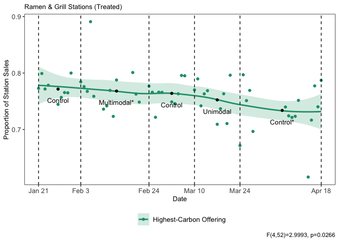<!-- -->

``` r
spring_data %>%
  filter(station=="Ramen"|station=="Grill") %>%
  filter(item_cat=="Main") %>%
  group_by(date,phase_interval,station,item) %>%
  summarise(total_count=sum(count)) %>%
  mutate(item=case_when(item=="Bowl Ramen Tofu"~"Lowest-Carbon Offering",
                        item=="Black Bean Burger"~"Lowest-Carbon Offering",
                        item=="Bowl Ramen Chicken"~"High",
                        item=="Grilled Hamburger"~"High",
                        item=="Grilled Chicken Breast Sandwich"~"Middle",
                        item=="Seared Salmon Burger"~"Middle",
                        item=="Trillium Grill Impossible Burger"~"Middle")) %>%
  ungroup() %>%
  group_by(date,phase_interval,item) %>%
  summarise(total_count=sum(total_count)) %>%
  mutate(date=case_when(date=="10-Apr"~"2025-4-10",
                        date=="10-Feb"~"2025-2-10",
                        date=="10-Mar"~"2025-3-10",
                        date=="11-Apr"~"2025-4-11",
                        date=="11-Feb"~"2025-2-11",
                        date=="11-Mar"~"2025-3-11",
                        date=="12-Feb"~"2025-2-12",
                        date=="12-Mar"~"2025-3-12",
                        date=="13-Feb"~"2025-2-13",
                        date=="13-Mar"~"2025-3-13",
                        date=="14-Apr"~"2025-4-14",
                        date=="14-Feb"~"2025-2-14",
                        date=="14-Mar"~"2025-3-14",
                        date=="15-Apr"~"2025-4-15",
                        date=="16-Apr"~"2025-4-16",
                        date=="17-Apr"~"2025-4-17",
                        date=="17-Mar"~"2025-3-17",
                        date=="18-Apr"~"2025-4-18",
                        date=="18-Mar"~"2025-3-18",
                        date=="19-Feb"~"2025-2-19",
                        date=="19-Mar"~"2025-3-19",
                        date=="20-Feb"~"2025-2-20",
                        date=="20-Mar"~"2025-3-20",
                        date=="21-Feb"~"2025-2-21",
                        date=="21-Jan"~"2025-1-21",
                        date=="21-Mar"~"2025-3-21",
                        date=="22-Jan"~"2025-1-22",
                        date=="23-Jan"~"2025-1-23",
                        date=="24-Feb"~"2025-2-24",
                        date=="24-Jan"~"2025-1-24",
                        date=="24-Mar"~"2025-3-24",
                        date=="25-Feb"~"2025-2-25",
                        date=="25-Mar"~"2025-3-25",
                        date=="26-Feb"~"2025-2-26",
                        date=="26-Mar"~"2025-3-26",
                        date=="27-Feb"~"2025-2-27",
                        date=="27-Jan"~"2025-1-27",
                        date=="27-Mar"~"2025-3-27",
                        date=="28-Feb"~"2025-2-28",
                        date=="28-Jan"~"2025-1-28",
                        date=="28-Mar"~"2025-3-28",
                        date=="29-Jan"~"2025-1-29",
                        date=="3-Feb"~"2025-2-3",
                        date=="3-Mar"~"2025-3-3",
                        date=="30-Jan"~"2025-1-30",
                        date=="31-Jan"~"2025-1-31",
                        date=="4-Feb"~"2025-2-4",
                        date=="4-Mar"~"2025-3-4",
                        date=="5-Feb"~"2025-2-5",
                        date=="5-Mar"~"2025-3-5",
                        date=="6-Feb"~"2025-2-6",
                        date=="6-Mar"~"2025-3-6",
                        date=="7-Apr"~"2025-4-7",
                        date=="7-Feb"~"2025-2-7",
                        date=="7-Mar"~"2025-3-7",
                        date=="8-Apr"~"2025-4-8",
                        date=="9-Apr"~"2025-4-9")) %>%
  arrange(date)
```

    ## `summarise()` has grouped output by 'date', 'phase_interval', 'station'. You
    ## can override using the `.groups` argument.
    ## `summarise()` has grouped output by 'date', 'phase_interval'. You can override
    ## using the `.groups` argument.

    ## # A tibble: 170 × 4
    ## # Groups:   date, phase_interval [57]
    ##    date      phase_interval item                   total_count
    ##    <chr>     <chr>          <chr>                        <int>
    ##  1 2025-1-21 1              High                           177
    ##  2 2025-1-21 1              Lowest-Carbon Offering          21
    ##  3 2025-1-21 1              Middle                          31
    ##  4 2025-1-22 1              High                           195
    ##  5 2025-1-22 1              Lowest-Carbon Offering          15
    ##  6 2025-1-22 1              Middle                          34
    ##  7 2025-1-23 1              High                           186
    ##  8 2025-1-23 1              Lowest-Carbon Offering          20
    ##  9 2025-1-23 1              Middle                          35
    ## 10 2025-1-24 1              High                           130
    ## # ℹ 160 more rows

FOR CONTROL PASTA STATION

``` r
spring_data %>%
  filter(station=="Pasta") %>%
  filter(item_cat=="Main") %>%
  group_by(phase_interval,station,item) %>%
  summarise(total_count=sum(count)) %>%
  mutate(prop=case_when(phase_interval=="1"~total_count/(1126+226),
                        phase_interval=="2"~total_count/(1336+296),
                        phase_interval=="3"~total_count/(1017+207),
                        phase_interval=="4"~total_count/(945+213),
                        phase_interval=="5"~total_count/(1319+336))) %>%
    filter(item=="Create Your Pasta Bowl VEG")
```

    ## `summarise()` has grouped output by 'phase_interval', 'station'. You can
    ## override using the `.groups` argument.

    ## # A tibble: 5 × 5
    ## # Groups:   phase_interval, station [5]
    ##   phase_interval station item                       total_count  prop
    ##   <chr>          <chr>   <chr>                            <int> <dbl>
    ## 1 1              Pasta   Create Your Pasta Bowl VEG         226 0.167
    ## 2 2              Pasta   Create Your Pasta Bowl VEG         296 0.181
    ## 3 3              Pasta   Create Your Pasta Bowl VEG         207 0.169
    ## 4 4              Pasta   Create Your Pasta Bowl VEG         213 0.184
    ## 5 5              Pasta   Create Your Pasta Bowl VEG         336 0.203

``` r
spring_prop_low_control_aov_data <- spring_data %>%
  filter(station=="Pasta") %>%
  filter(item_cat=="Main") %>%
  group_by(date,phase_interval,station,item) %>%
  summarise(total_count=sum(count)) %>%
  mutate(prop=case_when(date=="10-Apr"~total_count/(96+29),
                        date=="10-Feb"~total_count/(121+19),
                        date=="10-Mar"~total_count/(106+20),
                        date=="11-Apr"~total_count/(56+10),
                        date=="11-Feb"~total_count/(111+23),
                        date=="11-Mar"~total_count/(81+29),
                        date=="12-Feb"~total_count/(133+22),
                        date=="12-Mar"~total_count/(107+20),
                        date=="13-Feb"~total_count/(81+20),
                        date=="13-Mar"~total_count/(92+19),
                        date=="14-Apr"~total_count/(100+28),
                        date=="14-Feb"~total_count/(34+16),
                        date=="14-Mar"~total_count/(71+14),
                        date=="15-Apr"~total_count/(83+23),
                        date=="16-Apr"~total_count/(118+26),
                        date=="17-Apr"~total_count/(85+27),
                        date=="17-Mar"~total_count/(126+18),
                        date=="18-Apr"~total_count/(63+18),
                        date=="18-Mar"~total_count/(89+27),
                        date=="19-Feb"~total_count/(104+28),
                        date=="19-Mar"~total_count/(106+20),
                        date=="20-Feb"~total_count/(93+27),
                        date=="20-Mar"~total_count/(98+28),
                        date=="21-Feb"~total_count/(78+16),
                        date=="21-Jan"~total_count/(138+42),
                        date=="21-Mar"~total_count/(69+18),
                        date=="22-Jan"~total_count/(175+23),
                        date=="23-Jan"~total_count/(105+27),
                        date=="24-Feb"~total_count/(130+22),
                        date=="24-Jan"~total_count/(86+15),
                        date=="24-Mar"~total_count/(87+21),
                        date=="25-Feb"~total_count/(105+16),
                        date=="25-Mar"~total_count/(94+24),
                        date=="26-Feb"~total_count/(136+19),
                        date=="26-Mar"~total_count/(103+20),
                        date=="27-Feb"~total_count/(89+30),
                        date=="27-Jan"~total_count/(162+21),
                        date=="27-Mar"~total_count/(74+27),
                        date=="28-Feb"~total_count/(84+13),
                        date=="28-Jan"~total_count/(102+35),
                        date=="28-Mar"~total_count/(34+10),
                        date=="29-Jan"~total_count/(150+22),
                        date=="3-Feb"~total_count/(140+18),
                        date=="3-Mar"~total_count/(107+13),
                        date=="30-Jan"~total_count/(118+33),
                        date=="31-Jan"~total_count/(90+8),
                        date=="4-Feb"~total_count/(101+24),
                        date=="4-Mar"~total_count/(86+29),
                        date=="5-Feb"~total_count/(144+26),
                        date=="5-Mar"~total_count/(132+20),
                        date=="6-Feb"~total_count/(116+42),
                        date=="6-Mar"~total_count/(93+23),
                        date=="7-Apr"~total_count/(93+21),
                        date=="7-Feb"~total_count/(80+15),
                        date=="7-Mar"~total_count/(55+22),
                        date=="8-Apr"~total_count/(108+29),
                        date=="9-Apr"~total_count/(125+23))) %>%
  mutate(date=case_when(date=="10-Apr"~"2025-4-10",
                        date=="10-Feb"~"2025-2-10",
                        date=="10-Mar"~"2025-3-10",
                        date=="11-Apr"~"2025-4-11",
                        date=="11-Feb"~"2025-2-11",
                        date=="11-Mar"~"2025-3-11",
                        date=="12-Feb"~"2025-2-12",
                        date=="12-Mar"~"2025-3-12",
                        date=="13-Feb"~"2025-2-13",
                        date=="13-Mar"~"2025-3-13",
                        date=="14-Apr"~"2025-4-14",
                        date=="14-Feb"~"2025-2-14",
                        date=="14-Mar"~"2025-3-14",
                        date=="15-Apr"~"2025-4-15",
                        date=="16-Apr"~"2025-4-16",
                        date=="17-Apr"~"2025-4-17",
                        date=="17-Mar"~"2025-3-17",
                        date=="18-Apr"~"2025-4-18",
                        date=="18-Mar"~"2025-3-18",
                        date=="19-Feb"~"2025-2-19",
                        date=="19-Mar"~"2025-3-19",
                        date=="20-Feb"~"2025-2-20",
                        date=="20-Mar"~"2025-3-20",
                        date=="21-Feb"~"2025-2-21",
                        date=="21-Jan"~"2025-1-21",
                        date=="21-Mar"~"2025-3-21",
                        date=="22-Jan"~"2025-1-22",
                        date=="23-Jan"~"2025-1-23",
                        date=="24-Feb"~"2025-2-24",
                        date=="24-Jan"~"2025-1-24",
                        date=="24-Mar"~"2025-3-24",
                        date=="25-Feb"~"2025-2-25",
                        date=="25-Mar"~"2025-3-25",
                        date=="26-Feb"~"2025-2-26",
                        date=="26-Mar"~"2025-3-26",
                        date=="27-Feb"~"2025-2-27",
                        date=="27-Jan"~"2025-1-27",
                        date=="27-Mar"~"2025-3-27",
                        date=="28-Feb"~"2025-2-28",
                        date=="28-Jan"~"2025-1-28",
                        date=="28-Mar"~"2025-3-28",
                        date=="29-Jan"~"2025-1-29",
                        date=="3-Feb"~"2025-2-3",
                        date=="3-Mar"~"2025-3-3",
                        date=="30-Jan"~"2025-1-30",
                        date=="31-Jan"~"2025-1-31",
                        date=="4-Feb"~"2025-2-4",
                        date=="4-Mar"~"2025-3-4",
                        date=="5-Feb"~"2025-2-5",
                        date=="5-Mar"~"2025-3-5",
                        date=="6-Feb"~"2025-2-6",
                        date=="6-Mar"~"2025-3-6",
                        date=="7-Apr"~"2025-4-7",
                        date=="7-Feb"~"2025-2-7",
                        date=="7-Mar"~"2025-3-7",
                        date=="8-Apr"~"2025-4-8",
                        date=="9-Apr"~"2025-4-9")) %>%
  filter(item=="Create Your Pasta Bowl VEG") %>% ### Lowest-carbon offering
  mutate(date=as.Date(date)) %>%
  mutate(item=case_when(item=="Create Your Pasta Bowl VEG"~"Lowest-Carbon Offering")) %>%
  ungroup() %>%
  select(phase_interval,prop) %>%
  arrange(phase_interval) 
```

    ## `summarise()` has grouped output by 'date', 'phase_interval', 'station'. You
    ## can override using the `.groups` argument.

``` r
shapiro.test(spring_prop_low_control_aov_data$prop) 
```

    ## 
    ##  Shapiro-Wilk normality test
    ## 
    ## data:  spring_prop_low_control_aov_data$prop
    ## W = 0.98085, p-value = 0.5006

``` r
oneway.test(prop~phase_interval,data=spring_prop_low_control_aov_data,var.equal=TRUE)
```

    ## 
    ##  One-way analysis of means
    ## 
    ## data:  prop and phase_interval
    ## F = 0.89227, num df = 4, denom df = 52, p-value = 0.4752

``` r
spring_prop_low_control <- spring_data %>%
  filter(station=="Pasta") %>%
  filter(item_cat=="Main") %>%
  group_by(date,menu_condition,station,item) %>%
  summarise(total_count=sum(count)) %>%
  mutate(prop=case_when(date=="10-Apr"~total_count/(96+29),
                        date=="10-Feb"~total_count/(121+19),
                        date=="10-Mar"~total_count/(106+20),
                        date=="11-Apr"~total_count/(56+10),
                        date=="11-Feb"~total_count/(111+23),
                        date=="11-Mar"~total_count/(81+29),
                        date=="12-Feb"~total_count/(133+22),
                        date=="12-Mar"~total_count/(107+20),
                        date=="13-Feb"~total_count/(81+20),
                        date=="13-Mar"~total_count/(92+19),
                        date=="14-Apr"~total_count/(100+28),
                        date=="14-Feb"~total_count/(34+16),
                        date=="14-Mar"~total_count/(71+14),
                        date=="15-Apr"~total_count/(83+23),
                        date=="16-Apr"~total_count/(118+26),
                        date=="17-Apr"~total_count/(85+27),
                        date=="17-Mar"~total_count/(126+18),
                        date=="18-Apr"~total_count/(63+18),
                        date=="18-Mar"~total_count/(89+27),
                        date=="19-Feb"~total_count/(104+28),
                        date=="19-Mar"~total_count/(106+20),
                        date=="20-Feb"~total_count/(93+27),
                        date=="20-Mar"~total_count/(98+28),
                        date=="21-Feb"~total_count/(78+16),
                        date=="21-Jan"~total_count/(138+42),
                        date=="21-Mar"~total_count/(69+18),
                        date=="22-Jan"~total_count/(175+23),
                        date=="23-Jan"~total_count/(105+27),
                        date=="24-Feb"~total_count/(130+22),
                        date=="24-Jan"~total_count/(86+15),
                        date=="24-Mar"~total_count/(87+21),
                        date=="25-Feb"~total_count/(105+16),
                        date=="25-Mar"~total_count/(94+24),
                        date=="26-Feb"~total_count/(136+19),
                        date=="26-Mar"~total_count/(103+20),
                        date=="27-Feb"~total_count/(89+30),
                        date=="27-Jan"~total_count/(162+21),
                        date=="27-Mar"~total_count/(74+27),
                        date=="28-Feb"~total_count/(84+13),
                        date=="28-Jan"~total_count/(102+35),
                        date=="28-Mar"~total_count/(34+10),
                        date=="29-Jan"~total_count/(150+22),
                        date=="3-Feb"~total_count/(140+18),
                        date=="3-Mar"~total_count/(107+13),
                        date=="30-Jan"~total_count/(118+33),
                        date=="31-Jan"~total_count/(90+8),
                        date=="4-Feb"~total_count/(101+24),
                        date=="4-Mar"~total_count/(86+29),
                        date=="5-Feb"~total_count/(144+26),
                        date=="5-Mar"~total_count/(132+20),
                        date=="6-Feb"~total_count/(116+42),
                        date=="6-Mar"~total_count/(93+23),
                        date=="7-Apr"~total_count/(93+21),
                        date=="7-Feb"~total_count/(80+15),
                        date=="7-Mar"~total_count/(55+22),
                        date=="8-Apr"~total_count/(108+29),
                        date=="9-Apr"~total_count/(125+23))) %>%
  mutate(date=case_when(date=="10-Apr"~"2025-4-10",
                        date=="10-Feb"~"2025-2-10",
                        date=="10-Mar"~"2025-3-10",
                        date=="11-Apr"~"2025-4-11",
                        date=="11-Feb"~"2025-2-11",
                        date=="11-Mar"~"2025-3-11",
                        date=="12-Feb"~"2025-2-12",
                        date=="12-Mar"~"2025-3-12",
                        date=="13-Feb"~"2025-2-13",
                        date=="13-Mar"~"2025-3-13",
                        date=="14-Apr"~"2025-4-14",
                        date=="14-Feb"~"2025-2-14",
                        date=="14-Mar"~"2025-3-14",
                        date=="15-Apr"~"2025-4-15",
                        date=="16-Apr"~"2025-4-16",
                        date=="17-Apr"~"2025-4-17",
                        date=="17-Mar"~"2025-3-17",
                        date=="18-Apr"~"2025-4-18",
                        date=="18-Mar"~"2025-3-18",
                        date=="19-Feb"~"2025-2-19",
                        date=="19-Mar"~"2025-3-19",
                        date=="20-Feb"~"2025-2-20",
                        date=="20-Mar"~"2025-3-20",
                        date=="21-Feb"~"2025-2-21",
                        date=="21-Jan"~"2025-1-21",
                        date=="21-Mar"~"2025-3-21",
                        date=="22-Jan"~"2025-1-22",
                        date=="23-Jan"~"2025-1-23",
                        date=="24-Feb"~"2025-2-24",
                        date=="24-Jan"~"2025-1-24",
                        date=="24-Mar"~"2025-3-24",
                        date=="25-Feb"~"2025-2-25",
                        date=="25-Mar"~"2025-3-25",
                        date=="26-Feb"~"2025-2-26",
                        date=="26-Mar"~"2025-3-26",
                        date=="27-Feb"~"2025-2-27",
                        date=="27-Jan"~"2025-1-27",
                        date=="27-Mar"~"2025-3-27",
                        date=="28-Feb"~"2025-2-28",
                        date=="28-Jan"~"2025-1-28",
                        date=="28-Mar"~"2025-3-28",
                        date=="29-Jan"~"2025-1-29",
                        date=="3-Feb"~"2025-2-3",
                        date=="3-Mar"~"2025-3-3",
                        date=="30-Jan"~"2025-1-30",
                        date=="31-Jan"~"2025-1-31",
                        date=="4-Feb"~"2025-2-4",
                        date=="4-Mar"~"2025-3-4",
                        date=="5-Feb"~"2025-2-5",
                        date=="5-Mar"~"2025-3-5",
                        date=="6-Feb"~"2025-2-6",
                        date=="6-Mar"~"2025-3-6",
                        date=="7-Apr"~"2025-4-7",
                        date=="7-Feb"~"2025-2-7",
                        date=="7-Mar"~"2025-3-7",
                        date=="8-Apr"~"2025-4-8",
                        date=="9-Apr"~"2025-4-9")) %>%
  filter(item=="Create Your Pasta Bowl VEG") %>% ### Lowest-carbon offering
  mutate(date=as.Date(date)) %>%
  mutate(item=case_when(item=="Create Your Pasta Bowl VEG"~"Lowest-Carbon Offering")) %>%
  ggplot(aes(x=date,y=prop,color=item,fill=item)) + 
  geom_smooth(alpha=0.2) + 
  geom_point() +
  geom_vline(xintercept=as.numeric(daily_prop_spring_data$date[spring_vline]),linetype=2) + 
  xlab("Date") + 
  ylab("Proportion of Station Sales") + 
  scale_color_brewer(palette="Set1",name="") +
  scale_fill_brewer(palette="Set1",name="") +
  scale_x_date(breaks=as.Date(c("2025-01-21","2025-02-03","2025-02-24","2025-03-10","2025-03-24","2025-04-18")),labels=c("Jan 21","Feb 3","Feb 24","Mar 10","Mar 24","Apr 18")) +
  annotate("text",x=as.Date("2025-01-27"),y=0.1471598,label="Control",size=10/.pt) +
  annotate("text",x=as.Date("2025-02-14"),y=0.1613725,label="Multimodal",size=10/.pt) +
  annotate("text",x=as.Date("2025-03-03"),y=0.1491176,label="Control",size=10/.pt) +
  annotate("text",x=as.Date("2025-03-17"),y=0.1639378,label="Unimodal",size=10/.pt) +
  annotate("text",x=as.Date("2025-04-06"),y=0.1830211,label="Control",size=10/.pt) +
  annotate("point",x=as.Date("2025-01-27"),y=0.1671598) +
  annotate("point",x=as.Date("2025-02-14"),y=0.1813725) +
  annotate("point",x=as.Date("2025-03-03"),y=0.1691176) +
  annotate("point",x=as.Date("2025-03-17"),y=0.1839378) +
  annotate("point",x=as.Date("2025-04-06"),y=0.2030211) +
  labs(title="Pasta Station (Untreated)",caption="F(4,52)=0.89227, p=0.4752") +
  theme(aspect.ratio=0.55,legend.position="bottom",panel.grid=element_blank(),panel.background=element_rect(fill="white"),panel.border=element_rect(fill=NA),legend.title=element_text(size=10),legend.text=element_text(size=10),plot.title=element_text(size=10),axis.title=element_text(size=10),axis.text=element_text(size=10)) 
```

    ## `summarise()` has grouped output by 'date', 'menu_condition', 'station'. You
    ## can override using the `.groups` argument.

``` r
spring_prop_low_control
```

    ## `geom_smooth()` using method = 'loess' and formula = 'y ~ x'

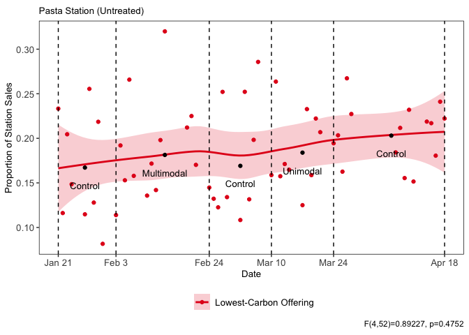<!-- -->

``` r
spring_prop_low <- ggarrange(spring_prop_low_ramen,spring_prop_low_grill,spring_prop_low_treatment,spring_prop_low_control,
          labels=c("A","B","C","D"),
          legend="none")
```

    ## `geom_smooth()` using method = 'loess' and formula = 'y ~ x'
    ## `geom_smooth()` using method = 'loess' and formula = 'y ~ x'
    ## `geom_smooth()` using method = 'loess' and formula = 'y ~ x'
    ## `geom_smooth()` using method = 'loess' and formula = 'y ~ x'

``` r
spring_prop_low <- annotate_figure(spring_prop_low,top=text_grob("Daily Sales Percentages of Lowest-Carbon Offerings (%)", 
               color="black",face="bold",size=12))
ggsave(filename="spring_prop_low.png",plot=spring_prop_low,path="/Users/kenjinchang/github/multimodal-framework-validation/figures",width=40,height=24,units="cm",dpi=150,limitsize=TRUE)
spring_prop_low
```

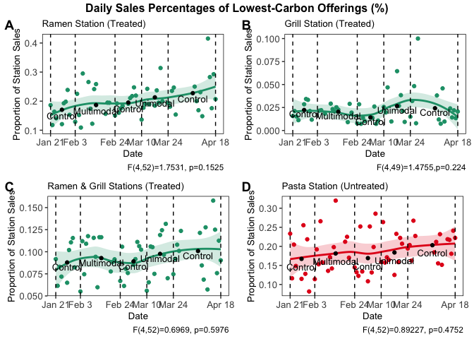<!-- -->

``` r
spring_data %>%
  filter(station=="Grill") %>%
  filter(item_cat=="Main") %>%
  group_by(phase_interval,station,item) %>%
  summarise(total_count=sum(count)) %>%
  mutate(prop=case_when(phase_interval=="1"~total_count/(25+135+814+72+76),
                        phase_interval=="2"~total_count/(30+193+1083+97+74),
                        phase_interval=="3"~total_count/(18+167+938+87+66),
                        phase_interval=="4"~total_count/(33+160+909+67+74),
                        phase_interval=="5"~total_count/(45+250+1352+130+125))) %>%
  filter(item=="Grilled Hamburger")
```

    ## `summarise()` has grouped output by 'phase_interval', 'station'. You can
    ## override using the `.groups` argument.

    ## # A tibble: 5 × 5
    ## # Groups:   phase_interval, station [5]
    ##   phase_interval station item              total_count  prop
    ##   <chr>          <chr>   <chr>                   <int> <dbl>
    ## 1 1              Grill   Grilled Hamburger         814 0.725
    ## 2 2              Grill   Grilled Hamburger        1083 0.733
    ## 3 3              Grill   Grilled Hamburger         938 0.735
    ## 4 4              Grill   Grilled Hamburger         909 0.731
    ## 5 5              Grill   Grilled Hamburger        1352 0.711

``` r
spring_prop_high_grill_aov_data <-  daily_prop_spring_data %>%
  filter(item=="Grilled Hamburger") %>%
  mutate(item=case_when(item=="Grilled Hamburger"~"Highest-Carbon Offering")) %>%
  ungroup() %>%
  select(phase_interval,prop) %>%
  arrange(phase_interval) 
shapiro.test(spring_prop_high_grill_aov_data$prop) 
```

    ## 
    ##  Shapiro-Wilk normality test
    ## 
    ## data:  spring_prop_high_grill_aov_data$prop
    ## W = 0.96682, p-value = 0.1255

``` r
oneway.test(prop~phase_interval,data=spring_prop_high_grill_aov_data,var.equal=TRUE)
```

    ## 
    ##  One-way analysis of means
    ## 
    ## data:  prop and phase_interval
    ## F = 0.88191, num df = 4, denom df = 51, p-value = 0.4814

``` r
spring_prop_high_grill <- daily_prop_spring_data %>%
  filter(item=="Grilled Hamburger") %>%
  mutate(item=case_when(item=="Grilled Hamburger"~"Highest-Carbon Offering")) %>%
  ggplot(aes(x=date,y=prop,color=item,fill=item)) + 
  geom_smooth(alpha=0.2) + 
  geom_point() + 
  geom_vline(xintercept=as.numeric(daily_prop_spring_data$date[spring_vline]),linetype=2) + 
  xlab("Date") + 
  ylab("Proportion of Station Sales") + 
  scale_color_brewer(palette="Dark2",name="") +
  scale_fill_brewer(palette="Dark2",name="") +
  scale_x_date(breaks=as.Date(c("2025-01-21","2025-02-03","2025-02-24","2025-03-10","2025-03-24","2025-04-18")),labels=c("Jan 21","Feb 3","Feb 24","Mar 10","Mar 24","Apr 18")) +
  annotate("text",x=as.Date("2025-01-27"),y=0.7154902,label="Control",size=10/.pt) +
  annotate("text",x=as.Date("2025-02-14"),y=0.7232431,label="Multimodal",size=10/.pt) +
  annotate("text",x=as.Date("2025-03-03"),y=0.7251097,label="Control",size=10/.pt) +
  annotate("text",x=as.Date("2025-03-17"),y=0.7212953,label="Unimodal",size=10/.pt) +
  annotate("text",x=as.Date("2025-04-06"),y=0.7008307,label="Control",size=10/.pt) +
  annotate("point",x=as.Date("2025-01-27"),y=0.7254902) +
  annotate("point",x=as.Date("2025-02-14"),y=0.7332431) +
  annotate("point",x=as.Date("2025-03-03"),y=0.7351097) +
  annotate("point",x=as.Date("2025-03-17"),y=0.7312953) +
  annotate("point",x=as.Date("2025-04-06"),y=0.7108307) +
  labs(title="Grill Station (Treated)",caption="F(4,51)=0.88191, p=0.4814") +
  theme(aspect.ratio=0.55,legend.position="bottom",panel.grid=element_blank(),panel.background=element_rect(fill="white"),panel.border=element_rect(fill=NA),legend.title=element_text(size=10),legend.text=element_text(size=10),plot.title=element_text(size=10),axis.title=element_text(size=10),axis.text=element_text(size=10)) 
spring_prop_high_grill
```

    ## `geom_smooth()` using method = 'loess' and formula = 'y ~ x'

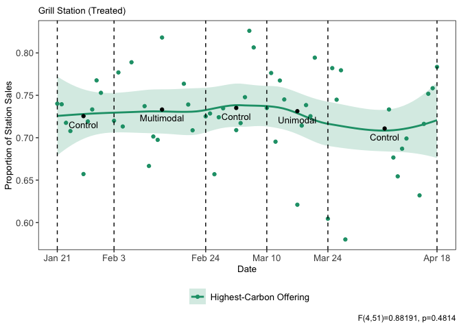<!-- -->

``` r
spring_data %>%
  filter(station=="Ramen") %>%
  filter(item_cat=="Main") %>%
  group_by(phase_interval,station,item) %>%
  summarise(total_count=sum(count)) %>%
  mutate(prop=case_when(phase_interval=="1"~total_count/(740+152),
                        phase_interval=="2"~total_count/(928+213),
                        phase_interval=="3"~total_count/(726+176),
                        phase_interval=="4"~total_count/(602+163),
                        phase_interval=="5"~total_count/(890+262))) %>%
  filter(item=="Bowl Ramen Chicken")
```

    ## `summarise()` has grouped output by 'phase_interval', 'station'. You can
    ## override using the `.groups` argument.

    ## # A tibble: 5 × 5
    ## # Groups:   phase_interval, station [5]
    ##   phase_interval station item               total_count  prop
    ##   <chr>          <chr>   <chr>                    <int> <dbl>
    ## 1 1              Ramen   Bowl Ramen Chicken         740 0.830
    ## 2 2              Ramen   Bowl Ramen Chicken         928 0.813
    ## 3 3              Ramen   Bowl Ramen Chicken         726 0.805
    ## 4 4              Ramen   Bowl Ramen Chicken         602 0.787
    ## 5 5              Ramen   Bowl Ramen Chicken         890 0.773

``` r
spring_prop_high_ramen_aov_data <- spring_data %>%
  filter(station=="Ramen") %>%
  filter(item_cat=="Main") %>%
  group_by(date,phase_interval,station,item) %>%
  summarise(total_count=sum(count)) %>%
  mutate(prop=case_when(date=="10-Apr"~total_count/(80+24),
                        date=="10-Feb"~total_count/(58+21),
                        date=="10-Mar"~total_count/(38+6),
                        date=="11-Apr"~total_count/(46+8),
                        date=="11-Feb"~total_count/(95+20),
                        date=="11-Mar"~total_count/(51+11),
                        date=="12-Feb"~total_count/(79+11),
                        date=="12-Mar"~total_count/(72+17),
                        date=="13-Feb"~total_count/(66+21),
                        date=="13-Mar"~total_count/(75+24),
                        date=="14-Apr"~total_count/(38+27),
                        date=="14-Feb"~total_count/(43+15),
                        date=="14-Mar"~total_count/(47+11),
                        date=="15-Apr"~total_count/(71+28),
                        date=="16-Apr"~total_count/(61+13),
                        date=="17-Apr"~total_count/(58+24),
                        date=="17-Mar"~total_count/(84+19),
                        date=="18-Apr"~total_count/(46+12),
                        date=="18-Mar"~total_count/(74+23),
                        date=="19-Feb"~total_count/(81+15),
                        date=="19-Mar"~total_count/(62+15),
                        date=="20-Feb"~total_count/(62+15),
                        date=="20-Mar"~total_count/(59+27),
                        date=="21-Feb"~total_count/(58+14),
                        date=="21-Jan"~total_count/(83+19),
                        date=="21-Mar"~total_count/(40+10),
                        date=="22-Jan"~total_count/(90+12),
                        date=="23-Jan"~total_count/(92+18),
                        date=="24-Feb"~total_count/(79+14),
                        date=="24-Jan"~total_count/(67+11),
                        date=="24-Mar"~total_count/(54+13),
                        date=="25-Feb"~total_count/(101+24),
                        date=="25-Mar"~total_count/(86+19),
                        date=="26-Feb"~total_count/(63+12),
                        date=="26-Mar"~total_count/(52+16),
                        date=="27-Feb"~total_count/(85+18),
                        date=="27-Jan"~total_count/(80+11),
                        date=="27-Mar"~total_count/(61+20),
                        date=="28-Feb"~total_count/(49+11),
                        date=="28-Jan"~total_count/(88+21),
                        date=="28-Mar"~total_count/(33+6),
                        date=="29-Jan"~total_count/(85+21),
                        date=="3-Feb"~total_count/(81+12),
                        date=="3-Mar"~total_count/(72+17),
                        date=="30-Jan"~total_count/(83+26),
                        date=="31-Jan"~total_count/(72+13),
                        date=="4-Feb"~total_count/(86+25),
                        date=="4-Mar"~total_count/(75+20),
                        date=="5-Feb"~total_count/(78+14),
                        date=="5-Mar"~total_count/(72+20),
                        date=="6-Feb"~total_count/(98+12),
                        date=="6-Mar"~total_count/(73+24),
                        date=="7-Apr"~total_count/(51+17),
                        date=="7-Feb"~total_count/(43+18),
                        date=="7-Mar"~total_count/(57+16),
                        date=="8-Apr"~total_count/(84+21),
                        date=="9-Apr"~total_count/(69+14))) %>%
  mutate(date=case_when(date=="10-Apr"~"2025-4-10",
                        date=="10-Feb"~"2025-2-10",
                        date=="10-Mar"~"2025-3-10",
                        date=="11-Apr"~"2025-4-11",
                        date=="11-Feb"~"2025-2-11",
                        date=="11-Mar"~"2025-3-11",
                        date=="12-Feb"~"2025-2-12",
                        date=="12-Mar"~"2025-3-12",
                        date=="13-Feb"~"2025-2-13",
                        date=="13-Mar"~"2025-3-13",
                        date=="14-Apr"~"2025-4-14",
                        date=="14-Feb"~"2025-2-14",
                        date=="14-Mar"~"2025-3-14",
                        date=="15-Apr"~"2025-4-15",
                        date=="16-Apr"~"2025-4-16",
                        date=="17-Apr"~"2025-4-17",
                        date=="17-Mar"~"2025-3-17",
                        date=="18-Apr"~"2025-4-18",
                        date=="18-Mar"~"2025-3-18",
                        date=="19-Feb"~"2025-2-19",
                        date=="19-Mar"~"2025-3-19",
                        date=="20-Feb"~"2025-2-20",
                        date=="20-Mar"~"2025-3-20",
                        date=="21-Feb"~"2025-2-21",
                        date=="21-Jan"~"2025-1-21",
                        date=="21-Mar"~"2025-3-21",
                        date=="22-Jan"~"2025-1-22",
                        date=="23-Jan"~"2025-1-23",
                        date=="24-Feb"~"2025-2-24",
                        date=="24-Jan"~"2025-1-24",
                        date=="24-Mar"~"2025-3-24",
                        date=="25-Feb"~"2025-2-25",
                        date=="25-Mar"~"2025-3-25",
                        date=="26-Feb"~"2025-2-26",
                        date=="26-Mar"~"2025-3-26",
                        date=="27-Feb"~"2025-2-27",
                        date=="27-Jan"~"2025-1-27",
                        date=="27-Mar"~"2025-3-27",
                        date=="28-Feb"~"2025-2-28",
                        date=="28-Jan"~"2025-1-28",
                        date=="28-Mar"~"2025-3-28",
                        date=="29-Jan"~"2025-1-29",
                        date=="3-Feb"~"2025-2-3",
                        date=="3-Mar"~"2025-3-3",
                        date=="30-Jan"~"2025-1-30",
                        date=="31-Jan"~"2025-1-31",
                        date=="4-Feb"~"2025-2-4",
                        date=="4-Mar"~"2025-3-4",
                        date=="5-Feb"~"2025-2-5",
                        date=="5-Mar"~"2025-3-5",
                        date=="6-Feb"~"2025-2-6",
                        date=="6-Mar"~"2025-3-6",
                        date=="7-Apr"~"2025-4-7",
                        date=="7-Feb"~"2025-2-7",
                        date=="7-Mar"~"2025-3-7",
                        date=="8-Apr"~"2025-4-8",
                        date=="9-Apr"~"2025-4-9")) %>%
  filter(item=="Bowl Ramen Chicken") %>% ### Highest-carbon offering
  mutate(date=as.Date(date)) %>%
  mutate(item=case_when(item=="Bowl Ramen Chicken"~"Highest-Carbon Offering")) %>%
  ungroup() %>%
  select(phase_interval,prop) %>%
  arrange(phase_interval)
```

    ## `summarise()` has grouped output by 'date', 'phase_interval', 'station'. You
    ## can override using the `.groups` argument.

``` r
shapiro.test(spring_prop_high_ramen_aov_data$prop) 
```

    ## 
    ##  Shapiro-Wilk normality test
    ## 
    ## data:  spring_prop_high_ramen_aov_data$prop
    ## W = 0.93245, p-value = 0.003391

``` r
oneway.test(prop~phase_interval,data=spring_prop_high_ramen_aov_data,var.equal=TRUE)
```

    ## 
    ##  One-way analysis of means
    ## 
    ## data:  prop and phase_interval
    ## F = 1.7531, num df = 4, denom df = 52, p-value = 0.1525

``` r
spring_prop_high_ramen <- spring_data %>%
  filter(station=="Ramen") %>%
  filter(item_cat=="Main") %>%
  group_by(date,phase_interval,station,item) %>%
  summarise(total_count=sum(count)) %>%
  mutate(prop=case_when(date=="10-Apr"~total_count/(80+24),
                        date=="10-Feb"~total_count/(58+21),
                        date=="10-Mar"~total_count/(38+6),
                        date=="11-Apr"~total_count/(46+8),
                        date=="11-Feb"~total_count/(95+20),
                        date=="11-Mar"~total_count/(51+11),
                        date=="12-Feb"~total_count/(79+11),
                        date=="12-Mar"~total_count/(72+17),
                        date=="13-Feb"~total_count/(66+21),
                        date=="13-Mar"~total_count/(75+24),
                        date=="14-Apr"~total_count/(38+27),
                        date=="14-Feb"~total_count/(43+15),
                        date=="14-Mar"~total_count/(47+11),
                        date=="15-Apr"~total_count/(71+28),
                        date=="16-Apr"~total_count/(61+13),
                        date=="17-Apr"~total_count/(58+24),
                        date=="17-Mar"~total_count/(84+19),
                        date=="18-Apr"~total_count/(46+12),
                        date=="18-Mar"~total_count/(74+23),
                        date=="19-Feb"~total_count/(81+15),
                        date=="19-Mar"~total_count/(62+15),
                        date=="20-Feb"~total_count/(62+15),
                        date=="20-Mar"~total_count/(59+27),
                        date=="21-Feb"~total_count/(58+14),
                        date=="21-Jan"~total_count/(83+19),
                        date=="21-Mar"~total_count/(40+10),
                        date=="22-Jan"~total_count/(90+12),
                        date=="23-Jan"~total_count/(92+18),
                        date=="24-Feb"~total_count/(79+14),
                        date=="24-Jan"~total_count/(67+11),
                        date=="24-Mar"~total_count/(54+13),
                        date=="25-Feb"~total_count/(101+24),
                        date=="25-Mar"~total_count/(86+19),
                        date=="26-Feb"~total_count/(63+12),
                        date=="26-Mar"~total_count/(52+16),
                        date=="27-Feb"~total_count/(85+18),
                        date=="27-Jan"~total_count/(80+11),
                        date=="27-Mar"~total_count/(61+20),
                        date=="28-Feb"~total_count/(49+11),
                        date=="28-Jan"~total_count/(88+21),
                        date=="28-Mar"~total_count/(33+6),
                        date=="29-Jan"~total_count/(85+21),
                        date=="3-Feb"~total_count/(81+12),
                        date=="3-Mar"~total_count/(72+17),
                        date=="30-Jan"~total_count/(83+26),
                        date=="31-Jan"~total_count/(72+13),
                        date=="4-Feb"~total_count/(86+25),
                        date=="4-Mar"~total_count/(75+20),
                        date=="5-Feb"~total_count/(78+14),
                        date=="5-Mar"~total_count/(72+20),
                        date=="6-Feb"~total_count/(98+12),
                        date=="6-Mar"~total_count/(73+24),
                        date=="7-Apr"~total_count/(51+17),
                        date=="7-Feb"~total_count/(43+18),
                        date=="7-Mar"~total_count/(57+16),
                        date=="8-Apr"~total_count/(84+21),
                        date=="9-Apr"~total_count/(69+14))) %>%
  mutate(date=case_when(date=="10-Apr"~"2025-4-10",
                        date=="10-Feb"~"2025-2-10",
                        date=="10-Mar"~"2025-3-10",
                        date=="11-Apr"~"2025-4-11",
                        date=="11-Feb"~"2025-2-11",
                        date=="11-Mar"~"2025-3-11",
                        date=="12-Feb"~"2025-2-12",
                        date=="12-Mar"~"2025-3-12",
                        date=="13-Feb"~"2025-2-13",
                        date=="13-Mar"~"2025-3-13",
                        date=="14-Apr"~"2025-4-14",
                        date=="14-Feb"~"2025-2-14",
                        date=="14-Mar"~"2025-3-14",
                        date=="15-Apr"~"2025-4-15",
                        date=="16-Apr"~"2025-4-16",
                        date=="17-Apr"~"2025-4-17",
                        date=="17-Mar"~"2025-3-17",
                        date=="18-Apr"~"2025-4-18",
                        date=="18-Mar"~"2025-3-18",
                        date=="19-Feb"~"2025-2-19",
                        date=="19-Mar"~"2025-3-19",
                        date=="20-Feb"~"2025-2-20",
                        date=="20-Mar"~"2025-3-20",
                        date=="21-Feb"~"2025-2-21",
                        date=="21-Jan"~"2025-1-21",
                        date=="21-Mar"~"2025-3-21",
                        date=="22-Jan"~"2025-1-22",
                        date=="23-Jan"~"2025-1-23",
                        date=="24-Feb"~"2025-2-24",
                        date=="24-Jan"~"2025-1-24",
                        date=="24-Mar"~"2025-3-24",
                        date=="25-Feb"~"2025-2-25",
                        date=="25-Mar"~"2025-3-25",
                        date=="26-Feb"~"2025-2-26",
                        date=="26-Mar"~"2025-3-26",
                        date=="27-Feb"~"2025-2-27",
                        date=="27-Jan"~"2025-1-27",
                        date=="27-Mar"~"2025-3-27",
                        date=="28-Feb"~"2025-2-28",
                        date=="28-Jan"~"2025-1-28",
                        date=="28-Mar"~"2025-3-28",
                        date=="29-Jan"~"2025-1-29",
                        date=="3-Feb"~"2025-2-3",
                        date=="3-Mar"~"2025-3-3",
                        date=="30-Jan"~"2025-1-30",
                        date=="31-Jan"~"2025-1-31",
                        date=="4-Feb"~"2025-2-4",
                        date=="4-Mar"~"2025-3-4",
                        date=="5-Feb"~"2025-2-5",
                        date=="5-Mar"~"2025-3-5",
                        date=="6-Feb"~"2025-2-6",
                        date=="6-Mar"~"2025-3-6",
                        date=="7-Apr"~"2025-4-7",
                        date=="7-Feb"~"2025-2-7",
                        date=="7-Mar"~"2025-3-7",
                        date=="8-Apr"~"2025-4-8",
                        date=="9-Apr"~"2025-4-9")) %>%
  filter(item=="Bowl Ramen Chicken") %>% ### Highest-carbon offering
  mutate(date=as.Date(date)) %>%
  mutate(item=case_when(item=="Bowl Ramen Chicken"~"Highest-Carbon Offering")) %>%
  ggplot(aes(x=date,y=prop,color=item,fill=item)) + 
  geom_smooth(alpha=0.2) + 
  geom_point() +
  geom_vline(xintercept=as.numeric(daily_prop_spring_data$date[spring_vline]),linetype=2) + 
  xlab("Date") + 
  ylab("Proportion of Station Sales") + 
  scale_color_brewer(palette="Dark2",name="") +
  scale_fill_brewer(palette="Dark2",name="") +
  scale_x_date(breaks=as.Date(c("2025-01-21","2025-02-03","2025-02-24","2025-03-10","2025-03-24","2025-04-18")),labels=c("Jan 21","Feb 3","Feb 24","Mar 10","Mar 24","Apr 18")) +
  annotate("text",x=as.Date("2025-01-27"),y=0.8095964,label="Control",size=10/.pt) +
  annotate("text",x=as.Date("2025-02-14"),y=0.7933216,label="Multimodal",size=10/.pt) +
  annotate("text",x=as.Date("2025-03-03"),y=0.7848780,label="Control",size=10/.pt) +
  annotate("text",x=as.Date("2025-03-17"),y=0.7669281,label="Unimodal",size=10/.pt) +
  annotate("text",x=as.Date("2025-04-06"),y=0.7525694,label="Control",size=10/.pt) +
  annotate("point",x=as.Date("2025-01-27"),y=0.8295964) +
  annotate("point",x=as.Date("2025-02-14"),y=0.8133216) +
  annotate("point",x=as.Date("2025-03-03"),y=0.8048780) +
  annotate("point",x=as.Date("2025-03-17"),y=0.7869281) +
  annotate("point",x=as.Date("2025-04-06"),y=0.7725694) +
  labs(title="Ramen Station (Treated)",caption="F(4,52)=1.7531, p=0.1525") +
  theme(aspect.ratio=0.55,legend.position="bottom",panel.grid=element_blank(),panel.background=element_rect(fill="white"),panel.border=element_rect(fill=NA),legend.title=element_text(size=10),legend.text=element_text(size=10),plot.title=element_text(size=10),axis.title=element_text(size=10),axis.text=element_text(size=10)) 
```

    ## `summarise()` has grouped output by 'date', 'phase_interval', 'station'. You
    ## can override using the `.groups` argument.

``` r
spring_prop_high_ramen
```

    ## `geom_smooth()` using method = 'loess' and formula = 'y ~ x'

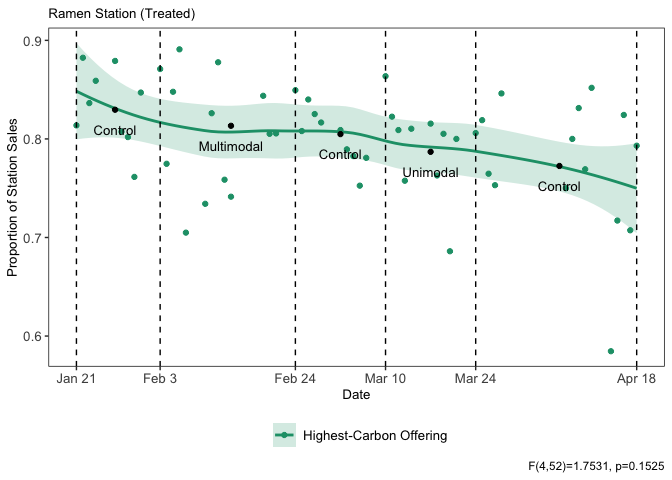<!-- -->

``` r
spring_data %>%
  filter(station=="Ramen"|station=="Grill") %>%
  filter(item_cat=="Main") %>%
  group_by(phase_interval,station,item) %>%
  summarise(total_count=sum(count))  %>%
  mutate(prop=case_when(phase_interval=="1"~total_count/(25+135+814+72+76+740+152),
                        phase_interval=="2"~total_count/(30+193+1083+97+74+928+213),
                        phase_interval=="3"~total_count/(18+167+938+87+66+726+176),
                        phase_interval=="4"~total_count/(33+160+909+67+74+602+163),
                        phase_interval=="5"~total_count/(46+250+1352+130+125+890+262))) %>%
   mutate(item=case_when(item=="Bowl Ramen Tofu"~"Lowest-Carbon Offering",
                        item=="Black Bean Burger"~"Lowest-Carbon Offering",
                        item=="Bowl Ramen Chicken"~"Highest-Carbon Offering",
                        item=="Grilled Hamburger"~"Highest-Carbon Offering",
                        item=="Grilled Chicken Breast Sandwich"~"Middle",
                        item=="Seared Salmon Burger"~"Middle",
                        item=="Trillium Grill Impossible Burger"~"Middle")) %>%
  ungroup() %>%
  group_by(phase_interval,item) %>%
  summarise(prop=sum(prop)) %>%
  filter(item=="Highest-Carbon Offering")
```

    ## `summarise()` has grouped output by 'phase_interval', 'station'. You can
    ## override using the `.groups` argument.
    ## `summarise()` has grouped output by 'phase_interval'. You can override using
    ## the `.groups` argument.

    ## # A tibble: 5 × 3
    ## # Groups:   phase_interval [5]
    ##   phase_interval item                     prop
    ##   <chr>          <chr>                   <dbl>
    ## 1 1              Highest-Carbon Offering 0.772
    ## 2 2              Highest-Carbon Offering 0.768
    ## 3 3              Highest-Carbon Offering 0.764
    ## 4 4              Highest-Carbon Offering 0.752
    ## 5 5              Highest-Carbon Offering 0.734

``` r
spring_prop_high_treatment_aov_data <- spring_data %>%
  filter(station=="Ramen"|station=="Grill") %>%
  filter(item_cat=="Main") %>%
  group_by(date,phase_interval,station,item) %>%
  summarise(total_count=sum(count)) %>%
  mutate(item=case_when(item=="Bowl Ramen Tofu"~"Lowest-Carbon Offering",
                        item=="Black Bean Burger"~"Lowest-Carbon Offering",
                        item=="Bowl Ramen Chicken"~"Highest-Carbon Offering",
                        item=="Grilled Hamburger"~"Highest-Carbon Offering",
                        item=="Grilled Chicken Breast Sandwich"~"Middle",
                        item=="Seared Salmon Burger"~"Middle",
                        item=="Trillium Grill Impossible Burger"~"Middle")) %>%
  ungroup() %>%
  group_by(date,phase_interval,item) %>%
  summarise(total_count=sum(total_count)) %>%
  mutate(prop=case_when(date=="10-Apr"~total_count/(170+30+35),
                        date=="10-Feb"~total_count/(159+25+32),
                        date=="10-Mar"~total_count/(124+9+28),
                        date=="11-Apr"~total_count/(118+9+30),
                        date=="11-Feb"~total_count/(181+23+40),
                        date=="11-Mar"~total_count/(169+14+31),
                        date=="12-Feb"~total_count/(180+14+40),
                        date=="12-Mar"~total_count/(161+23+33),
                        date=="13-Feb"~total_count/(149+24+33),
                        date=="13-Mar"~total_count/(174+24+30),
                        date=="14-Apr"~total_count/(117+30+43),
                        date=="14-Feb"~total_count/(115+17+14),
                        date=="14-Mar"~total_count/(123+12+25),
                        date=="15-Apr"~total_count/(172+30+38),
                        date=="16-Apr"~total_count/(164+16+31),
                        date=="17-Apr"~total_count/(171+26+34),
                        date=="17-Mar"~total_count/(161+27+39),
                        date=="18-Apr"~total_count/(122+14+19),
                        date=="18-Mar"~total_count/(154+26+29),
                        date=="19-Feb"~total_count/(165+16+25),
                        date=="19-Mar"~total_count/(158+20+29),
                        date=="20-Feb"~total_count/(164+19+32),
                        date=="20-Mar"~total_count/(162+30+36),
                        date=="21-Feb"~total_count/(131+16+28),
                        date=="21-Jan"~total_count/(177+21+31),
                        date=="21-Mar"~total_count/(125+11+21),
                        date=="22-Jan"~total_count/(195+15+34),
                        date=="23-Jan"~total_count/(186+20+35),
                        date=="24-Feb"~total_count/(174+15+35),
                        date=="24-Jan"~total_count/(130+12+25),
                        date=="24-Mar"~total_count/(135+15+51),
                        date=="25-Feb"~total_count/(203+28+34),
                        date=="25-Mar"~total_count/(208+24+29),
                        date=="26-Feb"~total_count/(153+13+46),
                        date=="26-Mar"~total_count/(160+23+30),
                        date=="27-Feb"~total_count/(190+20+38),
                        date=="27-Jan"~total_count/(172+15+44),
                        date=="27-Mar"~total_count/(160+21+27),
                        date=="28-Feb"~total_count/(121+12+25),
                        date=="28-Jan"~total_count/(193+26+36),
                        date=="28-Mar"~total_count/(62+11+16),
                        date=="29-Jan"~total_count/(173+25+28),
                        date=="3-Feb"~total_count/(171+12+35),
                        date=="3-Mar"~total_count/(167+19+37),
                        date=="30-Jan"~total_count/(192+29+30),
                        date=="31-Jan"~total_count/(136+14+20),
                        date=="4-Feb"~total_count/(194+28+28),
                        date=="4-Mar"~total_count/(179+22+39),
                        date=="5-Feb"~total_count/(175+17+36),
                        date=="5-Mar"~total_count/(158+23+26),
                        date=="6-Feb"~total_count/(98+12),
                        date=="6-Mar"~total_count/(187+25+23),
                        date=="7-Apr"~total_count/(128+21+24),
                        date=="7-Feb"~total_count/(129+20+21),
                        date=="7-Mar"~total_count/(132+17+17),
                        date=="8-Apr"~total_count/(197+23+52),
                        date=="9-Apr"~total_count/(158+15+46))) %>%
   mutate(date=case_when(date=="10-Apr"~"2025-4-10",
                        date=="10-Feb"~"2025-2-10",
                        date=="10-Mar"~"2025-3-10",
                        date=="11-Apr"~"2025-4-11",
                        date=="11-Feb"~"2025-2-11",
                        date=="11-Mar"~"2025-3-11",
                        date=="12-Feb"~"2025-2-12",
                        date=="12-Mar"~"2025-3-12",
                        date=="13-Feb"~"2025-2-13",
                        date=="13-Mar"~"2025-3-13",
                        date=="14-Apr"~"2025-4-14",
                        date=="14-Feb"~"2025-2-14",
                        date=="14-Mar"~"2025-3-14",
                        date=="15-Apr"~"2025-4-15",
                        date=="16-Apr"~"2025-4-16",
                        date=="17-Apr"~"2025-4-17",
                        date=="17-Mar"~"2025-3-17",
                        date=="18-Apr"~"2025-4-18",
                        date=="18-Mar"~"2025-3-18",
                        date=="19-Feb"~"2025-2-19",
                        date=="19-Mar"~"2025-3-19",
                        date=="20-Feb"~"2025-2-20",
                        date=="20-Mar"~"2025-3-20",
                        date=="21-Feb"~"2025-2-21",
                        date=="21-Jan"~"2025-1-21",
                        date=="21-Mar"~"2025-3-21",
                        date=="22-Jan"~"2025-1-22",
                        date=="23-Jan"~"2025-1-23",
                        date=="24-Feb"~"2025-2-24",
                        date=="24-Jan"~"2025-1-24",
                        date=="24-Mar"~"2025-3-24",
                        date=="25-Feb"~"2025-2-25",
                        date=="25-Mar"~"2025-3-25",
                        date=="26-Feb"~"2025-2-26",
                        date=="26-Mar"~"2025-3-26",
                        date=="27-Feb"~"2025-2-27",
                        date=="27-Jan"~"2025-1-27",
                        date=="27-Mar"~"2025-3-27",
                        date=="28-Feb"~"2025-2-28",
                        date=="28-Jan"~"2025-1-28",
                        date=="28-Mar"~"2025-3-28",
                        date=="29-Jan"~"2025-1-29",
                        date=="3-Feb"~"2025-2-3",
                        date=="3-Mar"~"2025-3-3",
                        date=="30-Jan"~"2025-1-30",
                        date=="31-Jan"~"2025-1-31",
                        date=="4-Feb"~"2025-2-4",
                        date=="4-Mar"~"2025-3-4",
                        date=="5-Feb"~"2025-2-5",
                        date=="5-Mar"~"2025-3-5",
                        date=="6-Feb"~"2025-2-6",
                        date=="6-Mar"~"2025-3-6",
                        date=="7-Apr"~"2025-4-7",
                        date=="7-Feb"~"2025-2-7",
                        date=="7-Mar"~"2025-3-7",
                        date=="8-Apr"~"2025-4-8",
                        date=="9-Apr"~"2025-4-9")) %>%
  filter(item=="Highest-Carbon Offering") %>% ### Highest-carbon offering
  mutate(date=as.Date(date)) %>%
  ungroup() %>%
  select(phase_interval,prop) %>%
  arrange(phase_interval) 
```

    ## `summarise()` has grouped output by 'date', 'phase_interval', 'station'. You
    ## can override using the `.groups` argument.
    ## `summarise()` has grouped output by 'date', 'phase_interval'. You can override
    ## using the `.groups` argument.

``` r
shapiro.test(spring_prop_high_treatment_aov_data$prop) 
```

    ## 
    ##  Shapiro-Wilk normality test
    ## 
    ## data:  spring_prop_high_treatment_aov_data$prop
    ## W = 0.90974, p-value = 0.0004344

``` r
oneway.test(prop~phase_interval,data=spring_prop_high_treatment_aov_data,var.equal=TRUE)
```

    ## 
    ##  One-way analysis of means
    ## 
    ## data:  prop and phase_interval
    ## F = 2.9993, num df = 4, denom df = 52, p-value = 0.0266

``` r
spring_prop_high_treatment_aov_model <- aov(prop~phase_interval,data=spring_prop_high_treatment_aov_data) 
summary(spring_prop_high_treatment_aov_model)
```

    ##                Df  Sum Sq  Mean Sq F value Pr(>F)  
    ## phase_interval  4 0.01532 0.003830   2.999 0.0266 *
    ## Residuals      52 0.06640 0.001277                 
    ## ---
    ## Signif. codes:  0 '***' 0.001 '**' 0.01 '*' 0.05 '.' 0.1 ' ' 1

``` r
TukeyHSD(spring_prop_high_treatment_aov_model,conf.level=0.95)
```

    ##   Tukey multiple comparisons of means
    ##     95% family-wise confidence level
    ## 
    ## Fit: aov(formula = prop ~ phase_interval, data = spring_prop_high_treatment_aov_data)
    ## 
    ## $phase_interval
    ##              diff         lwr          upr     p adj
    ## 2-1  0.0002429061 -0.04354278  0.044028597 1.0000000
    ## 3-1 -0.0081506037 -0.05454541  0.038244200 0.9873560
    ## 4-1 -0.0177069872 -0.06410179  0.028687816 0.8166905
    ## 5-1 -0.0404714712 -0.08304626  0.002103320 0.0698188
    ## 3-2 -0.0083935098 -0.05086583  0.034078815 0.9803904
    ## 4-2 -0.0179498933 -0.06042222  0.024522432 0.7546013
    ## 5-2 -0.0407143773 -0.07897707 -0.002451687 0.0317141
    ## 4-3 -0.0095563835 -0.05471377  0.035601002 0.9747815
    ## 5-3 -0.0323208674 -0.07354373  0.008901997 0.1902180
    ## 5-4 -0.0227644840 -0.06398735  0.018458381 0.5289119

``` r
spring_prop_high_treatment <- spring_data %>%
  filter(station=="Ramen"|station=="Grill") %>%
  filter(item_cat=="Main") %>%
  group_by(date,phase_interval,station,item) %>%
  summarise(total_count=sum(count)) %>%
  mutate(item=case_when(item=="Bowl Ramen Tofu"~"Lowest-Carbon Offering",
                        item=="Black Bean Burger"~"Lowest-Carbon Offering",
                        item=="Bowl Ramen Chicken"~"Highest-Carbon Offering",
                        item=="Grilled Hamburger"~"Highest-Carbon Offering",
                        item=="Grilled Chicken Breast Sandwich"~"Middle",
                        item=="Seared Salmon Burger"~"Middle",
                        item=="Trillium Grill Impossible Burger"~"Middle")) %>%
  ungroup() %>%
  group_by(date,phase_interval,item) %>%
  summarise(total_count=sum(total_count)) %>%
  mutate(prop=case_when(date=="10-Apr"~total_count/(170+30+35),
                        date=="10-Feb"~total_count/(159+25+32),
                        date=="10-Mar"~total_count/(124+9+28),
                        date=="11-Apr"~total_count/(118+9+30),
                        date=="11-Feb"~total_count/(181+23+40),
                        date=="11-Mar"~total_count/(169+14+31),
                        date=="12-Feb"~total_count/(180+14+40),
                        date=="12-Mar"~total_count/(161+23+33),
                        date=="13-Feb"~total_count/(149+24+33),
                        date=="13-Mar"~total_count/(174+24+30),
                        date=="14-Apr"~total_count/(117+30+43),
                        date=="14-Feb"~total_count/(115+17+14),
                        date=="14-Mar"~total_count/(123+12+25),
                        date=="15-Apr"~total_count/(172+30+38),
                        date=="16-Apr"~total_count/(164+16+31),
                        date=="17-Apr"~total_count/(171+26+34),
                        date=="17-Mar"~total_count/(161+27+39),
                        date=="18-Apr"~total_count/(122+14+19),
                        date=="18-Mar"~total_count/(154+26+29),
                        date=="19-Feb"~total_count/(165+16+25),
                        date=="19-Mar"~total_count/(158+20+29),
                        date=="20-Feb"~total_count/(164+19+32),
                        date=="20-Mar"~total_count/(162+30+36),
                        date=="21-Feb"~total_count/(131+16+28),
                        date=="21-Jan"~total_count/(177+21+31),
                        date=="21-Mar"~total_count/(125+11+21),
                        date=="22-Jan"~total_count/(195+15+34),
                        date=="23-Jan"~total_count/(186+20+35),
                        date=="24-Feb"~total_count/(174+15+35),
                        date=="24-Jan"~total_count/(130+12+25),
                        date=="24-Mar"~total_count/(135+15+51),
                        date=="25-Feb"~total_count/(203+28+34),
                        date=="25-Mar"~total_count/(208+24+29),
                        date=="26-Feb"~total_count/(153+13+46),
                        date=="26-Mar"~total_count/(160+23+30),
                        date=="27-Feb"~total_count/(190+20+38),
                        date=="27-Jan"~total_count/(172+15+44),
                        date=="27-Mar"~total_count/(160+21+27),
                        date=="28-Feb"~total_count/(121+12+25),
                        date=="28-Jan"~total_count/(193+26+36),
                        date=="28-Mar"~total_count/(62+11+16),
                        date=="29-Jan"~total_count/(173+25+28),
                        date=="3-Feb"~total_count/(171+12+35),
                        date=="3-Mar"~total_count/(167+19+37),
                        date=="30-Jan"~total_count/(192+29+30),
                        date=="31-Jan"~total_count/(136+14+20),
                        date=="4-Feb"~total_count/(194+28+28),
                        date=="4-Mar"~total_count/(179+22+39),
                        date=="5-Feb"~total_count/(175+17+36),
                        date=="5-Mar"~total_count/(158+23+26),
                        date=="6-Feb"~total_count/(98+12),
                        date=="6-Mar"~total_count/(187+25+23),
                        date=="7-Apr"~total_count/(128+21+24),
                        date=="7-Feb"~total_count/(129+20+21),
                        date=="7-Mar"~total_count/(132+17+17),
                        date=="8-Apr"~total_count/(197+23+52),
                        date=="9-Apr"~total_count/(158+15+46))) %>%
   mutate(date=case_when(date=="10-Apr"~"2025-4-10",
                        date=="10-Feb"~"2025-2-10",
                        date=="10-Mar"~"2025-3-10",
                        date=="11-Apr"~"2025-4-11",
                        date=="11-Feb"~"2025-2-11",
                        date=="11-Mar"~"2025-3-11",
                        date=="12-Feb"~"2025-2-12",
                        date=="12-Mar"~"2025-3-12",
                        date=="13-Feb"~"2025-2-13",
                        date=="13-Mar"~"2025-3-13",
                        date=="14-Apr"~"2025-4-14",
                        date=="14-Feb"~"2025-2-14",
                        date=="14-Mar"~"2025-3-14",
                        date=="15-Apr"~"2025-4-15",
                        date=="16-Apr"~"2025-4-16",
                        date=="17-Apr"~"2025-4-17",
                        date=="17-Mar"~"2025-3-17",
                        date=="18-Apr"~"2025-4-18",
                        date=="18-Mar"~"2025-3-18",
                        date=="19-Feb"~"2025-2-19",
                        date=="19-Mar"~"2025-3-19",
                        date=="20-Feb"~"2025-2-20",
                        date=="20-Mar"~"2025-3-20",
                        date=="21-Feb"~"2025-2-21",
                        date=="21-Jan"~"2025-1-21",
                        date=="21-Mar"~"2025-3-21",
                        date=="22-Jan"~"2025-1-22",
                        date=="23-Jan"~"2025-1-23",
                        date=="24-Feb"~"2025-2-24",
                        date=="24-Jan"~"2025-1-24",
                        date=="24-Mar"~"2025-3-24",
                        date=="25-Feb"~"2025-2-25",
                        date=="25-Mar"~"2025-3-25",
                        date=="26-Feb"~"2025-2-26",
                        date=="26-Mar"~"2025-3-26",
                        date=="27-Feb"~"2025-2-27",
                        date=="27-Jan"~"2025-1-27",
                        date=="27-Mar"~"2025-3-27",
                        date=="28-Feb"~"2025-2-28",
                        date=="28-Jan"~"2025-1-28",
                        date=="28-Mar"~"2025-3-28",
                        date=="29-Jan"~"2025-1-29",
                        date=="3-Feb"~"2025-2-3",
                        date=="3-Mar"~"2025-3-3",
                        date=="30-Jan"~"2025-1-30",
                        date=="31-Jan"~"2025-1-31",
                        date=="4-Feb"~"2025-2-4",
                        date=="4-Mar"~"2025-3-4",
                        date=="5-Feb"~"2025-2-5",
                        date=="5-Mar"~"2025-3-5",
                        date=="6-Feb"~"2025-2-6",
                        date=="6-Mar"~"2025-3-6",
                        date=="7-Apr"~"2025-4-7",
                        date=="7-Feb"~"2025-2-7",
                        date=="7-Mar"~"2025-3-7",
                        date=="8-Apr"~"2025-4-8",
                        date=="9-Apr"~"2025-4-9")) %>%
  filter(item=="Highest-Carbon Offering") %>% ### Highest-carbon offering
  mutate(date=as.Date(date)) %>%
  ggplot(aes(x=date,y=prop,color=item,fill=item)) + 
  geom_smooth(alpha=0.2) + 
  geom_point() +
  geom_vline(xintercept=as.numeric(daily_prop_spring_data$date[spring_vline]),linetype=2) + 
  xlab("Date") + 
  ylab("Proportion of Station Sales") + 
  scale_color_brewer(palette="Dark2",name="") +
  scale_fill_brewer(palette="Dark2",name="") +
  scale_x_date(breaks=as.Date(c("2025-01-21","2025-02-03","2025-02-24","2025-03-10","2025-03-24","2025-04-18")),labels=c("Jan 21","Feb 3","Feb 24","Mar 10","Mar 24","Apr 18")) +
  annotate("text",x=as.Date("2025-01-27"),y=0.7515988,label="Control",size=10/.pt) +
  annotate("text",x=as.Date("2025-02-14"),y=0.7481436,label="Multimodal*",size=10/.pt) +
  annotate("text",x=as.Date("2025-03-03"),y=0.7440037,label="Control",size=10/.pt) +
  annotate("text",x=as.Date("2025-03-17"),y=0.7324900,label="Unimodal",size=10/.pt) +
  annotate("text",x=as.Date("2025-04-06"),y=0.7138789,label="Control*",size=10/.pt) +
  annotate("point",x=as.Date("2025-01-27"),y=0.7715988) +
  annotate("point",x=as.Date("2025-02-14"),y=0.7681436) +
  annotate("point",x=as.Date("2025-03-03"),y=0.7640037) +
  annotate("point",x=as.Date("2025-03-17"),y=0.7524900) +
  annotate("point",x=as.Date("2025-04-06"),y=0.7338789) +
  labs(title="Ramen & Grill Stations (Treated)",caption="F(4,52)=2.9993, p=0.0266") +
  theme(aspect.ratio=0.55,legend.position="bottom",panel.grid=element_blank(),panel.background=element_rect(fill="white"),panel.border=element_rect(fill=NA),legend.title=element_text(size=10),legend.text=element_text(size=10),plot.title=element_text(size=10),axis.title=element_text(size=10),axis.text=element_text(size=10)) 
```

    ## `summarise()` has grouped output by 'date', 'phase_interval', 'station'. You
    ## can override using the `.groups` argument.
    ## `summarise()` has grouped output by 'date', 'phase_interval'. You can override
    ## using the `.groups` argument.

``` r
spring_prop_high_treatment
```

    ## `geom_smooth()` using method = 'loess' and formula = 'y ~ x'

<!-- -->

``` r
spring_data %>%
  filter(station=="Pasta") %>%
  filter(item_cat=="Main") %>%
  group_by(phase_interval,station,item) %>%
  summarise(total_count=sum(count)) %>%
  mutate(prop=case_when(phase_interval=="1"~total_count/(1126+226),
                        phase_interval=="2"~total_count/(1336+296),
                        phase_interval=="3"~total_count/(1017+207),
                        phase_interval=="4"~total_count/(945+213),
                        phase_interval=="5"~total_count/(1319+336))) %>%
    filter(item=="Create Your Pasta Bowl MEAT")
```

    ## `summarise()` has grouped output by 'phase_interval', 'station'. You can
    ## override using the `.groups` argument.

    ## # A tibble: 5 × 5
    ## # Groups:   phase_interval, station [5]
    ##   phase_interval station item                        total_count  prop
    ##   <chr>          <chr>   <chr>                             <int> <dbl>
    ## 1 1              Pasta   Create Your Pasta Bowl MEAT        1126 0.833
    ## 2 2              Pasta   Create Your Pasta Bowl MEAT        1336 0.819
    ## 3 3              Pasta   Create Your Pasta Bowl MEAT        1017 0.831
    ## 4 4              Pasta   Create Your Pasta Bowl MEAT         945 0.816
    ## 5 5              Pasta   Create Your Pasta Bowl MEAT        1319 0.797

``` r
spring_prop_high_control_aov_data <- spring_data %>%
  filter(station=="Pasta") %>%
  filter(item_cat=="Main") %>%
  group_by(date,phase_interval,station,item) %>%
  summarise(total_count=sum(count)) %>%
  mutate(prop=case_when(date=="10-Apr"~total_count/(96+29),
                        date=="10-Feb"~total_count/(121+19),
                        date=="10-Mar"~total_count/(106+20),
                        date=="11-Apr"~total_count/(56+10),
                        date=="11-Feb"~total_count/(111+23),
                        date=="11-Mar"~total_count/(81+29),
                        date=="12-Feb"~total_count/(133+22),
                        date=="12-Mar"~total_count/(107+20),
                        date=="13-Feb"~total_count/(81+20),
                        date=="13-Mar"~total_count/(92+19),
                        date=="14-Apr"~total_count/(100+28),
                        date=="14-Feb"~total_count/(34+16),
                        date=="14-Mar"~total_count/(71+14),
                        date=="15-Apr"~total_count/(83+23),
                        date=="16-Apr"~total_count/(118+26),
                        date=="17-Apr"~total_count/(85+27),
                        date=="17-Mar"~total_count/(126+18),
                        date=="18-Apr"~total_count/(63+18),
                        date=="18-Mar"~total_count/(89+27),
                        date=="19-Feb"~total_count/(104+28),
                        date=="19-Mar"~total_count/(106+20),
                        date=="20-Feb"~total_count/(93+27),
                        date=="20-Mar"~total_count/(98+28),
                        date=="21-Feb"~total_count/(78+16),
                        date=="21-Jan"~total_count/(138+42),
                        date=="21-Mar"~total_count/(69+18),
                        date=="22-Jan"~total_count/(175+23),
                        date=="23-Jan"~total_count/(105+27),
                        date=="24-Feb"~total_count/(130+22),
                        date=="24-Jan"~total_count/(86+15),
                        date=="24-Mar"~total_count/(87+21),
                        date=="25-Feb"~total_count/(105+16),
                        date=="25-Mar"~total_count/(94+24),
                        date=="26-Feb"~total_count/(136+19),
                        date=="26-Mar"~total_count/(103+20),
                        date=="27-Feb"~total_count/(89+30),
                        date=="27-Jan"~total_count/(162+21),
                        date=="27-Mar"~total_count/(74+27),
                        date=="28-Feb"~total_count/(84+13),
                        date=="28-Jan"~total_count/(102+35),
                        date=="28-Mar"~total_count/(34+10),
                        date=="29-Jan"~total_count/(150+22),
                        date=="3-Feb"~total_count/(140+18),
                        date=="3-Mar"~total_count/(107+13),
                        date=="30-Jan"~total_count/(118+33),
                        date=="31-Jan"~total_count/(90+8),
                        date=="4-Feb"~total_count/(101+24),
                        date=="4-Mar"~total_count/(86+29),
                        date=="5-Feb"~total_count/(144+26),
                        date=="5-Mar"~total_count/(132+20),
                        date=="6-Feb"~total_count/(116+42),
                        date=="6-Mar"~total_count/(93+23),
                        date=="7-Apr"~total_count/(93+21),
                        date=="7-Feb"~total_count/(80+15),
                        date=="7-Mar"~total_count/(55+22),
                        date=="8-Apr"~total_count/(108+29),
                        date=="9-Apr"~total_count/(125+23))) %>%
  mutate(date=case_when(date=="10-Apr"~"2025-4-10",
                        date=="10-Feb"~"2025-2-10",
                        date=="10-Mar"~"2025-3-10",
                        date=="11-Apr"~"2025-4-11",
                        date=="11-Feb"~"2025-2-11",
                        date=="11-Mar"~"2025-3-11",
                        date=="12-Feb"~"2025-2-12",
                        date=="12-Mar"~"2025-3-12",
                        date=="13-Feb"~"2025-2-13",
                        date=="13-Mar"~"2025-3-13",
                        date=="14-Apr"~"2025-4-14",
                        date=="14-Feb"~"2025-2-14",
                        date=="14-Mar"~"2025-3-14",
                        date=="15-Apr"~"2025-4-15",
                        date=="16-Apr"~"2025-4-16",
                        date=="17-Apr"~"2025-4-17",
                        date=="17-Mar"~"2025-3-17",
                        date=="18-Apr"~"2025-4-18",
                        date=="18-Mar"~"2025-3-18",
                        date=="19-Feb"~"2025-2-19",
                        date=="19-Mar"~"2025-3-19",
                        date=="20-Feb"~"2025-2-20",
                        date=="20-Mar"~"2025-3-20",
                        date=="21-Feb"~"2025-2-21",
                        date=="21-Jan"~"2025-1-21",
                        date=="21-Mar"~"2025-3-21",
                        date=="22-Jan"~"2025-1-22",
                        date=="23-Jan"~"2025-1-23",
                        date=="24-Feb"~"2025-2-24",
                        date=="24-Jan"~"2025-1-24",
                        date=="24-Mar"~"2025-3-24",
                        date=="25-Feb"~"2025-2-25",
                        date=="25-Mar"~"2025-3-25",
                        date=="26-Feb"~"2025-2-26",
                        date=="26-Mar"~"2025-3-26",
                        date=="27-Feb"~"2025-2-27",
                        date=="27-Jan"~"2025-1-27",
                        date=="27-Mar"~"2025-3-27",
                        date=="28-Feb"~"2025-2-28",
                        date=="28-Jan"~"2025-1-28",
                        date=="28-Mar"~"2025-3-28",
                        date=="29-Jan"~"2025-1-29",
                        date=="3-Feb"~"2025-2-3",
                        date=="3-Mar"~"2025-3-3",
                        date=="30-Jan"~"2025-1-30",
                        date=="31-Jan"~"2025-1-31",
                        date=="4-Feb"~"2025-2-4",
                        date=="4-Mar"~"2025-3-4",
                        date=="5-Feb"~"2025-2-5",
                        date=="5-Mar"~"2025-3-5",
                        date=="6-Feb"~"2025-2-6",
                        date=="6-Mar"~"2025-3-6",
                        date=="7-Apr"~"2025-4-7",
                        date=="7-Feb"~"2025-2-7",
                        date=="7-Mar"~"2025-3-7",
                        date=="8-Apr"~"2025-4-8",
                        date=="9-Apr"~"2025-4-9")) %>%
  filter(item=="Create Your Pasta Bowl MEAT") %>% ### Highest-carbon offering
  mutate(date=as.Date(date)) %>%
  mutate(item=case_when(item=="Create Your Pasta Bowl MEAT"~"Highest-Carbon Offering")) %>%
  ungroup() %>%
  select(phase_interval,prop) %>%
  arrange(phase_interval)
```

    ## `summarise()` has grouped output by 'date', 'phase_interval', 'station'. You
    ## can override using the `.groups` argument.

``` r
shapiro.test(spring_prop_high_control_aov_data$prop) 
```

    ## 
    ##  Shapiro-Wilk normality test
    ## 
    ## data:  spring_prop_high_control_aov_data$prop
    ## W = 0.98085, p-value = 0.5006

``` r
oneway.test(prop~phase_interval,data=spring_prop_high_control_aov_data,var.equal=TRUE)
```

    ## 
    ##  One-way analysis of means
    ## 
    ## data:  prop and phase_interval
    ## F = 0.89227, num df = 4, denom df = 52, p-value = 0.4752

``` r
spring_prop_high_control <- spring_data %>%
  filter(station=="Pasta") %>%
  filter(item_cat=="Main") %>%
  group_by(date,menu_condition,station,item) %>%
  summarise(total_count=sum(count)) %>%
  mutate(prop=case_when(date=="10-Apr"~total_count/(96+29),
                        date=="10-Feb"~total_count/(121+19),
                        date=="10-Mar"~total_count/(106+20),
                        date=="11-Apr"~total_count/(56+10),
                        date=="11-Feb"~total_count/(111+23),
                        date=="11-Mar"~total_count/(81+29),
                        date=="12-Feb"~total_count/(133+22),
                        date=="12-Mar"~total_count/(107+20),
                        date=="13-Feb"~total_count/(81+20),
                        date=="13-Mar"~total_count/(92+19),
                        date=="14-Apr"~total_count/(100+28),
                        date=="14-Feb"~total_count/(34+16),
                        date=="14-Mar"~total_count/(71+14),
                        date=="15-Apr"~total_count/(83+23),
                        date=="16-Apr"~total_count/(118+26),
                        date=="17-Apr"~total_count/(85+27),
                        date=="17-Mar"~total_count/(126+18),
                        date=="18-Apr"~total_count/(63+18),
                        date=="18-Mar"~total_count/(89+27),
                        date=="19-Feb"~total_count/(104+28),
                        date=="19-Mar"~total_count/(106+20),
                        date=="20-Feb"~total_count/(93+27),
                        date=="20-Mar"~total_count/(98+28),
                        date=="21-Feb"~total_count/(78+16),
                        date=="21-Jan"~total_count/(138+42),
                        date=="21-Mar"~total_count/(69+18),
                        date=="22-Jan"~total_count/(175+23),
                        date=="23-Jan"~total_count/(105+27),
                        date=="24-Feb"~total_count/(130+22),
                        date=="24-Jan"~total_count/(86+15),
                        date=="24-Mar"~total_count/(87+21),
                        date=="25-Feb"~total_count/(105+16),
                        date=="25-Mar"~total_count/(94+24),
                        date=="26-Feb"~total_count/(136+19),
                        date=="26-Mar"~total_count/(103+20),
                        date=="27-Feb"~total_count/(89+30),
                        date=="27-Jan"~total_count/(162+21),
                        date=="27-Mar"~total_count/(74+27),
                        date=="28-Feb"~total_count/(84+13),
                        date=="28-Jan"~total_count/(102+35),
                        date=="28-Mar"~total_count/(34+10),
                        date=="29-Jan"~total_count/(150+22),
                        date=="3-Feb"~total_count/(140+18),
                        date=="3-Mar"~total_count/(107+13),
                        date=="30-Jan"~total_count/(118+33),
                        date=="31-Jan"~total_count/(90+8),
                        date=="4-Feb"~total_count/(101+24),
                        date=="4-Mar"~total_count/(86+29),
                        date=="5-Feb"~total_count/(144+26),
                        date=="5-Mar"~total_count/(132+20),
                        date=="6-Feb"~total_count/(116+42),
                        date=="6-Mar"~total_count/(93+23),
                        date=="7-Apr"~total_count/(93+21),
                        date=="7-Feb"~total_count/(80+15),
                        date=="7-Mar"~total_count/(55+22),
                        date=="8-Apr"~total_count/(108+29),
                        date=="9-Apr"~total_count/(125+23))) %>%
  mutate(date=case_when(date=="10-Apr"~"2025-4-10",
                        date=="10-Feb"~"2025-2-10",
                        date=="10-Mar"~"2025-3-10",
                        date=="11-Apr"~"2025-4-11",
                        date=="11-Feb"~"2025-2-11",
                        date=="11-Mar"~"2025-3-11",
                        date=="12-Feb"~"2025-2-12",
                        date=="12-Mar"~"2025-3-12",
                        date=="13-Feb"~"2025-2-13",
                        date=="13-Mar"~"2025-3-13",
                        date=="14-Apr"~"2025-4-14",
                        date=="14-Feb"~"2025-2-14",
                        date=="14-Mar"~"2025-3-14",
                        date=="15-Apr"~"2025-4-15",
                        date=="16-Apr"~"2025-4-16",
                        date=="17-Apr"~"2025-4-17",
                        date=="17-Mar"~"2025-3-17",
                        date=="18-Apr"~"2025-4-18",
                        date=="18-Mar"~"2025-3-18",
                        date=="19-Feb"~"2025-2-19",
                        date=="19-Mar"~"2025-3-19",
                        date=="20-Feb"~"2025-2-20",
                        date=="20-Mar"~"2025-3-20",
                        date=="21-Feb"~"2025-2-21",
                        date=="21-Jan"~"2025-1-21",
                        date=="21-Mar"~"2025-3-21",
                        date=="22-Jan"~"2025-1-22",
                        date=="23-Jan"~"2025-1-23",
                        date=="24-Feb"~"2025-2-24",
                        date=="24-Jan"~"2025-1-24",
                        date=="24-Mar"~"2025-3-24",
                        date=="25-Feb"~"2025-2-25",
                        date=="25-Mar"~"2025-3-25",
                        date=="26-Feb"~"2025-2-26",
                        date=="26-Mar"~"2025-3-26",
                        date=="27-Feb"~"2025-2-27",
                        date=="27-Jan"~"2025-1-27",
                        date=="27-Mar"~"2025-3-27",
                        date=="28-Feb"~"2025-2-28",
                        date=="28-Jan"~"2025-1-28",
                        date=="28-Mar"~"2025-3-28",
                        date=="29-Jan"~"2025-1-29",
                        date=="3-Feb"~"2025-2-3",
                        date=="3-Mar"~"2025-3-3",
                        date=="30-Jan"~"2025-1-30",
                        date=="31-Jan"~"2025-1-31",
                        date=="4-Feb"~"2025-2-4",
                        date=="4-Mar"~"2025-3-4",
                        date=="5-Feb"~"2025-2-5",
                        date=="5-Mar"~"2025-3-5",
                        date=="6-Feb"~"2025-2-6",
                        date=="6-Mar"~"2025-3-6",
                        date=="7-Apr"~"2025-4-7",
                        date=="7-Feb"~"2025-2-7",
                        date=="7-Mar"~"2025-3-7",
                        date=="8-Apr"~"2025-4-8",
                        date=="9-Apr"~"2025-4-9")) %>%
  filter(item=="Create Your Pasta Bowl MEAT") %>% ### Highest-carbon offering
  mutate(date=as.Date(date)) %>%
  mutate(item=case_when(item=="Create Your Pasta Bowl MEAT"~"Highest-Carbon Offering")) %>%
  ggplot(aes(x=date,y=prop,color=item,fill=item)) + 
  geom_smooth(alpha=0.2) + 
  geom_point() +
  geom_vline(xintercept=as.numeric(daily_prop_spring_data$date[spring_vline]),linetype=2) + 
  xlab("Date") + 
  ylab("Proportion of Station Sales") + 
  scale_color_brewer(palette="Set1",name="") +
  scale_fill_brewer(palette="Set1",name="") +
  scale_x_date(breaks=as.Date(c("2025-01-21","2025-02-03","2025-02-24","2025-03-10","2025-03-24","2025-04-18")),labels=c("Jan 21","Feb 3","Feb 24","Mar 10","Mar 24","Apr 18")) +
  annotate("text",x=as.Date("2025-01-27"),y=0.8128402,label="Control",size=10/.pt) +
  annotate("text",x=as.Date("2025-02-14"),y=0.7986275,label="Multimodal",size=10/.pt) +
  annotate("text",x=as.Date("2025-03-03"),y=0.8108824,label="Control",size=10/.pt) +
  annotate("text",x=as.Date("2025-03-17"),y=0.7960622,label="Unimodal",size=10/.pt) +
  annotate("text",x=as.Date("2025-04-06"),y=0.7769789,label="Control",size=10/.pt) +
  annotate("point",x=as.Date("2025-01-27"),y=0.8328402) +
  annotate("point",x=as.Date("2025-02-14"),y=0.8186275) +
  annotate("point",x=as.Date("2025-03-03"),y=0.8308824) +
  annotate("point",x=as.Date("2025-03-17"),y=0.8160622) +
  annotate("point",x=as.Date("2025-04-06"),y=0.7969789) +
  labs(title="Pasta Station (Untreated)",caption="F(4,52)=0.89227, p=0.4752") +
  theme(aspect.ratio=0.55,legend.position="bottom",panel.grid=element_blank(),panel.background=element_rect(fill="white"),panel.border=element_rect(fill=NA),legend.title=element_text(size=10),legend.text=element_text(size=10),plot.title=element_text(size=10),axis.title=element_text(size=10),axis.text=element_text(size=10)) 
```

    ## `summarise()` has grouped output by 'date', 'menu_condition', 'station'. You
    ## can override using the `.groups` argument.

``` r
spring_prop_high_control
```

    ## `geom_smooth()` using method = 'loess' and formula = 'y ~ x'

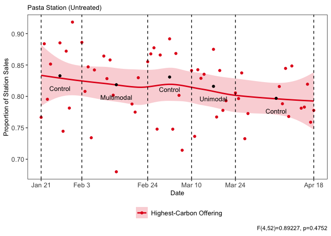<!-- -->

``` r
spring_prop_high <- ggarrange(spring_prop_high_ramen,spring_prop_high_grill,spring_prop_high_treatment,spring_prop_high_control,
          labels=c("A","B","C","D"),
          legend="none")
```

    ## `geom_smooth()` using method = 'loess' and formula = 'y ~ x'
    ## `geom_smooth()` using method = 'loess' and formula = 'y ~ x'
    ## `geom_smooth()` using method = 'loess' and formula = 'y ~ x'
    ## `geom_smooth()` using method = 'loess' and formula = 'y ~ x'

``` r
spring_prop_high <- annotate_figure(spring_prop_high,top=text_grob("Daily Sales Percentages of Highest-Carbon Offerings (%)", 
               color="black",face="bold",size = 12))
ggsave(filename="spring_prop_high.png",plot=spring_prop_high,path="/Users/kenjinchang/github/multimodal-framework-validation/figures",width=40,height=24,units="cm",dpi=150,limitsize=TRUE)
spring_prop_high
```

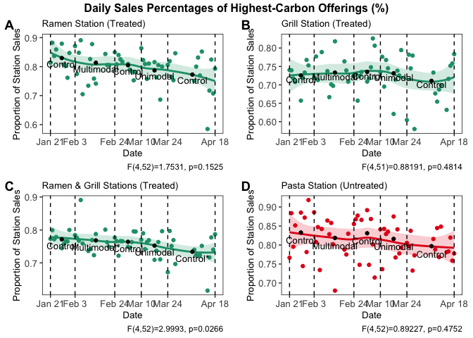<!-- -->

mean_carbon

``` r
spring_data %>%
  filter(station=="Grill") %>%
  filter(item_cat=="Main") %>%
  group_by(phase_interval,station) %>%
  summarise(total_carbon_cost=sum(corr_carbon_cost),total_sales=sum(count)) %>%
  mutate(mean_carbon_cost=total_carbon_cost/total_sales)
```

    ## `summarise()` has grouped output by 'phase_interval'. You can override using
    ## the `.groups` argument.

    ## # A tibble: 5 × 5
    ## # Groups:   phase_interval [5]
    ##   phase_interval station total_carbon_cost total_sales mean_carbon_cost
    ##   <chr>          <chr>               <dbl>       <int>            <dbl>
    ## 1 1              Grill               3251.        1122             2.90
    ## 2 2              Grill               4324.        1477             2.93
    ## 3 3              Grill               3746.        1276             2.94
    ## 4 4              Grill               3626.        1243             2.92
    ## 5 5              Grill               5412.        1903             2.84

``` r
spring_mean_carbon_grill_aov_data <- spring_data %>%
  filter(station=="Grill") %>%
  filter(item_cat=="Main") %>%
  group_by(date,phase_interval,station) %>%
  summarise(total_carbon_cost=sum(corr_carbon_cost),total_sales=sum(count)) %>%
  mutate(mean_carbon_cost=total_carbon_cost/total_sales) %>%
  mutate(date=case_when(date=="10-Apr"~"2025-4-10",
                        date=="10-Feb"~"2025-2-10",
                        date=="10-Mar"~"2025-3-10",
                        date=="11-Apr"~"2025-4-11",
                        date=="11-Feb"~"2025-2-11",
                        date=="11-Mar"~"2025-3-11",
                        date=="12-Feb"~"2025-2-12",
                        date=="12-Mar"~"2025-3-12",
                        date=="13-Feb"~"2025-2-13",
                        date=="13-Mar"~"2025-3-13",
                        date=="14-Apr"~"2025-4-14",
                        date=="14-Feb"~"2025-2-14",
                        date=="14-Mar"~"2025-3-14",
                        date=="15-Apr"~"2025-4-15",
                        date=="16-Apr"~"2025-4-16",
                        date=="17-Apr"~"2025-4-17",
                        date=="17-Mar"~"2025-3-17",
                        date=="18-Apr"~"2025-4-18",
                        date=="18-Mar"~"2025-3-18",
                        date=="19-Feb"~"2025-2-19",
                        date=="19-Mar"~"2025-3-19",
                        date=="20-Feb"~"2025-2-20",
                        date=="20-Mar"~"2025-3-20",
                        date=="21-Feb"~"2025-2-21",
                        date=="21-Jan"~"2025-1-21",
                        date=="21-Mar"~"2025-3-21",
                        date=="22-Jan"~"2025-1-22",
                        date=="23-Jan"~"2025-1-23",
                        date=="24-Feb"~"2025-2-24",
                        date=="24-Jan"~"2025-1-24",
                        date=="24-Mar"~"2025-3-24",
                        date=="25-Feb"~"2025-2-25",
                        date=="25-Mar"~"2025-3-25",
                        date=="26-Feb"~"2025-2-26",
                        date=="26-Mar"~"2025-3-26",
                        date=="27-Feb"~"2025-2-27",
                        date=="27-Jan"~"2025-1-27",
                        date=="27-Mar"~"2025-3-27",
                        date=="28-Feb"~"2025-2-28",
                        date=="28-Jan"~"2025-1-28",
                        date=="28-Mar"~"2025-3-28",
                        date=="29-Jan"~"2025-1-29",
                        date=="3-Feb"~"2025-2-3",
                        date=="3-Mar"~"2025-3-3",
                        date=="30-Jan"~"2025-1-30",
                        date=="31-Jan"~"2025-1-31",
                        date=="4-Feb"~"2025-2-4",
                        date=="4-Mar"~"2025-3-4",
                        date=="5-Feb"~"2025-2-5",
                        date=="5-Mar"~"2025-3-5",
                        date=="6-Feb"~"2025-2-6",
                        date=="6-Mar"~"2025-3-6",
                        date=="7-Apr"~"2025-4-7",
                        date=="7-Feb"~"2025-2-7",
                        date=="7-Mar"~"2025-3-7",
                        date=="8-Apr"~"2025-4-8",
                        date=="9-Apr"~"2025-4-9")) %>%
  mutate(date=as.Date(date)) %>%
  ungroup() %>%
  select(phase_interval,mean_carbon_cost) %>%
  arrange(phase_interval)
```

    ## `summarise()` has grouped output by 'date', 'phase_interval'. You can override
    ## using the `.groups` argument.

``` r
shapiro.test(spring_mean_carbon_grill_aov_data$mean_carbon_cost) 
```

    ## 
    ##  Shapiro-Wilk normality test
    ## 
    ## data:  spring_mean_carbon_grill_aov_data$mean_carbon_cost
    ## W = 0.96568, p-value = 0.1112

``` r
oneway.test(mean_carbon_cost~phase_interval,data=spring_mean_carbon_grill_aov_data,var.equal=TRUE)
```

    ## 
    ##  One-way analysis of means
    ## 
    ## data:  mean_carbon_cost and phase_interval
    ## F = 0.90995, num df = 4, denom df = 51, p-value = 0.4653

``` r
spring_mean_carbon_grill <- spring_data %>%
  filter(station=="Grill") %>%
  filter(item_cat=="Main") %>%
  group_by(date,phase_interval,station) %>%
  summarise(total_carbon_cost=sum(corr_carbon_cost),total_sales=sum(count)) %>%
  mutate(mean_carbon_cost=total_carbon_cost/total_sales) %>%
  mutate(date=case_when(date=="10-Apr"~"2025-4-10",
                        date=="10-Feb"~"2025-2-10",
                        date=="10-Mar"~"2025-3-10",
                        date=="11-Apr"~"2025-4-11",
                        date=="11-Feb"~"2025-2-11",
                        date=="11-Mar"~"2025-3-11",
                        date=="12-Feb"~"2025-2-12",
                        date=="12-Mar"~"2025-3-12",
                        date=="13-Feb"~"2025-2-13",
                        date=="13-Mar"~"2025-3-13",
                        date=="14-Apr"~"2025-4-14",
                        date=="14-Feb"~"2025-2-14",
                        date=="14-Mar"~"2025-3-14",
                        date=="15-Apr"~"2025-4-15",
                        date=="16-Apr"~"2025-4-16",
                        date=="17-Apr"~"2025-4-17",
                        date=="17-Mar"~"2025-3-17",
                        date=="18-Apr"~"2025-4-18",
                        date=="18-Mar"~"2025-3-18",
                        date=="19-Feb"~"2025-2-19",
                        date=="19-Mar"~"2025-3-19",
                        date=="20-Feb"~"2025-2-20",
                        date=="20-Mar"~"2025-3-20",
                        date=="21-Feb"~"2025-2-21",
                        date=="21-Jan"~"2025-1-21",
                        date=="21-Mar"~"2025-3-21",
                        date=="22-Jan"~"2025-1-22",
                        date=="23-Jan"~"2025-1-23",
                        date=="24-Feb"~"2025-2-24",
                        date=="24-Jan"~"2025-1-24",
                        date=="24-Mar"~"2025-3-24",
                        date=="25-Feb"~"2025-2-25",
                        date=="25-Mar"~"2025-3-25",
                        date=="26-Feb"~"2025-2-26",
                        date=="26-Mar"~"2025-3-26",
                        date=="27-Feb"~"2025-2-27",
                        date=="27-Jan"~"2025-1-27",
                        date=="27-Mar"~"2025-3-27",
                        date=="28-Feb"~"2025-2-28",
                        date=="28-Jan"~"2025-1-28",
                        date=="28-Mar"~"2025-3-28",
                        date=="29-Jan"~"2025-1-29",
                        date=="3-Feb"~"2025-2-3",
                        date=="3-Mar"~"2025-3-3",
                        date=="30-Jan"~"2025-1-30",
                        date=="31-Jan"~"2025-1-31",
                        date=="4-Feb"~"2025-2-4",
                        date=="4-Mar"~"2025-3-4",
                        date=="5-Feb"~"2025-2-5",
                        date=="5-Mar"~"2025-3-5",
                        date=="6-Feb"~"2025-2-6",
                        date=="6-Mar"~"2025-3-6",
                        date=="7-Apr"~"2025-4-7",
                        date=="7-Feb"~"2025-2-7",
                        date=="7-Mar"~"2025-3-7",
                        date=="8-Apr"~"2025-4-8",
                        date=="9-Apr"~"2025-4-9")) %>%
  mutate(date=as.Date(date)) %>%
  ggplot(aes(x=date,y=mean_carbon_cost,color=station,fill=station)) + 
  geom_smooth(alpha=0.2) + 
  geom_point() +
  geom_vline(xintercept=as.numeric(daily_prop_spring_data$date[spring_vline]),linetype=2) + 
  xlab("Date") + 
  ylab(bquote('Kilograms of CO'[2]*'e')) +
  scale_color_brewer(palette="Dark2",name="") +
  scale_fill_brewer(palette="Dark2",name="") +
  scale_x_date(breaks=as.Date(c("2025-01-21","2025-02-03","2025-02-24","2025-03-10","2025-03-24","2025-04-18")),labels=c("Jan 21","Feb 3","Feb 24","Mar 10","Mar 24","Apr 18")) +
  annotate("text",x=as.Date("2025-01-27"),y=2.897567-0.04,label="Control",size=10/.pt) +
  annotate("text",x=as.Date("2025-02-14"),y=2.927513-0.04,label="Multimodal",size=10/.pt) +
  annotate("text",x=as.Date("2025-03-03"),y=2.935598-0.04,label="Control",size=10/.pt) +
  annotate("text",x=as.Date("2025-03-17"),y=2.916774-0.04,label="Unimodal",size=10/.pt) +
  annotate("text",x=as.Date("2025-04-06"),y=2.844186-0.04,label="Control",size=10/.pt) +
  annotate("point",x=as.Date("2025-01-27"),y=2.897567) +
  annotate("point",x=as.Date("2025-02-14"),y=2.927513) +
  annotate("point",x=as.Date("2025-03-03"),y=2.935598) +
  annotate("point",x=as.Date("2025-03-17"),y=2.916774) +
  annotate("point",x=as.Date("2025-04-06"),y=2.844186) +
  labs(title="Grill Station (Treated)",caption="F(4,51)=0.90995,p=0.4653") +
  theme(aspect.ratio=0.55,legend.position="bottom",panel.grid=element_blank(),panel.background=element_rect(fill="white"),panel.border=element_rect(fill=NA),legend.title=element_text(size=10),legend.text=element_text(size=10),plot.title=element_text(size=10),axis.title=element_text(size=10),axis.text=element_text(size=10)) 
```

    ## `summarise()` has grouped output by 'date', 'phase_interval'. You can override
    ## using the `.groups` argument.

``` r
spring_mean_carbon_grill
```

    ## `geom_smooth()` using method = 'loess' and formula = 'y ~ x'

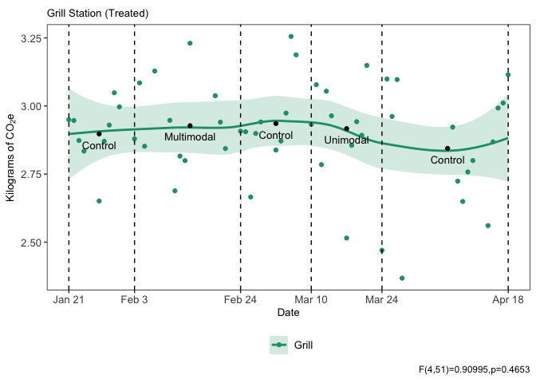<!-- -->

``` r
spring_data %>%
  filter(station=="Ramen") %>%
  filter(item_cat=="Main") %>%
  group_by(phase_interval,station) %>%
  summarise(total_carbon_cost=sum(corr_carbon_cost),total_sales=sum(count)) %>%
  mutate(mean_carbon_cost=total_carbon_cost/total_sales)
```

    ## `summarise()` has grouped output by 'phase_interval'. You can override using
    ## the `.groups` argument.

    ## # A tibble: 5 × 5
    ## # Groups:   phase_interval [5]
    ##   phase_interval station total_carbon_cost total_sales mean_carbon_cost
    ##   <chr>          <chr>               <dbl>       <int>            <dbl>
    ## 1 1              Ramen                328.         892            0.367
    ## 2 2              Ramen                418.        1141            0.366
    ## 3 3              Ramen                330.         902            0.365
    ## 4 4              Ramen                279.         765            0.364
    ## 5 5              Ramen                418.        1152            0.363

``` r
spring_mean_carbon_ramen_aov_data <- spring_data %>%
  filter(station=="Ramen") %>%
  filter(item_cat=="Main") %>%
  group_by(date,phase_interval,station) %>%
  summarise(total_carbon_cost=sum(corr_carbon_cost),total_sales=sum(count)) %>%
  mutate(mean_carbon_cost=total_carbon_cost/total_sales) %>%
  mutate(date=case_when(date=="10-Apr"~"2025-4-10",
                        date=="10-Feb"~"2025-2-10",
                        date=="10-Mar"~"2025-3-10",
                        date=="11-Apr"~"2025-4-11",
                        date=="11-Feb"~"2025-2-11",
                        date=="11-Mar"~"2025-3-11",
                        date=="12-Feb"~"2025-2-12",
                        date=="12-Mar"~"2025-3-12",
                        date=="13-Feb"~"2025-2-13",
                        date=="13-Mar"~"2025-3-13",
                        date=="14-Apr"~"2025-4-14",
                        date=="14-Feb"~"2025-2-14",
                        date=="14-Mar"~"2025-3-14",
                        date=="15-Apr"~"2025-4-15",
                        date=="16-Apr"~"2025-4-16",
                        date=="17-Apr"~"2025-4-17",
                        date=="17-Mar"~"2025-3-17",
                        date=="18-Apr"~"2025-4-18",
                        date=="18-Mar"~"2025-3-18",
                        date=="19-Feb"~"2025-2-19",
                        date=="19-Mar"~"2025-3-19",
                        date=="20-Feb"~"2025-2-20",
                        date=="20-Mar"~"2025-3-20",
                        date=="21-Feb"~"2025-2-21",
                        date=="21-Jan"~"2025-1-21",
                        date=="21-Mar"~"2025-3-21",
                        date=="22-Jan"~"2025-1-22",
                        date=="23-Jan"~"2025-1-23",
                        date=="24-Feb"~"2025-2-24",
                        date=="24-Jan"~"2025-1-24",
                        date=="24-Mar"~"2025-3-24",
                        date=="25-Feb"~"2025-2-25",
                        date=="25-Mar"~"2025-3-25",
                        date=="26-Feb"~"2025-2-26",
                        date=="26-Mar"~"2025-3-26",
                        date=="27-Feb"~"2025-2-27",
                        date=="27-Jan"~"2025-1-27",
                        date=="27-Mar"~"2025-3-27",
                        date=="28-Feb"~"2025-2-28",
                        date=="28-Jan"~"2025-1-28",
                        date=="28-Mar"~"2025-3-28",
                        date=="29-Jan"~"2025-1-29",
                        date=="3-Feb"~"2025-2-3",
                        date=="3-Mar"~"2025-3-3",
                        date=="30-Jan"~"2025-1-30",
                        date=="31-Jan"~"2025-1-31",
                        date=="4-Feb"~"2025-2-4",
                        date=="4-Mar"~"2025-3-4",
                        date=="5-Feb"~"2025-2-5",
                        date=="5-Mar"~"2025-3-5",
                        date=="6-Feb"~"2025-2-6",
                        date=="6-Mar"~"2025-3-6",
                        date=="7-Apr"~"2025-4-7",
                        date=="7-Feb"~"2025-2-7",
                        date=="7-Mar"~"2025-3-7",
                        date=="8-Apr"~"2025-4-8",
                        date=="9-Apr"~"2025-4-9")) %>%
  mutate(date=as.Date(date)) %>%
  ungroup() %>%
  select(phase_interval,mean_carbon_cost) %>%
  arrange(phase_interval)
```

    ## `summarise()` has grouped output by 'date', 'phase_interval'. You can override
    ## using the `.groups` argument.

``` r
shapiro.test(spring_mean_carbon_ramen_aov_data$mean_carbon_cost) 
```

    ## 
    ##  Shapiro-Wilk normality test
    ## 
    ## data:  spring_mean_carbon_ramen_aov_data$mean_carbon_cost
    ## W = 0.93245, p-value = 0.003391

``` r
oneway.test(mean_carbon_cost~phase_interval,data=spring_mean_carbon_ramen_aov_data,var.equal=TRUE)
```

    ## 
    ##  One-way analysis of means
    ## 
    ## data:  mean_carbon_cost and phase_interval
    ## F = 1.7531, num df = 4, denom df = 52, p-value = 0.1525

``` r
spring_mean_carbon_ramen <- spring_data %>%
  filter(station=="Ramen") %>%
  filter(item_cat=="Main") %>%
  group_by(date,phase_interval,station) %>%
  summarise(total_carbon_cost=sum(corr_carbon_cost),total_sales=sum(count)) %>%
  mutate(mean_carbon_cost=total_carbon_cost/total_sales) %>%
  mutate(date=case_when(date=="10-Apr"~"2025-4-10",
                        date=="10-Feb"~"2025-2-10",
                        date=="10-Mar"~"2025-3-10",
                        date=="11-Apr"~"2025-4-11",
                        date=="11-Feb"~"2025-2-11",
                        date=="11-Mar"~"2025-3-11",
                        date=="12-Feb"~"2025-2-12",
                        date=="12-Mar"~"2025-3-12",
                        date=="13-Feb"~"2025-2-13",
                        date=="13-Mar"~"2025-3-13",
                        date=="14-Apr"~"2025-4-14",
                        date=="14-Feb"~"2025-2-14",
                        date=="14-Mar"~"2025-3-14",
                        date=="15-Apr"~"2025-4-15",
                        date=="16-Apr"~"2025-4-16",
                        date=="17-Apr"~"2025-4-17",
                        date=="17-Mar"~"2025-3-17",
                        date=="18-Apr"~"2025-4-18",
                        date=="18-Mar"~"2025-3-18",
                        date=="19-Feb"~"2025-2-19",
                        date=="19-Mar"~"2025-3-19",
                        date=="20-Feb"~"2025-2-20",
                        date=="20-Mar"~"2025-3-20",
                        date=="21-Feb"~"2025-2-21",
                        date=="21-Jan"~"2025-1-21",
                        date=="21-Mar"~"2025-3-21",
                        date=="22-Jan"~"2025-1-22",
                        date=="23-Jan"~"2025-1-23",
                        date=="24-Feb"~"2025-2-24",
                        date=="24-Jan"~"2025-1-24",
                        date=="24-Mar"~"2025-3-24",
                        date=="25-Feb"~"2025-2-25",
                        date=="25-Mar"~"2025-3-25",
                        date=="26-Feb"~"2025-2-26",
                        date=="26-Mar"~"2025-3-26",
                        date=="27-Feb"~"2025-2-27",
                        date=="27-Jan"~"2025-1-27",
                        date=="27-Mar"~"2025-3-27",
                        date=="28-Feb"~"2025-2-28",
                        date=="28-Jan"~"2025-1-28",
                        date=="28-Mar"~"2025-3-28",
                        date=="29-Jan"~"2025-1-29",
                        date=="3-Feb"~"2025-2-3",
                        date=="3-Mar"~"2025-3-3",
                        date=="30-Jan"~"2025-1-30",
                        date=="31-Jan"~"2025-1-31",
                        date=="4-Feb"~"2025-2-4",
                        date=="4-Mar"~"2025-3-4",
                        date=="5-Feb"~"2025-2-5",
                        date=="5-Mar"~"2025-3-5",
                        date=="6-Feb"~"2025-2-6",
                        date=="6-Mar"~"2025-3-6",
                        date=="7-Apr"~"2025-4-7",
                        date=="7-Feb"~"2025-2-7",
                        date=="7-Mar"~"2025-3-7",
                        date=="8-Apr"~"2025-4-8",
                        date=="9-Apr"~"2025-4-9")) %>%
  mutate(date=as.Date(date)) %>%
  ggplot(aes(x=date,y=mean_carbon_cost,color=station,fill=station)) + 
  geom_smooth(alpha=0.2) + 
  geom_point() +
  geom_vline(xintercept=as.numeric(daily_prop_spring_data$date[spring_vline]),linetype=2) + 
  xlab("Date") + 
  ylab(bquote('Kilograms of CO'[2]*'e')) +
  scale_color_brewer(palette="Dark2",name="") +
  scale_fill_brewer(palette="Dark2",name="") +
  scale_x_date(breaks=as.Date(c("2025-01-21","2025-02-03","2025-02-24","2025-03-10","2025-03-24","2025-04-18")),labels=c("Jan 21","Feb 3","Feb 24","Mar 10","Mar 24","Apr 18")) +
  annotate("text",x=as.Date("2025-01-27"),y=0.3672164-0.001,label="Control",size=10/.pt) +
  annotate("text",x=as.Date("2025-02-14"),y=0.3660254-0.001,label="Multimodal",size=10/.pt) +
  annotate("text",x=as.Date("2025-03-03"),y=0.3654076-0.001,label="Control",size=10/.pt) +
  annotate("text",x=as.Date("2025-03-17"),y=0.3640941-0.001,label="Unimodal",size=10/.pt) +
  annotate("text",x=as.Date("2025-04-06"),y=0.3630433-0.001,label="Control",size=10/.pt) +
  annotate("point",x=as.Date("2025-01-27"),y=0.3672164) +
  annotate("point",x=as.Date("2025-02-14"),y=0.3660254) +
  annotate("point",x=as.Date("2025-03-03"),y=0.3654076) +
  annotate("point",x=as.Date("2025-03-17"),y=0.3640941) +
  annotate("point",x=as.Date("2025-04-06"),y=0.3630433) +
  labs(title="Ramen Station (Treated)",caption="F(4,52)=1.7531, p=0.1525") +
  theme(aspect.ratio=0.55,legend.position="bottom",panel.grid=element_blank(),panel.background=element_rect(fill="white"),panel.border=element_rect(fill=NA),legend.title=element_text(size=10),legend.text=element_text(size=10),plot.title=element_text(size=10),axis.title=element_text(size=10),axis.text=element_text(size=10)) 
```

    ## `summarise()` has grouped output by 'date', 'phase_interval'. You can override
    ## using the `.groups` argument.

``` r
spring_mean_carbon_ramen
```

    ## `geom_smooth()` using method = 'loess' and formula = 'y ~ x'

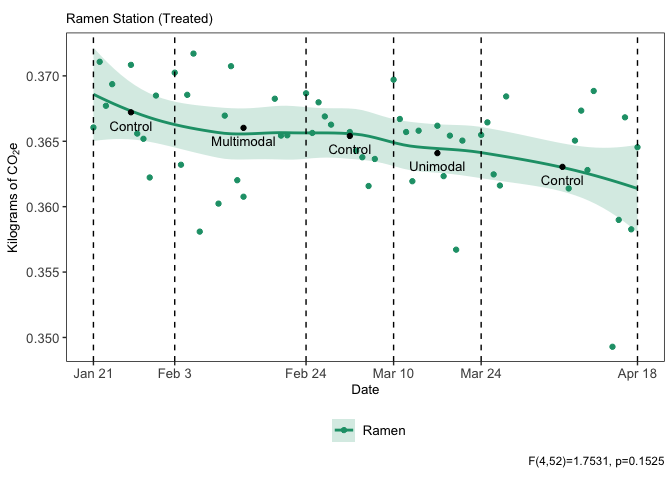<!-- -->

``` r
spring_data %>%
  filter(station=="Ramen"|station=="Grill") %>%
  filter(item_cat=="Main") %>%
  group_by(phase_interval) %>%
  summarise(total_carbon_cost=sum(corr_carbon_cost),total_sales=sum(count)) %>%
  mutate(mean_carbon_cost=total_carbon_cost/total_sales)
```

    ## # A tibble: 5 × 4
    ##   phase_interval total_carbon_cost total_sales mean_carbon_cost
    ##   <chr>                      <dbl>       <int>            <dbl>
    ## 1 1                          3579.        2014             1.78
    ## 2 2                          4742.        2618             1.81
    ## 3 3                          4075.        2178             1.87
    ## 4 4                          3904.        2008             1.94
    ## 5 5                          5831.        3055             1.91

``` r
spring_mean_carbon_treatment_aov_data <- spring_data %>%
  filter(station=="Ramen"|station=="Grill") %>%
  filter(item_cat=="Main") %>%
  group_by(date,phase_interval,station_type) %>%
  summarise(total_carbon_cost=sum(corr_carbon_cost),total_sales=sum(count)) %>%
  mutate(mean_carbon_cost=total_carbon_cost/total_sales) %>%
  mutate(date=case_when(date=="10-Apr"~"2025-4-10",
                        date=="10-Feb"~"2025-2-10",
                        date=="10-Mar"~"2025-3-10",
                        date=="11-Apr"~"2025-4-11",
                        date=="11-Feb"~"2025-2-11",
                        date=="11-Mar"~"2025-3-11",
                        date=="12-Feb"~"2025-2-12",
                        date=="12-Mar"~"2025-3-12",
                        date=="13-Feb"~"2025-2-13",
                        date=="13-Mar"~"2025-3-13",
                        date=="14-Apr"~"2025-4-14",
                        date=="14-Feb"~"2025-2-14",
                        date=="14-Mar"~"2025-3-14",
                        date=="15-Apr"~"2025-4-15",
                        date=="16-Apr"~"2025-4-16",
                        date=="17-Apr"~"2025-4-17",
                        date=="17-Mar"~"2025-3-17",
                        date=="18-Apr"~"2025-4-18",
                        date=="18-Mar"~"2025-3-18",
                        date=="19-Feb"~"2025-2-19",
                        date=="19-Mar"~"2025-3-19",
                        date=="20-Feb"~"2025-2-20",
                        date=="20-Mar"~"2025-3-20",
                        date=="21-Feb"~"2025-2-21",
                        date=="21-Jan"~"2025-1-21",
                        date=="21-Mar"~"2025-3-21",
                        date=="22-Jan"~"2025-1-22",
                        date=="23-Jan"~"2025-1-23",
                        date=="24-Feb"~"2025-2-24",
                        date=="24-Jan"~"2025-1-24",
                        date=="24-Mar"~"2025-3-24",
                        date=="25-Feb"~"2025-2-25",
                        date=="25-Mar"~"2025-3-25",
                        date=="26-Feb"~"2025-2-26",
                        date=="26-Mar"~"2025-3-26",
                        date=="27-Feb"~"2025-2-27",
                        date=="27-Jan"~"2025-1-27",
                        date=="27-Mar"~"2025-3-27",
                        date=="28-Feb"~"2025-2-28",
                        date=="28-Jan"~"2025-1-28",
                        date=="28-Mar"~"2025-3-28",
                        date=="29-Jan"~"2025-1-29",
                        date=="3-Feb"~"2025-2-3",
                        date=="3-Mar"~"2025-3-3",
                        date=="30-Jan"~"2025-1-30",
                        date=="31-Jan"~"2025-1-31",
                        date=="4-Feb"~"2025-2-4",
                        date=="4-Mar"~"2025-3-4",
                        date=="5-Feb"~"2025-2-5",
                        date=="5-Mar"~"2025-3-5",
                        date=="6-Feb"~"2025-2-6",
                        date=="6-Mar"~"2025-3-6",
                        date=="7-Apr"~"2025-4-7",
                        date=="7-Feb"~"2025-2-7",
                        date=="7-Mar"~"2025-3-7",
                        date=="8-Apr"~"2025-4-8",
                        date=="9-Apr"~"2025-4-9")) %>%
  mutate(date=as.Date(date)) %>%
  ungroup() %>%
  select(phase_interval,mean_carbon_cost) %>%
  arrange(phase_interval)
```

    ## `summarise()` has grouped output by 'date', 'phase_interval'. You can override
    ## using the `.groups` argument.

``` r
shapiro.test(spring_mean_carbon_treatment_aov_data$mean_carbon_cost) 
```

    ## 
    ##  Shapiro-Wilk normality test
    ## 
    ## data:  spring_mean_carbon_treatment_aov_data$mean_carbon_cost
    ## W = 0.73312, p-value = 7.575e-09

``` r
oneway.test(mean_carbon_cost~phase_interval,data=spring_mean_carbon_treatment_aov_data,var.equal=TRUE)
```

    ## 
    ##  One-way analysis of means
    ## 
    ## data:  mean_carbon_cost and phase_interval
    ## F = 1.1613, num df = 4, denom df = 52, p-value = 0.3386

``` r
spring_mean_carbon_treatment <- spring_data %>%
  filter(station=="Ramen"|station=="Grill") %>%
  filter(item_cat=="Main") %>%
  group_by(date,phase_interval,station_type) %>%
  summarise(total_carbon_cost=sum(corr_carbon_cost),total_sales=sum(count)) %>%
  mutate(mean_carbon_cost=total_carbon_cost/total_sales) %>%
  mutate(date=case_when(date=="10-Apr"~"2025-4-10",
                        date=="10-Feb"~"2025-2-10",
                        date=="10-Mar"~"2025-3-10",
                        date=="11-Apr"~"2025-4-11",
                        date=="11-Feb"~"2025-2-11",
                        date=="11-Mar"~"2025-3-11",
                        date=="12-Feb"~"2025-2-12",
                        date=="12-Mar"~"2025-3-12",
                        date=="13-Feb"~"2025-2-13",
                        date=="13-Mar"~"2025-3-13",
                        date=="14-Apr"~"2025-4-14",
                        date=="14-Feb"~"2025-2-14",
                        date=="14-Mar"~"2025-3-14",
                        date=="15-Apr"~"2025-4-15",
                        date=="16-Apr"~"2025-4-16",
                        date=="17-Apr"~"2025-4-17",
                        date=="17-Mar"~"2025-3-17",
                        date=="18-Apr"~"2025-4-18",
                        date=="18-Mar"~"2025-3-18",
                        date=="19-Feb"~"2025-2-19",
                        date=="19-Mar"~"2025-3-19",
                        date=="20-Feb"~"2025-2-20",
                        date=="20-Mar"~"2025-3-20",
                        date=="21-Feb"~"2025-2-21",
                        date=="21-Jan"~"2025-1-21",
                        date=="21-Mar"~"2025-3-21",
                        date=="22-Jan"~"2025-1-22",
                        date=="23-Jan"~"2025-1-23",
                        date=="24-Feb"~"2025-2-24",
                        date=="24-Jan"~"2025-1-24",
                        date=="24-Mar"~"2025-3-24",
                        date=="25-Feb"~"2025-2-25",
                        date=="25-Mar"~"2025-3-25",
                        date=="26-Feb"~"2025-2-26",
                        date=="26-Mar"~"2025-3-26",
                        date=="27-Feb"~"2025-2-27",
                        date=="27-Jan"~"2025-1-27",
                        date=="27-Mar"~"2025-3-27",
                        date=="28-Feb"~"2025-2-28",
                        date=="28-Jan"~"2025-1-28",
                        date=="28-Mar"~"2025-3-28",
                        date=="29-Jan"~"2025-1-29",
                        date=="3-Feb"~"2025-2-3",
                        date=="3-Mar"~"2025-3-3",
                        date=="30-Jan"~"2025-1-30",
                        date=="31-Jan"~"2025-1-31",
                        date=="4-Feb"~"2025-2-4",
                        date=="4-Mar"~"2025-3-4",
                        date=="5-Feb"~"2025-2-5",
                        date=="5-Mar"~"2025-3-5",
                        date=="6-Feb"~"2025-2-6",
                        date=="6-Mar"~"2025-3-6",
                        date=="7-Apr"~"2025-4-7",
                        date=="7-Feb"~"2025-2-7",
                        date=="7-Mar"~"2025-3-7",
                        date=="8-Apr"~"2025-4-8",
                        date=="9-Apr"~"2025-4-9")) %>%
  mutate(date=as.Date(date)) %>%
  ggplot(aes(x=date,y=mean_carbon_cost,color=station_type,fill=station_type)) + 
  geom_smooth(alpha=0.2) + 
  geom_point() +
  geom_vline(xintercept=as.numeric(daily_prop_spring_data$date[spring_vline]),linetype=2) + 
  xlab("Date") + 
  ylab(bquote('Kilograms of CO'[2]*'e')) +
  scale_color_brewer(palette="Dark2",name="") +
  scale_fill_brewer(palette="Dark2",name="") +
  scale_x_date(breaks=as.Date(c("2025-01-21","2025-02-03","2025-02-24","2025-03-10","2025-03-24","2025-04-18")),labels=c("Jan 21","Feb 3","Feb 24","Mar 10","Mar 24","Apr 18")) +
  annotate("text",x=as.Date("2025-01-27"),y=1.776875-0.1,label="Control",size=10/.pt) +
  annotate("text",x=as.Date("2025-02-14"),y=1.811143-0.1,label="Multimodal",size=10/.pt) +
  annotate("text",x=as.Date("2025-03-03"),y=1.871176-0.1,label="Control",size=10/.pt) +
  annotate("text",x=as.Date("2025-03-17"),y=1.944264-0.1,label="Unimodal",size=10/.pt) +
  annotate("text",x=as.Date("2025-04-06"),y=1.908580-0.1,label="Control",size=10/.pt) +
  annotate("point",x=as.Date("2025-01-27"),y=1.776875) +
  annotate("point",x=as.Date("2025-02-14"),y=1.811143) +
  annotate("point",x=as.Date("2025-03-03"),y=1.871176) +
  annotate("point",x=as.Date("2025-03-17"),y=1.944264) +
  annotate("point",x=as.Date("2025-04-06"),y=1.908580) +
  labs(title="Ramen & Grill Stations (Treated)",caption="F(4,52)=1.1613, p=0.3386") +
  theme(aspect.ratio=0.55,legend.position="bottom",panel.grid=element_blank(),panel.background=element_rect(fill="white"),panel.border=element_rect(fill=NA),legend.title=element_text(size=10),legend.text=element_text(size=10),plot.title=element_text(size=10),axis.title=element_text(size=10),axis.text=element_text(size=10)) 
```

    ## `summarise()` has grouped output by 'date', 'phase_interval'. You can override
    ## using the `.groups` argument.

``` r
spring_mean_carbon_treatment
```

    ## `geom_smooth()` using method = 'loess' and formula = 'y ~ x'

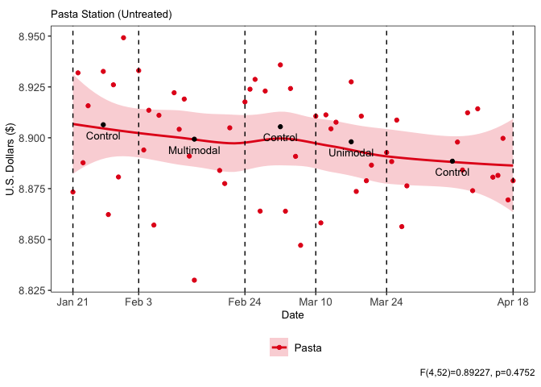<!-- -->

``` r
spring_data %>%
  filter(station=="Pasta") %>%
  filter(item_cat=="Main") %>%
  group_by(phase_interval) %>% 
  summarise(total_carbon_cost=sum(corr_carbon_cost),total_sales=sum(count)) %>%
  mutate(mean_carbon_cost=total_carbon_cost/total_sales)
```

    ## # A tibble: 5 × 4
    ##   phase_interval total_carbon_cost total_sales mean_carbon_cost
    ##   <chr>                      <dbl>       <int>            <dbl>
    ## 1 1                           736.        1352            0.544
    ## 2 2                           877.        1632            0.538
    ## 3 3                           665.        1224            0.544
    ## 4 4                           621.        1158            0.536
    ## 5 5                           872.        1655            0.527

``` r
spring_mean_carbon_control_aov_data <- spring_data %>%
  filter(station=="Pasta") %>%
  filter(item_cat=="Main") %>%
  group_by(date,phase_interval,station) %>%
  summarise(total_carbon_cost=sum(corr_carbon_cost),total_sales=sum(count)) %>%
  mutate(mean_carbon_cost=total_carbon_cost/total_sales) %>%
  mutate(date=case_when(date=="10-Apr"~"2025-4-10",
                        date=="10-Feb"~"2025-2-10",
                        date=="10-Mar"~"2025-3-10",
                        date=="11-Apr"~"2025-4-11",
                        date=="11-Feb"~"2025-2-11",
                        date=="11-Mar"~"2025-3-11",
                        date=="12-Feb"~"2025-2-12",
                        date=="12-Mar"~"2025-3-12",
                        date=="13-Feb"~"2025-2-13",
                        date=="13-Mar"~"2025-3-13",
                        date=="14-Apr"~"2025-4-14",
                        date=="14-Feb"~"2025-2-14",
                        date=="14-Mar"~"2025-3-14",
                        date=="15-Apr"~"2025-4-15",
                        date=="16-Apr"~"2025-4-16",
                        date=="17-Apr"~"2025-4-17",
                        date=="17-Mar"~"2025-3-17",
                        date=="18-Apr"~"2025-4-18",
                        date=="18-Mar"~"2025-3-18",
                        date=="19-Feb"~"2025-2-19",
                        date=="19-Mar"~"2025-3-19",
                        date=="20-Feb"~"2025-2-20",
                        date=="20-Mar"~"2025-3-20",
                        date=="21-Feb"~"2025-2-21",
                        date=="21-Jan"~"2025-1-21",
                        date=="21-Mar"~"2025-3-21",
                        date=="22-Jan"~"2025-1-22",
                        date=="23-Jan"~"2025-1-23",
                        date=="24-Feb"~"2025-2-24",
                        date=="24-Jan"~"2025-1-24",
                        date=="24-Mar"~"2025-3-24",
                        date=="25-Feb"~"2025-2-25",
                        date=="25-Mar"~"2025-3-25",
                        date=="26-Feb"~"2025-2-26",
                        date=="26-Mar"~"2025-3-26",
                        date=="27-Feb"~"2025-2-27",
                        date=="27-Jan"~"2025-1-27",
                        date=="27-Mar"~"2025-3-27",
                        date=="28-Feb"~"2025-2-28",
                        date=="28-Jan"~"2025-1-28",
                        date=="28-Mar"~"2025-3-28",
                        date=="29-Jan"~"2025-1-29",
                        date=="3-Feb"~"2025-2-3",
                        date=="3-Mar"~"2025-3-3",
                        date=="30-Jan"~"2025-1-30",
                        date=="31-Jan"~"2025-1-31",
                        date=="4-Feb"~"2025-2-4",
                        date=="4-Mar"~"2025-3-4",
                        date=="5-Feb"~"2025-2-5",
                        date=="5-Mar"~"2025-3-5",
                        date=="6-Feb"~"2025-2-6",
                        date=="6-Mar"~"2025-3-6",
                        date=="7-Apr"~"2025-4-7",
                        date=="7-Feb"~"2025-2-7",
                        date=="7-Mar"~"2025-3-7",
                        date=="8-Apr"~"2025-4-8",
                        date=="9-Apr"~"2025-4-9")) %>%
  mutate(date=as.Date(date)) %>%
  ungroup() %>%
  select(phase_interval,mean_carbon_cost) %>%
  arrange(phase_interval)
```

    ## `summarise()` has grouped output by 'date', 'phase_interval'. You can override
    ## using the `.groups` argument.

``` r
shapiro.test(spring_mean_carbon_control_aov_data$mean_carbon_cost) 
```

    ## 
    ##  Shapiro-Wilk normality test
    ## 
    ## data:  spring_mean_carbon_control_aov_data$mean_carbon_cost
    ## W = 0.98085, p-value = 0.5006

``` r
oneway.test(mean_carbon_cost~phase_interval,data=spring_mean_carbon_control_aov_data,var.equal=TRUE)
```

    ## 
    ##  One-way analysis of means
    ## 
    ## data:  mean_carbon_cost and phase_interval
    ## F = 0.89227, num df = 4, denom df = 52, p-value = 0.4752

``` r
spring_mean_carbon_control <- spring_data %>%
  filter(station=="Pasta") %>%
  filter(item_cat=="Main") %>%
  group_by(date,phase_interval,station) %>%
  summarise(total_carbon_cost=sum(corr_carbon_cost),total_sales=sum(count)) %>%
  mutate(mean_carbon_cost=total_carbon_cost/total_sales) %>%
  mutate(date=case_when(date=="10-Apr"~"2025-4-10",
                        date=="10-Feb"~"2025-2-10",
                        date=="10-Mar"~"2025-3-10",
                        date=="11-Apr"~"2025-4-11",
                        date=="11-Feb"~"2025-2-11",
                        date=="11-Mar"~"2025-3-11",
                        date=="12-Feb"~"2025-2-12",
                        date=="12-Mar"~"2025-3-12",
                        date=="13-Feb"~"2025-2-13",
                        date=="13-Mar"~"2025-3-13",
                        date=="14-Apr"~"2025-4-14",
                        date=="14-Feb"~"2025-2-14",
                        date=="14-Mar"~"2025-3-14",
                        date=="15-Apr"~"2025-4-15",
                        date=="16-Apr"~"2025-4-16",
                        date=="17-Apr"~"2025-4-17",
                        date=="17-Mar"~"2025-3-17",
                        date=="18-Apr"~"2025-4-18",
                        date=="18-Mar"~"2025-3-18",
                        date=="19-Feb"~"2025-2-19",
                        date=="19-Mar"~"2025-3-19",
                        date=="20-Feb"~"2025-2-20",
                        date=="20-Mar"~"2025-3-20",
                        date=="21-Feb"~"2025-2-21",
                        date=="21-Jan"~"2025-1-21",
                        date=="21-Mar"~"2025-3-21",
                        date=="22-Jan"~"2025-1-22",
                        date=="23-Jan"~"2025-1-23",
                        date=="24-Feb"~"2025-2-24",
                        date=="24-Jan"~"2025-1-24",
                        date=="24-Mar"~"2025-3-24",
                        date=="25-Feb"~"2025-2-25",
                        date=="25-Mar"~"2025-3-25",
                        date=="26-Feb"~"2025-2-26",
                        date=="26-Mar"~"2025-3-26",
                        date=="27-Feb"~"2025-2-27",
                        date=="27-Jan"~"2025-1-27",
                        date=="27-Mar"~"2025-3-27",
                        date=="28-Feb"~"2025-2-28",
                        date=="28-Jan"~"2025-1-28",
                        date=="28-Mar"~"2025-3-28",
                        date=="29-Jan"~"2025-1-29",
                        date=="3-Feb"~"2025-2-3",
                        date=="3-Mar"~"2025-3-3",
                        date=="30-Jan"~"2025-1-30",
                        date=="31-Jan"~"2025-1-31",
                        date=="4-Feb"~"2025-2-4",
                        date=="4-Mar"~"2025-3-4",
                        date=="5-Feb"~"2025-2-5",
                        date=="5-Mar"~"2025-3-5",
                        date=="6-Feb"~"2025-2-6",
                        date=="6-Mar"~"2025-3-6",
                        date=="7-Apr"~"2025-4-7",
                        date=="7-Feb"~"2025-2-7",
                        date=="7-Mar"~"2025-3-7",
                        date=="8-Apr"~"2025-4-8",
                        date=="9-Apr"~"2025-4-9")) %>%
  mutate(date=as.Date(date)) %>%
  ggplot(aes(x=date,y=mean_carbon_cost,color=station,fill=station)) + 
  geom_smooth(alpha=0.2) + 
  geom_point() +
  geom_vline(xintercept=as.numeric(daily_prop_spring_data$date[spring_vline]),linetype=2) + 
  xlab("Date") + 
  ylab(bquote('Kilograms of CO'[2]*'e')) +
  scale_color_brewer(palette="Set1",name="") +
  scale_fill_brewer(palette="Set1",name="") +
  scale_x_date(breaks=as.Date(c("2025-01-21","2025-02-03","2025-02-24","2025-03-10","2025-03-24","2025-04-18")),labels=c("Jan 21","Feb 3","Feb 24","Mar 10","Mar 24","Apr 18")) +
  annotate("text",x=as.Date("2025-01-27"),y=0.5444727-0.01,label="Control",size=10/.pt) +
  annotate("text",x=as.Date("2025-02-14"),y=0.5375752-0.01,label="Multimodal",size=10/.pt) +
  annotate("text",x=as.Date("2025-03-03"),y=0.5435225-0.01,label="Control",size=10/.pt) +
  annotate("text",x=as.Date("2025-03-17"),y=0.5363303-0.01,label="Unimodal",size=10/.pt) +
  annotate("text",x=as.Date("2025-04-06"),y=0.5270691-0.01,label="Control",size=10/.pt) +
  annotate("point",x=as.Date("2025-01-27"),y=0.5444727) +
  annotate("point",x=as.Date("2025-02-14"),y=0.5375752) +
  annotate("point",x=as.Date("2025-03-03"),y=0.5435225) +
  annotate("point",x=as.Date("2025-03-17"),y=0.5363303) +
  annotate("point",x=as.Date("2025-04-06"),y=0.5270691) +
  labs(title="Pasta Station (Untreated)",caption="F(4,52)=0.89227, p=0.4752") +
  theme(aspect.ratio=0.55,legend.position="bottom",panel.grid=element_blank(),panel.background=element_rect(fill="white"),panel.border=element_rect(fill=NA),legend.title=element_text(size=10),legend.text=element_text(size=10),plot.title=element_text(size=10),axis.title=element_text(size=10),axis.text=element_text(size=10)) 
```

    ## `summarise()` has grouped output by 'date', 'phase_interval'. You can override
    ## using the `.groups` argument.

``` r
spring_mean_carbon_control
```

    ## `geom_smooth()` using method = 'loess' and formula = 'y ~ x'

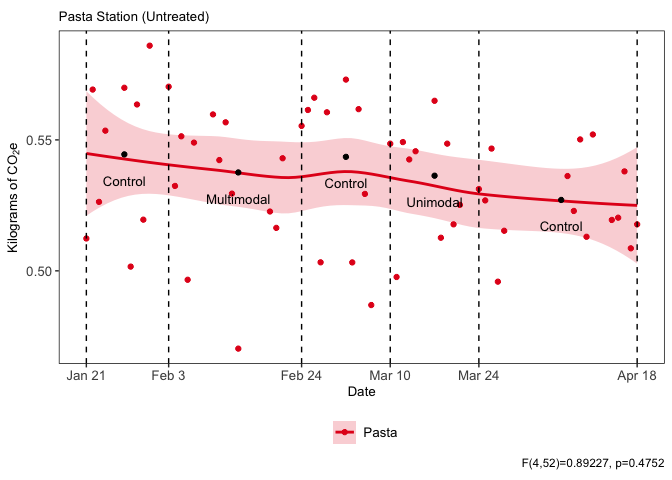<!-- -->

``` r
spring_mean_carbon <- ggarrange(spring_mean_carbon_ramen,spring_mean_carbon_grill,spring_mean_carbon_treatment,spring_mean_carbon_control,
          labels=c("A","B","C","D"),
          legend="none")
```

    ## `geom_smooth()` using method = 'loess' and formula = 'y ~ x'
    ## `geom_smooth()` using method = 'loess' and formula = 'y ~ x'
    ## `geom_smooth()` using method = 'loess' and formula = 'y ~ x'
    ## `geom_smooth()` using method = 'loess' and formula = 'y ~ x'

``` r
spring_mean_carbon <- annotate_figure(spring_mean_carbon,top=text_grob("Mean Emissions Cost of Station Sales (kg CO2e)", 
               color="black",face="bold",size=12))
ggsave(filename="spring_mean_carbon.png",plot=spring_mean_carbon,path="/Users/kenjinchang/github/multimodal-framework-validation/figures",width=40,height=24,units="cm",dpi=150,limitsize=TRUE)
spring_mean_carbon
```

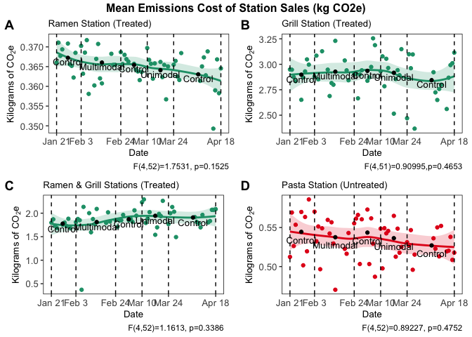<!-- -->
mean_spend

``` r
spring_data %>%
  filter(station=="Grill") %>%
  filter(item_cat=="Main") %>%
  group_by(phase_interval) %>%
  summarise(total_dollar_cost=sum(corr_dollar_cost),total_sales=sum(count)) %>%
  mutate(mean_dollar_cost=total_dollar_cost/total_sales)
```

    ## # A tibble: 5 × 4
    ##   phase_interval total_dollar_cost total_sales mean_dollar_cost
    ##   <chr>                      <dbl>       <int>            <dbl>
    ## 1 1                         10090.        1122             8.99
    ## 2 2                         13235.        1477             8.96
    ## 3 3                         11438.        1276             8.96
    ## 4 4                         11162.        1243             8.98
    ## 5 5                         17092.        1903             8.98

``` r
spring_mean_spend_grill_aov_data <- spring_data %>%
  filter(station=="Grill") %>%
  filter(item_cat=="Main") %>%
  group_by(date,phase_interval,station) %>%
  summarise(total_dollar_cost=sum(corr_dollar_cost),total_sales=sum(count)) %>%
  mutate(mean_dollar_cost=total_dollar_cost/total_sales) %>%
  mutate(date=case_when(date=="10-Apr"~"2025-4-10",
                        date=="10-Feb"~"2025-2-10",
                        date=="10-Mar"~"2025-3-10",
                        date=="11-Apr"~"2025-4-11",
                        date=="11-Feb"~"2025-2-11",
                        date=="11-Mar"~"2025-3-11",
                        date=="12-Feb"~"2025-2-12",
                        date=="12-Mar"~"2025-3-12",
                        date=="13-Feb"~"2025-2-13",
                        date=="13-Mar"~"2025-3-13",
                        date=="14-Apr"~"2025-4-14",
                        date=="14-Feb"~"2025-2-14",
                        date=="14-Mar"~"2025-3-14",
                        date=="15-Apr"~"2025-4-15",
                        date=="16-Apr"~"2025-4-16",
                        date=="17-Apr"~"2025-4-17",
                        date=="17-Mar"~"2025-3-17",
                        date=="18-Apr"~"2025-4-18",
                        date=="18-Mar"~"2025-3-18",
                        date=="19-Feb"~"2025-2-19",
                        date=="19-Mar"~"2025-3-19",
                        date=="20-Feb"~"2025-2-20",
                        date=="20-Mar"~"2025-3-20",
                        date=="21-Feb"~"2025-2-21",
                        date=="21-Jan"~"2025-1-21",
                        date=="21-Mar"~"2025-3-21",
                        date=="22-Jan"~"2025-1-22",
                        date=="23-Jan"~"2025-1-23",
                        date=="24-Feb"~"2025-2-24",
                        date=="24-Jan"~"2025-1-24",
                        date=="24-Mar"~"2025-3-24",
                        date=="25-Feb"~"2025-2-25",
                        date=="25-Mar"~"2025-3-25",
                        date=="26-Feb"~"2025-2-26",
                        date=="26-Mar"~"2025-3-26",
                        date=="27-Feb"~"2025-2-27",
                        date=="27-Jan"~"2025-1-27",
                        date=="27-Mar"~"2025-3-27",
                        date=="28-Feb"~"2025-2-28",
                        date=="28-Jan"~"2025-1-28",
                        date=="28-Mar"~"2025-3-28",
                        date=="29-Jan"~"2025-1-29",
                        date=="3-Feb"~"2025-2-3",
                        date=="3-Mar"~"2025-3-3",
                        date=="30-Jan"~"2025-1-30",
                        date=="31-Jan"~"2025-1-31",
                        date=="4-Feb"~"2025-2-4",
                        date=="4-Mar"~"2025-3-4",
                        date=="5-Feb"~"2025-2-5",
                        date=="5-Mar"~"2025-3-5",
                        date=="6-Feb"~"2025-2-6",
                        date=="6-Mar"~"2025-3-6",
                        date=="7-Apr"~"2025-4-7",
                        date=="7-Feb"~"2025-2-7",
                        date=="7-Mar"~"2025-3-7",
                        date=="8-Apr"~"2025-4-8",
                        date=="9-Apr"~"2025-4-9")) %>%
  mutate(date=as.Date(date)) %>%
  ungroup() %>%
  select(phase_interval,mean_dollar_cost) %>%
  arrange(phase_interval)
```

    ## `summarise()` has grouped output by 'date', 'phase_interval'. You can override
    ## using the `.groups` argument.

``` r
shapiro.test(spring_mean_spend_grill_aov_data$mean_dollar_cost) 
```

    ## 
    ##  Shapiro-Wilk normality test
    ## 
    ## data:  spring_mean_spend_grill_aov_data$mean_dollar_cost
    ## W = 0.98692, p-value = 0.8024

``` r
oneway.test(mean_dollar_cost~phase_interval,data=spring_mean_spend_grill_aov_data,var.equal=TRUE)
```

    ## 
    ##  One-way analysis of means
    ## 
    ## data:  mean_dollar_cost and phase_interval
    ## F = 0.83872, num df = 4, denom df = 51, p-value = 0.507

``` r
spring_mean_spend_grill <- spring_data %>%
  filter(station=="Grill") %>%
  filter(item_cat=="Main") %>%
  group_by(date,phase_interval,station) %>%
  summarise(total_dollar_cost=sum(corr_dollar_cost),total_sales=sum(count)) %>%
  mutate(mean_dollar_cost=total_dollar_cost/total_sales) %>%
  mutate(date=case_when(date=="10-Apr"~"2025-4-10",
                        date=="10-Feb"~"2025-2-10",
                        date=="10-Mar"~"2025-3-10",
                        date=="11-Apr"~"2025-4-11",
                        date=="11-Feb"~"2025-2-11",
                        date=="11-Mar"~"2025-3-11",
                        date=="12-Feb"~"2025-2-12",
                        date=="12-Mar"~"2025-3-12",
                        date=="13-Feb"~"2025-2-13",
                        date=="13-Mar"~"2025-3-13",
                        date=="14-Apr"~"2025-4-14",
                        date=="14-Feb"~"2025-2-14",
                        date=="14-Mar"~"2025-3-14",
                        date=="15-Apr"~"2025-4-15",
                        date=="16-Apr"~"2025-4-16",
                        date=="17-Apr"~"2025-4-17",
                        date=="17-Mar"~"2025-3-17",
                        date=="18-Apr"~"2025-4-18",
                        date=="18-Mar"~"2025-3-18",
                        date=="19-Feb"~"2025-2-19",
                        date=="19-Mar"~"2025-3-19",
                        date=="20-Feb"~"2025-2-20",
                        date=="20-Mar"~"2025-3-20",
                        date=="21-Feb"~"2025-2-21",
                        date=="21-Jan"~"2025-1-21",
                        date=="21-Mar"~"2025-3-21",
                        date=="22-Jan"~"2025-1-22",
                        date=="23-Jan"~"2025-1-23",
                        date=="24-Feb"~"2025-2-24",
                        date=="24-Jan"~"2025-1-24",
                        date=="24-Mar"~"2025-3-24",
                        date=="25-Feb"~"2025-2-25",
                        date=="25-Mar"~"2025-3-25",
                        date=="26-Feb"~"2025-2-26",
                        date=="26-Mar"~"2025-3-26",
                        date=="27-Feb"~"2025-2-27",
                        date=="27-Jan"~"2025-1-27",
                        date=="27-Mar"~"2025-3-27",
                        date=="28-Feb"~"2025-2-28",
                        date=="28-Jan"~"2025-1-28",
                        date=="28-Mar"~"2025-3-28",
                        date=="29-Jan"~"2025-1-29",
                        date=="3-Feb"~"2025-2-3",
                        date=="3-Mar"~"2025-3-3",
                        date=="30-Jan"~"2025-1-30",
                        date=="31-Jan"~"2025-1-31",
                        date=="4-Feb"~"2025-2-4",
                        date=="4-Mar"~"2025-3-4",
                        date=="5-Feb"~"2025-2-5",
                        date=="5-Mar"~"2025-3-5",
                        date=="6-Feb"~"2025-2-6",
                        date=="6-Mar"~"2025-3-6",
                        date=="7-Apr"~"2025-4-7",
                        date=="7-Feb"~"2025-2-7",
                        date=="7-Mar"~"2025-3-7",
                        date=="8-Apr"~"2025-4-8",
                        date=="9-Apr"~"2025-4-9")) %>%
  mutate(date=as.Date(date)) %>%
  ggplot(aes(x=date,y=mean_dollar_cost,color=station,fill=station)) + 
  geom_smooth(alpha=0.2) + 
  geom_point() +
  geom_vline(xintercept=as.numeric(daily_prop_spring_data$date[spring_vline]),linetype=2) + 
  xlab("Date") + 
  ylab("U.S. Dollars ($)") +
  scale_color_brewer(palette="Dark2",name="") +
  scale_fill_brewer(palette="Dark2",name="") +
  scale_x_date(breaks=as.Date(c("2025-01-21","2025-02-03","2025-02-24","2025-03-10","2025-03-24","2025-04-18")),labels=c("Jan 21","Feb 3","Feb 24","Mar 10","Mar 24","Apr 18")) +
  labs(title="Grill Station (Treated)",caption="F(4,51)=0.83872, p=0.507") +
  annotate("text",x=as.Date("2025-01-27"),y=8.992674-0.015,label="Control",size=10/.pt) +
  annotate("text",x=as.Date("2025-02-14"),y=8.960887-0.015,label="Multimodal",size=10/.pt) +
  annotate("text",x=as.Date("2025-03-03"),y=8.963824-0.015,label="Control",size=10/.pt) +
  annotate("text",x=as.Date("2025-03-17"),y=8.980024-0.015,label="Unimodal",size=10/.pt) +
  annotate("text",x=as.Date("2025-04-06"),y=8.981435-0.015,label="Control",size=10/.pt) +
  annotate("point",x=as.Date("2025-01-27"),y=8.992674) +
  annotate("point",x=as.Date("2025-02-14"),y=8.960887) +
  annotate("point",x=as.Date("2025-03-03"),y=8.963824) +
  annotate("point",x=as.Date("2025-03-17"),y=8.980024) +
  annotate("point",x=as.Date("2025-04-06"),y=8.981435) +
  theme(aspect.ratio=0.55,legend.position="bottom",panel.grid=element_blank(),panel.background=element_rect(fill="white"),panel.border=element_rect(fill=NA),legend.title=element_text(size=10),legend.text=element_text(size=10),plot.title=element_text(size=10),axis.title=element_text(size=10),axis.text=element_text(size=10)) 
```

    ## `summarise()` has grouped output by 'date', 'phase_interval'. You can override
    ## using the `.groups` argument.

``` r
spring_mean_spend_grill
```

    ## `geom_smooth()` using method = 'loess' and formula = 'y ~ x'

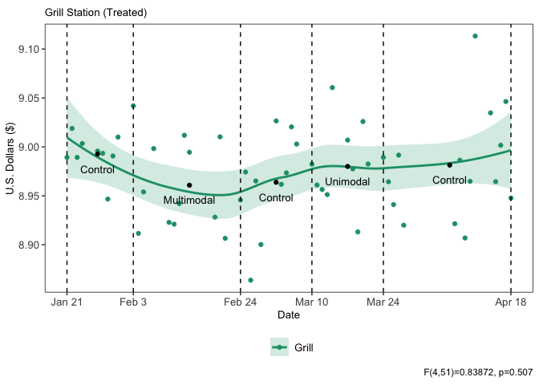<!-- -->

``` r
spring_data %>% 
  filter(station=="Ramen") %>%
  filter(item_cat=="Main") %>%
  group_by(phase_interval) %>%
  summarise(total_dollar_cost=sum(corr_dollar_cost),total_sales=sum(count)) %>%
  mutate(mean_dollar_cost=total_dollar_cost/total_sales)
```

    ## # A tibble: 5 × 4
    ##   phase_interval total_dollar_cost total_sales mean_dollar_cost
    ##   <chr>                      <dbl>       <int>            <dbl>
    ## 1 1                          8465.         892             9.49
    ## 2 2                         10828.        1141             9.49
    ## 3 3                          8560.         902             9.49
    ## 4 4                          7260.         765             9.49
    ## 5 5                         10932.        1152             9.49

``` r
spring_mean_spend_ramen_aov_data <- spring_data %>% 
  filter(station=="Ramen") %>%
  filter(item_cat=="Main") %>%
  group_by(date,phase_interval,station) %>%
  summarise(total_dollar_cost=sum(corr_dollar_cost),total_sales=sum(count)) %>%
  mutate(mean_dollar_cost=total_dollar_cost/total_sales) %>%
  mutate(date=case_when(date=="10-Apr"~"2025-4-10",
                        date=="10-Feb"~"2025-2-10",
                        date=="10-Mar"~"2025-3-10",
                        date=="11-Apr"~"2025-4-11",
                        date=="11-Feb"~"2025-2-11",
                        date=="11-Mar"~"2025-3-11",
                        date=="12-Feb"~"2025-2-12",
                        date=="12-Mar"~"2025-3-12",
                        date=="13-Feb"~"2025-2-13",
                        date=="13-Mar"~"2025-3-13",
                        date=="14-Apr"~"2025-4-14",
                        date=="14-Feb"~"2025-2-14",
                        date=="14-Mar"~"2025-3-14",
                        date=="15-Apr"~"2025-4-15",
                        date=="16-Apr"~"2025-4-16",
                        date=="17-Apr"~"2025-4-17",
                        date=="17-Mar"~"2025-3-17",
                        date=="18-Apr"~"2025-4-18",
                        date=="18-Mar"~"2025-3-18",
                        date=="19-Feb"~"2025-2-19",
                        date=="19-Mar"~"2025-3-19",
                        date=="20-Feb"~"2025-2-20",
                        date=="20-Mar"~"2025-3-20",
                        date=="21-Feb"~"2025-2-21",
                        date=="21-Jan"~"2025-1-21",
                        date=="21-Mar"~"2025-3-21",
                        date=="22-Jan"~"2025-1-22",
                        date=="23-Jan"~"2025-1-23",
                        date=="24-Feb"~"2025-2-24",
                        date=="24-Jan"~"2025-1-24",
                        date=="24-Mar"~"2025-3-24",
                        date=="25-Feb"~"2025-2-25",
                        date=="25-Mar"~"2025-3-25",
                        date=="26-Feb"~"2025-2-26",
                        date=="26-Mar"~"2025-3-26",
                        date=="27-Feb"~"2025-2-27",
                        date=="27-Jan"~"2025-1-27",
                        date=="27-Mar"~"2025-3-27",
                        date=="28-Feb"~"2025-2-28",
                        date=="28-Jan"~"2025-1-28",
                        date=="28-Mar"~"2025-3-28",
                        date=="29-Jan"~"2025-1-29",
                        date=="3-Feb"~"2025-2-3",
                        date=="3-Mar"~"2025-3-3",
                        date=="30-Jan"~"2025-1-30",
                        date=="31-Jan"~"2025-1-31",
                        date=="4-Feb"~"2025-2-4",
                        date=="4-Mar"~"2025-3-4",
                        date=="5-Feb"~"2025-2-5",
                        date=="5-Mar"~"2025-3-5",
                        date=="6-Feb"~"2025-2-6",
                        date=="6-Mar"~"2025-3-6",
                        date=="7-Apr"~"2025-4-7",
                        date=="7-Feb"~"2025-2-7",
                        date=="7-Mar"~"2025-3-7",
                        date=="8-Apr"~"2025-4-8",
                        date=="9-Apr"~"2025-4-9")) %>%
  mutate(date=as.Date(date)) %>%
  ungroup() %>%
  select(phase_interval,mean_dollar_cost) %>%
  arrange(phase_interval) 
```

    ## `summarise()` has grouped output by 'date', 'phase_interval'. You can override
    ## using the `.groups` argument.

``` r
oneway.test(mean_dollar_cost~phase_interval,data=spring_mean_spend_ramen_aov_data,var.equal=TRUE)
```

    ## 
    ##  One-way analysis of means
    ## 
    ## data:  mean_dollar_cost and phase_interval
    ## F = 0, num df = 4, denom df = 52, p-value = 1

``` r
spring_mean_spend_ramen <- spring_data %>% 
  filter(station=="Ramen") %>%
  filter(item_cat=="Main") %>%
  group_by(date,phase_interval,station) %>%
  summarise(total_dollar_cost=sum(corr_dollar_cost),total_sales=sum(count)) %>%
  mutate(mean_dollar_cost=total_dollar_cost/total_sales) %>%
  mutate(date=case_when(date=="10-Apr"~"2025-4-10",
                        date=="10-Feb"~"2025-2-10",
                        date=="10-Mar"~"2025-3-10",
                        date=="11-Apr"~"2025-4-11",
                        date=="11-Feb"~"2025-2-11",
                        date=="11-Mar"~"2025-3-11",
                        date=="12-Feb"~"2025-2-12",
                        date=="12-Mar"~"2025-3-12",
                        date=="13-Feb"~"2025-2-13",
                        date=="13-Mar"~"2025-3-13",
                        date=="14-Apr"~"2025-4-14",
                        date=="14-Feb"~"2025-2-14",
                        date=="14-Mar"~"2025-3-14",
                        date=="15-Apr"~"2025-4-15",
                        date=="16-Apr"~"2025-4-16",
                        date=="17-Apr"~"2025-4-17",
                        date=="17-Mar"~"2025-3-17",
                        date=="18-Apr"~"2025-4-18",
                        date=="18-Mar"~"2025-3-18",
                        date=="19-Feb"~"2025-2-19",
                        date=="19-Mar"~"2025-3-19",
                        date=="20-Feb"~"2025-2-20",
                        date=="20-Mar"~"2025-3-20",
                        date=="21-Feb"~"2025-2-21",
                        date=="21-Jan"~"2025-1-21",
                        date=="21-Mar"~"2025-3-21",
                        date=="22-Jan"~"2025-1-22",
                        date=="23-Jan"~"2025-1-23",
                        date=="24-Feb"~"2025-2-24",
                        date=="24-Jan"~"2025-1-24",
                        date=="24-Mar"~"2025-3-24",
                        date=="25-Feb"~"2025-2-25",
                        date=="25-Mar"~"2025-3-25",
                        date=="26-Feb"~"2025-2-26",
                        date=="26-Mar"~"2025-3-26",
                        date=="27-Feb"~"2025-2-27",
                        date=="27-Jan"~"2025-1-27",
                        date=="27-Mar"~"2025-3-27",
                        date=="28-Feb"~"2025-2-28",
                        date=="28-Jan"~"2025-1-28",
                        date=="28-Mar"~"2025-3-28",
                        date=="29-Jan"~"2025-1-29",
                        date=="3-Feb"~"2025-2-3",
                        date=="3-Mar"~"2025-3-3",
                        date=="30-Jan"~"2025-1-30",
                        date=="31-Jan"~"2025-1-31",
                        date=="4-Feb"~"2025-2-4",
                        date=="4-Mar"~"2025-3-4",
                        date=="5-Feb"~"2025-2-5",
                        date=="5-Mar"~"2025-3-5",
                        date=="6-Feb"~"2025-2-6",
                        date=="6-Mar"~"2025-3-6",
                        date=="7-Apr"~"2025-4-7",
                        date=="7-Feb"~"2025-2-7",
                        date=="7-Mar"~"2025-3-7",
                        date=="8-Apr"~"2025-4-8",
                        date=="9-Apr"~"2025-4-9")) %>%
  mutate(date=as.Date(date)) %>%
  ggplot(aes(x=date,y=mean_dollar_cost,color=station,fill=station)) + 
  geom_smooth(alpha=0.2) + 
  geom_point() +
  geom_vline(xintercept=as.numeric(daily_prop_spring_data$date[spring_vline]),linetype=2) + 
  xlab("Date") + 
  ylab("U.S. Dollars ($)") +
  scale_color_brewer(palette="Dark2",name="") +
  scale_fill_brewer(palette="Dark2",name="") +
  scale_x_date(breaks=as.Date(c("2025-01-21","2025-02-03","2025-02-24","2025-03-10","2025-03-24","2025-04-18")),labels=c("Jan 21","Feb 3","Feb 24","Mar 10","Mar 24","Apr 18")) +
  labs(title="Ramen Station (Treated)",caption="F(4,52)=0, p=1") +
  annotate("text",x=as.Date("2025-01-27"),y=9.49-0.01,label="Control",size=10/.pt) +
  annotate("text",x=as.Date("2025-02-14"),y=9.49-0.01,label="Multimodal",size=10/.pt) +
  annotate("text",x=as.Date("2025-03-03"),y=9.49-0.01,label="Control",size=10/.pt) +
  annotate("text",x=as.Date("2025-03-17"),y=9.49-0.01,label="Unimodal",size=10/.pt) +
  annotate("text",x=as.Date("2025-04-06"),y=9.49-0.01,label="Control",size=10/.pt) +
  annotate("point",x=as.Date("2025-01-27"),y=9.49) +
  annotate("point",x=as.Date("2025-02-14"),y=9.49) +
  annotate("point",x=as.Date("2025-03-03"),y=9.49) +
  annotate("point",x=as.Date("2025-03-17"),y=9.49) +
  annotate("point",x=as.Date("2025-04-06"),y=9.49) +
  theme(aspect.ratio=0.55,legend.position="bottom",panel.grid=element_blank(),panel.background=element_rect(fill="white"),panel.border=element_rect(fill=NA),legend.title=element_text(size=10),legend.text=element_text(size=10),plot.title=element_text(size=10),axis.title=element_text(size=10),axis.text=element_text(size=10)) 
```

    ## `summarise()` has grouped output by 'date', 'phase_interval'. You can override
    ## using the `.groups` argument.

``` r
spring_mean_spend_ramen
```

    ## `geom_smooth()` using method = 'loess' and formula = 'y ~ x'

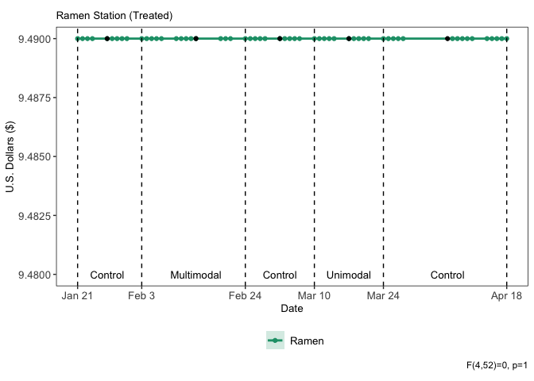<!-- -->

``` r
spring_data %>%
  filter(station=="Ramen"|station=="Grill") %>%
  filter(item_cat=="Main") %>%
  group_by(phase_interval) %>%
  summarise(total_dollar_cost=sum(corr_dollar_cost),total_sales=sum(count)) %>%
  mutate(mean_dollar_cost=total_dollar_cost/total_sales)
```

    ## # A tibble: 5 × 4
    ##   phase_interval total_dollar_cost total_sales mean_dollar_cost
    ##   <chr>                      <dbl>       <int>            <dbl>
    ## 1 1                         18555.        2014             9.21
    ## 2 2                         24063.        2618             9.19
    ## 3 3                         19998.        2178             9.18
    ## 4 4                         18422.        2008             9.17
    ## 5 5                         28024.        3055             9.17

``` r
spring_mean_spend_treatment_aov_data <- spring_data %>%
  filter(station=="Ramen"|station=="Grill") %>%
  filter(item_cat=="Main") %>%
  group_by(date,phase_interval,station_type) %>%
  summarise(total_dollar_cost=sum(corr_dollar_cost),total_sales=sum(count)) %>%
  mutate(mean_dollar_cost=total_dollar_cost/total_sales) %>%
  mutate(date=case_when(date=="10-Apr"~"2025-4-10",
                        date=="10-Feb"~"2025-2-10",
                        date=="10-Mar"~"2025-3-10",
                        date=="11-Apr"~"2025-4-11",
                        date=="11-Feb"~"2025-2-11",
                        date=="11-Mar"~"2025-3-11",
                        date=="12-Feb"~"2025-2-12",
                        date=="12-Mar"~"2025-3-12",
                        date=="13-Feb"~"2025-2-13",
                        date=="13-Mar"~"2025-3-13",
                        date=="14-Apr"~"2025-4-14",
                        date=="14-Feb"~"2025-2-14",
                        date=="14-Mar"~"2025-3-14",
                        date=="15-Apr"~"2025-4-15",
                        date=="16-Apr"~"2025-4-16",
                        date=="17-Apr"~"2025-4-17",
                        date=="17-Mar"~"2025-3-17",
                        date=="18-Apr"~"2025-4-18",
                        date=="18-Mar"~"2025-3-18",
                        date=="19-Feb"~"2025-2-19",
                        date=="19-Mar"~"2025-3-19",
                        date=="20-Feb"~"2025-2-20",
                        date=="20-Mar"~"2025-3-20",
                        date=="21-Feb"~"2025-2-21",
                        date=="21-Jan"~"2025-1-21",
                        date=="21-Mar"~"2025-3-21",
                        date=="22-Jan"~"2025-1-22",
                        date=="23-Jan"~"2025-1-23",
                        date=="24-Feb"~"2025-2-24",
                        date=="24-Jan"~"2025-1-24",
                        date=="24-Mar"~"2025-3-24",
                        date=="25-Feb"~"2025-2-25",
                        date=="25-Mar"~"2025-3-25",
                        date=="26-Feb"~"2025-2-26",
                        date=="26-Mar"~"2025-3-26",
                        date=="27-Feb"~"2025-2-27",
                        date=="27-Jan"~"2025-1-27",
                        date=="27-Mar"~"2025-3-27",
                        date=="28-Feb"~"2025-2-28",
                        date=="28-Jan"~"2025-1-28",
                        date=="28-Mar"~"2025-3-28",
                        date=="29-Jan"~"2025-1-29",
                        date=="3-Feb"~"2025-2-3",
                        date=="3-Mar"~"2025-3-3",
                        date=="30-Jan"~"2025-1-30",
                        date=="31-Jan"~"2025-1-31",
                        date=="4-Feb"~"2025-2-4",
                        date=="4-Mar"~"2025-3-4",
                        date=="5-Feb"~"2025-2-5",
                        date=="5-Mar"~"2025-3-5",
                        date=="6-Feb"~"2025-2-6",
                        date=="6-Mar"~"2025-3-6",
                        date=="7-Apr"~"2025-4-7",
                        date=="7-Feb"~"2025-2-7",
                        date=="7-Mar"~"2025-3-7",
                        date=="8-Apr"~"2025-4-8",
                        date=="9-Apr"~"2025-4-9")) %>%
  mutate(date=as.Date(date)) %>%
  ungroup() %>%
  select(phase_interval,mean_dollar_cost) %>%
  arrange(phase_interval)
```

    ## `summarise()` has grouped output by 'date', 'phase_interval'. You can override
    ## using the `.groups` argument.

``` r
shapiro.test(spring_mean_spend_treatment_aov_data$mean_dollar_cost) 
```

    ## 
    ##  Shapiro-Wilk normality test
    ## 
    ## data:  spring_mean_spend_treatment_aov_data$mean_dollar_cost
    ## W = 0.75216, p-value = 1.89e-08

``` r
oneway.test(mean_dollar_cost~phase_interval,data=spring_mean_spend_treatment_aov_data,var.equal=TRUE)
```

    ## 
    ##  One-way analysis of means
    ## 
    ## data:  mean_dollar_cost and phase_interval
    ## F = 1.3501, num df = 4, denom df = 52, p-value = 0.264

``` r
spring_mean_spend_treatment <- spring_data %>%
  filter(station=="Ramen"|station=="Grill") %>%
  filter(item_cat=="Main") %>%
  group_by(date,phase_interval,station_type) %>%
  summarise(total_dollar_cost=sum(corr_dollar_cost),total_sales=sum(count)) %>%
  mutate(mean_dollar_cost=total_dollar_cost/total_sales) %>%
  mutate(date=case_when(date=="10-Apr"~"2025-4-10",
                        date=="10-Feb"~"2025-2-10",
                        date=="10-Mar"~"2025-3-10",
                        date=="11-Apr"~"2025-4-11",
                        date=="11-Feb"~"2025-2-11",
                        date=="11-Mar"~"2025-3-11",
                        date=="12-Feb"~"2025-2-12",
                        date=="12-Mar"~"2025-3-12",
                        date=="13-Feb"~"2025-2-13",
                        date=="13-Mar"~"2025-3-13",
                        date=="14-Apr"~"2025-4-14",
                        date=="14-Feb"~"2025-2-14",
                        date=="14-Mar"~"2025-3-14",
                        date=="15-Apr"~"2025-4-15",
                        date=="16-Apr"~"2025-4-16",
                        date=="17-Apr"~"2025-4-17",
                        date=="17-Mar"~"2025-3-17",
                        date=="18-Apr"~"2025-4-18",
                        date=="18-Mar"~"2025-3-18",
                        date=="19-Feb"~"2025-2-19",
                        date=="19-Mar"~"2025-3-19",
                        date=="20-Feb"~"2025-2-20",
                        date=="20-Mar"~"2025-3-20",
                        date=="21-Feb"~"2025-2-21",
                        date=="21-Jan"~"2025-1-21",
                        date=="21-Mar"~"2025-3-21",
                        date=="22-Jan"~"2025-1-22",
                        date=="23-Jan"~"2025-1-23",
                        date=="24-Feb"~"2025-2-24",
                        date=="24-Jan"~"2025-1-24",
                        date=="24-Mar"~"2025-3-24",
                        date=="25-Feb"~"2025-2-25",
                        date=="25-Mar"~"2025-3-25",
                        date=="26-Feb"~"2025-2-26",
                        date=="26-Mar"~"2025-3-26",
                        date=="27-Feb"~"2025-2-27",
                        date=="27-Jan"~"2025-1-27",
                        date=="27-Mar"~"2025-3-27",
                        date=="28-Feb"~"2025-2-28",
                        date=="28-Jan"~"2025-1-28",
                        date=="28-Mar"~"2025-3-28",
                        date=="29-Jan"~"2025-1-29",
                        date=="3-Feb"~"2025-2-3",
                        date=="3-Mar"~"2025-3-3",
                        date=="30-Jan"~"2025-1-30",
                        date=="31-Jan"~"2025-1-31",
                        date=="4-Feb"~"2025-2-4",
                        date=="4-Mar"~"2025-3-4",
                        date=="5-Feb"~"2025-2-5",
                        date=="5-Mar"~"2025-3-5",
                        date=="6-Feb"~"2025-2-6",
                        date=="6-Mar"~"2025-3-6",
                        date=="7-Apr"~"2025-4-7",
                        date=="7-Feb"~"2025-2-7",
                        date=="7-Mar"~"2025-3-7",
                        date=="8-Apr"~"2025-4-8",
                        date=="9-Apr"~"2025-4-9")) %>%
  mutate(date=as.Date(date)) %>%
  ggplot(aes(x=date,y=mean_dollar_cost,color=station_type,fill=station_type)) + 
  geom_smooth(alpha=0.2) + 
  geom_point() +
  geom_vline(xintercept=as.numeric(daily_prop_spring_data$date[spring_vline]),linetype=2) + 
  xlab("Date") + 
  ylab("U.S. Dollars ($)") +
  scale_color_brewer(palette="Dark2",name="") +
  scale_fill_brewer(palette="Dark2",name="") +
  scale_x_date(breaks=as.Date(c("2025-01-21","2025-02-03","2025-02-24","2025-03-10","2025-03-24","2025-04-18")),labels=c("Jan 21","Feb 3","Feb 24","Mar 10","Mar 24","Apr 18")) +
  labs(title="Ramen & Grill Stations (Treated)",caption="F(4,52)=1.3501, p=0.264") +
  annotate("text",x=as.Date("2025-01-27"),y=9.212939-0.01,label="Control",size=10/.pt) +
  annotate("text",x=as.Date("2025-02-14"),y=9.191490-0.01,label="Multimodal",size=10/.pt) +
  annotate("text",x=as.Date("2025-03-03"),y=9.181736-0.01,label="Control",size=10/.pt) +
  annotate("text",x=as.Date("2025-03-17"),y=9.174313-0.01,label="Unimodal",size=10/.pt) +
  annotate("text",x=as.Date("2025-04-06"),y=9.173208-0.01,label="Control",size=10/.pt) +
  annotate("point",x=as.Date("2025-01-27"),y=9.212939) +
  annotate("point",x=as.Date("2025-02-14"),y=9.191490) +
  annotate("point",x=as.Date("2025-03-03"),y=9.181736) +
  annotate("point",x=as.Date("2025-03-17"),y=9.174313) +
  annotate("point",x=as.Date("2025-04-06"),y=9.173208) +
  theme(aspect.ratio=0.55,legend.position="bottom",panel.grid=element_blank(),panel.background=element_rect(fill="white"),panel.border=element_rect(fill=NA),legend.title=element_text(size=10),legend.text=element_text(size=10),plot.title=element_text(size=10),axis.title=element_text(size=10),axis.text=element_text(size=10)) 
```

    ## `summarise()` has grouped output by 'date', 'phase_interval'. You can override
    ## using the `.groups` argument.

``` r
spring_mean_spend_treatment
```

    ## `geom_smooth()` using method = 'loess' and formula = 'y ~ x'

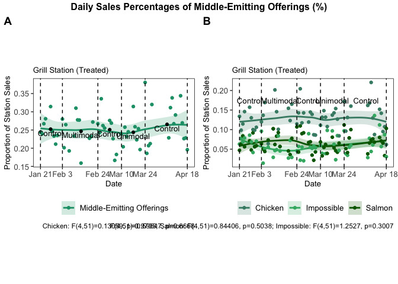<!-- -->

``` r
spring_data %>%
  filter(station=="Pasta") %>%
  filter(item_cat=="Main") %>%
  group_by(phase_interval) %>% 
  summarise(total_dollar_cost=sum(corr_dollar_cost),total_sales=sum(count)) %>%
  mutate(mean_dollar_cost=total_dollar_cost/total_sales) 
```

    ## # A tibble: 5 × 4
    ##   phase_interval total_dollar_cost total_sales mean_dollar_cost
    ##   <chr>                      <dbl>       <int>            <dbl>
    ## 1 1                         12041.        1352             8.91
    ## 2 2                         14524.        1632             8.90
    ## 3 3                         10900.        1224             8.91
    ## 4 4                         10304.        1158             8.90
    ## 5 5                         14710.        1655             8.89

``` r
spring_mean_spend_control_aov_data <- spring_data %>%
  filter(station=="Pasta") %>%
  filter(item_cat=="Main") %>%
  group_by(date,phase_interval,station) %>%
  summarise(total_dollar_cost=sum(corr_dollar_cost),total_sales=sum(count)) %>%
  mutate(mean_dollar_cost=total_dollar_cost/total_sales) %>%
  mutate(date=case_when(date=="10-Apr"~"2025-4-10",
                        date=="10-Feb"~"2025-2-10",
                        date=="10-Mar"~"2025-3-10",
                        date=="11-Apr"~"2025-4-11",
                        date=="11-Feb"~"2025-2-11",
                        date=="11-Mar"~"2025-3-11",
                        date=="12-Feb"~"2025-2-12",
                        date=="12-Mar"~"2025-3-12",
                        date=="13-Feb"~"2025-2-13",
                        date=="13-Mar"~"2025-3-13",
                        date=="14-Apr"~"2025-4-14",
                        date=="14-Feb"~"2025-2-14",
                        date=="14-Mar"~"2025-3-14",
                        date=="15-Apr"~"2025-4-15",
                        date=="16-Apr"~"2025-4-16",
                        date=="17-Apr"~"2025-4-17",
                        date=="17-Mar"~"2025-3-17",
                        date=="18-Apr"~"2025-4-18",
                        date=="18-Mar"~"2025-3-18",
                        date=="19-Feb"~"2025-2-19",
                        date=="19-Mar"~"2025-3-19",
                        date=="20-Feb"~"2025-2-20",
                        date=="20-Mar"~"2025-3-20",
                        date=="21-Feb"~"2025-2-21",
                        date=="21-Jan"~"2025-1-21",
                        date=="21-Mar"~"2025-3-21",
                        date=="22-Jan"~"2025-1-22",
                        date=="23-Jan"~"2025-1-23",
                        date=="24-Feb"~"2025-2-24",
                        date=="24-Jan"~"2025-1-24",
                        date=="24-Mar"~"2025-3-24",
                        date=="25-Feb"~"2025-2-25",
                        date=="25-Mar"~"2025-3-25",
                        date=="26-Feb"~"2025-2-26",
                        date=="26-Mar"~"2025-3-26",
                        date=="27-Feb"~"2025-2-27",
                        date=="27-Jan"~"2025-1-27",
                        date=="27-Mar"~"2025-3-27",
                        date=="28-Feb"~"2025-2-28",
                        date=="28-Jan"~"2025-1-28",
                        date=="28-Mar"~"2025-3-28",
                        date=="29-Jan"~"2025-1-29",
                        date=="3-Feb"~"2025-2-3",
                        date=="3-Mar"~"2025-3-3",
                        date=="30-Jan"~"2025-1-30",
                        date=="31-Jan"~"2025-1-31",
                        date=="4-Feb"~"2025-2-4",
                        date=="4-Mar"~"2025-3-4",
                        date=="5-Feb"~"2025-2-5",
                        date=="5-Mar"~"2025-3-5",
                        date=="6-Feb"~"2025-2-6",
                        date=="6-Mar"~"2025-3-6",
                        date=="7-Apr"~"2025-4-7",
                        date=="7-Feb"~"2025-2-7",
                        date=="7-Mar"~"2025-3-7",
                        date=="8-Apr"~"2025-4-8",
                        date=="9-Apr"~"2025-4-9")) %>%
  mutate(date=as.Date(date)) %>%
  ungroup() %>%
  select(phase_interval,mean_dollar_cost) %>%
  arrange(phase_interval)
```

    ## `summarise()` has grouped output by 'date', 'phase_interval'. You can override
    ## using the `.groups` argument.

``` r
shapiro.test(spring_mean_spend_control_aov_data$mean_dollar_cost) 
```

    ## 
    ##  Shapiro-Wilk normality test
    ## 
    ## data:  spring_mean_spend_control_aov_data$mean_dollar_cost
    ## W = 0.98085, p-value = 0.5006

``` r
oneway.test(mean_dollar_cost~phase_interval,data=spring_mean_spend_control_aov_data,var.equal=TRUE)
```

    ## 
    ##  One-way analysis of means
    ## 
    ## data:  mean_dollar_cost and phase_interval
    ## F = 0.89227, num df = 4, denom df = 52, p-value = 0.4752

``` r
spring_mean_spend_control <- spring_data %>%
  filter(station=="Pasta") %>%
  filter(item_cat=="Main") %>%
  group_by(date,menu_condition,station) %>%
  summarise(total_dollar_cost=sum(corr_dollar_cost),total_sales=sum(count)) %>%
  mutate(mean_dollar_cost=total_dollar_cost/total_sales) %>%
  mutate(date=case_when(date=="10-Apr"~"2025-4-10",
                        date=="10-Feb"~"2025-2-10",
                        date=="10-Mar"~"2025-3-10",
                        date=="11-Apr"~"2025-4-11",
                        date=="11-Feb"~"2025-2-11",
                        date=="11-Mar"~"2025-3-11",
                        date=="12-Feb"~"2025-2-12",
                        date=="12-Mar"~"2025-3-12",
                        date=="13-Feb"~"2025-2-13",
                        date=="13-Mar"~"2025-3-13",
                        date=="14-Apr"~"2025-4-14",
                        date=="14-Feb"~"2025-2-14",
                        date=="14-Mar"~"2025-3-14",
                        date=="15-Apr"~"2025-4-15",
                        date=="16-Apr"~"2025-4-16",
                        date=="17-Apr"~"2025-4-17",
                        date=="17-Mar"~"2025-3-17",
                        date=="18-Apr"~"2025-4-18",
                        date=="18-Mar"~"2025-3-18",
                        date=="19-Feb"~"2025-2-19",
                        date=="19-Mar"~"2025-3-19",
                        date=="20-Feb"~"2025-2-20",
                        date=="20-Mar"~"2025-3-20",
                        date=="21-Feb"~"2025-2-21",
                        date=="21-Jan"~"2025-1-21",
                        date=="21-Mar"~"2025-3-21",
                        date=="22-Jan"~"2025-1-22",
                        date=="23-Jan"~"2025-1-23",
                        date=="24-Feb"~"2025-2-24",
                        date=="24-Jan"~"2025-1-24",
                        date=="24-Mar"~"2025-3-24",
                        date=="25-Feb"~"2025-2-25",
                        date=="25-Mar"~"2025-3-25",
                        date=="26-Feb"~"2025-2-26",
                        date=="26-Mar"~"2025-3-26",
                        date=="27-Feb"~"2025-2-27",
                        date=="27-Jan"~"2025-1-27",
                        date=="27-Mar"~"2025-3-27",
                        date=="28-Feb"~"2025-2-28",
                        date=="28-Jan"~"2025-1-28",
                        date=="28-Mar"~"2025-3-28",
                        date=="29-Jan"~"2025-1-29",
                        date=="3-Feb"~"2025-2-3",
                        date=="3-Mar"~"2025-3-3",
                        date=="30-Jan"~"2025-1-30",
                        date=="31-Jan"~"2025-1-31",
                        date=="4-Feb"~"2025-2-4",
                        date=="4-Mar"~"2025-3-4",
                        date=="5-Feb"~"2025-2-5",
                        date=="5-Mar"~"2025-3-5",
                        date=="6-Feb"~"2025-2-6",
                        date=="6-Mar"~"2025-3-6",
                        date=="7-Apr"~"2025-4-7",
                        date=="7-Feb"~"2025-2-7",
                        date=="7-Mar"~"2025-3-7",
                        date=="8-Apr"~"2025-4-8",
                        date=="9-Apr"~"2025-4-9")) %>%
  mutate(date=as.Date(date)) %>%
  ggplot(aes(x=date,y=mean_dollar_cost,color=station,fill=station)) + 
  geom_smooth(alpha=0.2) + 
  geom_point() +
  geom_vline(xintercept=as.numeric(daily_prop_spring_data$date[spring_vline]),linetype=2) + 
  xlab("Date") + 
  ylab("U.S. Dollars ($)") +
  scale_color_brewer(palette="Set1",name="") +
  scale_fill_brewer(palette="Set1",name="") +
  scale_x_date(breaks=as.Date(c("2025-01-21","2025-02-03","2025-02-24","2025-03-10","2025-03-24","2025-04-18")),labels=c("Jan 21","Feb 3","Feb 24","Mar 10","Mar 24","Apr 18")) +
  annotate("text",x=as.Date("2025-01-27"),y=8.906420-0.005,label="Control",size=10/.pt) +
  annotate("text",x=as.Date("2025-02-14"),y=8.899314-0.005,label="Multimodal",size=10/.pt) +
  annotate("text",x=as.Date("2025-03-03"),y=8.905441-0.005,label="Control",size=10/.pt) +
  annotate("text",x=as.Date("2025-03-17"),y=8.898031-0.005,label="Unimodal",size=10/.pt) +
  annotate("text",x=as.Date("2025-04-06"),y=8.888489-0.005,label="Control",size=10/.pt) +
  annotate("point",x=as.Date("2025-01-27"),y=8.906420) +
  annotate("point",x=as.Date("2025-02-14"),y=8.899314) +
  annotate("point",x=as.Date("2025-03-03"),y=8.905441) +
  annotate("point",x=as.Date("2025-03-17"),y=8.898031) +
  annotate("point",x=as.Date("2025-04-06"),y=8.888489) +
  labs(title="Pasta Station (Untreated)",caption="F(4,52)=0.89227, p=0.4752") +
  theme(aspect.ratio=0.55,legend.position="bottom",panel.grid=element_blank(),panel.background=element_rect(fill="white"),panel.border=element_rect(fill=NA),legend.title=element_text(size=10),legend.text=element_text(size=10),plot.title=element_text(size=10),axis.title=element_text(size=10),axis.text=element_text(size=10)) 
```

    ## `summarise()` has grouped output by 'date', 'menu_condition'. You can override
    ## using the `.groups` argument.

``` r
spring_mean_spend_control
```

    ## `geom_smooth()` using method = 'loess' and formula = 'y ~ x'

<!-- -->

``` r
spring_mean_spend <- ggarrange(spring_mean_spend_ramen,spring_mean_spend_grill,spring_mean_spend_treatment,spring_mean_spend_control,
          labels=c("A","B","C","D"),
          legend="none")
```

    ## `geom_smooth()` using method = 'loess' and formula = 'y ~ x'
    ## `geom_smooth()` using method = 'loess' and formula = 'y ~ x'
    ## `geom_smooth()` using method = 'loess' and formula = 'y ~ x'
    ## `geom_smooth()` using method = 'loess' and formula = 'y ~ x'

``` r
spring_mean_spend <- annotate_figure(spring_mean_spend,top=text_grob("Mean Revenue Per Station Sale ($)",color="black",face="bold",size=12))
ggsave(filename="spring_mean_spend.png",plot=spring_mean_spend,path="/Users/kenjinchang/github/multimodal-framework-validation/figures",width=40,height=24,units="cm",dpi=150,limitsize=TRUE)
spring_mean_spend
```

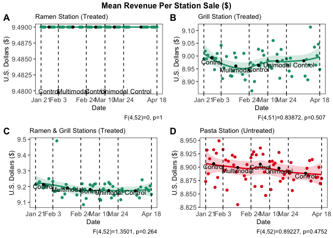<!-- -->

prop_mid

``` r
spring_data %>%
  filter(station=="Grill") %>%
  filter(item_cat=="Main") %>%
  mutate(item=case_when(item=="Black Bean Burger"~"Lowest-Emitting Offering",
                        item=="Grilled Hamburger"~"Highest-Emitting Offering",
                        item=="Grilled Chicken Breast Sandwich"~"Middle-Emitting Offerings",
                        item=="Seared Salmon Burger"~"Middle-Emitting Offerings",
                        item=="Trillium Grill Impossible Burger"~"Middle-Emitting Offerings")) %>%
  group_by(phase_interval,station,item) %>%
  summarise(total_count=sum(count)) %>%
  mutate(prop=case_when(phase_interval=="1"~total_count/(814+25+283),
                        phase_interval=="2"~total_count/(1083+30+364),
                        phase_interval=="3"~total_count/(938+18+320),
                        phase_interval=="4"~total_count/(909+25+301),
                        phase_interval=="5"~total_count/(1352+46+505))) %>%
  filter(item=="Middle-Emitting Offerings")
```

    ## `summarise()` has grouped output by 'phase_interval', 'station'. You can
    ## override using the `.groups` argument.

    ## # A tibble: 5 × 5
    ## # Groups:   phase_interval, station [5]
    ##   phase_interval station item                      total_count  prop
    ##   <chr>          <chr>   <chr>                           <int> <dbl>
    ## 1 1              Grill   Middle-Emitting Offerings         283 0.252
    ## 2 2              Grill   Middle-Emitting Offerings         364 0.246
    ## 3 3              Grill   Middle-Emitting Offerings         320 0.251
    ## 4 4              Grill   Middle-Emitting Offerings         301 0.244
    ## 5 5              Grill   Middle-Emitting Offerings         505 0.265

``` r
spring_prop_middle_aggregate_aov_data <- spring_data %>%
  filter(station=="Grill") %>%
  filter(item_cat=="Main") %>%
  mutate(item=case_when(item=="Black Bean Burger"~"Lowest-Emitting Offering",
                        item=="Grilled Hamburger"~"Highest-Emitting Offering",
                        item=="Grilled Chicken Breast Sandwich"~"Middle-Emitting Offerings",
                        item=="Seared Salmon Burger"~"Middle-Emitting Offerings",
                        item=="Trillium Grill Impossible Burger"~"Middle-Emitting Offerings")) %>%
  group_by(date,phase_interval,station,item) %>%
  summarise(total_count=sum(count)) %>%
  mutate(prop=case_when(date=="10-Apr"~total_count/(90+6+35),
                        date=="10-Feb"~total_count/(101+4+32),
                        date=="10-Mar"~total_count/(86+3+28),
                        date=="11-Apr"~total_count/(72+1+30),
                        date=="11-Feb"~total_count/(86+3+40),
                        date=="11-Mar"~total_count/(118+3+31),
                        date=="12-Feb"~total_count/(101+3+40),
                        date=="12-Mar"~total_count/(89+6+33),
                        date=="13-Feb"~total_count/(83+3+33),
                        date=="13-Mar"~total_count/(99+30),
                        date=="14-Apr"~total_count/(79+3+43),
                        date=="14-Feb"~total_count/(72+2+14),
                        date=="14-Mar"~total_count/(76+1+25),
                        date=="15-Apr"~total_count/(101+2+38),
                        date=="16-Apr"~total_count/(103+3+31),
                        date=="17-Apr"~total_count/(113+2+34),
                        date=="17-Mar"~total_count/(77+8+39),
                        date=="18-Apr"~total_count/(76+2+19),
                        date=="18-Mar"~total_count/(80+3+29),
                        date=="19-Feb"~total_count/(84+1+25),
                        date=="19-Mar"~total_count/(96+5+29),
                        date=="20-Feb"~total_count/(102+4+32),
                        date=="20-Mar"~total_count/(103+3+36),
                        date=="21-Feb"~total_count/(73+2+28),
                        date=="21-Jan"~total_count/(94+2+31),
                        date=="21-Mar"~total_count/(85+1+21),
                        date=="22-Jan"~total_count/(105+3+34),
                        date=="23-Jan"~total_count/(94+2+35),
                        date=="24-Feb"~total_count/(95+1+35),
                        date=="24-Jan"~total_count/(63+1+25),
                        date=="24-Mar"~total_count/(81+2+51),
                        date=="25-Feb"~total_count/(102+4+34),
                        date=="25-Mar"~total_count/(122+5+29),
                        date=="26-Feb"~total_count/(90+1+46),
                        date=="26-Mar"~total_count/(108+7+30),
                        date=="27-Feb"~total_count/(105+2+38),
                        date=="27-Jan"~total_count/(92+4+44),
                        date=="27-Mar"~total_count/(99+1+27),
                        date=="28-Feb"~total_count/(72+1+25),
                        date=="28-Jan"~total_count/(105+5+36),
                        date=="28-Mar"~total_count/(29+5+16),
                        date=="29-Jan"~total_count/(88+4+28),
                        date=="3-Feb"~total_count/(90+35),
                        date=="3-Mar"~total_count/(95+2+37),
                        date=="30-Jan"~total_count/(109+3+30),
                        date=="31-Jan"~total_count/(64+1+20),
                        date=="4-Feb"~total_count/(108+3+28),
                        date=="4-Mar"~total_count/(104+2+39),
                        date=="5-Feb"~total_count/(97+3+36),
                        date=="5-Mar"~total_count/(86+3+26),
                        date=="6-Mar"~total_count/(114+1+23),
                        date=="7-Apr"~total_count/(77+4+24),
                        date=="7-Feb"~total_count/(86+2+21),
                        date=="7-Mar"~total_count/(75+1+17),
                        date=="8-Apr"~total_count/(113+2+52),
                        date=="9-Apr"~total_count/(89+1+46))) %>%
  filter(item=="Middle-Emitting Offerings") %>%
  mutate(date=case_when(date=="10-Apr"~"2025-4-10",
                        date=="10-Feb"~"2025-2-10",
                        date=="10-Mar"~"2025-3-10",
                        date=="11-Apr"~"2025-4-11",
                        date=="11-Feb"~"2025-2-11",
                        date=="11-Mar"~"2025-3-11",
                        date=="12-Feb"~"2025-2-12",
                        date=="12-Mar"~"2025-3-12",
                        date=="13-Feb"~"2025-2-13",
                        date=="13-Mar"~"2025-3-13",
                        date=="14-Apr"~"2025-4-14",
                        date=="14-Feb"~"2025-2-14",
                        date=="14-Mar"~"2025-3-14",
                        date=="15-Apr"~"2025-4-15",
                        date=="16-Apr"~"2025-4-16",
                        date=="17-Apr"~"2025-4-17",
                        date=="17-Mar"~"2025-3-17",
                        date=="18-Apr"~"2025-4-18",
                        date=="18-Mar"~"2025-3-18",
                        date=="19-Feb"~"2025-2-19",
                        date=="19-Mar"~"2025-3-19",
                        date=="20-Feb"~"2025-2-20",
                        date=="20-Mar"~"2025-3-20",
                        date=="21-Feb"~"2025-2-21",
                        date=="21-Jan"~"2025-1-21",
                        date=="21-Mar"~"2025-3-21",
                        date=="22-Jan"~"2025-1-22",
                        date=="23-Jan"~"2025-1-23",
                        date=="24-Feb"~"2025-2-24",
                        date=="24-Jan"~"2025-1-24",
                        date=="24-Mar"~"2025-3-24",
                        date=="25-Feb"~"2025-2-25",
                        date=="25-Mar"~"2025-3-25",
                        date=="26-Feb"~"2025-2-26",
                        date=="26-Mar"~"2025-3-26",
                        date=="27-Feb"~"2025-2-27",
                        date=="27-Jan"~"2025-1-27",
                        date=="27-Mar"~"2025-3-27",
                        date=="28-Feb"~"2025-2-28",
                        date=="28-Jan"~"2025-1-28",
                        date=="28-Mar"~"2025-3-28",
                        date=="29-Jan"~"2025-1-29",
                        date=="3-Feb"~"2025-2-3",
                        date=="3-Mar"~"2025-3-3",
                        date=="30-Jan"~"2025-1-30",
                        date=="31-Jan"~"2025-1-31",
                        date=="4-Feb"~"2025-2-4",
                        date=="4-Mar"~"2025-3-4",
                        date=="5-Feb"~"2025-2-5",
                        date=="5-Mar"~"2025-3-5",
                        date=="6-Feb"~"2025-2-6",
                        date=="6-Mar"~"2025-3-6",
                        date=="7-Apr"~"2025-4-7",
                        date=="7-Feb"~"2025-2-7",
                        date=="7-Mar"~"2025-3-7",
                        date=="8-Apr"~"2025-4-8",
                        date=="9-Apr"~"2025-4-9")) %>%
  mutate(date=as.Date(date)) %>%
  ungroup() %>%
  select(phase_interval,prop) %>%
  arrange(phase_interval)
```

    ## `summarise()` has grouped output by 'date', 'phase_interval', 'station'. You
    ## can override using the `.groups` argument.

``` r
shapiro.test(spring_prop_middle_aggregate_aov_data$prop) 
```

    ## 
    ##  Shapiro-Wilk normality test
    ## 
    ## data:  spring_prop_middle_aggregate_aov_data$prop
    ## W = 0.98059, p-value = 0.5012

``` r
oneway.test(prop~phase_interval,data=spring_prop_middle_aggregate_aov_data,var.equal=TRUE)
```

    ## 
    ##  One-way analysis of means
    ## 
    ## data:  prop and phase_interval
    ## F = 0.59647, num df = 4, denom df = 51, p-value = 0.6668

``` r
spring_prop_middle_aggregate <- spring_data %>%
  filter(station=="Grill") %>%
  filter(item_cat=="Main") %>%
  mutate(item=case_when(item=="Black Bean Burger"~"Lowest-Emitting Offering",
                        item=="Grilled Hamburger"~"Highest-Emitting Offering",
                        item=="Grilled Chicken Breast Sandwich"~"Middle-Emitting Offerings",
                        item=="Seared Salmon Burger"~"Middle-Emitting Offerings",
                        item=="Trillium Grill Impossible Burger"~"Middle-Emitting Offerings")) %>%
  group_by(date,phase_interval,station,item) %>%
  summarise(total_count=sum(count)) %>%
  mutate(prop=case_when(date=="10-Apr"~total_count/(90+6+35),
                        date=="10-Feb"~total_count/(101+4+32),
                        date=="10-Mar"~total_count/(86+3+28),
                        date=="11-Apr"~total_count/(72+1+30),
                        date=="11-Feb"~total_count/(86+3+40),
                        date=="11-Mar"~total_count/(118+3+31),
                        date=="12-Feb"~total_count/(101+3+40),
                        date=="12-Mar"~total_count/(89+6+33),
                        date=="13-Feb"~total_count/(83+3+33),
                        date=="13-Mar"~total_count/(99+30),
                        date=="14-Apr"~total_count/(79+3+43),
                        date=="14-Feb"~total_count/(72+2+14),
                        date=="14-Mar"~total_count/(76+1+25),
                        date=="15-Apr"~total_count/(101+2+38),
                        date=="16-Apr"~total_count/(103+3+31),
                        date=="17-Apr"~total_count/(113+2+34),
                        date=="17-Mar"~total_count/(77+8+39),
                        date=="18-Apr"~total_count/(76+2+19),
                        date=="18-Mar"~total_count/(80+3+29),
                        date=="19-Feb"~total_count/(84+1+25),
                        date=="19-Mar"~total_count/(96+5+29),
                        date=="20-Feb"~total_count/(102+4+32),
                        date=="20-Mar"~total_count/(103+3+36),
                        date=="21-Feb"~total_count/(73+2+28),
                        date=="21-Jan"~total_count/(94+2+31),
                        date=="21-Mar"~total_count/(85+1+21),
                        date=="22-Jan"~total_count/(105+3+34),
                        date=="23-Jan"~total_count/(94+2+35),
                        date=="24-Feb"~total_count/(95+1+35),
                        date=="24-Jan"~total_count/(63+1+25),
                        date=="24-Mar"~total_count/(81+2+51),
                        date=="25-Feb"~total_count/(102+4+34),
                        date=="25-Mar"~total_count/(122+5+29),
                        date=="26-Feb"~total_count/(90+1+46),
                        date=="26-Mar"~total_count/(108+7+30),
                        date=="27-Feb"~total_count/(105+2+38),
                        date=="27-Jan"~total_count/(92+4+44),
                        date=="27-Mar"~total_count/(99+1+27),
                        date=="28-Feb"~total_count/(72+1+25),
                        date=="28-Jan"~total_count/(105+5+36),
                        date=="28-Mar"~total_count/(29+5+16),
                        date=="29-Jan"~total_count/(88+4+28),
                        date=="3-Feb"~total_count/(90+35),
                        date=="3-Mar"~total_count/(95+2+37),
                        date=="30-Jan"~total_count/(109+3+30),
                        date=="31-Jan"~total_count/(64+1+20),
                        date=="4-Feb"~total_count/(108+3+28),
                        date=="4-Mar"~total_count/(104+2+39),
                        date=="5-Feb"~total_count/(97+3+36),
                        date=="5-Mar"~total_count/(86+3+26),
                        date=="6-Mar"~total_count/(114+1+23),
                        date=="7-Apr"~total_count/(77+4+24),
                        date=="7-Feb"~total_count/(86+2+21),
                        date=="7-Mar"~total_count/(75+1+17),
                        date=="8-Apr"~total_count/(113+2+52),
                        date=="9-Apr"~total_count/(89+1+46))) %>%
  filter(item=="Middle-Emitting Offerings") %>%
  mutate(date=case_when(date=="10-Apr"~"2025-4-10",
                        date=="10-Feb"~"2025-2-10",
                        date=="10-Mar"~"2025-3-10",
                        date=="11-Apr"~"2025-4-11",
                        date=="11-Feb"~"2025-2-11",
                        date=="11-Mar"~"2025-3-11",
                        date=="12-Feb"~"2025-2-12",
                        date=="12-Mar"~"2025-3-12",
                        date=="13-Feb"~"2025-2-13",
                        date=="13-Mar"~"2025-3-13",
                        date=="14-Apr"~"2025-4-14",
                        date=="14-Feb"~"2025-2-14",
                        date=="14-Mar"~"2025-3-14",
                        date=="15-Apr"~"2025-4-15",
                        date=="16-Apr"~"2025-4-16",
                        date=="17-Apr"~"2025-4-17",
                        date=="17-Mar"~"2025-3-17",
                        date=="18-Apr"~"2025-4-18",
                        date=="18-Mar"~"2025-3-18",
                        date=="19-Feb"~"2025-2-19",
                        date=="19-Mar"~"2025-3-19",
                        date=="20-Feb"~"2025-2-20",
                        date=="20-Mar"~"2025-3-20",
                        date=="21-Feb"~"2025-2-21",
                        date=="21-Jan"~"2025-1-21",
                        date=="21-Mar"~"2025-3-21",
                        date=="22-Jan"~"2025-1-22",
                        date=="23-Jan"~"2025-1-23",
                        date=="24-Feb"~"2025-2-24",
                        date=="24-Jan"~"2025-1-24",
                        date=="24-Mar"~"2025-3-24",
                        date=="25-Feb"~"2025-2-25",
                        date=="25-Mar"~"2025-3-25",
                        date=="26-Feb"~"2025-2-26",
                        date=="26-Mar"~"2025-3-26",
                        date=="27-Feb"~"2025-2-27",
                        date=="27-Jan"~"2025-1-27",
                        date=="27-Mar"~"2025-3-27",
                        date=="28-Feb"~"2025-2-28",
                        date=="28-Jan"~"2025-1-28",
                        date=="28-Mar"~"2025-3-28",
                        date=="29-Jan"~"2025-1-29",
                        date=="3-Feb"~"2025-2-3",
                        date=="3-Mar"~"2025-3-3",
                        date=="30-Jan"~"2025-1-30",
                        date=="31-Jan"~"2025-1-31",
                        date=="4-Feb"~"2025-2-4",
                        date=="4-Mar"~"2025-3-4",
                        date=="5-Feb"~"2025-2-5",
                        date=="5-Mar"~"2025-3-5",
                        date=="6-Feb"~"2025-2-6",
                        date=="6-Mar"~"2025-3-6",
                        date=="7-Apr"~"2025-4-7",
                        date=="7-Feb"~"2025-2-7",
                        date=="7-Mar"~"2025-3-7",
                        date=="8-Apr"~"2025-4-8",
                        date=="9-Apr"~"2025-4-9")) %>%
  mutate(date=as.Date(date)) %>%
  ggplot(aes(x=date,y=prop,color=item,fill=item)) + 
  geom_smooth(alpha=0.2) + 
  geom_point() +
  geom_vline(xintercept=as.numeric(daily_prop_spring_data$date[spring_vline]),linetype=2) + 
  xlab("Date") + 
  ylab("Proportion of Station Sales") +
  scale_color_brewer(palette="Dark2",name="") +
  scale_fill_brewer(palette="Dark2",name="") +
  scale_x_date(breaks=as.Date(c("2025-01-21","2025-02-03","2025-02-24","2025-03-10","2025-03-24","2025-04-18")),labels=c("Jan 21","Feb 3","Feb 24","Mar 10","Mar 24","Apr 18")) +
  labs(title="Grill Station (Treated)",caption="F(4,51)=0.59647, p=0.6668") +
  annotate("text",x=as.Date("2025-01-27"),y=0.2522282-0.01,label="Control",size=10/.pt) +
  annotate("text",x=as.Date("2025-02-14"),y=0.2464455-0.01,label="Multimodal",size=10/.pt) +
  annotate("text",x=as.Date("2025-03-03"),y=0.2507837-0.01,label="Control",size=10/.pt) +
  annotate("text",x=as.Date("2025-03-17"),y=0.2437247-0.01,label="Unimodal",size=10/.pt) +
  annotate("text",x=as.Date("2025-04-06"),y=0.2653705-0.01,label="Control",size=10/.pt) +
  annotate("point",x=as.Date("2025-01-27"),y=0.2522282) +
  annotate("point",x=as.Date("2025-02-14"),y=0.2464455) +
  annotate("point",x=as.Date("2025-03-03"),y=0.2507837) +
  annotate("point",x=as.Date("2025-03-17"),y=0.2437247) +
  annotate("point",x=as.Date("2025-04-06"),y=0.2653705) +
  theme(aspect.ratio=0.55,legend.position="bottom",panel.grid=element_blank(),panel.background=element_rect(fill="white"),panel.border=element_rect(fill=NA),legend.title=element_text(size=10),legend.text=element_text(size=10),plot.title=element_text(size=10),axis.title=element_text(size=10),axis.text=element_text(size=10)) 
```

    ## `summarise()` has grouped output by 'date', 'phase_interval', 'station'. You
    ## can override using the `.groups` argument.

``` r
spring_prop_middle_aggregate
```

    ## `geom_smooth()` using method = 'loess' and formula = 'y ~ x'

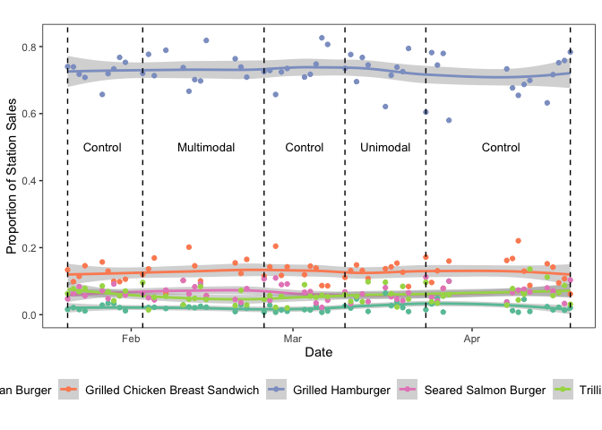<!-- -->

``` r
spring_data %>%
  filter(station=="Grill") %>%
  filter(item_cat=="Main") %>%
  group_by(phase_interval,station,item) %>%
  summarise(total_count=sum(count)) %>%
  mutate(prop=case_when(phase_interval=="1"~total_count/(25+135+814+72+76),
                        phase_interval=="2"~total_count/(30+193+1083+97+74),
                        phase_interval=="3"~total_count/(18+167+938+87+66),
                        phase_interval=="4"~total_count/(33+160+909+67+74),
                        phase_interval=="5"~total_count/(46+250+1352+130+125))) %>%
  filter(item=="Trillium Grill Impossible Burger")
```

    ## `summarise()` has grouped output by 'phase_interval', 'station'. You can
    ## override using the `.groups` argument.

    ## # A tibble: 5 × 5
    ## # Groups:   phase_interval, station [5]
    ##   phase_interval station item                             total_count   prop
    ##   <chr>          <chr>   <chr>                                  <int>  <dbl>
    ## 1 1              Grill   Trillium Grill Impossible Burger          76 0.0677
    ## 2 2              Grill   Trillium Grill Impossible Burger          74 0.0501
    ## 3 3              Grill   Trillium Grill Impossible Burger          66 0.0517
    ## 4 4              Grill   Trillium Grill Impossible Burger          74 0.0595
    ## 5 5              Grill   Trillium Grill Impossible Burger         125 0.0657

``` r
spring_data %>%
  filter(station=="Grill") %>%
  filter(item_cat=="Main") %>%
  group_by(phase_interval,station,item) %>%
  summarise(total_count=sum(count)) %>%
  mutate(prop=case_when(phase_interval=="1"~total_count/(25+135+814+72+76),
                        phase_interval=="2"~total_count/(30+193+1083+97+74),
                        phase_interval=="3"~total_count/(18+167+938+87+66),
                        phase_interval=="4"~total_count/(33+160+909+67+74),
                        phase_interval=="5"~total_count/(46+250+1352+130+125))) %>%
  filter(item=="Seared Salmon Burger")
```

    ## `summarise()` has grouped output by 'phase_interval', 'station'. You can
    ## override using the `.groups` argument.

    ## # A tibble: 5 × 5
    ## # Groups:   phase_interval, station [5]
    ##   phase_interval station item                 total_count   prop
    ##   <chr>          <chr>   <chr>                      <int>  <dbl>
    ## 1 1              Grill   Seared Salmon Burger          72 0.0642
    ## 2 2              Grill   Seared Salmon Burger          97 0.0657
    ## 3 3              Grill   Seared Salmon Burger          87 0.0682
    ## 4 4              Grill   Seared Salmon Burger          67 0.0539
    ## 5 5              Grill   Seared Salmon Burger         130 0.0683

``` r
spring_data %>%
  filter(station=="Grill") %>%
  filter(item_cat=="Main") %>%
  group_by(phase_interval,station,item) %>%
  summarise(total_count=sum(count)) %>%
  mutate(prop=case_when(phase_interval=="1"~total_count/(25+135+814+72+76),
                        phase_interval=="2"~total_count/(30+193+1083+97+74),
                        phase_interval=="3"~total_count/(18+167+938+87+66),
                        phase_interval=="4"~total_count/(33+160+909+67+74),
                        phase_interval=="5"~total_count/(46+250+1352+130+125))) %>%
  filter(item=="Grilled Chicken Breast Sandwich")
```

    ## `summarise()` has grouped output by 'phase_interval', 'station'. You can
    ## override using the `.groups` argument.

    ## # A tibble: 5 × 5
    ## # Groups:   phase_interval, station [5]
    ##   phase_interval station item                            total_count  prop
    ##   <chr>          <chr>   <chr>                                 <int> <dbl>
    ## 1 1              Grill   Grilled Chicken Breast Sandwich         135 0.120
    ## 2 2              Grill   Grilled Chicken Breast Sandwich         193 0.131
    ## 3 3              Grill   Grilled Chicken Breast Sandwich         167 0.131
    ## 4 4              Grill   Grilled Chicken Breast Sandwich         160 0.129
    ## 5 5              Grill   Grilled Chicken Breast Sandwich         250 0.131

``` r
spring_prop_middle_individual_chicken_aov_data <- spring_data %>%
  filter(station=="Grill") %>%
  filter(item_cat=="Main") %>%
  mutate(item=case_when(item=="Black Bean Burger"~"Lowest-Emitting Offering",
                        item=="Grilled Hamburger"~"Highest-Emitting Offering",
                        item=="Grilled Chicken Breast Sandwich"~"Chicken",
                        item=="Seared Salmon Burger"~"Salmon",
                        item=="Trillium Grill Impossible Burger"~"Impossible")) %>%
  group_by(date,phase_interval,station,item) %>%
  summarise(total_count=sum(count)) %>%
  mutate(prop=case_when(date=="10-Apr"~total_count/(90+6+35),
                        date=="10-Feb"~total_count/(101+4+32),
                        date=="10-Mar"~total_count/(86+3+28),
                        date=="11-Apr"~total_count/(72+1+30),
                        date=="11-Feb"~total_count/(86+3+40),
                        date=="11-Mar"~total_count/(118+3+31),
                        date=="12-Feb"~total_count/(101+3+40),
                        date=="12-Mar"~total_count/(89+6+33),
                        date=="13-Feb"~total_count/(83+3+33),
                        date=="13-Mar"~total_count/(99+30),
                        date=="14-Apr"~total_count/(79+3+43),
                        date=="14-Feb"~total_count/(72+2+14),
                        date=="14-Mar"~total_count/(76+1+25),
                        date=="15-Apr"~total_count/(101+2+38),
                        date=="16-Apr"~total_count/(103+3+31),
                        date=="17-Apr"~total_count/(113+2+34),
                        date=="17-Mar"~total_count/(77+8+39),
                        date=="18-Apr"~total_count/(76+2+19),
                        date=="18-Mar"~total_count/(80+3+29),
                        date=="19-Feb"~total_count/(84+1+25),
                        date=="19-Mar"~total_count/(96+5+29),
                        date=="20-Feb"~total_count/(102+4+32),
                        date=="20-Mar"~total_count/(103+3+36),
                        date=="21-Feb"~total_count/(73+2+28),
                        date=="21-Jan"~total_count/(94+2+31),
                        date=="21-Mar"~total_count/(85+1+21),
                        date=="22-Jan"~total_count/(105+3+34),
                        date=="23-Jan"~total_count/(94+2+35),
                        date=="24-Feb"~total_count/(95+1+35),
                        date=="24-Jan"~total_count/(63+1+25),
                        date=="24-Mar"~total_count/(81+2+51),
                        date=="25-Feb"~total_count/(102+4+34),
                        date=="25-Mar"~total_count/(122+5+29),
                        date=="26-Feb"~total_count/(90+1+46),
                        date=="26-Mar"~total_count/(108+7+30),
                        date=="27-Feb"~total_count/(105+2+38),
                        date=="27-Jan"~total_count/(92+4+44),
                        date=="27-Mar"~total_count/(99+1+27),
                        date=="28-Feb"~total_count/(72+1+25),
                        date=="28-Jan"~total_count/(105+5+36),
                        date=="28-Mar"~total_count/(29+5+16),
                        date=="29-Jan"~total_count/(88+4+28),
                        date=="3-Feb"~total_count/(90+35),
                        date=="3-Mar"~total_count/(95+2+37),
                        date=="30-Jan"~total_count/(109+3+30),
                        date=="31-Jan"~total_count/(64+1+20),
                        date=="4-Feb"~total_count/(108+3+28),
                        date=="4-Mar"~total_count/(104+2+39),
                        date=="5-Feb"~total_count/(97+3+36),
                        date=="5-Mar"~total_count/(86+3+26),
                        date=="6-Mar"~total_count/(114+1+23),
                        date=="7-Apr"~total_count/(77+4+24),
                        date=="7-Feb"~total_count/(86+2+21),
                        date=="7-Mar"~total_count/(75+1+17),
                        date=="8-Apr"~total_count/(113+2+52),
                        date=="9-Apr"~total_count/(89+1+46))) %>%
  filter(item=="Chicken"|item=="Salmon"|item=="Impossible") %>%
  mutate(date=case_when(date=="10-Apr"~"2025-4-10",
                        date=="10-Feb"~"2025-2-10",
                        date=="10-Mar"~"2025-3-10",
                        date=="11-Apr"~"2025-4-11",
                        date=="11-Feb"~"2025-2-11",
                        date=="11-Mar"~"2025-3-11",
                        date=="12-Feb"~"2025-2-12",
                        date=="12-Mar"~"2025-3-12",
                        date=="13-Feb"~"2025-2-13",
                        date=="13-Mar"~"2025-3-13",
                        date=="14-Apr"~"2025-4-14",
                        date=="14-Feb"~"2025-2-14",
                        date=="14-Mar"~"2025-3-14",
                        date=="15-Apr"~"2025-4-15",
                        date=="16-Apr"~"2025-4-16",
                        date=="17-Apr"~"2025-4-17",
                        date=="17-Mar"~"2025-3-17",
                        date=="18-Apr"~"2025-4-18",
                        date=="18-Mar"~"2025-3-18",
                        date=="19-Feb"~"2025-2-19",
                        date=="19-Mar"~"2025-3-19",
                        date=="20-Feb"~"2025-2-20",
                        date=="20-Mar"~"2025-3-20",
                        date=="21-Feb"~"2025-2-21",
                        date=="21-Jan"~"2025-1-21",
                        date=="21-Mar"~"2025-3-21",
                        date=="22-Jan"~"2025-1-22",
                        date=="23-Jan"~"2025-1-23",
                        date=="24-Feb"~"2025-2-24",
                        date=="24-Jan"~"2025-1-24",
                        date=="24-Mar"~"2025-3-24",
                        date=="25-Feb"~"2025-2-25",
                        date=="25-Mar"~"2025-3-25",
                        date=="26-Feb"~"2025-2-26",
                        date=="26-Mar"~"2025-3-26",
                        date=="27-Feb"~"2025-2-27",
                        date=="27-Jan"~"2025-1-27",
                        date=="27-Mar"~"2025-3-27",
                        date=="28-Feb"~"2025-2-28",
                        date=="28-Jan"~"2025-1-28",
                        date=="28-Mar"~"2025-3-28",
                        date=="29-Jan"~"2025-1-29",
                        date=="3-Feb"~"2025-2-3",
                        date=="3-Mar"~"2025-3-3",
                        date=="30-Jan"~"2025-1-30",
                        date=="31-Jan"~"2025-1-31",
                        date=="4-Feb"~"2025-2-4",
                        date=="4-Mar"~"2025-3-4",
                        date=="5-Feb"~"2025-2-5",
                        date=="5-Mar"~"2025-3-5",
                        date=="6-Feb"~"2025-2-6",
                        date=="6-Mar"~"2025-3-6",
                        date=="7-Apr"~"2025-4-7",
                        date=="7-Feb"~"2025-2-7",
                        date=="7-Mar"~"2025-3-7",
                        date=="8-Apr"~"2025-4-8",
                        date=="9-Apr"~"2025-4-9")) %>%
  mutate(date=as.Date(date)) %>%
  ungroup() %>%
  filter(item=="Chicken") %>%
  select(phase_interval,prop) %>%
  arrange(phase_interval)
```

    ## `summarise()` has grouped output by 'date', 'phase_interval', 'station'. You
    ## can override using the `.groups` argument.

``` r
oneway.test(prop~phase_interval,data=spring_prop_middle_individual_chicken_aov_data,var.equal=TRUE)
```

    ## 
    ##  One-way analysis of means
    ## 
    ## data:  prop and phase_interval
    ## F = 0.13059, num df = 4, denom df = 51, p-value = 0.9705

``` r
spring_prop_middle_individual_salmon_aov_data <- spring_data %>%
  filter(station=="Grill") %>%
  filter(item_cat=="Main") %>%
  mutate(item=case_when(item=="Black Bean Burger"~"Lowest-Emitting Offering",
                        item=="Grilled Hamburger"~"Highest-Emitting Offering",
                        item=="Grilled Chicken Breast Sandwich"~"Chicken",
                        item=="Seared Salmon Burger"~"Salmon",
                        item=="Trillium Grill Impossible Burger"~"Impossible")) %>%
  group_by(date,phase_interval,station,item) %>%
  summarise(total_count=sum(count)) %>%
  mutate(prop=case_when(date=="10-Apr"~total_count/(90+6+35),
                        date=="10-Feb"~total_count/(101+4+32),
                        date=="10-Mar"~total_count/(86+3+28),
                        date=="11-Apr"~total_count/(72+1+30),
                        date=="11-Feb"~total_count/(86+3+40),
                        date=="11-Mar"~total_count/(118+3+31),
                        date=="12-Feb"~total_count/(101+3+40),
                        date=="12-Mar"~total_count/(89+6+33),
                        date=="13-Feb"~total_count/(83+3+33),
                        date=="13-Mar"~total_count/(99+30),
                        date=="14-Apr"~total_count/(79+3+43),
                        date=="14-Feb"~total_count/(72+2+14),
                        date=="14-Mar"~total_count/(76+1+25),
                        date=="15-Apr"~total_count/(101+2+38),
                        date=="16-Apr"~total_count/(103+3+31),
                        date=="17-Apr"~total_count/(113+2+34),
                        date=="17-Mar"~total_count/(77+8+39),
                        date=="18-Apr"~total_count/(76+2+19),
                        date=="18-Mar"~total_count/(80+3+29),
                        date=="19-Feb"~total_count/(84+1+25),
                        date=="19-Mar"~total_count/(96+5+29),
                        date=="20-Feb"~total_count/(102+4+32),
                        date=="20-Mar"~total_count/(103+3+36),
                        date=="21-Feb"~total_count/(73+2+28),
                        date=="21-Jan"~total_count/(94+2+31),
                        date=="21-Mar"~total_count/(85+1+21),
                        date=="22-Jan"~total_count/(105+3+34),
                        date=="23-Jan"~total_count/(94+2+35),
                        date=="24-Feb"~total_count/(95+1+35),
                        date=="24-Jan"~total_count/(63+1+25),
                        date=="24-Mar"~total_count/(81+2+51),
                        date=="25-Feb"~total_count/(102+4+34),
                        date=="25-Mar"~total_count/(122+5+29),
                        date=="26-Feb"~total_count/(90+1+46),
                        date=="26-Mar"~total_count/(108+7+30),
                        date=="27-Feb"~total_count/(105+2+38),
                        date=="27-Jan"~total_count/(92+4+44),
                        date=="27-Mar"~total_count/(99+1+27),
                        date=="28-Feb"~total_count/(72+1+25),
                        date=="28-Jan"~total_count/(105+5+36),
                        date=="28-Mar"~total_count/(29+5+16),
                        date=="29-Jan"~total_count/(88+4+28),
                        date=="3-Feb"~total_count/(90+35),
                        date=="3-Mar"~total_count/(95+2+37),
                        date=="30-Jan"~total_count/(109+3+30),
                        date=="31-Jan"~total_count/(64+1+20),
                        date=="4-Feb"~total_count/(108+3+28),
                        date=="4-Mar"~total_count/(104+2+39),
                        date=="5-Feb"~total_count/(97+3+36),
                        date=="5-Mar"~total_count/(86+3+26),
                        date=="6-Mar"~total_count/(114+1+23),
                        date=="7-Apr"~total_count/(77+4+24),
                        date=="7-Feb"~total_count/(86+2+21),
                        date=="7-Mar"~total_count/(75+1+17),
                        date=="8-Apr"~total_count/(113+2+52),
                        date=="9-Apr"~total_count/(89+1+46))) %>%
  filter(item=="Chicken"|item=="Salmon"|item=="Impossible") %>%
  mutate(date=case_when(date=="10-Apr"~"2025-4-10",
                        date=="10-Feb"~"2025-2-10",
                        date=="10-Mar"~"2025-3-10",
                        date=="11-Apr"~"2025-4-11",
                        date=="11-Feb"~"2025-2-11",
                        date=="11-Mar"~"2025-3-11",
                        date=="12-Feb"~"2025-2-12",
                        date=="12-Mar"~"2025-3-12",
                        date=="13-Feb"~"2025-2-13",
                        date=="13-Mar"~"2025-3-13",
                        date=="14-Apr"~"2025-4-14",
                        date=="14-Feb"~"2025-2-14",
                        date=="14-Mar"~"2025-3-14",
                        date=="15-Apr"~"2025-4-15",
                        date=="16-Apr"~"2025-4-16",
                        date=="17-Apr"~"2025-4-17",
                        date=="17-Mar"~"2025-3-17",
                        date=="18-Apr"~"2025-4-18",
                        date=="18-Mar"~"2025-3-18",
                        date=="19-Feb"~"2025-2-19",
                        date=="19-Mar"~"2025-3-19",
                        date=="20-Feb"~"2025-2-20",
                        date=="20-Mar"~"2025-3-20",
                        date=="21-Feb"~"2025-2-21",
                        date=="21-Jan"~"2025-1-21",
                        date=="21-Mar"~"2025-3-21",
                        date=="22-Jan"~"2025-1-22",
                        date=="23-Jan"~"2025-1-23",
                        date=="24-Feb"~"2025-2-24",
                        date=="24-Jan"~"2025-1-24",
                        date=="24-Mar"~"2025-3-24",
                        date=="25-Feb"~"2025-2-25",
                        date=="25-Mar"~"2025-3-25",
                        date=="26-Feb"~"2025-2-26",
                        date=="26-Mar"~"2025-3-26",
                        date=="27-Feb"~"2025-2-27",
                        date=="27-Jan"~"2025-1-27",
                        date=="27-Mar"~"2025-3-27",
                        date=="28-Feb"~"2025-2-28",
                        date=="28-Jan"~"2025-1-28",
                        date=="28-Mar"~"2025-3-28",
                        date=="29-Jan"~"2025-1-29",
                        date=="3-Feb"~"2025-2-3",
                        date=="3-Mar"~"2025-3-3",
                        date=="30-Jan"~"2025-1-30",
                        date=="31-Jan"~"2025-1-31",
                        date=="4-Feb"~"2025-2-4",
                        date=="4-Mar"~"2025-3-4",
                        date=="5-Feb"~"2025-2-5",
                        date=="5-Mar"~"2025-3-5",
                        date=="6-Feb"~"2025-2-6",
                        date=="6-Mar"~"2025-3-6",
                        date=="7-Apr"~"2025-4-7",
                        date=="7-Feb"~"2025-2-7",
                        date=="7-Mar"~"2025-3-7",
                        date=="8-Apr"~"2025-4-8",
                        date=="9-Apr"~"2025-4-9")) %>%
  mutate(date=as.Date(date)) %>%
  ungroup() %>%
  filter(item=="Salmon") %>%
  select(phase_interval,prop) %>%
  arrange(phase_interval)
```

    ## `summarise()` has grouped output by 'date', 'phase_interval', 'station'. You
    ## can override using the `.groups` argument.

``` r
oneway.test(prop~phase_interval,data=spring_prop_middle_individual_salmon_aov_data,var.equal=TRUE)
```

    ## 
    ##  One-way analysis of means
    ## 
    ## data:  prop and phase_interval
    ## F = 0.84406, num df = 4, denom df = 51, p-value = 0.5038

``` r
spring_prop_middle_individual_impossible_aov_data <- spring_data %>%
  filter(station=="Grill") %>%
  filter(item_cat=="Main") %>%
  mutate(item=case_when(item=="Black Bean Burger"~"Lowest-Emitting Offering",
                        item=="Grilled Hamburger"~"Highest-Emitting Offering",
                        item=="Grilled Chicken Breast Sandwich"~"Chicken",
                        item=="Seared Salmon Burger"~"Salmon",
                        item=="Trillium Grill Impossible Burger"~"Impossible")) %>%
  group_by(date,phase_interval,station,item) %>%
  summarise(total_count=sum(count)) %>%
  mutate(prop=case_when(date=="10-Apr"~total_count/(90+6+35),
                        date=="10-Feb"~total_count/(101+4+32),
                        date=="10-Mar"~total_count/(86+3+28),
                        date=="11-Apr"~total_count/(72+1+30),
                        date=="11-Feb"~total_count/(86+3+40),
                        date=="11-Mar"~total_count/(118+3+31),
                        date=="12-Feb"~total_count/(101+3+40),
                        date=="12-Mar"~total_count/(89+6+33),
                        date=="13-Feb"~total_count/(83+3+33),
                        date=="13-Mar"~total_count/(99+30),
                        date=="14-Apr"~total_count/(79+3+43),
                        date=="14-Feb"~total_count/(72+2+14),
                        date=="14-Mar"~total_count/(76+1+25),
                        date=="15-Apr"~total_count/(101+2+38),
                        date=="16-Apr"~total_count/(103+3+31),
                        date=="17-Apr"~total_count/(113+2+34),
                        date=="17-Mar"~total_count/(77+8+39),
                        date=="18-Apr"~total_count/(76+2+19),
                        date=="18-Mar"~total_count/(80+3+29),
                        date=="19-Feb"~total_count/(84+1+25),
                        date=="19-Mar"~total_count/(96+5+29),
                        date=="20-Feb"~total_count/(102+4+32),
                        date=="20-Mar"~total_count/(103+3+36),
                        date=="21-Feb"~total_count/(73+2+28),
                        date=="21-Jan"~total_count/(94+2+31),
                        date=="21-Mar"~total_count/(85+1+21),
                        date=="22-Jan"~total_count/(105+3+34),
                        date=="23-Jan"~total_count/(94+2+35),
                        date=="24-Feb"~total_count/(95+1+35),
                        date=="24-Jan"~total_count/(63+1+25),
                        date=="24-Mar"~total_count/(81+2+51),
                        date=="25-Feb"~total_count/(102+4+34),
                        date=="25-Mar"~total_count/(122+5+29),
                        date=="26-Feb"~total_count/(90+1+46),
                        date=="26-Mar"~total_count/(108+7+30),
                        date=="27-Feb"~total_count/(105+2+38),
                        date=="27-Jan"~total_count/(92+4+44),
                        date=="27-Mar"~total_count/(99+1+27),
                        date=="28-Feb"~total_count/(72+1+25),
                        date=="28-Jan"~total_count/(105+5+36),
                        date=="28-Mar"~total_count/(29+5+16),
                        date=="29-Jan"~total_count/(88+4+28),
                        date=="3-Feb"~total_count/(90+35),
                        date=="3-Mar"~total_count/(95+2+37),
                        date=="30-Jan"~total_count/(109+3+30),
                        date=="31-Jan"~total_count/(64+1+20),
                        date=="4-Feb"~total_count/(108+3+28),
                        date=="4-Mar"~total_count/(104+2+39),
                        date=="5-Feb"~total_count/(97+3+36),
                        date=="5-Mar"~total_count/(86+3+26),
                        date=="6-Mar"~total_count/(114+1+23),
                        date=="7-Apr"~total_count/(77+4+24),
                        date=="7-Feb"~total_count/(86+2+21),
                        date=="7-Mar"~total_count/(75+1+17),
                        date=="8-Apr"~total_count/(113+2+52),
                        date=="9-Apr"~total_count/(89+1+46))) %>%
  filter(item=="Chicken"|item=="Salmon"|item=="Impossible") %>%
  mutate(date=case_when(date=="10-Apr"~"2025-4-10",
                        date=="10-Feb"~"2025-2-10",
                        date=="10-Mar"~"2025-3-10",
                        date=="11-Apr"~"2025-4-11",
                        date=="11-Feb"~"2025-2-11",
                        date=="11-Mar"~"2025-3-11",
                        date=="12-Feb"~"2025-2-12",
                        date=="12-Mar"~"2025-3-12",
                        date=="13-Feb"~"2025-2-13",
                        date=="13-Mar"~"2025-3-13",
                        date=="14-Apr"~"2025-4-14",
                        date=="14-Feb"~"2025-2-14",
                        date=="14-Mar"~"2025-3-14",
                        date=="15-Apr"~"2025-4-15",
                        date=="16-Apr"~"2025-4-16",
                        date=="17-Apr"~"2025-4-17",
                        date=="17-Mar"~"2025-3-17",
                        date=="18-Apr"~"2025-4-18",
                        date=="18-Mar"~"2025-3-18",
                        date=="19-Feb"~"2025-2-19",
                        date=="19-Mar"~"2025-3-19",
                        date=="20-Feb"~"2025-2-20",
                        date=="20-Mar"~"2025-3-20",
                        date=="21-Feb"~"2025-2-21",
                        date=="21-Jan"~"2025-1-21",
                        date=="21-Mar"~"2025-3-21",
                        date=="22-Jan"~"2025-1-22",
                        date=="23-Jan"~"2025-1-23",
                        date=="24-Feb"~"2025-2-24",
                        date=="24-Jan"~"2025-1-24",
                        date=="24-Mar"~"2025-3-24",
                        date=="25-Feb"~"2025-2-25",
                        date=="25-Mar"~"2025-3-25",
                        date=="26-Feb"~"2025-2-26",
                        date=="26-Mar"~"2025-3-26",
                        date=="27-Feb"~"2025-2-27",
                        date=="27-Jan"~"2025-1-27",
                        date=="27-Mar"~"2025-3-27",
                        date=="28-Feb"~"2025-2-28",
                        date=="28-Jan"~"2025-1-28",
                        date=="28-Mar"~"2025-3-28",
                        date=="29-Jan"~"2025-1-29",
                        date=="3-Feb"~"2025-2-3",
                        date=="3-Mar"~"2025-3-3",
                        date=="30-Jan"~"2025-1-30",
                        date=="31-Jan"~"2025-1-31",
                        date=="4-Feb"~"2025-2-4",
                        date=="4-Mar"~"2025-3-4",
                        date=="5-Feb"~"2025-2-5",
                        date=="5-Mar"~"2025-3-5",
                        date=="6-Feb"~"2025-2-6",
                        date=="6-Mar"~"2025-3-6",
                        date=="7-Apr"~"2025-4-7",
                        date=="7-Feb"~"2025-2-7",
                        date=="7-Mar"~"2025-3-7",
                        date=="8-Apr"~"2025-4-8",
                        date=="9-Apr"~"2025-4-9")) %>%
  mutate(date=as.Date(date)) %>%
  ungroup() %>%
  filter(item=="Impossible") %>%
  select(phase_interval,prop) %>%
  arrange(phase_interval)
```

    ## `summarise()` has grouped output by 'date', 'phase_interval', 'station'. You
    ## can override using the `.groups` argument.

``` r
oneway.test(prop~phase_interval,data=spring_prop_middle_individual_impossible_aov_data,var.equal=TRUE)
```

    ## 
    ##  One-way analysis of means
    ## 
    ## data:  prop and phase_interval
    ## F = 1.2527, num df = 4, denom df = 51, p-value = 0.3007

``` r
spring_prop_middle_individual <- spring_data %>%
  filter(station=="Grill") %>%
  filter(item_cat=="Main") %>%
  mutate(item=case_when(item=="Black Bean Burger"~"Lowest-Emitting Offering",
                        item=="Grilled Hamburger"~"Highest-Emitting Offering",
                        item=="Grilled Chicken Breast Sandwich"~"Chicken",
                        item=="Seared Salmon Burger"~"Salmon",
                        item=="Trillium Grill Impossible Burger"~"Impossible")) %>%
  group_by(date,phase_interval,station,item) %>%
  summarise(total_count=sum(count)) %>%
  mutate(prop=case_when(date=="10-Apr"~total_count/(90+6+35),
                        date=="10-Feb"~total_count/(101+4+32),
                        date=="10-Mar"~total_count/(86+3+28),
                        date=="11-Apr"~total_count/(72+1+30),
                        date=="11-Feb"~total_count/(86+3+40),
                        date=="11-Mar"~total_count/(118+3+31),
                        date=="12-Feb"~total_count/(101+3+40),
                        date=="12-Mar"~total_count/(89+6+33),
                        date=="13-Feb"~total_count/(83+3+33),
                        date=="13-Mar"~total_count/(99+30),
                        date=="14-Apr"~total_count/(79+3+43),
                        date=="14-Feb"~total_count/(72+2+14),
                        date=="14-Mar"~total_count/(76+1+25),
                        date=="15-Apr"~total_count/(101+2+38),
                        date=="16-Apr"~total_count/(103+3+31),
                        date=="17-Apr"~total_count/(113+2+34),
                        date=="17-Mar"~total_count/(77+8+39),
                        date=="18-Apr"~total_count/(76+2+19),
                        date=="18-Mar"~total_count/(80+3+29),
                        date=="19-Feb"~total_count/(84+1+25),
                        date=="19-Mar"~total_count/(96+5+29),
                        date=="20-Feb"~total_count/(102+4+32),
                        date=="20-Mar"~total_count/(103+3+36),
                        date=="21-Feb"~total_count/(73+2+28),
                        date=="21-Jan"~total_count/(94+2+31),
                        date=="21-Mar"~total_count/(85+1+21),
                        date=="22-Jan"~total_count/(105+3+34),
                        date=="23-Jan"~total_count/(94+2+35),
                        date=="24-Feb"~total_count/(95+1+35),
                        date=="24-Jan"~total_count/(63+1+25),
                        date=="24-Mar"~total_count/(81+2+51),
                        date=="25-Feb"~total_count/(102+4+34),
                        date=="25-Mar"~total_count/(122+5+29),
                        date=="26-Feb"~total_count/(90+1+46),
                        date=="26-Mar"~total_count/(108+7+30),
                        date=="27-Feb"~total_count/(105+2+38),
                        date=="27-Jan"~total_count/(92+4+44),
                        date=="27-Mar"~total_count/(99+1+27),
                        date=="28-Feb"~total_count/(72+1+25),
                        date=="28-Jan"~total_count/(105+5+36),
                        date=="28-Mar"~total_count/(29+5+16),
                        date=="29-Jan"~total_count/(88+4+28),
                        date=="3-Feb"~total_count/(90+35),
                        date=="3-Mar"~total_count/(95+2+37),
                        date=="30-Jan"~total_count/(109+3+30),
                        date=="31-Jan"~total_count/(64+1+20),
                        date=="4-Feb"~total_count/(108+3+28),
                        date=="4-Mar"~total_count/(104+2+39),
                        date=="5-Feb"~total_count/(97+3+36),
                        date=="5-Mar"~total_count/(86+3+26),
                        date=="6-Mar"~total_count/(114+1+23),
                        date=="7-Apr"~total_count/(77+4+24),
                        date=="7-Feb"~total_count/(86+2+21),
                        date=="7-Mar"~total_count/(75+1+17),
                        date=="8-Apr"~total_count/(113+2+52),
                        date=="9-Apr"~total_count/(89+1+46))) %>%
  filter(item=="Chicken"|item=="Salmon"|item=="Impossible") %>%
  mutate(date=case_when(date=="10-Apr"~"2025-4-10",
                        date=="10-Feb"~"2025-2-10",
                        date=="10-Mar"~"2025-3-10",
                        date=="11-Apr"~"2025-4-11",
                        date=="11-Feb"~"2025-2-11",
                        date=="11-Mar"~"2025-3-11",
                        date=="12-Feb"~"2025-2-12",
                        date=="12-Mar"~"2025-3-12",
                        date=="13-Feb"~"2025-2-13",
                        date=="13-Mar"~"2025-3-13",
                        date=="14-Apr"~"2025-4-14",
                        date=="14-Feb"~"2025-2-14",
                        date=="14-Mar"~"2025-3-14",
                        date=="15-Apr"~"2025-4-15",
                        date=="16-Apr"~"2025-4-16",
                        date=="17-Apr"~"2025-4-17",
                        date=="17-Mar"~"2025-3-17",
                        date=="18-Apr"~"2025-4-18",
                        date=="18-Mar"~"2025-3-18",
                        date=="19-Feb"~"2025-2-19",
                        date=="19-Mar"~"2025-3-19",
                        date=="20-Feb"~"2025-2-20",
                        date=="20-Mar"~"2025-3-20",
                        date=="21-Feb"~"2025-2-21",
                        date=="21-Jan"~"2025-1-21",
                        date=="21-Mar"~"2025-3-21",
                        date=="22-Jan"~"2025-1-22",
                        date=="23-Jan"~"2025-1-23",
                        date=="24-Feb"~"2025-2-24",
                        date=="24-Jan"~"2025-1-24",
                        date=="24-Mar"~"2025-3-24",
                        date=="25-Feb"~"2025-2-25",
                        date=="25-Mar"~"2025-3-25",
                        date=="26-Feb"~"2025-2-26",
                        date=="26-Mar"~"2025-3-26",
                        date=="27-Feb"~"2025-2-27",
                        date=="27-Jan"~"2025-1-27",
                        date=="27-Mar"~"2025-3-27",
                        date=="28-Feb"~"2025-2-28",
                        date=="28-Jan"~"2025-1-28",
                        date=="28-Mar"~"2025-3-28",
                        date=="29-Jan"~"2025-1-29",
                        date=="3-Feb"~"2025-2-3",
                        date=="3-Mar"~"2025-3-3",
                        date=="30-Jan"~"2025-1-30",
                        date=="31-Jan"~"2025-1-31",
                        date=="4-Feb"~"2025-2-4",
                        date=="4-Mar"~"2025-3-4",
                        date=="5-Feb"~"2025-2-5",
                        date=="5-Mar"~"2025-3-5",
                        date=="6-Feb"~"2025-2-6",
                        date=="6-Mar"~"2025-3-6",
                        date=="7-Apr"~"2025-4-7",
                        date=="7-Feb"~"2025-2-7",
                        date=="7-Mar"~"2025-3-7",
                        date=="8-Apr"~"2025-4-8",
                        date=="9-Apr"~"2025-4-9")) %>%
  mutate(date=as.Date(date)) %>%
  ggplot(aes(x=date,y=prop,color=item,fill=item)) + 
  geom_smooth(alpha=0.2) + 
  geom_point() +
  geom_vline(xintercept=as.numeric(daily_prop_spring_data$date[spring_vline]),linetype=2) + 
  xlab("Date") + 
  ylab("Proportion of Station Sales") +
  scale_color_manual(values=c("aquamarine4","mediumseagreen","darkgreen")) +
  scale_fill_manual(values=c("aquamarine4","mediumseagreen","darkgreen")) +
  scale_x_date(breaks=as.Date(c("2025-01-21","2025-02-03","2025-02-24","2025-03-10","2025-03-24","2025-04-18")),labels=c("Jan 21","Feb 3","Feb 24","Mar 10","Mar 24","Apr 18")) +
  labs(title="Grill Station (Treated)",fill="",color="",caption="Chicken: F(4,51)=0.13059, p=0.9705; Salmon: F(4,51)=0.84406, p=0.5038; Impossible: F(4,51)=1.2527, p=0.3007") +
  annotate("text",x=as.Date("2025-01-27"),y=0.185-0.01,label="Control",size=10/.pt) +
  annotate("text",x=as.Date("2025-02-14"),y=0.185-0.01,label="Multimodal",size=10/.pt) +
  annotate("text",x=as.Date("2025-03-03"),y=0.185-0.01,label="Control",size=10/.pt) +
  annotate("text",x=as.Date("2025-03-17"),y=0.185-0.01,label="Unimodal",size=10/.pt) +
  annotate("text",x=as.Date("2025-04-06"),y=0.185-0.01,label="Control",size=10/.pt) +
  theme(aspect.ratio=0.55,legend.position="bottom",panel.grid=element_blank(),panel.background=element_rect(fill="white"),panel.border=element_rect(fill=NA),legend.title=element_text(size=10),legend.text=element_text(size=10),plot.title=element_text(size=10),axis.title=element_text(size=10),axis.text=element_text(size=10)) 
```

    ## `summarise()` has grouped output by 'date', 'phase_interval', 'station'. You
    ## can override using the `.groups` argument.

``` r
spring_prop_middle_individual
```

    ## `geom_smooth()` using method = 'loess' and formula = 'y ~ x'

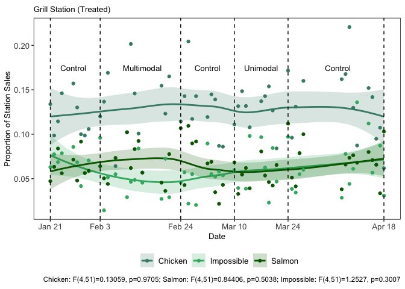<!-- -->

``` r
spring_prop_middle <- ggarrange(spring_prop_middle_aggregate,spring_prop_middle_individual,
          labels=c("A","B"))
```

    ## `geom_smooth()` using method = 'loess' and formula = 'y ~ x'
    ## `geom_smooth()` using method = 'loess' and formula = 'y ~ x'

``` r
spring_prop_middle <- annotate_figure(spring_prop_middle,top=text_grob("Daily Sales Percentages of Middle-Emitting Offerings (%)", 
               color="black",face="bold",size = 12))
ggsave(filename="spring_prop_middle.png",plot=spring_prop_middle,path="/Users/kenjinchang/github/multimodal-framework-validation/figures",width=34,height=12,units="cm",dpi=150,limitsize=TRUE)
spring_prop_middle
```

<!-- -->

``` r
fall_data %>%
  filter(station=="Pasta"|station=="Grill"|station=="Ramen") %>%
  filter(item_cat=="Main") %>%
  summarise(sum(count))
```

    ##   sum(count)
    ## 1      13837

``` r
spring_data %>%
  filter(station=="Pasta"|station=="Grill"|station=="Ramen") %>%
  filter(item_cat=="Main") %>%
  summarise(sum(count))
```

    ##   sum(count)
    ## 1      18894

``` r
fall_data %>%
  filter(station=="Pasta"|station=="Grill"|station=="Ramen") %>%
  filter(item_cat=="Main") %>%
  distinct(date)
```

    ##      date
    ## 1  16-Oct
    ## 2  17-Oct
    ## 3  18-Oct
    ## 4  21-Oct
    ## 5  22-Oct
    ## 6  23-Oct
    ## 7  24-Oct
    ## 8  25-Oct
    ## 9  28-Oct
    ## 10 29-Oct
    ## 11 30-Oct
    ## 12 31-Oct
    ## 13  1-Nov
    ## 14  4-Nov
    ## 15  5-Nov
    ## 16  6-Nov
    ## 17  7-Nov
    ## 18  8-Nov
    ## 19 11-Nov
    ## 20 12-Nov
    ## 21 13-Nov
    ## 22 14-Nov
    ## 23 15-Nov
    ## 24 18-Nov
    ## 25 19-Nov
    ## 26 20-Nov
    ## 27 21-Nov
    ## 28 22-Nov
    ## 29 25-Nov
    ## 30 26-Nov
    ## 31  2-Dec
    ## 32  3-Dec
    ## 33  4-Dec
    ## 34  5-Dec
    ## 35  6-Dec
    ## 36  9-Dec
    ## 37 10-Dec
    ## 38 11-Dec
    ## 39 12-Dec
    ## 40 13-Dec
    ## 41 16-Dec
    ## 42 17-Dec
    ## 43 18-Dec
    ## 44 19-Dec
    ## 45 20-Dec

``` r
spring_data %>%
  filter(station=="Pasta"|station=="Grill"|station=="Ramen") %>%
  filter(item_cat=="Main") %>%
  distinct(date)
```

    ##      date
    ## 1  21-Jan
    ## 2  22-Jan
    ## 3  23-Jan
    ## 4  24-Jan
    ## 5  27-Jan
    ## 6  28-Jan
    ## 7  29-Jan
    ## 8  30-Jan
    ## 9  31-Jan
    ## 10  3-Feb
    ## 11  4-Feb
    ## 12  5-Feb
    ## 13  6-Feb
    ## 14  7-Feb
    ## 15 10-Feb
    ## 16 11-Feb
    ## 17 12-Feb
    ## 18 13-Feb
    ## 19 14-Feb
    ## 20 19-Feb
    ## 21 20-Feb
    ## 22 21-Feb
    ## 23 24-Feb
    ## 24 25-Feb
    ## 25 26-Feb
    ## 26 27-Feb
    ## 27 28-Feb
    ## 28  3-Mar
    ## 29  4-Mar
    ## 30  5-Mar
    ## 31  6-Mar
    ## 32  7-Mar
    ## 33 10-Mar
    ## 34 11-Mar
    ## 35 12-Mar
    ## 36 13-Mar
    ## 37 14-Mar
    ## 38 17-Mar
    ## 39 18-Mar
    ## 40 19-Mar
    ## 41 20-Mar
    ## 42 21-Mar
    ## 43 24-Mar
    ## 44 25-Mar
    ## 45 26-Mar
    ## 46 27-Mar
    ## 47 28-Mar
    ## 48  7-Apr
    ## 49  8-Apr
    ## 50  9-Apr
    ## 51 10-Apr
    ## 52 11-Apr
    ## 53 14-Apr
    ## 54 15-Apr
    ## 55 16-Apr
    ## 56 17-Apr
    ## 57 18-Apr

``` r
fall_data %>%
  distinct(item)
```

    ##                                item
    ## 1        Quesadilla Deluxe Trillium
    ## 2                 Grilled Hamburger
    ## 3             Fried Chicken Tenders
    ## 4     Burrito Una Mano Trillium BYO
    ## 5                      French Fries
    ## 6                 Quesadilla Cheese
    ## 7   Grilled Chicken Breast Sandwich
    ## 8              Seared Salmon Burger
    ## 9  Trillium Grill Impossible Burger
    ## 10               Sweet Potato Fries
    ## 11                     + Beef Patty
    ## 12                Black Bean Burger
    ## 13      Add Impossible Burger Patty
    ## 14                      Add Egg .99
    ## 15                       ADD Cheese
    ## 16              Add Sausage 2 Patty
    ## 17        ADD Burger Salmon Grilled
    ## 18                1 Entree + 1 Side
    ## 19                1 Entree + 2 Side
    ## 20               Bowl Ramen Chicken
    ## 21              2 Entrees + 2 Sides
    ## 22                  Bowl Ramen Tofu
    ## 23          Side Vegetarian Lo Mein
    ## 24           Side Fried Spring Roll
    ## 25         Side White or Brown Rice
    ## 26      Side Vegetable Spring Rolls
    ## 27                     1 Wok Entree
    ## 28                  Side Vegetables
    ## 29  Side Vegetarian Fried Rice with
    ## 30      Create Your Pasta Bowl MEAT
    ## 31       Create Your Pasta Bowl VEG
    ## 32                     Pizza Cheese
    ## 33                   Add Extra Meat
    ## 34              Pizza with Toppings
    ## 35         Side Bread Pasta Station
    ## 36                Burrito Breakfast
    ## 37              Small French Omelet
    ## 38 Egg Cheese Sausage Breakfast San
    ## 39 Egg Cheese Bacon Breakfast Sandw
    ## 40             Grand Slam Breakfast
    ## 41                        Add Bacon
    ## 42                         Two Eggs
    ## 43                   Pancake Single
    ## 44                   2 Slices Toast
    ## 45              Trillium Home Fries
    ## 46                 Burrito Bowl BYO
    ## 47                      Single Taco
    ## 48                  Side Sour Cream
    ## 49               Salad by the Pound
    ## 50           Add Extra Protein 2.99
    ## 51                       Soup 12 oz
    ## 52                        8 oz Soup
    ## 53                 Side Potato Tots
    ## 54               ADD Chicken Breast
    ## 55                            Toast
    ## 56                   Side Guacamole
    ## 57                       Side Salsa
    ## 58      Add Extra Toppings Una Mano
    ## 59                         PC Jelly
    ## 60                 PC Peanut Butter
    ## 61               Add Extra Toppings

REVISE FIGURE NAMING NOMENCLATURE from semester-station-outcome TO
SEMESTER-OUTCOME-STATION

We’ll need to do checks to see whether there are differences in the
purchase of different item categories across menu conditions, whether
there are differences in the sales total across menu conditions,
differences in the number of observation days across menu conditions,
differences in the daily sales average across menu conditions

Spillover within meal period and between meal period

also look at diminishing effects over time by looking at outcomes at day
level, not just by period

PROP MIDDLE STUFF

``` r
grill_prop_middle_s2 <- daily_prop_spring_data %>%
  filter(item=="Grilled Chicken Breast Sandwich"|item=="Seared Salmon Burger"|item=="Trillium Grill Impossible Burger") %>%
  ggplot(aes(x=date,y=prop,color=item)) + 
  geom_smooth() +
  geom_point() + 
  geom_vline(xintercept=as.numeric(daily_prop_spring_data$date[spring_vline]),linetype=2) + 
  scale_color_brewer(palette="Set2") + 
  xlab("Date") + 
  ylab("Proportion of Station Sales") + 
  theme(aspect.ratio=0.55,legend.position="bottom",panel.grid=element_blank(),panel.background=element_rect(fill="white"),panel.border=element_rect(fill=NA),legend.title=element_text(size=10),legend.text=element_text(size=10),plot.title=element_text(size=10)) + 
  annotate("text",x=as.Date("2025-01-27"),y=0.175,label="Control",size=10/.pt) +
  annotate("text",x=as.Date("2025-02-14"),y=0.175,label="Multimodal",size=10/.pt) +
  annotate("text",x=as.Date("2025-03-03"),y=0.175,label="Control",size=10/.pt) +
  annotate("text",x=as.Date("2025-03-17"),y=0.175,label="Unimodal",size=10/.pt) +
  annotate("text",x=as.Date("2025-04-06"),y=0.175,label="Control",size=10/.pt) 
grill_prop_middle_s2
```

    ## `geom_smooth()` using method = 'loess' and formula = 'y ~ x'

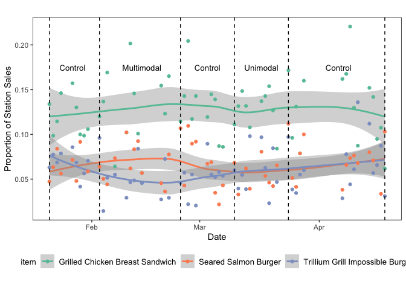<!-- -->

``` r
daily_prop_spring_data %>%
  ggplot(aes(x=date,y=prop,color=item)) + 
  geom_smooth() +
  geom_point() + 
  geom_vline(xintercept=as.numeric(daily_prop_spring_data$date[spring_vline]),linetype=2) + 
  scale_color_brewer(palette="Set2") + 
  xlab("Date") + 
  ylab("Proportion of Station Sales") + 
  theme(aspect.ratio=0.55,legend.position="bottom",panel.grid=element_blank(),panel.background=element_rect(fill="white"),panel.border=element_rect(fill=NA),legend.title=element_text(size=10),legend.text=element_text(size=10),plot.title=element_text(size=10)) + 
  annotate("text",x=as.Date("2025-01-27"),y=0.5,label="Control",size=10/.pt) +
  annotate("text",x=as.Date("2025-02-14"),y=0.5,label="Multimodal",size=10/.pt) +
  annotate("text",x=as.Date("2025-03-03"),y=0.5,label="Control",size=10/.pt) +
  annotate("text",x=as.Date("2025-03-17"),y=0.5,label="Unimodal",size=10/.pt) +
  annotate("text",x=as.Date("2025-04-06"),y=0.5,label="Control",size=10/.pt) 
```

    ## `geom_smooth()` using method = 'loess' and formula = 'y ~ x'

<!-- -->

## Preliminary Checks

need to figure out modifications sales between periods because that
changes the denominator

``` r
fall_data %>%
  filter(station=="Grill") %>%
  group_by(menu_condition,item_cat) %>%
  summarise(sum(count)) 
```

    ## `summarise()` has grouped output by 'menu_condition'. You can override using
    ## the `.groups` argument.

    ## # A tibble: 12 × 3
    ## # Groups:   menu_condition [4]
    ##    menu_condition item_cat     `sum(count)`
    ##    <chr>          <chr>               <int>
    ##  1 Carbon Label   Main                 1285
    ##  2 Carbon Label   Modification          259
    ##  3 Carbon Label   Side                 1506
    ##  4 Control        Main                 1048
    ##  5 Control        Modification          203
    ##  6 Control        Side                 1143
    ##  7 Default        Main                 1270
    ##  8 Default        Modification          271
    ##  9 Default        Side                 1431
    ## 10 Multimodal     Main                 1595
    ## 11 Multimodal     Modification          353
    ## 12 Multimodal     Side                 1758

### Between-Condition Observational Differences

We’ll first evaluate the differences in the number of observation days
and sales counts across study periods.

- Differences in the number of observation days across menu conditions:

menu_condition

``` r
fall_data %>%
  group_by(menu_condition,date) %>%
  summarise(count=n()) %>%
  mutate(day_count=1) %>%
  summarise(observation_days=sum(day_count))
```

    ## `summarise()` has grouped output by 'menu_condition'. You can override using
    ## the `.groups` argument.

    ## # A tibble: 4 × 2
    ##   menu_condition observation_days
    ##   <chr>                     <dbl>
    ## 1 Carbon Label                 10
    ## 2 Control                       8
    ## 3 Default                      10
    ## 4 Multimodal                   17

- Differences in global sales volume across menu conditions:

``` r
fall_data %>%
  group_by(menu_condition,date) %>%
  summarise(count=n()) %>%
  group_by(menu_condition) %>%
  summarise(sales_count=sum(count))
```

    ## `summarise()` has grouped output by 'menu_condition'. You can override using
    ## the `.groups` argument.

    ## # A tibble: 4 × 2
    ##   menu_condition sales_count
    ##   <chr>                <int>
    ## 1 Carbon Label           505
    ## 2 Control                409
    ## 3 Default                499
    ## 4 Multimodal             801

- Daily Sales volume

### Grill - Mains - Prop

``` r
fall_data %>%
  filter(menu_condition=="Control") %>%
  filter(station=="Grill") %>%
  filter(item_cat=="Main") %>%
  group_by(item) %>%
  summarise(item_count=sum(count)) %>%
  mutate(prop=item_count/(19+125+776+68+60)) %>%
  mutate(condition="Control")
```

    ## # A tibble: 5 × 4
    ##   item                             item_count   prop condition
    ##   <chr>                                 <int>  <dbl> <chr>    
    ## 1 Black Bean Burger                        19 0.0181 Control  
    ## 2 Grilled Chicken Breast Sandwich         125 0.119  Control  
    ## 3 Grilled Hamburger                       776 0.740  Control  
    ## 4 Seared Salmon Burger                     68 0.0649 Control  
    ## 5 Trillium Grill Impossible Burger         60 0.0573 Control

``` r
fall_data %>%
  filter(menu_condition=="Carbon Label") %>%
  filter(station=="Grill") %>%
  filter(item_cat=="Main") %>%
  group_by(item) %>%
  summarise(item_count=sum(count)) %>%
  mutate(prop=item_count/(32+159+935+74+85)) %>%
  mutate(condition="Carbon Label")
```

    ## # A tibble: 5 × 4
    ##   item                             item_count   prop condition   
    ##   <chr>                                 <int>  <dbl> <chr>       
    ## 1 Black Bean Burger                        32 0.0249 Carbon Label
    ## 2 Grilled Chicken Breast Sandwich         159 0.124  Carbon Label
    ## 3 Grilled Hamburger                       935 0.728  Carbon Label
    ## 4 Seared Salmon Burger                     74 0.0576 Carbon Label
    ## 5 Trillium Grill Impossible Burger         85 0.0661 Carbon Label

``` r
fall_data %>%
  filter(menu_condition=="Default") %>%
  filter(station=="Grill") %>%
  filter(item_cat=="Main") %>%
  group_by(item) %>%
  summarise(item_count=sum(count)) %>%
  mutate(prop=item_count/(33+167+904+76+90)) %>%
  mutate(condition="Default")
```

    ## # A tibble: 5 × 4
    ##   item                             item_count   prop condition
    ##   <chr>                                 <int>  <dbl> <chr>    
    ## 1 Black Bean Burger                        33 0.0260 Default  
    ## 2 Grilled Chicken Breast Sandwich         167 0.131  Default  
    ## 3 Grilled Hamburger                       904 0.712  Default  
    ## 4 Seared Salmon Burger                     76 0.0598 Default  
    ## 5 Trillium Grill Impossible Burger         90 0.0709 Default

``` r
fall_data %>%
  filter(menu_condition=="Multimodal") %>%
  filter(station=="Grill") %>%
  filter(item_cat=="Main") %>%
  group_by(item) %>%
  summarise(item_count=sum(count)) %>%
  mutate(prop=item_count/(27+84+624+59+50)) %>%
  mutate(condition="Multimodal")
```

    ## # A tibble: 5 × 4
    ##   item                             item_count   prop condition 
    ##   <chr>                                 <int>  <dbl> <chr>     
    ## 1 Black Bean Burger                        41 0.0486 Multimodal
    ## 2 Grilled Chicken Breast Sandwich         165 0.195  Multimodal
    ## 3 Grilled Hamburger                      1157 1.37   Multimodal
    ## 4 Seared Salmon Burger                    125 0.148  Multimodal
    ## 5 Trillium Grill Impossible Burger        107 0.127  Multimodal

``` r
fall_data %>%
  filter(menu_condition=="Multimodal (Extra)") %>%
  filter(station=="Grill") %>%
  filter(item_cat=="Main") %>%
  group_by(item) %>%
  summarise(item_count=sum(count)) %>%
  mutate(prop=item_count/(14+81+533+66+57)) %>%
  mutate(condition="Multimodal (Extra)")
```

    ## # A tibble: 0 × 4
    ## # ℹ 4 variables: item <chr>, item_count <int>, prop <dbl>, condition <chr>

``` r
fall_data %>%
  filter(menu_condition=="Multimodal (Extra)"| menu_condition=="Multimodal") %>%
  filter(station=="Grill") %>%
  filter(item_cat=="Main") %>%
  group_by(item) %>%
  summarise(item_count=sum(count)) %>%
  mutate(prop=item_count/(41+165+1157+125+107)) %>%
  mutate(condition="Multimodal (Full)")
```

    ## # A tibble: 5 × 4
    ##   item                             item_count   prop condition        
    ##   <chr>                                 <int>  <dbl> <chr>            
    ## 1 Black Bean Burger                        41 0.0257 Multimodal (Full)
    ## 2 Grilled Chicken Breast Sandwich         165 0.103  Multimodal (Full)
    ## 3 Grilled Hamburger                      1157 0.725  Multimodal (Full)
    ## 4 Seared Salmon Burger                    125 0.0784 Multimodal (Full)
    ## 5 Trillium Grill Impossible Burger        107 0.0671 Multimodal (Full)

### Ramen - Mains - Prop

``` r
fall_data %>%
  filter(menu_condition=="Control") %>%
  filter(station=="Ramen") %>%
  filter(item_cat=="Main") %>%
  group_by(item) %>%
  summarise(item_count=sum(count)) %>%
  mutate(prop=item_count/(563+108)) %>%
  mutate(condition="Control")
```

    ## # A tibble: 2 × 4
    ##   item               item_count  prop condition
    ##   <chr>                   <int> <dbl> <chr>    
    ## 1 Bowl Ramen Chicken        563 0.839 Control  
    ## 2 Bowl Ramen Tofu           108 0.161 Control

``` r
fall_data %>%
  filter(menu_condition=="Carbon Label") %>%
  filter(station=="Ramen") %>%
  filter(item_cat=="Main") %>%
  group_by(item) %>%
  summarise(item_count=sum(count)) %>%
  mutate(prop=item_count/(685+135)) %>%
  mutate(condition="Carbon Label")
```

    ## # A tibble: 2 × 4
    ##   item               item_count  prop condition   
    ##   <chr>                   <int> <dbl> <chr>       
    ## 1 Bowl Ramen Chicken        685 0.835 Carbon Label
    ## 2 Bowl Ramen Tofu           135 0.165 Carbon Label

``` r
fall_data %>%
  filter(menu_condition=="Default") %>%
  filter(station=="Ramen") %>%
  filter(item_cat=="Main") %>%
  group_by(item) %>%
  summarise(item_count=sum(count)) %>%
  mutate(prop=item_count/(698+172)) %>%
  mutate(condition="Default")
```

    ## # A tibble: 2 × 4
    ##   item               item_count  prop condition
    ##   <chr>                   <int> <dbl> <chr>    
    ## 1 Bowl Ramen Chicken        698 0.802 Default  
    ## 2 Bowl Ramen Tofu           172 0.198 Default

``` r
fall_data %>%
  filter(menu_condition=="Multimodal") %>%
  filter(station=="Ramen") %>%
  filter(item_cat=="Main") %>%
  group_by(item) %>%
  summarise(item_count=sum(count)) %>%
  mutate(prop=item_count/(483+109)) %>%
  mutate(condition="Multimodal")
```

    ## # A tibble: 2 × 4
    ##   item               item_count  prop condition 
    ##   <chr>                   <int> <dbl> <chr>     
    ## 1 Bowl Ramen Chicken        860 1.45  Multimodal
    ## 2 Bowl Ramen Tofu           182 0.307 Multimodal

``` r
fall_data %>%
  filter(menu_condition=="Multimodal (Extra)") %>%
  filter(station=="Ramen") %>%
  filter(item_cat=="Main") %>%
  group_by(item) %>%
  summarise(item_count=sum(count)) %>%
  mutate(prop=item_count/(377+73)) %>%
  mutate(condition="Multimodal (Extra)")
```

    ## # A tibble: 0 × 4
    ## # ℹ 4 variables: item <chr>, item_count <int>, prop <dbl>, condition <chr>

``` r
fall_data %>%
  filter(menu_condition=="Multimodal (Extra)" | menu_condition=="Multimodal") %>%
  filter(station=="Ramen") %>%
  filter(item_cat=="Main") %>%
  group_by(item) %>%
  summarise(item_count=sum(count)) %>%
  mutate(prop=item_count/(860+182)) %>%
  mutate(condition="Multimodal (Full)")
```

    ## # A tibble: 2 × 4
    ##   item               item_count  prop condition        
    ##   <chr>                   <int> <dbl> <chr>            
    ## 1 Bowl Ramen Chicken        860 0.825 Multimodal (Full)
    ## 2 Bowl Ramen Tofu           182 0.175 Multimodal (Full)

### Grill - Mains and Modifications - Prop

``` r
fall_data %>%
  filter(menu_condition=="Control") %>%
  filter(station=="Grill") %>%
  filter(item_cat=="Main" | item_cat=="Modification") %>%
  group_by(item) %>%
  summarise(item_count=sum(count)) 
```

    ## # A tibble: 12 × 2
    ##    item                             item_count
    ##    <chr>                                 <int>
    ##  1 + Beef Patty                             97
    ##  2 ADD Burger Salmon Grilled                 1
    ##  3 ADD Cheese                               45
    ##  4 ADD Chicken Breast                       21
    ##  5 Add Egg .99                              18
    ##  6 Add Impossible Burger Patty               1
    ##  7 Add Sausage 2 Patty                      20
    ##  8 Black Bean Burger                        19
    ##  9 Grilled Chicken Breast Sandwich         125
    ## 10 Grilled Hamburger                       776
    ## 11 Seared Salmon Burger                     68
    ## 12 Trillium Grill Impossible Burger         60

CONSIDER distance between highest-carbon offering and next-lowest
offering between stations Price relativity Number of veg options

``` r
fall_data %>%
  distinct(date)
```

    ##      date
    ## 1  16-Oct
    ## 2  17-Oct
    ## 3  18-Oct
    ## 4  21-Oct
    ## 5  22-Oct
    ## 6  23-Oct
    ## 7  24-Oct
    ## 8  25-Oct
    ## 9  28-Oct
    ## 10 29-Oct
    ## 11 30-Oct
    ## 12 31-Oct
    ## 13  1-Nov
    ## 14  4-Nov
    ## 15  5-Nov
    ## 16  6-Nov
    ## 17  7-Nov
    ## 18  8-Nov
    ## 19 11-Nov
    ## 20 12-Nov
    ## 21 13-Nov
    ## 22 14-Nov
    ## 23 15-Nov
    ## 24 18-Nov
    ## 25 19-Nov
    ## 26 20-Nov
    ## 27 21-Nov
    ## 28 22-Nov
    ## 29 25-Nov
    ## 30 26-Nov
    ## 31  2-Dec
    ## 32  3-Dec
    ## 33  4-Dec
    ## 34  5-Dec
    ## 35  6-Dec
    ## 36  9-Dec
    ## 37 10-Dec
    ## 38 11-Dec
    ## 39 12-Dec
    ## 40 13-Dec
    ## 41 16-Dec
    ## 42 17-Dec
    ## 43 18-Dec
    ## 44 19-Dec
    ## 45 20-Dec

``` r
spring_data %>%
  distinct(date)
```

    ##      date
    ## 1  21-Jan
    ## 2  22-Jan
    ## 3  23-Jan
    ## 4  24-Jan
    ## 5  27-Jan
    ## 6  28-Jan
    ## 7  29-Jan
    ## 8  30-Jan
    ## 9  31-Jan
    ## 10  3-Feb
    ## 11  4-Feb
    ## 12  5-Feb
    ## 13  6-Feb
    ## 14  7-Feb
    ## 15 10-Feb
    ## 16 11-Feb
    ## 17 12-Feb
    ## 18 13-Feb
    ## 19 14-Feb
    ## 20 19-Feb
    ## 21 20-Feb
    ## 22 21-Feb
    ## 23 24-Feb
    ## 24 25-Feb
    ## 25 26-Feb
    ## 26 27-Feb
    ## 27 28-Feb
    ## 28  3-Mar
    ## 29  4-Mar
    ## 30  5-Mar
    ## 31  6-Mar
    ## 32  7-Mar
    ## 33 10-Mar
    ## 34 11-Mar
    ## 35 12-Mar
    ## 36 13-Mar
    ## 37 14-Mar
    ## 38 17-Mar
    ## 39 18-Mar
    ## 40 19-Mar
    ## 41 20-Mar
    ## 42 21-Mar
    ## 43 24-Mar
    ## 44 25-Mar
    ## 45 26-Mar
    ## 46 27-Mar
    ## 47 28-Mar
    ## 48  7-Apr
    ## 49  8-Apr
    ## 50  9-Apr
    ## 51 10-Apr
    ## 52 11-Apr
    ## 53 14-Apr
    ## 54 15-Apr
    ## 55 16-Apr
    ## 56 17-Apr
    ## 57 18-Apr

``` r
fall_data %>%
  filter(station=="Grill"|station=="Ramen") %>%
  filter(item_cat=="Main") %>%
  summarise(sum(count))
```

    ##   sum(count)
    ## 1       8601

``` r
spring_data %>%
  filter(station=="Grill"|station=="Ramen") %>%
  filter(item_cat=="Main") %>%
  summarise(sum(count))
```

    ##   sum(count)
    ## 1      11873

differnce in carbon estiamte for highest and lowest number of options to
choose between

Sides and modifications not factored in currently

also measure spillover across other stations during same meal interval

measure spillover across other meal interval

### Foot Traffic

``` r
foot_traffic_data %>%
  select(date,time,count,menu_condition) %>%
  distinct(time)
```

    ##        time
    ## 1  10:00 AM
    ## 2  10:15 AM
    ## 3  10:30 AM
    ## 4  10:45 AM
    ## 5  11:00 AM
    ## 6  11:15 AM
    ## 7  11:30 AM
    ## 8  11:45 AM
    ## 9  12:00 PM
    ## 10 12:15 PM
    ## 11 12:30 PM
    ## 12 12:45 PM
    ## 13  1:00 PM
    ## 14  1:15 PM
    ## 15  1:30 PM
    ## 16  1:45 PM
    ## 17  2:00 PM
    ## 18  2:15 PM
    ## 19  2:30 PM
    ## 20  2:45 PM
    ## 21  3:00 PM
    ## 22  8:00 AM
    ## 23  8:15 AM
    ## 24  8:30 AM
    ## 25  8:45 AM
    ## 26  9:00 AM
    ## 27  9:15 AM
    ## 28  9:30 AM
    ## 29  9:45 AM
    ## 30  7:30 AM
    ## 31  7:45 AM
    ## 32  3:15 PM
    ## 33  7:15 AM
    ## 34  4:00 PM
    ## 35  6:15 AM
    ## 36  3:30 PM

``` r
foot_traffic_data %>%
  select(date,time,count,menu_condition) %>%
  group_by(menu_condition,time) %>%
  summarise(transaction_volume=mean(count)) 
```

    ## `summarise()` has grouped output by 'menu_condition'. You can override using
    ## the `.groups` argument.

    ## # A tibble: 98 × 3
    ## # Groups:   menu_condition [3]
    ##    menu_condition time     transaction_volume
    ##    <chr>          <chr>                 <dbl>
    ##  1 Control        10:00 AM              44.5 
    ##  2 Control        10:15 AM              27.7 
    ##  3 Control        10:30 AM               8.82
    ##  4 Control        10:45 AM              14.0 
    ##  5 Control        11:00 AM              97.6 
    ##  6 Control        11:15 AM              91.5 
    ##  7 Control        11:30 AM             126.  
    ##  8 Control        11:45 AM              88.4 
    ##  9 Control        12:00 PM             106.  
    ## 10 Control        12:15 PM             140.  
    ## # ℹ 88 more rows

``` r
head(5)
```

    ## [1] 5

``` r
foot_traffic_data %>%
  select(date,time,count,menu_condition) %>%
  group_by(menu_condition,time) %>%
  summarise(transaction_volume=mean(count)) %>%
  ggplot(aes(x=time,y=transaction_volume,fill=menu_condition)) + 
  geom_col(position="dodge") +
  scale_x_discrete(limits=c("6:15 AM","6:30 AM","6:45 AM","7:00 AM","7:15 AM","7:30 AM","7:45 AM","8:00 AM","8:15 AM","8:30 AM","8:45 AM","9:00 AM","9:15 AM","9:30 AM","9:45 AM","10:00 AM","10:15 AM","10:30 AM","10:45 AM","11:00 AM","11:15 AM","11:30 AM","11:45 AM","12:00 PM","12:15 PM","12:30 PM","12:45 PM","1:00 PM","1:15 PM","1:30 PM","1:45 PM","2:00 PM","2:15 PM","2:30 PM","2:45 PM","3:00 PM","3:15 PM","3:30 PM","3:45 PM","4:00 PM"))
```

    ## `summarise()` has grouped output by 'menu_condition'. You can override using
    ## the `.groups` argument.

<!-- -->

sales_data %\>% mutate(item_cat=case_when(item==“Quesadilla Deluxe
Trillium”~“Main”, item==“Grilled Hamburger”~“Main”, item==“Fried Chicken
Tenders”~“Main”, item==“Burrito Una Mano Trillium BYO”~“Main”,
item==“French Fries”~“Side”, item==“Quesadilla Cheese”~“Ma
